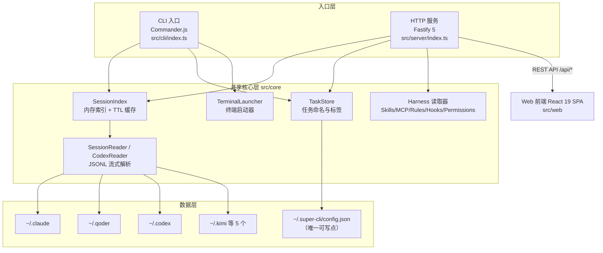

本页是整套文档的起点：用最小的认知成本讲清楚 super-cli 的定位、它解决的真实痛点、整体架构长什么样，以及你作为初学者应该按什么顺序深入。读完本页，你应该能回答三个问题——"这是什么工具"、"为什么需要它"、"代码是怎么组织的"。

## 一句话定位：AI 编程助手的历史会话管理工具

**super-cli 是一个统一管理八款 AI 编程 CLI 工具历史对话的本地工具**，它把这些散落在各家工具私有目录里的会话数据（session）聚合起来，提供**命令行**和 **Web 看板**两种交互方式。这八款工具是：Claude Code、Qoder、Codex、Kimi CLI、Pi、OpenCode、WorkBuddy 和 TraeCode。项目以 npm 包 `@bluesky8318/super-cli` 发布（当前版本 0.2.1），全局安装后即可通过 `super-cli` 命令使用，本质上是一个 Node.js（≥22）ESM 项目。

Sources: [README.md](README.md#L1-L3)、[package.json](package.json#L1-L7)

## 它解决什么问题：八个数据孤岛

要理解 super-cli 的价值，先看一个真实场景：你同时使用 Claude Code 和 Codex 干活，几周下来积累了上百个会话——它们分别躺在 `~/.claude/projects/` 和 `~/.codex/sessions/` 里，格式各不相同，且都是原始 JSONL 流文件。此时你想回答几个朴素的问题就变得很困难："上周那个重构认证模块的会话在哪？""我总共用了多少 token？""能否给重要的会话起个名字当任务管理？"

super-cli 的答案是把这些问题变成一条命令或一次点击。它解决的问题可以归纳为四类：

| 痛点 | 现状（无 super-cli） | super-cli 的方案 |
|---|---|---|
| **会话分散** | 8 款工具各存各的目录，互相不通 | 统一扫描 + 聚合索引，`--provider` 参数可选过滤 |
| **格式不可读** | 原始 JSONL 文件，人类无法直接阅读 | 流式解析为结构化消息，终端表格 / Web 详情面板展示 |
| **无法命名与检索** | 会话只有 UUID，找历史全靠记忆 | ID 前缀匹配、跨会话全文搜索、命名/打标签当任务管理 |
| **缺少度量** | 不知道 token 用量、模型分布 | `stats` 命令按模型/项目/日期统计，支持 `--json` 输出 |

Sources: [README.md](README.md#L7-L43)、[README.md](README.md#L147-L156)

每款工具的数据位置由一个**静态注册表**统一描述。`src/core/providers.ts` 中的 `PROVIDER_CONFIGS` 数组为每个 provider 定义了五项关键信息：`id`（类型标识）、`name`（展示名）、`command` 与 `resumeArgs`（如何在新终端中恢复会话）、`homeDir`（数据目录，如 Claude Code 指向 `~/.claude`）。系统启动时通过 `getAvailableProviders()` 用 `existsSync` 过滤出本机实际安装的工具——也就是说，你机器上没装的工具会被自动跳过，零配置。

Sources: [providers.ts](src/core/providers.ts#L15-L80)、[providers.ts](src/core/providers.ts#L86-L88)

## 核心能力一览

README 将功能划分为六大板块，下表帮你建立全局认知（具体命令用法见后续章节）：

| 功能板块 | 关键能力 | 对应入口 |
|---|---|---|
| **Session 管理** | 列表/详情/搜索，按项目、时间、分支、模型过滤 | `super-cli list` / `show` / `search` |
| **任务看板** | 命名打标签，看板五列（待办/进行中/待复查/已完成/已取消） | `super-cli name` / `tasks`、Web 看板视图 |
| **项目管理** | 项目导航、置顶、归档、右键菜单、文件浏览器 | Web 侧边栏、`/api/projects` |
| **Harness 配置** | 查看各工具的 Skills、MCP Servers、Rules、Hooks、Permissions，支持跨工具复制 | Web Harness 模式 |
| **数据统计** | 会话数、消息数、token 用量分布 | `super-cli stats` |
| **终端集成** | 一键在 Ghostty、iTerm2、Terminal.app、Kitty、Warp 中恢复会话 | Web 详情面板操作按钮 |

Sources: [README.md](README.md#L7-L43)、[README.md](README.md#L41-L43)

一个值得注意的设计细节：所有 CLI 命令都支持 `--json` 结构化输出，这意味着 super-cli 自身可以被其他 **AI agent 和脚本**当作数据源消费——它既是给人用的看板，也是给 agent 用的查询接口。

Sources: [README.md](README.md#L98-L105)

## 三层架构：core 是唯一的数据真相源

super-cli 的源码分为 `cli`、`core`、`server`（外加 `web` 前端）四个部分，形成清晰的三层结构。理解这张图，就理解了整个项目的骨架：



阅读上图的关键：**CLI 与 Server 是两个平级入口，都只依赖 core 层，core 层直连本地磁盘上的各工具数据目录**。CLI 入口 `src/cli/index.ts` 用 Commander.js 注册了 8 个子命令（list、show、search、name、tasks、stats、config、serve）；Server 入口 `src/server/index.ts` 创建 Fastify 实例，注册 6 组 REST 路由，并托管构建好的 Web 静态资源。两者共享同一套 `SessionIndex` 聚合逻辑——这保证了你在终端里看到的会话数据和在浏览器里看到的完全一致。

Sources: [cli/index.ts](src/cli/index.ts#L12-L29)、[server/index.ts](src/server/index.ts#L18-L48)

core 层的枢纽是 `SessionIndex`：它的构造函数遍历所有可用 provider，为每个工具实例化一个读取器（Codex 使用格式差异较大的专用 `CodexReader`，其余七款共用通用 `SessionReader`），然后通过统一的 `ISessionReader` 接口（定义了列出项目、列出会话、流式读取消息、读取元数据等五个方法）抹平各家格式差异。**这种"接口抽象 + 差异化实现"的模式是整个 core 层最重要的架构决策**，后续章节会反复出现。

Sources: [session-index.ts](src/core/session-index.ts#L9-L17)、[session-index.ts](src/core/session-index.ts#L41-L60)

## 设计哲学：无数据库，直读文件

super-cli 有一个对初学者最重要的认知锚点：**它没有数据库，不复制、不迁移任何工具的数据**。所有读取操作都直接解析各 CLI 工具落盘的 JSONL 文件；整个系统唯一的可写点是自己的配置目录 `~/.super-cli/config.json`（由 `src/core/paths.ts` 中的 `getSuperCliHome()` / `getSuperCliConfigPath()` 定义），用来存放用户为会话起的名称、标签等少量自有数据。

这个设计带来三个直接好处：其一，**零侵入**——super-cli 永远不会弄脏 Claude Code 或 Codex 的数据；其二，**免同步**——各工具一写入，super-cli 下次读取自然就是最新的；其三，**可放心卸载**——删掉 super-cli 不影响任何原工具。代价则是每次冷启动需要重新扫描目录，这正是 `SessionIndex` 内置 TTL 缓存机制的原因。

Sources: [paths.ts](src/core/paths.ts#L34-L40)、[README.md](README.md#L147-L156)

## 项目目录结构导览

```
super-cli/
├── src/
│   ├── cli/                  # 入口层①：命令行
│   │   ├── index.ts          #   Commander.js 主入口，注册 8 个子命令
│   │   ├── commands/         #   list/show/search/name/tasks/stats/config/serve
│   │   └── output.ts         #   终端表格与着色输出
│   ├── core/                 # 共享核心层：17 个模块，无任何入口层依赖
│   │   ├── providers.ts      #   ★ 8 款工具的注册表
│   │   ├── session-index.ts  #   ★ 聚合索引（TTL 缓存）
│   │   ├── session-reader.ts #   ★ 通用 JSONL 读取器
│   │   ├── codex-reader.ts   #   Codex 专用读取器（rollout 格式）
│   │   ├── task-store.ts     #   任务命名/标签持久化
│   │   ├── config.ts         #   super-cli 自身配置读写
│   │   ├── paths.ts          #   ★ 路径解析与项目路径编码
│   │   ├── *-reader.ts ×5    #   Harness 读取器（skill/mcp/rules/hooks/permissions）
│   │   └── terminal-launcher.ts  # 终端恢复会话
│   ├── server/               # 入口层②：HTTP 服务
│   │   ├── index.ts          #   Fastify 实例 + 静态托管 + SPA 回退
│   │   └── routes/           #   sessions/tasks/stats/projects/config/refresh
│   └── web/                  # 前端：React 19 + Vite + TailwindCSS 4 SPA
├── tsup.config.ts            # CLI/Server 打包配置
├── package.json              # bin 入口指向 dist/cli/index.js
└── README.md / CHANGELOG.md / AGENTS.md
```

标 ★ 的四个文件是理解 core 层的最短路径。技术栈上，CLI 侧使用 Commander.js + chalk + cli-table3，服务侧使用 Fastify 5 + @fastify/cors + @fastify/static，前端使用 React 19 + Vite 6 + TailwindCSS 4 + Prism.js + marked，测试使用 Vitest，构建采用 tsup（CLI/Server）与 Vite（Web）双轨。

Sources: [README.md](README.md#L122-L134)、[package.json](package.json#L48-L60)、[package.json](package.json#L6-L8)

## 适用人群与环境要求

super-cli 适合两类人：**同时使用多款 AI 编程 CLI 工具、需要回溯和管理工作会话的开发者**；以及**想学习"多源数据聚合 + CLI/Web 双前端"这一典型工具型项目架构的 TypeScript 学习者**。运行环境要求很克制：Node.js ≥ 22（因为使用了较新的运行时特性）、ESM 模块系统、任何能跑 Node 的平台（终端恢复功能中的 Ghostty/iTerm2 等适配主要面向 macOS）。安装只需一条 `npm install -g @bluesky8318/super-cli`，无需任何初始化配置——首次运行时它会自动发现你机器上装了哪些 AI 工具。

Sources: [package.json](package.json#L44-L47)、[README.md](README.md#L45-L57)

## 推荐阅读路线

基于本页建立的全局认知，建议按以下顺序继续（每页聚焦一个主题，由浅入深）：

| 阶段 | 页面 | 你将获得 |
|---|---|---|
| ① 上手 | [快速上手：安装、首次运行与基础命令](2-kuai-su-shang-shou-an-zhuang-shou-ci-yun-xing-yu-ji-chu-ming-ling) | 把工具跑起来 |
| ② 实操 | [CLI 命令实战：list / show / search / name / tasks / stats / config](3-cli-ming-ling-shi-zhan-list-show-search-name-tasks-stats-config) | 掌握全部 8 个命令 |
| ③ 可视化 | [Web Dashboard 使用指南：看板、搜索、项目详情与 Harness 视图](4-web-dashboard-shi-yong-zhi-nan-kan-ban-sou-suo-xiang-mu-xiang-qing-yu-harness-shi-tu) | 用好浏览器端 |
| ④ 架构 | [三层架构解析：core 共享数据层如何同时服务 CLI 与 Server](6-san-ceng-jia-gou-jie-xi-core-gong-xiang-shu-ju-ceng-ru-he-tong-shi-fu-wu-cli-yu-server) | 深入本页那张架构图 |
| ⑤ 抽象 | [Provider 注册表：八款 AI CLI 工具的统一抽象](9-provider-zhu-ce-biao-ba-kuan-ai-cli-gong-ju-de-tong-chou-chou-xiang) | 理解多工具适配机制 |
| ⑥ 哲学 | [无数据库设计哲学：直读 JSONL 与唯一可写点 ~/.super-cli/config.json](8-wu-shu-ju-ku-she-ji-zhe-xue-zhi-du-jsonl-yu-wei-ke-xie-dian-super-cli-config-json) | 理解本节的取舍 |

如果你只是想用起来，读完前三篇即可；如果想读懂或参与源码，④⑤⑥ 是必经之路。开发环境搭建细节见 [开发环境搭建：pnpm、热重载开发流程与常用脚本](5-kai-fa-huan-jing-da-jian-pnpm-re-zhong-zai-kai-fa-liu-cheng-yu-chang-yong-jiao-ben)。