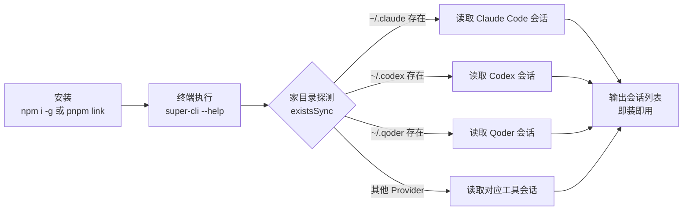
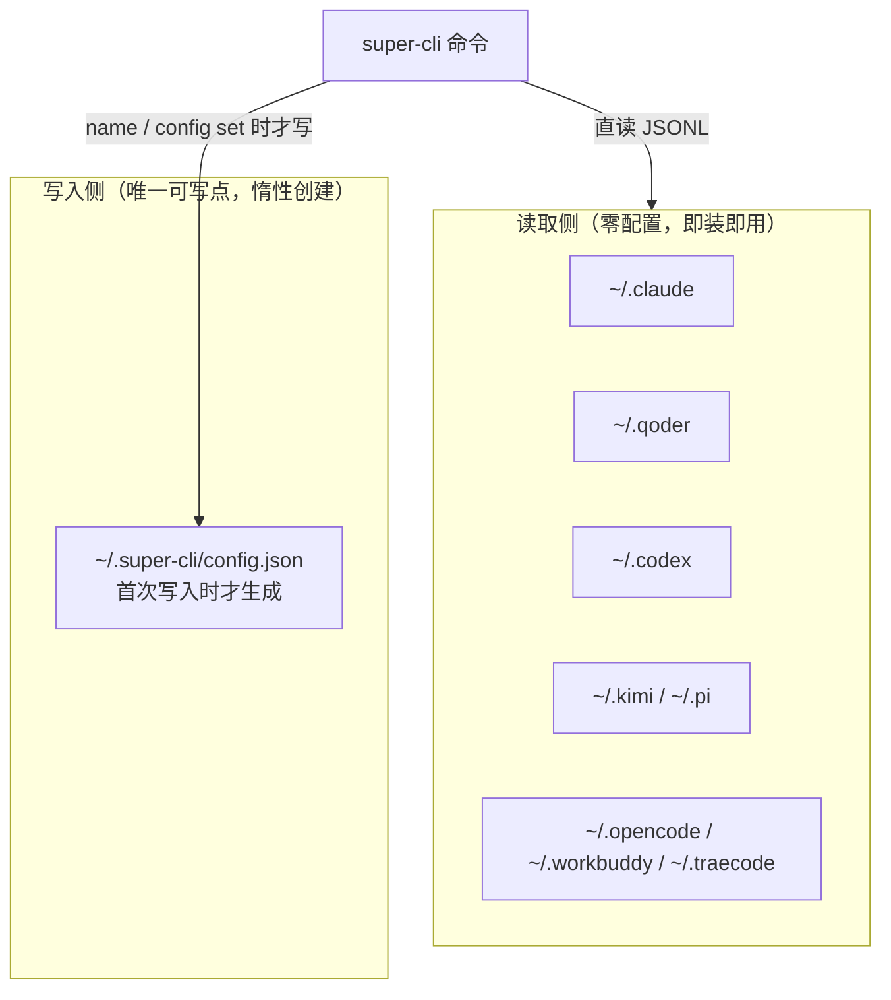

本页是 super-cli 的实操入口：从环境准备、两种安装方式，到首次运行时的零初始化机制，再到八个基础命令的速查与五分钟上手路径。读完本页，你可以在终端里列出、查看、搜索自己的 AI 编程会话，并理解 super-cli 为什么"装完即用"。命令的深度用法（过滤组合、JSON 管道、任务标签管理）属于下一阶段内容，本页只覆盖让你跑起来的最小集合。

## 前置条件

super-cli 是一个**只读聚合器 + 单点写入**的工具，它自己不产生数据——数据来自你已经在使用的 AI CLI 工具。因此上手前请确认两件事：**Node.js 版本 ≥ 22**（`engines` 字段强制约束，tsup 构建目标也是 `node22`），以及**至少使用过一款受支持的 AI CLI 工具**并留下了会话记录。super-cli 通过 `existsSync` 探测各家工具的家目录，目录不存在则该 Provider 自动不可见——所以全新机器上装完 super-cli 会看不到任何会话，这是预期行为而非故障。

| 条件 | 要求 | 说明 |
|---|---|---|
| Node.js | ≥ 22.0.0 | package.json `engines` 硬约束，构建产物面向 node22 |
| 包管理器 | npm / pnpm | 全局安装用 npm，源码安装用 pnpm |
| 数据来源 | 至少一款 AI CLI 的家目录存在 | 无数据时 `list` 返回空，属正常 |
| 操作系统 | macOS（终端恢复功能） | 核心读取功能跨平台，终端集成针对 macOS 五款终端 |

Sources: [package.json](package.json#L44-L47), [tsup.config.ts](tsup.config.ts#L8-L9), [src/core/providers.ts](src/core/providers.ts#L86-L88)

## 第一步：安装

npm 包名为 `@bluesky8318/super-cli`，`bin` 字段将 `super-cli` 命令映射到 `dist/cli/index.js`——全局安装后 `super-cli` 即可直接调用。发布包只包含 `dist/` 下的构建产物（CLI、Server、Web 三部分）与文档，不含 TypeScript 源码，这意味着 npm 用户拿到的是纯 ESM 的编译产物，无需任何编译步骤。

**方式一：全局安装（推荐大多数用户）**

```bash
npm install -g @bluesky8318/super-cli
```

**方式二：源码安装（想跟踪最新代码或参与贡献）**

```bash
git clone https://github.com/bluesky8318/super-cli.git
cd super-cli
pnpm install
pnpm build          # tsup 打包 CLI/Server + Vite 构建 Web
pnpm link --global  # 将 super-cli 命令链接到全局
```

| 对比维度 | npm 全局安装 | 源码 + pnpm link |
|---|---|---|
| 适用人群 | 日常使用者 | 贡献者 / 需要最新特性 |
| 前置工具 | npm（随 Node 附带） | pnpm + git |
| 是否需要构建 | 否（发布包已含 dist） | 是（`pnpm build`） |
| 更新方式 | `npm update -g` | `git pull && pnpm build` |
| 包内容 | 仅 `dist/` + 文档 | 完整源码 + 测试 |

Sources: [README.md](README.md#L45-L57), [package.json](package.json#L2-L17)

安装完成到第一条命令之间的路径可以用下面的流程图概括——注意其中**没有**"初始化"或"登录"步骤，这正是 super-cli 的设计特点：



## 零初始化设计：首次运行时发生了什么

理解 super-cli 的"首次运行"，关键在于它**没有 init 流程**。这套设计由三条规则构成：

**规则一：读取零成本**。`super-cli list` 等只读命令直接解析各 Provider 家目录下的 JSONL 文件（如 `~/.claude/projects/<编码路径>/<uuid>.jsonl`），不需要导入、索引或迁移。首次运行 `list` 时，内存索引按需构建，命令结束即释放。

**规则二：配置惰性创建**。`~/.super-cli/config.json` 是全系统唯一的可写点，它在 `ConfigManager.load()` 中有优雅降级——文件不存在时静默返回默认结构 `{ version: 1, sessions: {}, settings: {} }`；直到第一次**写入**操作（如 `config set` 或 `name` 打标签）发生时，才通过 `mkdir recursive + writeFile` 一次性创建目录和文件。换句话说：`ls ~/.super-cli` 在装完之初是空的，这不是异常。

**规则三：Provider 按需可见**。八款工具的家目录注册在 `PROVIDER_CONFIGS` 中，`getAvailableProviders()` 用文件系统探测过滤，装了哪几款就聚合哪几款，互不干扰。



Sources: [src/core/config.ts](src/core/config.ts#L12-L31), [src/core/paths.ts](src/core/paths.ts#L34-L40), [src/core/providers.ts](src/core/providers.ts#L15-L39)

## 验证安装：第一条命令

安装后依次执行以下三条命令即可确认一切正常：

```bash
super-cli --help        # 应列出 8 个子命令与全局 --provider 选项
super-cli list          # 以表格列出最近 20 条会话（默认上限）
super-cli config path   # 输出配置文件路径 ~/.super-cli/config.json
```

`list` 的默认输出是 `cli-table3` 渲染的七列表格，两个新手最容易疑惑的细节：**ID 列只显示 session ID 的前 8 位**（完整 UUID 很长，且后续命令支持前缀匹配）；**无结果时输出 "No sessions found."**，此时请先确认对应 AI CLI 的家目录存在。

```text
┌──────────┬─────────────────────────┬────────────┬───────┐
│ ID (8位) │ Project (末两级路径)     │ Date       │ Msgs  │ ...
└──────────┴─────────────────────────┴────────────┴───────┘
```

入口文件本身只有 29 行——Commander.js 注册全局选项后，将 8 个命令模块逐个挂载，`program.parse()` 结束。这种"薄入口 + 独立命令文件"的结构意味着你可以直接阅读 `src/cli/commands/` 下的同名文件来了解任何命令的全部参数。

Sources: [src/cli/index.ts](src/cli/index.ts#L1-L29), [src/cli/commands/list.ts](src/cli/commands/list.ts#L7-L16), [src/cli/output.ts](src/cli/output.ts#L13-L38)

## 基础命令速查

八个命令的定位与关键参数如下表。注意 **`--json` 是几乎所有命令的通用选项**，输出结构化 JSON 供脚本和 Agent 消费；**`--provider` 是全局选项**，写在子命令之前，用于只看某一款工具的数据（可选值：`claude-code`, `qoder`, `codex`, `kimi`, `pi`, `opencode`, `workbuddy`, `traecode`）。

| 命令 | 作用 | 关键参数 | 默认行为 |
|---|---|---|---|
| `list` | 列出会话 | `-p/--project`、`-s/--since`、`-u/--until`、`-b/--branch`、`-l/--limit`、`--offset`、`--json` | 最近 20 条，表格输出 |
| `show <id>` | 查看会话详情 | `--summary`、`--messages`、`--tools`、`--json` | 无参数时等同于 `--summary` |
| `search <query>` | 跨会话全文搜索 | `-p/--project`、`-s/--since`、`-m/--max`、`--case-sensitive`、`--json` | 最多 50 条命中，大小写不敏感 |
| `name <id> [label]` | 命名/打标签 | `--tag`、`--untag`、`--remove`、`--json` | 只传 ID 时查询现有标签 |
| `tasks` | 列出已命名任务 | `--tag`、`--json` | 按最后活跃时间倒序 |
| `stats` | 使用统计 | `-p/--project`、`--daily`、`--model`、`--json` | 汇总会话数/消息数/token |
| `config` | 配置管理 | 子命令：`show` / `set <k> <v>` / `get <k>` / `path` | `set` 值支持 JSON 类型自动解析 |
| `serve` | 启动 Web 服务 | `-p/--port`、`--host`、`--open` | 端口 3000，绑定 0.0.0.0 |

三个值得新手第一时间知道的细节：**`show` 和 `name` 都支持 ID 前缀匹配**（`findSessionByPrefix`），输入前 4~8 位即可定位，无需复制完整 UUID；**`show <id>` 不带参数默认只显示元数据摘要**，想看对话内容需显式加 `--messages`；**`serve` 采用懒加载**——Fastify 服务器模块只在真正执行 `serve` 时才 `import`，因此日常 CLI 使用完全不会加载 HTTP 相关代码。

Sources: [README.md](README.md#L61-L105), [src/cli/commands/show.ts](src/cli/commands/show.ts#L10-L31), [src/cli/commands/serve.ts](src/cli/commands/serve.ts#L7-L24), [src/cli/commands/config.ts](src/cli/commands/config.ts#L29-L38)

## 五分钟上手路径

按下面的顺序操作，覆盖"发现 → 查看 → 检索 → 管理"的完整闭环：

```bash
# 1. 发现：列出最近会话，从表格中记下目标 ID 的前几位
super-cli list

# 2. 查看：前缀定位，先看摘要，再决定是否展开对话
super-cli show abc123              # 元数据：项目、分支、模型、token 消耗
super-cli show abc123 --messages   # 完整对话记录（每条截断至 500 字符）
super-cli show abc123 --tools      # 工具调用频次排行

# 3. 检索：跨所有会话搜关键词，锁定上下文
super-cli search "error handling" --max 20

# 4. 管理：给重要会话命名打标签，之后用 tasks 追踪
super-cli name abc123 "重构认证模块"
super-cli name abc123 --tag backend
super-cli tasks --tag backend      # 只看 backend 标签的任务

# 5. 可选：打开 Web 看板获得可视化界面
super-cli serve --open
```

第 4 步执行后，`~/.super-cli/` 目录才会真正出现在磁盘上——这是你第一次触发"唯一可写点"的创建。第 5 步的 Web Dashboard 是独立的交互形态（看板、项目导航、文件浏览器），本页不展开。

Sources: [src/cli/commands/name.ts](src/cli/commands/name.ts#L8-L61), [src/cli/commands/tasks.ts](src/cli/commands/tasks.ts#L8-L36)

## 常见问题排查

| 症状 | 可能原因 | 解决方法 |
|---|---|---|
| `list` 输出 "No sessions found." | 对应 AI CLI 家目录不存在或从未产生会话 | 先用 Claude Code 等工具产生至少一次会话；用 `ls ~/.claude` 验证 |
| `command not found: super-cli` | npm 全局 bin 目录不在 PATH，或 pnpm link 未生效 | 检查 `npm prefix -g`；源码安装确认 `pnpm build` 已产出 `dist/cli/index.js` |
| 报 Node 版本相关错误 | Node < 22 | `node -v` 确认；构建目标为 node22，旧版本无法运行 |
| `Session not found: abc123` | 前缀有误，或该会话属于被过滤的 Provider | 去掉 `--provider` 重试；用 `list` 核对完整 ID |
| `config path` 正常但 `ls ~/.super-cli` 报不存在 | 尚未发生过任何写入操作 | 属预期行为；执行一次 `super-cli config set test 1` 即会创建 |
| 想确认某款工具是否被识别 | 不清楚探测结果 | `super-cli --provider qoder list`——返回数据即代表已识别 |

Sources: [src/core/providers.ts](src/core/providers.ts#L86-L94), [src/core/config.ts](src/core/config.ts#L26-L31), [package.json](package.json#L45-L47)

## 下一步阅读

你已经跑通了安装与基础命令，接下来的路径取决于你的目标：**想把命令用透**（过滤条件组合、`--json` 集成到 Agent 工作流、标签管理进阶），请阅读 [CLI 命令实战：list / show / search / name / tasks / stats / config](3-cli-ming-ling-shi-zhan-list-show-search-name-tasks-stats-config)；**更偏好图形界面**（看板视图、项目详情浮层、文件浏览器），请阅读 [Web Dashboard 使用指南：看板、搜索、项目详情与 Harness 视图](4-web-dashboard-shi-yong-zhi-nan-kan-ban-sou-suo-xiang-mu-xiang-qing-yu-harness-shi-tu)；**要参与开发或魔改**（热重载、测试、构建双轨流程），请阅读 [开发环境搭建：pnpm、热重载开发流程与常用脚本](5-kai-fa-huan-jing-da-jian-pnpm-re-zhong-zai-kai-fa-liu-cheng-yu-chang-yong-jiao-ben)。若对"为什么不用数据库"这类设计哲学感兴趣，可前置阅读 [项目总览：super-cli 是什么，解决什么问题](1-xiang-mu-zong-lan-super-cli-shi-shi-yao-jie-jue-shi-yao-wen-ti) 或跳转深入篇 [无数据库设计哲学：直读 JSONL 与唯一可写点 ~/.super-cli/config.json](8-wu-shu-ju-ku-she-ji-zhe-xue-zhi-du-jsonl-yu-wei-ke-xie-dian-super-cli-config-json)。