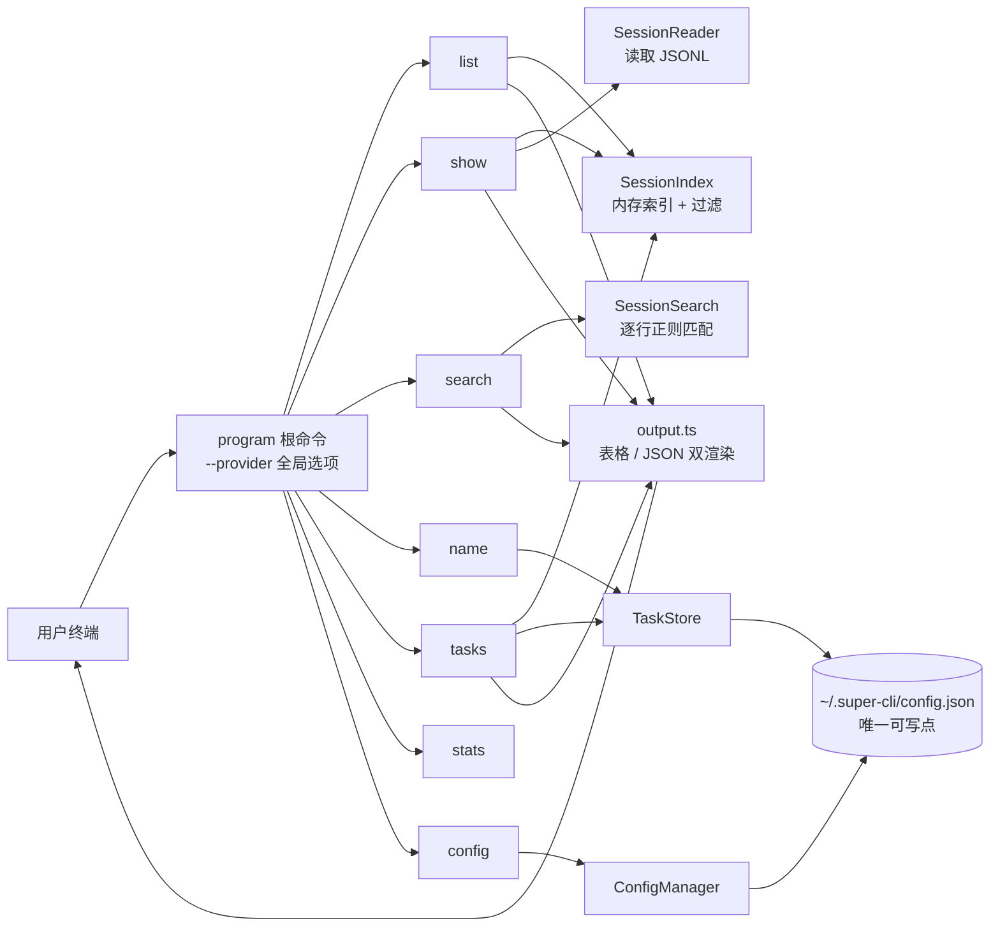
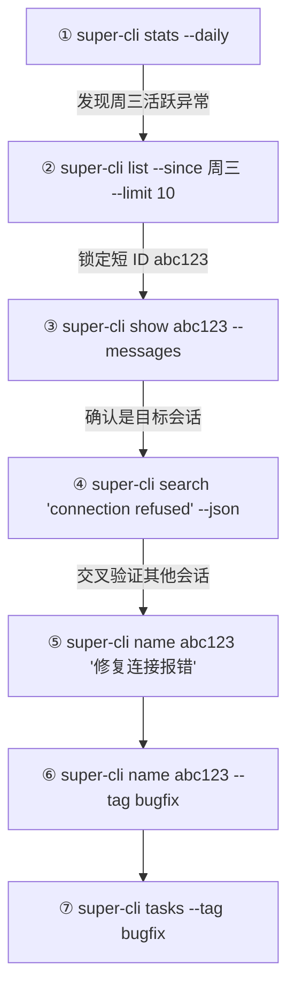

super-cli 的核心价值在于：不打开任何 AI 工具界面，就能在终端里快速回答"我之前跟 AI 聊了什么、在哪个项目聊的、聊到哪一步了"。本页是七个核心命令的完整实战手册——从浏览会话、查看对话详情、跨项目全文搜索，到给会话命名打标签、查看用量统计、管理配置。每个命令都会给出参数表、真实示例与底层行为说明，读完即可独立完成日常会话管理的全部操作。

## 命令全景：七条命令，一张地图

整个 CLI 基于 **Commander.js** 构建，入口文件只有 30 行：创建 `program` 实例、注册 8 个命令（本页讲 7 个，`serve` 属于 Web Dashboard 范畴）、最后 `program.parse()` 启动解析。除子命令参数外，根命令还声明了一个**全局选项** `--provider <name>`，用于按 AI 工具（`claude-code`、`qoder`、`codex` 等）过滤数据源。

Sources: [index.ts](src/cli/index.ts#L1-L30)

七条命令的分工一览：

| 命令 | 一句话用途 | 典型场景 |
|---|---|---|
| `list` | 表格列出所有会话 | "我最近有哪些会话？" |
| `show <id>` | 查看单个会话的元数据 / 对话 / 工具调用 | "这个会话具体聊了什么？" |
| `search <query>` | 跨所有会话的全文正则搜索 | "我哪次提过某个报错？" |
| `name <id> [label]` | 给会话命名、打标签、删标签 | "把重要会话标记出来" |
| `tasks` | 列出所有已命名（打过标签）的会话 | "我标记过的任务有哪些？" |
| `stats` | 汇总消息数、Token 用量、模型分布 | "我这个月用了多少 token？" |
| `config` | 查看 / 设置 / 读取持久化配置 | "改默认端口、默认终端" |

这七条命令共享同一套底层架构。**理解下面这张图，就理解了 super-cli CLI 的全部设计**：命令层（`src/cli/commands/`）只是薄薄的参数解析壳，真正的过滤、索引、搜索、持久化逻辑全部在 core 层（`src/core/`）；输出层（`output.ts`）统一负责"人类可读表格"与"机器可读 JSON"两种渲染。



图中的关键事实：`name`、`tasks`、`config` 三条命令的写入全部汇入同一个文件 `~/.super-cli/config.json`——这是整个工具**唯一会写数据的地方**（会话本身永远是各 AI 工具的原始 JSONL 文件，super-cli 只读不写）。

Sources: [index.ts](src/cli/index.ts#L14-L27), [paths.ts](src/core/paths.ts#L34-L40)

---

## list：浏览所有会话

`list` 是入门的第一条命令，也是日常使用频率最高的命令。不带任何参数执行 `super-cli list`，会以表格形式展示最近 20 个会话：

```bash
super-cli list
```

表格固定为七列，由 `cli-table3` 库渲染：**ID**（完整 session ID 截取前 8 位）、**Project**（项目路径取最后两段，如 `github/super-cli`）、**Date**（最后活动日期）、**Branch**（Git 分支）、**Msgs**（用户消息数 + 助手消息数）、**Label**（你通过 `name` 命令设置的标签）、**First Message**（会话第一句话，截断到 38 字符）。查询结果为空时输出灰色提示 `No sessions found.`。

Sources: [output.ts](src/cli/output.ts#L13-L38)

完整参数表：

| 参数 | 说明 | 默认值 |
|---|---|---|
| `-p, --project <path>` | 按项目路径过滤（**不区分大小写的包含匹配**，可只写路径片段如 `super-cli`） | 无 |
| `-s, --since <date>` | 只显示该日期之后有活动的会话，格式 `YYYY-MM-DD` | 无 |
| `-u, --until <date>` | 只显示该日期之前**开始**的会话 | 无 |
| `-b, --branch <name>` | 按 Git 分支过滤（**精确匹配**） | 无 |
| `-l, --limit <n>` | 最多显示条数 | `20` |
| `--offset <n>` | 跳过前 N 条（配合 limit 做翻页） | `0` |
| `--json` | 输出 JSON 数组 | 关闭 |

两个容易踩坑的语义细节，都定义在 `SessionIndex.getAllSessions` 的过滤逻辑里：**`--project` 是子串匹配而非完整路径匹配**（内部把两边都转小写后用 `includes` 比较），所以 `--project super` 也能命中 `/Users/you/work/super-cli`；而 `--since` 比较的是会话的**最后活动时间**（`lastTimestamp`），`--until` 比较的却是**首次开始时间**（`firstTimestamp`）——即"这段时间窗口内活跃过"的会话。结果默认按最后活动时间**倒序**排列（最新在前），分页时先应用 `offset` 再应用 `limit`。

Sources: [list.ts](src/cli/commands/list.ts#L6-L32), [session-index.ts](src/core/session-index.ts#L102-L139)

实用组合示例：

```bash
# 本项目今年以来的会话
super-cli list --project super-cli --since 2025-01-01

# 只看 main 分支上第 21~40 条（第二页）
super-cli list --branch main --limit 20 --offset 20

# 输出 JSON 交给 jq 处理
super-cli list --json | jq '.[0].sessionId'
```

全局 `--provider` 选项在此命令中生效：`super-cli --provider codex list` 只列出 Codex 产生的会话。注意该选项写在**子命令之前**（它是根命令选项）。从代码看，目前显式读取这个全局选项的只有 `list` 命令——它通过 `program.opts()` 取出 `provider` 传给索引层。

Sources: [index.ts](src/cli/index.ts#L14-L18), [list.ts](src/cli/commands/list.ts#L17-L28)

---

## show：深入单个会话

`show` 回答"这一个会话到底发生了什么"。它接收一个 session ID 参数，且**支持前缀匹配**——你不需要复制完整的 UUID，取前几位即可：

```bash
super-cli show abc123
```

前缀匹配的规则值得单独说明，实现在 `findSessionByPrefix` 中：遍历索引中所有 session ID，收集所有以你输入的前缀开头的候选；**恰好匹配 1 个**则返回，**匹配多个则直接报错**（提示 `Ambiguous session ID prefix`），匹配 0 个返回空。所以只要前缀足够长到无歧义，短前缀是完全安全的。找不到会话时命令以红色错误退出（`process.exit(1)`）。

Sources: [show.ts](src/cli/commands/show.ts#L16-L23), [session-index.ts](src/core/session-index.ts#L152-L161)

`show` 有三种查看模式，由选项开关决定：

| 模式 | 触发方式 | 展示内容 |
|---|---|---|
| 元数据模式（默认） | 不加参数，或 `--summary` | 项目、分支、CWD、起止时间、版本、入口、模型列表、消息数、Token 数、标签、首条消息 |
| 对话模式 | `--messages` | 逐条打印 User / Assistant 消息（带角色着色和时间戳） |
| 工具模式 | `--tools` | 统计该会话中所有工具调用（如 Bash、Edit、Read）的次数，降序排列 |

元数据模式的输出是缩进对齐的键值列表，涵盖 14 个字段，例如 `Tokens: 12,340 in / 8,900 out`。对话模式有两个对初学者很重要的行为：**每条消息文本截断到 500 字符**（`content.slice(0, 500)`），长回答不会被完整刷屏；助手消息中的工具调用块只显示一行黄色占位 `[Tool: Bash]`，不打印工具入参。若加 `--json --messages`，则输出只含 `user` / `assistant` 两类消息的完整 JSON 数组（无截断）。

Sources: [show.ts](src/cli/commands/show.ts#L25-L54), [output.ts](src/cli/output.ts#L40-L66)

工具模式的统计逻辑（`extractToolUsage`）扫描所有 `assistant` 类型消息，取出其内容数组中 `type === 'tool_use'` 的块，按工具名计数后降序排序——这是快速判断"AI 这个会话里主要在改文件还是跑命令"的捷径：

```bash
super-cli show abc123 --tools
# Tool Usage:
#   Bash: 23
#   Edit: 11
#   Read: 9
```

Sources: [show.ts](src/cli/commands/show.ts#L57-L70)

---

## search：跨会话全文搜索

`search` 是定位"我之前在哪次对话里讨论过 X"的核心武器。它对所有会话的消息文本做正则匹配：

```bash
super-cli search "error handling"
```

| 参数 | 说明 | 默认值 |
|---|---|---|
| `-p, --project <path>` | 限定项目（同样是不区分大小写的包含匹配） | 无 |
| `-s, --since <date>` | 只搜索该日期之后活跃的会话 | 无 |
| `-m, --max <n>` | 最大命中条数（注意：按**命中次数**计，不是按会话数） | `50` |
| `--case-sensitive` | 区分大小写 | 不区分 |
| `--json` | 输出 JSON | 关闭 |

搜索的三个底层行为需要精确理解。**第一，查询串按正则处理但会先转义**：`escapeRegex` 把 `.*+?^${}()|[]\` 等元字符全部转义，所以你输入 `super-cli list` 这样的点号不会引发意外匹配，搜的永远是你看到的字面文本（除非……不，没有任何方式注入原始正则，它是纯字面量搜索）。**第二，只搜对话文本**：仅遍历 `user` 与 `assistant` 两类消息，拼接其中所有 `text` 块后做 `regex.test`；工具调用入参、系统消息不在搜索范围。**第三，逐行流式读取**：通过 reader 的 `streamSession` 逐行消费 JSONL，不把整个文件载入内存。

Sources: [search.ts](src/cli/commands/search.ts#L6-L27), [session-search.ts](src/core/session-search.ts#L51-L93)

结果按会话分组展示：每组的头部是 8 位短 ID + 项目名 + 总命中数，下面最多列出 **5 条命中**（`hits.slice(0, 5)`），每条标注消息角色（user 绿色 / assistant 蓝色）、时间戳和上下文摘要。摘要的生成规则是：定位到首个命中位置后，取**前 50 字符 + 关键词 + 后 100 字符**，两端超出部分用 `...` 省略，换行替换为空格保证单行显示。`--max` 的计数对象是累计命中数（`totalFound += hits.length`），达到上限即停止扫描后续会话——所以 `--max 20` 可能只扫到前几个会话就结束了。

Sources: [session-search.ts](src/core/session-search.ts#L13-L49), [session-search.ts](src/core/session-search.ts#L95-L106), [output.ts](src/cli/output.ts#L68-L84)

---

## name 与 tasks：给会话命名、打标签

UUID 对人类毫无意义，`name` 命令解决的就是这个问题——把 `a3f8...` 变成"重构认证模块"。同一个会话 ID 支持**设置、查询、删除标签**与**添加/移除 tag** 五种操作，全部通过参数组合区分：

| 命令形式 | 效果 |
|---|---|
| `super-cli name abc123 "重构认证模块"` | 设置名称 |
| `super-cli name abc123` | 查询当前名称与 tags（无则提示 `No label set.`） |
| `super-cli name abc123 --remove` | 删除名称（连同 tags 一起清除） |
| `super-cli name abc123 --tag backend` | 添加 tag |
| `super-cli name abc123 --untag backend` | 移除 tag |

两条必须知道的规则。**规则一：先有 label 才能打 tag**。`TaskStore.addTag` 在会话没有 label 时直接抛出 `Session "..." has no label. Set a label first.`，所以操作顺序永远是先 `name abc123 "xxx"` 再 `--tag`。**规则二：重设 label 不丢数据**。`setLabel` 会保留已有的 `createdAt` 与 `tags` 字段，只更新名称文本；而 `--remove` 是彻底删除该会话的整个标签记录。tags 内部用 `Set` 去重，重复添加同一 tag 无副作用。这些数据持久化在 `~/.super-cli/config.json` 的 `sessions` 键下，结构为 `{ label, createdAt, tags }`。

Sources: [name.ts](src/cli/commands/name.ts#L6-L62), [task-store.ts](src/core/task-store.ts#L47-L79)

`name` 同样支持 ID 前缀匹配（内部复用 `findSessionByPrefix`），成功操作后会回显确认，例如 `Labeled a3f8c21d as "重构认证模块"`。

`tasks` 是 `name` 的查询面：列出所有已命名的会话，把 label 和 tags 合并进会话元数据后，复用 `list` 的表格渲染（此时 Label 列必不为空）。结果按最后活动时间倒序；`--tag backend` 只显示带该 tag 的任务；没有任何命名任务时给出引导提示。

```bash
super-cli tasks
super-cli tasks --tag backend
super-cli tasks --json
```

Sources: [tasks.ts](src/cli/commands/tasks.ts#L6-L38)

---

## stats：用量统计

`stats` 一条命令汇总全部（或指定项目的）会话数据，适合回答"我到底用了多少"：

```bash
super-cli stats
# Statistics
#   Sessions:          42
#   User messages:     318
#   Assistant messages: 402
#   Input tokens:      1,234,567
#   Output tokens:     890,123
```

| 参数 | 说明 |
|---|---|
| `-p, --project <path>` | 只统计该项目 |
| `--model` | 追加模型使用分布（每个模型出现在多少个会话中，降序） |
| `--daily` | 追加最近 7 天活跃度（按 `lastTimestamp` 的日期部分计数） |
| `--json` | 输出完整 JSON |

五个核心指标全部由会话元数据**累加**得出（`reduce` 求和），不需要重读任何 JSONL 文件，因此速度极快：总会话数、用户消息数、助手消息数、输入 Token 总量、输出 Token 总量。JSON 模式还额外包含 `models` 与 `projects` 两个按出现次数聚合的对象。`--daily` 的实现很简单：取每个会话 `lastTimestamp` 的前 10 个字符（即 `YYYY-MM-DD`）分桶计数，输出最后 7 个日期。

Sources: [stats.ts](src/cli/commands/stats.ts#L6-L55), [stats.ts](src/cli/commands/stats.ts#L57-L73)

---

## config：配置管理

`config` 是唯一带**二级子命令**的命令，管理 `~/.super-cli/config.json` 中 `settings` 键下的配置项：

| 子命令 | 说明 | 示例 |
|---|---|---|
| `config show` | 列出全部设置（附配置文件路径） | `super-cli config show` |
| `config get <key>` | 读取单个键，未设置时显示 `(not set)` | `super-cli config get terminal` |
| `config set <key> <value>` | 写入一个键 | `super-cli config set terminal ghostty` |
| `config path` | 只打印配置文件路径 | `super-cli config path` |

`set` 有一个贴心的细节：会先尝试把 value 按 **JSON 解析**，成功则存为对应类型（`set port 3000` 存数字、`set flag true` 存布尔值），解析失败才降级为字符串。`get` 永远以 `JSON.stringify` 形式回显值。根据 `AppConfig` 类型定义，当前已知的有效键包括 `defaultPort`（serve 默认端口）、`claudeHome`（自定义数据目录）和 `terminal`（恢复会话时使用的终端类型）。

Sources: [config.ts](src/cli/commands/config.ts#L6-L56), [config.ts](src/core/config.ts#L21-L36), [types.ts](src/core/types.ts#L104-L114)

再次强调架构上的关键设计：**`config set` 与 `name` 写的是同一个文件的不同区域**——`ConfigManager` 只动 `settings` 键，`TaskStore` 只动 `sessions` 键，二者互不干扰，但共享 `~/.super-cli/config.json` 这唯一可写点。

Sources: [config.ts](src/core/config.ts#L26-L31), [task-store.ts](src/core/task-store.ts#L31-L35), [paths.ts](src/core/paths.ts#L34-L40)

---

## 实战串联：一条完整工作流

初学者最容易犯的错是孤立地记命令。下面这条流程把七条命令串成一个真实场景——"找回上周调试某个报错的会话并归档为任务"。阅读前需了解：Mermaid 时序图从上到下表示时间推进，参与者是"你"与七条命令，虚线右侧标注关键输出。



每一步的输出都为下一步提供输入：`stats` 定位时间异常 → `list --since` 缩小候选 → `show` 确认内容 → `search` 防遗漏 → `name` 归档 → `tasks` 验收。

Sources: [README.md](README.md#L65-L95)

## 常见问题排错表

| 症状 | 原因 | 解决方案 |
|---|---|---|
| `Ambiguous session ID prefix "ab": 5 matches` | 前缀太短命中多个会话 | 多复制几位 ID（`findSessionByPrefix` 要求唯一命中） |
| `Session not found: xxx` 后退出 | 前缀无任何匹配 | 用 `super-cli list --json \| jq '.[].sessionId'` 获取准确 ID |
| `Session "..." has no label. Set a label first.` | 未设名称就执行 `--tag` | 先 `name <id> "名称"`，再 `--tag` |
| `list` 有结果但 `--project` 过滤后为空 | 项目参数写法问题 | 用路径片段模糊匹配（如 `super-cli`），过滤是不区分大小写的包含匹配 |
| `search` 明明聊过却搜不到 | 搜索只覆盖 user/assistant 消息的文本块 | 工具入参、system 消息不在搜索范围；确认关键词拼写，默认不区分大小写 |
| `show --messages` 内容看起来被截断 | 设计如此：人类可读模式每条消息截断 500 字符 | 需要全文时改用 `show <id> --messages --json` |
| `--provider qoder search` 结果仍含其他来源 | 该全局选项当前仅在 `list` 命令中接线生效 | 搜索时改用 `-p` 项目过滤，或先 `--provider qoder list` 确认 ID 再 `show` |

Sources: [session-index.ts](src/core/session-index.ts#L152-L161), [name.ts](src/cli/commands/name.ts#L26-L42), [show.ts](src/cli/commands/show.ts#L82-L91), [session-search.ts](src/core/session-search.ts#L61-L65), [list.ts](src/cli/commands/list.ts#L18-L28)

## 下一步阅读

掌握 CLI 之后，两条进阶路径任选：想看图形界面如何复用同一套 core 层，读 [Web Dashboard 使用指南：看板、搜索、项目详情与 Harness 视图](4-web-dashboard-shi-yong-zhi-nan-kan-ban-sou-suo-xiang-mu-xiang-qing-yu-harness-shi-tu)；想理解这些命令背后的索引与搜索机制（为什么 `list` 快、搜索如何避免读全文件），读 [SessionIndex 内存索引：TTL 缓存与强制刷新策略](13-sessionindex-nei-cun-suo-yin-ttl-huan-cun-yu-qiang-zhi-shua-xin-ce-lue) 与 [跨 Session 全文搜索：命中聚合与高亮实现](14-kua-session-quan-wen-sou-suo-ming-zhong-ju-he-yu-gao-liang-shi-xian)。对标签系统的持久化细节感兴趣，可继续读 [TaskStore 任务标签系统：命名、打标签与 JSON 持久化](16-taskstore-ren-wu-biao-qian-xi-tong-ming-ming-da-biao-qian-yu-json-chi-jiu-hua) 与 [无数据库设计哲学：直读 JSONL 与唯一可写点 ~/.super-cli/config.json](8-wu-shu-ju-ku-she-ji-zhe-xue-zhi-du-jsonl-yu-wei-ke-xie-dian-super-cli-config-json)。