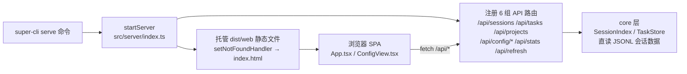
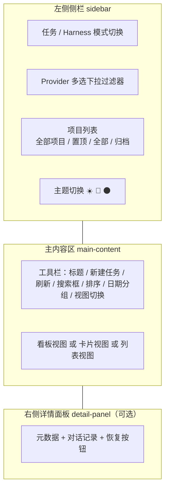
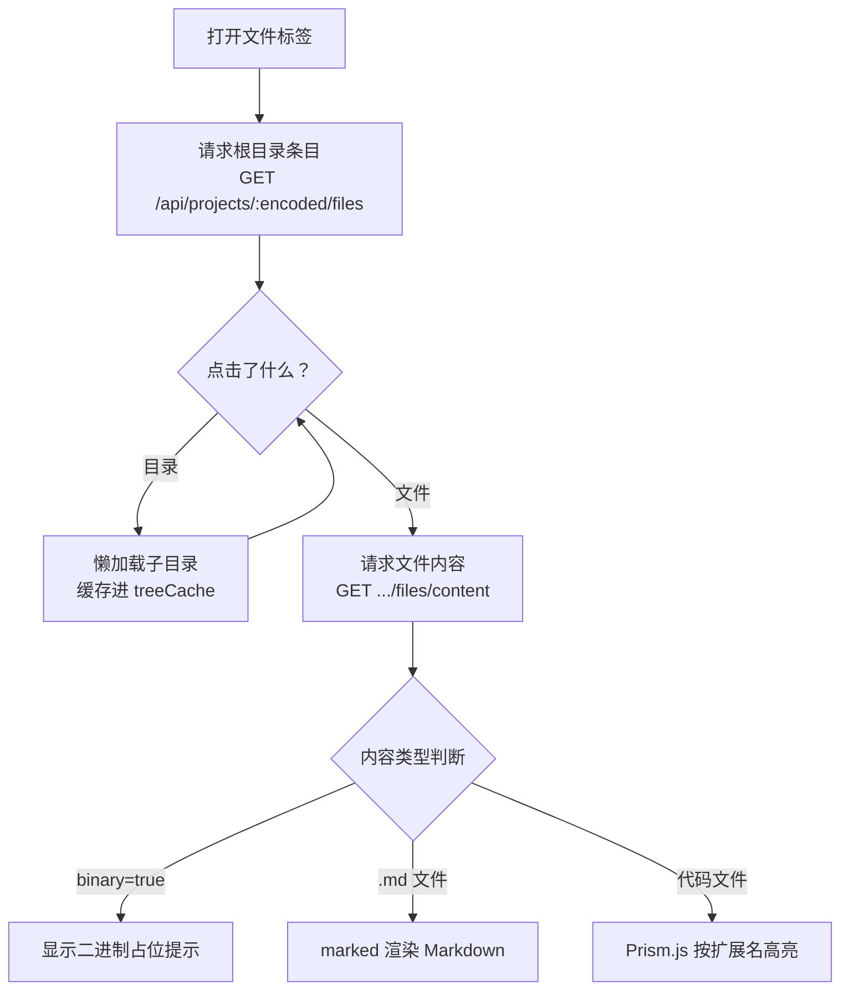

super-cli 除了命令行方式外，还内置了一个开箱即用的 Web 仪表盘：一条命令启动后，你可以在浏览器里以**看板**的方式浏览所有 AI CLI 工具（Claude Code、Qoder、Codex、Kimi 等 8 款）的历史会话，按项目过滤、搜索任务、点开对话记录、一键在终端中恢复会话，还能在一个独立的 **Harness 模式**中集中查看与管理各工具的 Skills、MCP Servers、Rules、Hooks、Permissions 配置。本文面向初学者，带你从启动命令开始，逐一掌握每个界面的用法与背后的数据流向。

Sources: [README.md](README.md#L107-L121)

## 启动 Dashboard：super-cli serve

打开终端，运行 `super-cli serve`，服务器默认监听 3000 端口；加上 `--open` 参数会自动弹出浏览器访问页面。这条命令由 `serve` 子命令注册而来，它动态加载 `startServer` 函数并传入端口与主机参数，随后打印绿色的访问地址。三个选项如下表：

| 参数 | 说明 | 默认值 |
|---|---|---|
| `-p, --port <n>` | HTTP 服务监听端口 | `3000` |
| `--host <host>` | 绑定的网络地址（`0.0.0.0` 表示局域网内可访问） | `0.0.0.0` |
| `--open` | 启动后自动打开默认浏览器 | 未开启 |

```bash
super-cli serve --port 3000 --open
```

Sources: [serve.ts](src/cli/commands/serve.ts#L4-L25)

启动背后发生的事情可以用下面的流程图概括：`serve` 命令调用 Fastify 服务器的 `startServer`，服务器先注册 6 组 API 路由（sessions、tasks、stats、projects、config、refresh），再检查 `dist/web` 目录是否存在——存在则用 `@fastify/static` 托管前端静态资源，并把 404 兜底到 `index.html`（这是单页应用刷新不 404 的关键）；最后监听端口。浏览器加载页面后，前端通过 `/api/*` 请求拿数据，而 `SessionIndex` 与 `TaskStore` 则直接复用 core 层读取本地 JSONL 会话文件。



Sources: [index.ts](src/server/index.ts#L18-L48)

## 界面总览：一个侧栏、一块主区、一个详情面板

整个前端入口只有 `main.tsx` 渲染的 `App.tsx` 单文件 SPA（1295 行），界面由三大块组成：**左侧导航侧栏**（可拖拽调整宽度，范围 180–400 像素，宽度持久化到 `localStorage`）、**中间主内容区**（工具栏 + 会话列表）、**右侧会话详情面板**（点击卡片后弹出，同样可拖拽调整宽度 300–800 像素）。侧栏顶部有"任务"和"Harness"两个导航按钮，对应 `appMode` 的两个取值——这正是文档标题中"看板"与"Harness 视图"的来源。



Sources: [App.tsx](src/web/src/App.tsx#L441-L460)

侧栏本身承载了全局过滤能力。**Provider 过滤器**是一个多选下拉：不选时显示"全部工具"，可勾选多个工具，已选项会显示为对应品牌色的芯片；选中单个 provider 时会作为查询参数传给后端 API，选中多个时则在前端过滤。每次切换 provider 都会重置当前选中的项目。**项目列表**按"全部项目 → 置顶分组 → 全部分组 → 归档（默认折叠）"组织，右侧带会话数量角标，标题旁的按钮可在"按时间排序（🕐）"与"按数量排序（#）"之间切换。侧栏底部的三个按钮分别切换亮色（light）、暗色（dark）、深蓝（deep）主题，选择会被记住，下次打开自动恢复。

Sources: [App.tsx](src/web/src/App.tsx#L459-L599)

## 看板视图：五列状态与三种视图模式

点击任意会话卡片前，你首先看到的是主内容区的三种视图，通过工具栏右侧的三个图标按钮切换。**看板视图（board）** 是默认视图，把会话按状态分成五列，每列有专属颜色与计数；**卡片视图（card）** 把所有卡片排成网格，不再分列；**列表视图（list）** 则是紧凑的单行条目，只保留标题与项目、时间、消息数等关键元信息。

| 视图 | 布局形态 | 适合场景 |
|---|---|---|
| 看板 board | 按状态分 5 列，列内可按日期分组 | 俯瞰所有任务的整体进度 |
| 卡片 card | 自适应网格 | 集中浏览某个项目的会话 |
| 列表 list | 单行紧凑列表 | 快速扫读大量会话标题 |

看板的五列定义在 `STATUS_COLUMNS` 常量中，状态值来自后端对会话的自动推断（未推断出的默认归入"待办"）：

| 状态 key | 列名 | 颜色 |
|---|---|---|
| `in_progress` | 进行中 | 蓝色 `#3b82f6` |
| `review` | 待复查 | 紫色 `#8b5cf6` |
| `backlog` | 待办 | 橙色 `#f59e0b` |
| `done` | 已完成 | 绿色 `#10b981` |
| `cancelled` | 已取消 | 灰色 `#6b7280` |

Sources: [App.tsx](src/web/src/App.tsx#L30-L36), [App.tsx](src/web/src/App.tsx#L686-L754)

每张会话卡片（`SessionCard`）展示：左上角的 provider 两字母徽章（如 CC、QD、CX，颜色与侧栏品牌色一致）、标题（优先显示你通过 `super-cli name` 命令设置的任务标签，否则截取首条用户消息前 60 字符）、消息预览、相对时间（"刚刚 / 5分钟前 / 3天前"，由 `getTimeAgo` 计算）、消息总数和 git 分支名。鼠标悬停卡片还会弹出一个 Tooltip，预览首条用户消息的前 300 字。

Sources: [App.tsx](src/web/src/App.tsx#L929-L958)

工具栏提供三种排序模式（下拉框切换）与一个**按日期分组**开关。日期分组仅在"看板视图 + 时间排序"组合下可用，开启后每列内的卡片按"今天 → 昨天 → 最近几天的星期 → 更早"分组，每组带可折叠的标题与计数。值得注意的是分组逻辑的一个细节：会话加载时会调用 `loadSessions`，把 TaskStore 中保存的任务标签、标签数组与状态合并进会话对象，因此你在 CLI 中打的标签会立即反映到看板上。

| 排序模式 | 菜单项 | 排序依据 |
|---|---|---|
| `time-desc` | 最近更新 | 最后时间戳倒序（默认） |
| `time-asc` | 最早更新 | 最后时间戳正序 |
| `messages` | 消息最多 | 用户+助手消息总数降序 |

Sources: [App.tsx](src/web/src/App.tsx#L658-L671), [App.tsx](src/web/src/App.tsx#L228-L262), [App.tsx](src/web/src/App.tsx#L1021-L1050)

## 搜索与过滤：工具栏搜索框的范围

工具栏中间的搜索框（占位符"搜索任务..."）是一个**实时的客户端过滤器**：输入即生效，在当前已加载的会话列表（默认最多 200 条）中匹配四个字段——首条用户消息、任务标签、会话 ID 的子串、git 分支名。因为过滤发生在前端，响应没有网络延迟，但也要清楚它的边界：它搜索的是会话**摘要**字段，不是逐条消息的全文。若需要跨所有会话逐消息检索命中的能力，应使用 CLI 的 `super-cli search` 命令（后端提供 `/api/search` 端点支持），详见 [跨 Session 全文搜索：命中聚合与高亮实现](14-kua-session-quan-wen-sou-suo-ming-zhong-ju-he-yu-gao-liang-shi-xian)。

Sources: [App.tsx](src/web/src/App.tsx#L431-L438), [App.tsx](src/web/src/App.tsx#L654-L657), [client.ts](src/web/src/api/client.ts#L27-L33)

过滤维度的完整组合是：**侧栏 Provider 过滤（多选）× 侧栏项目列表（单选）× 工具栏搜索框（文本）× 排序 × 视图**。每次切换项目或 provider 都会触发 `loadSessions` 重新拉取数据；工具栏左侧的**刷新按钮**则更进一步——先调用 `POST /api/refresh` 强制让后端 SessionIndex 缓存失效重建，再重新拉取会话与项目两个列表，按钮在刷新期间会旋转动画，适合你在终端里刚产生新会话、页面数据过期时使用。

Sources: [App.tsx](src/web/src/App.tsx#L366-L384)

## 会话详情面板：对话记录与终端恢复

点击任意会话卡片，右侧滑出详情面板。面板顶部显示标题、会话 ID 前 8 位和 git 分支徽章，右侧两个按钮分别是 **▶ 恢复** 与关闭。元数据区（`MetaItem` 组件）以"标签-值"的行式布局展示五项信息：所属项目（取路径最后两段）、首次时间戳、消息统计（"N 提问 / N 回复"）、使用过的模型列表、Token 消耗（输入/输出分开，以 k 为单位）。

Sources: [App.tsx](src/web/src/App.tsx#L758-L788)

面板下半部分是对话记录流。选择会话时前端调用 `fetchSessionMessages(sessionId, { limit: 200 })` 拉取最近 200 条消息，逐条渲染成气泡：用户消息显示角色"你"，其余显示"助手"，每条带时间戳；消息内容经 `extractContent` 归一化——字符串直接显示，数组内容块则拼接文本块与工具调用块（工具调用渲染为 `🔧 工具名`），单条超过 1200 字符截断。顶部导航条提供"⬆ 最早 / ⬇ 最新"两个快捷滚动按钮，方便在长对话中定位。

Sources: [App.tsx](src/web/src/App.tsx#L790-L799), [App.tsx](src/web/src/App.tsx#L990-L1019)

**▶ 恢复按钮**是 Dashboard 与本地终端联动的亮点：点击后前端调用 `POST /api/sessions/:id/resume`，后端根据会话的 provider 与项目路径，在系统检测到的终端应用（Ghostty、iTerm2、Terminal.app、Kitty、Warp 等）中重建该会话。按钮会依次显示三种反馈：`⏳ 启动中...`（请求进行中）→ `✓ 已在 xxx 中打开`（成功拉起新窗口）或 `✓ 已切换到运行中的窗口`（复用已存在的窗口），提示停留 3 秒后自动消失。当你在侧栏选中了某个具体项目时，工具栏还会出现**新建任务**按钮（带下拉箭头可选择用哪个 CLI 工具新建），默认使用 Claude Code，失败时弹出错误提示。

Sources: [App.tsx](src/web/src/App.tsx#L292-L307), [App.tsx](src/web/src/App.tsx#L358-L364), [client.ts](src/web/src/api/client.ts#L68-L80)

## 项目详情：右键菜单、信息覆盖层与文件浏览器

侧栏项目列表支持两种快捷操作入口：在项目条目上**右键**，或点击条目右侧的 `···` 按钮，都会弹出上下文菜单，包含六项操作：在 Finder 中打开、在终端中打开、**查看详情**、置顶/取消置顶、归档/取消归档。置顶的项目会移动到侧栏顶部的"置顶"分组，归档的项目则折叠进"归档"分组（默认收起）。

Sources: [App.tsx](src/web/src/App.tsx#L876-L910)

点击"查看详情"（或通过 `openProjectDetail` 函数触发）后，页面中央弹出一个全屏遮罩的覆盖层，顶部有两个标签页：**详情** 与 **文件**。详情标签展示从后端 `GET /api/projects/:encoded/detail` 拉取的项目画像——磁盘路径与路径存在性（防止项目目录已被移动或删除）、Git Remote 地址、当前分支、`git status` 输出（干净时显示 `(clean)`）、Node 版本、包管理器、会话总数、最近活跃时间；底部一行操作按钮与右键菜单保持一致（Finder / 终端 / 置顶 / 归档），在这里操作后侧栏列表会同步刷新。

Sources: [App.tsx](src/web/src/App.tsx#L813-L874), [App.tsx](src/web/src/App.tsx#L351-L356)

**文件标签**是一个内嵌的 `FileBrowser` 组件，操作流程如下图：首次进入自动请求项目根目录的条目列表；点击目录图标懒加载子目录（结果缓存进 `treeCache`，重复展开不再请求）；点击文件则调用内容接口，返回的数据结构包含 `content`、`binary`（是否二进制）、`truncated`（是否被截断）与 `size` 四个字段。渲染策略三分支：二进制文件显示提示占位而不输出内容；Markdown 文件（`.md`/`.mdx`）用 marked 渲染成富文本；其余文件走 Prism.js 语法高亮，语言由扩展名映射表决定，覆盖 TypeScript、JSX、JSON、CSS、Bash、Python、YAML、TOML、SQL、Rust、Go、Java、Docker 等十余种。



Sources: [App.tsx](src/web/src/App.tsx#L1095-L1199), [App.tsx](src/web/src/App.tsx#L1209-L1227), [App.tsx](src/web/src/App.tsx#L1116-L1143)

## Harness 视图：五标签配置中心

回到侧栏点击"Harness"，`appMode` 切换到 `config`，主内容区整体替换为 `ConfigView` 组件——这是管理 8 款 AI CLI 工具配置的可视化中心。工具栏由五个标签页组成：**Skills、MCP、Rules、Hooks、Permissions**；右侧实时显示当前作用域：侧栏选中了具体项目时显示"项目: 项目名"并列出该项目实际使用过的 provider 徽章，未选中项目则显示"全局配置"。作用域还会影响加载范围——选中项目时只查询该项目涉及的 provider，全局模式下查询全部。

Sources: [ConfigView.tsx](src/web/src/ConfigView.tsx#L78-L122)

五个标签页的信息呈现与可执行操作各有不同，初学者可以先通过下表建立整体预期（所有标签页都遵循"按 provider 分组 → 全局/项目两个 scope 分组 → 可折叠"的统一骨架）：

| 标签页 | 展示内容 | 支持的操作 | 是否可写 |
|---|---|---|---|
| Skills | 每个 provider 的技能卡片：名称、版本、描述、所在目录 | 点击查看内容详情；**跨 provider 一键复制**（卡片上的 `→ Claude` 等按钮） | 复制（新增） |
| MCP | MCP Server 列表：ID、类型（stdio/http/sse）、启动命令、健康状态点 | **添加**（弹窗填 Server ID、Provider、范围、JSON 配置）、**编辑**（JSON 编辑弹窗）、**删除**（确认框）、**跨 provider 复制** | 读 + 写 + 删 |
| Rules | 规则文件列表（如 CLAUDE.md、AGENTS.md）：路径、是否存在 | 点击加载内容到编辑器，修改后**保存**（dirty 状态跟踪，未保存离开可感知） | 读 + 写 |
| Hooks | 事件 → matcher → hook 命令的三层结构，`*` matcher 显示为"所有工具" | 仅浏览，分组折叠 | 只读 |
| Permissions | allow / deny 规则清单与规则总数统计 | 仅浏览，分组折叠 | 只读 |

Sources: [ConfigView.tsx](src/web/src/ConfigView.tsx#L91-L119)

几个初学者容易忽略的细节。第一，**Codex 被特殊对待**：Skills 卡片上的复制按钮、MCP/Rules/Hooks/Permissions 的加载循环都会跳过 codex（`provider === 'codex'` 的过滤条件），因为 Codex 的配置体系与其他 7 款差异较大。第二，**MCP 添加弹窗中的"范围"选择框只在侧栏选中了项目时才出现**——全局模式下默认写入全局配置。第三，Rules 保存调用的内容接口按文件路径读写，如果该规则文件原本不存在，保存成功后列表会自动刷新以反映新文件。跨 provider 复制的底层机制（Skill 目录迁移与 MCP 配置同步）属于进阶话题，详见 [跨 Provider 复制配置：Skill 迁移与 MCP Server 同步的实现](22-kua-provider-fu-zhi-pei-zhi-skill-qian-yi-yu-mcp-server-tong-bu-de-shi-xian)。

Sources: [ConfigView.tsx](src/web/src/ConfigView.tsx#L300-L322), [ConfigView.tsx](src/web/src/ConfigView.tsx#L517-L555), [ConfigView.tsx](src/web/src/ConfigView.tsx#L602-L636)

## 状态持久化：URL 参数与主题记忆

Dashboard 没有引入路由库，但通过 **URL 查询参数** 实现了可分享、可刷新的状态记忆。每次界面状态变化（模式、provider、项目、视图、排序、选中会话、分组开关），都会触发一个 `useEffect` 把这些状态序列化进地址栏（使用 `history.replaceState`，不产生历史记录）；页面加载时则反向从 URL 读取初始值——例如直接打开 `?mode=config&project=/Users/you/my-app&view=list`，就会落在 Harness 视图、选中该项目、列表模式。特别地，`session` 参数支持**会话深链接**：加载完成后自动匹配并展开对应会话的详情面板。

| URL 参数 | 含义 | 默认省略条件 |
|---|---|---|
| `mode` | `task` 任务模式 / `config` Harness 模式 | — |
| `provider` | 选中的 provider，逗号分隔 | 未选择时省略 |
| `project` | 选中的项目路径 | 未选择时省略 |
| `view` | `board` / `card` / `list` | 为 board 时省略 |
| `sort` | 排序模式 | 为 time-desc 时省略 |
| `session` | 当前展开的会话 ID | 未选中时省略 |
| `group` | `off` / `date` 日期分组开关 | 与排序默认值一致时省略 |

Sources: [App.tsx](src/web/src/App.tsx#L121-L193), [App.tsx](src/web/src/App.tsx#L249-L254)

主题选择通过 `data-theme` 属性切换（保存在 `localStorage`），侧栏宽度同样持久化；两者叠加 URL 参数，构成完整的"下次打开自动还原现场"体验。主题系统的实现原理见 [多主题系统：亮色 / 暗色 / 深蓝主题切换](26-duo-zhu-ti-xi-tong-liang-se-an-se-shen-lan-zhu-ti-qie-huan)。

Sources: [App.tsx](src/web/src/App.tsx#L195-L198), [App.tsx](src/web/src/App.tsx#L405-L423)

## 常见问题速查

| 现象 | 原因与处理 |
|---|---|
| 页面空白或刷新后 404 | 确认访问的是服务端口（默认 3000）；SPA 回退依赖服务器内置的静态托管，直接双击打开 `index.html` 文件不会生效 |
| 刚在终端跑完的会话没出现 | 点击工具栏刷新按钮，它调用 `/api/refresh` 强制重建后端索引缓存，而非仅重新请求 |
| 搜索框搜不到某条消息内容 | 工具栏搜索只匹配会话摘要字段（首条消息、标签、ID、分支），全文检索请用 CLI 的 `super-cli search` |
| 卡片标题与消息不符 | 卡片标题优先显示 `super-cli name` 设置的任务标签，其次是首条用户消息，可用 CLI 重命名 |
| Harness 中看不到某工具的配置 | 检查侧栏是否选中了项目（作用域收窄为该项目的 provider）；MCP/Rules 等标签会自动跳过 Codex |
| 恢复按钮提示"请求失败" | 通常是终端启动器未匹配到可用终端应用，或会话对应的项目路径已不存在；先在项目详情确认"路径存在" |

Sources: [App.tsx](src/web/src/App.tsx#L292-L307), [App.tsx](src/web/src/App.tsx#L431-L438), [ConfigView.tsx](src/web/src/ConfigView.tsx#L340-L352)

## 小结与延伸阅读

本页覆盖了 Web Dashboard 的完整使用路径：`super-cli serve` 启动 → 侧栏过滤（provider × 项目）→ 三视图浏览会话 → 详情面板读对话、恢复终端 → 项目详情与文件浏览器 → Harness 五标签管理配置。Dashboard 的所有交互最终都落在对 `/api/*` REST 端点的调用上，前端 API 封装集中在 `client.ts` 一个文件中，浏览这些函数名即可反向理解界面能力的全集。

Sources: [client.ts](src/web/src/api/client.ts#L1-L115)

接下来推荐按以下顺序深入：想理解界面背后数据从哪来，读 [三层架构解析：core 共享数据层如何同时服务 CLI 与 Server](6-san-ceng-jia-gou-jie-xi-core-gong-xiang-shu-ju-ceng-ru-he-tong-shi-fu-wu-cli-yu-server)；想自己调用接口做集成，读 [Fastify REST API 参考：/api/sessions、/api/tasks、/api/projects 等端点](18-fastify-rest-api-can-kao-api-sessions-api-tasks-api-projects-deng-duan-dian)；对前端代码结构感兴趣，读 [App.tsx 单文件 SPA 架构：1295 行的组件化组织之道](23-app-tsx-dan-wen-jian-spa-jia-gou-1295-xing-de-zu-jian-hua-zu-zhi-zhi-dao) 与 [看板 / 卡片 / 列表三种视图与排序、日期分组实现](24-kan-ban-qia-pian-lie-biao-san-zhong-shi-tu-yu-pai-xu-ri-qi-fen-zu-shi-xian)；想在本地改前端代码看效果，读 [开发环境搭建：pnpm、热重载开发流程与常用脚本](5-kai-fa-huan-jing-da-jian-pnpm-re-zhong-zai-kai-fa-liu-cheng-yu-chang-yong-jiao-ben)。