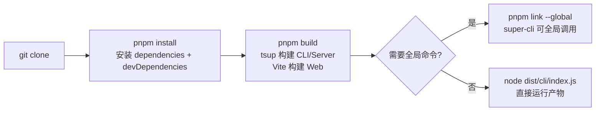
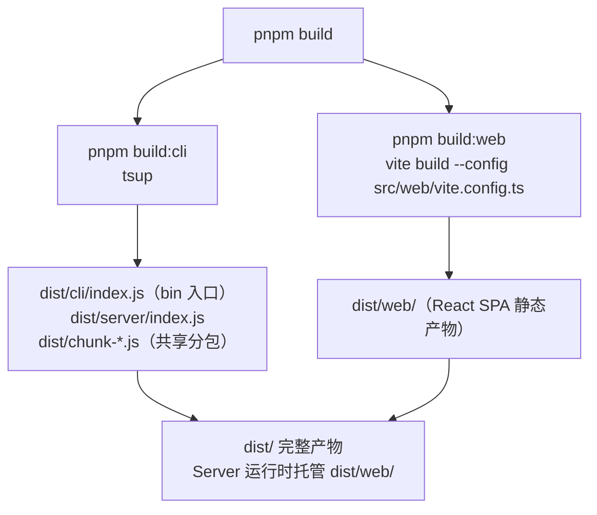
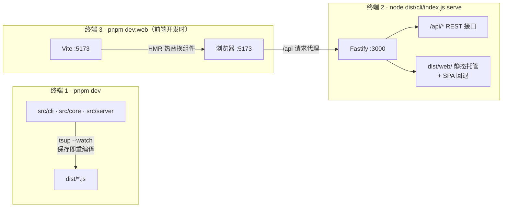

本页面向首次接触 super-cli 仓库的开发者，讲清楚三件事：**如何用 pnpm 把环境搭起来**、**开发时的热重载流程是怎么运转的**、**每个常用脚本分别在什么场景下执行**。读完本页，你应该能独立跑通"改代码 → 看效果"的完整开发闭环，并理解为什么本项目存在 CLI/Server 与 Web 前端两条并行的开发链路。

## 环境准备：Node 22 与 pnpm

super-cli 对开发环境有两条硬性要求，均在配置文件中有明确声明。首先是 **Node.js 版本不低于 22**：`package.json` 的 `engines` 字段写死了 `"node": ">=22.0.0"`，同时 tsup 构建目标也是 `node22`，这意味着代码中可以放心使用 Node 22 的运行时特性（如 `--experimental-` 之外已稳定的原生 API），低版本 Node 会直接构建失败或运行报错。其次是 **包管理器必须使用 pnpm**：仓库根目录的 `pnpm-lock.yaml` 是唯一的锁文件，`AGENTS.md` 开发约定中也将 pnpm 列为指定工具——混用 npm/yarn 会生成不一致的依赖树。动手前先用 `node -v` 和 `pnpm -v` 确认版本，pnpm 可通过 `npm install -g pnpm` 或 `corepack enable` 安装。

Sources: [package.json](package.json#L45-L47)、[package.json](package.json#L9-L16)、[AGENTS.md](AGENTS.md#L16-L26)

首次搭建的完整流程如下，共四步，其中 `pnpm link --global` 仅在你想把 `super-cli` 当全局命令使用时才需要：

```bash
# 1. 克隆仓库并安装依赖（依赖 node_modules/，已在 .gitignore 中）
git clone https://github.com/bluesky8318/super-cli.git
cd super-cli
pnpm install

# 2. 首次完整构建（生成 dist/，详见下文）
pnpm build

# 3.（可选）注册为全局命令，本地调试发布行为
pnpm link --global
```



Sources: [README.md](README.md#L51-L57)

## 常用脚本速查表

所有脚本定义在 `package.json` 的 `scripts` 字段中，共 9 条。新手最容易混淆的是 `dev` 与 `dev:web` 的分工——前者只管后端（CLI + Server + core），后者只管前端，两者互不替代，下表逐条说明：

| 脚本 | 实际命令 | 作用 | 何时使用 |
|---|---|---|---|
| `pnpm dev` | `tsup --watch` | 监听 `src/cli`、`src/core`、`src/server` 变更，自动重新编译到 `dist/` | 开发 CLI 命令、core 数据层或 Server 路由时 |
| `pnpm dev:web` | `vite dev` | 启动 Vite 开发服务器（默认 :5173），`/api` 自动代理到 localhost:3000 | 开发 React 前端时 |
| `pnpm build` | `build:cli` + `build:web` | 完整构建，产出可发布的 `dist/` | 提交前验证、发布前 |
| `pnpm build:cli` | `tsup` | 仅构建 CLI 与 Server 入口 | 只改了后端、想快速验证构建 |
| `pnpm build:web` | `vite build` | 仅构建前端 SPA 到 `dist/web/` | 只改了前端 |
| `pnpm test` | `vitest` | 运行 Vitest 测试（单文件：`pnpm test -- path/to/file.test.ts`） | 验证逻辑正确性 |
| `pnpm typecheck` | `tsc --noEmit` | TypeScript 类型检查（**不含 src/web/**，前端有独立配置） | 提交前 |
| `pnpm start` | `node dist/cli/index.js` | 直接运行构建产物 | 验证产物行为 |
| `pnpm prepublishOnly` | `pnpm build` | npm 发布前钩子，强制先构建 | `pnpm publish` 时自动触发 |

Sources: [package.json](package.json#L26-L36)、[AGENTS.md](AGENTS.md#L28-L41)

值得注意的是 `bin` 入口与 `files` 白名单的关系：`bin` 指向 `dist/cli/index.js`，而 `files` 字段把 `dist/cli`、`dist/server`、`dist/web` 以及 `dist/chunk-*.js`（tsup 代码分包产生的共享 chunk）全部纳入发布范围——这解释了为什么发布前必须完整执行 `pnpm build`，缺任何一步产物都不完整。

Sources: [package.json](package.json#L6-L17)

## 双轨构建体系：tsup 与 Vite 各管一段

本项目是"一个包、两套构建器"的结构，理解这个分工是理解热重载流程的前提。**tsup 负责 Node.js 侧**（CLI 与 Server），**Vite 负责浏览器侧**（React SPA），两者输出最终汇合到同一个 `dist/` 目录：

| 维度 | tsup（CLI/Server） | Vite（Web 前端） |
|---|---|---|
| 入口 | `src/cli/index.ts`、`src/server/index.ts` | `src/web/index.html`（加载 `src/main.tsx`） |
| 产物位置 | `dist/cli/`、`dist/server/`、`dist/chunk-*.js` | `dist/web/` |
| 模块格式 | ESM（`format: ['esm']`） | 浏览器原生 ESM |
| 目标环境 | `node22` | 现代浏览器 |
| 关键特性 | `splitting: true` 抽取 CLI/Server 共享代码；`external` 排除 react | `emptyOutDir` 清空产物目录；dev 模式代理 `/api` |
| 开发热重载 | `--watch` **只重新编译，不重启进程** | HMR **真正的模块级热替换** |



tsup 的配置值得逐行理解：两个入口共享 `src/core/` 数据层，`splitting: true` 让公共代码被抽取为 `chunk-*.js` 而不是在两个入口中重复打包；`external: ['react', 'react-dom']` 则防止 Node 侧构建意外把前端依赖打进去。而根 `tsconfig.json` 中定义的 `@core/*`、`@cli/*`、`@server/*` 路径别名由 tsup 在构建时解析，源码中可以放心使用别名导入。

Sources: [tsup.config.ts](tsup.config.ts#L3-L17)、[tsconfig.json](tsconfig.json#L17-L21)、[AGENTS.md](AGENTS.md#L75-L82)

Vite 配置有三个对开发流程至关重要的细节：`root` 显式指向 `src/web/`（因为配置文件不在项目根目录，必须用 `--config src/web/vite.config.ts` 指定）；`outDir` 跨两级回写到根目录的 `dist/web/`；`server.proxy` 把所有 `/api` 请求转发到 `http://localhost:3000`——这个端口正是 `super-cli serve` 的默认端口，两边是精确对应的。

Sources: [src/web/vite.config.ts](src/web/vite.config.ts#L5-L17)、[src/cli/commands/serve.ts](src/cli/commands/serve.ts#L8-L17)

## 热重载开发流程：三个终端的协作

开发时的完整链路需要最多三个终端协作，下图展示数据如何流动。**终端 1** 跑 `pnpm dev` 监听源码变更并重新编译；**终端 2** 跑 `node dist/cli/index.js serve` 启动 Fastify 服务（`serve` 命令通过 `await import('../../server/index.js')` 动态引入 Server，保持 CLI 启动轻量）；**终端 3** 仅在开发前端时需要，跑 `pnpm dev:web` 启动 Vite：



Sources: [package.json](package.json#L30-L31)、[src/cli/commands/serve.ts](src/cli/commands/serve.ts#L8-L17)、[src/web/vite.config.ts](src/web/vite.config.ts#L12-L16)

**关键提醒：`tsup --watch` 不会自动重启 Node 进程。** 它只负责把新代码编译进 `dist/`，终端 2 里运行中的 Server 仍加载着旧代码——改完后端代码后必须手动 `Ctrl+C` 再重新运行 `node dist/cli/index.js serve`。与之相对，Vite 的 HMR 是真正的模块级热替换，改 `src/web/src/` 下的组件浏览器即刻刷新，无需任何手动操作。两类代码的"改动到生效"路径对比如下：

| 你改动的位置 | 自动发生什么 | 还需手动做什么 |
|---|---|---|
| `src/web/src/**`（组件、样式） | 终端 3 的 Vite HMR 即刻生效，浏览器自动更新 | 无 |
| `src/core/**`、`src/cli/**`、`src/server/**` | 终端 1 的 tsup 重新编译到 `dist/` | 重启终端 2 的 serve 进程 |
| 根 `tsconfig.json`、构建配置 | 无 | 重启 `pnpm dev`（tsup 启动时会 `clean` 清空 dist） |

Sources: [tsup.config.ts](tsup.config.ts#L12-L13)、[package.json](package.json#L30-L31)

还有两个新手必知的运行时行为。第一，Server 对 `dist/web` 的托管带有 `existsSync` 存在性判断——如果你只跑了 `pnpm build:cli` 而从未构建前端，`serve` 启动后 `/api` 接口正常但浏览器访问首页会 404，此时执行一次 `pnpm build:web` 即可；不存在时会静默跳过静态注册，不报任何错误。第二，开发前端时务必确认终端 2 的服务已启动，否则 Vite 页面上所有 `/api` 请求都会因代理目标无响应而失败。

Sources: [src/server/index.ts](src/server/index.ts#L33-L44)

## TypeScript 的双 tsconfig 边界

本项目有两份独立的 TypeScript 配置，互不重叠。根 `tsconfig.json` 覆盖 Node 侧（`include: ["src/**/*.ts"]` 但 `exclude` 掉 `src/web`），使用 `NodeNext` 模块解析以匹配 ESM 运行时；`src/web/tsconfig.json` 覆盖前端，使用 `bundler` 解析模式配合 Vite，且 `noEmit: true`（前端类型只由 IDE 与 Vite 构建校验，不产出文件）。因此 `pnpm typecheck` 只检查后端代码，前端类型问题要在 `pnpm build:web` 或编辑器中发现。另外遵循全程 ESM 约定：源码中的相对导入一律写 `.js` 扩展名（如 `import ... from './routes/sessions.js'`），即使文件实际是 `.ts`。

| 配置 | 位置 | 模块解析 | 检查方式 | 覆盖范围 |
|---|---|---|---|---|
| 根 tsconfig | `tsconfig.json` | `NodeNext` | `pnpm typecheck` | `src/**/*.ts`（排除 `src/web`） |
| Web tsconfig | `src/web/tsconfig.json` | `bundler` | Vite 构建 / IDE | `src/web/src/**/*.ts(x)` |

Sources: [tsconfig.json](tsconfig.json#L3-L25)、[src/web/tsconfig.json](src/web/tsconfig.json#L1-L15)、[AGENTS.md](AGENTS.md#L77-L78)

## 故障排查速查表

| 症状 | 原因 | 解决办法 |
|---|---|---|
| `pnpm install` 或构建直接失败 | Node 版本低于 22 | `node -v` 检查，升级到 22+ |
| `serve` 启动后浏览器首页 404，但 `/api` 正常 | `dist/web/` 不存在，静态托管被静默跳过 | 先执行 `pnpm build:web` 再启动 serve |
| 前端页面所有数据加载失败 | 终端 2 的 Fastify 服务未启动，Vite 代理无目标 | 确认 `node dist/cli/index.js serve` 正在运行于 3000 端口 |
| 改了 `src/core` 代码但 API 行为没变 | `tsup --watch` 只重编译不重启进程 | 重启终端 2 的 serve 进程 |
| 端口 3000 被占用 | 上一个 serve 进程未退出 | 结束旧进程，或用 `serve --port 3001`（注意 Vite 代理目标需同步改） |
| `super-cli` 全局命令仍是旧版本 | `pnpm link` 链接的是 dist 产物，改源码后未重新构建 | 重新 `pnpm build`（dev watch 产出的 dist 也会被全局命令用到） |

Sources: [src/server/index.ts](src/server/index.ts#L33-L44)、[package.json](package.json#L33-L34)、[src/web/vite.config.ts](src/web/vite.config.ts#L12-L16)

## 下一步阅读

环境搭好后，建议按以下顺序深入：想理解 CLI 与 Server 如何共享 `src/core/` 数据层，读[三层架构解析：core 共享数据层如何同时服务 CLI 与 Server](6-san-ceng-jia-gou-jie-xi-core-gong-xiang-shu-ju-ceng-ru-he-tong-shi-fu-wu-cli-yu-server)；想弄清本页构建细节背后的完整设计，读[构建体系：tsup 打包 CLI/Server 与 Vite 构建 Web 的双轨流程](29-gou-jian-ti-xi-tsup-da-bao-cli-server-yu-vite-gou-jian-web-de-shuang-gui-liu-cheng)与[测试与类型检查：Vitest 实践与独立 tsconfig 边界](30-ce-shi-yu-lei-xing-jian-cha-vitest-shi-jian-yu-du-li-tsconfig-bian-jie)；准备发布或做全局调试时，读[发布与分发：npm 包结构、files 字段与 pnpm link 本地调试](32-fa-bu-yu-fen-fa-npm-bao-jie-gou-files-zi-duan-yu-pnpm-link-ben-di-diao-shi)。