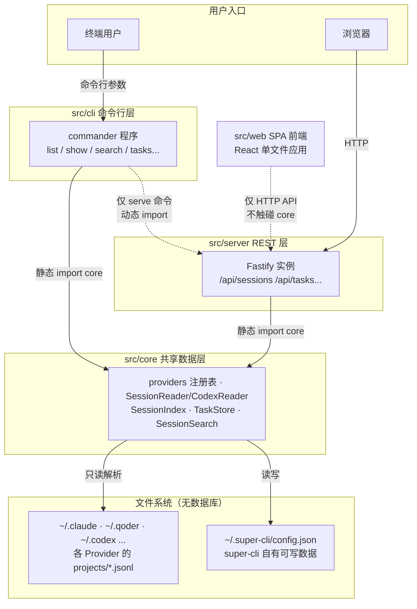
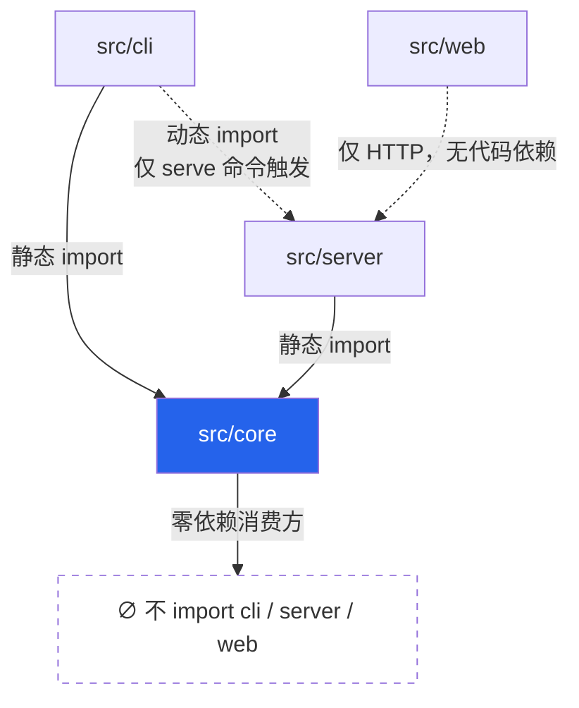
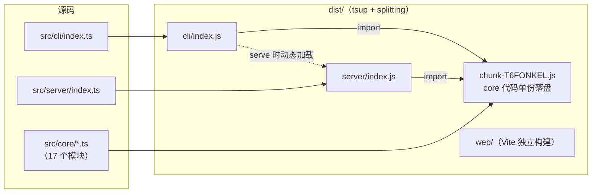

super-cli 面对的根本问题是：同一份 AI 会话数据（散落在 `~/.claude`、`~/.qoder`、`~/.codex` 等目录的 JSONL 文件），需要被两种完全不同的运行形态消费——**一次性执行的终端命令**与**长驻内存的 HTTP 服务**。这个项目给出的答案是典型的**分层复用架构**：把全部领域逻辑与文件访问收敛进 `src/core`，让 `src/cli`（命令行交互层）与 `src/server`（REST 服务层）成为两个平级消费方，二者之间唯一的连接点是 `serve` 命令中的一次动态 import。本文从代码证据出发，解析这套三层结构的职责边界、依赖铁律、构建期融合方式，以及同一份 API 在两种生命周期下的不同语义。

Sources: [cli/index.ts](src/cli/index.ts#L1-L30), [server/index.ts](src/server/index.ts#L7-L16)

## 全景鸟瞰：一张图看懂三层分工

在阅读下面的架构图前，需要先建立一个前提认知：**core 是唯一"懂业务"的层**——它知道八个 Provider 的目录约定、知道 JSONL 怎么解析、知道任务标签存放在哪；而 CLI 与 Server 都不懂这些，它们只负责把用户输入（命令行参数或 HTTP 查询串）翻译成对 core 的调用，再把结果格式化输出（终端表格或 JSON 响应）。下图用 Mermaid 绘制，箭头方向即依赖方向——所有箭头最终都汇聚到 core，没有任何反向箭头。

三层的职责划分可以从下表精确把握——每一层都有一条明确的"不做"清单，这正是分层的价值所在：

| 层 | 目录 | 代码量 | 核心职责 | 明确不做的事 |
|---|---|---|---|---|
| **core 共享数据层** | `src/core` | 17 个模块，约 2050 行 | Provider 注册与探测、JSONL 读取、索引聚合、任务标签持久化、Harness 配置解析 | 不依赖任何 CLI 框架（commander）与 Web 框架（fastify）；不做任何用户交互 |
| **cli 命令行层** | `src/cli` | 10 个文件，约 520 行 | 解析命令参数、调用 core、终端格式化输出 | 不直接读任何 Provider 目录；不含业务规则 |
| **server REST 层** | `src/server` | 7 个文件，约 630 行 | 组装 Fastify 路由、注入 core 实例、序列化 JSON 响应、托管静态前端 | 不解析命令行；不实现数据访问逻辑 |

值得注意的量化事实是：**core 层的代码量约占三层总量的 64%**，远超两个消费方之和。这个比例本身就说明了架构重心的位置——所有复杂性被有意压进了最底层。

Sources: [server/index.ts](src/server/index.ts#L18-L48), [tsup.config.ts](tsup.config.ts#L3-L17)

## core 层：唯一拥有领域知识的层

core 层的 17 个模块可以按职能归为五个族群，下表是完整的模块清单。理解这个清单后就明白：任何一个 CLI 命令或任何一个 API 端点所需要的能力，都能且只能在 core 中找到对应模块。

| 职能族群 | 模块 | 承担的角色 |
|---|---|---|
| **Provider 抽象** | `providers.ts` | 八款 AI CLI 工具的静态注册表与可用性探测 |
| | `session-reader.ts` / `codex-reader.ts` | 两套 `ISessionReader` 实现：通用 JSONL 读取器与 Codex 差异化读取器 |
| **索引与搜索** | `session-index.ts` | 聚合全部 Provider 会话的内存索引（含 TTL 缓存） |
| | `session-search.ts` | 跨 Session 全文搜索 |
| **自有数据** | `task-store.ts` | 任务标签的读写（唯一可写点） |
| | `config.ts` / `paths.ts` | 配置管理与全部文件路径规则的单一出处 |
| **Harness 配置** | `skill-reader.ts` `mcp-reader.ts` `rules-reader.ts` `hooks-reader.ts` `permissions-reader.ts` | 五类 Harness 配置的解析器 |
| **辅助能力** | `project-info.ts` `project-archive.ts` `terminal-launcher.ts` `types.ts` | 项目归档、终端启动、共享类型定义 |

core 层的"领域知识"集中体现在两处。第一处是 `providers.ts` 中的**静态注册表**：每款工具的命令名、启动参数、恢复参数、数据目录硬编码在 `PROVIDER_CONFIGS` 数组里，而 `getAvailableProviders()` 用一行 `existsSync(p.homeDir)` 在运行时探测哪些工具实际安装在本机——新增一款工具的支持，理论上只需在这个数组里追加一项。第二处是 `paths.ts`：从 Provider 的 `projects` 目录、session 文件名拼接规则，到 super-cli 自己的 `~/.super-cli/config.json` 落点，所有路径知识都被收敛进这 57 行代码，core 层其他模块一律从这里取路径，绝不自行拼接。

Sources: [providers.ts](src/core/providers.ts#L15-L39), [providers.ts](src/core/providers.ts#L82-L98), [paths.ts](src/core/paths.ts#L34-L53)

数据流向在这里呈现出一种刻意的不对称：**读路径开放，写路径唯一**。core 通过 SessionReader/CodexReader 大量读取各 Provider 的 JSONL 文件（这些文件由 Claude Code 等工具写入，super-cli 只消费），但自身可写的数据只有 `~/.super-cli/config.json` 一个文件——由 `TaskStore` 负责，采用"内存缓存 + 变更即写回"的策略：`load()` 首次读取后常驻内存，每次 `setLabel`、`addTag` 等变更操作后立即整文件写回磁盘。这条"只读他方数据、独占自有数据"的边界，是三层结构能保持简单的重要前提，其设计动机将在[无数据库设计哲学](8-wu-shu-ju-ku-she-ji-zhe-xue-zhi-du-jsonl-yu-wei-yi-ke-xie-dian-super-cli-config-json)中展开。

Sources: [task-store.ts](src/core/task-store.ts#L11-L35), [task-store.ts](src/core/task-store.ts#L47-L62)

## 两个消费方：同一 API 的两种生命周期

这是整个架构最值得玩味的一节——**CLI 与 Server 调用的是完全相同的 core API，但实例的生命周期截然相反**。以最高频的"列出所有会话"为例：CLI 侧，`super-cli list` 每次执行都在 action 回调里 `new SessionIndex()` 创建一个全新实例，调用 `getAllSessions()` 拿到数据、打印、然后进程退出——实例存活时间以毫秒计，缓存、内存状态随进程一起消亡。

Sources: [list.ts](src/cli/commands/list.ts#L17-L31)

Server 侧则相反：`startServer()` 在进程启动时创建**一个** `SessionIndex` 和**一个** `TaskStore`，随后以**构造函数参数注入**的方式把这两个实例分发给全部六个路由注册函数——所有 API 端点共享同一份索引和同一块缓存，实例的存活时间等于服务器进程的存活时间。

Sources: [server/index.ts](src/server/index.ts#L23-L31), [sessions.ts](src/server/routes/sessions.ts#L7-L33)

把两条路径并排放置，可以清晰看到它们在 core 的哪个方法上汇合（下图中两个流程最终都汇聚到 `getAllSessions()` 同一个节点）：

```mermaid
flowchart LR
    subgraph CLI路径["super-cli list（每次执行）"]
        A1["解析命令参数"] --> A2["new SessionIndex()"]
        A2 --> A3["index.getAllSessions&#40;opts&#41;"]
        A3 --> A4["formatSessionList 终端输出"]
        A4 --> A5["进程退出，实例消亡"]
    end

    subgraph Server路径["GET /api/sessions（服务器常驻）"]
        B1["解析 HTTP 查询串"] --> B2["注入的 index 实例<br/>（进程启动时已创建）"]
        B2 --> B3["index.getAllSessions&#40;opts&#41;"]
        B3 --> B4["inferSessionStatus 补充状态"]
        B4 --> B5["JSON 响应，实例继续存活"]
    end

    A3 --> M["core: SessionIndex.getAllSessions&#40;options: ListOptions&#41;"]
    B3 --> M
```

汇合点的一致性可以从参数结构上得到验证：CLI 的 `list` 命令与 Server 的 `/api/sessions` 端点传入的是**同一个 `ListOptions` 形状**——provider、project、since、until、branch、limit、offset、sort 八个字段一一对应。这意味着过滤与排序逻辑只在 core 写一份：CLI 新增一个过滤维度时，HTTP API 天然同步获得该能力，反之亦然。

Sources: [list.ts](src/cli/commands/list.ts#L20-L28), [sessions.ts](src/server/routes/sessions.ts#L13-L25), [session-index.ts](src/core/session-index.ts#L102-L139)

`SessionIndex` 本身的设计也为双消费场景留好了接口：构造函数接受可选的 `readers`、`taskStore` 与 `ttlMs` 参数，不传则自动探测可用 Provider 并采用 30 秒默认 TTL。这种"组合根注入"风格使得 CLI、Server、测试三种环境可以用不同的实例配置驱动同一套逻辑，而无需任何全局单例。

Sources: [session-index.ts](src/core/session-index.ts#L41-L69)

## 依赖方向铁律：core 对消费方一无所知

分层架构成立的充要条件是**依赖箭头单向**。对这个仓库做静态检索，结果干净得近乎教科书：`src/server` 的全部 7 个文件 import 了 core，但没有任何一行 import CLI；`src/web` 的源码中没有出现任何 core 路径——浏览器代码只通过 HTTP 与 Server 对话；而 `src/cli` 对 `src/server` 的唯一引用，藏在 `serve.ts` 第 15 行的一个动态 import 里。

Sources: [serve.ts](src/cli/commands/serve.ts#L11-L23)

| 依赖关系 | 是否存在 | 证据 |
|---|---|---|
| cli → core | ✅ 静态，7 处 | list/show/search/name/tasks/stats/config 各命令头部 |
| server → core | ✅ 静态，全部 7 个文件 | index.ts 与六个路由模块 |
| cli → server | ⚠️ 仅 1 处动态 import | `serve.ts#L15` 的 `await import('../../server/index.js')` |
| server → cli | ❌ 不存在 | 全目录检索零命中 |
| core → 任意消费方 | ❌ 不存在 | core 仅 import 自身模块与 node 内置模块 |
| web → core | ❌ 不存在 | 浏览器代码只能经 HTTP 间接消费 |

`serve` 命令的动态 import 值得单独说明——它不是随意的写法，而是三层结构的关键粘合点：`super-cli serve` 执行时才异步加载 Server 模块并调用 `startServer({ port, host })`。对用户而言，这意味着执行 `super-cli list` 这类纯读命令时，Fastify 及其全部路由代码**根本不会进入内存**；对架构而言，这保证了"CLI 与 Server 平级、仅此一处单向搭桥"的关系不会被滥用为普遍的交叉依赖。Server 的组装细节（路由注册、静态托管、SPA 回退）在[Fastify REST API 参考](18-fastify-rest-api-can-kao-api-sessions-api-tasks-api-projects-deng-duan-dian)中详述。

Sources: [serve.ts](src/cli/commands/serve.ts#L11-L23)

## 构建时如何融合：双入口与共享 chunk

源码层面的分层，最终要靠构建体系物化为可分发的产物。`tsup.config.ts` 声明了**两个独立入口**——`src/cli/index.ts` 与 `src/server/index.ts`——并开启 `splitting: true` 与 ESM 格式。这条配置的直接后果是：两个入口各自打出一个 bundle，而**被二者共同引用的 core 代码被抽取到一个共享 chunk 文件中**，两个 bundle 都从这个 chunk 导入，而不是各自内联一份副本。

Sources: [tsup.config.ts](tsup.config.ts#L3-L17)

这个机制不是理论推演，构建产物中可以直接观测到。`dist/` 目录下除 `cli/`、`server/`、`web/` 三个子目录外，确实存在一个 `chunk-T6FONKEL.js`；检索证实 `dist/cli/index.js` 与 `dist/server/index.js` 的头部都通过 `from "../chunk-T6FONKEL.js"` 导入符号，且该 chunk 内包含 `SessionIndex` 与 `TaskStore` 的实现——**core 层在最终产物中以物理上的单份代码同时服务两个入口**，与源码层的"共享数据层"形成精确映射。

`package.json` 与之分毫不差地配合：`bin` 字段将 `super-cli` 命令指向 `dist/cli/index.js`（CLI 是进程入口，Server 是被它按需加载的模块），`files` 字段则同时打包 `dist/cli`、`dist/server`、`dist/web` 与 `dist/chunk-*.js` 四项——共享 chunk 被显式列入发布清单，缺了它两个入口都无法运行。值得注意的是 web 前端走的是完全独立的构建轨道（Vite），与 tsup 互不干涉，这套双轨制的完整细节见[构建体系：tsup 打包 CLI/Server 与 Vite 构建 Web 的双轨流程](29-gou-jian-ti-xi-tsup-da-bao-cli-server-yu-vite-gou-jian-web-de-shuang-gui-liu-cheng)。

Sources: [package.json](package.json#L6-L17), [tsup.config.ts](tsup.config.ts#L3-L17)

## 生命周期差异带来的缓存语义

同一个 `SessionIndex` 类，在两种消费方手里呈现出**本质不同的缓存行为**——这是"共享代码层"与"共享运行状态"的关键区别：core 被共享的是**代码与逻辑**，而不是状态。

| 维度 | CLI 形态（`super-cli list`） | Server 形态（`super-cli serve`） |
|---|---|---|
| 实例创建时机 | 每次命令 action 执行时 | `startServer()` 启动时，仅一次 |
| 实例数量 | 每次调用一个，用完即弃 | 单实例，全进程共享 |
| 30s TTL 缓存的实际效果 | 基本无效——进程活不过 TTL | 30 秒内的重复请求直接命中内存缓存 |
| 数据新鲜度 | 每次执行必然重建索引（天然最新） | 依赖 TTL 到期或显式刷新 |
| 刷新机制 | 不需要（进程即缓存） | `POST /api/refresh` → `invalidateCache()` |

Server 侧的刷新机制代码极简：`refresh.ts` 整个文件只有 9 行，路由处理器做一件事——调用注入实例的 `invalidateCache()`，将 `built` 标志与时间戳复位，迫使下一次查询重新扫描文件系统。前端看板上的"刷新"按钮最终触发的就是这条链路。而 TTL 缓存与 `buildIndex` 的完整判定逻辑，留给[SessionIndex 内存索引：TTL 缓存与强制刷新策略](13-sessionindex-nei-cun-suo-yin-ttl-huan-cun-yu-qiang-zhi-shua-xin-ce-lue)专门剖析。

Sources: [refresh.ts](src/server/routes/refresh.ts#L4-L9), [session-index.ts](src/core/session-index.ts#L66-L73), [server/index.ts](src/server/index.ts#L23-L31)

这种"代码共享、状态隔离"的设计还带来一个隐性收益：**CLI 修改任务标签后，Server 立即可见**。因为 TaskStore 的每次变更都直接写穿到 `~/.super-cli/config.json`（见前文 `save()` 逻辑），而 Server 的 SessionIndex 重建时会重新 `getAll()` 拉取标签——文件系统成为两个进程间天然的状态同步介质，无需任何进程间通信。这是无数据库设计在架构层面的又一次兑现。

Sources: [task-store.ts](src/core/task-store.ts#L31-L35), [session-index.ts](src/core/session-index.ts#L71-L89)

## 设计权衡：为什么是目录分层而非多包

对中级开发者而言，理解这套架构还差最后一问：既然分层如此清晰，为什么不把 core 拆成独立 npm 包，而要留在同一个包的子目录里？下表对比了两种方案的得失，可以看出当前选择在项目现阶段收益明显。

| 方案 | 优势 | 代价 | 适配本项目的程度 |
|---|---|---|---|
| **目录分层 + tsup splitting（现状）** | 零发布开销；core 与消费方原子化同步演进；类型零配置直接共享；产物仍物理去重 | 分层靠约定而非编译器强制；无法单独版本化 | ⭐⭐⭐⭐⭐ |
| **npm workspaces 多包** | 边界由包机制强制；可独立发布复用 | 多份 package.json/tsconfig 维护成本；本地 link 调试链路复杂 | ⭐⭐ |
| **单入口全量打包** | 配置最简 | fastify 等重依赖会拖慢所有纯读命令的冷启动 | ⭐⭐⭐（但失去 serve 懒加载收益） |

现状方案唯一的软约束是"core 不得 import 消费方"这条铁律靠代码评审而非工具强制——不过前文的检索已经证明，这条约定在这个代码库中执行得非常干净，且 `serve` 的动态 import 恰好把唯一的跨层引用锁定在了一个可审查的位置。

Sources: [tsup.config.ts](tsup.config.ts#L3-L17), [serve.ts](src/cli/commands/serve.ts#L11-L23)

## 小结

把全文压缩成三句话：**core 是唯一持有领域知识的数据层，其读写边界为"只读各 Provider 的 JSONL、独写 `~/.super-cli/config.json`"；CLI 与 Server 是平级消费方，通过同一个 `SessionIndex`/`TaskStore` API 获取数据，仅靠 serve 命令的一处动态 import 相连；tsup 的双入口加 splitting 让 core 在构建产物中以单份共享 chunk 同时服务两个运行形态。** 理解了这三点，这个仓库的其余部分——无论是新增一个 Provider 还是新增一个 API 端点——都只是在既定轨道上填空。

若要继续深入，推荐按以下顺序阅读：先看[共享类型系统：SessionMessage、SessionMetadata 与核心数据模型](7-gong-xiang-lei-xing-xi-tong-sessionmessage-sessionmetadata-yu-he-xin-shu-ju-mo-xing)弄清 core 层流动的数据结构，再看[无数据库设计哲学：直读 JSONL 与唯一可写点 ~/.super-cli/config.json](8-wu-shu-ju-ku-she-ji-zhe-xue-zhi-du-jsonl-yu-wei-yi-ke-xie-dian-super-cli-config-json)理解这条架构边界背后的动机，随后可沿[Provider 注册表：八款 AI CLI 工具的统一抽象](9-provider-zhu-ce-biao-ba-kuan-ai-cli-gong-ju-de-tong-chou-xiang)向下钻取数据层细节。