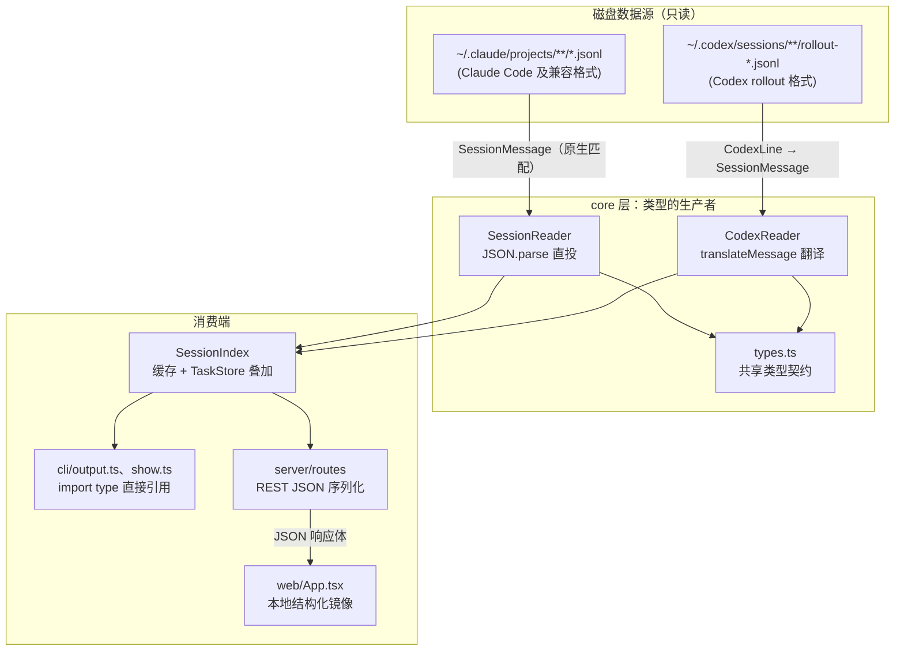
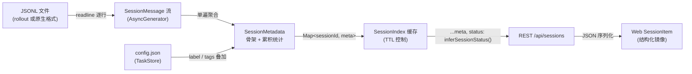

在 super-cli 的三层架构中，`src/core/types.ts` 是一份仅 211 行、零 import、零运行时代码的纯类型文件，却扮演着整个系统的**契约中心**角色：core 层的两个读取器（`SessionReader` 与 `CodexReader`）按照它生产数据，CLI 与 Server 按照它消费数据，Web 前端则通过 REST JSON 对它做结构化镜像。本文以数据模型的两个核心——原始行模型 `SessionMessage` 与派生视图 `SessionMetadata`——为主线，解释这套类型系统如何用"宽容读取 + 边界归一化"的策略，统一八款 AI CLI 工具截然不同的落盘格式。

Sources: [types.ts](src/core/types.ts#L1-L211)

## 类型全景：一个文件，五个领域

`types.ts` 内的类型可以按职责划分为五个域：身份与枚举、会话消息域、派生聚合域、查询与结果域、配置与项目域。下表是完整清单：

| 领域 | 类型 | 行号 | 职责 |
|---|---|---|---|
| 身份与枚举 | `CliProvider` | L1 | 八款工具的联合类型：`claude-code` / `qoder` / `codex` / `kimi` / `pi` / `opencode` / `workbuddy` / `traecode` |
| 身份与枚举 | `SessionStatus` | L2 | 看板五状态：`backlog` / `in_progress` / `review` / `done` / `cancelled` |
| 身份与枚举 | `TerminalType` | L3 | 五款 macOS 终端：`ghostty` / `iterm2` / `terminal` / `kitty` / `warp` |
| 会话消息域 | `ContentBlock` | L5-14 | 消息内容的块级结构：`text` / `tool_use` / `tool_result` |
| 会话消息域 | `TokenUsage` | L16-21 | token 消耗：input / output / 两类缓存字段 |
| 会话消息域 | `SessionMessage` | L23-53 | JSONL 单行的完整模型（本文重点一） |
| 派生聚合域 | `SessionMetadata` | L55-76 | 单会话的聚合摘要（本文重点二） |
| 派生聚合域 | `ActiveSession` | L78-88 | 活跃进程快照（pid、startedAt、entrypoint） |
| 派生聚合域 | `HistoryEntry` | L90-96 | shell 历史条目 |
| 查询与结果域 | `ListOptions` / `SearchOptions` | L116-134 | 列表过滤与搜索的入参契约 |
| 查询与结果域 | `SearchResult` / `SearchHit` | L136-147 | 搜索命中聚合与单条命中 |
| 配置与项目域 | `TaskLabel` / `AppConfig` | L98-114 | 任务标签与全局唯一可写配置 |
| 配置与项目域 | `ProjectInfo` / `ProjectDetail` | L149-171 | 项目卡片与项目详情 |
| 配置与项目域 | `DailyStats` | L173-178 | 按日统计 |
| 配置与项目域 | `SkillInfo` / `McpServerInfo` / `RuleFile` | L180-210 | Harness 配置读取器的输出模型 |

值得注意的是，这份文件不依赖任何 runtime import——所有类型都是 `export interface` 或 `export type` 声明，配合主 `tsconfig.json` 开启的 `declaration: true`，任何消费方都以 `import type` 方式引用，编译后不产生任何字节。这种"类型即契约"的做法是无数据库设计（详见 [无数据库设计哲学](8-wu-shu-ju-ku-she-ji-zhe-xue-zhi-du-jsonl-yu-wei-ke-xie-dian-super-cli-config-json)）的前提：既然不存储中间数据，那么跨层一致性的唯一保障就是这组共享类型。

Sources: [types.ts](src/core/types.ts#L1-L211)、[tsconfig.json](tsconfig.json)

用一张图概括这套类型系统在生产端与消费端的位置关系：



下文依次展开两个核心类型，以及 Codex 翻译层和 Web 镜像边界这两个关键机制。

Sources: [types.ts](src/core/types.ts#L1-L211)

## SessionMessage：用"宽容读取器"建模 JSONL 原始行

`SessionMessage` 是对 JSONL 文件中**一行 JSON** 的忠实建模，它的第一个设计决策体现在 `type` 字段的联合类型上——八种消息类型共存于一个接口：

```typescript
type: 'user' | 'assistant' | 'permission-mode' | 'attachment'
    | 'file-history-snapshot' | 'last-prompt' | 'queue-operation';
```

其中只有 `user` 和 `assistant` 是对话主体，其余六种是 Claude Code 在会话过程中写入的**元事件行**（权限模式切换、附件、文件快照、最后提示、队列操作）。将它们全部纳入同一个模型而非拆成多个接口，使得 `streamSession()` 可以不做任何类型分拣地 `yield JSON.parse(line) as SessionMessage`——类型系统只描述"这一行长什么样"，是否消费由下游决定。事实上，CLI 的 `printConversation` 和搜索的 `extractText` 都以 `m.type === 'user' || m.type === 'assistant'` 作为过滤门槛，Server 的消息端点同样先 filter 再投影。

Sources: [types.ts](src/core/types.ts#L23-L53)、[session-reader.ts](src/core/session-reader.ts#L39-L52)、[show.ts](src/cli/commands/show.ts#L72-L94)

第二个设计决策是**全字段可选**：除 `type` 外，`uuid`、`parentUuid`、`timestamp`、`cwd`、`gitBranch` 等约二十个字段全部带 `?`。这是典型的**宽容读取器（tolerant reader）模式**——上游 JSONL 由外部工具写入，字段随版本演进增减，消费者必须假设任何字段都可能缺失。`SessionIndex.buildIndex()` 中整个 `try/catch` 包裹逐个会话的读取、失败即跳过，正是这一宽容哲学在索引层的延伸。

Sources: [types.ts](src/core/types.ts#L23-L53)、[session-index.ts](src/core/session-index.ts#L78-L96)

第三个设计决策是**嵌套的 `message` 子对象**。`SessionMessage.message` 内部再承载 `role`、`model`、`content`（`string | ContentBlock[]` 双形态）、`stop_reason`、`usage`。这层嵌套并非随意——它精确对应 Claude Code 落盘行中 Anthropic API 响应结构的原样嵌入。`content` 的双形态是全系统最常处理的分支：`show.ts` 的工具用量统计、`session-search.ts` 的文本提取、`readSessionMetadata` 的首条用户消息截取，三处都写了 `typeof content === 'string'` / `Array.isArray(content)` 的双分支逻辑。

Sources: [types.ts](src/core/types.ts#L37-L45)、[show.ts](src/cli/commands/show.ts#L57-L70)、[session-search.ts](src/core/session-search.ts#L83-L93)

块级内容 `ContentBlock` 与 token 计量 `TokenUsage` 是 `SessionMessage` 的两个配套小组件，前者的 `type` 字段构成 `text` / `tool_use` / `tool_result` 的三态判别（`name`+`input` 属于工具调用，`tool_use_id`+`is_error` 属于工具结果），后者携带四个 token 计数维度。`ContentBlock.content` 字段的自引用（`string | ContentBlock[]`）允许工具结果嵌套块级内容，这与 Claude API 的内容块结构逐字段对齐。

Sources: [types.ts](src/core/types.ts#L5-L21)

## SessionMetadata：单遍流式聚合的派生视图

如果说 `SessionMessage` 是"原始事实"，`SessionMetadata` 就是"加工摘要"。它的 17 个字段中有 13 个是统计或提取结果：消息计数三连（`messageCount` / `userMessageCount` / `assistantMessageCount`）、token 累计两项（`totalInputTokens` / `totalOutputTokens`）、模型列表 `models: string[]`、首末时间戳、以及截断至 200 字符的 `firstUserMessage`。

`SessionReader.readSessionMetadata()` 展示了这套派生关系的完整映射规则——初始化一个骨架对象后，以单遍流式迭代逐行累积：

| SessionMessage 中的信号 | 聚合到 SessionMetadata 的字段 | 聚合规则 |
|---|---|---|
| 每一行 | `messageCount` | 计数器递增 |
| `timestamp` | `firstTimestamp` / `lastTimestamp` | 首次出现赋 first，持续覆盖 last；数字时间戳转 ISO 字符串 |
| `cwd` / `gitBranch` / `entrypoint` / `version` | 同名字段 | **首见即锁定**（`if (!metadata.cwd)` 模式），后续行不覆盖 |
| `type === 'user'` | `userMessageCount`、`firstUserMessage` | 首条用户消息取 `content` 的 string 或首个 text 块，截 200 字符 |
| `type === 'assistant'` + `message.model` | `models`、`assistantMessageCount` | 模型用 `Set<string>` 去重后展开为数组 |
| `type === 'assistant'` + `message.usage` | `totalInputTokens` / `totalOutputTokens` | 累加求和 |
| （末尾兜底）`metadata.cwd` 存在 | `project` | 用 cwd 覆盖目录名解码值，得到更准确的路径 |

其中两处细节值得注意：**"首见即锁定"策略**假设 cwd、分支等环境信息在会话内不变，这是对 Claude Code 行为的经验性归纳；**末尾的 `project = cwd` 覆盖**则修正了一个数据质量问题——目录编码名（如 `Users-alice-work-myproject`）解码后丢失了前导 `/`，用消息内真实 cwd 替换后，前端的"在 Finder 中打开"等功能才能拿到可用路径。

Sources: [types.ts](src/core/types.ts#L55-L76)、[session-reader.ts](src/core/session-reader.ts#L62-L120)

`SessionMetadata` 中的 `label` 与 `tags` 两个字段**不来自 JSONL**，而来自系统唯一的可写点 `~/.super-cli/config.json`。`SessionIndex.buildIndex()` 在每个会话元数据入缓存前，用 `TaskStore.getAll()` 返回的 `Record<string, TaskLabel>` 按 `sessionId` 叠加标签——这是读取域（JSONL）与用户域（config.json）在类型层的汇合点。这一"读取时合并"的决策意味着元数据缓存不持久化用户标注，每次重建索引都重新叠加。

Sources: [types.ts](src/core/types.ts#L98-L114)、[session-index.ts](src/core/session-index.ts#L75-L100)、[task-store.ts](src/core/task-store.ts#L33-L41)

数据从磁盘到前端的完整旅程可以用下面的流程图表达：



Sources: [session-reader.ts](src/core/session-reader.ts#L39-L120)、[session-index.ts](src/core/session-index.ts#L75-L100)、[sessions.ts](src/server/routes/sessions.ts#L24-L31)

## CodexReader：归一化发生在读取边界

`SessionMessage` 能否直接 `JSON.parse` 直投，取决于上游格式是否与 Claude Code 原生格式一致——八款工具中七款兼容，唯独 Codex 的 rollout 格式差异显著：每行是 `{timestamp, type, payload}` 的三段式结构（本地接口 `CodexLine`），对话内容藏在 `response_item` 类型行的 `payload` 里，且模型信息不在消息行上，而在独立的 `turn_context` 行中。

`CodexReader` 因此在读取边界实现了一个**翻译层**：`translateMessage()` 只识别 `type === 'response_item'` 且 `payload.role` 为 user/assistant 的行，将其映射为统一 `SessionMessage`；`translateContent()` 把 Codex 的 `input_text` / `output_text` 块统一转为 `{type: 'text', text}` 块；`streamSession()` 则维护一个 `currentModel` 状态变量，在遍历中捕获 `turn_context` 行的模型名，回填到 assistant 消息上。关键在于：**翻译只发生在 stream 出口**，下游的搜索、统计、展示代码对此完全无感知——`session-search.ts` 和 `output.ts` 对两种来源的数据执行同一套逻辑。代价是信息有损：Codex 的非对话行（如工具调用）在翻译中被丢弃（`return null`），因此 Codex 会话的 `messageCount` 与 token 统计口径与原生格式不同。

Sources: [codex-reader.ts](src/core/codex-reader.ts#L16-L20)、[codex-reader.ts](src/core/codex-reader.ts#L117-171)、[session-reader.ts](src/core/session-reader.ts#L39-L52)

这套生产契约被显式抽象为 `ISessionReader` 接口（位于 `session-index.ts` 而非 `types.ts`），其五个方法签名全部锚定在共享类型上：`streamSession` 产出 `AsyncGenerator<SessionMessage>`，`readSessionMetadata` 返回 `SessionMetadata`。一个小的考古细节：`SessionMessage` 的 `import type` 语句出现在接口定义**之后**（第 19 行）——ES module 的 import 提升使其完全合法，但也暴露了这段代码是在接口成型后才补充类型引用的演进痕迹。

Sources: [session-index.ts](src/core/session-index.ts#L9-L19)

## 共享的真实边界：编译期导入 vs 结构化镜像

"共享类型系统"的"共享"在两个消费端有截然不同的含义。CLI 与 Server 与 core 共用一份 `tsconfig.json`（`exclude` 仅排除 `src/web`），tsup 以 code-splitting 方式将它们打包进同一 `dist`，因此 `import type { SessionMetadata } from '../core/types.js'` 是**编译期零成本的直接引用**——`cli/output.ts` 用它格式化表格，`server/routes/*.ts` 用它约束查询参数与响应体，类型改动会被 `tsc` 即时捕获。

Web 前端则是另一回事。主 `tsconfig.json` 显式排除 `src/web`，前端有独立的 `tsconfig.json`（`noEmit`，由 Vite 构建产物），运行时更与 core 无模块连接——两端唯一的接触面是 REST JSON。于是 `App.tsx` 顶部出现了整块的**本地类型镜像**：第 27-28 行逐字复刻了 `SessionStatus` 和 `CliProvider` 两个联合类型，第 66-86 行的 `SessionItem` 接口则镜像了 `SessionMetadata` 的绝大部分字段，并额外增加三个服务端增强字段：`status`（由 `/api/sessions` 端点在响应时通过 `inferSessionStatus` 计算后展开进 `...s`）、`lastAssistantMessage`、以及列表场景下的分页数据。这种"契约靠结构对齐、变更靠人工同步"的模式是有意识的取舍——保持了构建体系的完全解耦，代价是 core 类型演进时 Web 镜像不会产生编译错误。

| 维度 | CLI / Server | Web 前端 |
|---|---|---|
| 引用方式 | `import type` 编译期导入 | 本地接口镜像（`SessionItem` / `Message`） |
| 构建体系 | tsup，共享 dist 与 tsconfig | Vite 独立构建，独立 tsconfig |
| 数据到达路径 | core 函数调用直接返回类型化对象 | fetch + `res.json()`（无运行时校验） |
| 类型漂移风险 | `tsc` 即时报错 | 无编译期保护，靠 REST 响应结构对齐 |
| 增强字段 | 无 | `status`（服务端推断）、`lastAssistantMessage` |

Sources: [tsconfig.json](tsconfig.json)、[web/tsconfig.json](src/web/tsconfig.json#L1-L20)、[App.tsx](src/web/src/App.tsx#L24-L104)、[sessions.ts](src/server/routes/sessions.ts#L24-L31)

## 查询、结果与项目域类型：模型的下游辐射

围绕两个核心类型，`types.ts` 的其余部分构成了完整的查询-结果闭环。`ListOptions` 是列表过滤的入参契约，其七个可选字段（provider、project、since/until、sort、limit/offset、branch、model）在 `SessionIndex.getAllSessions()` 中逐一转化为对 `SessionMetadata` 缓存的过滤与排序谓词——`since` 比较的是 `lastTimestamp`，`until` 比较的却是 `firstTimestamp`，这一非对称设计使得时间窗口能覆盖"开始于窗口前、结束于窗口内"的会话。`SearchOptions` / `SearchResult` / `SearchHit` 则构成搜索三件套：命中按会话聚合（每会话最多展示 5 条 `hits`，但保留真实 `totalHits`），`SearchHit.snippet` 由 `createSnippet()` 以命中位置为锚点截取前后 50/100 字符生成。

Sources: [types.ts](src/core/types.ts#L116-L147)、[session-index.ts](src/core/session-index.ts#L102-L139)、[session-search.ts](src/core/session-search.ts#L37-L45)、[session-search.ts](src/core/session-search.ts#L95-L106)

项目域的两个类型呈现"轻量列表 + 重量详情"的分层：`ProjectInfo` 是从 `SessionMetadata` 缓存二次聚合出的项目卡片（`providers` 数组记录同一项目被哪些工具使用过，归档/置顶标记由 Server 叠加）；`ProjectDetail` 则额外携带磁盘探测结果（`gitRemoteUrl` / `gitStatus` / `nodeVersion` / `packageManager`），由 `project-info.ts` 实时探测填充。`DailyStats` 与 Harness 域的 `SkillInfo` / `McpServerInfo` / `RuleFile`（均带 `provider` 判别字段与 `scope: 'global' | 'project'` 二态）沿用同一套"每条记录标注来源 provider"的组织原则，与 `SessionMetadata.provider` 形成一致的跨域检索维度。

Sources: [types.ts](src/core/types.ts#L149-L210)、[session-index.ts](src/core/session-index.ts#L164-L192)、[project-info.ts](src/core/project-info.ts#L5-L11)

## 设计取舍评估

以中间件设计标准衡量，这套类型系统的核心权衡可以总结为下表：

| 设计决策 | 收益 | 代价 |
|---|---|---|
| 全字段可选的宽容读取器 | 上游格式演进零成本兼容，malformed 行静默跳过 | 消费端处处判空，双分支逻辑重复出现 |
| 单接口容纳八种消息类型 | stream 直投免分拣，新增元事件行无需改类型 | 接口较宽，`type` 之外的字段相关性靠文档约定 |
| 以 Claude Code 格式为规范形 | 七款兼容工具零翻译直投 | Codex 翻译层有信息损失（工具调用被丢弃） |
| 元数据读取时聚合（不落盘） | 无缓存失效问题，JSONL 始终是唯一真相源 | 每次索引重建需全量流式重读，靠 TTL 缓存缓解 |
| Web 端结构化镜像而非共享导入 | 构建体系完全解耦，无需处理 Node/DOM 类型冲突 | 类型漂移无编译期保护，镜像字段需人工同步 |

Sources: [types.ts](src/core/types.ts#L23-L76)、[session-reader.ts](src/core/session-reader.ts#L44-L51)、[codex-reader.ts](src/core/codex-reader.ts#L141-L158)

理解了这份数据模型，后续几个方向的深入阅读会顺畅许多：类型的生产管线细节见 [JSONL 流式解析引擎：readline 逐行读取与元数据提取](10-jsonl-liu-shi-jie-xi-yin-qing-readline-zhu-xing-du-qu-yu-yuan-shu-ju-ti-qu) 与 [CodexReader 差异化实现：rollout 文件格式与 ISessionReader 接口](11-codexreader-chai-yi-hua-shi-xian-rollout-wen-jian-ge-shi-yu-isessionreader-jie-kou)；`SessionMetadata` 如何驱动缓存与状态推断见 [SessionIndex 内存索引：TTL 缓存与强制刷新策略](13-sessionindex-nei-cun-suo-yin-ttl-huan-cun-yu-qiang-zhi-shua-xin-ce-lue) 与 [Session 状态自动推断：标签优先级与活跃检测算法](15-session-zhuang-tai-zi-dong-tui-duan-biao-qian-you-xian-ji-yu-huo-yue-jian-ce-suan-fa)；类型经 REST 暴露的完整端点清单见 [Fastify REST API 参考：/api/sessions、/api/tasks、/api/projects 等端点](18-fastify-rest-api-can-kao-api-sessions-api-tasks-api-projects-deng-duan-dian)。