super-cli 最反直觉、也最值得深究的架构决策，是它**彻底放弃了独立数据库**。它不复制数据、不建立持久化索引、不运行后台同步进程——所有会话数据都在请求到达的那一刻，直接从各 AI CLI 工具落盘的 JSONL 文件中流式读出；而它自己产生的全部用户状态（任务标签、项目归档、偏好设置），则收敛写入**唯一一个文件**：`~/.super-cli/config.json`。这一"单向阀"式的读写分离设计是理解整个 core 数据层的钥匙。本文将从设计声明出发，逐层解剖读路径、内存索引与写点收敛的实现细节，并客观分析这套哲学的收益与代价。

## 设计哲学总览：一读一写的单向阀架构

这一哲学并非文档层面的修辞，而是被明确写进了项目的协作约定中。AGENTS.md 用一句话概括了核心契约："无独立数据库，只读 `~/.claude/` JSONL，只写 `~/.super-cli/config.json`"；项目自述文档则进一步声明"直接读取 `~/.claude/`、`~/.qoder/`、`~/.codex/` 下的 JSONL 文件，无数据库，无外部 API 调用。仅在 `~/.super-cli/config.json` 存储用户标签/命名配置"。README 的"数据存储"一节以表格形式列出了全部数据来源，四行路径中三行属于外部 Provider，仅一行属于 super-cli 自己。换句话说，super-cli 把自己定位为**寄生式只读观察者**（parasitic read-only observer）：宿主（Claude Code、Codex 等）负责生产数据，super-cli 只负责消费，绝不动宿主的数据分毫。

Sources: [AGENTS.md](AGENTS.md#L81), [AGENTS.md](AGENTS.md#L14), [README.md](README.md#L147-L156)

下面的概念图展示了这条"读写单向阀"。左侧是数据生产者（各 AI CLI 工具持续追加写入自家 JSONL），中间是 super-cli 的 core 数据层，右侧是唯一可写点。数据流严格单向：JSONL 只进不出（只读），config.json 只承载 super-cli 自身的增量状态。**读取时零拷贝、写入时零扩散**，是整个体系的两大不变量。

```mermaid
flowchart LR
    subgraph P["数据生产者（宿主 AI CLI 工具）"]
        CC["~/.claude/projects/&#10;&lt;encoded&gt;/&lt;uuid&gt;.jsonl"]
        QD["~/.qoder/projects/..."]
        CX["~/.codex/sessions/..."]
    end

    subgraph S["super-cli core 数据层"]
        SR["SessionReader / CodexReader&#9679; 流式直读（只读）"]
        SI["SessionIndex&#9679; 纯内存缓存 + TTL"]
        W["ConfigManager / TaskStore&#9679; ProjectArchive（写方）"]
    end

    CFG[("~/.super-cli/config.json&#9679; 唯一可写点")]

    CC -- "createReadStream" --> SR
    QD -- "createReadStream" --> SR
    CX -- "createReadStream" --> SR
    SR --> SI
    SR --> W
    W -- "load → mutate → 整体重写" --> CFG

    style CC stroke-dasharray: 5 5
    style QD stroke-dasharray: 5 5
    style CX stroke-dasharray: 5 5
    style CFG stroke-width:3px
```

（上图说明：虚线框代表 super-cli 不拥有的外部文件；实线箭头为读取流，箭头方向即数据流方向；`●` 标记只读组件。）

选择这条路线的实际收益是结构性的。super-cli 永远不会与宿主工具产生**写冲突**——宿主可以随时追加、压缩甚至删除自己的会话文件，super-cli 下一次读取自动获得最新状态，无需任何同步逻辑。这也意味着零 ETL、零双写、零数据漂移：不存在"索引说有但文件已删"的一致性问题，因为索引根本不落盘。代价则留到后文"设计权衡"一节展开。

Sources: [AGENTS.md](AGENTS.md#L62-L69), [src/core/session-reader.ts](src/core/session-reader.ts#L39-L52)

## 读路径解剖：JSONL 即数据库，元数据即视图

在传统方案里，"读取会话列表"意味着查询一张预建好的 sessions 表。super-cli 的做法则是把**文件系统当作数据库**：目录即表（`~/.claude/projects/<编码路径>/` 下每个子目录是一个项目），文件即行（每个 `<uuid>.jsonl` 是一条会话记录）。`paths.ts` 是这套映射的"schema 层"，所有读取路径都由纯函数从 Provider 标识推导而来——`getProjectsDir()`、`getSessionsDir()`、`getHistoryPath()` 分别指向各 Provider 家目录下的 projects、sessions 与 history.jsonl，全程不涉及任何 super-cli 自己的存储。

Sources: [src/core/paths.ts](src/core/paths.ts#L14-L32), [AGENTS.md](AGENTS.md#L64-L65)

真正的核心读取器 `SessionReader.streamSession()` 是一个 AsyncGenerator：`createReadStream` 以 UTF-8 打开文件，`readline.createInterface` 逐行消费，每行独立 `JSON.parse`，解析失败的行静默跳过。这个设计有三层深意。**其一，内存占用与文件大小解耦**——一个数百 MB 的会话文件也只会以"一行"为单位占用内存。**其二，天然容错**——JSONL 的追加式写入特性意味着末行可能处于半写状态，逐行解析 + 跳过坏行的策略让读取器对宿主的并发写入完全免疫。**其三，惰性求值**——上层可以只消费前 N 条消息而不触达文件剩余部分，`readSession()` 聚合全部消息与搜索场景的流式扫描都建立在同一个生成器之上。

Sources: [src/core/session-reader.ts](src/core/session-reader.ts#L39-L60)

元数据同样不落库。`readSessionMetadata()` 演示了"**派生而非存储**"的查询观：消息数、用户/助手消息计数、使用的模型集合、输入输出 token 总量、首末时间戳、首条用户消息截断（200 字符）——全部在一次流式遍历中即时计算。JSONL 文件本身就是唯一事实源，任何"元数据表"都只是它的瞬时投影，因此不存在元数据过期或与源不一致的可能。`getSessionFileStats()` 则补上了数据库的"行版本"能力：通过 `stat()` 拿到文件大小与 mtime，供上层索引判断"这份数据是否还新鲜"。

Sources: [src/core/session-reader.ts](src/core/session-reader.ts#L62-L120), [src/core/session-reader.ts](src/core/session-reader.ts#L165-L173)

| 查询需求 | 传统数据库方案 | super-cli 方案 | 实现位置 |
|---|---|---|---|
| 项目列表 | `SELECT DISTINCT project FROM sessions` | `readdir(~/.claude/projects)` | `listProjects()` |
| 会话列表 | `SELECT session_id FROM sessions WHERE ...` | `readdir(项目目录)` 过滤 `.jsonl` 后缀 | `listProjectSessions()` |
| 会话全文 | 行存储读取 | `createReadStream` + readline 流式逐行 | `streamSession()` |
| 会话元数据 | 元数据表查询 | 流式遍历即时聚合 | `readSessionMetadata()` |
| 数据新鲜度 | 版本号 / updated_at | `stat()` 的 mtime | `getSessionFileStats()` |

Sources: [src/core/session-reader.ts](src/core/session-reader.ts#L15-L37)

## 内存索引：目录扫描 + mtime 失效，而非持久化索引

既然每次都直读文件，性能从哪里来？答案是 `SessionIndex`——一个**存在即缓存、退出即蒸发**的纯内存索引。它持有两个 `Map`：`cache` 存 session 元数据快照，`fileMetaCache` 以 sessionId 为键存 `{ mtimeMs, metadata }` 二元组。构建逻辑由三重机制协同：TTL 整体过期（默认 30 秒，`built` 标志 + `lastBuildTime` 判断）、mtime 逐会话失效（文件 mtime 变了才重新解析，否则复用缓存元数据）、`invalidateCache()` 显式强制重建。**索引的生命周期等于进程的生命周期**，磁盘上不存在任何索引文件，自然也不存在索引损坏、索引迁移、索引与数据不一致这一整类问题。

Sources: [src/core/session-index.ts](src/core/session-index.ts#L42-L75), [src/core/session-index.ts](src/core/session-index.ts#L68-L71)

下面的流程图刻画了 `buildIndex()` 的完整决策流。读这张图的关键在于理解两个时间尺度的配合：30 秒 TTL 控制"多久重新扫一次目录"（粗粒度），mtime 比对控制"哪个文件需要真正重新解析"（细粒度）。一次典型的缓存过期重建中，绝大多数会话会命中 mtime 缓存直接跳过 JSONL 解析，只有宿主刚追加了新消息的文件才会触发真正的流式重读。

```mermaid
flowchart TD
    A["buildIndex(forceRefresh?)"] --> B{"built 且未过期&#9679;（now - lastBuildTime < 30s）"}
    B -- "是 且未强制刷新" --> Z["直接返回"]
    B -- "否" --> C["readdir 扫描各 Provider 项目目录"]
    C --> D["对每个 &lt;uuid&gt;.jsonl"]
    D --> E["stat() 取 mtime"]
    E --> F{"fileMetaCache 命中&#9679;且 mtimeMs 一致？"}
    F -- "是" --> G["复用缓存元数据&#9679;（跳过 JSONL 解析）"]
    F -- "否" --> H["streamSession() 流式重读&#9679;readSessionMetadata() 重新聚合"]
    H --> I["更新 fileMetaCache"]
    G --> J["合并 TaskStore 标签/标签到元数据"]
    I --> J
    J --> K["写入新 cache，built = true"]
```

（上图说明：`●` 代表关键判断分支；整个流程无任何磁盘索引写入，最终结果只存在于进程内存。）

值得注意的细节是索引与标签的**合流点**：`buildIndex()` 在重建时调用 `taskStore.getAll()` 读取任务标签，将 `label` 与 `tags` 注入每条元数据（[session-index.ts L78](src/core/session-index.ts#L78), [L98-L102](src/core/session-index.ts#L98-L102)）。这正是"直读数据 + 唯一写点"两条路径的交汇处——派生视图（JSONL 元数据）与用户状态（config.json 标签）在内存中拼合成完整的会话画像，各自独立持久化，互不污染。该索引的 TTL 策略与强制刷新细节属于独立主题，详见 [SessionIndex 内存索引：TTL 缓存与强制刷新策略](13-sessionindex-nei-cun-suo-yin-ttl-huan-cun-yu-qiang-zhi-shua-xin-ce-lue)。

Sources: [src/core/session-index.ts](src/core/session-index.ts#L73-L114)

## 唯一可写点：三个写方共写一份 config.json

写入侧的设计比读取侧更激进：super-cli 自身的**全部可变状态只存在于一个 JSON 文件中**。`getSuperCliHome()` 定位 `~/.super-cli/`，`getSuperCliConfigPath()` 拼出 `~/.super-cli/config.json`——这是整个 core 层唯一定义的"自有数据文件"路径。该文件承载的 `AppConfig` 结构共四个业务区块：`sessions`（sessionId → 任务标签的映射）、`archivedProjects` / `pinnedProjects`（项目归档与置顶 ID 列表）、`settings`（终端偏好、默认端口等键值设置），外加一个 `version` 字段。

| AppConfig 字段 | 类型 | 归属写方 | 业务含义 |
|---|---|---|---|
| `version` | `number` | 全体（常量 `1`） | 配置结构版本号 |
| `sessions` | `Record<string, TaskLabel>` | TaskStore | 任务命名与标签 |
| `archivedProjects?` | `string[]` | ProjectArchive | 已归档项目（编码路径） |
| `pinnedProjects?` | `string[]` | ProjectArchive | 置顶项目（编码路径） |
| `settings` | `{ defaultPort?, claudeHome?, terminal? }` | ConfigManager | 用户偏好设置 |

Sources: [src/core/paths.ts](src/core/paths.ts#L34-L40), [src/core/types.ts](src/core/types.ts#L104-L114)

三个写方类各管一个区块，却共享同一份文件与同一种写入模式——**load → mutate → 整体重写**（read-modify-write whole file）：`ConfigManager.set()` 读取完整配置、修改单个 settings 键、`mkdir -p ~/.super-cli` 后以 2 空格缩进重写整个文件；`TaskStore.save()` 与 `ProjectArchive.save()` 如出一辙，只是修改的区块不同。写入前先递归建目录的防御，保证了首次运行（目录尚不存在）时的零配置体验；`load()` 中 catch 后返回默认对象，则让文件不存在或损坏时系统照常启动。

```mermaid
flowchart TD
    subgraph CLI["CLI 入口"]
        C1["super-cli config set"]
        C2["super-cli name &lt;id&gt;"]
        C3["super-cli archive / pin"]
    end
    subgraph REST["Server 入口（同一 core 层）"]
        R1["/api/config"]
        R2["/api/tasks/:id"]
        R3["/api/projects 归档/置顶"]
    end
    CM["ConfigManager&#9679;写 settings"]
    TS["TaskStore&#9679;写 sessions 标签"]
    PA["ProjectArchive&#9679;写 archived/pinned"]

    C1 --> CM
    C2 --> TS
    C3 --> PA
    R1 --> CM
    R2 --> TS
    R3 --> PA

    CM -->|"load → mutate →&#9679;writeFile 整体重写"| CFG[("~/.super-cli/config.json")]
    TS -->|"同上"| CFG
    PA -->|"同上"| CFG
```

（上图说明：CLI 与 REST Server 是两个并列入口，但写入操作全部经由 core 层的三个类收敛到同一文件；`●` 标记各写方负责的区块。）

一个微妙而真实的实现差异值得指出：**三个写方的读取缓存策略并不相同**。`ConfigManager` 与 `ProjectArchive` 的 `load()` 每次都从磁盘读文件，天然能看到彼此的修改；而 `TaskStore` 在首次加载后将配置缓存在实例字段 `this.config` 中（[task-store.ts L13](src/core/task-store.ts#L13), [L19-L29](src/core/task-store.ts#L19-L29)），同一实例生命周期内不再回读磁盘。此外，三个类均无文件锁机制。在单用户本机工具的场景下（CLI 短命令 + 单 Server 进程）这几乎不构成问题，但它确实框定了这套设计的适用边界——详见下文权衡分析。TaskStore 与 ProjectArchive 的完整 API 细节分别见 [TaskStore 任务标签系统：命名、打标签与 JSON 持久化](16-taskstore-ren-wu-biao-qian-xi-tong-ming-ming-da-biao-qian-yu-json-chi-jiu-hua) 与 [项目归档与置顶：ProjectArchive 的实现](17-xiang-mu-gui-dang-yu-zhi-ding-projectarchive-de-shi-xian)。

Sources: [src/core/config.ts](src/core/config.ts#L5-L41), [src/core/task-store.ts](src/core/task-store.ts#L11-L35), [src/core/project-archive.ts](src/core/project-archive.ts#L5-L24), [src/core/project-archive.ts](src/core/project-archive.ts#L36-L51), [src/server/index.ts](src/server/index.ts#L24-L30), [src/server/routes/tasks.ts](src/server/routes/tasks.ts#L1-L5), [src/server/routes/projects.ts](src/server/routes/projects.ts#L7-L27)

## 边界例外：跨 Provider 配置复制的显式写入

严格的读者会发现前文的 grep 证据中还有其他 `writeFile` 调用——`mcp-reader.ts`、`rules-reader.ts`、`skill-reader.ts`。这些写操作是否破坏了"唯一可写点"？答案是否定的，因为它们属于一个语义上截然不同的功能域：**跨 Provider 配置复制**。`writeMcpToSettings()` / `writeMcpToProject()` 把 MCP Server 配置写入目标 Provider 的 settings.json 或项目的 `.mcp.json`；`saveRuleContent()` 写入规则文件；skill 复制则对目标技能目录执行 `rm` 与 `cp`。它们的共同特征是：**由用户显式发起的一次性复制动作**，写入目标是 Harness 配置文件而非会话数据（session JSONL 在任何代码路径中都不被写入），且与"观察会话"这一核心读路径完全正交。

Sources: [src/core/mcp-reader.ts](src/core/mcp-reader.ts#L38-L53), [src/core/rules-reader.ts](src/core/rules-reader.ts#L93-L96), [src/core/skill-reader.ts](src/core/skill-reader.ts#L112-L120)

因此更精确的表述是分层的：**会话数据层是绝对只读的；super-cli 自身状态层收敛于 config.json 单点；Harness 配置层存在显式复制写入**。三层互不交叉，复制功能的实现细节见 [跨 Provider 复制配置：Skill 迁移与 MCP Server 同步的实现](22-kua-provider-fu-zhi-pei-zhi-skill-qian-yi-yu-mcp-server-tong-bu-de-shi-xian)。

Sources: [README.md](README.md#L25), [AGENTS.md](AGENTS.md#L81)

## 设计权衡：这套哲学买到了什么，放弃了什么

任何架构选择都是一组交易。用中间开发者熟悉的维度对比，这套"无数据库"设计的收益集中在**消灭一整类问题**：没有索引同步就没有数据漂移，没有自有数据格式就没有迁移脚本，宿主升级文件格式时（JSONL 行结构变化）只需调整解析器一处。代价则集中在**规模与并发边界**：元数据靠全文件流式聚合，大文件的重复解析只能靠 mtime 缓存缓解；多进程并发写 config.json 依赖"本机单用户"这一隐含假设。

| 维度 | 收益 | 代价 / 边界 |
|---|---|---|
| 数据一致性 | 零索引漂移：文件即事实源，读取永远最新 | TTL 窗口内（≤30s）列表可能滞后，需显式 `invalidateCache()` |
| 部署与运维 | 零 schema 迁移、零数据库进程、首次运行零初始化 | 无文件锁，多写方并发依赖单用户本机假设 |
| 性能 | mtime 命中时跳过解析；流式读取内存 O(1) 于文件行数 | mtime 变化即触发全文件重读；无持久化索引可复用 |
| 容错 | 逐行解析 + 跳过坏行，对宿主半写状态免疫 | 单个 JSONL 损坏行静默丢失（无告警钩子） |
| 可演进性 | 新 Provider 只需实现 reader 接口即可接入读路径 | 写侧扩展需在 `AppConfig` 上追加区块，全文件重写放大写入量 |
| 数据安全 | 永不触碰宿主会话数据，宿主可自由清理 | `rm`/`cp` 仅存在于显式复制动作中，需用户主动触发 |

Sources: [src/core/session-index.ts](src/core/session-index.ts#L65-L75), [src/core/session-reader.ts](src/core/session-reader.ts#L44-L51), [src/core/types.ts](src/core/types.ts#L104-L114), [AGENTS.md](AGENTS.md#L73-L74)

从第一性原理回看，这个设计回答的问题其实是："**当数据已经以追加式日志的形式存在于磁盘上，观察者还需要第二份拷贝吗？**" super-cli 的答案是坚定的"不需要"——它用 `readdir` 当 `SELECT`，用 `stat().mtime` 当版本号，用 readline 流当游标，用内存 `Map` 当临时物化视图，最终把"数据库"这个角色完整地交还给了文件系统本身。对于本机单用户、读多写少、宿主持续生产数据的场景，这是一次教科书级的 KISS 实践；而它刻意不解决的问题（大规模、多写者、复杂查询），恰恰清晰地标记出了它作为工具的适用半径。

Sources: [AGENTS.md](AGENTS.md#L81), [README.md](README.md#L149-L156)

## 小结与延伸阅读

回顾全文的论证链条：**读侧**由 `paths.ts` 推导宿主路径、`SessionReader` 流式直读并即时派生元数据；**索引侧**由 `SessionIndex` 以纯内存 TTL + mtime 失效承担性能职责，不落盘；**写侧**由 `ConfigManager` / `TaskStore` / `ProjectArchive` 三个类以 load-mutate-rewrite 模式共写 `~/.super-cli/config.json` 单点；**例外**仅存在于用户显式发起的跨 Provider 配置复制。四条证据线共同支撑了官方声明的准确性："无独立数据库，只读 `~/.claude/` JSONL，只写 `~/.super-cli/config.json`"。

Sources: [AGENTS.md](AGENTS.md#L81)

若要继续深入，建议沿以下路径阅读：想理解这套数据层如何同时服务 CLI 与 Server 两个入口，读 [三层架构解析：core 共享数据层如何同时服务 CLI 与 Server](6-san-ceng-jia-gou-jie-xi-core-gong-xiang-shu-ju-ceng-ru-he-tong-shi-fu-wu-cli-yu-server)；想剖析流式解析引擎的逐行实现细节，读 [JSONL 流式解析引擎：readline 逐行读取与元数据提取](10-jsonl-liu-shi-jie-xi-yin-qing-readline-zhu-xing-du-qu-yu-yuan-shu-ju-ti-qu)；想看 Codex 的 rollout 文件格式如何适配同一套只读契约，读 [CodexReader 差异化实现：rollout 文件格式与 ISessionReader 接口](11-codexreader-chai-yi-hua-shi-xian-rollout-wen-jian-ge-shi-yu-isessionreader-jie-kou)；想掌握目录定位规则的编码细节，读 [项目路径编码规则：encodeProjectPath 与目录定位](12-xiang-mu-lu-jing-bian-ma-gui-ze-encodeprojectpath-yu-mu-lu-ding-wei)。