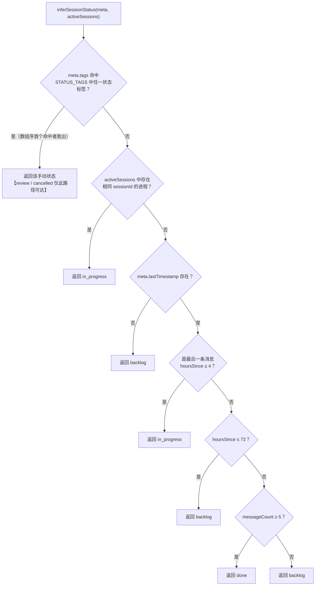
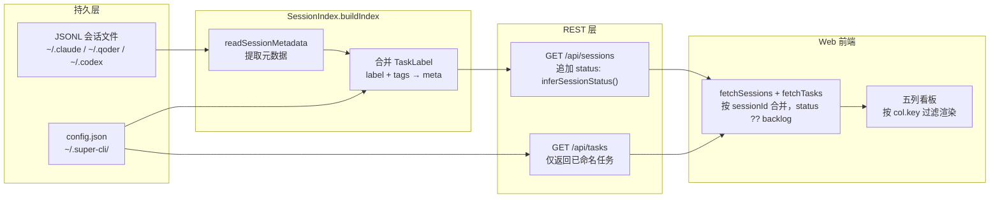

super-cli 管理的会话源自 Claude Code、Qoder、Codex 等 CLI 落盘的 JSONL 文件——这些文件只记录时间戳、消息内容与元数据，**本身不存在"任务生命周期"字段**。要将其组织成一张可浏览的任务看板，项目采用了一个**双层状态模型**：底层用启发式规则从时间与消息量中自动推断状态，上层允许用户通过标签机制手动覆盖。本文剖析这套五态模型（`backlog / in_progress / review / done / cancelled`）的类型定义、推断算法的优先级瀑布、手动标签的持久化链路，以及 CLI / REST / Web 三端各自消费与写入该状态的方式。本文属于数据层深入解析，聚焦状态机本身；索引缓存与配置文件的完整实现分别见 [SessionIndex 全量内存索引与 TTL 缓存策略](8-sessionindex-quan-liang-nei-cun-suo-yin-yu-ttl-huan-cun-ce-lue)与 [TaskStore 标签持久化与用户配置存储（~/.super-cli/config.json）](11-taskstore-biao-qian-chi-jiu-hua-yu-yong-hu-pei-zhi-cun-chu-super-cli-config-json)。

## 一、状态类型定义：五态枚举与标签载体

状态的类型基座非常简洁：`SessionStatus` 是一个五值联合类型，与 `CliProvider`、`TerminalType` 并列声明在共享类型文件顶部，被 core、server、web 三端共同引用（Web 前端在 `App.tsx` 中独立重复声明了同名类型，属于前端侧的类型镜像）。值得注意的是，**状态并没有作为独立字段持久化在会话元数据 `SessionMetadata` 中**——`SessionMetadata` 只有 `label` 与 `tags` 两个用户注记字段，状态是每次读取时**动态计算**出来的结果。这一设计决策是理解整个模型的起点：状态不是数据，而是"标签 + 元数据"在某个时刻的函数。

```typescript
// src/core/types.ts
export type SessionStatus = 'backlog' | 'in_progress' | 'review' | 'done' | 'cancelled';

export interface TaskLabel {
  label: string;       // 用户命名，如 "修复登录 bug"
  createdAt: string;   // 首次创建标签的时间
  tags?: string[];     // 通用标签数组，状态标签混用其中
}
```

`TaskLabel` 是用户覆盖层的载体：`label` 是任务的人类可读名称，`tags` 是一个**通用的字符串数组**——状态值（如 `review`）只是普通标签之一，与业务标签（如 `urgent`）共存于同一数组。所有 `TaskLabel` 通过 `AppConfig.sessions` 字典（键为 sessionId）持久化。这种"状态即标签"的设计意味着没有唯一性约束，后文将看到多状态标签并存时如何仲裁。

Sources: [types.ts](src/core/types.ts#L1-L3), [types.ts](src/core/types.ts#L98-L114)

## 二、推断算法：四级优先级瀑布

状态推断的核心是 `session-index.ts` 中导出的纯函数 `inferSessionStatus(meta, activeSessions)`。它按照**手动标签 → 活跃进程 → 时间衰减 → 消息量兜底**的固定优先级顺序依次判定，前一优先级命中即短路返回。五态的可达路径并不对称：`backlog / in_progress / done` 三态既可由启发式规则产生，也可由手动标签产生；而 **`review` 与 `cancelled` 只能通过手动打标签进入**——自动推断永远不会把一个会话判为"待复查"或"已取消"，因为算法无法从 JSONL 中读出用户的意图。



第一级是手动标签仲裁：遍历模块级常量 `STATUS_TAGS`（顺序为 `backlog → in_progress → review → done → cancelled`），检查 `meta.tags` 是否包含其中之一，**第一个按数组序命中的状态胜出**。这里存在一个值得注意的边界行为——若用户给同一会话同时打上 `done` 和 `backlog` 两个标签，由于 `backlog` 在数组中靠前，最终状态是 `backlog`，而非最新打的标签。第二级是进程级判定：若 `activeSessions`（活跃 CLI 进程列表）中存在 sessionId 匹配的进程，说明会话正在终端中运行，直接返回 `in_progress`。第三、四级是时间衰减启发式：以 `lastTimestamp`（最后一条消息时间）计算距当前的小时数，4 小时内视为仍在进行，72 小时内回落到待办，超过 72 小时则依据对话密度分流——消息数达到 5 条的会话大概率是一次完整完成的任务，判为 `done`；少于 5 条的短会话视为一次未展开的尝试，归入 `backlog`。

Sources: [session-index.ts](src/core/session-index.ts#L7-L39)

时间衰减的两个阈值与消息量阈值构成了模型的全部可调参数，整理如下：

| 参数 | 阈值 | 判定结果 | 设计意图 |
|---|---|---|---|
| `hoursSince ≤ 4` | 4 小时 | `in_progress` | 短时间未活动 ≈ 会话仍活跃，覆盖用户午休、切换任务等短暂中断 |
| `4 < hoursSince ≤ 72` | 72 小时 | `backlog` | 三天内有过活动但已停滞，视为待继续的任务 |
| `hoursSince > 72` 且 `messageCount ≥ 5` | 5 条消息 | `done` | 长期未动且有实质对话量，推断为已完结 |
| `hoursSince > 72` 且 `messageCount < 5` | — | `backlog` | 长期未动的碎片会话，保守归入待办 |
| 无 `lastTimestamp` | — | `backlog` | 元数据缺失时的安全默认值 |
| 进程存活（sessionId 命中） | — | `in_progress` | 进程级实时信号，优先级高于所有时间规则 |

Sources: [session-index.ts](src/core/session-index.ts#L30-L39)

## 三、手动覆盖层：TaskStore 的写入路径与前置约束

手动状态的唯一持久化通道是 `TaskStore`。其 `addTag` 方法有一个容易踩到的**前置约束：会话必须先设置 label 才能添加任何标签**，否则抛出 `Session "<id>" has no label. Set a label first.` 异常。换言之，"把会话纳入任务管理"（命名）是"赋予状态"（打标签）的前置动作——这个约束把"任务"定义为"被命名的会话"，而非任意 JSONL 文件。标签添加时通过 `new Set` 去重保证幂等；`removeTag` 则静默处理不存在的标签。`setLabel` 会保留既有 `createdAt` 与 `tags`，只更新名称，因此**改任务名不会丢状态**。

CLI 侧的用户入口是 `super-cli name` 命令，它通过 `SessionIndex.findSessionByPrefix` 把用户输入的短 ID 前缀解析为完整 sessionId，再分派到 `setLabel / addTag / removeTag`。一次完整的状态流转例如：`super-cli name abc12345 "修复登录 bug"`（命名）→ `super-cli name abc12345 --tag in_progress`（标记进行中）→ `super-cli name abc12345 --tag review`（移入复查）——注意此时该会话同时持有 `in_progress` 与 `review` 两个状态标签，而推断函数按 `STATUS_TAGS` 数组序仲裁出 `in_progress`。**若要状态正确切换，必须先 `--untag` 旧状态再打新标签**，这是当前模型下用户需要自觉遵守的约定。

Sources: [task-store.ts](src/core/task-store.ts#L47-L78), [name.ts](src/cli/commands/name.ts#L6-L62)

## 四、数据装配链路：从 JSONL 到看板列

状态在读取链路中的装配分为三步。**第一步**发生在 `SessionIndex.buildIndex()` 全量扫描时：读取所有 provider 的项目与会话元数据（`readSessionMetadata`，其流式解析实现见 [JSONL 会话文件流式解析与元数据提取（readline + AsyncGenerator）](6-jsonl-hui-hua-wen-jian-liu-shi-jie-xi-yu-yuan-shu-ju-ti-qu-readline-asyncgenerator)），同时调用 `taskStore.getAll()` 拉取全部标签，把命中的 `label` 与 `tags` **合并写入缓存的元数据对象**。此后缓存中的 `meta.tags` 既有手动状态标签，推断函数在读取时即可直接消费。**第二步**发生在 REST 层：`GET /api/sessions` 路由对每个会话调用 `inferSessionStatus(s, activeSessions)`，将计算出的 `status` 字段追加到响应上——Web 前端拿到的每条会话都携带最终状态。**第三步**在前端 `App.tsx`：并行请求 `/api/sessions` 与 `/api/tasks`，以 `sessionId` 为键合并标签数据，并用 `status ?? 'backlog'` 做防御性兜底（容错后端旧版本未注入 status 的场景），最后按 `s.status === col.key` 将会话过滤进五列看板。



一个必须如实记录的实现现状：REST 路由传入 `inferSessionStatus` 的 `activeSessions` 参数当前是 **`Promise.resolve([])` 硬编码的空数组**。`readActiveSessions()` 方法在 `SessionReader` 与 `CodexReader` 中均有实现，且被声明在 `ISessionReader` 接口中，但**仓库内没有任何调用方实际使用它**。这意味着进程级判定分支（isActive → in_progress）在当前线上行为中是休眠的——正在终端运行的会话，只要最后一条消息超过 4 小时，看板上仍会显示为 `backlog`。这是一处"接口已设计、数据未接线"的挂载点，未来接入只需将该空数组替换为各 reader 的 `readActiveSessions()` 结果。

Sources: [session-index.ts](src/core/session-index.ts#L71-L100), [sessions.ts](src/server/routes/sessions.ts#L10-L33), [App.tsx](src/web/src/App.tsx#L220-L232), [App.tsx](src/web/src/App.tsx#L679-L690), [session-reader.ts](src/core/session-reader.ts#L122), [codex-reader.ts](src/core/codex-reader.ts#L263)

## 五、三端消费与写入全景

状态模型在 CLI、REST、Web 三端的职责分工清晰：**CLI 与 REST 是写入口，Web 是只读展示端**。Web 看板没有任何拖拽换列或状态下拉的交互代码——前端的全量 API 调用清单中不存在状态写操作，状态变更只能经由 CLI 命令或直接调用 `PUT /api/tasks/:id`。同时注意两端的状态语义差异：`GET /api/tasks` 返回的是**被命名的任务子集**（含标签过滤 `?tag=`），而 `GET /api/sessions` 返回全部会话并各自附 status——"任务看板"与"会话列表"是同一状态系统下的两个视图。

| 入口 | 操作 | 实现位置 | 对状态模型的作用 |
|---|---|---|---|
| CLI `super-cli name <id> <label>` | 命名任务 | [name.ts](src/cli/commands/name.ts#L44-L61) | 建立标签容器，是打状态标签的前置 |
| CLI `super-cli name <id> --tag <status>` | 打状态标签 | [name.ts](src/cli/commands/name.ts#L32-L36) | 写入手动状态（最高优先级） |
| CLI `super-cli name <id> --untag <status>` | 移除状态标签 | [name.ts](src/cli/commands/name.ts#L38-L42) | 释放手动覆盖，回落到自动推断 |
| CLI `super-cli tasks --tag <tag>` | 按标签过滤任务 | [tasks.ts](src/cli/commands/tasks.ts#L6-L38) | 消费端：按状态标签筛选 |
| REST `GET /api/sessions` | 注入 status 字段 | [sessions.ts](src/server/routes/sessions.ts#L27-L30) | 消费端：推断结果的唯一 REST 出口 |
| REST `PUT /api/tasks/:id` | 写 label / 批量 addTag | [tasks.ts](src/server/routes/tasks.ts#L27-L47) | 写入口：支持程序化状态变更（Agent 友好） |
| REST `DELETE /api/tasks/:id` | 删除整个标签条目 | [tasks.ts](src/server/routes/tasks.ts#L49-L59) | 同时清除 label 与全部 tags |
| Web 看板五列 | 按 status 渲染 | [App.tsx](src/web/src/App.tsx#L30-L36) | 纯只读消费 |

前端列的展示顺序也值得一提：`STATUS_COLUMNS` 的渲染序为**进行中 → 待复查 → 待办 → 已完成 → 已取消**，与类型定义中的枚举序（backlog 打头）不同——这是产品视角的排序，把当前工作重心（进行中、待复查）放在最左侧，而仲裁用的 `STATUS_TAGS` 保持字母无关的稳定定义序。两份顺序各自服务不同目的：数组序决定仲裁优先级，渲染序决定视觉优先级，互不干扰。

Sources: [App.tsx](src/web/src/App.tsx#L25-L36), [tasks.ts](src/server/routes/tasks.ts#L7-L59), [tasks.ts](src/cli/commands/tasks.ts#L6-L38)

## 六、设计权衡：为什么是"推断 + 覆盖"而非显式状态机

从第一性原理看，这套模型在三个维度上做出了明确的取舍。**其一，零侵入性**：状态完全在 super-cli 侧计算，不要求任何上游 CLI 修改其 JSONL 格式，代价是 `review` / `cancelled` 这类纯意图性状态无法自动获得。**其二，读时计算而非写时固化**：状态不落盘、每次请求即时推导，好处是推断规则升级（例如调整 4 小时阈值）后历史会话立即按新规则重分类，无需迁移；代价是手动标签必须与推断规则共享 `tags` 数组，产生前述"多状态标签仲裁"的边界问题。**其三，看板只读**：Web 端不做状态编辑，把写入收敛到 CLI 与 REST 两个通道——这与其 Agent 友好定位一致：Agent 可以通过 `PUT /api/tasks/:id`（见 [Agent 友好的 --json 结构化输出约定与终端格式化输出](13-agent-you-hao-de-json-jie-gou-hua-shu-chu-yue-ding-yu-zhong-duan-ge-shi-hua-shu-chu)）程序化地把会话标记为 `done`，而人类用户在终端用一条 `name --tag` 完成同样操作。

| 维度 | 当前方案（推断+覆盖） | 备选方案（显式状态字段） | 取舍结果 |
|---|---|---|---|
| 上游耦合 | 零侵入，仅读 JSONL | 需各 CLI 写入状态字段 | 选零侵入，`review`/`cancelled` 让渡给手动 |
| 规则演进 | 改阈值即全量生效 | 需数据迁移回填 | 选读时计算，接受 tags 数组混用 |
| 状态唯一性 | 无约束，数组序仲裁 | 字段级互斥 | 选宽松模型，依赖用户"untag 旧的再 tag 新的"习惯 |
| 前端交互 | 只读渲染，写入收敛 CLI/REST | 拖拽写回 | 选收敛通道，与 REST API 参考（[Fastify 5 REST API 参考](14-fastify-5-rest-api-can-kao-sessions-tasks-stats-projects-config-refresh)）及看板视图（[看板 / 卡片 / 列表三视图实现](17-kan-ban-qia-pian-lie-biao-san-shi-tu-shi-xian-yu-liang-se-an-se-shen-lan-zhu-ti-xi-tong)）解耦 |

继续深入本主题的相邻页面：标签与配置文件的磁盘格式细节见 [TaskStore 标签持久化与用户配置存储（~/.super-cli/config.json）](11-taskstore-biao-qian-chi-jiu-hua-yu-yong-hu-pei-zhi-cun-chu-super-cli-config-json)；推断函数所依赖的元数据（`lastTimestamp`、`messageCount`）如何从 JSONL 流中提取，见 [JSONL 会话文件流式解析与元数据提取（readline + AsyncGenerator）](6-jsonl-hui-hua-wen-jian-liu-shi-jie-xi-yu-yuan-shu-ju-ti-qu-readline-asyncgenerator)。