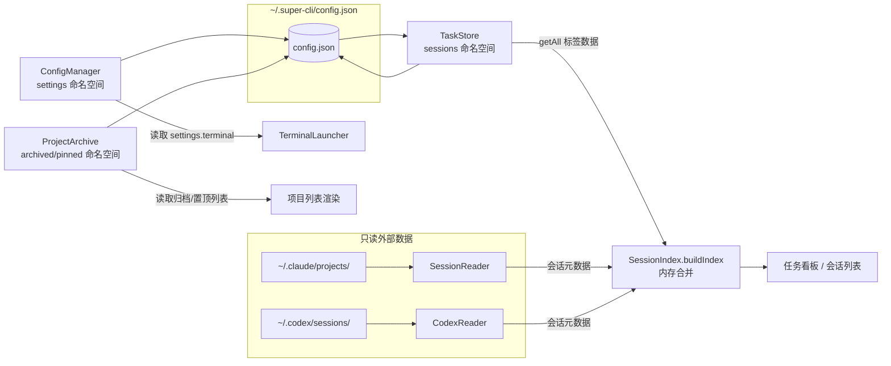
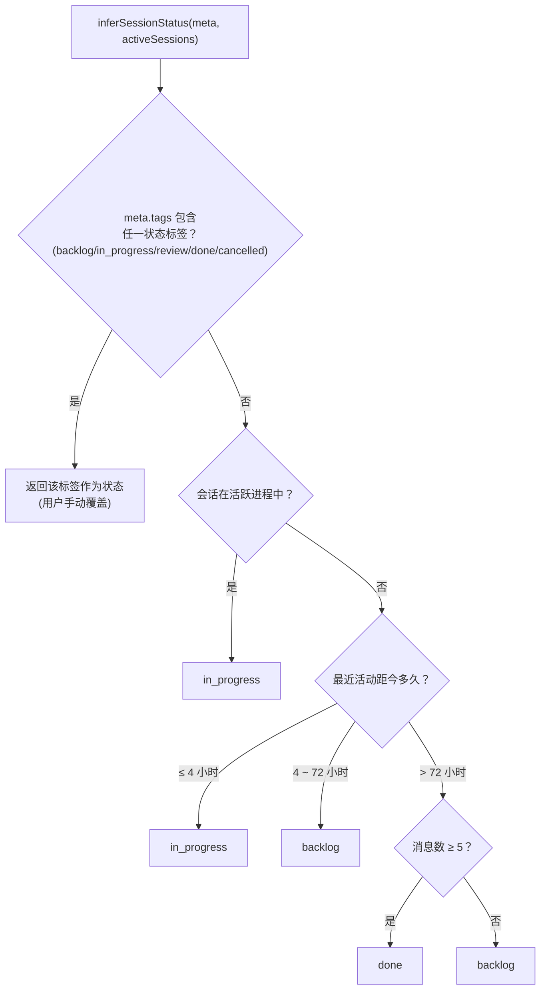
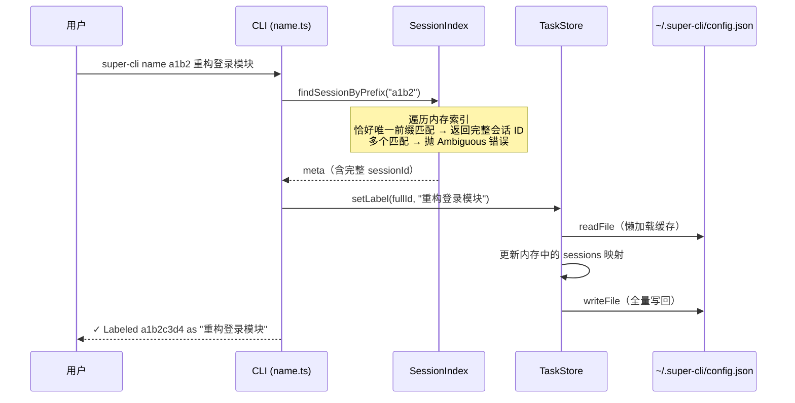

super-cli 的会话数据全部来自外部 AI 编程助手（Claude Code、Qoder、Codex）的数据目录（`~/.claude`、`~/.qoder`、`~/.codex`），这些目录由各 CLI 工具自己管理，super-cli 对它们**只读不写**。那么问题来了：当你在 super-cli 里给某个会话起名字（label）、打标签（tag）、归档某个项目时，这些"用户自己创造的数据"该存在哪里？答案是一个独立的用户级配置文件 **`~/.super-cli/config.json`**。本页解析这个文件的结构，以及围绕它构建的三个读写"网关"类——`TaskStore`、`ConfigManager`、`ProjectArchive`——如何协作完成标签持久化与用户偏好存储。

## 为什么需要独立存储：只读数据源与可写用户数据

从第一性原理出发，super-cli 面对的是两类性质完全不同的数据。第一类是**事实数据**（fact data）：会话消息、时间戳、token 用量等，它们是各 AI CLI 工具运行时产生的 JSONL 文件，super-cli 通过各种 Reader 流式读取即可，永远不需要修改。第二类是**观点数据**（opinion data）：用户对会话的主观标注——"这个会话叫'重构登录模块'"、"给它打个 `in_progress` 标签"、"这个项目先归档"——这类数据是用户在使用 super-cli 时产生的，外部文件里没有地方存放它们。

因此 super-cli 的设计是：外部目录只读，用户数据全部收敛到自己的家目录。`paths.ts` 中的两个函数定义了这个位置的解析规则：`getSuperCliHome()` 返回 `~/.super-cli`，`getSuperCliConfigPath()` 在其下拼接 `config.json`，即最终路径 `~/.super-cli/config.json`。这个路径解析与各 CLI 数据目录的定位逻辑（见 [路径编码规则与各 CLI 数据目录布局（~/.claude、~/.qoder、~/.codex）](21-lu-jing-bian-ma-gui-ze-yu-ge-cli-shu-ju-mu-lu-bu-ju-claude-qoder-codex)）共用同一套模式，只是方向相反——一个读外部，一个写自己。

Sources: [paths.ts](src/core/paths.ts#L34-L40)

## config.json 的结构：一个文件，四个命名空间

`~/.super-cli/config.json` 的结构由 `types.ts` 中的 `AppConfig` 接口定义，初学者可以先看这个类型声明，它就是文件的"地图"：

```typescript
export interface AppConfig {
  version: number;                          // 配置格式版本号，当前为 1
  sessions: Record<string, TaskLabel>;      // 会话 ID → 标签的映射表
  archivedProjects?: string[];              // 已归档项目的编码路径列表
  pinnedProjects?: string[];                // 已置顶项目的编码路径列表
  settings: {                               // 用户偏好设置
    defaultPort?: number;
    claudeHome?: string;
    terminal?: TerminalType;
  };
}

export interface TaskLabel {
  label: string;      // 会话的用户命名，如 "重构登录模块"
  createdAt: string;  // 首次命名的时间戳（ISO 格式）
  tags?: string[];    // 附加标签，如 ["in_progress", "backend"]
}
```

一个实际的 `config.json` 大致长这样：

```json
{
  "version": 1,
  "sessions": {
    "a1b2c3d4-e5f6-...": {
      "label": "重构登录模块",
      "createdAt": "2025-01-15T08:30:00.000Z",
      "tags": ["in_progress", "backend"]
    }
  },
  "archivedProjects": ["-Users-alice-work-old-project"],
  "settings": {
    "terminal": "ghostty"
  }
}
```

注意文件使用两空格缩进的 JSON 序列化（`JSON.stringify(config, null, 2)`），这意味着它是**人类可读可编辑**的——你可以直接用文本编辑器打开它查看或手工修改，super-cli 下次读取时会照常解析。`version: 1` 是格式版本标记，为将来格式演进预留。`sessions` 的键是完整的会话 ID（即外部 JSONL 文件名去掉 `.jsonl` 后缀），值是这个 ID 对应的用户标注。

Sources: [types.ts](src/core/types.ts#L98-L114)

## 三个网关类：同一文件的分工读写

围绕这一个文件，`src/core` 下有三个类各自负责一个命名空间。它们共享完全相同的"读文件 → 改内存对象 → 写回文件"骨架，但分工明确、互不越界：

| 类 | 文件 | 负责的命名空间 | 主要方法 | 使用场景 |
|---|---|---|---|---|
| `TaskStore` | `src/core/task-store.ts` | `sessions` | `getLabel` / `setLabel` / `removeLabel` / `addTag` / `removeTag` | 会话命名与打标签 |
| `ConfigManager` | `src/core/config.ts` | `settings` | `get` / `set` / `getAll` / `getConfigPath` | 用户偏好（终端类型等） |
| `ProjectArchive` | `src/core/project-archive.ts` | `archivedProjects` / `pinnedProjects` | `archive` / `unarchive` / `pin` / `unpin` | 项目归档与置顶 |

先看整体协作图。**前置说明**：下面这张 Mermaid 图展示了数据流的两个方向——左侧是只读的外部数据源（各 AI CLI 目录经 Reader 读入 `SessionIndex`），右侧是可写的用户数据（`config.json` 经三个网关类读写），两者最终在 `SessionIndex.buildIndex()` 处汇合：



三个类的写入路径完全一致：`readFile` 读取整个 JSON → 修改内存对象 → `mkdir(getSuperCliHome(), { recursive: true })` 确保目录存在 → `writeFile` 整体写回。`mkdir` 的 `recursive` 选项保证了**首次运行友好**——`~/.super-cli` 目录不存在时也能自动创建。同样，三个类的读取路径都用 `try/catch` 包裹，任何读取或解析失败都会静默回退到默认值（`{ version: 1, sessions: {}, settings: {} }`），所以删掉这个文件也不会导致程序崩溃，只会丢失用户标注数据。

Sources: [task-store.ts](src/core/task-store.ts#L31-L35), [config.ts](src/core/config.ts#L26-L31), [project-archive.ts](src/core/project-archive.ts#L21-L24)

项目归档与置顶的完整机制（编码路径如何生成、列表如何排序）详见 [项目元数据采集（Git / Node 版本 / 包管理器）与归档、置顶机制](22-xiang-mu-yuan-shu-ju-cai-ji-git-node-ban-ben-bao-guan-li-qi-yu-gui-dang-zhi-ding-ji-zhi)；`settings.terminal` 如何影响终端启动行为详见 [macOS 终端集成与会话恢复](20-macos-zhong-duan-ji-cheng-yu-hui-hua-hui-fu-ghostty-iterm2-terminal-app-kitty-warp-de-qi-dong-gua-pei)。本页余下部分聚焦 `TaskStore` 本身。

## TaskStore 逐行解析：懒加载、标签锚定与去重

`TaskStore` 全部代码不足 80 行，但每个设计决策都值得初学者理解。先看它的方法清单：

| 方法 | 作用 | 关键行为 |
|---|---|---|
| `load()` (私有) | 读取并缓存整个配置 | **懒加载**：首次读取后缓存在内存，后续调用直接返回缓存 |
| `save()` (私有) | 全量写回文件 | `mkdir` + 两空格缩进 `JSON.stringify` |
| `getAll()` | 返回所有标签映射 | 原样返回 `config.sessions` |
| `getLabel(id)` | 查询单个会话标签 | 不存在时返回 `null` 而非抛错 |
| `setLabel(id, label)` | 设置/更新会话名 | **合并语义**：保留已有 `createdAt` 和 `tags` |
| `removeLabel(id)` | 删除整个标签条目 | 连同 tags 一起删除 |
| `addTag(id, tag)` | 追加一个标签 | **去重**（`new Set`）；**要求先有 label** |
| `removeTag(id, tag)` | 移除一个标签 | 幂等：目标不存在时静默返回 |

有三个行为模式特别值得注意。第一是**懒加载缓存**：`load()` 只有在 `this.config` 为空时才真正读磁盘，之后所有操作都走内存缓存。这意味着一个长时间运行的 Web 服务器进程，其 `TaskStore` 不会感知到 CLI 进程随后对同一文件的修改——每个 `new TaskStore()` 实例持有独立的内存快照。第二是**标签锚定规则**（label-first rule）：`addTag` 开头就检查该会话是否已有 label 条目，没有则抛出 `"Session ... has no label. Set a label first."`。这个约束让 `sessions` 映射表里的每个条目都以 label 为锚点，tags 是挂在锚点上的附加信息，避免出现"有标签但没名字"的悬空数据。第三是**合并式更新**：`setLabel` 修改标签名时会继承已有的 `createdAt`（保持创建时间不变）并保留已有的 `tags`，重命名不会丢失历史标注。

`addTag` 内部用一行代码完成去重：`existing.tags = [...new Set([...(existing.tags ?? []), tag])]`——把旧标签数组和新增标签合并进 `Set` 去重再展开回数组。而 `removeTag` 用 `filter` 过滤后写回，目标标签不存在时结果数组不变，操作天然幂等。每一次公开的修改方法（`setLabel` / `removeLabel` / `addTag` / `removeTag`）末尾都直接调用 `save()` 即时落盘，没有"脏标记 + 延迟写入"机制——**改动即持久化**，进程崩溃不会丢失已确认的操作。

Sources: [task-store.ts](src/core/task-store.ts#L11-L35), [task-store.ts](src/core/task-store.ts#L37-L62), [task-store.ts](src/core/task-store.ts#L64-L78)

对比一下 `ConfigManager`，可以看到一个刻意的差异：`TaskStore.load()` 带内存缓存，而 `ConfigManager.load()` 每次调用都重新读文件、无缓存。这是因为 `TaskStore` 服务于高频的标签查询（每次构建索引都要调用 `getAll()`），缓存能省去重复磁盘 IO；而 `settings` 的读取频率低得多（如终端启动时读一次 `terminal` 键），每次直读反而保证看到最新值。两个类对"一致性 vs 性能"的取舍方向不同，但都以各自场景的实际需求为准。

Sources: [task-store.ts](src/core/task-store.ts#L19-L29), [config.ts](src/core/config.ts#L12-L19), [terminal-launcher.ts](src/core/terminal-launcher.ts#L71-L75)

## 标签如何汇入会话视图：SessionIndex 中的合并点

存储只是手段，展示才是目的。标签数据被消费的关键位置在 `SessionIndex.buildIndex()`：构建全量内存索引时，它先调用 `taskStore.getAll()` 拿到所有标签映射，然后遍历每个会话文件解析出的元数据，若该会话 ID 存在标签条目，就把 `label` 和 `tags` **覆写进 `SessionMetadata` 对象**，最后放入缓存。此后所有查询（会话列表、任务看板、搜索结果）拿到的元数据都已带上用户标注。

更精妙的一层在状态推断。`inferSessionStatus()` 决定一个会话在看板上属于 `backlog / in_progress / review / done / cancelled` 哪一列（完整推断逻辑见 [会话状态推断与任务看板模型](10-hui-hua-zhuang-tai-tui-duan-yu-ren-wu-kan-ban-mo-xing-backlog-in_progress-review-done-cancelled)），它的**第一优先级就是检查用户标签**：按固定顺序遍历五个状态标签名，只要会话的 `tags` 数组包含其中之一，立即以该标签为状态返回。只有用户没有打状态标签时，才回退到时间启发式（活跃进程 → `in_progress`；4 小时内有活动 → `in_progress`；超过 72 小时且消息数 ≥ 5 → `done` 等）。换句话说，**用户标签是状态的人工覆盖开关**——给会话打上 `review` 标签，它就会稳稳停在"待审查"列，不再随时间流逝被自动推断成 `done`。



Sources: [session-index.ts](src/core/session-index.ts#L21-L39), [session-index.ts](src/core/session-index.ts#L71-L96)

## 两条使用路径：CLI 命令与 HTTP API

标签功能有两个入口，底层都汇聚到同一个 `TaskStore`。**前置说明**：下面的序列图展示了一次典型的 `super-cli name <session-id> <label>` 命令的完整执行流，其中"前缀匹配"是关键的中介步骤——用户输入的往往是会话 ID 的前几个字符，`SessionIndex.findSessionByPrefix()` 负责把它展开为完整 ID：



CLI 侧由 `name` 命令承担全部标签操作：`super-cli name <id> <label>` 设置名称，`--remove` 删除，`--tag <tag>` / `--untag <tag>` 增删标签，不带 label 参数时退化为查询当前标签。配套的 `super-cli tasks` 命令列出所有已命名会话，支持 `--tag` 按标签过滤——它的实现是遍历 `getAll()` 返回的每个标签条目，从索引取回元数据后合并，按最后活动时间倒序输出。HTTP 侧的 `/api/tasks` 系列路由（`GET` 列表、`PUT` 设置、`DELETE` 移除）做同样的事，是 Web 看板的直接后端。值得注意的是 `PUT /api/tasks/:id` 处理 tags 时对数组逐个调用 `addTag`，每次调用都会触发一次完整的"读文件→改→写文件"循环——标签多时会产生多次连续落盘，这是当前实现的一个可观察特征。

Sources: [name.ts](src/cli/commands/name.ts#L6-L62), [tasks.ts](src/cli/commands/tasks.ts#L6-L39), [tasks.ts](src/server/routes/tasks.ts#L27-L47), [session-index.ts](src/core/session-index.ts#L152-L161)

HTTP API 的完整清单见 [Fastify 5 REST API 参考：sessions / tasks / stats / projects / config / refresh](14-fastify-5-rest-api-can-kao-sessions-tasks-stats-projects-config-refresh)；CLI 子命令的注册模式见 [Commander.js 子命令注册模式与全局 --provider 过滤](12-commander-js-zi-ming-ling-zhu-ce-mo-shi-yu-quan-ju-provider-guo-lu)。另外 `config show / set / get / path` 四个子命令则通过 `ConfigManager` 操作 `settings` 命名空间，`config set` 会尝试把值 `JSON.parse` 成数字、布尔或对象，解析失败才按字符串存储。

Sources: [config.ts](src/cli/commands/config.ts#L11-L55)

## 设计取舍与初学者须知

最后用一张表总结这套设计的取舍，帮助你判断"什么时候它很好用、什么时候需要小心"：

| 维度 | 当前设计 | 影响 |
|---|---|---|
| 文件格式 | 两空格缩进 JSON，全量读写 | 人类可读可编辑；文件始终保持整洁格式 |
| 首次运行 | 读失败静默回退默认值 + 写前 `mkdir` | 无需初始化步骤，开箱即用 |
| 持久化时机 | 每次修改立即全量写回 | 无数据丢失窗口；但批量加标签会多次写盘 |
| 去重保证 | 标签用 `Set` 去重，项目归档用 `includes` 检查 | 重复操作安全幂等 |
| 进程间一致性 | `TaskStore` 实例内缓存，`ConfigManager` 无缓存 | 同进程内稳定；CLI 与 Web 服务器同时运行时，长驻进程的标签缓存可能滞后于文件最新内容 |
| 数据保护 | 读取/解析失败静默回退空配置 | 若文件因损坏无法解析，下一次写操作会用默认值+新改动覆盖原文件，原有标注会丢失 |

对初学者，两个实用建议直接来自代码行为：其一，`config.json` 可以放心手工编辑（比如批量改标签），但编辑后若 Web 服务器正在运行，重启或触发 `/api/refresh` 才能让长驻进程重建索引缓存（缓存机制详见 [SessionIndex 全量内存索引与 TTL 缓存策略](8-sessionindex-quan-liang-nei-cun-suo-yin-yu-ttl-huan-cun-ce-lue)）；其二，重要标签数据建议定期备份这个单文件——它是所有用户标注的唯一载体。

Sources: [task-store.ts](src/core/task-store.ts#L19-L35), [config.ts](src/core/config.ts#L12-L31), [project-archive.ts](src/core/project-archive.ts#L36-L44)

## 延伸阅读

- 想了解标签如何影响看板列状态 → [会话状态推断与任务看板模型（backlog / in_progress / review / done / cancelled）](10-hui-hua-zhuang-tai-tui-duan-yu-ren-wu-kan-ban-mo-xing-backlog-in_progress-review-done-cancelled)
- 想了解标签合并发生的索引机制 → [SessionIndex 全量内存索引与 TTL 缓存策略](8-sessionindex-quan-liang-nei-cun-suo-yin-yu-ttl-huan-cun-ce-lue)
- 想了解 config.json 中归档/置顶字段的使用 → [项目元数据采集（Git / Node 版本 / 包管理器）与归档、置顶机制](22-xiang-mu-yuan-shu-ju-cai-ji-git-node-ban-ben-bao-guan-li-qi-yu-gui-dang-zhi-ding-ji-zhi)