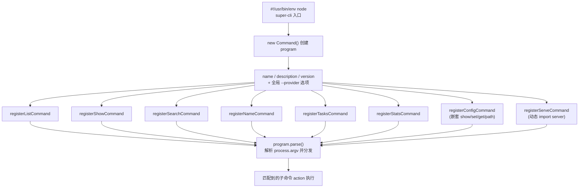
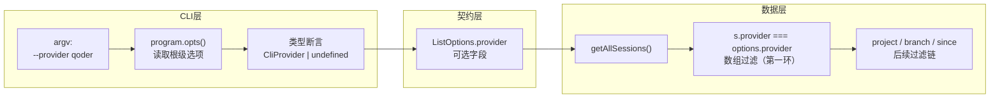

本页解析 super-cli 的 CLI 命令层骨架：一个 30 行的入口文件如何通过 Commander.js 组织 8 个子命令，以及全局 `--provider` 选项如何跨越命令边界传递到数据层的 `SessionIndex`。读完本页，你将掌握这套代码库新增子命令的完整套路，并理解 Commander.js 中"根级选项"与"子命令选项"的作用域差异——这是初学者最容易踩坑的一处。

## 整体架构：30 行入口文件做了什么

整个 CLI 的入口是 [src/cli/index.ts](src/cli/index.ts#L1-L29)，它只做四件事：创建 `Command` 实例、设置程序元信息、注册全局选项、逐个挂载子命令，最后调用 `program.parse()` 触发解析。没有循环、没有配置文件、没有反射魔法——每个子命令的注册函数都是从 `src/cli/commands/` 下的独立文件显式导入的。这种**显式导入清单**的风格让入口文件本身就是一份命令目录，谁注册了什么一目了然。

Sources: [index.ts](src/cli/index.ts#L1-L10)

入口文件的链式调用首先定义程序身份：`.name('super-cli')` 决定帮助信息中显示的命令名，`.version('0.1.0')` 启用 `--version` 标志，而 `.option('--provider <name>', ...)` 则是本页的主角——一个注册在**根程序对象**上的全局选项。注意 `<name>` 尖括号语法表示该选项必须携带值（如 `--provider qoder`），如果写成 `[name]` 方括号则值可选。定义完成后，8 个 `register*Command(program)` 函数依次被调用，每个函数向同一个 `program` 对象上挂载一个子命令节点。

Sources: [index.ts](src/cli/index.ts#L12-L29)

在阅读下面的流程图前，需要先理解一个前提：Commander.js 的 `.command('list')` 调用会在 `program` 内部维护的命令树上**新增一个子节点**并返回该子节点，后续的 `.description()`、`.option()`、`.action()` 都作用在这个子节点上。因此"注册"本质上是**对共享 program 对象的逐步变异（mutation）**——每个 register 函数拿到 `program` 引用后追加自己的节点，最终 `program.parse()` 沿命令树匹配 `process.argv` 并执行对应 action。

顺带一提，这个文件之所以能成为命令入口，是因为 [package.json](package.json#L6-L7) 中的 `bin` 字段把 `super-cli` 命令名映射到了打包产物 `./dist/cli/index.js`，首行的 `#!/usr/bin/env node` shebang 则保证它可作为可执行脚本运行。Commander 依赖版本为 `^13.1.0`（见 [package.json](package.json#L53)）。

## 子命令注册的三种变体

### 变体一：简单命令 + 自身选项（以 list 为例）

最基础的注册形态是 `list` 命令：`program.command('list')` 声明命令名，一串 `.option()` 声明该命令**私有**的选项（项目路径、日期区间、分支、分页等），最后 `.action(async (opts) => {...})` 挂载执行函数。注意每个选项都可以指定**默认值**——例如 `-l, --limit <n>` 的默认值 `'20'` 以字符串形式给出，action 内部再自行 `parseInt` 转换。这是初学者需要记住的细节：Commander 的选项值一律以字符串进入，数值转换是消费方的责任。

Sources: [list.ts](src/cli/commands/list.ts#L6-L16)

action 函数体内是标准的"取数 → 过滤 → 输出"三段式：构造 `SessionIndex` 实例，调用 `getAllSessions()` 拿到会话数组，最后交给 `formatSessionList()` 统一渲染（终端表格或 JSON，由 `--json` 决定）。输出格式的细节属于[另一页](13-agent-you-hao-de-json-jie-gou-hua-shu-chu-yue-ding-yu-zhong-duan-ge-shi-hua-shu-chu)的主题，这里只需记住"命令层不自己拼字符串，永远委托给 output 模块"这一分层约定。

Sources: [list.ts](src/cli/commands/list.ts#L17-L31)

### 变体二：带位置参数的命令（show / search / name）

当命令需要接收非选项的位置参数时，用尖括号/方括号语法声明：`show <session-id>` 表示必填，`name <session-id> [label]` 表示 label 可选。此时 action 的函数签名会发生变化——**位置参数按声明顺序排在前面，选项对象永远排最后**。对比三处代码可以清晰看到这个规则：`show` 的 action 是 `(sessionId: string, opts)`，`search` 是 `(query: string, opts)`，而 `name` 因为有两个位置参数，签名变为 `(sessionId: string, label: string | undefined, opts)`。

Sources: [show.ts](src/cli/commands/show.ts#L10-L16)

位置参数的作用域冲突天然不存在，但**选项简写可以跨命令复用**却常被初学者忽略：`list` 用 `-p` 表示 `--project`，`serve` 用 `-p` 表示 `--port`，两者并不冲突。原因在于 Commander 的选项是**按命令节点隔离**的——每个 `.command()` 节点有自己独立的选项表，`list -p` 匹配的是 list 节点上的 project，`serve -p` 匹配的是 serve 节点上的 port。

Sources: [list.ts](src/cli/commands/list.ts#L10), [serve.ts](src/cli/commands/serve.ts#L8)

### 变体三：嵌套子命令树与懒加载（config / serve）

`config` 命令展示了**两级命令树**的注册方式：先 `const cmd = program.command('config')` 拿到中间节点，再对 `cmd` 重复调用 `.command('show')`、`.command('set <key> <value>')` 等挂载叶子命令。最终用户输入 `super-cli config set theme dark` 时，Commander 会逐级匹配命令树。这个模式非常适合"一个名词下聚合多个动词"的场景（show / set / get / path 四个操作共享 config 命名空间）。

Sources: [config.ts](src/cli/commands/config.ts#L6-L56)

`serve` 命令则展示了**动态 ESM import 延迟加载**的技巧：action 内部用 `await import('../../server/index.js')` 才真正加载 Fastify 服务器模块。由于 server 端会连带加载路由、读取器等一整套重依赖，懒加载意味着用户执行 `super-cli list` 这类轻量命令时完全不需要付出加载服务器代码的启动成本。同样的技巧也用于可选依赖 `open`（打开浏览器）。

Sources: [serve.ts](src/cli/commands/serve.ts#L11-L24)

## 全局 --provider：定义、作用域与消费

### Commander 的选项作用域规则

这是本页最核心的机制点。Commander.js 中，`action` 回调收到的 `opts` 对象**只包含当前命令自己声明的选项**，根程序上定义的选项不会自动混入。因此当 `list` 需要读取全局 `--provider` 时，它必须在 action 内显式调用 `program.opts()`——这个方法返回的是**根程序节点**的选项集合。由于 register 函数持有 `program` 的闭包引用，action 内可以直接访问它。

Sources: [list.ts](src/cli/commands/list.ts#L17-L22)

对比之下，`list` 自己的选项（project、since、limit 等）则来自 action 参数 `opts`，不需要（也不能）通过 `program.opts()` 读取。同一个 action 内同时存在两条选项来源，这是初学者最易混淆的地方：**子命令私有选项走 `opts` 参数，根级全局选项走 `program.opts()`**。

Sources: [list.ts](src/cli/commands/list.ts#L17-L28)

### 从 CLI 参数到内存索引过滤的完整数据流

拿到 `globalOpts.provider` 后，代码将其断言为 `CliProvider | undefined` 类型并传入 `SessionIndex.getAllSessions()`。`CliProvider` 是一个三值字面量联合类型 `'claude-code' | 'qoder' | 'codex'`，与 [providers.ts](src/core/providers.ts#L52-L57) 中注册表的 provider ID 对齐（注册表本身的架构详见[多 Provider 架构](5-duo-provider-jia-gou-claude-code-qoder-codex-de-zhu-ce-biao-she-ji)页）。`ListOptions` 接口将 `provider` 声明为可选字段，与 project / since / until / branch 等过滤条件并列。

Sources: [types.ts](src/core/types.ts#L1), [types.ts](src/core/types.ts#L116-L125)

过滤动作最终发生在 `SessionIndex.getAllSessions()` 的开头：若 `options.provider` 存在，则用 `s.provider === options.provider` 对全量缓存做一遍数组过滤，随后才轮到 project / branch / 时间区间等条件。也就是说 **provider 过滤是过滤链的第一环**——先按数据来源（哪个 CLI 工具）切分，再按业务属性（项目、分支、日期）切分。索引如何构建与缓存属于 [SessionIndex 页](8-sessionindex-quan-liang-nei-cun-suo-yin-yu-ttl-huan-cun-ce-lue)的主题。

Sources: [session-index.ts](src/core/session-index.ts#L102-L112)

在阅读下面的数据流图前，请注意一个前提：图中的三条竖线对应三个模块层（CLI 壳层 → 类型契约层 → 核心数据层），`--provider` 值是唯一贯穿三层的信号。

### 一个值得注意的边界现状

遍历全部 8 个命令后可以确认：**当前只有 `list` 命令真正消费了全局 `--provider`**。`search` 的 `SearchOptions` 根本不包含 provider 字段（它只透传 project 与 since 给索引）；`stats` 只透传了 `project`；`show` 通过 `findSessionByPrefix` 定位会话，天然不依赖 provider 维度；`name` / `tasks` / `config` / `serve` 则与会话数据源无关。这意味着 `super-cli --provider qoder search foo` 中的 `--provider` 会被静默忽略——它被 Commander 接受了，但没有任何 action 读取它。若后续要让 search 支持 provider 过滤，只需在 `SearchOptions` 中补字段并在 `SessionSearch.search()` 内透传即可，骨架已经就绪。

Sources: [search.ts](src/cli/commands/search.ts#L15-L24), [stats.ts](src/cli/commands/stats.ts#L14-L16)

## 命令注册全景表

下表汇总 8 个命令的注册要素，可作为新增子命令时的速查参考：

| 命令 | 文件 | 位置参数 | 私有选项（节选） | 消费全局 `--provider` |
|---|---|---|---|---|
| `list` | list.ts | — | `-p/--project`、`-s/--since`、`-u/--until`、`-b/--branch`、`-l/--limit`、`--offset`、`--json` | ✅ 唯一消费者 |
| `show` | show.ts | `<session-id>` 必填 | `--summary`、`--messages`、`--tools`、`--json` | ❌ |
| `search` | search.ts | `<query>` 必填 | `-p/--project`、`-s/--since`、`-m/--max`、`--case-sensitive`、`--json` | ❌（SearchOptions 无此字段） |
| `name` | name.ts | `<session-id>` 必填、`[label]` 可选 | `--remove`、`--tag`、`--untag`、`--json` | ❌ |
| `tasks` | tasks.ts | — | `--tag`、`--json` | ❌ |
| `stats` | stats.ts | — | `-p/--project`、`--daily`、`--model`、`--json` | ❌ |
| `config` | config.ts | —（嵌套树） | 叶子级：`config show/set/get/path` | ❌ |
| `serve` | serve.ts | — | `-p/--port`、`--host`、`--open` | ❌ |

Sources: [list.ts](src/cli/commands/list.ts#L10-L16), [show.ts](src/cli/commands/show.ts#L12-L15), [search.ts](src/cli/commands/search.ts#L10-L14), [name.ts](src/cli/commands/name.ts#L8-L13), [tasks.ts](src/cli/commands/tasks.ts#L10-L11), [stats.ts](src/cli/commands/stats.ts#L10-L13), [config.ts](src/cli/commands/config.ts#L11-L55), [serve.ts](src/cli/commands/serve.ts#L8-L10)

## 如何新增一个子命令（套路总结）

基于以上分析，新增子命令只需三步，且完全不改动其他命令文件：**第一步**，在 `src/cli/commands/` 新建文件，导出 `registerXxxCommand(program: Command): void`，内部完成 `.command()` → `.option()` → `.action()` 链；**第二步**，若需要全局过滤能力，在 action 内调用 `program.opts()` 读取并按需透传给核心层；**第三步**，回到 [index.ts](src/cli/index.ts#L20-L29) 添加一行导入与一行注册调用。注册函数的**单向依赖**（命令文件 import 核心层，入口 import 命令文件）保证了任何命令的增删都不会引发连锁修改——这是这套模式最大的工程价值。

Sources: [index.ts](src/cli/index.ts#L3-L27)

## 延伸阅读

理解了命令层骨架后，可以按以下顺序深入相邻主题：若想了解 `--provider` 背后的数据模型，阅读[多 Provider 架构：Claude Code、Qoder、Codex 的注册表设计](5-duo-provider-jia-gou-claude-code-qoder-codex-de-zhu-ce-biao-she-ji)；若想理解 `getAllSessions()` 被调用后发生了什么，阅读[SessionIndex 全量内存索引与 TTL 缓存策略](8-sessionindex-quan-liang-nei-cun-suo-yin-yu-ttl-huan-cun-ce-lue)；若想了解 action 末尾 `formatSessionList()` 的双格式输出约定，阅读[Agent 友好的 --json 结构化输出约定与终端格式化输出](13-agent-you-hao-de-json-jie-gou-hua-shu-chu-yue-ding-yu-zhong-duan-ge-shi-hua-shu-chu)；若想纵览 cli / core / server / web 四层如何协作，回到[仓库结构导览](4-cang-ku-jie-gou-dao-lan-cli-core-server-web-si-ceng-zhi-ze-hua-fen)。