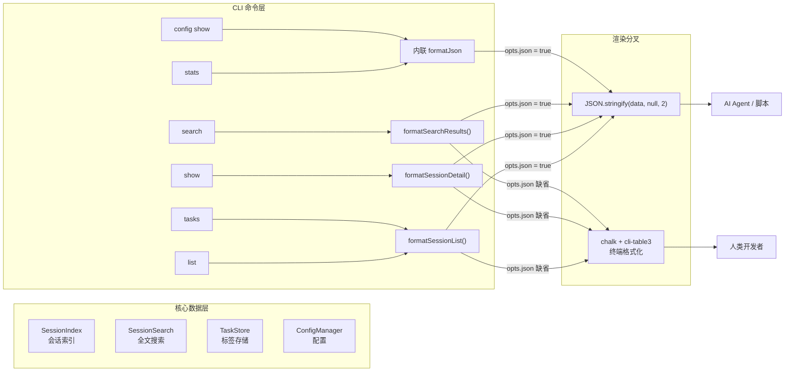

super-cli 的 CLI 层同时服务于两类截然不同的"读者"：在终端前快速扫视会话列表的**人类开发者**，以及需要精确解析每一条数据的 **AI Agent 与自动化脚本**。本页解析这一双受众问题的解法——`--json` 结构化输出约定与人类可读的终端格式化层，涵盖输出层架构、两种实现形态、JSON 契约的稳定性保障，以及 chalk + cli-table3 的视觉格式化技术。项目在 AGENTS.md 中将此明确定位为设计原则："Agent-friendly 命令行交互，支持 `--json` 结构化输出"。

Sources: [AGENTS.md](AGENTS.md#L11)

## 设计动机：一条命令，两种受众

同一个 `super-cli list` 命令，人类需要的是对齐的表格、色彩区分与截断摘要——视线在 0.5 秒内定位目标会话即可；而 Agent 需要的是**机器可解析、字段完整、空结果也合法**的 JSON。若让二者共用一套输出，必然互相妥协：表格中的 ANSI 转义码会污染 `JSON.parse`，而原始 JSON 的长字段对人类则是阅读灾难。super-cli 的选择是**在同一命令内以 `--json` 标志切换输出管线**：数据获取逻辑完全复用，仅在最终渲染层分叉。README 中对此的定位是"`--json` 结构化输出，方便 agent 和脚本消费"、"所有命令支持 `--json` 输出，方便集成到 agent 工作流"。

Sources: [README.md](README.md#L39), [README.md](README.md#L98)

## 输出层架构：数据流与渲染分叉

整个输出体系由三部分构成：`src/cli/output.ts` 提供的**格式化函数集**（唯一出口是 `formatJson` 与三个 formatter）、各命令文件中的**分支调用**、以及 `src/core/types.ts` 中的**共享类型**——后者同时充当 JSON 输出的 schema 契约（详见后文）。数据流呈现清晰的单向性：命令 action 从 `SessionIndex` / `SessionSearch` / `TaskStore` 等核心层获取类型化数据，随后立即交给渲染层，命令本身不关心最终形态是表格还是 JSON。

需要说明的是，上图中的分叉点均遵循同一守卫模式：每个 formatter 的**第一行代码**就是 `if (opts.json) return formatJson(...)`，人类格式化逻辑仅在 JSON 分支提前返回后才展开。这种"JSON 优先、提前返回"的写法保证了机器输出永远不会被表格逻辑污染，也让两种模式的边界在源码层面一目了然。

Sources: [output.ts](src/cli/output.ts#L13-L38)

## `--json` 的注册模式：逐命令而非全局

一个容易误判的细节：`--json` **不是**全局选项。CLI 入口在 program 级别仅注册了 `--provider` 一个全局过滤项，而 `--json` 由每个需要它的子命令各自声明（`.option('--json', 'Output as JSON')`）。目前注册该选项的命令为 `list`、`show`、`search`、`name`、`tasks`、`stats` 与 `config show` 子命令。这种分布式注册的收益是精确性——每个命令的输出能力由自身声明，未实现 JSON 输出的命令（如 `config set`、`serve`）不会被一个失效的全局标志误导；代价则是新增命令时必须记得显式带上这一行，属于依赖团队约定的轻量契约。Commander 子命令注册的整体模式请参见 [Commander.js 子命令注册模式与全局 --provider 过滤](12-commander-js-zi-ming-ling-zhu-ce-mo-shi-yu-quan-ju-provider-guo-lu)。

Sources: [index.ts](src/cli/index.ts#L14-L18), [list.ts](src/cli/commands/list.ts#L16), [AGENTS.md](AGENTS.md#L87-L92)

调用侧的模式同样规整：命令在 action 末尾将核心层数据与 `{ json: opts.json }` 一起传入 formatter，一行完成输出。例如 `list` 命令在获取过滤后的会话数组后调用 `console.log(formatSessionList(sessions, { json: opts.json }))`，`search` 命令同理调用 `formatSearchResults`。`OutputOptions` 接口本身极简——仅一个可选的 `json?: boolean` 字段，刻意避免了选项膨胀。

Sources: [output.ts](src/cli/output.ts#L5-L7), [list.ts](src/cli/commands/list.ts#L30), [search.ts](src/cli/commands/search.ts#L24)

## 两种实现形态：委托 formatter 与内联早返回

代码库中实际存在两种将 `--json` 付诸实现的形态，二者共存且各有适用场景：

| 维度 | 形态一：委托 formatter | 形态二：内联早返回 |
|---|---|---|
| 代表命令 | `list`、`tasks`、`search`、`show`（summary） | `stats`、`config show`、`name`（查询）、`show --tools/--messages` |
| 调用方式 | `formatXxx(data, { json: opts.json })` | `if (opts.json) { console.log(formatJson(data)); return; }` |
| 人类输出位置 | output.ts 内与 JSON 分支并列 | 命令文件内直接 `console.log` + chalk |
| 适用场景 | 多命令复用同一渲染（list/tasks 共用会话表格） | 输出形态命令私有、无需复用 |
| 示例代码 | [tasks.ts](src/cli/commands/tasks.ts#L36) | [stats.ts](src/cli/commands/stats.ts#L28-L31) |

形态一的典型例子是 `tasks` 命令与 `list` 命令**共用** `formatSessionList`——前者的数据本质仍是 `SessionMetadata[]`，复用让两种视图的列定义天然保持一致。形态二的典型例子是 `stats`：统计聚合结构（`countBy` 产生的 `Record<string, number>`）是命令私有的，人类模式下的 `--model`、`--daily` 扩展段落也只在命令内组装，无需抽象到公共层。值得注意的边界情况：`show` 命令的 summary 分支走形态一，而 `--tools` 与 `--messages` 分支走形态二——同一命令内部按数据复杂度混合使用两种形态。

Sources: [stats.ts](src/cli/commands/stats.ts#L28-L38), [show.ts](src/cli/commands/show.ts#L25-L53)

## JSON 契约的稳定性：Agent 友好的四个关键约定

对 Agent 而言，"能解析"只是底线，"契约可依赖"才是核心价值。super-cli 通过四个具体约定实现后者：

**约定一：schema 锚定共享类型。** `--json` 输出的结构不是临时拼凑，而是直接序列化 `src/core/types.ts` 中定义的领域类型。`list`/`tasks` 输出 `SessionMetadata[]`（含 `sessionId`、`provider`、`project`、`models`、`totalInputTokens` 等 20 个字段），`search` 输出 `SearchResult[]`（嵌套 `SearchHit` 的 `type`/`timestamp`/`snippet`），`name` 查询输出 `TaskLabel`，`config show` 输出 `AppConfig`。前端 Web 看板与 Fastify API 消费的也是同一组类型（参见 [Fastify 5 REST API 参考](14-fastify-5-rest-api-can-kao-sessions-tasks-stats-projects-config-refresh)），意味着 Agent 从 CLI 获得的 JSON 与从 HTTP API 获得的结构天然同构。

Sources: [types.ts](src/core/types.ts#L55-L76), [types.ts](src/core/types.ts#L136-L147)

**约定二：空结果依然是合法 JSON。** `tasks` 命令在标签存储为空时的处理体现了对机器读者的体贴：人类模式下打印引导文案 "No named tasks. Use..."，而 `--json` 模式下直接输出字面量 `'[]'`——下游脚本的 `JSON.parse` 永远不会因为空态而失败。同理，`output.ts` 中 `formatSessionList` 与 `formatSearchResults` 的 JSON 分支在空数组时自然产出 `[]`。

Sources: [tasks.ts](src/cli/commands/tasks.ts#L17-L19)

**约定三：JSON 模式数据零损耗，人类模式才截断。** 对比 `show --messages` 的两个分支可以发现关键差异：人类模式的 `printConversation` 将每条消息内容截断至 500 字符（`content.slice(0, 500)`）；而 JSON 分支先过滤出 `user`/`assistant` 类型后**完整序列化全部消息**，不做任何裁剪。同理，人类表格中的 sessionId 只取前 8 位、项目路径只取末两段、首条消息截断至 38 字符——这些截断全部发生在表格渲染层，`SessionMetadata` 本体字段原封不动。这是"渲染层裁剪、数据层保真"原则的直接体现。

Sources: [show.ts](src/cli/commands/show.ts#L46-L53), [show.ts](src/cli/commands/show.ts#L83-L87), [output.ts](src/cli/output.ts#L25-L34)

**约定四：统一 2 空格缩进，纯 JSON 独占 stdout。** 所有 JSON 输出均经由 `formatJson`（或等价的 `JSON.stringify(data, null, 2)`）产生，2 空格缩进便于人类 Agent 直接阅读，同时 stdout 上不混入任何前缀文字、装饰行或 ANSI 色码。错误信息则走 `console.error`（stderr）并以 `process.exit(1)` 退出——Agent 可以安全地 `JSON.parse(stdout)`，将 stderr 视为独立的错误通道。

Sources: [output.ts](src/cli/output.ts#L9-L11), [show.ts](src/cli/commands/show.ts#L20-L23), [name.ts](src/cli/commands/name.ts#L19-L22)

各命令的 JSON 输出结构速查如下：

| 命令 | JSON 输出类型 | 关键字段 | 空态行为 |
|---|---|---|---|
| `list --json` | `SessionMetadata[]` | sessionId, project, gitBranch, models, totalInputTokens | `[]` |
| `tasks --json` | `SessionMetadata[]`（注入 label/tags） | label, tags, lastTimestamp | 字面量 `[]` |
| `show --json` | `SessionMetadata` | 全部元数据 + firstUserMessage | stderr + exit 1 |
| `show --messages --json` | `SessionMessage[]` | message.content（完整不截断） | `[]` |
| `show --tools --json` | `Record<string, number>` | 工具名 → 调用次数（按次数降序） | `{}` |
| `search --json` | `SearchResult[]` | sessionId, totalHits, hits[].snippet | `[]` |
| `stats --json` | 聚合对象 | totalSessions, models, projects | 零值字段 |
| `name <id> --json` | `TaskLabel` | label, createdAt, tags | 非 JSON 提示文案 |
| `config show --json` | `AppConfig` | sessions, settings, archivedProjects | 配置对象 |

Sources: [types.ts](src/core/types.ts#L98-L114), [stats.ts](src/cli/commands/stats.ts#L18-L31), [config.ts](src/cli/commands/config.ts#L18-L26)

## 人类终端格式化：chalk 色彩语义与 cli-table3 表格

人类模式的技术选型是 `chalk`（色彩与字重）与 `cli-table3`（表格布局）的组合，二者职责不重叠：chalk 负责**语义着色**，cli-table3 负责**空间对齐**。会话列表表格的配置体现了典型的终端适配考量：7 列固定列宽（`colWidths: [10, 25, 12, 15, 6, 15, 40]`）适配标准终端宽度，`wordWrap: true` 处理超长内容换行，青色（cyan）表头降低视觉噪声。单元格内的数据压缩策略统一走私有函数 `truncate`（超长时截断并追加 `…` 省略号），配合 sessionId 前 8 位缩写与项目路径末两段缩写，将最长的会话首消息控制在 40 列内。

Sources: [output.ts](src/cli/output.ts#L18-L37), [output.ts](src/cli/output.ts#L86-L89)

色彩在整个 CLI 层保持一致的**语义映射**，这使用户能形成稳定的视觉直觉：

| 颜色/字重 | 语义 | 典型用法 |
|---|---|---|
| `chalk.cyan` | 字段标签、表头 | `Project:`、`Branch:` 标签、表格 head |
| `chalk.bold` | 标题、角色名 | `Session: <id>`、`Statistics`、`User`/`Assistant` |
| `chalk.dim` | 次要信息、空值、空态 | `-` 占位、时间戳、`No sessions found.` |
| `chalk.green` | 用户侧消息、操作成功 | `User` 角色、`Labeled ...` 确认 |
| `chalk.blue` | 助手侧消息 | `Assistant` 角色、搜索命中 |
| `chalk.yellow` | 工具调用标记 | `[Tool: <name>]` |
| `chalk.red` | 错误（stderr） | `Session not found:` |

Sources: [output.ts](src/cli/output.ts#L16-L62), [show.ts](src/cli/commands/show.ts#L77-L89), [name.ts](src/cli/commands/name.ts#L60)

三种 formatter 分别对应三种信息形态：`formatSessionList` 处理**集合概览**（表格最适合横向对比多行）；`formatSessionDetail` 处理**单体详情**（键值对纵列 + 空行分隔的"首条消息"引述块）；`formatSearchResults` 处理**层次化命中**（每个会话一个块，块内缩进列出命中行，user/assistant 命中以绿/蓝区分）。`formatSessionDetail` 还演示了可选字段的统一降级策略——所有 `undefined` 字段一律渲染为 `-`，避免出现 `undefined` 字面量泄漏到终端。

Sources: [output.ts](src/cli/output.ts#L40-L66), [output.ts](src/cli/output.ts#L68-L84)

## 错误输出：stdout/stderr 双通道约定

错误处理遵循 Unix 传统且对 Agent 友好：`show` 与 `name` 在会话未找到时调用 `console.error(chalk.red(...))` 输出到 **stderr**，随即 `process.exit(1)` 以非零码退出。这样设计的直接收益是：Agent 的 `JSON.parse(stdout)` 不会因错误文本而崩溃，错误可通过退出码与 stderr 独立捕获；人类用户则同时获得红色高亮的明确提示。该约定与"JSON 独占 stdout"共同构成了完整的输出通道纪律。

Sources: [show.ts](src/cli/commands/show.ts#L20-L23), [name.ts](src/cli/commands/name.ts#L19-L22)

## 结语与延伸阅读

super-cli 的输出层没有引入重量级框架，仅凭"JSON 优先早返回 + 渲染层裁剪 + 共享类型锚定 schema"三个轻量约定，就同时满足了人类与 Agent 的需求，且与 Web 看板、HTTP API 共享同一数据契约。若要继续深入，推荐以下路径：了解这些 JSON 类型如何被 REST API 复用，请阅读 [Fastify 5 REST API 参考：sessions / tasks / stats / projects / config / refresh](14-fastify-5-rest-api-can-kao-sessions-tasks-stats-projects-config-refresh)；想看这些命令是如何被组织注册的，请阅读 [Commander.js 子命令注册模式与全局 --provider 过滤](12-commander-js-zi-ming-ling-zhu-ce-mo-shi-yu-quan-ju-provider-guo-lu)；`SessionMetadata` 背后的索引构建机制详见 [SessionIndex 全量内存索引与 TTL 缓存策略](8-sessionindex-quan-liang-nei-cun-suo-yin-yu-ttl-huan-cun-ce-lue)。