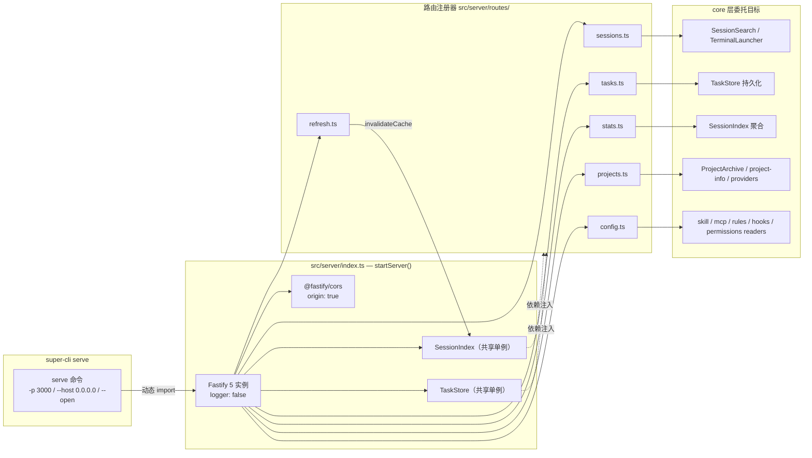

本页是 super-cli HTTP 服务层的完整端点参考。`super-cli serve` 启动一个 Fastify 5 实例，对外暴露 **36 个 REST 端点**，按六个资源域拆分：会话（sessions）、任务（tasks）、统计（stats）、项目（projects）、Harness 配置（config）与缓存刷新（refresh）。本文面向需要直接调用这些 API（例如脚本集成、二次开发看板）的中级开发者，逐域给出方法、路径、查询参数、请求体与响应结构，并说明服务端的组装方式与错误码约定。

## 架构总览：从 serve 命令到路由注册器

服务入口是 `src/server/index.ts` 导出的 `startServer(options)` 函数。它在单次调用中完成全部组装：创建 `Fastify({ logger: false })` 实例、注册 `@fastify/cors`（`origin: true`，反射任意来源）、实例化一个 `SessionIndex` 与一个 `TaskStore` 作为跨路由共享的依赖，然后依次调用六个路由注册器函数，最后（若存在 `web/` 目录）挂载静态资源与 SPA 回退——后者属于单进程全栈部署话题，详见[单进程全栈部署：Fastify 托管 React 静态资源与 SPA 回退](15-dan-jin-cheng-quan-zhan-bu-shu-fastify-tuo-guan-react-jing-tai-zi-yuan-yu-spa-hui-tui)。



这个设计的核心模式是**路由注册器 + 依赖注入**：每个资源域文件导出一个 `registerXxxRoutes(app, ...deps)` 函数，只接收 Fastify 实例与它需要的 core 依赖，不持有全局状态。`SessionIndex` 与 `TaskStore` 在 `startServer` 中各创建一次并被多个路由组共享——例如 sessions 与 tasks 都依赖同一个索引实例，这保证了任务标签与元数据视图的一致性。值得注意的是 `serve.ts` 使用 `await import('../../server/index.js')` 动态导入服务模块，CLI 进程在仅执行其他命令时不会加载 Fastify 及其依赖树。

Sources: [index.ts](src/server/index.ts#L7-L48), [serve.ts](src/cli/commands/serve.ts#L4-L25)

## 启动参数

`super-cli serve` 支持三个选项，服务默认监听 `0.0.0.0:3000`：

| 选项 | 默认值 | 说明 |
|---|---|---|
| `-p, --port <n>` | `3000` | 监听端口 |
| `--host <host>` | `0.0.0.0` | 绑定地址（局域网内其他设备可访问） |
| `--open` | 关闭 | 启动后自动打开浏览器 |

依赖版本：`fastify ^5.3.3`、`@fastify/cors ^11.0.0`、`@fastify/static ^8.1.0`。

Sources: [serve.ts](src/cli/commands/serve.ts#L8-L10), [package.json](package.json#L49-L55)

## 端点总览

36 个端点分布如下（`?` 表示查询参数）：

| 域 | 端点 | 方法 |
|---|---|---|
| **sessions** | `/api/sessions` | GET |
| | `/api/sessions/:id` | GET |
| | `/api/sessions/:id/messages` | GET |
| | `/api/sessions/new` | POST |
| | `/api/sessions/:id/resume` | POST |
| | `/api/search` | GET |
| **tasks** | `/api/tasks` | GET |
| | `/api/tasks/:id` | PUT / DELETE |
| **stats** | `/api/stats` | GET |
| **projects** | `/api/providers` | GET |
| | `/api/projects` | GET |
| | `/api/projects/:encoded/detail` | GET |
| | `/api/projects/:encoded/archive`、`unarchive`、`pin`、`unpin`、`open-finder`、`open-terminal` | POST ×6 |
| | `/api/projects/:encoded/files` | GET |
| | `/api/projects/:encoded/files/content` | GET |
| **config** | `/api/config/skills`（GET / DELETE / POST copy）+ content | 4 |
| | `/api/config/mcp`（GET / POST / PUT / DELETE / POST copy） | 5 |
| | `/api/config/rules`（GET 列表 / GET content / PUT content） | 3 |
| | `/api/config/hooks` | GET |
| | `/api/config/permissions` | GET |
| **refresh** | `/api/refresh` | POST |

Sources: [sessions.ts](src/server/routes/sessions.ts#L7-L123), [tasks.ts](src/server/routes/tasks.ts#L5-L60), [stats.ts](src/server/routes/stats.ts#L4-L20), [projects.ts](src/server/routes/projects.ts#L26-L225), [config.ts](src/server/routes/config.ts#L9-L125), [refresh.ts](src/server/routes/refresh.ts#L4-L9)

## sessions 域：会话列表、详情、消息与终端恢复

### GET /api/sessions

会话列表是看板的数据源，接受 8 个查询参数，全部为可选字符串（服务端手动 `parseInt` 数值）：

| 参数 | 类型 | 默认值 | 说明 |
|---|---|---|---|
| `provider` | `claude-code` \| `qoder` \| `codex` | 全部 | 按 Provider 过滤 |
| `project` | string | 全部 | 按项目过滤 |
| `since` / `until` | ISO 日期字符串 | 无 | 时间范围（`new Date()` 解析） |
| `branch` | string | 全部 | 按 Git 分支过滤 |
| `limit` / `offset` | number | `50` / `0` | 分页 |
| `sort` | `date-asc` \| `date-desc` | `date-desc` | 排序方向 |

响应结构为 `{ sessions: SessionMetadata[], total: number }`，其中每条元数据额外附加了 `status` 字段。状态推断逻辑（`inferSessionStatus`）按优先级判定：先看任务标签是否命中状态标签集（`backlog`/`in_progress`/`review`/`done`/`cancelled`）；再看是否属于活跃会话；否则按 `lastTimestamp` 时间衰减——4 小时内为 `in_progress`，72 小时内为 `backlog`，超过 72 小时且消息数 ≥5 判定为 `done`。需要说明的一个实现细节：当前路由中活跃会话列表固定传入空数组（`Promise.resolve([])`），因此实际生效的是"标签优先 + 时间衰减"两级规则。

Sources: [sessions.ts](src/server/routes/sessions.ts#L10-L33), [session-index.ts](src/core/session-index.ts#L21-L39)

### GET /api/sessions/:id 与 GET /api/sessions/:id/messages

路径参数 `:id` 支持**前缀匹配**——内部调用 `index.findSessionByPrefix(id)`，因此传完整 sessionId 或其足够长的前缀均可。会话不存在时返回 `404 { error: 'Session not found' }`。

`/messages` 子端点在找到会话后通过 `index.getReaderForSession(session)` 取得对应 Provider 的读取器（Claude/Qoder 走 `SessionReader`，Codex 走 `CodexReader`），读取完整消息流后仅保留 `type === 'user' | 'assistant'` 的对话消息，并投影为 `{ type, timestamp, uuid, content, model, usage }` 六个字段。分页发生在内存中：`offset`（默认 0）与 `limit`（默认 100）对已过滤数组做 `slice`，而 `total` 返回的是过滤后的完整长度——调用方可以据此做客户端分页。

Sources: [sessions.ts](src/server/routes/sessions.ts#L35-L79), [session-index.ts](src/core/session-index.ts#L152-L197)

### POST /api/sessions/new 与 POST /api/sessions/:id/resume

这两个端点是对话入口，委托给 `TerminalLauncher`。`new` 要求请求体包含 `project`（否则 `400 { error: 'project path is required' }`），`provider` 缺省为 `claude-code`；`resume` 使用会话的 `cwd || project` 作为工作目录并携带原始 `provider`。两者在 `result.action === 'error'` 时返回 500，正常时透传 TerminalLauncher 的结果对象（含 `action` 等字段）。终端适配细节见[macOS 终端集成与会话恢复](20-macos-zhong-duan-ji-cheng-yu-hui-hua-hui-fu-ghostty-iterm2-terminal-app-kitty-warp-de-qi-dong-gua-pei)。

### GET /api/search

全文搜索端点，`q` 为必需参数——缺失时静默返回 `{ results: [], total: 0 }` 而非报错。可选参数 `project`、`since`（ISO 日期）与 `max`（默认 50，即 `maxResults`）。搜索实现委托给 `SessionSearch` 类，它在构造时同时接收了索引实例用于范围限定，正则匹配与摘要生成机制详见[跨会话全文搜索实现](9-kua-hui-hua-quan-wen-sou-suo-shi-xian-zheng-ze-pi-pei-ming-zhong-tong-ji-yu-zhai-yao-sheng-cheng)。

Sources: [sessions.ts](src/server/routes/sessions.ts#L81-L122)

## tasks 域：标签持久化的读写接口

`GET /api/tasks` 展示了本服务最具代表性的**跨存储联接**模式：先从 `TaskStore.getAll()` 取出所有持久化标签（存储于 `~/.super-cli/config.json`，见[TaskStore 标签持久化](11-taskstore-biao-qian-chi-jiu-hua-yu-yong-hu-pei-zhi-cun-chu-super-cli-config-json)），调用 `index.buildIndex()` 确保索引就绪，然后逐个用 `index.getSession(sessionId)` 补全会话元数据并把 `label`/`tags` 合并进去。可选 `?tag=` 参数在联接前过滤标签；结果按 `lastTimestamp` 降序排列，返回 `{ tasks, total }`。

`PUT /api/tasks/:id` 的请求体为 `{ label?: string, tags?: string[] }`：`label` 走 `setLabel`（整体覆盖），`tags` 数组则逐项调用 `addTag`（追加语义，而非替换）。`DELETE /api/tasks/:id` 调用 `removeLabel` 整体移除该会话的任务标签。两者都在会话不存在时返回 404。

Sources: [tasks.ts](src/server/routes/tasks.ts#L7-L59), [task-store.ts](src/core/task-store.ts#L37-L64)

## stats 域：聚合统计

`GET /api/stats` 接受可选 `?project=` 过滤，在服务端对会话数组做五维 reduce 聚合，响应结构固定为：

```json
{
  "totalSessions": 0,
  "totalUserMessages": 0,
  "totalAssistantMessages": 0,
  "totalInputTokens": 0,
  "totalOutputTokens": 0,
  "models": { "claude-sonnet-4": 12 },
  "daily": [{ "date": "2025-01-01", "count": 3 }]
}
```

`models` 由所有会话的 `models` 数组 `flatMap` 后 `countBy` 计数得出（每个会话出现一次某模型即计一次，而非按消息计）；`daily` 按每个会话 `lastTimestamp` 的前 10 个字符（ISO 日期）分组，升序排列。注意此端点**不做会话数截断**——与 `/api/sessions` 的 limit=50 默认值不同，stats 始终聚合该项目的全部会话。

Sources: [stats.ts](src/server/routes/stats.ts#L6-L40)

## projects 域：项目列表、归档置顶与文件浏览

### 项目列表与元数据

`GET /api/providers` 返回当前机器上可用的 AI CLI（由 `getAvailableProviders()` 探测，字段为 `id`/`name`/`command`）。`GET /api/projects?provider=` 则执行三路 `Promise.all` 并联查询：索引项目列表、`ProjectArchive.getArchivedIds()` 与 `getPinnedIds()`，在响应中为每个项目附加布尔标记 `archived` 与 `pinned`。`GET /api/projects/:encoded/detail` 合并 `getProjectDetail()` 采集的 Git/Node/包管理器元数据（采集机制见[项目元数据采集](22-xiang-mu-yuan-shu-ju-cai-ji-git-node-ban-ben-bao-guan-li-qi-yu-gui-dang-zhi-ding-ji-zhi)）。路径中的 `:encoded` 是编码后的项目路径，编码规则见[路径编码规则](21-lu-jing-bian-ma-gui-ze-yu-ge-cli-shu-ju-mu-lu-bu-ju-claude-qoder-codex)。

归档/置顶是四个对称的 POST 动作端点（`archive`/`unarchive`/`pin`/`unpin`），均无请求体，直接操作 `ProjectArchive` 并返回 `{ success: true }`。另有 `open-finder`（通过 `execSync("open <path>")` 调起 Finder）与 `open-terminal`（`TerminalLauncher.openDirectory`）两个本地集成端点，失败时返回 500 与错误消息。

Sources: [projects.ts](src/server/routes/projects.ts#L29-L125)

### 文件浏览端点与安全边界

`GET /api/projects/:encoded/files?path=<相对路径>` 与 `GET /api/projects/:encoded/files/content?path=...` 构成文件浏览器后端。两者共享同一**路径穿越防护**逻辑：`resolve(rootDir, relativePath)` 规范化后检查 `resolvedPath.startsWith(rootDir)`，不满足即返回 `403 { error: 'Forbidden' }`。目录列表会跳过 `IGNORED_ENTRIES` 集合（`.git`、`node_modules`、`dist`、`.next`、`.turbo` 等构建产物），文件条目附带 `size` 与小写 `extension`，排序规则为目录在前、同类型按名称字母序。

文件内容端点实施三级防护，这是值得注意的分层设计：

| 防护层 | 阈值/规则 | 响应 |
|---|---|---|
| 目录拒绝 | `stat` 判定为目录 | `400 { error: 'Path is a directory' }` |
| 大小跳过 | > 5 MB（`SKIP_THRESHOLD`） | `{ content: null, truncated: true, binary: false, size }` |
| 二进制检测 | 扩展名命中 `BINARY_EXTENSIONS`，或前 8192 字节含 `0x00` | `{ content: null, binary: true, truncated: false, size }` |
| 预览截断 | > 100 KB（`MAX_PREVIEW_SIZE`） | content 截断至 100 KB，`truncated: true` |

`path` 参数缺失时 content 端点返回 400。前端配合 Prism.js 渲染这部分数据的方式见[项目文件浏览器](18-xiang-mu-wen-jian-liu-lan-qi-mu-lu-sao-miao-lu-jing-chuan-yue-fang-hu-yu-prism-js-yu-fa-gao-liang)。

Sources: [projects.ts](src/server/routes/projects.ts#L12-L24), [projects.ts](src/server/routes/projects.ts#L127-L225)

## config 域：Harness 配置的完整 CRUD

`config.ts` 是端点最多的路由文件（14 个），按五类配置资源组织，每类都以 `?provider=` / `?project=` 切换作用域。Skills 提供**读取 / 删除 / 跨 Provider 复制**：`GET /api/config/skills`、`GET|DELETE /api/config/skills/:provider/:id`（content 读取支持 `?scope=global|project` 消歧，404 时返回 `{ error: 'Skill not found' }`）以及 `POST /api/config/skills/copy`（请求体 `{ from, to, id }`）。

MCP Servers 是唯一提供**完整增删改查**的配置资源：`POST /api/config/mcp/:provider`（body `{ id, config, project? }` 新增）、`PUT /api/config/mcp/:provider/:id`（body `{ config, project? }` 更新）、`DELETE` 对应删除，外加与 Skills 同构的 `/copy` 端点。Rules 走文件路径而非 ID：`GET /api/config/rules` 列出规则文件，`GET|PUT /api/config/rules/content` 以 `?path=` / body `{ path, content }` 读写规则内容。Hooks 与 Permissions 目前为只读（各一个 GET）。这五类资源的读写器实现与跨 Provider 复制语义详见[Harness 配置中心](19-harness-pei-zhi-zhong-xin-skills-mcp-servers-rules-hooks-permissions-de-du-qu-yu-kua-provider-fu-zhi)。

Sources: [config.ts](src/server/routes/config.ts#L10-L124)

## refresh 域：缓存失效

`POST /api/refresh` 是全服务最简单的端点——调用 `index.invalidateCache()` 清空 SessionIndex 的内存缓存并返回 `{ success: true }`。由于索引带有 TTL 缓存（详见[SessionIndex 全量内存索引与 TTL 缓存策略](8-sessionindex-quan-liang-nei-cun-suo-yin-yu-ttl-huan-cun-ce-lue)），当外部进程（例如正在运行的 `claude` CLI）产生了新会话文件而 TTL 尚未到期时，前端通过此端点强制下次查询重建索引。这就是目录标题中 refresh 的全部职责：一个手动的缓存击穿开关。

Sources: [refresh.ts](src/server/routes/refresh.ts#L4-L9)

## 错误响应约定与调用注意事项

服务未使用 Fastify 的 JSON Schema 校验（`fastify` 的 schema/serializer 能力在此未启用），所有查询参数与请求体均通过 `as` 类型断言手动解析，数值参数靠 `parseInt` 转换——传入非数字会得到 `NaN` 并退化为默认行为。错误处理遵循三种手工模式：`reply.code(4xx/5xx)` + `{ error: string }` 对象、业务失败透传底层异常消息、以及个别端点不设状态码直接返回错误对象（如 `GET /api/config/rules/content` 缺少 `path` 时返回 200 + `{ error: 'path required' }`）。集成方建议按下表处理：

| 状态码 | 触发场景 | 响应体 |
|---|---|---|
| `400` | `sessions/new` 缺 `project`；`files/content` 缺 `path` 或路径为目录 | `{ error }` |
| `403` | 文件端点路径穿越（`resolve` 后不在项目根内） | `{ error: 'Forbidden' }` |
| `404` | 会话/项目/Skill/文件不存在（`:id` 前缀匹配失败） | `{ error }` |
| `500` | 无可用 Provider reader；终端启动失败；Finder 打开失败 | `{ error }` 或透传 result |
| `200` | 一切成功路径 | `{ resource, total }` / `{ success: true }` |

另需注意：CORS 配置为 `origin: true`（反射任意 Origin），配合默认 `0.0.0.0` 绑定，意味着局域网内任意页面均可调用此 API——包括 `open-finder` 这类本地命令执行端点，部署时应通过防火墙或 `--host 127.0.0.1` 限制暴露面。

Sources: [index.ts](src/server/index.ts#L18-L31), [sessions.ts](src/server/routes/sessions.ts#L96-L122), [config.ts](src/server/routes/config.ts#L94-L100)

## 延伸阅读

- 想了解这些端点如何被 React SPA 消费与打包进同一进程：[单进程全栈部署：Fastify 托管 React 静态资源与 SPA 回退](15-dan-jin-cheng-quan-zhan-bu-shu-fastify-tuo-guan-react-jing-tai-zi-yuan-yu-spa-hui-tui)
- 想理解 sessions / stats 端点背后的索引与缓存机制：[SessionIndex 全量内存索引与 TTL 缓存策略](8-sessionindex-quan-liang-nei-cun-suo-yin-yu-ttl-huan-cun-ce-lue)
- 想在脚本中获得同样的数据而不启动 HTTP 服务：[Agent 友好的 --json 结构化输出约定与终端格式化输出](13-agent-you-hao-de-json-jie-gou-hua-shu-chu-yue-ding-yu-zhong-duan-ge-shi-hua-shu-chu)