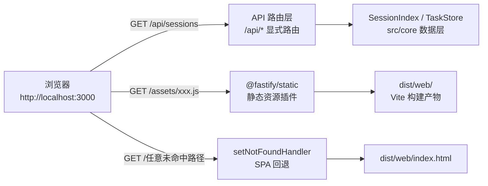
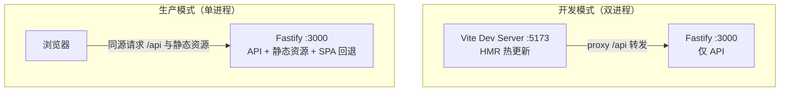

super-cli 的 Web 看板没有依赖 Nginx、也没有独立的前端静态服务器——执行一条 `super-cli serve` 命令后，**同一个 Fastify 进程**同时承担两个角色：对 `/api/*` 请求返回 REST API 的 JSON 数据，对其余请求返回 Vite 构建出的 React 单页应用（SPA）静态资源。本文面向初学者，拆解这套"单进程全栈"部署的三个核心环节：构建产物如何在目录层面精确对齐、Fastify 如何托管静态文件、以及"SPA 回退"为什么存在、如何实现。

## 核心概念：一个进程，两类流量

先建立整体图景。浏览器发起的请求到达 Fastify 后，会经历一次"分流"：显式注册的 `/api/*` 路由处理数据请求；命中磁盘上真实存在的静态文件（如 `/assets/index-abc123.js`）时由静态资源插件直接返回；两者都未命中时，由 SPA 回退逻辑返回 `index.html`，把渲染权交还给前端 JavaScript。



支撑这个分流的两条代码事实是：六组 API 路由（sessions / tasks / stats / projects / config / refresh）在服务器初始化时最先注册；随后才注册静态资源插件与 404 兜底处理器。Fastify 的路由器按"具体程度"匹配——显式注册的 `/api/sessions` 这类路径永远优先于通配路由，因此 API 与静态托管互不干扰。

Sources: [index.ts](src/server/index.ts#L26-L44)

## 前提契约：三份构建产物必须对齐到同一个 dist

单进程部署能成立，靠的是一份**三方目录契约**——tsup（Node 端打包）、Vite（前端打包）与服务器运行时路径解析，三者独立工作，却必须指向同一个 `dist/` 布局。任何一方偏离，部署就会静默降级。

| 参与方 | 职责 | 关键配置 | 产出位置 |
|---|---|---|---|
| tsup | 打包 CLI 与服务器 | `outDir: 'dist'`，双入口 | `dist/cli/index.js`、`dist/server/index.js`、共享块 `dist/chunk-*.js` |
| Vite | 打包 React SPA | `outDir: '../..', 'dist/web'` | `dist/web/index.html` + `dist/web/assets/*` |
| Fastify 运行时 | 定位静态资源 | `join(__dirname, '..', 'web')` | 从 `dist/server/` 出发解析到 `dist/web/` |

实际构建后的目录结构如下（本仓库验证）：

```
dist/
├── chunk-KZF7OROH.js     ← tsup splitting 产出的共享代码块
├── cli/
│   └── index.js          ← super-cli 命令入口
├── server/
│   └── index.js          ← startServer 所在的服务器入口
└── web/                  ← Vite 构建产物（服务器托管的静态根目录）
    ├── index.html
    └── assets/
```

Vite 配置里的 `outDir: resolve(__dirname, '../..', 'dist/web')` 从 `src/web/` 出发向上两级回到项目根，再进入 `dist/web`；`pnpm build` 脚本按 `build:cli && build:web` 的顺序先产出 Node 端、再产出前端。npm 发布时，`files` 字段将 `dist/cli`、`dist/server`、`dist/web`、`dist/chunk-*.js` 全部打入包中——这意味着**全局安装 super-cli 后，用户本机无需任何前端工具链，一条 serve 命令即是完整部署**。

Sources: [tsup.config.ts](tsup.config.ts#L4-L15) · [vite.config.ts](src/web/vite.config.ts#L8-L11) · [package.json](package.json#L26-L36) · [package.json](package.json#L9-L17)

## 服务器如何定位并托管静态资源

**路径解析是整个机制中最精巧的一环**。super-cli 全仓使用 ESM 模块规范（`"type": "module"`），而 ESM 环境没有 Node.js CommonJS 时代的 `__dirname` 全局变量，因此服务器入口第一件事就是手动重建它：

```ts
const __dirname = dirname(fileURLToPath(import.meta.url));  // ESM 下手动取得当前文件目录
```

随后 `const webDir = join(__dirname, '..', 'web')` 从"服务器入口文件所在目录"出发向上退一级再进入 `web/`。这段相对路径写死的意义在于：**无论 `dist/` 被搬到哪个绝对路径**（发布到 npm 后位于全局 `node_modules` 深处、或复制到任意服务器目录），`dist/server/index.js` 与 `dist/web/` 的相对关系始终不变，路径解析永远成立。

定位到目录后，托管由 `@fastify/static` 插件完成，其三个配置项各司其职：

| 配置项 | 取值 | 作用 |
|---|---|---|
| `root` | `webDir`（即 `dist/web`） | 静态文件查找的根目录，超出此目录的请求一律拒绝 |
| `prefix` | `'/'` | 挂载在根路径下，`/assets/x.js` 直接映射 `dist/web/assets/x.js` |
| `wildcard` | `true` | 注册一条 `GET /*` 通配路由，拦截所有未被显式路由接管的 GET 请求 |

值得注意的是外层的 `existsSync(webDir)` 守卫：若用户只构建了 Node 端（漏跑 `build:web`），目录不存在时服务器**不会崩溃**，而是静默跳过静态托管，退化为纯 API 服务器——这是一个刻意的优雅降级设计，代价是排查问题时需要留意（见文末故障排查表）。

Sources: [index.ts](src/server/index.ts#L16) · [index.ts](src/server/index.ts#L33-L44) · [package.json](package.json#L5)

## SPA 回退：为什么存在，如何实现

**单页应用的根本矛盾在于：浏览器地址栏里的 URL 与服务器磁盘上的文件并非一一对应**。React SPA 只有一个物理入口 `index.html`，页面内的所有"视图切换"都发生在浏览器内存中。当用户在应用内把筛选条件同步进地址栏后按 F5 刷新，浏览器会向服务器原样重新请求这个 URL——但服务器上并不存在对应文件，没有回退机制的话用户将收到一个裸的 404 页面，应用"白屏死亡"。

super-cli 前端确实会把状态写入地址栏：`App.tsx` 中通过 `window.history.replaceState` 将当前筛选查询串同步到 URL。SPA 回退保证了这类"带状态 URL 的刷新 / 直接访问 / 分享链接"在任何情况下都能拿到应用入口。实现只需三行：

```ts
app.setNotFoundHandler((_req, reply) => {
  reply.sendFile('index.html');
});
```

Fastify 的调用链是层层兜底的：请求先尝试匹配显式 API 路由；未命中则进入 `@fastify/static` 的通配路由查找磁盘文件；文件也不存在时触发 404 处理器——而这里的自定义处理器没有返回错误，而是调用 `sendFile('index.html')`（该方法由 `@fastify/static` 装饰到 reply 上，自动以 `webDir` 为根）返回 SPA 入口。于是形成了完整语义：**凡是服务器不认识的路径，一律交给前端路由接管**。当前前端虽以查询参数承载状态、尚未使用路径路由，但这一层兜底对任何未命中路径一视同仁，为后续引入任意客户端路由（如 `/config`）预先铺平了道路。

Sources: [index.ts](src/server/index.ts#L41-L43) · [App.tsx](src/web/src/App.tsx#L181-L182) · [index.html](src/web/index.html#L1-L14)

## 启动命令与部署验证

服务器通过 CLI 的 `serve` 子命令拉起，`startServer` 以动态 `import()` 方式按需加载——只有执行 serve 时才会加载 Fastify 及其插件，其他子命令（list / search / stats 等）不受影响。

| 参数 | 默认值 | 说明 |
|---|---|---|
| `-p, --port <n>` | `3000` | 监听端口 |
| `--host <host>` | `0.0.0.0` | 绑定地址；`0.0.0.0` 表示监听所有网卡，局域网内其他设备可直接访问 |
| `--open` | 关闭 | 启动后自动打开系统默认浏览器 |

部署完成后，可用三条请求验证分流是否正常（以 curl 为例）：

```bash
super-cli serve --port 3000 --open   # 启动（README 官方用法）

curl http://localhost:3000/api/stats     # 预期：JSON 统计数据（API 分流）
curl http://localhost:3000/              # 预期：index.html（静态托管）
curl http://localhost:3000/anything-else # 预期：index.html（SPA 回退，而非 JSON 404）
```

第三条是 SPA 回退的判别性测试：若返回的是 Fastify 默认的 JSON 格式 404（`{"message":"Route GET:/... not found"}`），说明 `setNotFoundHandler` 未生效或 `dist/web` 缺失。

Sources: [serve.ts](src/cli/commands/serve.ts#L4-L25) · [README.md](README.md#L110)

## 开发模式的双进程拓扑

生产是单进程，开发却是**双进程**——这正是 Vite 配置中 `server.proxy` 存在的原因。开发时前端跑在 Vite Dev Server（默认 5173 端口，提供热更新 HMR），后端 Fastify 跑在 3000 端口；前端代码里所有请求都发往同源相对路径 `const API_BASE = '/api'`，由 Vite 代理转发到 3000，从而**让同一份前端代码在开发与生产两种拓扑下无需任何修改**。



这也解释了服务器里那句看似多余的 `await app.register(cors, { origin: true })`：开发场景下 5173 端口跨源调用 3000 端口，需要 CORS 放行；生产场景前后端同源同端口，该配置虽不再必需但无害。开发启动方式为两个终端分别执行 `pnpm dev:web` 与 `super-cli serve`。

Sources: [vite.config.ts](src/web/vite.config.ts#L12-L16) · [index.ts](src/server/index.ts#L21) · [client.ts](src/web/src/api/client.ts#L1-L3)

## 故障排查指南

| 症状 | 根因 | 处理方式 |
|---|---|---|
| 访问 `/` 返回 Fastify JSON 404 | `dist/web` 不存在，`existsSync` 守卫跳过了静态托管 | 执行完整 `pnpm build`（含 `build:web`） |
| 页面能打开但接口全部失败 | API 路由异常，或前端被代理到了错误的后端端口 | 开发模式检查 Vite proxy 指向；生产确认请求走同源 `/api` |
| 刷新带查询参数的 URL 后 404 | SPA 回退未生效（自定义 notFoundHandler 缺失或产物损坏） | 重新构建服务器端，确认 `dist/web/index.html` 存在 |
| 静态资源 404 但 index.html 正常 | `dist/web/assets` 缺失或文件名哈希不匹配（旧缓存引用新页面） | 清理后完整重建：Vite 的 `emptyOutDir: true` 会先清空输出目录 |
| 端口被占用 | 3000 已有进程监听 | 换端口：`super-cli serve -p 3001` |

Sources: [index.ts](src/server/index.ts#L33-L44) · [vite.config.ts](src/web/vite.config.ts#L8-L11)

## 小结与延伸阅读

这套部署方案的本质可以浓缩为一个等式：**tsup 的输出位置 + Vite 的 outDir + 运行时的相对路径解析 = 自包含的单进程全栈应用**。它换来的工程收益是零运维成本——npm 安装即部署、一个进程一个端口、npm 包自含全部产物；付出的设计代价是三方契约必须严格对齐，任何一方的目录漂移都会导致静默降级。

继续深入建议按此顺序阅读：先看 [Fastify 5 REST API 参考：sessions / tasks / stats / projects / config / refresh](14-fastify-5-rest-api-can-kao-sessions-tasks-stats-projects-config-refresh) 了解被托管的 API 层全貌；再读 [双构建流水线：tsup 打包 Node 端与 Vite 打包前端 SPA](23-shuang-gou-jian-liu-shui-xian-tsup-da-bao-node-duan-yu-vite-da-bao-qian-duan-spa) 理解契约两端的构建细节；若对 `fileURLToPath(import.meta.url)` 这类 ESM 惯用法感兴趣，[共享类型系统、ESM 模块规范与路径别名约定](24-gong-xiang-lei-xing-xi-tong-esm-mo-kuai-gui-fan-yu-lu-jing-bie-ming-yue-ding) 有系统阐述；最后进入 [双模式 SPA 架构：任务模式与 Harness 配置模式的视图切换](16-shuang-mo-shi-spa-jia-gou-ren-wu-mo-shi-yu-harness-pei-zhi-mo-shi-de-shi-tu-qie-huan) 看被托管的 React 应用内部结构。