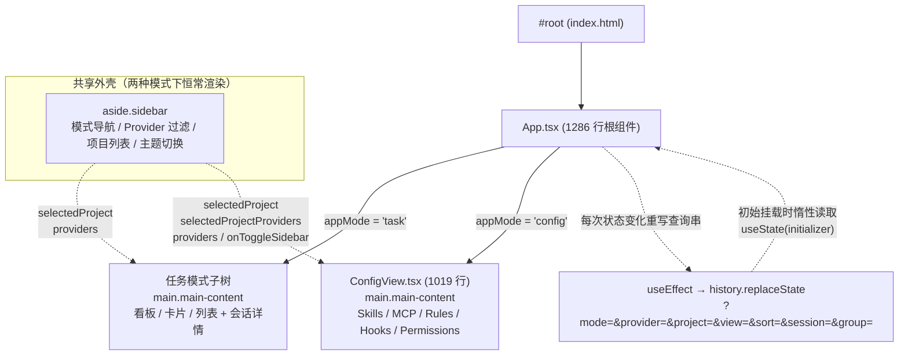
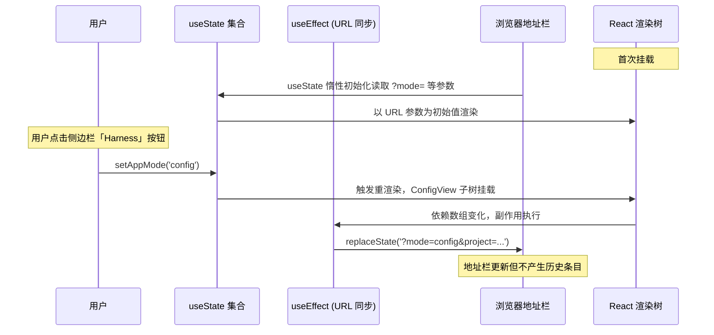

super-cli 的 Web 看板（CCM）是一个**无路由库的单页应用**：它没有引入 React Router 或任何第三方导航方案，而是在根组件 `App` 内部用一个名为 `appMode` 的状态原子，在两种截然不同的工作场景之间切换——**任务模式**（task，浏览 / 管理会话看板）与 **Harness 配置模式**（config，管理 Skills、MCP、Rules、Hooks、Permissions）。本文解释这套"状态驱动 + URL 参数同步"的双模式架构是如何设计的、为什么侧边栏被提取为两种模式的共享外壳，以及代码库中保留的早期导航原型遗迹。阅读本文你将理解：在不引入路由的前提下，一个 SPA 如何做到深链接可恢复、浏览器历史不被污染、且两种模式能共享项目选择上下文。

Sources: [main.tsx](src/web/src/main.tsx#L1-L11)

## 一、整体架构：一个状态原子，两棵视图子树

入口 `main.tsx` 只有 11 行——直接把 `App` 挂载到 `#root`，没有 Router Provider，没有任何导航上下文。整棵应用的"路由"退化为一行三元表达式：`appMode === 'config' ? <ConfigView ... /> : <>...任务视图...</>`。两种模式各自是一棵完整的视图子树，共享同一个 `<aside class="sidebar">` 侧边栏外壳。

下图呈现了这一组件关系（阅读提示：Mermaid 图中的实线箭头表示"渲染 / 组合"关系，虚线箭头表示 props 或回调传递）：

这个设计的核心取舍是：**放弃路由库带来的嵌套路由能力，换取极简的依赖与完全可控的 URL 同步策略**。`package.json` 的 `dependencies` 中只有 `fastify`、`commander`、`prismjs` 等运行时依赖，`react` 与 `react-dom`（v19）位于 devDependencies——因为它们会被 Vite 打包进静态产物，无需在 Node 侧运行时引入。

Sources: [main.tsx](src/web/src/main.tsx#L1-L11), [App.tsx](src/web/src/App.tsx#L595-L602), [package.json](package.json#L48-L70)

## 二、appMode：从 URL 惰性初始化的状态原子

`appMode` 的类型是极简的联合类型 `'task' | 'config'`，其初始值通过 `useState` 的**惰性初始化函数**从 `window.location.search` 中读取：`?mode=config` 进入配置模式，其余任何情况（包括无参数）都默认进入任务模式。这不是孤例——同一段初始化代码中，`selectedProviders`、`selectedProject`、`viewMode`、`sortMode`、`groupByDate` 以及初始会话 ID（通过 `useRef` 保存）全部采用相同的"URL 参数 → 初始状态"模式，构成了整条深链接恢复链路。

| URL 查询参数 | 对应状态 | 取值与默认值 | 作用域 |
|---|---|---|---|
| `mode` | `appMode` | `config` / 默认 `task` | **双模式切换**（本文主角） |
| `provider` | `selectedProviders` | 逗号分隔的 provider ID 列表，默认空（全部） | 两模式共享 |
| `project` | `selectedProject` | 项目解码路径，默认 `null` | 两模式共享（决定 Harness 的全局/项目作用域） |
| `view` | `viewMode` | `board` / `card` / `list`，默认 `board` | 仅任务模式 |
| `sort` | `sortMode` | `time-desc` / `time-asc` / `messages`，默认 `time-desc` | 仅任务模式 |
| `group` | `groupByDate` | `off` / `date`，默认随 sortMode 推断 | 仅任务模式 |
| `session` | `initialSessionId`（ref） | 会话 ID，加载完成后自动选中 | 仅任务模式 |

值得注意的是第 7 行的 `session` 参数走的是另一条路径：它先存入 `useRef`，待会话列表加载完成后在 `loadSessions` 内匹配并调用 `selectSession`——因为初始渲染时会话数据尚未到达，无法直接选中。这是"URL 状态恢复"与"异步数据加载"之间的典型协调手法。

Sources: [App.tsx](src/web/src/App.tsx#L110-L149), [App.tsx](src/web/src/App.tsx#L167), [App.tsx](src/web/src/App.tsx#L239-L244)

## 三、URL 同步：replaceState 单向数据流

状态到 URL 的回流由一个依赖数组明确的 `useEffect` 完成：每当 `[appMode, selectedProviders, selectedProject, viewMode, sortMode, selectedSession, groupByDate]` 中任一状态变化，组件会**重建整条查询串**（而非增量修改），再调用 `window.history.replaceState` 写回地址栏。两个细节值得注意：

第一，使用 `replaceState` 而非 `pushState`，意味着切换模式、变更筛选器**不会产生新的浏览器历史条目**——用户按返回键会直接离开应用，而不是陷入"返回上一次的筛选状态"的泥潭。这是工具型看板应用的刻意选择：筛选与模式是"视图状态"而非"导航目的地"。

第二，重建查询串时实现了**默认值省略**：`view` 只在非 `board` 时写入、`sort` 只在非 `time-desc` 时写入、`mode` 只在 `config` 时才具有区分意义（虽然代码中始终写入）。这保证了默认状态下 URL 保持干净，仅在偏离默认时才携带信息。

Sources: [App.tsx](src/web/src/App.tsx#L169-L183)

## 四、共享外壳：侧边栏作为跨模式上下文桥

条件渲染的分界线画得很精确：`<aside>` 侧边栏、宽度拖拽手柄、移动端遮罩全部渲染在三元表达式**之前**，只有主内容区被切换。侧边栏因此成为两种模式的公共底盘，承载四类共享控件：模式导航（"任务" / "Harness" 两个 `nav-item` 按钮，分别调用 `setAppMode('task')` 与 `setAppMode('config')`）、Provider 多选下拉、项目列表、主题切换器。

| 传递给 ConfigView 的 prop | 类型 | 语义 | 在任务模式中的对应物 |
|---|---|---|---|
| `selectedProject` | `string \| undefined` | 从 `projects` 中按 `decoded` 反查得到的项目路径 | 同一状态，驱动会话过滤 |
| `selectedProjectProviders` | `CliProvider[] \| undefined` | 该项目下实际存在会话的 provider 集合 | 侧边栏项目列表的派生数据 |
| `providers` | `ProviderInfo[]` | 服务端注册的全部 provider | Provider 下拉的选项来源 |
| `onToggleSidebar` | `() => void` | 移动端汉堡按钮的开关回调 | 任务模式工具栏的同一回调 |

这套 prop 桥接产生了架构上最重要的联动：**用户在任务模式中选中某个项目，切到 Harness 模式后，ConfigView 顶栏会显示"项目: xxx"并将所有配置读取限定到该项目作用域**；反之若未选项目，则读取全局配置。也就是说，双模式切换不是两个孤立世界的切换，而是围绕"当前项目"这一共享心智模型的两种操作视角。

Sources: [App.tsx](src/web/src/App.tsx#L431-L447), [App.tsx](src/web/src/App.tsx#L584-L602)

## 五、ConfigView 内部：第二层状态与作用域解析

`ConfigView` 自身 1019 行，内部维护着**第二层切换状态** `configTab: 'skills' | 'mcp' | 'rules' | 'hooks' | 'permissions'`——这是模式之下的二级导航，通过五个 `config-tab` 按钮与五个平行的条件渲染实现。与 `appMode` 不同，`configTab` **不参与 URL 同步**：刷新页面会回到默认的 Skills 标签页。这是一处有意的层级差异——一级模式值得深链接，二级标签则被视为易失的浏览位置。

`ConfigView` 渲染的 DOM 骨架与任务模式刻意保持同构：同样是 `<main className="main-content">` + `<header className="toolbar">`，左侧同样支持 `onToggleSidebar` 汉堡按钮。由于 `.app-container` 是 `display: flex`、`.sidebar` 为 `flex-shrink: 0`，两种模式的子树只要都产出 `main-content` 结构，就能无差别地适配同一套布局 CSS——这是"共享外壳"策略在样式层面的兑现。

作用域解析只有一行但含义关键：`activeProviders = selectedProjectProviders ?? providers.map(p => p.id)`。选中项目时只查询该项目下真实存在会话的 provider（避免向 Codex 请求一个 Claude-only 项目的配置），未选中项目时查询全部注册 provider。每个子视图（如 SkillsView）在自己的 `useEffect` 中依赖 `activeProviders.join(',')` 与 `selectedProject` 触发数据加载，且加载是**标签页惰性触发**的——只有切到某个 tab、该子组件挂载时才会发起 fetch，逐个 provider 串行请求后合并排序。

Sources: [ConfigView.tsx](src/web/src/ConfigView.tsx#L9-L10), [ConfigView.tsx](src/web/src/ConfigView.tsx#L61-L112), [ConfigView.tsx](src/web/src/ConfigView.tsx#L122-L138), [index.css](src/web/src/index.css#L124-L143)

## 六、架构演化遗迹：pages/ 目录的回调式导航原型

`src/web/src/pages/` 下还躺着五个组件（Dashboard、Sessions、Tasks、Search、SessionDetail，共 418 行），它们**没有被 App、main 或 ConfigView 中的任何一处 import**——是一次被放弃的早期设计的化石。这些原型组件使用 `onNavigate: (page: string, sessionId?: string) => void` 回调 prop 进行"页面间跳转"，即经典的受控导航方案：父组件持有 `page` 状态，子组件通过回调请求切换。与之配套的 `components/` 与 `hooks/` 目录至今为空目录，是当时预留的脚手架。

| 维度 | pages/ 原型（已废弃） | 现行 App 双模式架构 |
|---|---|---|
| 导航模型 | 受控回调 `onNavigate(page)` | 状态原子 `setAppMode(mode)` |
| URL 参与 | 无，刷新即丢失 | 双向：惰性初始化读入 + replaceState 回写 |
| 视图组织 | 五个平级页面组件 | 两棵子树，二级 tab 由 ConfigView 内部管理 |
| 共享上下文 | 无（每页独立 fetch） | 侧边栏外壳 + selectedProject 贯穿两模式 |
| 现状 | 仅被自身引用，可安全移除 | 生产代码路径 |

从回调导航演进到"URL 参数 + 状态原子"，本质是**把导航状态从内存提升为可分享、可恢复的资源**——这正是看板工具的关键需求：用户可以把 `?mode=config&project=/path/to/repo` 这样的链接直接发给协作者。

Sources: [Dashboard.tsx](src/web/src/pages/Dashboard.tsx#L1-L10), [Dashboard.tsx](src/web/src/pages/Dashboard.tsx#L37)

## 七、部署视角：为什么是查询串而非路径

双模式选择使用查询参数（`?mode=config`）而非路径段（`/config`），与单进程全栈部署方案严丝合缝。生产环境中 Fastify 以 wildcard 模式托管 `dist/web` 静态资源，并对所有未命中路由的请求通过 `setNotFoundHandler` 回退发送 `index.html`——查询串在回退中被浏览器原样保留，因此刷新 `?mode=config` 深链接时，SPA 重新挂载、惰性初始化再次读入参数，精确恢复到配置模式。开发环境下，Vite 将 `/api` 代理到 `localhost:3000`，前端 API 客户端统一使用相对路径 `/api` 作为基址，使同一份代码在两种环境无需条件分支。

| 环境形态 | 静态资源来源 | `/api` 请求去向 | 深链接 `?mode=config` 刷新 |
|---|---|---|---|
| 生产（`super-cli web`） | Fastify `@fastify/static` + SPA 回退 | 同进程 Fastify 路由 | 回退返回 index.html，参数保留，模式恢复 |
| 开发（`pnpm dev:web`） | Vite dev server | 代理至 `localhost:3000` | Vite 原生 SPA 支持，同样恢复 |

Sources: [server/index.ts](src/server/index.ts#L33-L44), [vite.config.ts](src/web/vite.config.ts#L1-L19), [client.ts](src/web/src/api/client.ts#L1-L9)

## 小结

super-cli 的双模式 SPA 展示了一条"够用即止"的架构路线：当应用只有两个顶层场景时，路由库的抽象成本大于收益。`appMode` 状态原子 + 惰性 URL 初始化 + `replaceState` 回写 + 共享侧边栏外壳，四个机制组合实现了深链接、历史干净、跨模式上下文共享三大目标；而 `pages/` 目录的化石则提醒我们，这套设计是从回调式导航中演化而来，每一步复杂度都有明确的触发因素。

## 延伸阅读

- 任务模式子树的内部实现（看板 / 卡片 / 列表三视图与主题系统）：[看板 / 卡片 / 列表三视图实现与亮色 / 暗色 / 深蓝主题系统](17-kan-ban-qia-pian-lie-biao-san-shi-tu-shi-xian-yu-liang-se-an-se-shen-lan-zhu-ti-xi-tong)
- ConfigView 五个配置子视图的读取与跨 Provider 复制细节：[Harness 配置中心：Skills、MCP Servers、Rules、Hooks、Permissions 的读取与跨 Provider 复制](19-harness-pei-zhi-zhong-xin-skills-mcp-servers-rules-hooks-permissions-de-du-qu-yu-kua-provider-fu-zhi)
- 支撑深链接的 SPA 回退与服务端部署全貌：[单进程全栈部署：Fastify 托管 React 静态资源与 SPA 回退](15-dan-jin-cheng-quan-zhan-bu-shu-fastify-tuo-guan-react-jing-tai-zi-yuan-yu-spa-hui-tui)
- 前端构建流水线与 Vite 配置：[双构建流水线：tsup 打包 Node 端与 Vite 打包前端 SPA](23-shuang-gou-jian-liu-shui-xian-tsup-da-bao-node-duan-yu-vite-da-bao-qian-duan-spa)