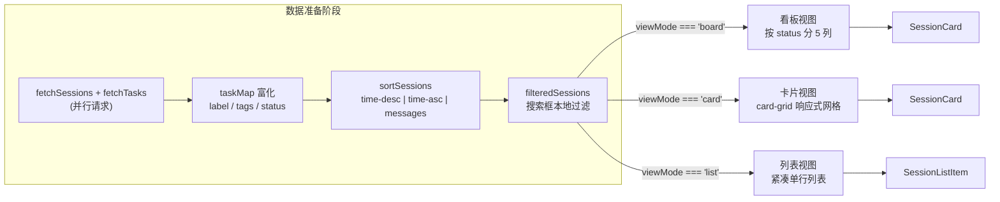
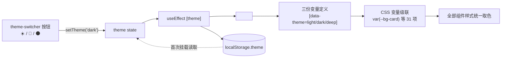

super-cli 的 Web 看板是一个**单文件 React SPA**（`App.tsx` 约 1285 行）配合一份手写全局样式表（`index.css` 约 2766 行）构建的呈现层——没有引入 Tailwind、CSS Modules 或 CSS-in-JS，全部样式通过语义化 class + CSS 自定义属性（CSS Variables）驱动。本页聚焦其中两个正交的维度：其一是任务数据的**三种视图形态**（board / card / list），其二是贯穿全局的**三套主题变量**（light / dark / deep）。这两个维度完全解耦：视图决定"信息如何组织"，主题决定"信息以什么颜色呈现"，任意视图 × 任意主题的组合都无需额外代码。

## 一、总体架构：视图与主题的正交设计

理解这套前端的第一原则是：**数据流单向收敛，渲染按 `viewMode` 分叉，颜色按 `data-theme` 级联**。会话列表从 API 加载后经历"富化 → 排序 → 过滤"三步，产出唯一的 `filteredSessions` 数组；三种视图只是这个数组的三个不同渲染分支。主题则完全不经过 React 组件树——它仅体现为 `<html>` 元素上的一个 `data-theme` 属性，所有组件样式统一引用 `var(--xxx)` 变量，变量值由三份 `[data-theme="..."]` 选择器提供。

下面的流程图展示了从 API 到三视图的数据路径（阅读前提：`mermaid flowchart` 语法，节点表示数据加工阶段或渲染分支）：

三个视图共享同一份类型定义：`ViewMode = 'board' | 'card' | 'list'`，同时 `Theme = 'light' | 'dark' | 'deep'`、`SortMode = 'time-desc' | 'time-asc' | 'messages'` 以及五态 `SessionStatus`（其推断逻辑属于后端职责，详见 [会话状态推断与任务看板模型](10-hui-hua-zhuang-tai-tui-duan-yu-ren-wu-kan-ban-mo-xing-backlog-in_progress-review-done-cancelled)）。类型旁的 `STATUS_COLUMNS` 常量固定了看板列的渲染顺序——**进行中、待复查、待办、已完成、已取消**——刻意将活跃工作流前置，而非按状态机顺序排列。`PROVIDER_COLORS` / `PROVIDER_LABELS` 则为三个 CLI 工具定义跨主题恒定的品牌色与缩写（CC/QD/CX），它们以 JS 常量形式内联到 `style` 属性，不参与主题变量体系。

Sources: [App.tsx](src/web/src/App.tsx#L24-L48), [App.tsx](src/web/src/App.tsx#L421-L428)

## 二、视图状态模型与 URL 同步策略

视图选择、排序、日期分组等状态在首次挂载时**从 URL 查询参数惰性初始化**：`viewMode` 读取 `?view=`（默认 `board`），`sortMode` 读取 `?sort=`（默认 `time-desc`），`groupByDate` 读取 `?group=`（默认跟随排序模式：时间排序时开启，消息数排序时关闭）。随后一个 `useEffect` 在这些状态变化时反向把它们写回 URL——注意写入端有一层"省略默认值"的优化：`if (viewMode !== 'board') params.set('view', viewMode)`，即看板作为默认视图不出现在 URL 中，保持链接简洁，并通过 `window.history.replaceState` 无刷新更新（不产生浏览器历史记录）。这使任何一个过滤+视图组合都可以被直接复制分享或收藏。

与之形成对比的是**主题的持久化走 localStorage 而非 URL**：`theme` 状态初始值来自 `localStorage.getItem('theme')`（缺省 `'light'`），变更时写回 localStorage。这是一个有意的设计区分——视图/过滤是"会话内容"的一部分，应随链接传播；主题是"用户环境偏好"，属于设备私有状态。

Sources: [App.tsx](src/web/src/App.tsx#L111-L149), [App.tsx](src/web/src/App.tsx#L169-L188)

## 三、看板视图：状态五列 + 可折叠日期分组

看板是默认视图，其渲染主干是一个针对 `STATUS_COLUMNS` 的 `map`：每一列先对 `filteredSessions` 做 `filter(s => s.status === col.key)`，列头由色点（`column-dot`，使用列定义中的 `color` 常量）、标题和计数徽章组成，列体是可滚动的 `column-cards` 容器。这里有一个值得注意的细节：`status` 在数据富化阶段有缺省兜底——`status: s.status ?? 'backlog'`，即后端未推断出状态的会话统一落入"待办"列，保证看板无"孤儿卡片"。

看板独有**日期分组**能力，但其入口有两重条件：工具栏的日历切换按钮仅在 `(sortMode === 'time-desc' || sortMode === 'time-asc') && viewMode === 'board'` 时渲染（消息数排序下按日期分组语义不成立），且列内部分组还要求 `groupByDate` 开启。分组逻辑由两个纯函数承担：`getDateGroup` 将时间戳归入"今天 / 昨天 / 周日~周六 / 更早"四档（7 天内按星期显示，更早一律"更早"）；`groupSessionsByDate` 用 `Map` 按标签分桶后，按动态计算的顺序数组 `['今天', '昨天', ...近5天星期, '更早']` 重排输出。每组包裹在 `DateGroupSection` 组件中——这是一个**自带独立 `collapsed` 状态**的可折叠区块（chevron 图标通过 CSS `transform: rotate(-90deg)` 旋转表示收起），因此看板中五列 × 多个日期组的折叠状态互不干扰。

布局层面，`.board` 是横向 flex 容器配 `overflow-x: auto`，每列 `.board-column` 固定 `min-width: 240px; flex-shrink: 0` 且 `max-height: 100%`，列体 `.column-cards` 内部 `overflow-y: auto`——即**列间横向滚动、列内纵向滚动**的经典双轴 Kanban 布局。

Sources: [App.tsx](src/web/src/App.tsx#L653-L719), [App.tsx](src/web/src/App.tsx#L905-L917), [App.tsx](src/web/src/App.tsx#L1011-L1040), [index.css](src/web/src/index.css#L1230-L1289)

## 四、卡片视图与列表视图：同一组件的两种密度

卡片视图（`viewMode === 'card'`）将 `filteredSessions` 平铺进 `.card-grid`，其布局核心是一行 CSS：`grid-template-columns: repeat(auto-fill, minmax(280px, 1fr))`——浏览器自动根据容器宽度填入尽可能多的 280px 起步列并均分剩余空间，无需任何媒体查询即实现响应式网格。列表视图（`viewMode === 'list'）则是 `.list-view` 纵向滚动容器中的 `.list-item` 行序列，每行以 `border-bottom` 分隔，单行截断（`text-overflow: ellipsis`），信息密度最高但只保留"项目路径 + 相对时间 + 消息数"三项元数据。

两种视图复用两个展示组件，它们的**标题降级链**完全一致：`label（用户命名）→ firstUserMessage 截断 → sessionId 前 8 位`，保证任何会话都有可读标题。差异在于信息量与交互通道：

| 维度 | 看板视图 board | 卡片视图 card | 列表视图 list |
|---|---|---|---|
| 渲染结构 | 5 状态列 × 卡片堆叠 | 无限网格 | 单列行式 |
| 复用组件 | `SessionCard` | `SessionCard` | `SessionListItem` |
| 布局关键 CSS | `flex + 列内 overflow-y`（L1231-1289） | `repeat(auto-fill, minmax(280px, 1fr))` | 纵向滚动 + 行分隔线 |
| 标题截断长度 | 60 字符（卡片） | 60 字符（卡片） | 80 字符（行） |
| 摘要/首条消息 | 显示（2 行 line-clamp） | 显示（2 行 line-clamp） | 不显示 |
| Git 分支徽章 | 显示 | 显示 | 不显示 |
| hover Tooltip | 有 | 有 | 无 |
| 独有能力 | 日期分组折叠、状态列计数 | — | 单屏容纳最多条目 |

卡片组件的选中态与悬停态是主题变量的直接消费者：`.session-card:hover` 将边框切换为 `--border-active` 并叠加 `--shadow-md` 与 `translateY(-1px)` 微动效；`.session-card.selected` 使用 `--accent` 边框 + `--accent-bg` 背景高亮当前查看的会话——这套交互在三种主题下自动获得各自配色，无需组件感知主题。

Sources: [App.tsx](src/web/src/App.tsx#L678-L744), [App.tsx](src/web/src/App.tsx#L919-L969), [index.css](src/web/src/index.css#L1291-L1401)

## 五、共享数据管线：富化、排序、过滤

三视图之前的数据管线集中在 `loadSessions` 中：并行请求 `fetchSessions`（limit 200）与 `fetchTasks` 后，用 `new Map(taskData.tasks.map(t => [t.sessionId, t]))` 构建**任务标签索引**，再逐条将会话与任务合并——`label`/`tags` 以 TaskStore 持久化的值为准覆盖会话原始字段（标签持久化机制详见 [TaskStore 标签持久化与用户配置存储](11-taskstore-biao-qian-chi-jiu-hua-yu-yong-hu-pei-zhi-cun-chu-super-cli-config-json)）。排序由 `sortSessions` 纯函数实现三种模式：时间戳字符串 `localeCompare` 的降/升序，或按用户+助手消息总数降序。最终的 `filteredSessions` 是一个**渲染时计算**（非 state）：搜索词命中 `firstUserMessage / label / sessionId / gitBranch` 任一字段即保留，工具栏的任务计数徽章与三个视图消费的是同一份数组，保证"计数 = 可见项"的一致性。

Sources: [App.tsx](src/web/src/App.tsx#L218-L252), [App.tsx](src/web/src/App.tsx#L421-L428)

## 六、主题系统：`data-theme` 属性驱动的变量级联

主题系统的实现极为克制，全链路只有三步：侧栏底部的 `theme-switcher` 三个按钮（☀️ 亮色 / 🌙 暗色 / 🌑 深色）调用 `setTheme`；一个 `useEffect` 执行 `document.documentElement.setAttribute('data-theme', theme)` 并同步 localStorage；CSS 端三份属性选择器各定义 31 个同名变量。**级联发生在 CSS 层而非 JS 层**——`<html data-theme="dark">` 之后，页面所有引用 `var(--bg-card)` 的规则瞬间换值，React 组件树零重渲染、零参与（`body` 的背景与文字色即直接引用 `--bg-primary` / `--text-primary`）。

三套变量的设计意图可以对比着读——**light 是暖米色调**（`--bg-primary: #faf7f2`，配金黄强调色 `#b8860b`），**dark 是 iOS 风格的中性灰**（`#1c1c1e` 底 + 亮蓝强调 `#6ba0ff`），**deep 是原始的深蓝夜色**（`#1a1a2e` / `#16213e` 双层蓝黑 + `#4f8cff` 蓝）。变量按职责分为七组，每组在三个主题中同名不同值：

| 变量组 | 代表变量 | light | dark | deep |
|---|---|---|---|---|
| 页面/容器背景 | `--bg-primary` | `#faf7f2` 暖米白 | `#1c1c1e` 近黑 | `#1a1a2e` 深蓝黑 |
| 卡片背景 | `--bg-card` | `#ffffff` | `#3a3a3c` | `#1e2a4a` |
| 边框（普通/高亮） | `--border-color` / `--border-active` | `#e8e2d8` / `#c4a882` | `#48484a` / `#6ba0ff` | `#2a3f5f` / `#4f8cff` |
| 强调色 | `--accent` | `#b8860b` 金黄 | `#6ba0ff` 蓝 | `#4f8cff` 蓝 |
| 选中背景 | `--accent-bg` | `#fdf6e3` 米黄 | `#1a3050` 深蓝 | `#1a3050` 深蓝 |
| 文字三级 | `--text-primary` | `#2c2c2c` | `#f0f0f0` | `#e8eaf0` |
| 消息气泡边框 | `--msg-assistant-border` | `#a8c4a0` 灰绿 | `#4ade80` 绿 | `#10b981` 绿 |
| 阴影三级 | `--shadow-lg` 透明度 | 0.12 | 0.4 | 0.5 |

变量表之外还有固定的 `--radius / --radius-sm / --radius-xs` 三档圆角（10/6/4px），三主题共享——**形状不变、仅色彩换肤**是这套系统的明确边界。

Sources: [index.css](src/web/src/index.css#L7-L109), [index.css](src/web/src/index.css#L111-L119), [App.tsx](src/web/src/App.tsx#L585-L589), [App.tsx](src/web/src/App.tsx#L185-L188)

## 七、分段控件模式与跨主题一致性细节

主题切换器（`.theme-switcher` + `.theme-btn`）与视图切换器（`.view-toggle` + `.view-btn`）共享同一套**分段控件（segmented control）样式范式**：容器提供 `--bg-input` 底色和内边距，激活项获得 `--bg-card` 背景 + `--shadow-sm` 浮起效果，未激活项通过 `opacity: 0.5` 退后。由于两套控件都只引用变量，它们在三主题下自动适配，且代码上呈现清晰的对称结构——这是一种值得在团队内固化的 UI 约定。

三个跨主题一致性的细节值得指出。第一，**Tooltip 刻意反色**：light 主题的 tooltip 背景是深色 `#2c2c2c`（配白字），而 dark/deep 主题下反而是浅色 `#f0f0f0` / `#e8eaf0`（配深字）——与底色形成强对比，悬浮预览永远醒目。第二，**Provider 品牌色不随主题变化**：`PROVIDER_COLORS` 作为 JS 常量直接内联 `style={{ background }}`，三主题下 CC 橙 / QD 紫 / CX 绿恒定，保证身份识别稳定。第三，**绝大多数组件零主题覆盖**：整个 2766 行样式表中只有极少数按主题硬编码的覆盖规则（如配置中心 scope 徽章在深色系下改用 `#1e3a5f` 底 + `#93c5fd` 字），连滚动条都通过 `::-webkit-scrollbar-thumb { background: var(--border-color) }` 接入变量体系——这验证了变量命名的完备性。

Sources: [index.css](src/web/src/index.css#L225-L248), [index.css](src/web/src/index.css#L1142-L1184), [index.css](src/web/src/index.css#L1620-L1621), [index.css](src/web/src/index.css#L1792-L1796), [index.css](src/web/src/index.css#L2762-L2766)

## 八、响应式降级：移动端锁定看板

在 `@media (max-width: 767px)` 断点下，`.view-toggle` 与 `.group-toggle` 直接 `display: none`——移动端不提供视图与分组切换，用户被锁定在默认的看板视图。这与桌面端"URL 记忆视图状态"形成互补的两级策略：宽屏享受三视图自由，窄屏收敛到唯一适合触屏纵向浏览的形态。由于组件渲染由 `viewMode` 状态驱动而非 CSS 控制可见性，此处的降级只隐藏了切换入口，若 URL 显式携带 `?view=list`，窄屏仍会渲染列表视图。

Sources: [index.css](src/web/src/index.css#L2749-L2759), [App.tsx](src/web/src/App.tsx#L678-L744)

## 九、小结与实现启示

这套三视图 + 三主题系统的核心启示在于**两个正交维度的最小成本实现**：视图切换只需一个 `viewMode` 字符串状态加三个条件渲染分支，其持久化借力 URL 查询参数免费获得可分享性；主题切换只需一个 DOM 属性加三份 CSS 变量表，其持久化借力 localStorage 获得设备级记忆。两者交汇处（如卡片的选中态配色）完全交给 CSS 变量解耦，JS 侧不存在任何 `if (theme === 'dark')` 式的分支——这是"让 CSS 做 CSS 擅长的事"的典型案例。若要扩展第四种主题或第四种视图，分别只需追加一份 `[data-theme="..."]` 变量块或一个渲染分支与工具栏按钮，现有代码零修改。

延伸阅读：视图切换之上的**任务模式 / Harness 配置模式**双模式切换见 [双模式 SPA 架构](16-shuang-mo-shi-spa-jia-gou-ren-wu-mo-shi-yu-harness-pei-zhi-mo-shi-de-shi-tu-qie-huan)；看板五态的**状态推断规则**见 [会话状态推断与任务看板模型](10-hui-hua-zhuang-tai-tui-duan-yu-ren-wu-kan-ban-mo-xing-backlog-in_progress-review-done-cancelled)；卡片标签数据的**来源与持久化**见 [TaskStore 标签持久化与用户配置存储](11-taskstore-biao-qian-chi-jiu-hua-yu-yong-hu-pei-zhi-cun-chu-super-cli-config-json)。