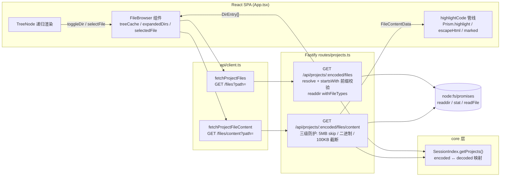
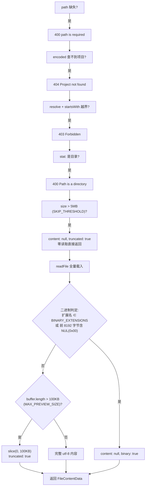
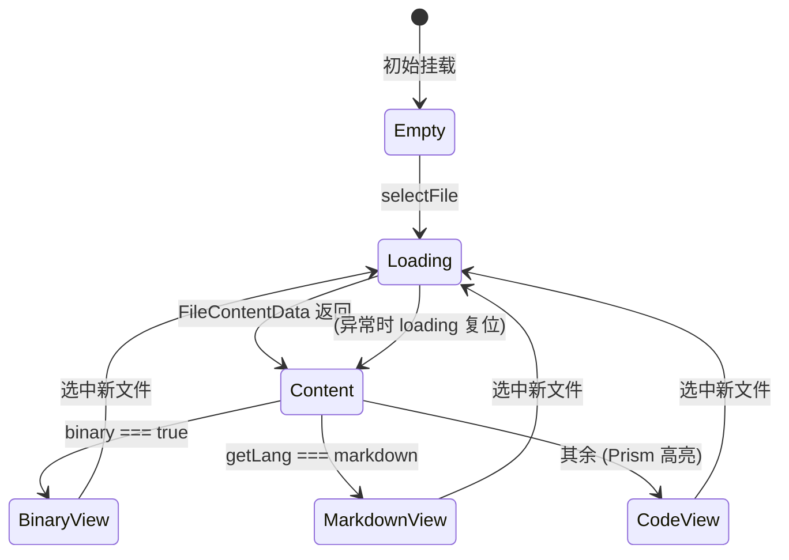

项目文件浏览器是 Web 看板中唯一一处允许用户从浏览器直接**读取本机任意已托管项目磁盘内容**的功能面。它以项目详情浮层的「文件」标签页为入口，由一个惰性加载的目录树、一个双栏预览面板，以及两个 Fastify 端点（目录扫描 `/files` 与内容读取 `/files/content`）构成。本文从端到端视角剖析这条链路：服务端如何用 `Dirent` 实现免 `stat` 的类型判定、如何用 `resolve + startsWith` 前缀校验封闭读取边界、如何用「扩展名黑名单 + NUL 字节嗅探」双通道识别二进制，以及前端如何组织 `treeCache` 惰性加载、Prism.js 语言注册与降级高亮管线。与本项目其他读操作一致，它是一套**只读**能力，没有任何写入端点参与。

Sources: [projects.ts](src/server/routes/projects.ts#L127-L225), [App.tsx](src/web/src/App.tsx#L804-L861)

## 入口与挂载点：详情浮层的双标签结构

文件浏览器并不占据独立路由，而是嵌在项目详情浮层内部。点击项目卡片的「查看详情」后，`openProjectDetail` 通过 `fetchProjectDetail(encoded)` 拉取元数据并置入 `projectDetail` 状态，浮层头部渲染「详情 / 文件」两个标签按钮，由 `overlayTab` 状态（`'detail' | 'files'`）驱动切换。只有当用户切到 `files` 标签时才渲染 `<FileBrowser encoded={projectDetail.encoded} />`，同时浮层面板会附加 `overlay-panel-wide` 类名横向扩宽——这是 React 惰性求值与 CSS 状态类的组合：文件浏览器组件树与请求开销都不会在「详情」标签下发生。关闭浮层时 `setOverlayTab('detail')` 将标签复位，保证下次打开回到默认视图。

Sources: [App.tsx](src/web/src/App.tsx#L341-L346), [App.tsx](src/web/src/App.tsx#L804-L816)

## 端到端架构：一次点击背后的四层协作

在深入各层实现之前，先建立全局图景。用户在目录树中的一次点击（展开目录或选中文件），会经历「React 组件状态 → fetch 封装 → Fastify 路由 → Node fs」四层，每一层都有明确的职责边界：前端只负责路径拼接与缓存策略，API client 只负责 URL 构造，路由层承担**全部安全校验与内容整形**，fs 层只做机械的目录读取。

值得注意的一个架构决策：**两个端点都拒绝直接信任请求中的绝对路径**。路由先通过 `index.getProjects()` 在已注册项目集合中查找 `encoded` 参数对应的记录，取出 `project.decoded`（即磁盘上的真实绝对路径）作为唯一的读取根目录 `rootDir`。也就是说，前端传入的 `path` 查询参数永远是相对路径，绝对路径锚点只存在于服务端内存中。`encoded/decoded` 的编码规则本身（路径转义算法）在[路径编码规则与各 CLI 数据目录布局](21-lu-jing-bian-ma-gui-ze-yu-ge-cli-shu-ju-mu-lu-bu-ju-claude-qoder-codex)中单独展开。

Sources: [App.tsx](src/web/src/App.tsx#L1143-L1178), [client.ts](src/web/src/api/client.ts#L233-L245), [projects.ts](src/server/routes/projects.ts#L127-L145)

## 服务端目录扫描：Dirent 直判、黑名单过滤与确定性排序

`GET /api/projects/:encoded/files` 的核心是一次 `readdir(resolvedPath, { withFileTypes: true })`。`withFileTypes: true` 让 Node 返回 `Dirent` 对象而非字符串数组，`entry.isDirectory()` / `entry.isFile()` 直接来自 `getdents` 系统调用返回的 `d_type` 字段——目录项类型判定**零额外系统调用**。类型信息随后被归一化为 `'dir' | 'file'` 二值写入响应项。

扫描结果经过三道整形。第一道是**忽略黑名单** `IGNORED_ENTRIES`（`.git`、`node_modules`、`dist`、`.DS_Store`、`__pycache__`、`.next`、`.nuxt`、`.cache`、`.turbo`、`.gradle`、`target` 共 11 项），只做精确名匹配而非 glob，命中即跳过——这些目录要么体积巨大（`node_modules`）、要么是构建产物（`dist`/`target`）、要么是工具私有状态（`.turbo`/`.gradle`），对「浏览项目源码」这一场景全是噪音。第二道是**文件元数据补全**：仅当 `entry.isFile()` 时才追加一次 `stat` 调用取 `size`，并用 `extname(entry.name).slice(1).toLowerCase()` 提取小写扩展名；`stat` 失败（如权限或竞态删除）被静默吞掉，条目仍保留名称与类型。第三道是**确定性排序**：目录优先于文件（`a.type === 'dir' ? -1 : 1`），同级内按 `localeCompare` 排序，保证前端树每次展开的顺序稳定。目录扫描失败（路径不存在、无权限）统一折叠为 `404 Directory not found`。

Sources: [projects.ts](src/server/routes/projects.ts#L12-L15), [projects.ts](src/server/routes/projects.ts#L144-L171)

响应条目的形状由前端接口镜像定义：`DirEntry` 仅含 `name`、`type`、可选 `size` 与 `extension` 四个字段，服务端构造时以类型注解强制约束（`extension` 仅在非空时写入），保持载荷最小化。

Sources: [App.tsx](src/web/src/App.tsx#L1085-L1090), [projects.ts](src/server/routes/projects.ts#L149-L161)

## 路径穿越防护：resolve 归一化 + 前缀围栏

两个端点共用同一套防护逻辑，以目录扫描端点为例：`const resolvedPath = resolve(rootDir, relativePath)` 先将相对路径归一化为绝对路径——`resolve` 会展开 `..`、折叠冗余分隔符、并在 `relativePath` 本身是绝对路径时直接采用后者；随后 `resolvedPath.startsWith(rootDir)` 判定结果是否仍落在项目根目录之内，越界立即返回 `403 Forbidden`。这条防线同时拦截三类攻击向量：`path=../../etc/passwd` 式的经典穿越、`path=/etc` 式的绝对路径注入（`resolve` 会丢弃 rootDir 前缀）、以及 URL 解码后携带 `..` 段的混合形态。

需要以工程审计视角指出该实现的一个**边界语义特征**：`startsWith` 是纯字符串前缀比较，未附加路径分隔符边界。若存在与 `rootDir` 共享前缀的兄弟目录（如根为 `/Users/x/app` 时目标 `/Users/x/app-cache`），前缀比较会放行——因为校验的锚点 `rootDir` 完全由服务端 `SessionIndex` 内部数据决定、且请求方无法影响其取值，实际可利用面被压缩；但从纵深防御角度，`startsWith(rootDir + sep)` 是此类守卫的常见加固写法。本仓库将此作为已知实现形态记录，读者可对照自身的威胁模型评估。此外，防线之上还有一层隐式约束：`encoded` 必须命中已注册项目，否则 `404`，攻击者连 `rootDir` 的候选集合都无法枚举。

Sources: [projects.ts](src/server/routes/projects.ts#L127-L145), [projects.ts](src/server/routes/projects.ts#L186-L193)

## 文件内容服务：三级防护与二进制识别

`GET /api/projects/:encoded/files/content` 在同一套前缀围栏之后，串起一条**自上而下的短路判定链**，任何一级命中即返回，避免无谓的 I/O。理解这条链的关键在于三个阈值的分工：`SKIP_THRESHOLD`（5 MB）决定「读都不读」，`BINARY_EXTENSIONS` 与内容嗅探决定「读了也不给」，`MAX_PREVIEW_SIZE`（100 KB）决定「给但只给一半」。

其中二进制识别采用**双通道策略**。扩展名通道（`BINARY_EXTENSIONS`，覆盖 png/zip/woff/sqlite/pyc 等 30 余种）是零成本白名单式预判；内容通道则对读入的 buffer 执行 `buffer.slice(0, 8192).includes(0)`——在前 8 KB 中搜索 NUL 字节，这是文本编码（UTF-8/ASCII 中 `0x00` 不作为可打印内容出现）与二进制载荷的经典判据。两通道**任一命中即判为二进制**，返回 `content: null, binary: true`，前端据此渲染「二进制文件」占位视图而非乱码。截断采用 UTF-8 字符串层面的 `slice(0, MAX_PREVIEW_SIZE)`，以 buffer 长度（字节数）与 100 KB 比较、再切字符串——100 KB 边界处若恰逢多字节字符，`utf-8` 解码已先行完成，`slice` 按码点截断不会产生半个字符。响应中的 `truncated` 与 `size` 字段让前端能同时显示「实际多大」与「给了多少」。

Sources: [projects.ts](src/server/routes/projects.ts#L17-L24), [projects.ts](src/server/routes/projects.ts#L174-L225)

为便于对照，三级防护的完整参数表如下：

| 防护层 | 常量 / 集合 | 阈值或规模 | 命中结果 | 设计意图 |
|---|---|---|---|---|
| 体积短路 | `SKIP_THRESHOLD` | 5 MB | `content: null, truncated: true` | 超大文件连 `readFile` 都不执行，防内存尖峰 |
| 二进制判定 | `BINARY_EXTENSIONS` | 30+ 扩展名 | `content: null, binary: true` | 已知格式直接跳过解码 |
| 二进制判定 | 内容嗅探 | 前 8192 字节查 `0x00` | 同上 | 兜住无扩展名 / 伪装扩展名的二进制 |
| 预览截断 | `MAX_PREVIEW_SIZE` | 100 KB | `slice(0, 100KB)` + `truncated: true` | 控制网络载荷与 DOM 渲染量 |

Sources: [projects.ts](src/server/routes/projects.ts#L202-L220)

## 前端目录树：treeCache 惰性加载与 TreeNode 递归

前端树采用**按目录惰性加载**策略，这与服务端的按目录扫描端点严格对齐——整个浏览器从不递归整棵目录树，每次只拉取一层。状态模型由三个数据结构构成：`treeCache: Map<string, DirEntry[]>` 以相对路径为键缓存每个已访问目录的条目（空字符串 `''` 代表项目根）；`expandedDirs: Set<string>` 记录展开态；`selectedFile` 与 `fileContent` 管理当前选中文件。组件挂载或 `encoded` 变化时，`useEffect` 仅拉取根目录一层并以 `new Map([['', entries]])` 初始化缓存。

`toggleDir` 是该模型的核心交互函数：先以不可变方式翻转 `Set` 中的展开态，再检查 `treeCache`——**只有缓存未命中时才发请求**，取回后通过 `new Map(prev).set(...)` 返回全新 Map 引用以触发 React 重渲染。这意味着目录的反复折叠/展开不会产生重复网络请求，且组件不设缓存失效机制（刷新依赖整页数据刷新或重开浮层），对静态性较强的项目源码树是合理的取舍。`selectFile` 则走内容端点，用 `loading` 状态包裹请求并在 `finally` 中复位，保证加载指示与数据到达的时序一致。

Sources: [App.tsx](src/web/src/App.tsx#L1143-L1178)

树的本体由 `TreeNode` 递归组件渲染。它接收当前层 `entries`、深度 `level` 与共享的三个回调/集合，对每个条目拼接 `fullPath`（`path ? path + '/' + name : name`），渲染一行带图标的条目：目录行有可旋转的 `▶` chevron（CSS `transform: rotate(90deg)` 表示展开）与文件夹图标，文件行为文件图标；**仅当目录处于展开态且 `treeCache` 中已有其子条目时**才递归渲染子 `TreeNode`，`level + 1` 传递使缩进按 `level * 16 + 8` 像素线性递增。点击行为按类型分派：目录走 `onToggleDir`，文件走 `onSelectFile`，选中行获得 `selected` 类的高亮。这种「展开 + 缓存命中」双条件的渲染守卫，让尚未加载完成的子树不闪现空容器。

Sources: [App.tsx](src/web/src/App.tsx#L1226-L1277), [index.css](src/web/src/index.css#L737-L754)

布局层面，`.file-browser` 是一个 `flex` 双栏容器：左侧 `.file-tree` 固定 240 px 宽、纵向滚动、`white-space: nowrap` 的条目名依赖 `text-overflow: ellipsis` 截断长文件名；右侧 `.file-preview` 弹性占满剩余空间并自带滚动，`min-width: 0` 是让 flex 子项内部横向滚动（`.file-content-pre` 的 `overflow-x: auto`）生效的关键细节。整体高度锚定 `calc(80vh - 100px)`、最小 300 px。

Sources: [index.css](src/web/src/index.css#L697-L713), [index.css](src/web/src/index.css#L760-L814)

## Prism.js 高亮管线：语言注册、映射表与降级链

前端在模块顶部一次性完成 Prism 的**静态语言注册**：`prismjs` 主模块自带 markup/css/clike/javascript 四种核心文法，随后按依赖顺序显式 import 16 个语言组件——`typescript` 先于 `tsx`（tsx 依赖 typescript + jsx），`jsx` 先于 `tsx`，其余 json/css/bash/python/yaml/toml/markdown/sql/rust/go/java/docker 相互独立，最终引入 `prism-tomorrow.css` 暗色主题提供 token 级配色。这条 import 链在 Vite 构建时全部打包进主 bundle（未做按需异步加载），换来的是高亮零延迟。

Sources: [App.tsx](src/web/src/App.tsx#L4-L20)

从文件路径到 Prism 文法的映射分两级。`EXT_TO_LANG` 静态表覆盖常规扩展名，并做了三处有意识的归并：`scss/less → css`、`mjs/jsx → jsx`、`graphql/gql → typescript`（借 TypeScript 文法近似高亮 GraphQL）、`html/xml/svg → markup`。`getLang` 在查表之前先做**无扩展名特判**——完整文件名（小写化后）等于 `dockerfile` 映射到 docker 文法、等于 `makefile` 借用 bash 文法；随后以 `endsWith('.d.ts')` 拦截声明文件（若不拦截，`split('.').pop()` 会取到 `ts` 之外的错误段位——此处取最后一段本就是 `ts`，该特判的价值在于语义明确与未来扩展）。查表未命中返回 `undefined`。

Sources: [App.tsx](src/web/src/App.tsx#L1106-L1125)

`highlightCode` 构成一条**双保险降级链**：无语言映射、或 `Prism.languages[lang]` 中文法不存在（例如 import 被裁剪时），一律退回 `escapeHtml`——将 `& < >` 转义为实体的纯文本安全渲染；只有映射与文法同时就绪才调用 `Prism.highlight(code, grammar, lang)` 产出带 `` 的 HTML。产出通过 `dangerouslySetInnerHTML` 注入 `<pre><code>`，因此「任何内容进入 DOM 前**必经** Prism.highlight 或 escapeHtml 之一」是这条管线的不变量——两条路径都不放行原始文本。注意 markdown 走独立分支：`getLang(path) === 'markdown'` 时不进 Prism，改由 `marked.parse` 渲染为富文档视图（`.file-md-body`）。

Sources: [App.tsx](src/web/src/App.tsx#L1127-L1141), [App.tsx](src/web/src/App.tsx#L1214-L1218)

两级映射的完整对照表：

| 判定层级 | 输入示例 | 映射结果 | 说明 |
|---|---|---|---|
| 完整文件名特判 | `Dockerfile` | `docker` | 无扩展名文件 |
| 完整文件名特判 | `Makefile` | `bash` | 借用 bash 文法 |
| 后缀模式特判 | `env.d.ts` | `typescript` | 声明文件 |
| 扩展名表 | `app.tsx` / `api.jsx` | `tsx` / `jsx` | 同族归并 |
| 扩展名表 | `style.scss` | `css` | 预处理器归并 |
| 扩展名表 | `schema.graphql` | `typescript` | 近似文法复用 |
| 扩展名表 | `index.html` / `logo.svg` | `markup` | Prism 核心文法 |
| 未命中 | `data.lock` | `undefined` | 触发 escapeHtml 纯文本降级 |

Sources: [App.tsx](src/web/src/App.tsx#L1106-L1133)

## 预览面板状态机与 UI 反馈

预览面板是一个**五态互斥渲染**的分支结构，状态由 `loading / selectedFile / fileContent` 三个信号联合决定，渲染优先级从上到下短路：加载中 → 空态（未选文件）→ 二进制占位 → 正常内容。正常内容态又叠加两个条件元素：`truncated` 为真时渲染截断横幅（文案「文件过大，仅显示前 100 KB」，同时用 `formatSize` 显示真实体积），文件路径与体积常驻头部栏。

`formatSize` 是一个三级阶梯格式化器（B → KB → MB，一位小数），同时服务于二进制占位、预览头部与截断横幅三处，保证全 UI 体积口径一致。二进制态由 `IconFileBinary` 图标 + 「二进制文件」文案 + 体积三元素垂直居中构成，与文本态的代码视图形成明确的视觉区分。

Sources: [App.tsx](src/web/src/App.tsx#L1100-L1104), [App.tsx](src/web/src/App.tsx#L1194-L1221), [index.css](src/web/src/index.css#L816-L839)

## 设计要点小结与延伸阅读

回顾全链路，这套实现有三个值得沉淀的模式。其一是**惰性对齐**：服务端按单层目录扫描、前端按单层缓存，两端粒度一致，天然规避了大仓库全树递归的性能悬崖。其二是**校验集中在路由层**：前缀围栏、体积短路、二进制判定全部收口在 Fastify 端点内，前端 API client（`fetchProjectFiles` / `fetchProjectFileContent` 仅做 `encodeURIComponent` 与 query 拼接）不承载任何安全职责，符合「不信任客户端」的原则。其三是**降级链完备**：高亮有 escapeHtml 兜底、预览有二进制/截断占位、目录读取失败有 404 折叠，任何输入都有确定的输出形态。

若想继续深入相关子系统：端点的注册方式与 Fastify 插件结构参见 [Fastify 5 REST API 参考：sessions / tasks / stats / projects / config / refresh](14-fastify-5-rest-api-can-kao-sessions-tasks-stats-projects-config-refresh)；`encoded/decoded` 的路径转义算法与来源参见 [路径编码规则与各 CLI 数据目录布局（~/.claude、~/.qoder、~/.codex）](21-lu-jing-bian-ma-gui-ze-yu-ge-cli-shu-ju-mu-lu-bu-ju-claude-qoder-codex)；浮层所依赖的项目元数据（Git 状态、Node 版本）采集参见 [项目元数据采集（Git / Node 版本 / 包管理器）与归档、置顶机制](22-xiang-mu-yuan-shu-ju-cai-ji-git-node-ban-ben-bao-guan-li-qi-yu-gui-dang-zhi-ding-ji-zhi)；预览面板的色彩变量如何随三主题切换参见 [看板 / 卡片 / 列表三视图实现与亮色 / 暗色 / 深蓝主题系统](17-kan-ban-qia-pian-lie-biao-san-shi-tu-shi-xian-yu-liang-se-an-se-shen-lan-zhu-ti-xi-tong)。