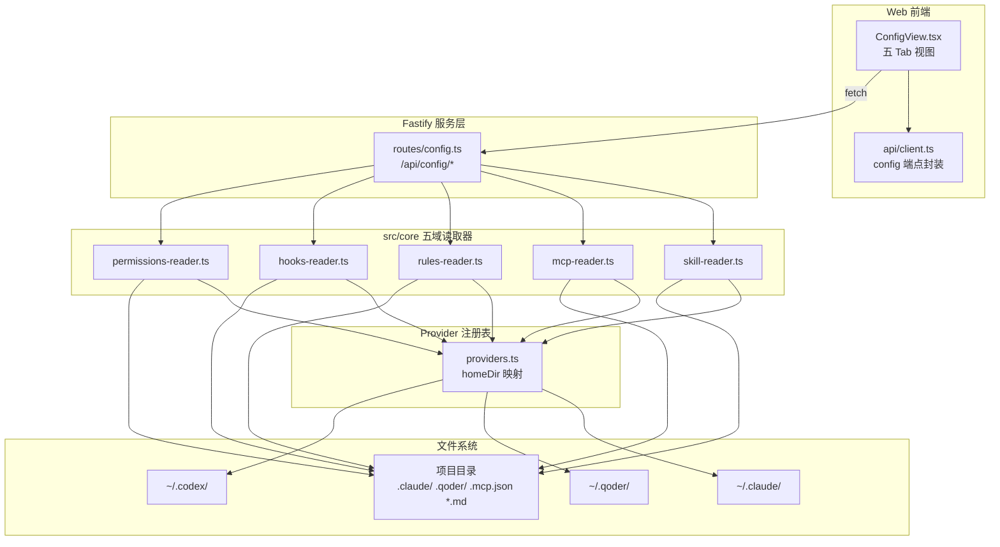
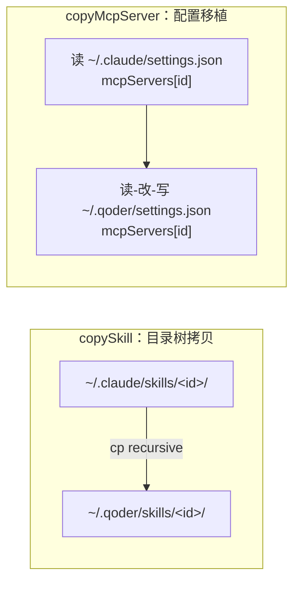

本页解析 super-cli 的 **Harness 配置中心**——一套面向 AI 编程助手（Claude Code、Qoder、Codex）的配置资产统一管理子系统。它将五类异构配置（技能、MCP 服务器、规则文件、钩子、权限）抽象为同构的读取接口，并通过 HTTP 层向前端 `ConfigView` 提供聚合视图与**跨 Provider 复制**能力。本文聚焦该子系统的五层结构：读取器（`src/core/*-reader.ts`）→ Provider 注册表 → REST 路由 → API 客户端 → 前端视图，并剖析其双作用域模型（global / project）与两种截然不同的复制语义。

## 总体架构：五域读取器与同构签名

Harness 配置中心的底座是 `src/core` 下五个职责单一的读取器模块。它们各自封装一种配置域的物理存储差异，却对外暴露高度一致的函数签名：`get*(provider?: CliProvider, projectPath?: string)`。当 `provider` 省略时遍历所有已安装 Provider，当 `projectPath` 提供时追加项目级作用域。这种**签名即契约**的设计让上层路由无需感知每个域的存储细节。

在阅读下面的架构图之前需要理解一个前提：五个读取器都依赖 `providers.ts` 的注册表来解析 Provider 主目录（`~/.claude`、`~/.qoder`、`~/.codex`），并通过 `getAvailableProviders()` 的 `existsSync` 过滤只暴露本机实际安装的 CLI（Provider 注册表的完整设计参见[多 Provider 架构](5-duo-provider-jia-gou-claude-code-qoder-codex-de-zhu-ce-biao-she-ji)）。

五个读取器的能力矩阵如下表所示，可以看出一条清晰的**读写能力递减曲线**：Skills 与 MCP 拥有完整 CRUD 加复制；Rules 支持内容读写但无删除；Hooks 与 Permissions 仅只读。同时 Codex 在除 Skills 外的四个域中被系统性排除（`filter(p => p.id !== 'codex')`），因为 Codex CLI 的配置格式（TOML 风格）与 `settings.json` 体系不兼容。

| 读取器 | 物理来源 | 解析格式 | 读取 | 写入/删除 | 跨 Provider 复制 | 支持 Codex |
|---|---|---|---|---|---|---|
| skill-reader | `skills/<id>/SKILL.md` 目录树 | Markdown + YAML frontmatter | ✅ | ✅ rm / cp | ✅ copySkill | ✅ |
| mcp-reader | `settings.json` 的 `mcpServers` 键 + 项目 `.mcp.json` | JSON | ✅ | ✅ 读改写 | ✅ copyMcpServer | ❌ |
| rules-reader | `CLAUDE.md` / `AGENTS.md` 等 Markdown 文件 | 纯文本 | ✅ | ✅ 内容写入 | ❌ | ❌（无全局 spec） |
| hooks-reader | `settings.json` 的 `hooks` 键 | JSON | ✅ | ❌ | ❌ | ❌ |
| permissions-reader | `settings.json` 的 `permissions` 键 | JSON | ✅ | ❌ | ❌ | ❌ |

Sources: [providers.ts](src/core/providers.ts#L42-L48) · [mcp-reader.ts](src/core/mcp-reader.ts#L81-L83) · [hooks-reader.ts](src/core/hooks-reader.ts#L61-L63) · [permissions-reader.ts](src/core/permissions-reader.ts#L24-L26)

## 双作用域模型：global 与 project 的路径解析

每个读取器都实现了**全局/项目双作用域**。全局作用域锚定在 Provider 主目录（如 `~/.claude/skills/`），项目作用域则锚定在项目根目录下的 Provider 专属点目录。路径映射逻辑内联在各读取器中，以三元表达式将 Provider id 翻译为目录名：`claude-code → .claude`、`qoder → .qoder`、`codex → .codex`。

MCP 是唯一的例外——它的项目作用域不是 Provider 点目录，而是**跨 Provider 共享的项目根 `.mcp.json` 文件**。这意味着当存在项目级 `.mcp.json` 时，所有 Provider 实际读的是同一份数据，前端将其归入首个激活 Provider 名下展示。这是一个务实的适配决策：`.mcp.json` 是 MCP 生态的社区通用约定，各 CLI 均直接读取它。

| 配置域 | 全局路径 | 项目路径 |
|---|---|---|
| Skills | `~/<provider-home>/skills/` | `<project>/<dirName>/skills/` |
| MCP Servers | `~/<provider-home>/settings.json` | `<project>/.mcp.json` |
| Rules | `~/.claude/CLAUDE.md`、`~/.qoder/AGENTS.md` | 项目根的规则文件集合 |
| Hooks | `~/<provider-home>/settings.json` | `<project>/<dirName>/settings.json` |
| Permissions | `~/<provider-home>/settings.json` | `<project>/<dirName>/settings.json` |

Sources: [skill-reader.ts](src/core/skill-reader.ts#L22-L29) · [mcp-reader.ts](src/core/mcp-reader.ts#L24-L30) · [hooks-reader.ts](src/core/hooks-reader.ts#L78-L92) · [permissions-reader.ts](src/core/permissions-reader.ts#L43-L59)

## Skills 读取器：目录扫描与零依赖 frontmatter 解析

Skills 是五域中唯一**目录树形态**的资产：每个 Skill 是 `<skills-dir>/<id>/` 下的一个目录，其身份由其中的 `SKILL.md` 文件定义。`scanSkillsDir` 对目录做单层遍历——跳过以 `.` 开头的隐藏条目、忽略没有 `SKILL.md` 的目录，然后读取 Markdown 内容提取元数据。

元数据提取采用**手写的正则式 YAML frontmatter 解析器**而非引入 YAML 库。`parseYamlFrontmatter` 用正则 `/^---\r?\n([\s\S]*?)\r?\n---/` 捕获首尾 `---` 分隔块，再逐行按首个冒号切分键值、剥除首尾引号。这个实现只支持扁平的字符串键值对（`name`、`version`、`description`），不支持嵌套结构与列表——对 Skill 元数据这一浅层场景而言是合理的零依赖取舍。解析失败时降级为仅用目录名作为 Skill 名称，保证扫描永不抛错。

`getSkills` 的聚合流程体现了双作用域的完整闭环：对每个 Provider 先扫描全局 `skills/` 目录，若传入 `projectPath` 再扫描项目点目录下的 `skills/`，两个作用域的结果合并后按名称排序返回。类型契约由共享类型 `SkillInfo` 定义（`id` / `name` / `version` / `description` / `provider` / `scope` / `directory`），`directory` 字段保留完整绝对路径供前端展示与后续删除操作定位。

Sources: [skill-reader.ts](src/core/skill-reader.ts#L7-L29) · [skill-reader.ts](src/core/skill-reader.ts#L31-L71) · [skill-reader.ts](src/core/skill-reader.ts#L73-L93) · [types.ts](src/core/types.ts#L180-L188)

## MCP 读取器：双数据源、类型推断与健康缓存融合

MCP Servers 的读取需要协调**三个异构数据源**：各 Provider `settings.json` 中的 `mcpServers` 键（全局作用域）、项目根 `.mcp.json`（项目作用域）、以及 Claude Code 写出的 `~/.claude/mcp-health-cache.json`（健康状态缓存）。

`toServerInfo` 负责将原始 JSON 配置归一化为 `McpServerInfo` 结构，其中包含两个推断逻辑：其一，**传输类型推断**——配置含 `url` 字段则视为网络型（`type: 'sse'` 显式声明时为 `sse`，否则为 `http`），否则为 `stdio` 本地进程型；其二，**健康状态映射**——以 Claude Code 的健康缓存为唯一数据源，`status === 'connected'` 映射为 `healthy`，其余为 `unhealthy`，缓存缺失则为 `unknown`。值得注意的是健康缓存按 server id 全局匹配，不区分 Provider——两个 Provider 注册同名 server 时会共享同一健康判定。

写入路径采用**读-改-写**（read-modify-write）模式：`addMcpServer` 与 `deleteMcpServer` 先读出完整 `settings.json`（或 `.mcp.json`），仅修改 `mcpServers` 键后以 `JSON.stringify(data, null, 2)` 回写，保留文件中其他配置键（如 `hooks`、`permissions`）不受影响。`updateMcpServer` 直接复用 `addMcpServer`——以 id 为键的写入天然是幂等更新。

Sources: [mcp-reader.ts](src/core/mcp-reader.ts#L7-L30) · [mcp-reader.ts](src/core/mcp-reader.ts#L56-L75) · [mcp-reader.ts](src/core/mcp-reader.ts#L77-L101) · [mcp-reader.ts](src/core/mcp-reader.ts#L103-L129) · [types.ts](src/core/types.ts#L190-L201)

## Rules 读取器：静态注册表加项目根扫描

Rules 域的存储最"原始"——直接是 Markdown 文件。全局规则采用**硬编码注册表**：`getGlobalRuleSpecs` 将 Claude Code 映射到 `~/.claude/CLAUDE.md`、Qoder 映射到 `~/.qoder/AGENTS.md`，Codex 没有条目。每个 spec 生成带 `exists` 标志的 `RuleFile` 条目——文件不存在也照样列出，前端会显示"新建"徽标并允许用户在线创建，这是一种"虚拟占位"设计。

项目级规则的发现分两步：先按已知清单 `KNOWN_PROJECT_RULE_NAMES`（`CLAUDE.md`、`AGENTS.md`、`.cursorrules`、`.github/copilot-instructions.md`）精确探测，再回退到枚举项目根目录**所有 `.md` 文件**（排除 README 与已收录项），从而兼容任意命名的约定式规则文件。全局条目的 id 采用三段式编码 `<provider>:global:<name>`，项目条目为 `<provider>:project:<name>`——注意项目条目的 provider 字段填充的是"主 Provider"（请求参数或默认 `claude-code`），因为项目根规则文件本质上是跨 Provider 共享的。

`getRuleContent` / `saveRuleContent` 以**裸文件路径**为参数（不做任何路径校验），保存时自动 `mkdir -p` 父目录。这构成了 Rules 域的最小写接口——可读可写，但无删除与跨 Provider 复制。

Sources: [rules-reader.ts](src/core/rules-reader.ts#L7-L30) · [rules-reader.ts](src/core/rules-reader.ts#L32-L52) · [rules-reader.ts](src/core/rules-reader.ts#L54-L86) · [rules-reader.ts](src/core/rules-reader.ts#L88-L97)

## Hooks 与 Permissions：settings.json 的只读解析层

Hooks 与 Permissions 是五域中最轻量的两个模块——它们共享同一解析骨架：遍历 Provider、读取 `settings.json`、提取目标键、结构化归一。区别仅在于数据形状。

Hooks 的原始结构是三层嵌套：**事件 → 匹配器数组 → 钩子条目数组**。`parseHooksObject` 将 `hooks` 对象的每个键（如 `PreToolUse`、`PostToolUse`）转译为 `HookEventGroup`，其中 `matcher` 缺省补 `'*'`、`type` 缺省补 `'command'`，并保留 `command` / `url` / `tool` / `timeout` 可选字段。只有当 `settings.json` 中存在非空 `hooks` 键时才产出条目，未配置的 Provider 不出现在结果中。

Permissions 则提取 `permissions` 键下的三个数组：`allow` / `deny`（如 `Bash(git:*)` 之类的权限规则串）与可选的 `additionalDirectories`。与 Hooks 相同，两模块都跳过 Codex（其无 `settings.json` 配置体系），且都提供全局与项目（`<project>/<dirName>/settings.json`）双扫描。这两个模块**刻意保持只读**——修改 Hooks 与 Permissions 属于高风险操作，配置中心现阶段仅提供可视化审计。

Sources: [hooks-reader.ts](src/core/hooks-reader.ts#L7-L57) · [hooks-reader.ts](src/core/hooks-reader.ts#L59-L95) · [permissions-reader.ts](src/core/permissions-reader.ts#L7-L14) · [permissions-reader.ts](src/core/permissions-reader.ts#L22-L62)

## 跨 Provider 复制：文件系统拷贝与配置移植两种语义

跨 Provider 复制是配置中心的核心增值能力，目前覆盖 Skills 与 MCP 两个域。两者因存储形态不同而采用**截然不同的复制语义**。

**Skill 复制是文件系统级目录树拷贝**。`copySkill` 以 `existsSync` 校验源目录存在后，用 `node:fs/promises` 的 `cp(srcDir, destDir, { recursive: true })` 整体复制 Skill 目录（包括 `SKILL.md` 及任何附属资源文件），必要时先 `mkdir -p` 目标 Provider 的 `skills/` 目录。复制目标**仅限全局作用域**——源端无论是 global 还是 project 条目，都落到目标 Provider 的全局技能目录。

**MCP 复制是 JSON 配置对象移植**。`copyMcpServer` 从源 Provider 的 `settings.json` 读出 `mcpServers[id]` 配置对象，再经 `addMcpServer` 写入目标 Provider 的 `settings.json` 同名键。整条链路没有文件拷贝，只有对象引用在两个 JSON 文档间的转移。同样仅写入全局作用域；项目级 `.mcp.json` 因本身跨 Provider 共享而无复制必要。

复制方向上 UI 层做了收敛：卡片上的候选目标按钮过滤掉源 Provider 自身与 Codex（`providers.filter(p => p.id !== skill.provider && p.id !== 'codex')`），因此实际可行的复制路径是 Claude Code ⇄ Qoder 双向，外加向 Codex 单向复制 Skill 一种例外。

Sources: [skill-reader.ts](src/core/skill-reader.ts#L115-L122) · [mcp-reader.ts](src/core/mcp-reader.ts#L131-L136) · [ConfigView.tsx](src/web/src/ConfigView.tsx#L283-L311)

## REST API 层：/api/config 命名空间下的 14 个端点

服务层将五个读取器的全部能力收敛到 `registerConfigRoutes` 注册的单一命名空间 `/api/config/*`。所有端点遵循统一约定：查询参数 `provider` 与 `project` 透传给读取器签名，写操作返回 `{ success: true }`，读取操作返回领域命名的数组与 `total` 计数。规则内容读写以 `path` 查询参数直传绝对路径。

| 方法 | 路径 | 作用 | 对应核心函数 |
|---|---|---|---|
| GET | `/api/config/skills` | 列出 Skills（可按 provider/project 过滤） | `getSkills` |
| GET | `/api/config/skills/:provider/:id/content` | 读取 Skill 正文 | `getSkillContent` |
| DELETE | `/api/config/skills/:provider/:id` | 删除 Skill 目录 | `deleteSkill` |
| POST | `/api/config/skills/copy` | 跨 Provider 复制 Skill | `copySkill` |
| GET | `/api/config/mcp` | 列出 MCP Servers | `getMcpServers` |
| POST | `/api/config/mcp/:provider` | 新增 Server | `addMcpServer` |
| PUT | `/api/config/mcp/:provider/:id` | 更新 Server | `updateMcpServer` |
| DELETE | `/api/config/mcp/:provider/:id` | 删除 Server | `deleteMcpServer` |
| POST | `/api/config/mcp/copy` | 跨 Provider 复制 Server | `copyMcpServer` |
| GET | `/api/config/rules` | 列出规则文件 | `getRuleFiles` |
| GET | `/api/config/rules/content` | 读取规则内容 | `getRuleContent` |
| PUT | `/api/config/rules/content` | 保存规则内容 | `saveRuleContent` |
| GET | `/api/config/hooks` | 列出 Hooks 配置 | `getHooks` |
| GET | `/api/config/permissions` | 列出 Permissions 配置 | `getPermissions` |

复制端点的请求体统一为 `{ from, to, id }` 三元组——源 Provider、目标 Provider、资产 id。Skill 内容端点在读取失败时返回 404 与 `{ error: 'Skill not found' }`，是本命名空间中唯一显式处理错误码的端点。该路由在 Fastify 启动序列中通过 `registerConfigRoutes(app)` 挂载，与 sessions / tasks 等路由并列（完整 API 参考见[Fastify 5 REST API 参考](14-fastify-5-rest-api-can-kao-sessions-tasks-stats-projects-config-refresh)）。

Sources: [config.ts](src/server/routes/config.ts#L1-L46) · [config.ts](src/server/routes/config.ts#L48-L83) · [config.ts](src/server/routes/config.ts#L85-L106) · [config.ts](src/server/routes/config.ts#L108-L125) · [index.ts](src/server/index.ts#L13-L30)

## 前端 ConfigView：Provider 分组视图与一键复制交互

前端侧的 `ConfigView.tsx` 是一个约千行的单文件视图组件，顶部渲染五个 Tab（Skills / MCP / Rules / Hooks / Permissions），下方按条件分发到五个子视图。每个子视图共享同一**两级分组渲染模式**：第一级按 Provider 分组（带品牌色徽标——Claude 琥珀色、Qoder 紫色、Codex 绿色），第二级在组内按"项目 / 全局"作用域分节，节头可折叠并展示底层配置路径。

数据加载采用**逐 Provider 串行拉取再前端聚合**的策略：每个子视图遍历 `activeProviders` 数组，跳过 Codex（Skills 之外的域），逐个调用带 `provider` 参数的 API 并合并结果。`activeProviders` 的取值有两种来源——侧边栏选中了具体项目时用项目元数据声明的 Provider 集合，否则回退为全部 Provider。

复制交互被压缩为**卡片上的单按钮**：`SkillCard` 在描述与路径下方渲染一组 `→ Claude` / `→ Qoder` 箭头按钮，点击后调用复制 API 并重新拉取列表，目标 Provider 分组中随即出现新条目。MCP 行组件 `McpServerRow` 同理，在"编辑"与"删除"之间插入复制按钮。MCP 视图另有两个模态框：编辑模态将 Server 配置序列化为 JSON 文本域供直接修改；新增模态收集 Server ID、Provider 选择、作用域（存在选中项目时才显示全局/项目级切换）与 JSON 配置。Rules 视图则实现左右分栏编辑器——左列文件树（含 `exists: false` 时的"新建"徽标），右栏 textarea 带 dirty 跟踪与保存按钮。Hooks 与 Permissions 视图纯展示，渲染事件组与允许/拒绝规则列表。

Sources: [ConfigView.tsx](src/web/src/ConfigView.tsx#L68-L112) · [ConfigView.tsx](src/web/src/ConfigView.tsx#L126-L138) · [ConfigView.tsx](src/web/src/ConfigView.tsx#L314-L354) · [ConfigView.tsx](src/web/src/ConfigView.tsx#L545-L571) · [ConfigView.tsx](src/web/src/ConfigView.tsx#L573-L748) · [client.ts](src/web/src/api/client.ts#L119-L222)

## 设计取舍与边界

回看整体，配置中心有三处值得注意的设计决策。**其一，写入能力分级**：高危域（Hooks、Permissions）只读，中危域（Rules、MCP）允许编辑与增删，低危且自包含的 Skills 拥有全能力加复制——风险与能力成反比。**其二，Codex 的选择性支持**：Skills 域因目录结构约定相同而纳入 Codex（包括作为复制目标），其余域因配置格式不兼容而整体排除，避免了为 Codex 的 TOML 配置写一套翻译层的成本。**其三，零缓存直读**：与 SessionIndex 的 TTL 缓存策略（参见[SessionIndex 全量内存索引与 TTL 缓存策略](8-sessionindex-quan-liang-nei-cun-suo-yin-yu-ttl-huan-cun-ce-lue)）不同，配置读取每次请求都直达文件系统——配置文件小、变更频率低、且外部 CLI 会随时改写它们，直读是最安全的失效策略。

同时也要明确本子系统的边界：它不做配置校验（写入的 MCP JSON 不经 schema 检查）、不做规则内容的路径穿越防护（`rules/content` 端点接受任意 `path` 参数——与项目文件浏览器的防护设计形成对比，参见[项目文件浏览器](18-xiang-mu-wen-jian-liu-lan-qi-mu-lu-sao-miao-lu-jing-chuan-yue-fang-hu-yu-prism-js-yu-fa-gao-liang)）、也不处理配置冲突（同名 Skill 复制时直接覆盖目标）。这些是理解其"个人开发者本机工具"定位的前提。

Sources: [config.ts](src/server/routes/config.ts#L94-L106) · [skill-reader.ts](src/core/skill-reader.ts#L115-L122)

## 延伸阅读

- 配置中心依赖的 Provider 主目录与路径编码规则：[路径编码规则与各 CLI 数据目录布局](21-lu-jing-bian-ma-gui-ze-yu-ge-cli-shu-ju-mu-lu-bu-ju-claude-qoder-codex)
- ConfigView 如何嵌入双模式 SPA 与视图切换机制：[双模式 SPA 架构](16-shuang-mo-shi-spa-jia-gou-ren-wu-mo-shi-yu-harness-pei-zhi-mo-shi-de-shi-tu-qie-huan)
- `/api/config/*` 所属的完整 REST API 面：[Fastify 5 REST API 参考](14-fastify-5-rest-api-can-kao-sessions-tasks-stats-projects-config-refresh)
- 前端与后端共享的领域类型定义规范：[共享类型系统、ESM 模块规范与路径别名约定](24-gong-xiang-lei-xing-xi-tong-esm-mo-kuai-gui-fan-yu-lu-jing-bie-ming-yue-ding)