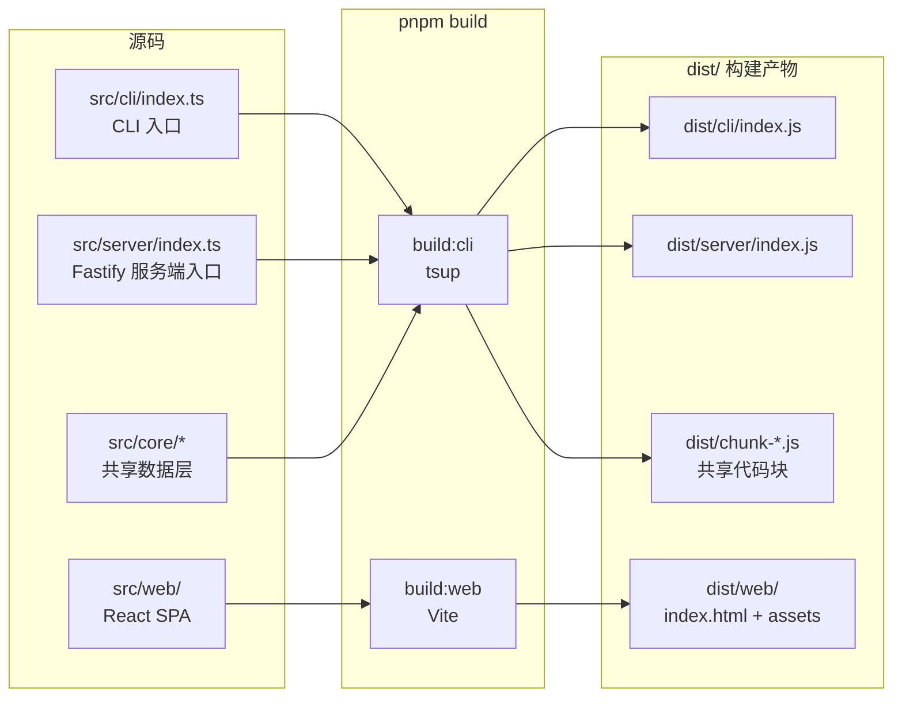
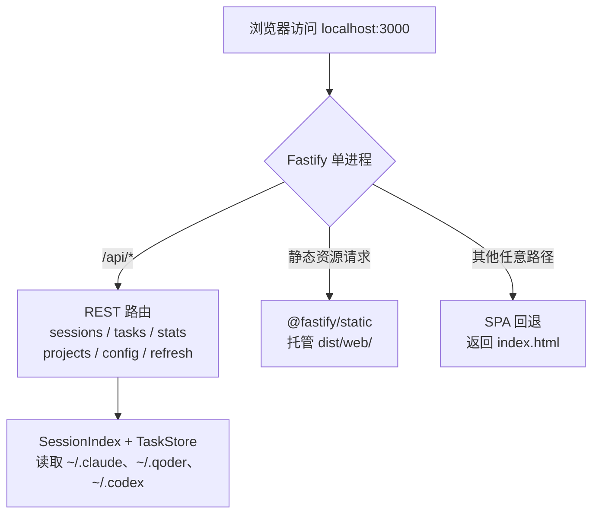

本页目标：带你从零完成 super-cli 的**安装、构建与首次运行**，最终在终端里跑通 `super-cli list`，并在浏览器里看到 Web 任务看板。super-cli 是一个 AI 编程助手 session 管理工具，它不自带数据库，而是直接读取 Claude Code、Qoder、Codex 三款 CLI 工具在本地产生的会话数据，因此"跑起来"只需三步：装依赖 → 构建 → 启动。

## 前置条件：三样东西缺一不可

在开始之前，请确认你的环境满足以下要求。**Node.js ≥ 22 是硬性约束**（项目按 `node22` 目标编译、且使用 ESM 模块系统），而"至少一款 AI CLI 工具"则决定了你首次运行时能否看到数据——super-cli 本身不生成会话，它只消费这些工具留下的 JSONL 文件。

| 依赖 | 最低要求 | 用途 | 缺失时的表现 |
|---|---|---|---|
| Node.js | ≥ 22.0.0 | 运行 CLI 与 Fastify 服务端 | `pnpm build` 编译目标不匹配、ESM 语法报错 |
| pnpm | 任意近期版本 | 安装依赖、执行 scripts | 无法运行 `pnpm install` / `pnpm build` |
| AI CLI 工具 | 任选其一（可多选） | 产生被管理的会话数据 | 程序正常运行，但列表/看板为空 |

第三个条件的数据来源分布在家目录下：Claude Code 写入 `~/.claude/projects/`、Qoder 写入 `~/.qoder/projects/`、Codex 写入 `~/.codex/sessions/`。如果你的机器上还没有任何一款工具的使用记录，建议先用 Claude Code 等工具打开一个项目跑几轮对话，再回来继续本教程。super-cli 自身的配置文件（如自定义的任务命名、标签）则存放在 `~/.super-cli/config.json`，会在首次写入时自动创建。

Sources: [package.json](package.json#L45-L47)
Sources: [paths.ts](src/core/paths.ts#L6-L40)
Sources: [README.md](README.md#L147-L156)

## 安装：两条路径，按需选择

super-cli 提供两种安装方式，适合不同人群。**普通使用者**直接从 npm 安装预构建产物，无需克隆仓库、无需理解构建流程；**开发者 / 想改代码的人**则克隆仓库后本地构建并全局链接。

| 对比维度 | 全局安装（推荐普通用户） | 本地开发安装 |
|---|---|---|
| 是否需要克隆仓库 | 否 | 是 |
| 是否需要构建 | 否（npm 包已含 dist） | 是（`pnpm build`） |
| 命令入口 | `super-cli` | `super-cli`（经 `pnpm link`） |
| 适合人群 | 日常使用者 | 贡献者、二次开发者 |
| 代码可修改 | 否 | 是 |

**路径 A：全局安装**，一条命令完成：

```bash
npm install -g @bluesky8318/super-cli
```

npm 包中发布的 `files` 字段明确只包含 `dist/cli`、`dist/server`、`dist/web` 等构建产物，全局安装后 `super-cli` 命令立即可用，可跳过下一节直接进入"首次运行 CLI"。

**路径 B：本地开发安装**，需要先克隆仓库，再走完"装依赖 → 构建 → 链接"三步：

```bash
git clone https://github.com/bluesky8318/super-cli.git
cd super-cli
pnpm install     # 安装依赖
pnpm build       # 构建 CLI/Server 与 Web 前端
pnpm link --global  # 将 super-cli 命令链接到全局 PATH
```

`pnpm link --global` 之所以能生效，是因为 package.json 中声明了 `"bin": { "super-cli": "./dist/cli/index.js" }`——即 `super-cli` 这个命令名指向构建产物中的 CLI 入口文件，而该文件首行带有 `#!/usr/bin/env node` shebang，可直接被操作系统执行。这也解释了为什么路径 B 中 `pnpm build` 不可跳过：链接指向的是 `dist/cli/index.js`，构建前该文件不存在。

Sources: [README.md](README.md#L45-L57)
Sources: [package.json](package.json#L6-L17)
Sources: [index.ts](src/cli/index.ts#L1-L2)

## 构建：一条命令背后的双流水线

如果你选择了路径 B（本地开发安装），`pnpm build` 是核心一步。它实际上串联了两条独立的构建流水线：

```json
"build": "pnpm build:cli && pnpm build:web"
```

- **`build:cli`** 调用 **tsup**，把 Node 端代码打包成 ESM 产物。入口有两个：`src/cli/index.ts`（CLI 命令行入口）和 `src/server/index.ts`（Fastify 服务端入口），开启代码分割（`splitting: true`）后，两入口共享的 `src/core/` 数据层代码会被抽成 `dist/chunk-*.js` 公共块。
- **`build:web`** 调用 **Vite**，把 `src/web/` 下的 React SPA 打包到 `dist/web/`，产物包含 `index.html` 与 `assets/` 静态资源目录。



两条流水线相互独立、有明确分工：tsup 负责一切跑在 Node.js 上的代码（命令解析、会话读取、HTTP 服务），Vite 只负责浏览器里跑的前端。构建完成后可以用下面的目录结构核对产物是否齐全：

```
dist/
├── chunk-*.js        # tsup 分割出的共享代码块（core 数据层）
├── cli/
│   └── index.js      # CLI 入口（bin 指向这里）
├── server/
│   └── index.js      # Fastify 服务端入口
└── web/
    ├── index.html    # SPA 入口页面
    └── assets/       # JS/CSS 静态资源
```

一个新手常见的疑问：为什么两条流水线不能合并？因为 Node 端与浏览器端的模块规范、依赖处理方式完全不同（例如 React 被 tsup 标记为 `external`，纯服务端产物根本不需要它）。这一话题的深入讨论见 [双构建流水线：tsup 打包 Node 端与 Vite 打包前端 SPA](23-shuang-gou-jian-liu-shui-xian-tsup-da-bao-node-duan-yu-vite-da-bao-qian-duan-spa)。

Sources: [package.json](package.json#L26-L36)
Sources: [tsup.config.ts](tsup.config.ts#L3-L17)
Sources: [vite.config.ts](src/web/vite.config.ts#L5-L11)

## 首次运行 CLI：五分钟验证安装成功

构建（或全局安装）完成后，打开一个**新的**终端窗口（确保 PATH 生效），执行第一条命令：

```bash
super-cli list
```

这条命令会扫描你机器上全部三个 provider 的本地数据目录，聚合出会话列表并按时间倒序展示，默认最多返回 20 条。首次执行时它会**现场建立内存索引**（无需预热、无缓存文件），如果输出了一张包含会话 ID、项目、时间的表格，说明安装与数据链路全部打通。

`list` 只是 8 个子命令中最常用的一个。完整的命令注册全景如下，你可以逐一尝试：

| 命令 | 作用 | 快速示例 |
|---|---|---|
| `list` | 列出会话（可按项目/时间/分支过滤） | `super-cli list --project /path/to/proj --since 2024-01-01` |
| `show <id>` | 查看会话详情（支持 ID 前缀匹配） | `super-cli show abc123 --messages` |
| `search` | 跨会话全文搜索 | `super-cli search "error handling" --max 20` |
| `name` | 给会话命名/打标签 | `super-cli name abc123 "重构认证模块" --tag backend` |
| `tasks` | 查看已命名的任务 | `super-cli tasks --tag backend` |
| `stats` | 使用统计（按模型/日期） | `super-cli stats --model --daily` |
| `config` | 查看/修改用户配置 | `super-cli config show` |
| `serve` | 启动 Web 看板（见下一节） | `super-cli serve --port 3000 --open` |

两个对新手最重要的全局约定：所有命令都支持 **`--json`** 参数输出结构化 JSON（便于脚本和 AI Agent 消费）；顶层 **`--provider`** 参数可把数据范围收窄到单一工具，例如 `super-cli --provider claude-code list` 只看 Claude Code 的会话。命令体系的设计细节（Commander.js 注册模式、`--json` 输出约定）在后续章节展开。

如果你选择了路径 B 且不想链接全局命令，也可以直接 `pnpm start`——它等价于 `node dist/cli/index.js`，用于验证构建产物可运行。

Sources: [index.ts](src/cli/index.ts#L14-L29)
Sources: [list.ts](src/cli/commands/list.ts#L6-L32)
Sources: [package.json](package.json#L33-L35)
Sources: [README.md](README.md#L59-L105)

## 首次运行 Web 看板：一条命令启动单进程全栈

Web 看板的启动入口同样在 CLI 中——`serve` 子命令会动态加载服务端模块，启动一个 Fastify 实例：

```bash
super-cli serve --port 3000 --open
```

| 参数 | 短写 | 默认值 | 说明 |
|---|---|---|---|
| `--port <n>` | `-p` | `3000` | 监听端口 |
| `--host <host>` | — | `0.0.0.0` | 绑定地址（局域网可访问） |
| `--open` | — | 关闭 | 启动后自动打开浏览器 |

看到绿色的 `Server running at http://localhost:3000` 提示即启动成功。此时浏览器中的页面之所以能工作，是因为这一个进程同时承担了三种角色：**REST API 服务**（`/api` 下的 sessions / tasks / stats 等路由）、**静态资源托管**（直接把 `dist/web` 目录交给 `@fastify/static`）、**SPA 回退**（任何未匹配路径都返回 `index.html`，保证前端路由刷新不 404）。



值得注意的一个防御性细节：服务端启动时会检查 `dist/web` 目录是否存在（`existsSync`）。若不存在——比如只跑了 `build:cli` 没跑 `build:web`——服务器仍会正常启动并提供 API，只是访问根路径看不到页面。这是排查"页面打不开但命令行 API 正常"时的第一检查点。首次打开看板后，你会看到左侧项目导航、看板/卡片/列表三种视图，点击会话卡片可展开对话详情——界面功能的逐层拆解见 Web 前端系列章节。

Sources: [serve.ts](src/cli/commands/serve.ts#L4-L24)
Sources: [index.ts](src/server/index.ts#L18-L48)
Sources: [README.md](README.md#L107-L120)

## 常见问题排查

首次运行遇到问题时，优先按下表定位。绝大多数"故障"其实源于数据源或构建产物缺失，而非程序本身：

| 症状 | 根因 | 解决方法 |
|---|---|---|
| `command not found: super-cli` | PATH 未刷新 / 未执行 `pnpm link --global` | 新开终端；确认 `pnpm link --global` 已执行且 `pnpm build` 已成功 |
| `list` 输出为空 | 本机没有任何 provider 的会话数据 | 先用 Claude Code / Qoder / Codex 产生几轮对话，数据落盘在 `~/.claude` 等目录 |
| `serve` 启动后浏览器 404 / 白屏 | `dist/web` 不存在（漏跑 `build:web`） | 补跑 `pnpm build:web`（或完整 `pnpm build`）后重启 serve |
| 构建时报 Node 版本错误 | Node < 22 | 升级 Node（`engines` 要求 `>=22.0.0`） |
| 端口 3000 被占用 | 其他进程占用 | `super-cli serve -p 3001` 换端口 |
| 只想看某个工具的数据 | 三个 provider 混在一起 | 加全局参数：`super-cli --provider qoder list` |

Sources: [package.json](package.json#L6-L8)
Sources: [index.ts](src/server/index.ts#L33-L44)

## 想改代码？开发模式一瞥

如果你不满足于使用，想阅读或修改源码，仓库提供了两条热重载通道：`pnpm dev` 用 tsup 的 watch 模式增量重编 Node 端代码，`pnpm dev:web` 启动 Vite 开发服务器并把 `/api` 请求代理到 `localhost:3000`——也就是说你需要**同时开两个终端**（一个跑 `pnpm dev` 或 `super-cli serve`，一个跑 `pnpm dev:web`）才能获得前后端联调的完整体验。开发工作流的完整说明（含 `test` / `typecheck`）不在本页展开，请移步 [开发环境与常用命令（pnpm dev / dev:web / test / typecheck / build）](3-kai-fa-huan-jing-yu-chang-yong-ming-ling-pnpm-dev-dev-web-test-typecheck-build)。

Sources: [package.json](package.json#L30-L32)
Sources: [vite.config.ts](src/web/vite.config.ts#L12-L16)

## 下一步阅读

至此你已经完成了"安装 → 构建 → CLI 首跑 → Web 看板首跑"的完整闭环。根据你的目标，推荐以下阅读路径：

- **想理解代码结构** → [仓库结构导览：cli / core / server / web 四层职责划分](4-cang-ku-jie-gou-dao-lan-cli-core-server-web-si-ceng-zhi-ze-hua-fen)
- **想搭建开发环境** → [开发环境与常用命令（pnpm dev / dev:web / test / typecheck / build）](3-kai-fa-huan-jing-yu-chang-yong-ming-ling-pnpm-dev-dev-web-test-typecheck-build)
- **想弄清数据从哪来** → [多 Provider 架构：Claude Code、Qoder、Codex 的注册表设计](5-duo-provider-jia-gou-claude-code-qoder-codex-de-zhu-ce-biao-she-ji) 与 [路径编码规则与各 CLI 数据目录布局（~/.claude、~/.qoder、~/.codex）](21-lu-jing-bian-ma-gui-ze-yu-ge-cli-shu-ju-mu-lu-bu-ju-claude-qoder-codex)
- **想集成到 Agent 工作流** → [Agent 友好的 --json 结构化输出约定与终端格式化输出](13-agent-you-hao-de-json-jie-gou-hua-shu-chu-yue-ding-yu-zhong-duan-ge-shi-hua-shu-chu)
- **想了解构建细节** → [双构建流水线：tsup 打包 Node 端与 Vite 打包前端 SPA](23-shuang-gou-jian-liu-shui-xian-tsup-da-bao-node-duan-yu-vite-da-bao-qian-duan-spa)