super-cli 的会话数据本质上是一组只读的 JSONL 历史文件——它能让用户"看到"过去发生了什么，但要真正"继续"一个会话，必须回到真实的终端窗口中运行真实的 CLI 工具。本文解析 `TerminalLauncher` 模块如何完成从 Web 看板的一次点击到本地终端窗口弹出、并自动执行 `claude --resume <id>` 这条链路，重点覆盖五种 macOS 终端（Ghostty、iTerm2、Terminal.app、Kitty、Warp）各自的启动机制差异、命令组装与多层转义策略，以及配置偏好如何持久化到 `~/.super-cli/config.json`。

## 问题域：为什么需要终端启动适配层

三个 AI CLI 工具（Claude Code、Qoder、Codex）的会话恢复命令各不相同：Claude Code 与 Qoder 使用 `--resume <id>` 旗标，而 Codex 使用 `resume <id>` 子命令形式。同时，每个用户的终端环境也各不相同——有人用原生 Terminal.app，有人用 Ghostty、iTerm2、Kitty 或 Warp，它们分别依赖完全不同的进程间通信机制（`open` 命令、AppleScript、URL Scheme）。**TerminalLauncher 的职责就是把这两个维度正交解耦**：命令内容由 Provider 注册表决定，终端投递方式由 `TerminalType` 决定，两者通过拼装一条 shell 命令字符串汇合。类型系统用一个联合类型锚定了支持的终端集合：`export type TerminalType = 'ghostty' | 'iterm2' | 'terminal' | 'kitty' | 'warp'`。

Sources: [types.ts](src/core/types.ts#L3)

## 整体架构：从点击到终端窗口

整条链路自上而下穿越四个层次。Web 前端发起 `POST /api/sessions/:id/resume`，服务端路由先通过 `SessionIndex.findSessionByPrefix` 解析出会话的完整元数据（包括 `cwd` 与 `provider`），再将这些上下文交给 `TerminalLauncher.resume()`。Launcher 内部依次完成：读取终端偏好配置 → 从 Provider 注册表取回恢复命令参数 → 拼装工作目录切换命令 → 按 `TerminalType` 分发到对应的启动机制。

```mermaid
flowchart TD
    A[Web 看板点击<br/>恢复会话按钮] --> B["POST /api/sessions/:id/resume"]
    B --> C[SessionIndex<br/>findSessionByPrefix]
    C --> D["cwd = session.cwd &#124;&#124; session.project"]
    D --> E[TerminalLauncher.resume]
    E --> F[ConfigManager.get 'terminal'<br/>读取 ~/.super-cli/config.json]
    F --> G[getProvider provider<br/>resumeArgs sessionId]
    G --> H[组装 fullCmd<br/>cd 'cwd' && cmd]
    H --> I{TerminalType 分发}
    I -->|ghostty| J["open -na Ghostty.app<br/>--args -e /bin/zsh -c"]
    I -->|iterm2| K["osascript<br/>create window + write text"]
    I -->|terminal| L["osascript<br/>do script"]
    I -->|kitty| M["kitty --single-instance<br/>/bin/zsh -c"]
    I -->|warp| N["activate + sleep 0.5<br/>warp://action/new-window"]
    J & K & L & M --> O[LaunchResult<br/>action: launched]
    N --> O
```

这张流程图揭示了模块间的清晰契约：`TerminalLauncher` 是唯一的进程生成出口，服务端两条路由（sessions 与 projects）各自持有独立实例并复用同一套逻辑；会话归属的工作目录优先取 JSONL 中记录的 `session.cwd`，缺失时回退到项目路径本身。`LaunchResult` 以 `action: 'focused' | 'launched' | 'error'` 三态表达结果，为"聚焦已存在窗口"的场景预留了语义位——当前实现返回 `launched` 或 `error`，而前端的 `focused` 分支处理已就位，属于接口契约先于实现扩展的典型做法。

Sources: [terminal-launcher.ts](src/core/terminal-launcher.ts#L7-L12), [sessions.ts](src/server/routes/sessions.ts#L96-L109)

## Provider 层：恢复命令的生成规则

命令内容的生成被完全封装在 Provider 注册表中。`ProviderConfig` 接口定义了四个关键字段：可执行命令名 `command`、新建会话参数 `newArgs`、以会话 ID 为入参的恢复参数函数 `resumeArgs`，以及用于探测安装状态的家目录 `homeDir`。`TerminalLauncher` 对此无感知——它只拿到最终的 `string[]`，用空格 join 成命令字符串。

| Provider | 可执行命令 | 新建参数 | 恢复命令 | homeDir 探测路径 |
|---|---|---|---|---|
| Claude Code | `claude` | `--dangerously-skip-permissions` | `--dangerously-skip-permissions --resume <id>` | `~/.claude` |
| Qoder | `qodercli` | `--dangerously-skip-permissions` | `--dangerously-skip-permissions --resume <id>` | `~/.qoder` |
| Codex | `codex` | （无） | `resume <id>`（子命令形式） | `~/.codex` |

值得注意的是两个细节差异：其一，Codex 的恢复语法是动词前置的子命令（`codex resume <id>`），与另外两者的 `--resume` 旗标形式形成异构性，这正是 `resumeArgs` 被设计为函数而非静态数组的原因；其二，`launchNew` 中对 `newArgs.length` 做了空数组判断——Codex 没有新建参数时直接裸启动 `codex`，避免拼出带尾随空格的命令。

Sources: [providers.ts](src/core/providers.ts#L6-L40), [terminal-launcher.ts](src/core/terminal-launcher.ts#L36-L54)

## 终端偏好：配置读取、校验与默认回退

`getTerminal()` 是偏好解析的唯一入口：从 `ConfigManager` 读取 `settings.terminal` 键，经 `isValidTerminal` 类型守卫校验后返回；任何未设置或非法的值（包括手写配置文件时的拼写错误）都静默回退到 `'terminal'`（即 Terminal.app）。这个防御性设计保证了 launcher 永远不会落入 switch 的未匹配分支——五个 case 覆盖了联合类型的全部成员，配合 TypeScript 的穷尽性检查，新增终端类型时编译器会强制补全 case。

配置底层由 `ConfigManager` 承载：`get`/`set` 直接操作 `~/.super-cli/config.json` 中 `settings` 对象的键值，`set` 时先递归创建 `~/.super-cli` 目录再原子化覆写整个 JSON。用户通过 CLI 即可切换终端偏好：`super-cli config set terminal kitty`（value 会先尝试 `JSON.parse`，字符串原样保留）。**这是一个纯文本配置驱动的策略选择点**——当前 Web 前端没有提供终端选择 UI，切换偏好必须走 CLI 命令。

Sources: [terminal-launcher.ts](src/core/terminal-launcher.ts#L71-L75), [terminal-launcher.ts](src/core/terminal-launcher.ts#L149-L151), [config.ts](src/core/config.ts#L21-L31), [paths.ts](src/core/paths.ts#L34-L39), [config.ts](src/cli/commands/config.ts#L29-L38)

## 五种终端的启动机制详解

`launchInTerminal` 的 switch 是整个模块的适配核心。五种终端依据各自的自动化接口分为三类机制：**`open` 命令派**（Ghostty）、**AppleScript 派**（iTerm2、Terminal.app）、**自有协议派**（Kitty 的远程实例复用、Warp 的 URL Scheme）。

### Ghostty：open -na + -e 执行

Ghostty 走最简洁的路径——macOS 的 `open` 命令携带 `-na Ghostty.app`（新建应用实例）和 `--args -e /bin/zsh -c <fullCmd>`，利用 Ghostty 原生的 `-e` 执行参数把命令交给 zsh。进程通过 `spawn` 以 `detached: true` + `stdio: 'ignore'` 启动后立即 `unref()`，与 super-cli 服务进程完全脱钩，服务重启不会影响已打开的终端。

Sources: [terminal-launcher.ts](src/core/terminal-launcher.ts#L99-L104)

### iTerm2：AppleScript 创建窗口并写入文本

iTerm2 的 AppleScript 应用名是 `"iTerm"` 而非产品全名 `"iTerm2"`（`getAppName` 同样返回 `'iTerm'`，这是 iTerm 历史命名的兼容约定）。脚本分三步：`activate` 前置聚焦 → `create window with default profile` 新建窗口 → 对 `current session of newWindow` 执行 `write text`，把转义后的命令作为键盘输入写入会话。注意这条路径用的是 `execSync` 同步阻塞执行——osascript 返回即代表窗口创建完成，语义上比异步 spawn 更确定，代价是短暂的请求延迟。

Sources: [terminal-launcher.ts](src/core/terminal-launcher.ts#L106-L115)

### Terminal.app：do script 单语句

原生 Terminal 的适配是最短的一条：两条 AppleScript——`activate` 加 `do script`。`do script` 与 iTerm2 的 `write text` 语义等价，都会在新窗口中执行命令字符串。同样采用 `execSync` 同步调用。

Sources: [terminal-launcher.ts](src/core/terminal-launcher.ts#L117-L121)

### Kitty：--single-instance 实例复用

Kitty 是五者中唯一通过终端自身的进程参数（而非系统级 API）完成集成的：外层 `zsh -c` 包裹 `kitty --single-instance /bin/zsh -c '<fullCmd>'`。`--single-instance` 是关键——若已有 Kitty 实例在运行，新命令会作为新窗口投递给现有实例，而非再起一个独立进程树。由于外层是单引号包裹的 shell 字符串，内层命令中的单引号需按 POSIX 惯例替换为 `'\''`。进程同样 `detached` + `unref`。

Sources: [terminal-launcher.ts](src/core/terminal-launcher.ts#L123-L128)

### Warp：AppleScript 激活 + URL Scheme 深链

Warp 不提供 AppleScript 命令执行字典，适配层于是组合了两步：先用 osascript 把 Warp 拉到前台（`tell process "Warp"` + `set frontmost to true`），再异步执行 `sleep 0.5 && open "warp://action/new-window?command=<encodeURIComponent(fullCmd)>"`。这里的 `sleep 0.5` 是一个**时序补偿**——等待 Warp 完成前台激活后再触发深链，避免深链在应用未就绪时丢失；命令则通过 `encodeURIComponent` 做 URL 编码嵌入 `warp://` 协议，这也是五条路径中唯一使用 URL 编码而非 shell/AppleScript 转义的分支。

Sources: [terminal-launcher.ts](src/core/terminal-launcher.ts#L130-L140)

### 机制对比总览

| 终端 | 启动机制 | 进程模型 | 编码/转义策略 | 窗口语义 |
|---|---|---|---|---|
| Ghostty | `open -na ... -e` | detached spawn + unref | argv 数组直传（无转义） | 每次新实例窗口 |
| iTerm2 | AppleScript `write text` | execSync 同步 | AppleScript 字符串转义（`\` 与 `"` 加倍） | 默认 profile 新窗口 |
| Terminal.app | AppleScript `do script` | execSync 同步 | 同上 | 新窗口 |
| Kitty | `kitty --single-instance` | detached spawn + unref | POSIX 单引号转义（`'\''`） | 复用已有实例 |
| Warp | activate + `warp://` 深链 | execSync + detached spawn（延迟 0.5s） | `encodeURIComponent` URL 编码 | 新窗口 |

Sources: [terminal-launcher.ts](src/core/terminal-launcher.ts#L98-L142)

## 命令组装与三层转义链

在进入终端分支之前，`fullCmd` 的组装遵循三分支规则：同时有 `cwd` 与 `cmd` 时拼接 `cd '<cwd>' && <cmd>`；只有 `cwd` 时（`openDirectory` 场景）拼接 `cd '<cwd>' && exec zsh` 以留在交互式 shell；只有 `cmd` 时直接使用。**`exec zsh` 保证用户得到的是一个可交互的终端而非执行完即退出的瞬时窗口**。路径通过 `shellEscape` 处理——包裹单引号并把内嵌单引号替换为 `'\''`，这是 POSIX shell 下最稳妥的字面量保护。

进入各分支后还存在第二层转义：AppleScript 路径（iTerm2 与 Terminal.app）需要把 `fullCmd` 嵌入 osascript 的双引号字符串，`asEscaped` 将反斜杠加倍、双引号前置反斜杠；Kitty 路径则需要针对外层单引号上下文做 `'\''` 替换。同一条命令字符串在不同终端分支中经历不同的编码语境，这正是适配层的复杂度所在——理解这一点后，五条 switch 分支不再是并列的样板代码，而是同一逻辑命令在五种编码空间中的投影。

Sources: [terminal-launcher.ts](src/core/terminal-launcher.ts#L87-L96), [terminal-launcher.ts](src/core/terminal-launcher.ts#L144-L146)

## 三个入口动作与服务端消费

`TerminalLauncher` 对外暴露三个语义化入口，全部返回统一的 `LaunchResult`：

| 入口 | 语义 | cwd 校验 | 命令来源 |
|---|---|---|---|
| `resume(sessionId, cwd?, provider)` | 恢复既有会话 | `existsSync` 通过才使用，否则 undefined | `providerConfig.resumeArgs(sessionId)` |
| `launchNew(cwd, provider)` | 在项目中新建会话 | 不存在直接返回 error | `newArgs` 或裸 `command` |
| `openDirectory(cwd)` | 仅在目录中打开 shell | 不存在直接返回 error | 空命令（`exec zsh` 分支） |

服务端有两个消费方：`POST /api/sessions/:id/resume` 与 `POST /api/sessions/new` 挂在 sessions 路由组，`POST /api/projects/:encoded/open-terminal` 挂在 projects 路由组。resume 端点有一个值得注意的取值策略——`const cwd = session.cwd || session.project`：优先复用会话记录中的真实工作目录，保证恢复后的终端与原会话处于同一代码现场；`launchNew` 端点则接受请求体中的 `project` 路径与可选 `provider`（默认 `claude-code`）。

Sources: [terminal-launcher.ts](src/core/terminal-launcher.ts#L21-L69), [sessions.ts](src/server/routes/sessions.ts#L96-L122), [projects.ts](src/server/routes/projects.ts#L109-L125)

## 前端反馈闭环

Web 端的 `resumeInTerminal` 是异步调用加瞬时状态反馈的轻量实现：请求期间按钮置为 `launching` 禁用态，成功后按 `LaunchResult.action` 三分支展示文案（`focused` → "已切换到运行中的窗口"、`launched` → "已在 {terminal} 中打开"、`error` → 错误消息），3 秒后自动清除状态。项目详情页与右键菜单则通过 `openProjectInTerminal` 直连 open-terminal 端点，按钮统一使用 `IconTerminal` 图标。前端不做任何终端类型判断——**终端适配的复杂度被完整封装在服务端，前端只消费结果对象**，这保持了 SPA 与本地集成逻辑的清晰边界。

Sources: [App.tsx](src/web/src/App.tsx#L282-L297), [client.ts](src/web/src/api/client.ts#L68-L80), [App.tsx](src/web/src/App.tsx#L836-L837)

## 设计权衡与边界

这套实现的几个结构性选择值得高级读者留意。`detached + unref` 组合让终端进程的生命周期与 Fastify 服务进程彻底解耦，看板重启不影响工作中的会话，但也意味着**没有任何进程句柄可用于后续追踪**——`LaunchResult` 中的可选 `pid` 字段目前未被填充。`execSync` 与异步 spawn 的混用是按终端自动化接口的确定性做的取舍：AppleScript 返回即可确认窗口已创建，而 `open` 与深链机制只能 fire-and-forget。整个 switch 中不存在 Linux/Windows 分支，`TerminalType` 与 AppleScript 的使用明确将此模块定位为 **macOS 专属集成层**。最后，恢复命令中出现的 `--dangerously-skip-permissions` 是 Provider 配置的产品级决策——跳过权限确认以保证无人值守恢复的流畅性，使用者应意识到这同时放宽了 CLI 工具的交互式安全闸门。

Sources: [terminal-launcher.ts](src/core/terminal-launcher.ts#L7-L12), [terminal-launcher.ts](src/core/terminal-launcher.ts#L96-L141), [providers.ts](src/core/providers.ts#L15-L31)

## 延伸阅读

- 终端恢复依赖的会话 ID 与 cwd 从何而来，见 [JSONL 会话文件流式解析与元数据提取（readline + AsyncGenerator）](6-jsonl-hui-hua-wen-jian-liu-shi-jie-xi-yu-yuan-shu-ju-ti-qu-readline-asyncgenerator)
- 三种 CLI 恢复语法的异构性根源与注册表全貌，见 [多 Provider 架构：Claude Code、Qoder、Codex 的注册表设计](5-duo-provider-jia-gou-claude-code-qoder-codex-de-zhu-ce-biao-she-ji)
- `~/.super-cli/config.json` 的完整结构与标签持久化机制，见 [TaskStore 标签持久化与用户配置存储（~/.super-cli/config.json）](11-taskstore-biao-qian-chi-jiu-hua-yu-yong-hu-pei-zhi-cun-chu-super-cli-config-json)
- resume 端点所在的完整 API 面，见 [Fastify 5 REST API 参考：sessions / tasks / stats / projects / config / refresh](14-fastify-5-rest-api-can-kao-sessions-tasks-stats-projects-config-refresh)