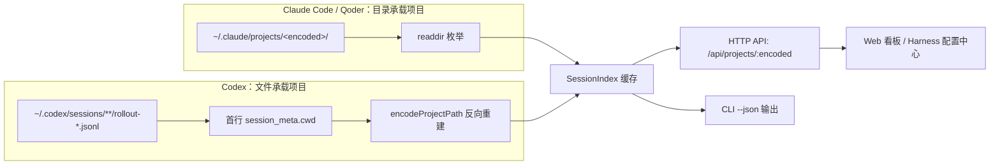

super-cli 要管理三个不同 AI 编程助手（Claude Code、Qoder、Codex CLI）的会话数据，第一步就是回答同一个问题：**这些工具把"某个项目目录下的会话"存到了磁盘的哪个位置？** 本页解释这套磁盘布局的统一抽象——**路径编码（path encoding）**——以及三个 Provider 各自的真实目录结构。理解这一层，是理解 [多 Provider 架构](5-duo-provider-jia-gou-claude-code-qoder-codex-de-zhu-ce-biao-she-ji) 和 [SessionIndex 索引](8-sessionindex-quan-liang-nei-cun-suo-yin-yu-ttl-huan-cun-ce-lue) 的地基。

## 为什么需要"路径编码"

每个 AI CLI 都按"项目"组织会话：你在 `/Users/alice/work/zeronote/scm/github/super-cli` 里启动的会话，会被归到这个项目名下。但绝对路径里含有 `/` 字符，而 `/` 是文件系统的路径分隔符，**不能出现在目录名中**。于是各家 CLI 不约而同地采用了同一种朴素策略：把路径中的分隔符替换成普通字符，生成一个"编码后的目录名"（encoded path）。

super-cli 在 `paths.ts` 中用两个互逆的函数封装了这条规则：`encodeProjectPath` 把所有 `/` 替换为 `-`；`decodeProjectPath` 则做反向替换——仅当输入以 `-` 开头时才执行（防御性判断：不以 `-` 开头的输入被视为已经是解码后的路径，原样返回），替换后再确保结果以 `/` 开头。

| 原始项目路径 | 编码后目录名 |
|---|---|
| `/Users/alice/work/zeronote/scm/github/super-cli` | `-Users-alice-work-zeronote-scm-github-super-cli` |
| `/Users/alice/Documents/my-app` | `-Users-alice-Documents-my-app` |
| `/Users/alice/.agents` | `-Users-alice--agents`（注意双横线） |

Sources: [paths.ts](src/core/paths.ts#L42-L49)

第三行示例暴露了这条规则的一个关键特性：**编码是有损的**——多个不同字符（`/`、`.` 等）都可能被压成同一个 `-`。下一节会看到源码如何补救。

## 三个 Provider 的 Home 目录：一处注册，处处引用

super-cli 不在各处硬编码 `~/.claude` 这类路径，而是在 `providers.ts` 的注册表中为每个 Provider 声明 `homeDir`，再由 `paths.ts` 的一组小函数按需拼接出所有子路径。这样上层代码只依赖 `getCliHome()` / `getProjectsDir()` 这类语义化 API，与具体目录名解耦。

| Provider | Home 目录 | projects 目录 | sessions 目录 |
|---|---|---|---|
| Claude Code | `~/.claude` | `~/.claude/projects` | `~/.claude/sessions` |
| Qoder | `~/.qoder` | `~/.qoder/projects` | `~/.qoder/sessions` |
| Codex | `~/.codex` | （不存在此概念） | `~/.codex/sessions` |

```typescript
// providers.ts 中的注册表（节选）
{ id: 'claude-code', ..., homeDir: join(homedir(), '.claude') },
{ id: 'qoder',       ..., homeDir: join(homedir(), '.qoder') },
{ id: 'codex',       ..., homeDir: join(homedir(), '.codex') },
```

Sources: [providers.ts](src/core/providers.ts#L15-L40), [paths.ts](src/core/paths.ts#L6-L20)

`getAvailableProviders()` 还利用 `homeDir` 做存在性检测（`existsSync`），只把用户机器上真实安装过的 CLI 纳入扫描——所以即使你没装 Codex，super-cli 也能正常工作。

Sources: [providers.ts](src/core/providers.ts#L46-L58)

## 三棵目录树：两种布局范式

在真实机器上（本机实测），三家的目录结构呈现两种截然不同的范式。Claude Code 与 Qoder **完全同构**——都是"项目目录 → 会话文件"的两层结构；Codex 则是"按时间分层 + 文件名承载元数据"的扁平结构。

```text
~/.claude/                              ~/.qoder/          （与 ~/.claude 同构）
├── projects/                           ├── projects/
│   ├── -Users-alice-work-...-super-cli/ │   ├── -Users-alice-...（编码目录名）
│   │   ├── <uuid-1>.jsonl             │   │   └── <uuid>.jsonl
│   │   └── <uuid-2>.jsonl             │   └── ...
│   └── -Users-alice--agents/           └── （无 sessions/ 与 history.jsonl）
├── sessions/                           ~/.codex/
│   └── <pid>.<hash>.json    ← 活动会话 ├── sessions/
├── history.jsonl                        │   └── .../rollout-<时间戳>-<id>.jsonl
└── stats-cache.json                     └── config.toml
```

SessionReader（同时服务 Claude Code 与 Qoder）的枚举逻辑印证了同构性：`listProjects()` 直接 `readdir` projects 目录并过滤子目录，`listProjectSessions()` 则列出该编码目录下所有 `.jsonl` 文件、去掉扩展名即得 sessionId。三层信息全部由**目录结构本身**承载，一次目录枚举即可完成，无需读取文件内容。

Sources: [session-reader.ts](src/core/session-reader.ts#L15-L37), [README.md](README.md#L153-L155)

值得注意的是 `~/.claude/sessions/` 下的活动会话文件（形如 `70459.c13cb...json`，PID + 哈希命名）：`readActiveSessions()` 读取这些 JSON 来判断"哪些会话当前正在运行"。本机实测 Qoder 并没有 `sessions/` 与 `history.jsonl` 目录——这不会报错，因为读取逻辑被 `try/catch` 包裹，缺失时安静地返回空数组。

Sources: [session-reader.ts](src/core/session-reader.ts#L122-L137), [paths.ts](src/core/paths.ts#L26-L28)

## Codex 的反转设计：从文件反推项目

Codex 打破了上述两层结构。它的会话文件是 `rollout-<时间戳>-<id>.jsonl`，散落在 `~/.codex/sessions/` 下**任意深度的子目录**中，**目录名与项目无关**。CodexReader 因此采用完全相反的推导方向：

1. **递归遍历** `~/.codex/sessions/`，收集所有 `.jsonl` 文件（`walk` 函数深度优先递归）；
2. **文件名正则** `rollout-[\dT-]+-(.+)\.jsonl$` 从文件名中剥掉时间戳前缀，捕获出 sessionId；
3. **读取每个文件的首行** JSON（`type: "session_meta"`），取出其中的 `cwd` 字段——这才是项目的真实路径；
4. 对 `cwd` 调用 `encodeProjectPath()`，**反向重建**出编码目录名，从而把 Codex 会话"装"进与另外两家相同的抽象模型里。

```typescript
// codex-reader.ts：从文件名提取 sessionId，从首行 cwd 重建项目归属
const match = filename.match(/rollout-[\dT-]+-(.+)\.jsonl$/);
...
if (first?.type === 'session_meta' && first.payload?.cwd) {
  const encoded = encodeProjectPath(first.payload.cwd);
```

代价是明显的：Claude Code 列出项目只需一次 `readdir`，而 Codex 列出项目必须**读取每个文件的第一行**才能知道它属于哪个项目。这是为异构数据源适配付出的必要成本，详见 [Codex 读取器](7-codex-du-qu-qi-yi-gou-shu-ju-yuan-gua-pei-yu-xiao-xi-ge-shi-fan-yi-ceng)。

Sources: [codex-reader.ts](src/core/codex-reader.ts#L25-L52), [codex-reader.ts](src/core/codex-reader.ts#L75-L107)

## 有损解码的陷阱与补救：cwd 字段覆盖

回看前文的 `-Users-alice--agents`：真实路径是 `/Users/alice/.agents`，但 `decodeProjectPath` 会把它解码成 `/Users/alice//agents`——因为 CLI 官方编码时把 `.` 也压成了 `-`，而 super-cli 的解码函数无法区分。**解码结果可能不精确，这是一个已知且被主动接受的有损设计。**

补救方案藏在 `readSessionMetadata()` 的最后一行：会话 JSONL 文件内部的每条消息自带 `cwd` 字段（记录消息发生时的真实工作目录），当它存在时，会**直接覆盖**由目录名解码出来的 `project`：

```typescript
if (metadata.cwd) metadata.project = metadata.cwd;  // 用文件内的真实路径纠正有损解码
```

因此系统中的 `project` 字段遵循"双通道"策略：目录名解码提供**快速初值**，文件内 `cwd` 提供**精确终值**。

Sources: [session-reader.ts](src/core/session-reader.ts#L62-L120)

## 编码贯穿全链路：从磁盘目录名到 URL 参数

路径编码不仅是一个磁盘细节，它升格成了整个系统的**通用项目标识符**。SessionIndex 构建索引时，为每个 Provider 选择对应 Reader（codex → CodexReader，其余 → SessionReader），再统一以 `projectEncoded` 作为 Map 的 key 聚合项目信息。

下面的概念图展示了编码在数据流中的三个关键位置（阅读提示：Mermaid 流程图，箭头表示数据流动方向，虚线分组表示三种布局范式）：



在 HTTP 服务层，编码目录名直接成为路由参数：`GET /api/projects/:encoded/detail`、`POST /api/projects/:encoded/archive` 等——URL 中你看到的 `-Users-alice-work-...-super-cli`，就是磁盘上那个目录名本身，一路未加转换。

Sources: [session-index.ts](src/core/session-index.ts#L54-L64), [server/routes/projects.ts](src/server/routes/projects.ts#L56-L87)

## 布局差异速查表

| 维度 | Claude Code | Qoder | Codex |
|---|---|---|---|
| Home 目录 | `~/.claude` | `~/.qoder` | `~/.codex` |
| 项目→目录映射 | `projects/<编码路径>/` | `projects/<编码路径>/` | 无目录映射，靠首行 `cwd` |
| 会话文件命名 | `<uuid>.jsonl` | `<uuid>.jsonl` | `rollout-<时间戳>-<id>.jsonl` |
| 列出项目的成本 | 一次 `readdir` | 一次 `readdir` | 读每个文件首行 |
| 活动会话 | `sessions/<pid>.<hash>.json` | 本机未观测到该目录 | 不支持（返回空数组） |
| Reader 实现 | SessionReader | SessionReader（复用） | CodexReader（专用） |

Sources: [session-reader.ts](src/core/session-reader.ts#L8-L37), [codex-reader.ts](src/core/codex-reader.ts#L263-L269), [providers.ts](src/core/providers.ts#L15-L40)

顺带一提，super-cli 自己也有第四个数据目录 `~/.super-cli/`（存放 `config.json` 等用户配置与标签数据），由 `getSuperCliHome()` 提供，与三家 CLI 的目录互不干扰——其内部机制详见 [TaskStore 标签持久化](11-taskstore-biao-qian-chi-jiu-hua-yu-yong-hu-pei-zhi-cun-chu-super-cli-config-json)。

Sources: [paths.ts](src/core/paths.ts#L34-L40)

## 小结与延伸阅读

**路径编码是 super-cli 统一三家的粘合剂**：它把"磁盘目录名"这一各家 CLI 的实现细节，转化为系统通用的项目主键。要记住三件事：① `/` 与 `-` 的互逆替换构成编码核心；② 解码是有损的，真实路径以 JSONL 内 `cwd` 字段为准；③ Claude Code 与 Qoder 布局同构、Codex 靠首行元数据反向重建。

继续深入，推荐按以下顺序阅读：

- [多 Provider 架构：Claude Code、Qoder、Codex 的注册表设计](5-duo-provider-jia-gou-claude-code-qoder-codex-de-zhu-ce-biao-she-ji) —— 本页 `homeDir` 声明所在的完整注册表
- [Codex 读取器：异构数据源适配与消息格式翻译层](7-codex-du-qu-qi-yi-gou-shu-ju-yuan-gua-pei-yu-xiao-xi-ge-shi-fan-yi-ceng) —— 反向重建策略的消息翻译细节
- [SessionIndex 全量内存索引与 TTL 缓存策略](8-sessionindex-quan-liang-nei-cun-suo-yin-yu-ttl-huan-cun-ce-lue) —— 编码 key 如何驱动全量索引
- [项目文件浏览器：目录扫描、路径穿越防护与 Prism.js 语法高亮](18-xiang-mu-wen-jian-liu-lan-qi-mu-lu-sao-miao-lu-jing-chuan-yue-fang-hu-yu-prism-js-yu-fa-gao-liang) —— 编码路径用作 URL 参数时必须警惕的路径穿越风险