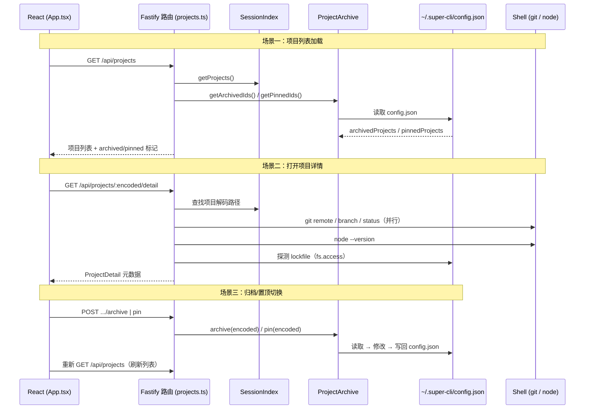
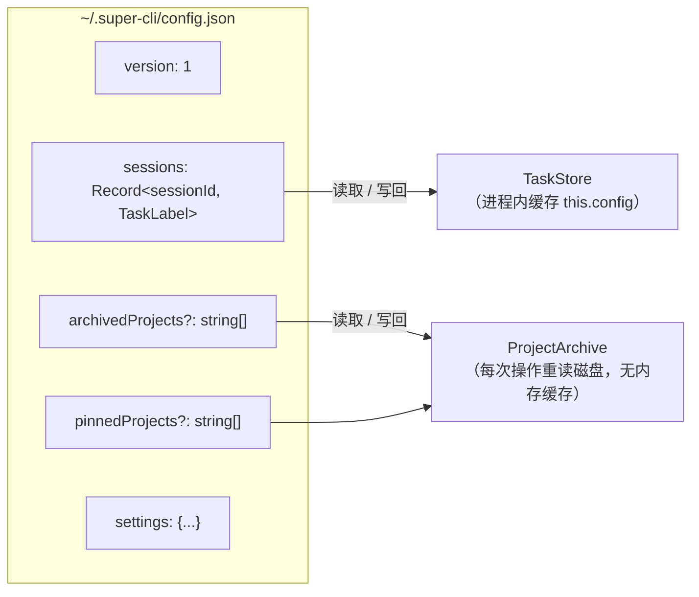

super-cli 的项目视图由两条正交的机制支撑：一条是**无状态的元数据采集管线**——在用户打开项目详情时实时探测磁盘上项目的 Git 状态、Node 版本与包管理器；另一条是**有状态的持久化标记**——将归档与置顶标记写入用户级配置文件 `~/.super-cli/config.json`，让跨 CLI Provider 的项目列表可以由用户主动组织。本文剖析这两条机制的核心实现（`src/core/project-info.ts` 与 `src/core/project-archive.ts`）、它们在 Fastify 路由层的组装方式，以及 React 前端的消费模式，面向熟悉 Node.js 异步编程的中级开发者。

## 设计定位：实时探测与持久标记的职责分离

在深入实现细节之前，先从第一性原理理解为什么这两条机制是分开的。元数据采集本质上是**对宿主环境的即时询问**——Git 分支会变、工作区会有未提交修改、Node 版本取决于当前 shell 环境，这些信息没有持久化价值，每次查看都应重新采集；而归档与置顶是**用户意图的表达**——"我不再关心这个项目"和"我要把这个项目放在最显眼的位置"，这类意图必须跨进程、跨重启地存续。因此在代码层面，前者表现为一个无状态的纯函数 `getProjectDetail`（每次调用都执行外部命令），后者表现为一个有状态的服务类 `ProjectArchive`（每次调用都读写磁盘上的 JSON 文件）。这一分离也决定了二者的性能特征：元数据探测有 5 秒超时上限且只在详情请求时触发，而归档/置顶操作是毫秒级的本地文件读写。

两条机制的消费方完全一致——均由 HTTP 服务层的 projects 路由统一组装，CLI 命令层（`src/cli/commands/`）不直接使用这两个模块，元数据与项目组织能力目前仅通过 Web 看板暴露。

Sources: [project-info.ts](src/core/project-info.ts#L10-L30) · [project-archive.ts](src/core/project-archive.ts#L5-L10) · [projects.ts](src/server/routes/projects.ts#L7-L8)

## 整体架构与数据流

下面的时序图展示了从用户在 Web 看板中的交互，到磁盘探测与配置持久化的完整链路。理解这条链路的关键在于：**列表接口与详情接口是两个独立的懒加载层次**——项目列表（含归档/置顶标记）在页面加载时获取，而 Git/Node 等元数据只在用户显式打开详情浮层时才触发探测。



项目身份的唯一标识是**编码后的路径字符串**（如 `-Users-alice-work-project`，由 `/` 替换为 `-` 得到），归档与置顶列表均以该编码字符串作为成员。这一编码规则的细节属于[路径编码与数据目录布局](21-lu-jing-bian-ma-gui-ze-yu-ge-cli-shu-ju-mu-lu-bu-ju-claude-qoder-codex)页面的范畴，此处只需知道：前端发起归档/置顶请求时传递的是 encoded 值，服务端原样存入配置。

Sources: [projects.ts](src/server/routes/projects.ts#L40-L90) · [paths.ts](src/core/paths.ts#L38-L49)

## 元数据采集：getProjectDetail 的探测管线

`getProjectDetail` 是一个约 20 行有效代码的探测函数，其设计哲学是**完全的 fail-soft（柔性失败）**：任何一步探测失败都返回 `undefined`，绝不抛出异常，前端据此条件性地隐藏对应字段。函数首先用 `fs.stat` 验证解码后的磁盘路径是否存在——如果项目目录已被删除（例如临时仓库或已迁移的代码），立即返回仅含 `pathExists: false` 的最小结果，跳过所有后续探测，避免对不存在目录执行外部命令。

| 探测项 | 实现方式 | 命令 / 检测目标 | 失败时行为 |
|---|---|---|---|
| `pathExists` | `fs.stat` | 目录是否存在 | 返回 `false`，短路后续探测 |
| `gitRemoteUrl` | `execFile('git', [...])` | `git remote get-url origin` | `undefined`（非 Git 仓库或无 origin） |
| `gitBranch` | `execFile('git', [...])` | `git branch --show-current` | `undefined`（detached HEAD） |
| `gitStatus` | `execFile('git', [...])` | `git status --short` | `undefined`；空输出保留为空串（表示 clean） |
| `nodeVersion` | `execFile('node', [...])` | `node --version` | `undefined`（PATH 中无 node） |
| `packageManager` | `fs.access` | 依序探测四种 lockfile | `undefined`（无任何 lockfile） |

三个外部命令调用共享统一的 `runGit` / `runCmd` 封装：通过 `promisify(execFile)` 执行子进程，**参数以数组形式传递而非拼接 shell 字符串**，从机制上杜绝了路径注入导致的 shell 命令执行风险；每个调用都设置 `timeout: 5000` 毫秒，防止挂起的 Git 钩子或网络文件系统（如 NFS 挂载的仓库）阻塞 API 响应。捕获所有异常并归一化为 `undefined`，同时用 `trim()` 去除命令输出的换行符。

包管理器检测走的是完全不同的路径——不执行任何外部命令，而是**按优先级顺序探测 lockfile 的存在性**。优先级顺序值得注意：`pnpm-lock.yaml` → `yarn.lock` → `bun.lockb` → `package-lock.json`。如果一个目录同时存在多个 lockfile（混合使用包管理器的项目常见），`pnpm` 将胜出。该顺序是硬编码的，没有配置项可以覆盖。

```ts
// 检测优先级：先命中先返回
const lockfiles: [string, string][] = [
  ['pnpm-lock.yaml', 'pnpm'],
  ['yarn.lock', 'yarn'],
  ['bun.lockb', 'bun'],
  ['package-lock.json', 'npm'],
];
```

探测结果通过 `Omit<ProjectDetail, ...>` 类型约束与列表层数据组装：函数自身不返回 `encoded`/`decoded`/`sessionCount`/`lastTimestamp` 这四个字段，它们由路由层从 `SessionIndex` 的项目汇总中补齐，形成完整的 `ProjectDetail` 响应。

Sources: [project-info.ts](src/core/project-info.ts#L10-L67) · [types.ts](src/core/types.ts#L159-L171)

## 归档与置顶：ProjectArchive 的持久化模型

`ProjectArchive` 是一个无框架依赖的轻量服务类，管理 `~/.super-cli/config.json` 中两个可选的字符串数组字段。它的读写模型是教科书式的 **read-modify-write**：每次操作先 `readFile` + `JSON.parse` 加载完整配置（文件不存在或解析失败时返回含默认骨架的空配置），在内存中修改目标数组，再序列化写回。写入前通过 `mkdir(getSuperCliHome(), { recursive: true })` 确保目录存在，保证首次使用时自动创建 `~/.super-cli`。



配置文件的结构由 `AppConfig` 接口定义，其中 `archivedProjects` 与 `pinnedProjects` 均为**可选字段**——旧版本配置文件没有这两个字段时，读取方法以 `?? []` 兜底，写入方法在首次修改时才创建数组。这一可选性设计使配置格式可以平滑演进。归档与置顶两组操作是**完全对称的镜像 API**：

| 方法 | 归档侧 | 置顶侧 | 语义 |
|---|---|---|---|
| 查询全部 | `getArchivedIds()` | `getPinnedIds()` | 返回完整 ID 列表 |
| 查询单个 | `isArchived(encoded)` | — | 线性查找包含性 |
| 添加 | `archive(encoded)` | `pin(encoded)` | **幂等**：已存在则跳过写入 |
| 移除 | `unarchive(encoded)` | `unpin(encoded)` | `filter` 过滤后无条件写回 |

两个值得注意的实现细节：其一，`archive` 与 `pin` 均先检查 `list.includes(encoded)` 再决定是否写盘，保证重复调用不产生副作用（幂等性）；而 `unarchive` / `unpin` 无论目标是否存在都会执行一次写回，代价是多一次无害的磁盘写入。其二，构造函数接受可选的 `configPath` 参数用于依赖注入，为单元测试提供了在不触碰真实 HOME 目录的前提下替换配置文件路径的钩子（构造函数注入模式，与 `TaskStore` 一致）。

与 [TaskStore 标签持久化](11-taskstore-biao-qian-chi-jiu-hua-yu-yong-hu-pei-zhi-cun-chu-super-cli-config-json)的关键差异在于**缓存策略**：`TaskStore` 在首次 `load()` 后将配置缓存在 `this.config` 字段中（进程生命周期内不再重读磁盘），而 `ProjectArchive` 的 `load()` **每次都重新读盘、不持有缓存**。在单进程的 Fastify 服务中，两个实例各自持有独立的内存态——这意味着若 `TaskStore` 已缓存配置、随后 `ProjectArchive` 写入了新的置顶记录，`TaskStore` 下一次写回时其内存中的旧快照不包含该记录，存在**陈旧写覆盖**的时序窗口。当前代码对此无锁保护（无文件锁、无原子读改写），这是单进程部署模型下以简化换取的权衡，并发安全性依赖于"所有写入都经由同一进程内的串行事件循环"这一事实。

Sources: [project-archive.ts](src/core/project-archive.ts#L1-L75) · [types.ts](src/core/types.ts#L104-L114) · [task-store.ts](src/core/task-store.ts#L19-L35) · [server/index.ts](src/server/index.ts#L23-L27) · [paths.ts](src/core/paths.ts#L34-L40)

## HTTP API 层：标记增强与详情组装

projects 路由将两个核心模块粘合为五个 REST 端点。列表端点 `GET /api/projects` 展示了一个干净的**数据增强模式**：用 `Promise.all` 并行获取三份相互独立的数据——会话索引的项目汇总（`index.getProjects()`，可带 provider 过滤）、归档 ID 列表、置顶 ID 列表——然后用 `Array.prototype.includes` 为每个项目附加 `archived` 与 `pinned` 布尔标记后返回。由于归档/置顶列表通常只有几十个条目，这里选择朴素的 `includes` 线性查找而非构建 `Set`，是可读性优先的合理选择。

| 端点 | 方法 | 语义 | 幂等性 |
|---|---|---|---|
| `/api/projects` | GET | 项目列表 + archived/pinned 标记增强 | 是 |
| `/api/projects/:encoded/detail` | GET | 汇总数据 ⊕ 实时元数据探测 | 是 |
| `/api/projects/:encoded/archive` | POST | 追加到 archivedProjects | 是（内部去重） |
| `/api/projects/:encoded/unarchive` | POST | 从 archivedProjects 移除 | 是 |
| `/api/projects/:encoded/pin` | POST | 追加到 pinnedProjects | 是（内部去重） |
| `/api/projects/:encoded/unpin` | POST | 从 pinnedProjects 移除 | 是 |

详情端点 `GET /api/projects/:encoded/detail` 的组装分两步：先从会话索引中按 `encoded` 查找项目（未命中返回 404），再以项目的**解码路径**为入参调用 `getProjectDetail` 执行磁盘探测，最后用对象展开（`{ ...project, ...detail }`）将汇总字段与探测字段合并。注意这里没有做缓存——每次打开详情浮层都会重新执行全部探测命令，这是"元数据必须新鲜"这一设计决策的直接体现。

Sources: [projects.ts](src/server/routes/projects.ts#L40-L90) · [session-index.ts](src/core/session-index.ts#L163-L191)

## 前端消费：三段式侧栏、右键菜单与详情浮层

React 前端对归档/置顶标记的消费集中在 `App.tsx` 的侧栏项目列表中，采用**三段式分区渲染**，每段通过两次 `filter` 组合定义成员资格：

| 分区 | 过滤条件 | 默认状态 | 排序依据 |
|---|---|---|---|
| 置顶区 | `pinned && !archived` | 有成员即显示，无需展开 | `lastTimestamp` 降序 或 `sessionCount` 降序 |
| 全部区 | `!pinned && !archived` | 始终显示 | 同上（用户可切换 🕐/#） |
| 归档区 | `archived`（含置顶且归档的项目） | **默认折叠**，点击 ▶ 展开 | 同上 |

注意置顶与归档的**优先级语义**：一个同时被置顶和归档的项目只会出现在归档区（置顶区条件显式排除了 `archived`），即"归档压过置顶"。排序函数 `getSortedProjects` 按当前排序模式（时间/数量）对全量项目排序后，再交由三个分区分别过滤——排序逻辑与分区逻辑解耦。

用户交互有两条入口。第一条是**右键上下文菜单**：在任意项目条目上右键（或点击 `···` 按钮）弹出菜单，其中的置顶/归档项根据 `contextMenu` 状态中记录的当前标记做**条件渲染**——已置顶显示"取消置顶"，未置顶显示"置顶"，归档同理。第二条是**详情浮层的操作区**，提供同样的四组按钮。所有变更操作遵循统一的**变更-重取模式**：调用 API 完成写入后，立即重新 `fetchProjects` 刷新整个列表状态，而非本地乐观更新——用一次额外的网络往返换取状态一致性的简化。

详情浮层的元数据展示与后端的 fail-soft 设计精确对应：`gitRemoteUrl`、`gitBranch`、`nodeVersion`、`packageManager` 四个字段各包一层条件渲染（值存在才显示 `MetaItem`）；`gitStatus` 则单独处理——只要字段非 `undefined` 就渲染（包括空串），空串显示为 `(clean)`，从而区分"探测失败"与"工作区干净"两种语义。路径存在性则固定显示为"路径存在 / 路径不存在"。

Sources: [App.tsx](src/web/src/App.tsx#L254-L259) · [App.tsx](src/web/src/App.tsx#L299-L346) · [App.tsx](src/web/src/App.tsx#L520-L576) · [App.tsx](src/web/src/App.tsx#L804-L900) · [client.ts](src/web/src/api/client.ts#L82-L105)

## 设计权衡速览

将上述实现放在更广的权衡坐标系中审视，可以提炼出三组对比维度：

| 维度 | 本实现的取舍 | 备选方案 | 选择依据（可从代码推断） |
|---|---|---|---|
| 元数据时效 | 每次详情请求实时探测 | 定期采集 + 缓存 | 分支/状态变化频繁，缓存易过期 |
| 探测开销控制 | 5 秒超时 + 路径不存在即短路 | 无限制等待 | 防 API 阻塞，Fastify 单进程模型敏感 |
| 外部命令安全 | `execFile` + 参数数组 | `exec` + 字符串拼接 | 消除 shell 注入面 |
| 状态标记存储 | 与标签/设置共用单文件 | 独立文件 / SQLite | 复用 `AppConfig` 结构与读写骨架 |
| 变更通知 | 前端变更后主动重取 | WebSocket 推送 | 单用户本地工具，推送收益低 |
| 并发保护 | 无锁 read-modify-write | 文件锁 / 原子重命名 | 依赖单进程串行事件循环 |

一个值得记录的边界观察：`ProjectArchive` 在路由注册时只实例化一次（`registerProjectRoutes` 闭包内），但因为它**每次操作都重读磁盘**，即使同进程内的 `TaskStore` 已持有陈旧缓存，`ProjectArchive` 自身的读写始终基于最新文件状态——两个类在共享文件上的缓存策略不对称，理解这一点对排查"置顶标记偶发丢失"类问题时定位写入路径至关重要。

Sources: [projects.ts](src/server/routes/projects.ts#L26-L27) · [task-store.ts](src/core/task-store.ts#L19-L29)

## 延伸阅读

- 想了解编码字符串（如 `-Users-alice-work-...`）如何从真实路径生成，以及三个 CLI 工具的数据目录差异，参见 [路径编码规则与各 CLI 数据目录布局（~/.claude、~/.qoder、~/.codex）](21-lu-jing-bian-ma-gui-ze-yu-ge-cli-shu-ju-mu-lu-bu-ju-claude-qoder-codex)
- 与归档/置顶共享 `~/.super-cli/config.json` 的标签存储机制，参见 [TaskStore 标签持久化与用户配置存储（~/.super-cli/config.json）](11-taskstore-biao-qian-chi-jiu-hua-yu-yong-hu-pei-zhi-cun-chu-super-cli-config-json)
- 本文涉及的全部项目端点的完整 API 参考，参见 [Fastify 5 REST API 参考：sessions / tasks / stats / projects / config / refresh](14-fastify-5-rest-api-can-kao-sessions-tasks-stats-projects-config-refresh)
- 项目列表上游数据如何从 JSONL 会话文件聚合而来，参见 [SessionIndex 全量内存索引与 TTL 缓存策略](8-sessionindex-quan-liang-nei-cun-suo-yin-yu-ttl-huan-cun-ce-lue)