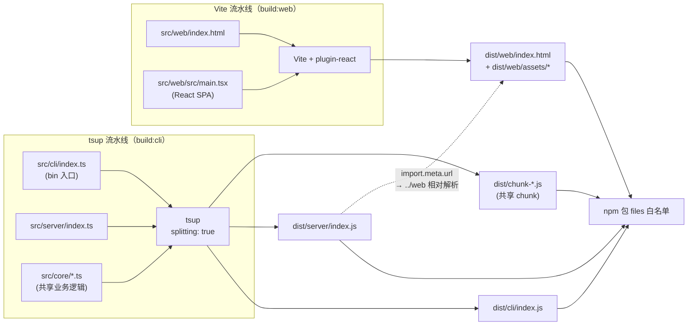
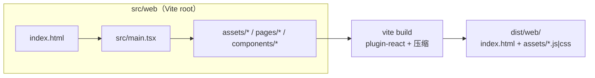
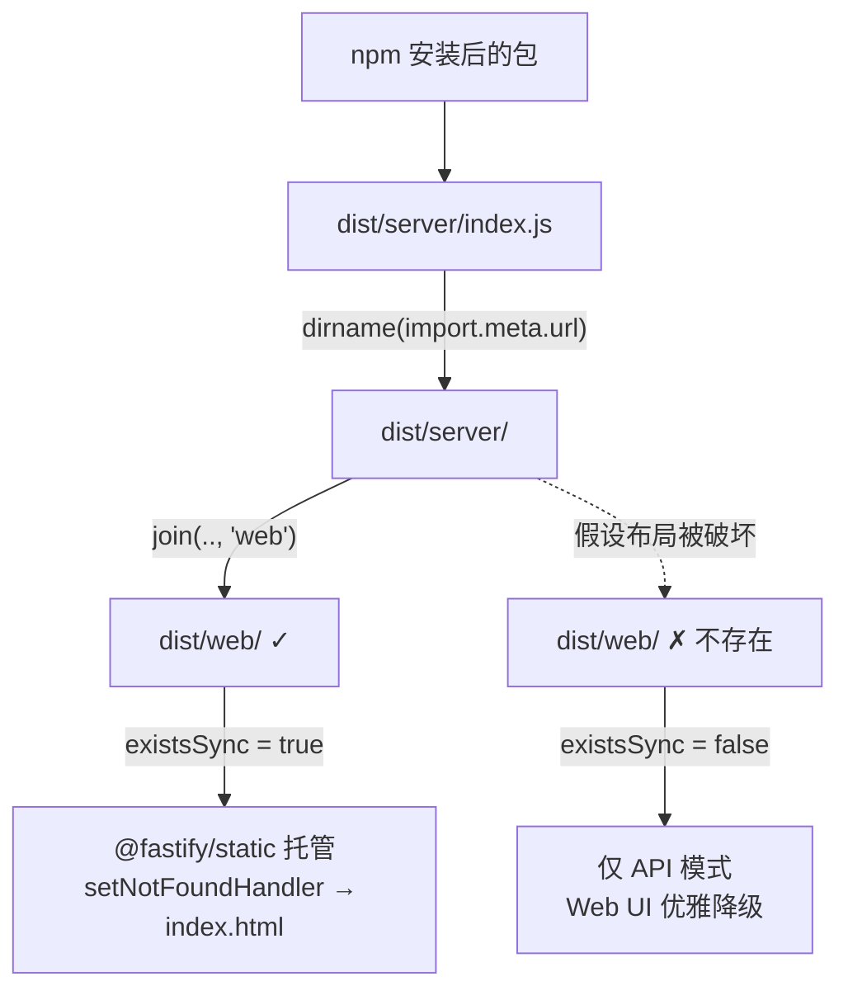

super-cli 是一个"双运行时"项目：CLI 与 HTTP 服务运行在 Node.js 上，而 Web 看板是运行在浏览器中的 React SPA。两种运行时对打包工具的要求几乎完全相反——Node 端需要 CommonJS 依赖兼容、保留 `bin` 入口 shebang、按 Node 版本编译目标，浏览器端则需要 JSX 转换、CSS 处理、代码压缩与 HTML 入口。本文解析项目如何用 **tsup 与 Vite 两条独立流水线**分别处理两端，并在 `dist/` 目录完成产物汇合，最终由 Fastify 在单进程中托管全部产物。理解这条流水线是排查"构建后 Web 看板 404"或"npm 安装后无界面"等问题的基础。

Sources: [package.json](package.json#L26-L36)

## 问题定义：为什么一条流水线不够用

如果只用一个打包器同时处理两端，每一边都会付出代价。下表对比了两种运行时的打包需求差异，这解释了双流水线的存在必要性。

| 维度 | Node 端（cli / core / server） | 浏览器端（web SPA） |
|---|---|---|
| 模块格式 | ESM（`"type": "module"`） | ESM（浏览器原生） |
| 入口形式 | 多入口 + shebang（`bin` 指向 `dist/cli/index.js`） | HTML 单入口（`index.html`） |
| JSX / CSS | 不存在 | React JSX + Tailwind CSS |
| 压缩与产物优化 | 不必要（保持可调试，CLI 体积不敏感） | 必要（首屏加载性能） |
| 依赖处理 | `node_modules` 依赖随包安装 | 全量打包进 `assets/` |

Node 端的 `bin` 字段将可执行入口指向 `dist/cli/index.js`，源文件首行携带 `#!/usr/bin/env node` shebang；而 `files` 白名单同时收录 `dist/cli`、`dist/server`、`dist/web` 与 `dist/chunk-*.js` 四类产物——后两类分别来自 Vite 和 tsup 的 splitting 机制，说明 npm 发布产物本身就是两条流水线的混合输出。

Sources: [package.json](package.json#L5-L17)、[src/cli/index.ts](src/cli/index.ts#L1-L3)

## 构建编排：package.json 脚本层

两条流水线由根 `package.json` 的脚本层显式编排，`build` 是一个顺序组合：**先 tsup、后 Vite**。这个顺序不是随意的——tsup 配置了 `clean: true` 会在构建前清空整个 `dist` 目录，若 Vite 先行构建，其产物会在随后 tsup 清理时被删除；先 CLI 后 Web 的顺序保证 `dist/web` 最后落盘、始终存活。

| 脚本 | 命令 | 作用 |
|---|---|---|
| `build` | `pnpm build:cli && pnpm build:web` | 顺序执行两条流水线 |
| `build:cli` | `tsup` | 读取根目录 `tsup.config.ts` 打包 Node 端 |
| `build:web` | `vite build --config src/web/vite.config.ts` | 显式指定前端配置（它不在 Vite 默认查找位置） |
| `dev` | `tsup --watch` | Node 端增量监听构建 |
| `dev:web` | `vite dev --config src/web/vite.config.ts` | 前端开发服务器（HMR） |
| `prepublishOnly` | `pnpm build` | npm 发布前自动强制全量构建 |

`build:web` 必须通过 `--config` 显式传入配置路径，因为 `src/web/vite.config.ts` 位于子目录而非项目根，Vite 默认不会发现它；同理 `dev:web` 也复用同一路径，保证开发与构建行为一致。`prepublishOnly` 钩子则从流程上杜绝了"发布旧产物"的可能——任何 `npm publish` 前都会触发一次完整双流水线构建。

Sources: [package.json](package.json#L26-L36)

整个流水线的数据流可以用下图概括（Mermaid flowchart 语法，渲染后将展示从源码到运行时的完整链路）：

## tsup 流水线：双入口与共享 chunk

tsup 的配置只有 17 行，但每一项都有明确的架构意图。两个入口点 `cli/index` 与 `server/index` 分别生成 `dist/cli/index.js` 与 `dist/server/index.js`，而 `splitting: true` 让两入口共同依赖的 `src/core/*` 模块（SessionIndex、TaskStore 等约 16 个文件）被抽取为独立的共享 chunk——实际构建产物中的 `dist/chunk-T6FONKEL.js` 即是这一机制的输出。这避免了 core 逻辑在两个入口中被重复打包，也让 `package.json` 的 `files` 字段必须显式包含 `dist/chunk-*.js` 模式，否则 npm 包会缺失共享代码。

| 配置项 | 值 | 架构意图 |
|---|---|---|
| `entry` | `cli/index` + `server/index` | 双入口：CLI 可执行与 server 库两种消费形态 |
| `format` | `['esm']` | 与 `"type": "module"` 一致，纯 ESM 输出 |
| `target` | `node22` | 与 `engines.node >= 22.0.0` 对齐，可用最新语法 |
| `platform` | `node` | 按 Node 环境解析（`node:` 前缀协议等） |
| `splitting` | `true` | core 模块去重，产出 `dist/chunk-*.js` |
| `external` | `['react', 'react-dom']` | 防御性标记：Node 图谱一旦误引 React 也不打入产物 |
| `dts` / `sourcemap` | `false` | 本包是 CLI 工具而非库，无消费方需要声明文件 |
| `clean` | `true` | 构建前清空 `dist`（决定了流水线必须 CLI 先行） |

`external: ['react', 'react-dom']` 值得单独说明：Node 端代码实际上不依赖 React，且 React 位于 `devDependencies` 中（不会随包安装）。将二者标记为 external 是一种构建期防御——若未来有人误在 Node 代码中引入 React，esbuild 会保留裸导入而非把约 140KB 的运行时打进 chunk，问题会在运行时报错而非悄悄膨胀产物。另一个容易忽略的细节是入口 shebang：`src/cli/index.ts` 首行的 `#!/usr/bin/env node` 会被 esbuild 原样保留到 `dist/cli/index.js`，配合 `bin` 字段构成可执行链路。

Sources: [tsup.config.ts](tsup.config.ts#L3-L17)、[package.json](package.json#L9-L16)、[src/cli/index.ts](src/cli/index.ts#L1-L3)

还有一个打包层面的关键事实：**tsup 完全不依赖路径别名**。虽然根 `tsconfig.json` 声明了 `@core/*`、`@cli/*`、`@server/*` 映射，但对源码的全量搜索显示没有任何文件实际使用这些别名——所有跨目录导入都是带 `.js` 后缀的相对路径（如 `import { SessionIndex } from '../core/session-index.js'`）。这种 NodeNext ESM 写法让 esbuild 无需任何别名插件即可直接解析，tsup 与 `tsc --noEmit` 看到的是完全一致的模块图。

Sources: [tsconfig.json](tsconfig.json#L17-L24)、[src/server/index.ts](src/server/index.ts#L7-L14)

## Vite 流水线：把输出重定位到 dist/web

Vite 的配置同样短小，核心动作是**两个位置重定向**。第一，`root` 被设为 `src/web` 目录本身，使 Vite 以 `src/web/index.html` 作为构建入口（该 HTML 引用 `/src/main.tsx` 作为模块入口）；第二，`outDir` 被改写为 `../../dist/web`，让前端产物汇入统一发布目录。由于输出目录位于 `root` 之外，Vite 出于安全默认不清空它，因此显式声明 `emptyOutDir: true`——它只清理 `dist/web` 本身，不会波及 tsup 已产出的 `dist/cli`、`dist/server` 与 chunk 文件。

前端 TypeScript 配置是独立的一份（`src/web/tsconfig.json`），并被根 tsconfig 的 `exclude` 显式排除，两者在模块解析策略上刻意分化：根配置用 `NodeNext`（匹配 Node 运行时与 `.js` 后缀导入约定），前端用 `bundler`（匹配 Vite 无扩展名导入与打包器语义）并开启 `jsx: "react-jsx"` 与 `noEmit`。需要注意的是，`typecheck` 脚本只运行根目录的 `tsc --noEmit`，而 Vite 构建本身不做类型检查，前端类型目前依赖 IDE 层保障。

Sources: [src/web/vite.config.ts](src/web/vite.config.ts#L5-L17)、[src/web/index.html](src/web/index.html#L8-L12)、[src/web/tsconfig.json](src/web/tsconfig.json#L3-L14)、[tsconfig.json](tsconfig.json#L23-L24)

## 运行时桥接：server 如何找到 web 产物

两条流水线在构建期互不感知，真正的对接发生在**运行时的相对路径约定**上。打包后 `import.meta.url` 指向 `dist/server/index.js`，`dirname()` 得到 `dist/server`，再 `join(__dirname, '..', 'web')` 即解析到 `dist/web`——这与 Vite 配置中的 `outDir` 是同一物理位置。这条**"server 产物目录的上一级 web"**就是双流水线之间唯一且关键的隐式契约：任何一方改变输出布局（例如把 Vite outDir 改到 `dist/static`），另一方不会报错，只会静默找不到前端。

`existsSync` 守卫带来一个实用的容错特性：若用户从源码只运行了 `build:cli`（例如 `pnpm dev` 的 watch 产物下直接启动），server 会跳过静态资源注册，纯 API 模式照常工作而不崩溃；`setNotFoundHandler` 中 `reply.sendFile('index.html')` 则实现了 SPA 路由回退，保证浏览器直接访问 `/sessions` 等前端路由时不会被 404 拦截。

Sources: [src/server/index.ts](src/server/index.ts#L16-L48)

## 开发模式：两套独立的监听进程

开发期不需要任何构建产物。Node 端用 `tsup --watch` 增量编译到 `dist`，前端用 `vite dev` 启动带 HMR 的开发服务器（默认端口 5173）。两端协作的关键是 Vite 配置中的代理：`/api → http://localhost:3000`，它正好指向 `super-cli serve` 的默认端口。前端 API 客户端全部使用 `/api` 相对路径（`API_BASE = '/api'`），因此同一份前端代码在开发模式（请求发往 Vite、被代理到 :3000）与生产模式（请求发往同源 Fastify、路由直接命中 `/api/*`）下无需任何条件分支。

| 场景 | 页面来源 | `/api` 请求去向 |
|---|---|---|
| `pnpm dev:web` + `super-cli serve` | Vite dev server（5173，HMR） | Vite 代理 → Fastify（3000） |
| 生产构建后 `super-cli serve` | Fastify 托管 `dist/web` | 同源 Fastify 路由 |
| 仅 `build:cli` 后 `super-cli serve` | 无页面（existsSync 守卫） | Fastify API 正常可用 |

典型开发流程需要两个终端：终端一运行 `pnpm dev:web`（前端），终端二运行 `pnpm dev` 后执行 `node dist/cli/index.js serve`（或直接 `super-cli serve`）提供 API。`serve` 命令内部对 server 模块采用**动态导入**（`await import('../../server/index.js')`），意味着仅当用户真正执行 `serve` 时 Fastify 及其路由才被加载，普通 `list`/`show` 等 CLI 操作完全不触碰 HTTP 栈——tsup 的 splitting 保证了这份懒加载语义在打包后依然成立。

Sources: [src/web/vite.config.ts](src/web/vite.config.ts#L12-L16)、[src/cli/commands/serve.ts](src/cli/commands/serve.ts#L8-L23)、[src/web/src/api/client.ts](src/web/src/api/client.ts#L1-L4)、[src/server/routes/sessions.ts](src/server/routes/sessions.ts#L10-L10)

## 发布链路：产物如何进入用户机器

`prepublishOnly: pnpm build` 保证发布前必走完整双流水线，随后 `files` 白名单精确圈定四类产物：`dist/cli`（bin 入口）、`dist/server`（server 入口）、`dist/chunk-*.js`（共享 chunk）、`dist/web`（前端 SPA）。由于 Vite 产物被预先构建并随包分发，**npm 用户安装后零构建即可获得完整 Web 看板**——`super-cli serve` 启动即含界面。同时 `.gitignore` 排除整个 `dist/`，仓库中永远只有源码，产物只存在于发布包与本地构建中。

Sources: [package.json](package.json#L9-L17)、[.gitignore](.gitignore#L1-L3)

## 关键设计权衡回顾

| 决策 | 备选方案 | 选择理由 |
|---|---|---|
| tsup + Vite 双工具 | 单一 esbuild/tsup 打两端 | 前端需要 JSX/HMR/CSS 生态，Node 需要简洁可靠——各取所长 |
| `splitting: true` | 各入口独立完整打包 | core 逻辑只编译一份，npm 包体积更小 |
| Vite outDir 重定向到 `dist/web` | 输出到 `src/web/dist` 再复制 | 免去复制步骤，与 server 运行时解析天然对齐 |
| `existsSync` 守卫 | 构建期强校验前端存在 | CLI-only 用户与开发期 watch 场景可优雅降级 |
| build 顺序 CLI → Web | 并行或 Web 先行 | tsup `clean: true` 会清空 dist，Web 必须最后落盘 |
| `dts: false` | 输出类型声明 | 本包是终端工具，无下游库消费方 |

整体来看，这条流水线的精髓在于**用目录布局替代构建期协调**：tsup 与 Vite 彼此不知晓对方存在，唯一约束是"`dist/server` 的上级目录中必须有 `web`"这一运行时约定，由 `import.meta.url` 相对解析兑现。它换来了两个流水线完全独立演进的能力——升级 Vite 或更换 Node 端打包器都互不影响。

Sources: [tsup.config.ts](tsup.config.ts#L3-L17)、[src/web/vite.config.ts](src/web/vite.config.ts#L8-L11)、[src/server/index.ts](src/server/index.ts#L33-L44)、[package.json](package.json#L26-L36)

## 延伸阅读

- 构建产物的消费方式详见 [单进程全栈部署：Fastify 托管 React 静态资源与 SPA 回退](15-dan-jin-cheng-quan-zhan-bu-shu-fastify-tuo-guan-react-jing-tai-zi-yuan-yu-spa-hui-tui)
- 相对导入 `.js` 后缀与 ESM 约范的完整背景见 [共享类型系统、ESM 模块规范与路径别名约定](24-gong-xiang-lei-xing-xi-tong-esm-mo-kuai-gui-fan-yu-lu-jing-bie-ming-yue-ding)
- 日常构建命令的操作视角见 [开发环境与常用命令（pnpm dev / dev:web / test / typecheck / build）](3-kai-fa-huan-jing-yu-chang-yong-ming-ling-pnpm-dev-dev-web-test-typecheck-build)
- 首次构建与运行的端到端体验见 [快速开始：安装、构建与首次运行（CLI 与 Web 看板）](2-kuai-su-kai-shi-an-zhuang-gou-jian-yu-shou-ci-yun-xing-cli-yu-web-kan-ban)