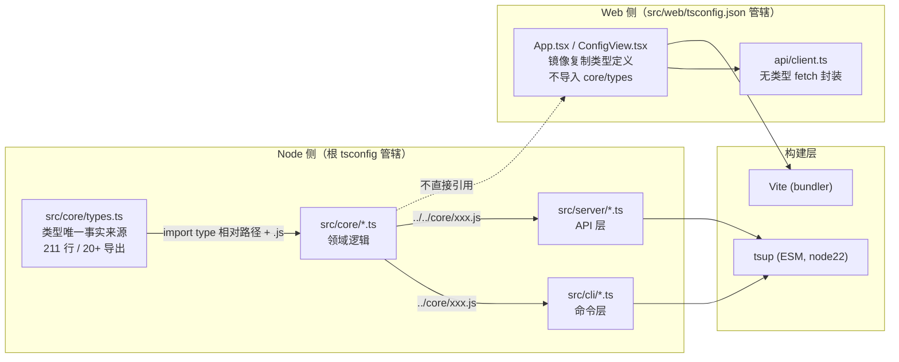

当你打开这个仓库的任意一个 TypeScript 文件，会立刻遇到三个"工程骨架"问题：这些接口类型定义在哪里？为什么 `import` 一个 `.ts` 文件却写成 `.js` 后缀？`tsconfig.json` 里的 `@core/*` 别名到底能不能用？本页将一次性回答这三个问题。super-cli 是一个同时包含 Node.js 后端（CLI + HTTP 服务）与 React 前端（SPA）的混合工程，类型契约、模块规范与路径约定共同决定了"改一行代码会不会牵动全身"。理解这三件事，是读懂 [仓库结构导览](4-cang-ku-jie-gou-dao-lan-cli-core-server-web-si-ceng-zhi-ze-hua-fen) 之后迈出的下一步。

## 一、全局图景：三份契约如何咬合

先用一张图建立整体认知。这个项目的类型与模块体系由三份"契约"构成：`src/core/types.ts` 是 Node 侧唯一的类型事实来源（Single Source of Truth）；根 `tsconfig.json` 与 `src/web/tsconfig.json` 构成**双编译配置隔离**；tsup 与 Vite 两条构建流水线各自消费一份配置。下面的概念图展示了类型从定义到消费的完整流向：



注意图中的**虚线**：`src/core/types.ts` 与前端 `App.tsx` 之间不存在导入关系——前端是自己重新声明了一份类型。这个"镜像复制"模式（而非共享导入）是本仓库最重要、也最容易被初学者误解的架构决策，后文第三节将详细拆解。

Sources: [tsconfig.json](tsconfig.json#L1-L25), [src/web/tsconfig.json](src/web/tsconfig.json#L1-L15)

## 二、共享类型系统：core/types.ts 作为 Node 侧唯一事实来源

### 2.1 三个联合类型：整个系统的"词汇表"

`src/core/types.ts` 的开头三行是全项目最高频被引用的类型——三个**字符串字面量联合类型**（string literal union）。初学者可以把它们理解为"枚举的 TypeScript 原生写法"：变量的取值被限制在列出的几个字符串之内，写错任意一个都会在编译期报错：

| 类型名 | 允许的取值 | 消费场景 |
|---|---|---|
| `CliProvider` | `claude-code` / `qoder` / `codex` / `kimi` / `pi` / `opencode` / `workbuddy` / `traecode`（共 8 个） | 标识会话属于哪个 AI 编程助手，贯穿 [多 Provider 架构](5-duo-provider-jia-gou-claude-code-qoder-codex-de-zhu-ce-biao-she-ji) |
| `SessionStatus` | `backlog` / `in_progress` / `review` / `done` / `cancelled`（共 5 个） | 任务看板的五列状态，详见 [会话状态推断与任务看板模型](10-hui-hua-zhuang-tai-tui-duan-yu-ren-wu-kan-ban-mo-xing-backlog-in_progress-review-done-cancelled) |
| `TerminalType` | `ghostty` / `iterm2` / `terminal` / `kitty` / `warp`（共 5 个） | macOS 终端启动适配 |

这三个类型被 `providers.ts`、`session-index.ts`、`session-search.ts` 等几乎所有 core 模块以 `import type { CliProvider } from './types.js'` 的形式引用。

Sources: [types.ts](src/core/types.ts#L1-L3), [providers.ts](src/core/providers.ts#L4-L4)

### 2.2 类型族谱：211 行里的五个层次

`src/core/types.ts` 全文 211 行，导出 20 余个类型。按抽象层次可以将它们分成五组，形成一条从"协议原语"到"领域聚合"的类型链：

| 层次 | 类型 | 职责 |
|---|---|---|
| **协议层** | `ContentBlock`、`TokenUsage` | 描述 JSONL 会话文件中单条消息的最小结构（文本块 / 工具调用 / 工具结果） |
| **消息层** | `SessionMessage` | 单条会话记录，可选字段多达 20 个，兼容各 CLI 的异构格式 |
| **聚合层** | `SessionMetadata`、`ActiveSession`、`HistoryEntry` | 从会话文件流式解析出的元数据（消息计数、token 汇总、模型列表） |
| **查询层** | `ListOptions`、`SearchOptions`、`SearchResult`、`SearchHit` | CLI 与 API 的查询参数及返回结构 |
| **配置层** | `TaskLabel`、`AppConfig`、`SkillInfo`、`McpServerInfo`、`RuleFile` | 用户配置（`~/.super-cli/config.json`）与 Harness 配置中心的数据形状 |

这些类型之间存在嵌套依赖：`SessionMessage.message.content` 的类型是 `string | ContentBlock[]`，`SessionMetadata.tags` 是 `string[]`，`AppConfig.settings.terminal` 则复用了上面的 `TerminalType`。也就是说，改 `ContentBlock` 一个字段，TypeScript 编译器会沿着依赖链把所有受影响的文件逐一标红——这正是"集中定义类型"的核心价值：**让编译器替你追踪变更半径**。

Sources: [types.ts](src/core/types.ts#L5-L96), [types.ts](src/core/types.ts#L98-L114), [types.ts](src/core/types.ts#L116-L210)

### 2.3 Node 侧的类型消费模式

core / cli / server 三层都以**相对路径 + `.js` 后缀 + `import type`** 的统一风格消费这份类型文件。三个典型样例：

```typescript
// core 层内部（rules-reader.ts）
import type { CliProvider, RuleFile } from './types.js';

// cli 命令层跨层引用（commands/list.ts）
import type { CliProvider } from '../../core/types.js';

// server 路由层跨层引用（routes/config.ts）
import type { CliProvider } from '../../core/types.js';
```

注意两个细节：其一，`import type` 而非 `import`——这是纯类型导入语法，编译产物中会被完全擦除，不会产生任何运行时代码，tsup 打包后体积因此不受影响；其二，路径写的都是 `.js` 而源文件实际是 `.ts`，这个"反直觉"的后缀规则是下一节的主角。

Sources: [rules-reader.ts](src/core/rules-reader.ts#L4-L5), [list.ts](src/cli/commands/list.ts#L1-L4), [config.ts](src/server/routes/config.ts#L2-L6)

## 三、前端镜像复制：一个刻意（但有代价）的隔离决策

### 3.1 事实：前端从不导入 core/types.ts

在整个 `src/web/src` 目录中搜索对 core 类型的导入，结果是**零**。取而代之，`App.tsx` 和 `ConfigView.tsx` 各自重新声明了一份类型：

```typescript
// src/web/src/App.tsx L24-L28 —— 与 core/types.ts 平行的本地类型
type Theme = 'light' | 'dark' | 'deep';
type ViewMode = 'board' | 'card' | 'list';
type SortMode = 'time-desc' | 'time-asc' | 'messages';
type SessionStatus = 'backlog' | 'in_progress' | 'review' | 'done' | 'cancelled';
type CliProvider = 'claude-code' | 'qoder' | 'codex';
```

同样是 `SessionStatus` 与 `CliProvider`，字面完全一致或部分一致，但它们是**两份独立的定义**。`App.tsx` 中还镜像了 `SessionItem`、`ProjectInfo`、`ProjectDetailData` 等接口——对比 `core/types.ts` 的 `SessionMetadata`、`ProjectInfo`、`ProjectDetail`，字段高度重合但名字略异（如前端多了 `lastAssistantMessage`，少了 `messageCount`）。

Sources: [App.tsx](src/web/src/App.tsx#L24-L28), [App.tsx](src/web/src/App.tsx#L66-L104), [ConfigView.tsx](src/web/src/ConfigView.tsx#L9-L15)

### 3.2 为什么隔离：双构建链的必然

这个决策的根源在于构建链隔离（详见 [双构建流水线](23-shuang-gou-jian-liu-shui-xian-tsup-da-bao-node-duan-yu-vite-da-bao-qian-duan-spa)）：根 `tsconfig.json` 的 `exclude` 明确排除了 `src/web`，而 `src/web/tsconfig.json` 的 `include` 只覆盖自己的 `src` 子目录。两份 tsconfig 的目标环境完全不同——Node 侧面向 Node.js 22（无需 DOM 库），Web 侧面向浏览器（需要 `DOM`、`DOM.Iterable` 类型库和 `jsx: react-jsx`）。类型层面的解耦让 Vite 构建时完全不必感知 `src/core` 的存在。

代价则是**类型漂移**（type drift）。一个已经发生的实例：`core/types.ts` 中 `CliProvider` 有 8 个成员，而 `App.tsx` 中的镜像定义只有 3 个。有趣的是，`App.tsx` 的 `PROVIDER_COLORS` 和 `PROVIDER_LABELS` 两个 `Record<CliProvider, string>` 映射表却覆盖了全部 8 个 provider 的颜色与缩写——映射表比类型定义"新"，说明后端新增 provider 时前端数据先行更新、类型声明却遗忘了同步。

Sources: [tsconfig.json](tsconfig.json#L23-L24), [App.tsx](src/web/src/App.tsx#L38-L58), [types.ts](src/core/types.ts#L1-L1)

### 3.3 漂移为何未被察觉：typecheck 的覆盖盲区

`package.json` 中的 `"typecheck": "tsc --noEmit"` 只运行根 tsconfig，而根 tsconfig 已将 `src/web` 排除；`src/web/tsconfig.json` 虽然存在且自带 `noEmit: true`，但**没有任何 npm script 会以它为参数运行**。换言之，`pnpm typecheck` 是一个只覆盖 Node 侧的检查，前端的类型一致性完全依赖人工维护。上述 `Record` 映射表与联合类型成员数不一致这类问题，正是这种"配置存在但未接入"状态的典型产物（测试与检查流程的完整讨论见 [测试策略与 TypeScript 类型检查流程](25-ce-shi-ce-lue-yu-typescript-lei-xing-jian-cha-liu-cheng)）。

Sources: [package.json](package.json#L26-L36), [tsconfig.json](tsconfig.json#L23-L24), [src/web/tsconfig.json](src/web/tsconfig.json#L1-L15)

## 四、ESM 模块规范：为什么 import 一个 .ts 文件要写 .js

### 4.1 纯 ESM 声明链

这个项目从 package.json 到构建产物是**一条贯穿始终的 ESM 链**，四个环节互相咬合：

| 环节 | 配置位置 | ESM 语义 |
|---|---|---|
| 包声明 | `package.json` `"type": "module"` | 仓库内所有 `.js` 文件默认按 ESM 解析 |
| 编译器 | 根 tsconfig `module: NodeNext` / `moduleResolution: NodeNext` | 严格按 Node.js 运行时的真实解析规则处理导入 |
| 打包器 | tsup `format: ['esm']`、`target: 'node22'` | 产物为 ESM，面向 Node 22 |
| 运行时 | `engines.node: ">=22.0.0"` | Node 22 原生支持 ESM，无需 CommonJS 回退 |

Node 22 的要求并非偶然：项目依赖的 Fastify 5、commander 13 等新版库都以 ESM 为主流形态，且 `File → URL → import` 等 Node ESM 特性需要较新的运行时保证。

Sources: [package.json](package.json#L5-L5), [tsconfig.json](tsconfig.json#L3-L5), [tsup.config.ts](tsup.config.ts#L8-L10), [package.json](package.json#L45-L47)

### 4.2 `.js` 后缀规则：初学者最常踩的坑

**核心规则：在 NodeNext 模式下，相对导入必须写编译产物的后缀（`.js`），而不是源文件的后缀（`.ts`）。**

初学者第一次看到 `import ... from './types.js'` 而磁盘上的文件是 `types.ts` 时，几乎都会疑惑。解释要从编译说起：TypeScript 编译（或 tsup 打包）后，`src/core/types.ts` 变成 `dist/core/types.js`，**文件名不变，只有后缀变**。Node.js 的 ESM 运行时严格要求相对导入必须带完整后缀（这是 ESM 规范与 CommonJS 的重大差异），而 NodeNext 让 TypeScript 编译器模拟 Node 的解析行为——所以你在源码里写的导入路径，必须与**运行时磁盘上真实存在的产物路径**一致。

两种写法的后果对照：

| 写法 | `tsc --noEmit` 结果 | 原因 |
|---|---|---|
| `from './types.js'`（源文件是 `types.ts`） | ✅ 通过 | TS 自动把 `.js` 说明符映射回同名 `.ts` 源文件检查 |
| `from './types'`（省略后缀） | ❌ 报错 | NodeNext 下相对导入省略后缀不被允许 |
| `from './types.ts'` | ❌ 报错（Node 侧） | 运行时不存在 `.ts` 文件；仅 `allowImportingTsExtensions` 场景合法 |

值得注意的是，Web 侧的 `moduleResolution: "bundler"` 本允许省略后缀，但项目仍统一采用 `.js` 后缀（如 `main.tsx` 中的 `from './App.js'`、`Search.tsx` 中的 `from '../api/client.js'`）——这是为了全仓库风格一致，且 TS 对 `.js → .ts/.tsx` 的映射在 bundler 模式下同样生效。

Sources: [tsconfig.json](tsconfig.json#L4-L5), [src/web/tsconfig.json](src/web/tsconfig.json#L5-L11), [main.tsx](src/web/src/main.tsx#L4-L4), [Search.tsx](src/web/src/pages/Search.tsx#L2-L2)

### 4.3 两条 ESM 细分约定

**其一，`import type` 纯类型导入。** 全仓库凡是只导入类型（不导入函数、类等运行时值）的场景，一律使用 `import type { ... }`。这让 tsup/esbuild 在打包时可以放心地整行擦除，也避免了 Turbopack 类工具的 `isolatedModules` 告警。`server/routes/config.ts` 第 1 行的 `import type { FastifyInstance } from 'fastify'` 是第三方库类型导入的同款写法。

**其二，Node 内置模块强制 `node:` 协议前缀。** `server/index.ts` 中导入 `node:path`、`node:url`、`node:fs` 而非裸的 `path`/`url`。这一前缀明确区分"Node 内置模块"与"node_modules 依赖"，避免恶意包通过同名 npm 包劫持内置模块，同时让代码审查时模块来源一目了然。

Sources: [config.ts](src/server/routes/config.ts#L1-L2), [index.ts](src/server/index.ts#L4-L6), [rules-reader.ts](src/core/rules-reader.ts#L4-L4)

### 4.4 tsup 产物形态：双入口与共享 chunk

tsup 配置声明了两个入口（`cli/index` 与 `server/index`），开启 `splitting: true` 后，两个入口共同依赖的 core 模块会被抽取为共享 chunk 文件。这解释了 `package.json` 的 `files` 字段中那行略显神秘的 `"dist/chunk-*.js"`——npm 发布时必须把这些共享 chunk 一并带上，否则 `super-cli serve` 启动服务器入口时会因找不到依赖而崩溃。`external: ['react', 'react-dom']` 则表明 Node 侧产物不打包 React（React 只属于 Vite 构建的前端 bundle，两边的依赖边界在此清晰可见）。

Sources: [tsup.config.ts](tsup.config.ts#L4-L16), [package.json](package.json#L9-L17)

## 五、路径别名：一份"声明了但未启用"的配置

### 5.1 事实陈述

根 `tsconfig.json` 的第 17–21 行定义了三个路径别名：

```json
"paths": {
  "@core/*": ["./src/core/*"],
  "@cli/*": ["./src/cli/*"],
  "@server/*": ["./src/server/*"]
}
```

但在全部 `src` 源码中搜索 `@core/`、`@cli/`、`@server/`，**命中数为零**。所有跨目录导入均使用相对路径（如 `../../core/types.js`）。`src/web/tsconfig.json` 没有任何 `paths` 配置，`vite.config.ts` 也没有 `resolve.alias`——前端自然也全是相对路径。

Sources: [tsconfig.json](tsconfig.json#L16-L21), [src/web/tsconfig.json](src/web/tsconfig.json#L1-L15), [vite.config.ts](src/web/vite.config.ts#L5-L17)

### 5.2 为什么别名被弃而不用

**关键认知：`tsconfig.json` 的 `paths` 只是 TypeScript 编译器的映射规则，打包器不承诺遵循。** esbuild 内核的 tsup 默认不解析 tsconfig paths（需要额外引入 `tsup-paths` 类插件或手动配置 alias）；Vite 虽支持 `resolve.alias`，但那是独立于 tsconfig 的另一套配置。一旦源码混用别名，`pnpm typecheck` 能通过、`pnpm build` 却会失败——这种"类型检查绿、构建红"的裂缝正是别名在此仓库未被采用的原因。现状是三条最干净的路线：

| 层 | 跨层导入写法 | 示例 |
|---|---|---|
| core 内部 | 同目录或子目录相对路径 + `.js` | `'./types.js'` |
| cli → core | `../../core/*.js` | `'../../core/session-index.js'` |
| server → core | `../../core/*.js` 或 `../../core/types.js` | `'../core/session-index.js'`（server 根文件） |
| web 前端内部 | 相对路径 + `.js`（bundler 映射回 `.ts/.tsx`） | `'./api/client.js'`、`'../api/client.js'` |

需要提醒初学者：这些 `paths` 条目目前是**无害的遗留声明**（`tsc --noEmit` 下没有任何代码走这条映射），但直接拿来写 `@core/types.js` 会构建失败。若未来想启用别名，需同时改造 tsup 配置与（若涉及前端）Vite alias，属于一项需要动三处文件的协同变更。

Sources: [tsconfig.json](tsconfig.json#L17-L21), [list.ts](src/cli/commands/list.ts#L2-L3), [index.ts](src/server/index.ts#L7-L8)

## 六、初学者实践清单：改代码时的行动指引

把前文的规则压缩成一张可执行的速查表。当你要为项目新增类型或跨文件引用时，按这张表操作即可与全仓库风格保持一致：

| 场景 | 正确做法 | 违规后果 |
|---|---|---|
| 新增 Node 侧领域类型 | 写入 `src/core/types.ts` 并 `export interface` | 类型散落各文件，变更半径失控 |
| Node 侧导入纯类型 | `import type { X } from './types.js'` | 普通 `import` 会在产物残留无用模块引用 |
| 任何相对导入（Node 侧） | 必须带 `.js` 后缀 | `tsc --noEmit` 直接报错 `TS2835` |
| 导入 Node 内置模块 | 带 `node:` 前缀，如 `node:path` | 风格不一致，且存在包名遮蔽风险 |
| 前端需要 core 的类型 | 在 `App.tsx` / `ConfigView.tsx` 镜像声明（现状约定） | 直接 `import '../../core/types.js'` 会跨构建链，超出 web tsconfig 的 include 范围 |
| 想用 `@core/*` 别名 | **不要用**——构建链未接入 | typecheck 通过但 tsup 构建失败 |
| 验证 Node 侧类型 | `pnpm typecheck` | 注意它不检查 `src/web` |
| 同步新增 Provider | 同时更新 `core/types.ts` 的 `CliProvider` **和** `App.tsx` 的镜像定义及 `PROVIDER_COLORS`/`PROVIDER_LABELS` 映射 | 前端类型漂移（现状即存在 3 vs 8 的实例） |

最后一条是本仓库最值得记住的隐性契约：`CliProvider` 实际上有**两处必须同步的真相**。这也是 [编码约定与 AGENTS.md](26-bian-ma-yue-ding-yu-agents-md-mian-xiang-ai-agent-de-xie-zuo-kai-fa-zhi-nan) 所述协作规范在类型维度的具体体现。

Sources: [package.json](package.json#L26-L36), [types.ts](src/core/types.ts#L1-L1), [App.tsx](src/web/src/App.tsx#L27-L28)

## 七、延伸阅读

- 想了解这套 ESM 约定如何在构建产物中落地：[双构建流水线：tsup 打包 Node 端与 Vite 打包前端 SPA](23-shuang-gou-jian-liu-shui-xian-tsup-da-bao-node-duan-yu-vite-da-bao-qian-duan-spa)
- 想了解类型检查之外的质量保障：[测试策略与 TypeScript 类型检查流程](25-ce-shi-ce-lue-yu-typescript-lei-xing-jian-cha-liu-cheng)
- 想看这些类型承载的真实业务语义：[多 Provider 架构：Claude Code、Qoder、Codex 的注册表设计](5-duo-provider-jia-gou-claude-code-qoder-codex-de-zhu-ce-biao-she-ji) 与 [会话状态推断与任务看板模型](10-hui-hua-zhuang-tai-tui-duan-yu-ren-wu-kan-ban-mo-xing-backlog-in_progress-review-done-cancelled)
- 想掌握全仓库的代码风格约定：[编码约定与 AGENTS.md：面向 AI Agent 的协作开发指南](26-bian-ma-yue-ding-yu-agents-md-mian-xiang-ai-agent-de-xie-zuo-kai-fa-zhi-nan)