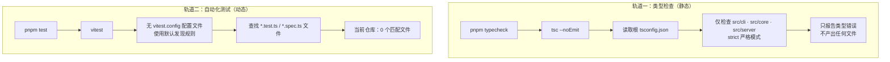
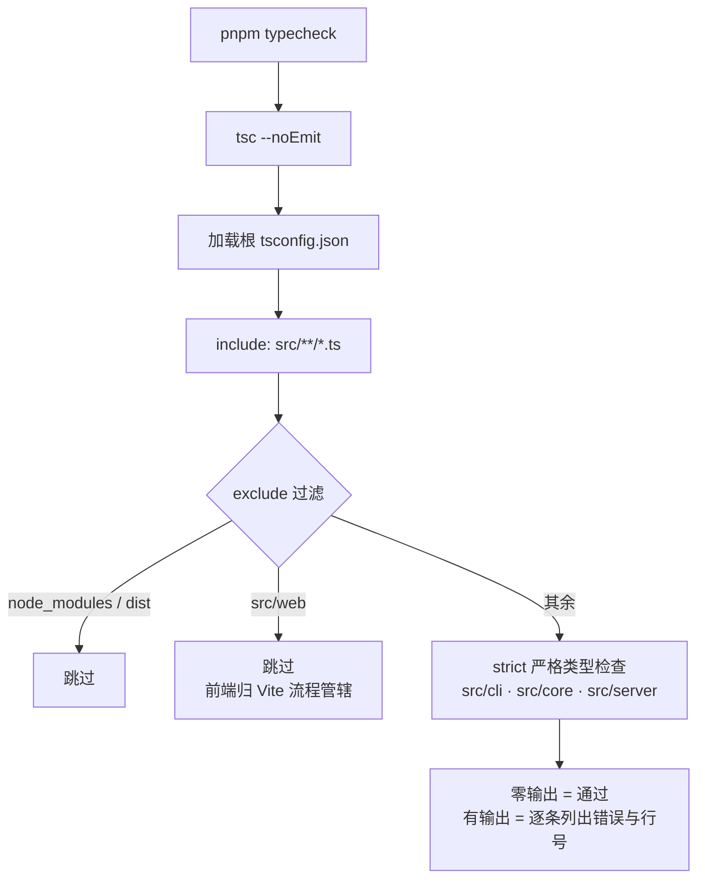
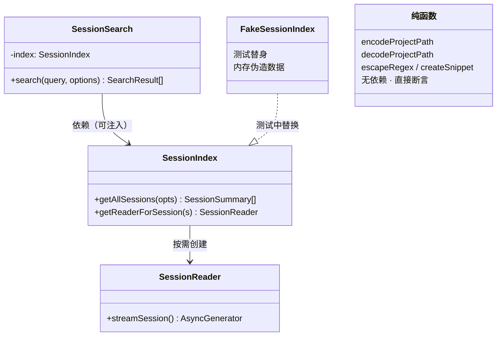

本页深入解析 super-cli 的两条质量保障轨道：**Vitest 自动化测试**与 **`tsc --noEmit` 类型检查**。你将理解两条轨道的精确边界（尤其是"为什么 `src/web` 不在类型检查范围内"这一关键设计决策）、零配置 Vitest 的默认行为，以及代码库中已经为"未来写测试"预留的可测试性设计。对于初学者，本页还会给出写出第一个测试文件的完整路径。

需要先说明一个**诚实的事实**：本仓库当前已完整配置 Vitest 测试框架（依赖、脚本、文档三处均可验证），但源代码中尚不存在任何测试文件。这不是文档疏漏，而是项目现状——理解这一现状及其背后的架构含义，正是本页的核心价值。

Sources: [package.json](package.json#L26-L36)、[AGENTS.md](AGENTS.md#L25-L41)

## 一、全景：双轨质量保障体系

super-cli 没有采用"单一测试框架包打天下"的策略，而是把质量保障拆分为两条职责完全不同的轨道。**类型检查轨道**回答的问题是"代码的类型逻辑是否自洽"——由 TypeScript 编译器在**不产出任何文件**的前提下静态分析源码；**测试轨道**回答的问题是"代码的运行时行为是否符合预期"——由 Vitest 加载并执行真实的函数调用。两者互补而非互替：类型检查无法验证 `encodeProjectPath('/a/b')` 的返回值是否正确，而测试也无法发现"把 `string` 传给了期望 `number` 的参数"这类错误。

| 维度 | 类型检查轨道 | 测试轨道 |
|---|---|---|
| 命令 | `pnpm typecheck` | `pnpm test` |
| 底层工具 | `tsc`（TypeScript ^5.8.3） | Vitest ^3.2.1 |
| 触发方式 | 单次执行，无 watch | 交互终端默认 watch 模式 |
| 覆盖范围 | `src/cli` + `src/core` + `src/server` | 由文件发现规则动态决定（当前 0 个文件） |
| 是否产出文件 | 否（`--noEmit`） | 否（只报告结果） |
| 当前状态 | ✅ 可直接运行 | ⚠️ 框架就绪，等待第一个测试文件 |

下面的 Mermaid 图展示了两条轨道的完整工作流。**阅读前提**：Mermaid 是一种用文本描述流程图的语法，渲染后你会看到两个并列的子图——左边是类型检查的路径（注意它止步于"报告错误"，没有任何产物输出），右边是测试的路径（注意"0 个匹配文件"这个节点是当前仓库的真实状态）。



Sources: [package.json](package.json#L32-L34)、[package.json](package.json#L61-L76)、[tsconfig.json](tsconfig.json#L23-L24)

## 二、测试轨道：Vitest 的零配置运行方式

### 脚本定义与依赖声明

`package.json` 中与测试相关的定义只有两处：scripts 里的 `"test": "vitest"`，以及 devDependencies 里的 `"vitest": "^3.2.1"`（实际安装版本为 3.2.4）。值得注意的是，仓库中**不存在任何 `vitest.config.ts` 配置文件**——这意味着项目刻意选择了"零配置"起步：Vitest 的所有行为（测试文件发现、环境、断言库）都依赖默认值，未来若需要自定义（例如添加覆盖率配置或路径别名映射），才需要引入配置文件。对于初学者而言，零配置意味着"写一个符合命名规则的文件，测试就会被自动发现"，认知负担最小。

Sources: [package.json](package.json#L32)、[package.json](package.json#L75)

### 默认的测试文件发现规则

没有配置文件时，Vitest 使用内置的默认 glob 规则 `**/*.{test,spec}.?(c|m)[jt]s?(x)` 来发现测试。翻译成初学者语言：任何目录下、以 `.test.ts`、`.spec.ts`、`.test.tsx`（以及对应的 `.mts`/`.cts` 变体）结尾的文件都会被识别为测试文件。因此社区最常见的两种放置方式在本仓库都会生效——与源码同目录放置（如 `src/core/paths.test.ts`），或集中放在 `__tests__` 目录下（如 `src/core/__tests__/paths.test.ts`）。

### 三种运行形态

| 运行方式 | 命令 | 适用场景 |
|---|---|---|
| 交互式 watch | `pnpm test` | 本地开发：保存文件后自动重新运行相关测试 |
| 单次全量执行 | `pnpm test -- run` | 提交前或 CI 中一次性跑完并退出 |
| 运行单个文件 | `pnpm test -- path/to/file.test.ts` | 只验证正在修改的模块 |

这里有一个初学者容易忽略的细节：`pnpm test` 展开后是裸的 `vitest` 命令，在交互式终端中它**默认进入 watch 模式**（持续监听文件变化）；而在 CI 等非交互环境中应使用 `vitest run`（通过 `pnpm test -- run` 传递）确保执行完毕后正常退出。AGENTS.md 明确记载了单文件运行方式，这是仓库官方文档中唯一一条测试操作约定。

Sources: [AGENTS.md](AGENTS.md#L41)、[package.json](package.json#L32)

### 当前状态：零测试文件的实际含义

经过对整个 `src/` 目录的检索确认，仓库中没有任何文件匹配测试发现规则。结合对已安装 Vitest 3.2.4 源码的验证：当测试文件数量为 0 且未开启 `passWithNoTests` 选项时，Vitest 的成功判定条件 `files.length > 0 || passWithNoTests` 不成立——也就是说，**当前直接运行 `pnpm test` 会以失败状态报告"未找到测试文件"**。这是一个需要正视的工程信号：如果未来为项目接入 CI 流水线（目前仓库没有 `.github/workflows`），需要在"先补测试"或"临时加 `--passWithNoTests`"之间做出显式决策，而不能假设 `pnpm test` 天然通过。

Sources: [package.json](package.json#L32)

## 三、类型检查轨道：`tsc --noEmit` 的精确边界

### `--noEmit` 的语义：编译器降级为静态检查器

`typecheck` 脚本的完整内容是 `tsc --noEmit`。对初学者解释这个标志：TypeScript 编译器 normally 做两件事——**检查类型**与**产出 JavaScript 文件**；`--noEmit` 让它只做前者。一个佐证细节是：根 `tsconfig.json` 里其实声明了 `outDir`、`declaration`、`sourceMap` 等产物选项，但在 `--noEmit` 下这些全部失效，类型检查因此成为一个纯粹、快速、无副作用的验证步骤。

真正的构建由 tsup 完成（`pnpm build:cli`），而 tsup 配置里 `dts: false`、`sourcemap: false`——它**不生成类型声明、也不做类型检查**（tsup 底层的 esbuild 只剥离类型注解，不执行类型分析）。这构成了本仓库最重要的工程决策之一：**类型安全完全由独立的 `pnpm typecheck` 把关，而非构建流程**。跳过 typecheck 直接 build，类型错误不会阻断产物生成。

Sources: [package.json](package.json#L34)、[tsconfig.json](tsconfig.json#L11-L15)、[tsup.config.ts](tsup.config.ts#L8-L17)

### 双 tsconfig 的分工：为什么 `src/web` 被排除

仓库存在两份 `tsconfig.json`，各自定义了一个独立的类型检查宇宙。根配置面向 Node.js 运行时（`module: NodeNext`），覆盖 CLI、core、server 三层；`src/web/tsconfig.json` 面向浏览器（`lib: DOM`），覆盖 React SPA。两者无法合并的原因是环境假设根本冲突：Node 端遵循 NodeNext 模块解析与 `.js` 扩展名导入约定，而 web 端使用 `moduleResolution: "bundler"`（适配 Vite 打包器语义）、`allowImportingTsExtensions: true`（允许导入时写 `.ts` 扩展名，这是 NodeNext 明确禁止的）以及 `jsx: react-jsx`。

| 配置项 | 根 tsconfig.json（Node 端） | src/web/tsconfig.json（Web 端） |
|---|---|---|
| module / resolution | NodeNext / NodeNext | ESNext / bundler |
| lib | ES2022（无 DOM） | ES2022 + DOM + DOM.Iterable |
| JSX | 不支持 | react-jsx |
| 导入扩展名 | 必须 `.js`（ESM 约定） | 允许 `.ts` |
| noEmit | 由命令行 `--noEmit` 传入 | 配置内置 `"noEmit": true` |
| 路径别名 | `@core/*` `@cli/*` `@server/*` | 无 |
| strict | true | true |

下面的 Mermaid 流程图描绘了 `pnpm typecheck` 的完整路径。**阅读前提**：图中菱形分支展示的是 tsconfig 的 `include` 与 `exclude` 两个过滤器的实际效果——`src/web` 被 exclude 拦截，因此 React 前端代码完全不进入这条检查管线。



AGENTS.md 用一句话固化了这条边界："TypeScript strict 模式；`tsc --noEmit` 不包含 `src/web/`（前端有独立的 vite 构建流程）"。这意味着前端代码的类型验证依赖 Vite 构建过程（以及 IDE 实时检查），而非 `pnpm typecheck` 脚本。如果需要手动检查前端类型，可以运行 `npx tsc -p src/web/tsconfig.json`——该配置已内置 `"noEmit": true`，直接执行即可，但**此命令未注册为 npm script**，属于仓库文档之外的补充手段。

Sources: [tsconfig.json](tsconfig.json#L2-L25)、[src/web/tsconfig.json](src/web/tsconfig.json#L1-L15)、[AGENTS.md](AGENTS.md#L75-L82)

### strict 模式：两份配置的共同底线

尽管两份 tsconfig 在模块体系上分道扬镳，但都坚持 `"strict": true`。对初学者而言，strict 模式意味着编译器会拒绝一系列 JavaScript 时代的宽松行为：隐式 `any`（未标注类型的参数会被推定为 `any` 并报错）、可能的 `null`/`undefined` 访问、未初始化的类属性使用等。配合根配置中的 `forceConsistentCasingInFileNames`（强制文件名大小写一致，防止 macOS 大小写不敏感文件系统与 Linux CI 的差异问题），这些约束构成了代码合并前的第一道闸门。

Sources: [tsconfig.json](tsconfig.json#L6-L9)、[src/web/tsconfig.json](src/web/tsconfig.json#L7)

## 四、代码库的可测试性设计：为测试预留的架构钩子

虽然测试文件尚未落地，但代码架构已经为单元测试铺好了路——这是阅读 core 层源码时最值得注意的设计信号。可测试性的第一支柱是 **core 层的纯函数**：AGENTS.md 明确约定 core 是"纯读取逻辑，不依赖 HTTP 或 CLI 框架"的共享数据层。以 `paths.ts` 为例，`encodeProjectPath` 与 `decodeProjectPath` 是教科书级的纯函数——输入决定输出、无副作用、不碰文件系统，天然适合直接断言：

```ts
// src/core/paths.ts 的真实行为（节选）
export function encodeProjectPath(path: string): string {
  return path.replace(/\//g, '-');
}
export function decodeProjectPath(encoded: string): string {
  if (!encoded.startsWith('-')) return encoded;
  return encoded.replace(/-/g, '/').replace(/^\//, '/');
}
```

可测试性的第二支柱是**构造函数注入**（dependency injection）。`SessionSearch` 的构造函数接受可选的 `SessionIndex` 参数——在测试中，你可以传入一个基于内存中伪造 JSONL 数据构建的索引，而无需触碰真实的 `~/.claude` 目录。同样，`session-search.ts` 文件底部的三个模块级私有函数 `extractText`、`createSnippet`、`escapeRegex` 都是纯函数（摘要窗口计算、正则转义），是搜索功能最理想的测试切入口。

**阅读前提**：下面的 Mermaid 类图展示 core 层的依赖注入结构——虚线箭头表示"测试代码可以注入替身（test double）替换真实依赖"，这正是依赖注入模式对可测试性的核心贡献。



| 模块 | 可测试性评估 | 理想测试方式 |
|---|---|---|
| `paths.ts` 编解码函数 | ★★★★★ 纯函数 | 直接输入输出断言 |
| `session-search.ts` 摘要/转义函数 | ★★★★★ 纯函数 | 边界值断言（长文本、特殊字符） |
| `session-search.ts` 搜索流程 | ★★★★☆ 支持注入 | 注入 FakeSessionIndex + 伪造 JSONL |
| `session-reader.ts` 流式解析 | ★★★☆☆ 依赖文件系统 | 临时目录写入测试 JSONL |
| `task-store.ts` 配置持久化 | ★★★☆☆ 依赖 `~/.super-cli` | 临时 HOME 目录隔离 |
| CLI / Server 层 | ★★☆☆☆ 框架耦合 | 集成测试（当前无此设施） |

Sources: [src/core/paths.ts](src/core/paths.ts#L42-L49)、[src/core/session-search.ts](src/core/session-search.ts#L6-L11)、[src/core/session-search.ts](src/core/session-search.ts#L83-L110)、[AGENTS.md](AGENTS.md#L48-L55)

## 五、初学者实践：写出第一个测试文件

按照"从最纯的函数开始"的原则，第一个测试应该覆盖路径编码——它有仓库文档明确记载的预期行为：`/Users/alice/work/foo` 编码为 `-Users-alice-work-foo`。创建 `src/core/paths.test.ts`，内容如下（注意 import 使用 `.js` 扩展名，遵守仓库的 ESM 约定）：

```ts
import { describe, it, expect } from 'vitest';
import { encodeProjectPath, decodeProjectPath } from './paths.js';

describe('encodeProjectPath', () => {
  it('将 / 编码为 -（AGENTS.md 记载的规则）', () => {
    expect(encodeProjectPath('/Users/alice/work/foo')).toBe('-Users-alice-work-foo');
  });
});

describe('decodeProjectPath', () => {
  it('将 - 解码回 /', () => {
    expect(decodeProjectPath('-Users-alice-work-foo')).toBe('/Users/alice/work/foo');
  });

  it('不以 - 开头的输入原样返回', () => {
    expect(decodeProjectPath('plainname')).toBe('plainname');
  });
});
```

| 步骤 | 操作 | 预期结果 |
|---|---|---|
| 1 | 创建 `src/core/paths.test.ts` 并写入上述代码 | Vitest 默认规则自动发现该文件 |
| 2 | 运行 `pnpm test -- src/core/paths.test.ts` | 3 个用例通过，绿色输出 |
| 3 | 运行 `pnpm test` | 进入 watch 模式，修改 paths.ts 时自动重跑 |
| 4 | 运行 `pnpm typecheck` | 测试文件本身也在类型检查范围内，需通过 strict 检查 |

这个流程完成后，"零测试文件"的现状即被打破，且第一个测试同时验证了三件事：Vitest 零配置发现规则生效、ESM `.js` 导入约定生效、测试文件被纳入 typecheck 管线（因为它位于 `src/**` 且非 `src/web`）。

Sources: [AGENTS.md](AGENTS.md#L41)、[AGENTS.md](AGENTS.md#L63-L65)、[tsconfig.json](tsconfig.json#L23-L24)

## 六、常见问题与排查

| 现象 | 根因 | 处理方式 |
|---|---|---|
| `pnpm test` 报错"未找到测试文件" | 仓库当前 0 个测试文件，且未开启 `passWithNoTests` | 编写第一个测试文件（见第五节），或临时使用 `pnpm test -- run --passWithNoTests` |
| 改了 `src/web` 下的代码但 `pnpm typecheck` 不报错 | 根 tsconfig 的 exclude 明确排除了 `src/web` | 运行 `npx tsc -p src/web/tsconfig.json` 单独检查前端 |
| typecheck 报 `Cannot find module './xxx'` | ESM + NodeNext 要求相对导入带 `.js` 扩展名 | 将 `from './xxx'` 改为 `from './xxx.js'` |
| 构建成功但运行时类型错误 | tsup/esbuild 只剥离类型不做检查，类型闸门在 `pnpm typecheck` | 把 typecheck 纳入提交前固定流程 |
| `@core/*` 别名在测试中解析失败 | 别名定义在根 tsconfig，Vitest 零配置默认未映射 | 引入 `vitest.config.ts` 配置 resolve alias（目前非必需） |

Sources: [package.json](package.json#L32-L34)、[AGENTS.md](AGENTS.md#L77-L78)、[tsconfig.json](tsconfig.json#L17-L24)、[tsup.config.ts](tsup.config.ts#L3-L17)

## 七、延伸阅读

测试与类型检查并非孤立话题，建议按以下顺序补全上下文：命令层面的完整工作流（dev / build / test / typecheck 如何配合日常开发）见 [开发环境与常用命令（pnpm dev / dev:web / test / typecheck / build）](3-kai-fa-huan-jing-yu-chang-yong-ming-ling-pnpm-dev-dev-web-test-typecheck-build)；类型检查为何不产出文件、tsup 与 Vite 如何分工构建，见 [双构建流水线：tsup 打包 Node 端与 Vite 打包前端 SPA](23-shuang-gou-jian-liu-shui-xian-tsup-da-bao-node-duan-yu-vite-da-bao-qian-duan-spa)；strict 模式所守护的类型系统与路径别名设计，见 [共享类型系统、ESM 模块规范与路径别名约定](24-gong-xiang-lei-xing-xi-tong-esm-mo-kuai-gui-fan-yu-lu-jing-bie-ming-yue-ding)；而本页多次引用的 AGENTS.md 作为 AI Agent 协作契约的全貌，见 [编码约定与 AGENTS.md：面向 AI Agent 的协作开发指南](26-bian-ma-yue-ding-yu-agents-md-mian-xiang-ai-agent-de-xie-zuo-kai-fa-zhi-nan)。若你计划为流式解析或搜索模块编写测试，[JSONL 会话文件流式解析与元数据提取（readline + AsyncGenerator）](6-jsonl-hui-hua-wen-jian-liu-shi-jie-xi-yu-yuan-shu-ju-ti-qu-readline-asyncgenerator) 与 [跨会话全文搜索实现：正则匹配、命中统计与摘要生成](9-kua-hui-hua-quan-wen-sou-suo-shi-xian-zheng-ze-pi-pei-ming-zhong-tong-ji-yu-zhai-yao-sheng-cheng) 提供了被测对象的内部机制。