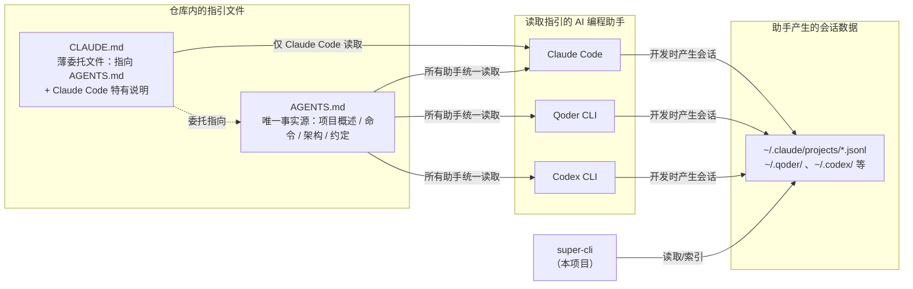
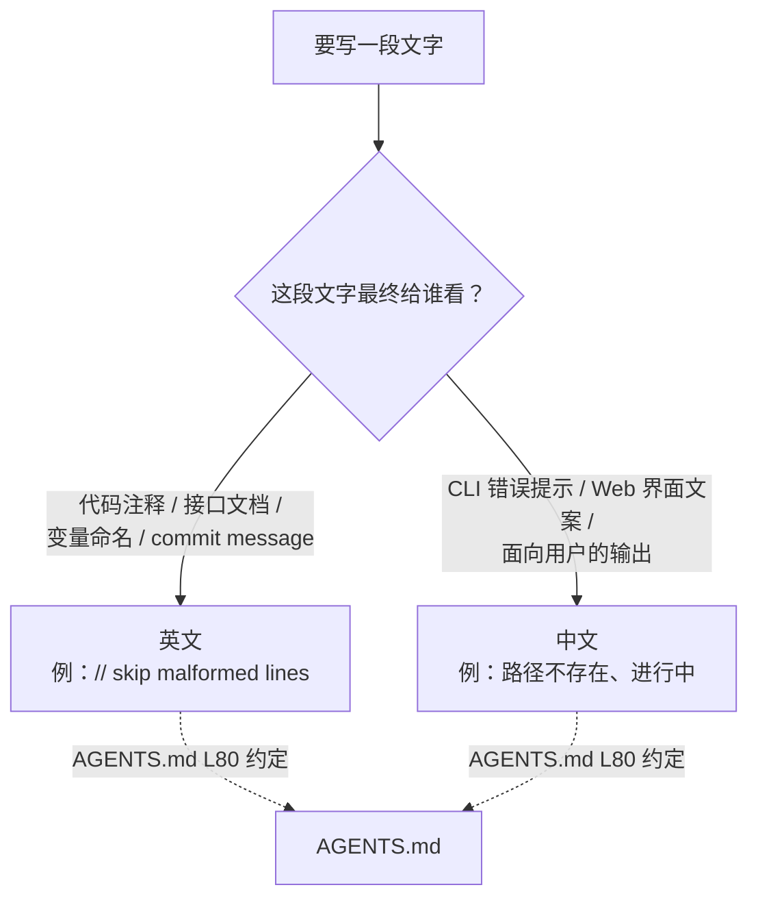

这个仓库存在一个有趣的"自指"关系：`super-cli` 是一个管理 AI 编程助手会话的工具，而它自己的开发过程，恰恰也是由这些 AI 助手（Claude Code、Qoder CLI、Codex CLI）参与完成的。为了让 AI 助手在仓库中"守规矩"，项目在根目录放置了 **AGENTS.md** —— 一份写给 AI 阅读的项目说明书；而 **CLAUDE.md** 则作为薄薄的入口，把 Claude Code 引导向 AGENTS.md。本文将拆解这两份文件的协作机制，逐条核对 AGENTS.md 中声明的编码约定在真实代码中的落地情况，并为初学者整理出一份可操作的实践清单。

Sources: [AGENTS.md](AGENTS.md#L1-L96), [CLAUDE.md](CLAUDE.md#L1-L15)

## 为什么需要 AGENTS.md：AI 协作开发的基础设施

当 AI 编程助手进入一个陌生仓库时，它面临的第一个问题是**上下文缺失**：不知道项目用什么技术栈、跑什么命令、遵循什么规范。如果每次都要靠人工口头说明，协作成本极高。AGENTS.md 解决的就是这个问题——它是一份放在仓库根目录的结构化说明文件，AI 助手在开始工作前会优先读取它，从而获得项目概述、常用命令、架构要点和编码约定。

在本仓库中，AGENTS.md 开篇即声明其用途："本文件为 AI agent 在本仓库中工作时提供指引"。它概括了 `super-cli` 的四大能力（会话索引与搜索、任务命名与标签、CLI 模式、Web 模式），并明确了一个关键的架构约束：**无数据库、无外部 API 调用**——直接读取 `~/.claude/`、`~/.qoder/`、`~/.codex/` 下的 JSONL 文件，仅在 `~/.super-cli/config.json` 中存储用户配置。这一句"负面声明"对 AI 助手尤其重要：它从源头上阻止了 AI 在实现新功能时擅自引入数据库依赖或网络调用。

Sources: [AGENTS.md](AGENTS.md#L1-L14)

## AGENTS.md 与 CLAUDE.md 的关系：单一事实源（Single Source of Truth）

如果一个项目同时被 Claude Code、Qoder CLI、Codex CLI 三种助手使用，是否需要为每种助手写一份指引？本仓库的回答是：**不需要**。项目采用"单一事实源 + 薄委托文件"的模式——所有通用指引统一维护在 AGENTS.md，而各助手的专属入口文件（如 CLAUDE.md）只做两件事：声明委托关系、补充该助手特有的注意事项。

CLAUDE.md 中的委托声明非常明确："本项目的通用 agent 指引（适用于 Claude Code、Qoder CLI、Codex CLI 及其他 AI agent）统一维护在 AGENTS.md，请先阅读该文件"。同时它给出一条维护纪律："如需修改项目指引，请编辑 AGENTS.md，不要在 CLAUDE.md 中重复内容"——这条规则防止了多份文件之间的内容漂移（drift），即随着时间推移各副本逐渐不一致的问题。

Sources: [CLAUDE.md](CLAUDE.md#L5-L13)

这一模式的整体协作关系可以用下图表示。注意图中的一个回环：`super-cli` 管理的会话数据（`~/.claude/projects/` 下的 JSONL）正是这些 AI 助手开发本项目时产生的——项目在"吃自己的狗粮"（dogfooding）。CLAUDE.md 甚至专门提示："在开发本项目时可直接使用自身功能验证"。



Sources: [CLAUDE.md](CLAUDE.md#L11-L14), [AGENTS.md](AGENTS.md#L64-L64)

## AGENTS.md 的内容解剖：八个小节各司其职

AGENTS.md 全文 96 行，结构紧凑。对初学者而言，理解每个小节的**服务对象**（是给 AI 的操作指令，还是给人看的背景知识）比逐字阅读更有价值：

| 小节 | 核心内容 | 主要作用 |
|---|---|---|
| 项目概述 | 四大功能 + "无数据库、无外部 API"边界声明 | 让 AI 快速建立心智模型，划定实现禁区 |
| 开发环境 | TypeScript 5.x strict、Node ≥ 22、pnpm、tsup、Vitest、ESM | 技术栈清单，防止 AI 使用错误的工具或 API 版本 |
| 常用命令 | `pnpm build / dev / test / typecheck` 等 9 条命令 | AI 执行构建与验证时的"操作手册" |
| 项目结构 | `src/cli`、`src/core`、`src/server`、`src/web` 四层职责 | 告诉 AI 新代码应放在哪里（详见[仓库结构导览](4-cang-ku-jie-gou-dao-lan-cli-core-server-web-si-ceng-zhi-ze-hua-fen)） |
| 架构要点 | JSONL 路径规则、core 层共享、构建流程 | 解释模块间的依赖方向与数据流 |
| 多 Provider 设计 | `CliProvider` 联合类型 + providers.ts 注册表 | 新增 provider 时的扩展指引 |
| 约定 | ESM、strict、注释/提交语言规范、数据边界、路径别名 | **本文重点**，下文逐条验证 |
| CLI 命令参考 | 8 个子命令及其参数 | AI 生成文档或测试时的速查表 |

值得注意的是"常用命令"小节末尾的一行小字："运行单个测试文件：`pnpm test -- path/to/file.test.ts`"——这种细节正是 AGENTS.md 区别于 README 的地方：README 面向人类用户的安装使用，而 AGENTS.md 面向需要在仓库中**动手改代码**的 AI，因此更关注验证与迭代循环（命令细节另见[开发环境与常用命令](3-kai-fa-huan-jing-yu-chang-yong-ming-ling-pnpm-dev-dev-web-test-typecheck-build)）。

Sources: [AGENTS.md](AGENTS.md#L16-L41), [AGENTS.md](AGENTS.md#L43-L96)

## 核心编码约定逐条验证：声明 vs 代码实况

AGENTS.md 的"约定"小节是全文件最关键的 8 行。秉承"零猜测"原则，下表将每条约定与代码中的实际证据逐一对照，其中两处存在**声明与现状的差异**，对初学者尤其需要明辨：

| 约定 | 声明位置 | 代码证据 | 验证结果 |
|---|---|---|---|
| 全程 ESM，import 使用 `.js` 扩展名 | AGENTS.md L77 | `src/cli/index.ts` 中所有导入均为 `./commands/list.js` 形式 | ✅ 严格执行 |
| TypeScript strict 模式 | AGENTS.md L78 | `tsconfig.json` 中 `"strict": true` | ✅ 严格执行 |
| `tsc --noEmit` 不含 `src/web/` | AGENTS.md L78 | tsconfig 的 `exclude` 明确排除 `src/web` | ✅ 严格执行 |
| Commit message 英文祈使句 | AGENTS.md L79 | git 历史：`feat: add support for kimi...`、`fix: correct license...` | ✅ 严格执行（Conventional Commits 风格） |
| 注释英文 / 用户字符串可中文 | AGENTS.md L80 | `session-reader.ts` 注释为英文；`terminal-launcher.ts` 错误消息、`App.tsx` 界面标签为中文 | ✅ 双轨并行 |
| 只读 JSONL，只写 `~/.super-cli/config.json` | AGENTS.md L81 | 与架构声明一致，无数据库依赖 | ✅ 边界清晰 |
| `@core/*` 等路径别名由 tsup 解析 | AGENTS.md L82 | tsconfig 已定义别名，**但 src 下实际全部使用相对导入** | ⚠️ 已定义、暂未使用 |
| Vitest 测试 | AGENTS.md L36 | `package.json` 配有 vitest 脚本，**但仓库当前无任何 `.test.ts` 文件** | ⚠️ 已配置、暂无测试 |

Sources: [AGENTS.md](AGENTS.md#L75-L82), [src/cli/index.ts](src/cli/index.ts#L3-L10), [tsconfig.json](tsconfig.json#L6-L24), [src/core/session-reader.ts](src/core/session-reader.ts#L49-L49), [src/core/terminal-launcher.ts](src/core/terminal-launcher.ts#L40-L40), [src/web/src/App.tsx](src/web/src/App.tsx#L31-L35)

### 约定一：ESM 与 `.js` 扩展名——最容易踩的坑

Node.js 的 ESM 模块系统要求导入语句使用**完整文件名**。由于 TypeScript 编译后 `.ts` 文件会变成 `.js`，因此源码中的相对导入必须写 `.js` 扩展名，否则运行时报错。AGENTS.md 将此列为第一条约定，CLI 入口的实际写法可作范本：

```typescript
// src/cli/index.ts —— 正确写法（编译后路径有效）
import { registerListCommand } from './commands/list.js';
import { registerShowCommand } from './commands/show.js';
```

配套的模块配置在 `tsconfig.json` 中一锤定音：`"module": "NodeNext"` + `"moduleResolution": "NodeNext"`，这是 Node ESM 项目最严格的模块解析模式；`package.json` 的 `"type": "module"` 则声明整个包按 ESM 运行；构建侧由 tsup 以 `format: ['esm']`、`target: 'node22'` 输出产物。四处配置环环相扣，缺一不可。

Sources: [src/cli/index.ts](src/cli/index.ts#L3-L10), [tsconfig.json](tsconfig.json#L3-L6), [package.json](package.json#L5-L5), [tsup.config.ts](tsup.config.ts#L8-L9)

### 约定二：strict 模式与"双轨"类型检查

`"strict": true` 意味着所有严格检查（null 安全、隐式 any 等）全部开启，AI 生成的代码若存在类型漏洞会在 `pnpm typecheck` 时被拦截。但本项目有一个容易被误解的细节：**根 tsconfig 的 `exclude` 排除了 `src/web`**。原因在于前端 SPA 有独立的 Vite 构建流水线（自带 `src/web/tsconfig.json`），两套检查体系互不干扰——Node 端用 `tsc --noEmit` 严格把关，前端由 Vite/Vitest 处理。初学者运行 `pnpm typecheck` 后发现改动的前端文件未被检查，这不是 bug，而是设计使然（构建流水线详见[双构建流水线](23-shuang-gou-jian-liu-shui-xian-tsup-da-bao-node-duan-yu-vite-da-bao-qian-duan-spa)，类型系统详见[共享类型系统、ESM 模块规范与路径别名约定](24-gong-xiang-lei-xing-xi-tong-esm-mo-kuai-gui-fan-yu-lu-jing-bie-ming-yue-ding)）。

Sources: [tsconfig.json](tsconfig.json#L23-L24), [AGENTS.md](AGENTS.md#L78-L78)

### 约定三：语言双轨政策——注释英文，用户可见字符串中文

这条约定用一句话概括：**写给开发者看的用英文，写给最终用户看的用中文**。它的判断标准不是"文件在哪一层"，而是"字符串最终呈现给谁"。三个真实案例可以说明这条边界的弹性：

- `src/core/session-reader.ts` 位于数据层，内部注释 `// skip malformed lines` 是给开发者的，所以用英文；
- `src/core/terminal-launcher.ts` 同样在 core 层，但它返回的错误消息 `路径不存在: ${cwd}` 会直接展示给终端用户，所以用中文；
- `src/web/src/App.tsx` 的看板状态标签（`进行中`、`待复查`、`待办`、`已完成`、`已取消`）是界面文案，用中文。



Sources: [AGENTS.md](AGENTS.md#L80-L80), [src/core/session-reader.ts](src/core/session-reader.ts#L49-L49), [src/core/terminal-launcher.ts](src/core/terminal-launcher.ts#L40-L40), [src/web/src/App.tsx](src/web/src/App.tsx#L31-L35)

### 约定四：提交规范——Conventional Commits 风格

AGENTS.md 要求 "Commit message 用英文，祈使句风格"（imperative mood，如 `add` 而非 `added`/`adds`）。仓库的 git 历史忠实地执行了这一点，且在实践中进一步采用了 Conventional Commits 前缀：`feat:`（新功能）、`fix:`（修复）、`docs:`（文档）、`chore:`（杂务）。初学者提交时可参照 `feat: add support for kimi, pi, opencode, workbuddy, and traecode cli providers` 这样的句式——前缀 + 冒号 + 英文祈使句描述。

Sources: [AGENTS.md](AGENTS.md#L79-L79)

### 约定五：数据边界——只读三个目录，只写一个文件

AGENTS.md 反复强调数据边界（概述与约定两处均有提及）：**读取**各 CLI 助手的 home 目录（`~/.claude/`、`~/.qoder/`、`~/.codex/` 等），**写入**仅限 `~/.super-cli/config.json`。这条约定决定了 `src/core/` 层的设计基调是"纯读取逻辑，不依赖 HTTP 或 CLI 框架"。对 AI 助手而言，这是一条护栏：任何新功能都不得向 JSONL 会话文件回写数据，也不得引入 SQLite 等持久化方案。数据的实际写入由 `task-store.ts` 单点负责（详见[TaskStore 标签持久化](11-taskstore-biao-qian-chi-jiu-hua-yu-yong-hu-pei-zhi-cun-chu-super-cli-config-json)）。

Sources: [AGENTS.md](AGENTS.md#L14-L14), [AGENTS.md](AGENTS.md#L81-L81), [AGENTS.md](AGENTS.md#L48-L48)

## 多 Provider 约定：注册表驱动的扩展模式

AGENTS.md 的"多 Provider 设计"小节给出了一个对扩展至关重要的类型定义：`CliProvider` 是一个包含 8 个字面量的联合类型（`'claude-code' | 'qoder' | 'codex' | 'kimi' | 'pi' | 'opencode' | 'workbuddy' | 'traecode'`）。新增一个 provider 的完整动作清单因此变得机械化：在 `types.ts` 的联合类型中追加字面量，在 `providers.ts` 的 `PROVIDER_CONFIGS` 数组中注册一项 `ProviderConfig`（含 `id`、`command`、`newArgs`、`resumeArgs`、`homeDir` 五个字段），其余代码通过 `getAllProviders()` / `getAvailableProviders()` / `getProvider()` 三个查询函数自动获得新 provider 的能力——无需修改任何消费方代码。

| 字段 | 含义 | 示例（claude-code） |
|---|---|---|
| `id` | 对应 `CliProvider` 联合类型成员 | `'claude-code'` |
| `command` | 启动该 CLI 的终端命令 | `'claude'` |
| `newArgs` | 新建会话的参数 | `['--dangerously-skip-permissions']` |
| `resumeArgs` | 恢复会话的参数（函数，接收 sessionId） | `(id) => ['--resume', id]` |
| `homeDir` | 该 CLI 的数据目录 | `~/.claude` |

Sources: [AGENTS.md](AGENTS.md#L71-L73), [src/core/types.ts](src/core/types.ts#L1-L1), [src/core/providers.ts](src/core/providers.ts#L6-L13), [src/core/providers.ts](src/core/providers.ts#L78-L99)

注册表模式的完整设计意图与各 provider 的差异分析，建议继续阅读[多 Provider 架构：Claude Code、Qoder、Codex 的注册表设计](5-duo-provider-jia-gou-claude-code-qoder-codex-de-zhu-ce-biao-she-ji)。

## 两处"声明与现状"的差异：初学者必读

文档描述的是**目标状态**，代码反映的是**当前状态**，两者偶尔存在时间差。诚实面对这一点，比假装完全一致更有价值。本仓库目前有两处差异：

**其一，路径别名已定义但未使用。** tsconfig.json 中定义了 `@core/*`、`@cli/*`、`@server/*` 三个别名（AGENTS.md 声称"由 tsup 在构建时解析"），但检索整个 `src` 目录，所有导入实际都使用相对路径加 `.js` 扩展名的写法。别名是**可用的能力**，而非**强制的风格**——初学者遇到两种写法都不必困惑，但新代码应保持与现有代码一致的相对导入风格，避免混用。

**其二，测试框架已配置但暂无测试文件。** `package.json` 声明了 `"test": "vitest"`，AGENTS.md 也写明测试运行方式，但仓库当前不存在任何 `.test.ts` 文件。这意味着 `pnpm test` 目前会空跑（Vitest 找不到测试即退出）。这不是"测试不重要"，而是项目处于早期阶段——为新增模块补充 Vitest 测试，正是符合 AGENTS.md 精神的贡献方向（测试体系详见[测试策略与 TypeScript 类型检查流程](25-ce-shi-ce-lue-yu-typescript-lei-xing-jian-cha-liu-cheng)）。

Sources: [tsconfig.json](tsconfig.json#L16-L21), [AGENTS.md](AGENTS.md#L82-L82), [package.json](package.json#L32-L32), [AGENTS.md](AGENTS.md#L36-L36)

## 如何维护这份指引：面向贡献者的操作指南

AGENTS.md 不是一次性写就的静态文档，而是随项目演进的活文档。git 历史显示最近的 provider 扩展（新增 kimi、pi、opencode、workbuddy、traecode 五个 provider）同步更新了 AGENTS.md 的 provider 清单——**代码变更与指引变更应在同一次提交中完成**。维护时的核心纪律只有三条：

1. **改 AGENTS.md，不改 CLAUDE.md**：所有通用指引（命令、架构、约定）写入 AGENTS.md；CLAUDE.md 只保留委托声明和 Claude Code 特有内容，绝不复制正文；
2. **命令必须与 package.json 的 scripts 逐字对应**：AI 会照抄 AGENTS.md 中的命令执行，命令过期会导致 AI 执行失败；
3. **约定条目要能被验证**：每条约定最好附带代码中的锚点（如 AGENTS.md 中"见 `paths.ts:encodeProjectPath`"的写法），让 AI 和人都能快速定位实现。

顺带一提，仓库中的 `.qoder/settings.local.json` 展示了另一种 agent 配置形态：它记录的是 Qoder CLI 在本项目中获得的工具权限（如允许执行的 Bash 命令），与 AGENTS.md 的"项目说明书"角色互补——前者管"能做什么"，后者管"该怎么做"。这类文件属于本地工具状态，不进入协作约定的范畴。

Sources: [CLAUDE.md](CLAUDE.md#L12-L12), [AGENTS.md](AGENTS.md#L65-L65), [.qoder/settings.local.json](.qoder/settings.local.json#L1-L7)

## 初学者实践清单

将全文收敛为一张可勾选的清单，无论是人类贡献者还是 AI 助手，动手改代码前对照执行即可：

| 阶段 | 检查项 | 对应命令 / 位置 |
|---|---|---|
| 写代码前 | 阅读 AGENTS.md，确认技术栈与数据边界 | [AGENTS.md](AGENTS.md#L1-L96) |
| 写代码时 | 相对导入带 `.js` 扩展名；注释英文、用户字符串中文 | [AGENTS.md](AGENTS.md#L77-L80) |
| 新增 provider | 更新 `CliProvider` 类型 + `PROVIDER_CONFIGS` 注册表 | [src/core/types.ts](src/core/types.ts#L1-L1) |
| 提交前 | `pnpm typecheck` 通过（Node 端）；前端单独由 Vite 处理 | [package.json](package.json#L34-L34) |
| 提交时 | 英文祈使句 + Conventional Commits 前缀 | [AGENTS.md](AGENTS.md#L79-L79) |
| 改了指引 | 只改 AGENTS.md，CLAUDE.md 保持委托结构 | [CLAUDE.md](CLAUDE.md#L12-L12) |

**下一步阅读建议**：理解约定之后，建议按两条路径深入——想了解约定背后的模块组织，读[仓库结构导览：cli / core / server / web 四层职责划分](4-cang-ku-jie-gou-dao-lan-cli-core-server-web-si-ceng-zhi-ze-hua-fen)；想看"Agent 友好"理念在接口设计上的延伸，读[Agent 友好的 --json 结构化输出约定与终端格式化输出](13-agent-you-hao-de-json-jie-gou-hua-shu-chu-yue-ding-yu-zhong-duan-ge-shi-hua-shu-chu)——那正是本页所述协作哲学在产品层的镜像：一个项目如何同时服务人类用户与 AI 用户。