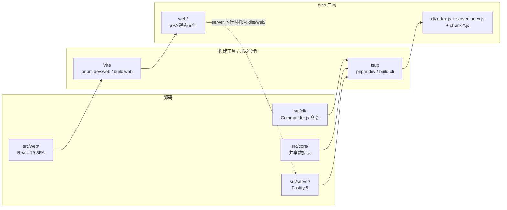
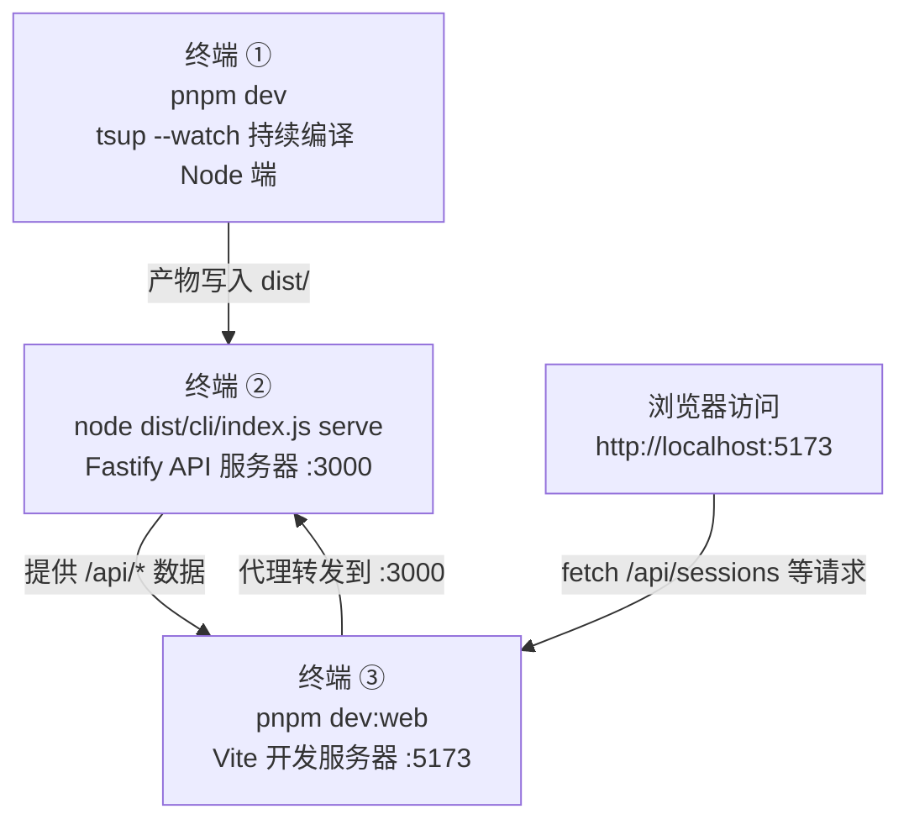

本页面向初次接触 super-cli 仓库的开发者，说明搭建开发环境所需的版本要求，并逐一拆解 `package.json` 中定义的核心脚本——`dev`、`dev:web`、`test`、`typecheck`、`build`——各自的底层执行内容、适用场景与产物位置。读完本页，你将能够独立跑通"修改代码 → 热编译 → 本地验证 → 完整构建"的完整开发循环。

## 环境准备：版本要求与首次安装

super-cli 对运行环境有三项硬性要求，均在仓库配置中显式声明：**Node.js >= 22**（通过 `package.json` 的 `engines` 字段强制约束，低于该版本可能在语法特性或内置模块行为上出现不兼容）；**pnpm 包管理器**（仓库提供 `pnpm-lock.yaml` 锁文件，团队统一使用 pnpm 以保证依赖解析一致）；**TypeScript 5.x strict 模式**（由根 `tsconfig.json` 开启，`@types/node` 等类型依赖已在 devDependencies 中就位）。此外项目声明了 `"type": "module"`，即全程使用 **ESM 模块系统**，这一点会在你编写 import 语句时直接感受到——相对路径导入需要携带 `.js` 扩展名。

| 环境项 | 要求 | 声明位置 |
|---|---|---|
| Node.js | `>= 22.0.0` | `package.json` 的 `engines` 字段 |
| 包管理器 | pnpm | `pnpm-lock.yaml` + 文档约定 |
| TypeScript | 5.x（strict） | 根 `tsconfig.json` |
| 模块系统 | ESM（`"type": "module"`） | `package.json` |
| 前端运行时 | React 19 + Vite 6 | devDependencies |

首次搭建只需三条命令：`pnpm install` 安装依赖，`pnpm build` 完整构建，`pnpm link --global` 将本地构建产物软链为全局命令 `super-cli`，此后即可在任何目录直接使用本地开发版本进行验证。README 中的本地开发说明与这一流程完全一致。

Sources: [package.json](package.json#L5) [package.json](package.json#L45-L47) [tsconfig.json](tsconfig.json#L6) [README.md](README.md#L51-L57)

## 命令总览：一张表看懂全部脚本

仓库的全部开发命令定义在 `package.json` 的 `scripts` 字段中，共 9 条。其中最核心的五个命令构成日常开发的主干：`dev` 负责 Node 端（CLI + Server）的持续编译，`dev:web` 负责前端的开发服务器，`typecheck` 与 `test` 负责质量把关，`build` 负责产出可发布物。

| 命令 | 实际执行 | 作用 | 产物 / 影响范围 |
|---|---|---|---|
| `pnpm install` | — | 安装全部依赖 | `node_modules/` |
| `pnpm dev` | `tsup --watch` | Node 端持续编译（改代码自动重建产物） | `dist/` |
| `pnpm dev:web` | `vite dev --config src/web/vite.config.ts` | 前端开发服务器 + API 代理 | 无磁盘产物（内存构建） |
| `pnpm test` | `vitest` | 运行测试 | — |
| `pnpm typecheck` | `tsc --noEmit` | 类型检查（**不含** `src/web/`） | 无输出文件 |
| `pnpm build` | `pnpm build:cli && pnpm build:web` | 完整构建（两段流水线串联） | `dist/` 全量 |
| `pnpm build:cli` | `tsup` | 仅构建 CLI + Server | `dist/cli/`、`dist/server/` |
| `pnpm build:web` | `vite build --config src/web/vite.config.ts` | 仅构建前端 SPA | `dist/web/` |
| `pnpm start` | `node dist/cli/index.js` | 运行构建产物 | — |

理解这些命令的关键，是认识到本项目存在**两条独立的构建流水线**，分别服务于两类源码。下图中，左侧是两条源码路径（`tsup` 管线的入口是 `src/cli/index.ts` 与 `src/server/index.ts`，共享 `src/core/` 数据层；Vite 管线的根目录是 `src/web/`），中间是构建工具，右侧是统一的 `dist/` 产物目录。`dev` / `build:cli` 走 tsup 管线，`dev:web` / `build:web` 走 Vite 管线，`build` 则把两条管线串联执行。



两条管线在**运行时**而非构建时汇合：Fastify 服务器启动时会探测自身相对路径下的 `web/` 目录，若存在则以静态资源方式托管整个 SPA。这意味着"单进程全栈部署"的前提是 `pnpm build` 已经把两部分产物都生成到位。

Sources: [package.json](package.json#L26-L36) [tsup.config.ts](tsup.config.ts#L4-L7) [src/web/vite.config.ts](src/web/vite.config.ts#L7-L10) [src/server/index.ts](src/server/index.ts#L33-L44)

## pnpm dev：Node 端（CLI + Server）开发模式

执行 `pnpm dev` 实际运行的是 `tsup --watch`。tsup 的配置文件 `tsup.config.ts` 声明了两个入口——`src/cli/index.ts` 和 `src/server/index.ts`——以 ESM 格式编译，目标为 `node22` 平台，开启代码分割（`splitting: true`），输出到根目录 `dist/`。watch 模式下，你每次保存 `src/cli/`、`src/core/`、`src/server/` 中的文件，tsup 都会增量重建对应产物。

对于初学者有一个**必须理解的行为边界**：`tsup --watch` 只负责"重新编译产物"，它**不会自动重启正在运行的 Node 进程**。也就是说，watch 进程与你要测试的 CLI/Server 是两个独立进程——前者持续把 `src/` 变化写入 `dist/`，后者是你手动启动的 `node dist/cli/index.js ...`。当你修改了 Server 代码后，需要重新执行一次启动命令才能看到效果（CLI 命令由于每次执行都是新进程，天然不受此影响）。

典型用法是在一个终端常驻 `pnpm dev`，需要验证时另开终端执行 `pnpm start list`（等价于 `node dist/cli/index.js list`）或 `pnpm start serve` 快速调用最新编译产物。另一个细节是 tsup 配置中 `external: ['react', 'react-dom']`——Node 端产物不打包 React，这两个依赖只属于前端管线。

Sources: [package.json](package.json#L30) [package.json](package.json#L33) [tsup.config.ts](tsup.config.ts#L3-L17) [AGENTS.md](AGENTS.md#L34)

## pnpm dev:web：前端开发服务器与全栈联调

执行 `pnpm dev:web` 实际运行的是 `vite dev --config src/web/vite.config.ts`。这份独立于根目录的 Vite 配置做了三件事：将构建根目录设为 `src/web/`（React SPA 的源码世界）；配置开发代理——**所有 `/api/*` 请求自动转发到 `http://localhost:3000`**；并启用 React 插件获得 JSX 热更新（HMR）能力。Vite 开发服务器默认监听 5173 端口（配置中未覆盖该默认值），提供毫秒级的热模块替换，前端改代码无需手动刷新。

代理配置的存在解释了一个初学者最容易踩的坑：**单独运行 `pnpm dev:web` 时，页面能打开但所有数据为空**。原因是前端代码中所有 API 请求都以 `/api` 为基址（定义在 `src/web/src/api/client.ts` 的 `API_BASE` 常量），这些请求在开发模式下被代理到 `localhost:3000`——而这正是 `super-cli serve` 命令的默认端口。若该端口没有运行后端，代理必然失败。

因此**全栈开发的正确姿势是三终端协作**，流程如下：



三个终端各司其职：终端①保证 `dist/` 中的 Node 产物始终最新（改后端代码后需在终端②重启服务）；终端②运行真实的 Fastify 服务器，`serve` 命令的端口默认值就是 `3000`，与代理目标严格对应；终端③提供带 HMR 的前端环境。若你使用了非默认端口启动后端（`--port` 参数），记得同步调整 Vite 配置中的代理目标，否则联调必然失败。

Sources: [package.json](package.json#L31) [src/web/vite.config.ts](src/web/vite.config.ts#L5-L17) [src/web/src/api/client.ts](src/web/src/api/client.ts#L1-L10) [src/cli/commands/serve.ts](src/cli/commands/serve.ts#L8-L10) [AGENTS.md](AGENTS.md#L35)

## pnpm typecheck：双 tsconfig 的类型检查体系

执行 `pnpm typecheck` 实际运行的是 `tsc --noEmit`，即只做类型检查、不产出任何文件。它有一个初学者必须知道的**作用域限定**：根 `tsconfig.json` 的 `include` 只覆盖 `src/**/*.ts`，且 `exclude` 中**显式排除了 `src/web`**——换句话说，这条命令检查的是 CLI、core、Server 三层 Node 端代码，**不检查任何前端代码**。

前端拥有自己独立的类型配置 `src/web/tsconfig.json`，两者差异显著：

| 配置维度 | 根 tsconfig.json（Node 端） | src/web/tsconfig.json（前端） |
|---|---|---|
| module / 解析策略 | `NodeNext` / `NodeNext` | `ESNext` / `bundler` |
| DOM 类型库 | 无（纯 Node 环境） | 含 `DOM`、`DOM.Iterable` |
| JSX 支持 | 不涉及 | `react-jsx` |
| 产物声明 | `declaration: true` + `sourceMap` | `noEmit: true`（纯检查用） |
| 路径别名 | `@core/*`、`@cli/*`、`@server/*` | 未定义 |
| 检查入口 | `pnpm typecheck` | 需手动执行 `npx tsc -p src/web/tsconfig.json` |

这套双 tsconfig 设计的根本原因在于**两类代码的目标运行环境完全不同**：Node 端跑在服务器上没有 DOM，前端跑在浏览器里需要 DOM 类型；Node 端的 ESM 解析规则（要求显式 `.js` 扩展名）与 Vite 的 bundler 式解析规则互斥。仓库没有为前端类型检查定义专用脚本，若需检查前端代码，直接执行 `npx tsc -p src/web/tsconfig.json` 即可（该配置本身已是 `noEmit`，不会产生副作用）。建议在提交前把两套检查都跑一遍。

Sources: [package.json](package.json#L34) [tsconfig.json](tsconfig.json#L3-L24) [src/web/tsconfig.json](src/web/tsconfig.json#L3-L14) [AGENTS.md](AGENTS.md#L37)

## pnpm test：Vitest 测试体系现状与用法

执行 `pnpm test` 实际运行的是 `vitest`。Vitest 已被声明为 devDependency（`^3.2.1`），但需要如实告知初学者的一个现状是：**仓库当前尚无任何 `*.test.ts` 测试文件，也没有 vitest 配置文件**——这条命令属于"基础设施已就绪、测试用例待补充"的状态。Vitest 默认按文件名约定（`*.test.ts` / `*.spec.ts`）发现测试，直接运行 `pnpm test` 会提示找不到测试文件，这属于预期行为而非环境故障。

关于 Vitest 的两个实用行为值得提前了解：其一，`vitest` 裸命令在交互式终端中默认进入 **watch 模式**（文件变化自动重跑受影响的测试），适合开发过程中常驻；其二，运行单个测试文件的标准写法是**在命令后用 `--` 传递路径**：`pnpm test -- path/to/file.test.ts`，这一用法在 AGENTS.md 中有明确记载。随着测试文件逐渐落地，这条命令将承担回归验证的职责。

Sources: [package.json](package.json#L32) [package.json](package.json#L61-L76) [AGENTS.md](AGENTS.md#L41) [README.md](README.md#L132)

## pnpm build：完整构建与产物结构

执行 `pnpm build` 时，实际发生的是两条构建命令的**串联执行**：先 `pnpm build:cli`（tsup 一次性构建，配置了 `clean: true` 会先清空 `dist/`），再 `pnpm build:web`（Vite 构建，`emptyOutDir: true` 清空 `dist/web/` 后写入 SPA 静态文件）。构建完成后的 `dist/` 目录结构如下：

```
dist/
├── cli/
│   └── index.js          # super-cli 可执行入口（对应 package.json 的 bin 字段）
├── server/
│   └── index.js          # Fastify 服务器入口
├── chunk-*.js            # 代码分割产物（tsup splitting: true 的结果，
│                         #   CLI 与 Server 共享的 core 模块被抽为公共块）
└── web/                  # Vite 构建的 React SPA
    └── index.html + 静态资源
```

理解这个结构需要回到 `package.json` 的三处声明：`bin` 字段把 `dist/cli/index.js` 注册为全局命令 `super-cli`；`files` 字段限定 npm 发布时只携带 `dist/cli`、`dist/server`、`dist/web`、`dist/chunk-*.js` 及文档；`prepublishOnly` 钩子（值为 `pnpm build`）保证每次执行 `npm publish` 前自动重新完整构建，杜绝"发布旧产物"的事故。产物分层与源码四层结构（cli / core / server / web）一一呼应，其中 `dist/web` 由 Server 在运行时按需托管——这也解释了为什么只有 `build:cli` 产物、没有 `build:web` 产物时，`super-cli serve` 启动的服务器能跑 API 但页面 404。

Sources: [package.json](package.json#L6-L17) [package.json](package.json#L27-L35) [tsup.config.ts](tsup.config.ts#L11-L15) [src/web/vite.config.ts](src/web/vite.config.ts#L8-L10)

## 日常开发循环与故障排查

综合以上各节，推荐的日常开发循环是：**改代码前先跑 `pnpm typecheck` 确认基线干净 → 修改源码 → Node 端改动靠常驻的 `pnpm dev` 自动重编译（重启运行中的 Server 后生效）→ 前端改动靠 `pnpm dev:web` 的 HMR 即时生效 → 提交前跑 `pnpm build` 验证完整构建通过**。若在本地做端到端验证，配合 `pnpm link --global` 后的 `super-cli` 命令直接对真实数据（`~/.claude/` 等目录）执行操作——super-cli 本身就是 Claude Code 会话管理工具，用它管理自己的开发会话是官方推荐的验证方式。

初学者最常遇到的五类问题及对策：

| 症状 | 根本原因 | 解决方案 |
|---|---|---|
| `dev:web` 页面打开但无数据 | 后端未在 :3000 运行，`/api` 代理失败 | 先在另一终端启动 `node dist/cli/index.js serve` |
| 改了 Server 代码但接口行为不变 | `tsup --watch` 只重编译，不重启进程 | 重新执行 serve 启动命令 |
| `typecheck` 不报前端的错 | 根 tsconfig 显式 `exclude: src/web` | 前端单独跑 `npx tsc -p src/web/tsconfig.json` |
| `pnpm test` 提示无测试文件 | 仓库暂无 `*.test.ts`，属预期现状 | 无需处理；新增测试后即可正常发现 |
| `super-cli serve` 页面 404 | 只跑了 `build:cli`，`dist/web` 为空 | 执行完整 `pnpm build` |

Sources: [README.md](README.md#L136-L145) [AGENTS.md](AGENTS.md#L28-L41) [CLAUDE.md](CLAUDE.md#L14)

## 下一步阅读

至此，你已掌握 super-cli 的全部开发命令及其背后的双流水线结构。按照目录顺序，建议继续阅读：

1. **[仓库结构导览：cli / core / server / web 四层职责划分](4-cang-ku-jie-gou-dao-lan-cli-core-server-web-si-ceng-zhi-ze-hua-fen)** —— 本页提到的两条构建管线对应的两类源码，其内部职责与依赖方向在此展开；
2. **[双构建流水线：tsup 打包 Node 端与 Vite 打包前端 SPA](23-shuang-gou-jian-liu-shui-xian-tsup-da-bao-node-duan-yu-vite-da-bao-qian-duan-spa)** —— 深入理解本页两张配置文件（`tsup.config.ts` / `vite.config.ts`）的每一项参数；
3. **[共享类型系统、ESM 模块规范与路径别名约定](24-gong-xiang-lei-xing-xi-tong-esm-mo-kuai-gui-fan-yu-lu-jing-bie-ming-yue-ding)** —— 解释双 tsconfig 体系背后的类型设计与 `@core/*` 别名机制；
4. **[测试策略与 TypeScript 类型检查流程](25-ce-shi-ce-lue-yu-typescript-lei-xing-jian-cha-liu-cheng)** —— 了解 Vitest 体系的设计规划与检查流程细节；
5. **[编码约定与 AGENTS.md：面向 AI Agent 的协作开发指南](26-bian-ma-yue-ding-yu-agents-md-mian-xiang-ai-agent-de-xie-zuo-kai-fa-zhi-nan)** —— 动手写代码前，先熟悉仓库的 ESM、注释语言与提交规范约定。