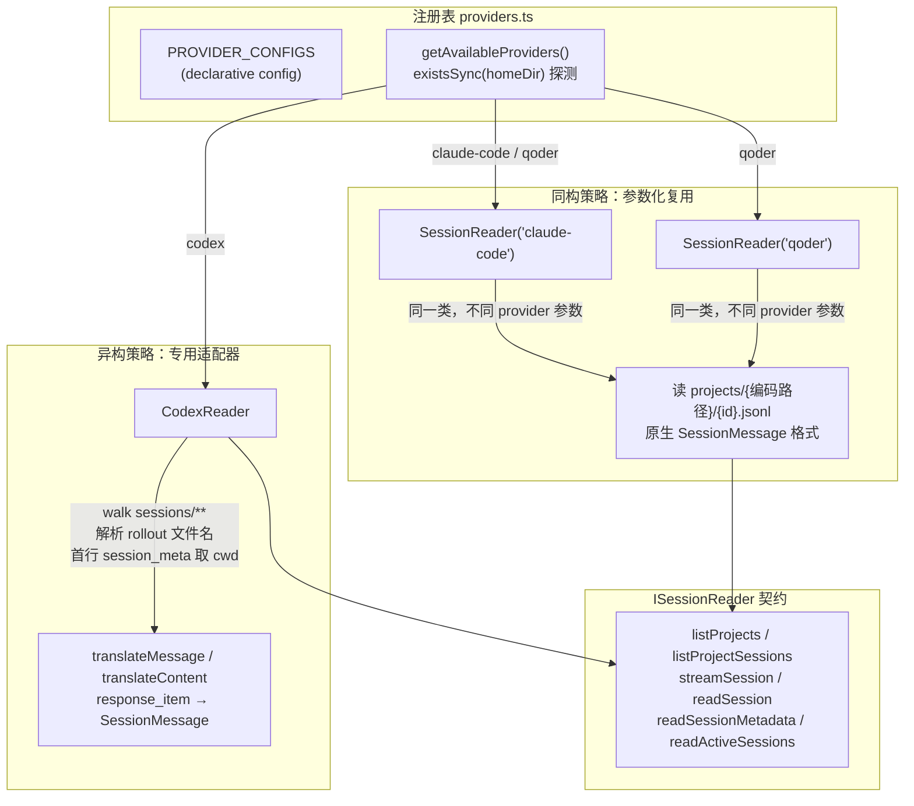

super-cli 的核心命题是：在一个统一的看板里管理三家彼此独立、数据格式互不兼容的 AI 编程助手——Claude Code、Qoder 与 Codex。支撑这一命题的架构基石，是一个仅 59 行的注册表模块 `src/core/providers.ts`：它以**声明式配置**描述每个 CLI 的身份、数据目录与启动命令，让上层代码通过统一的 `CliProvider` 判别联合类型访问异构数据源，而无需在业务逻辑中散落 `if (provider === 'codex')` 式的分支判断。本文将从注册表出发，逐层剖析类型层、路径层、读取器层、索引层与终端集成层如何围绕这一设计协作，并说明扩展第四个 Provider 时需要触碰的全部位置。

## 设计动机：三种 CLI，三套现实

理解这个注册表为什么存在，需要先看清它要抹平的三重差异。**数据布局不同**：Claude Code 与 Qoder 都把会话存放在 `~/{home}/projects/{编码后项目路径}/{sessionId}.jsonl`，而 Codex 采用 `~/.codex/sessions/**/rollout-{时间}-{id}.jsonl` 的扁平滚动文件，且没有按项目分目录。**命令行接口不同**：Claude Code 与 Qoder 用 `--resume {id}` 标志恢复会话，Codex 却是 `resume {id}` 子命令风格。**存在性不可假设**：用户机器上可能只装了其中一家或两家，架构必须在运行时探测哪些 Provider 实际可用。

这三重差异决定了注册表的形态：`homeDir` 字段既承担路径职责，也兼任可用性探针；`command`/`newArgs`/`resumeArgs` 把命令差异收敛为数据而非代码；而读取器层的"一套类参数化复用 + 一套专用适配器"分工，则对应了"两个同构 + 一个异构"的现实格局。

Sources: [providers.ts](src/core/providers.ts#L15-L40), [paths.ts](src/core/paths.ts#L14-L28), [codex-reader.ts](src/core/codex-reader.ts#L25-L52)

## 注册表核心：单一事实来源

整个多 Provider 能力都锚定在 `ProviderConfig` 接口与 `PROVIDER_CONFIGS` 常量数组上。每个条目声明五个字段：`id` 是判别联合类型 `CliProvider` 的成员，`name` 用于界面展示，`command` 是终端启动命令，`newArgs` 与 `resumeArgs` 分别描述新建和恢复会话的参数模板——其中 `resumeArgs` 是一个函数，接收 sessionId 生成参数数组。`homeDir` 在模块加载时通过 `join(homedir(), '.claude'|'.qoder'|'.codex')` 计算得出。

三个条目的对比清晰地展示了"声明式差异"如何替代"命令式分支"：

| 字段 | claude-code | qoder | codex |
|---|---|---|---|
| `command` | `claude` | `qodercli` | `codex` |
| `newArgs` | `--dangerously-skip-permissions` | `--dangerously-skip-permissions` | `[]`（无参数） |
| `resumeArgs(id)` | `--dangerously-skip-permissions --resume {id}` | `--dangerously-skip-permissions --resume {id}` | `resume {id}`（子命令风格） |
| `homeDir` | `~/.claude` | `~/.qoder` | `~/.codex` |
| 会话布局 | projects 按项目分目录 | projects 按项目分目录 | sessions 扁平滚动文件 |

注册表暴露四个查询函数，构成对外唯一 API：`getAllProviders()` 返回全部配置；`getAvailableProviders()` 用 `existsSync(p.homeDir)` 过滤出本机实际安装的 Provider，这是整个架构的**运行时激活机制**；`getProvider(id)` 按标识查找并在未命中时抛错；`getProviderHome(provider)` 提供路径捷径。值得注意的是，这个模块不导出任何类或可变状态——它是一份纯静态的配置数据加一组纯函数，天然线程安全且易于测试。

Sources: [providers.ts](src/core/providers.ts#L6-L13), [providers.ts](src/core/providers.ts#L15-L40), [providers.ts](src/core/providers.ts#L42-L58)

## 类型层：CliProvider 判别联合与实体维度标记

注册表的 `id` 字段来自 `types.ts` 首行定义的三值联合类型：`'claude-code' | 'qoder' | 'codex'`。这个类型随后被"盖章"到几乎所有数据实体上——`SessionMetadata.provider` 记录会话归属，`SkillInfo`、`McpServerInfo`、`RuleFile` 各自携带 provider 与 scope 双维度，`ListOptions.provider` 作为可选过滤条件贯穿 CLI 与 API 两层。尤其精妙的是 `ProjectInfo.providers: CliProvider[]`（复数形式）：一个磁盘上的项目可能同时被多家 CLI 使用过，索引层会用集合去重后聚合出该项目的 Provider 列表，这是跨工具统一看板得以成立的关键建模。

这种"实体携带来源标识"的模式，使得上层消费者（Web 前端、CLI 输出、REST API）无需理解底层数据来自哪个工具，只需读取 `provider` 字段即可完成分组展示或过滤。类型系统在此发挥了编译期护栏的作用：任何新增 Provider 必须先扩展 `CliProvider` 联合，TypeScript 会随即在所有 switch 或映射未穷尽处报错，防止遗漏。

Sources: [types.ts](src/core/types.ts#L1), [types.ts](src/core/types.ts#L55-L76), [types.ts](src/core/types.ts#L116-L126), [types.ts](src/core/types.ts#L149-L157), [types.ts](src/core/types.ts#L180-L210)

## 路径层：以 Provider 为参数的目录解析

`paths.ts` 是注册表的第一个消费者。`getCliHome(provider)` 直接委托给 `getProviderHome`，随后 `getProjectsDir`、`getSessionsDir`、`getHistoryPath` 等函数都以 provider 为可选参数（默认 `'claude-code'`），拼接出 `~/{providerHome}/projects` 等标准化路径。这层设计有一个务实的折衷：`getSessionDataDir()`、`getStatsCachePath()` 等函数仍硬编码 Claude Home——因为 super-cli 自身的缓存数据选择寄生在 `~/.claude` 下；而 `getCodexSessionsDir()` 则是专为 Codex 异构布局预留的专用入口，由 `CodexReader` 独占使用。

Sources: [paths.ts](src/core/paths.ts#L6-L32), [paths.ts](src/core/paths.ts#L51-L57)

## 读取器层：同构复用与异构适配的双策略

这是整个架构中最能体现工程判断力的一层。契约由 `ISessionReader` 接口定义——有趣的是，它被声明在消费方 `session-index.ts` 内部而非独立文件，包含 `provider` 判别属性和 `listProjects`、`listProjectSessions`、`streamSession`、`readSession`、`readSessionMetadata`、`readActiveSessions` 六个方法。`SessionReader` 与 `CodexReader` 都没有显式 `implements` 这个接口，依赖 TypeScript 结构化类型系统天然满足契约。

**同构侧**，`SessionReader` 是一个被参数化的单类：构造函数接收 `CliProvider` 并存为实例属性，之后所有目录解析都经 `getProjectsDir(this.provider)` 完成。由于 Claude Code 与 Qoder 的 JSONL 布局与消息格式完全同构，一个类实例化两次即可覆盖两者——`streamSession` 里的 `JSON.parse(line) as SessionMessage` 直通式解析，无需任何翻译。生成的元数据自动盖上 `provider: this.provider` 的来源戳。

**异构侧**，`CodexReader` 面对的是完全不同的世界：没有项目目录结构，只能递归遍历 `sessions` 下所有 `.jsonl`，从文件名正则 `rollout-[\dT-]+-(.+)\.jsonl` 提取 sessionId，再读首行的 `session_meta` 记录获取 `cwd` 来"逆向重建"项目归属。更关键的是消息格式的鸿沟——Codex 的 `response_item` 行必须经 `translateMessage` 翻译为统一的 `SessionMessage`，`translateContent` 则把 `input_text`/`output_text` 块过滤映射为标准 `text` 内容块，模型名通过追踪 `turn_context` 行的当前值补齐到 assistant 消息上。这实质上是一个教科书式的**适配器模式**：翻译层把异构数据源伪装成统一接口。

| 维度 | SessionReader（同构复用） | CodexReader（异构适配） |
|---|---|---|
| 类数量 | 1 个类，N 个实例 | 1 个类，1 个实例 |
| 项目发现 | readdir `projects/` 一级目录 | 递归 walk + 逐文件首行解析 |
| 会话定位 | 路径直接拼接 | 全量扫描后按 sessionId 模糊匹配 |
| 消息解析 | 直通 JSON.parse | translateMessage/translateContent 翻译 |
| provider 标记 | 构造函数注入 | 硬编码 `'codex' as const` |
| 性能特征 | 目录定位，O(1) 访问 | 首行扫描，代价较高但有索引层缓存兜底 |

Sources: [session-index.ts](src/core/session-index.ts#L9-L19), [session-reader.ts](src/core/session-reader.ts#L8-L52), [session-reader.ts](src/core/session-reader.ts#L62-L76), [codex-reader.ts](src/core/codex-reader.ts#L22-L52), [codex-reader.ts](src/core/codex-reader.ts#L117-L171)

## 索引层：可用性探测、读取器装配与跨源聚合

`SessionIndex` 是把注册表、读取器与统一缓存粘合在一起的枢纽。其构造函数的默认装配逻辑是整个架构的缩影：调用 `getAvailableProviders()` 拿到本机实际存在的 Provider，对每项应用一条分派规则——`p.id === 'codex' ? new CodexReader() : new SessionReader(p.id)`。注意这是全文**唯一一处**针对具体 Provider 的条件分支，且位置紧贴装配点而非业务逻辑深处；构造函数同时接受外部注入 readers 的可选参数，为测试提供了替身通道。

`buildIndex` 随后对读取器数组做双层遍历：外层逐 reader 调 `listProjects` + `listProjectSessions`，内层逐会话读元数据并写入以 sessionId 为键的全量 Map 缓存。由于缓存不分 Provider 混存，下游过滤极其简单——`getAllSessions` 收到 `options.provider` 时只需 `s.provider === options.provider` 一行筛选，这正是类型层"实体盖章"设计的兑现时刻。项目维度的聚合更进一步：`getProjects` 用 `providerSet: Set<CliProvider>` 去重合并同一磁盘项目在不同 Provider 下的会话，最终展开为 `ProjectInfo.providers[]` 数组。此外 `getReaderForProvider(provider)` 提供了从统一索引回溯到具体读取器的桥接，供需要原始消息流的场景（如全文搜索）使用。

Sources: [session-index.ts](src/core/session-index.ts#L41-L64), [session-index.ts](src/core/session-index.ts#L71-L100), [session-index.ts](src/core/session-index.ts#L102-L110), [session-index.ts](src/core/session-index.ts#L163-L198)

## 命令抽象：注册表如何驱动终端集成

注册表中 `command`/`newArgs`/`resumeArgs` 三个字段唯一的消费者是 `terminal-launcher.ts`。恢复会话时，`getProvider(provider)` 取回配置后调用 `providerConfig.resumeArgs(sessionId)` 拿到参数数组，拼成 `{command} {args...}` 的 shell 命令；新建会话时则判断 `newArgs.length` 决定是否追加参数（Codex 的空数组使其退化为裸命令）。这意味着接入一家新 CLI 的终端启动能力，只需要在注册表里写对三个字符串字段，终端层的五套适配（Ghostty/iTerm2/Terminal.app/Kitty/Warp）完全无需感知 Provider 差异——命令作为数据在管道中流动。

Sources: [terminal-launcher.ts](src/core/terminal-launcher.ts#L24-L26), [terminal-launcher.ts](src/core/terminal-launcher.ts#L43-L46)

## Harness 层扩散：可用性探测的第二个战场

Skills、MCP Servers、Rules、Hooks、Permissions 五个 Harness 读取器复用了同一套模式：函数签名接受可选的 `provider` 参数，未指定时则遍历 `getAvailableProviders()` 逐家扫描，把 `~/{home}/skills`、`~/{home}/settings.json` 等路径下的配置归一化为带 provider 标记的实体列表。以 `skill-reader.ts` 为例，`getSkills(provider?, projectPath?)` 在有参时构造单元素数组 `[{ id: provider, homeDir: ... }]`，无参时直接采用可用 Provider 列表——一个三元表达式完成了"定向查询"与"全量扫描"的模式切换。这套模式还支撑了跨 Provider 复制能力：`copySkill(fromProvider, toProvider, id)` 从源注册目录读取、写入目标目录，实现配置在工具间的迁移。

Sources: [skill-reader.ts](src/core/skill-reader.ts#L22-L30), [skill-reader.ts](src/core/skill-reader.ts#L73-L90), [skill-reader.ts](src/core/skill-reader.ts#L115-L123), [mcp-reader.ts](src/core/mcp-reader.ts#L24-L38)

## 扩展演练：接入第四个 Provider 需要改哪里

假设要支持一个名为 `foo` 的新 CLI，且其会话布局与 Claude 系同构，改动清单如下——这份清单本身就是对注册表设计收敛能力的度量。**第一处**：`types.ts` 首行的联合类型追加 `| 'foo'`，编译器随即标记所有需要跟进的位置。**第二处**：`providers.ts` 的 `PROVIDER_CONFIGS` 数组追加一个声明式条目，写对 command、参数模板与 homeDir。**第三处**：无需任何改动——`SessionIndex` 构造函数的分派规则 `p.id === 'codex' ? ... : new SessionReader(p.id)` 会自动让新 Provider 走 `SessionReader('foo')` 路径，前提是它的 JSONL 格式与 Claude 系兼容。若新 CLI 数据异构，则**额外**实现一个带 `translateMessage` 翻译层的专用 Reader，并在装配点扩展那一个三元表达式。Harness 读取器同样自动获得新 Provider 支持，因为它们按可用性遍历而非硬编码名单。

| 扩展场景 | 必改文件数 | 具体位置 |
|---|---|---|
| 同构 Provider（类 Claude 布局） | 2 | types.ts 联合类型、providers.ts 注册条目 |
| 异构 Provider（需翻译层） | 3 | 上述两处 + 新 Reader 类与 session-index.ts 装配分支 |
| 终端启动能力 | 0（随注册条目自动生效） | resumeArgs/newArgs 已声明 |

Sources: [types.ts](src/core/types.ts#L1), [providers.ts](src/core/providers.ts#L15-L40), [session-index.ts](src/core/session-index.ts#L57-L60)

## 设计权衡：这份架构得到了什么，付出了什么

从第一性原理审视，这个设计的本质是**用注册表把"Provider 差异"从行为维度压缩到数据维度**。收益是显著的：新增同构 Provider 的边际成本趋近于两行配置；全部分支逻辑收敛到索引装配点一处；类型系统通过判别联合在编译期强制穷尽性。付出的代价同样明确：`CodexReader` 的全量扫描式会话发现（每个文件读首行才能判定项目归属）在会话数量增长时性能开销线性上升，这与 `SessionReader` 的目录直寻形成鲜明对比——这是一个**用运行时成本换取接口统一性**的典型决策，由上层 TTL 缓存（默认 30 秒）部分对冲。另一个值得注意的取舍是：`ISessionReader` 契约声明在消费方而非独立模块，减少了文件数但也意味着契约与实现之间的耦合仅靠结构化类型系统的隐式约束维系，若未来 Reader 与契约签名漂移，错误会在使用点而非定义点暴露。

| 设计决策 | 收益 | 代价 |
|---|---|---|
| 声明式注册表 | 差异即数据，扩展成本极低 | 配置结构演进需同步更新所有条目 |
| existsSync 可用性探测 | 零配置自动激活已安装工具 | 目录存在 ≠ 工具可用（版本损坏场景不感知） |
| 双策略读取器 | 同构不重复造轮，异构不强行抽象 | 分派分支成为架构中唯一的特判点 |
| 实体携带 provider 戳 | 上层过滤一行搞定，缓存可混存 | 所有实体类型需维护该字段 |
| 消费方声明接口 | 文件数最少 | 契约漂移错误延迟到使用点暴露 |

Sources: [session-index.ts](src/core/session-index.ts#L41-L64), [codex-reader.ts](src/core/codex-reader.ts#L25-L52), [session-index.ts](src/core/session-index.ts#L9-L19)

## 延伸阅读

理解注册表之后，两条自然的深入路径：一是沿着 `SessionReader` 的 `streamSession` 深入 [JSONL 会话文件流式解析与元数据提取（readline + AsyncGenerator）](6-jsonl-hui-hua-wen-jian-liu-shi-jie-xi-yu-yuan-shu-ju-ti-qu-readline-asyncgenerator)，看统一契约下的同构解析细节；二是聚焦 [Codex 读取器：异构数据源适配与消息格式翻译层](7-codex-du-qu-qi-yi-gou-shu-ju-yuan-gua-pei-yu-xiao-xi-ge-shi-fan-yi-ceng)，完整剖析翻译层的映射规则。若想看注册表之上的缓存与聚合全景，可继续阅读 [SessionIndex 全量内存索引与 TTL 缓存策略](8-sessionindex-quan-liang-nei-cun-suo-yin-yu-ttl-huan-cun-ce-lue)；而 Provider 如何在 CLI 入口暴露为 `--provider` 过滤参数，见 [Commander.js 子命令注册模式与全局 --provider 过滤](12-commander-js-zi-ming-ling-zhu-ce-mo-shi-yu-quan-ju-provider-guo-lu)。