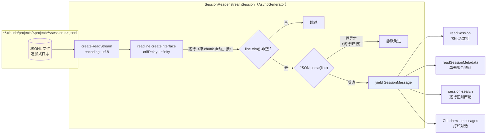

在 super-cli 的数据层中，所有 AI 编程助手（Claude Code、Qoder、Codex）的会话数据都以 **JSONL（JSON Lines）** 格式落盘——每行一个独立 JSON 对象，由 CLI 进程以追加方式持续写入。本文聚焦 `SessionReader` 如何用 Node.js 的 `readline` 模块配合 **AsyncGenerator** 实现流式解析：文件只在迭代时才被打开、按行读取而非整体载入内存、逐行 `JSON.parse` 并隔离坏行，最终在同一遍遍历中完成元数据提取。这一模式是 [多 Provider 架构](5-duo-provider-jia-gou-claude-code-qoder-codex-de-zhu-ce-biao-she-ji)、[全文搜索](9-kua-hui-hua-quan-wen-sou-suo-shi-xian-zheng-ze-pi-pei-ming-zhong-tong-ji-yu-zhai-yao-sheng-cheng) 与 [SessionIndex 索引构建](8-sessionindex-quan-liang-nei-cun-suo-yin-yu-ttl-huan-cun-ce-lue) 的共同地基。

## 为什么是 JSONL，为什么必须流式

Claude Code 将每个会话写为 `~/.claude/projects/<编码路径>/<sessionId>.jsonl`，文件路径由 `getSessionFilePath` 拼接：项目编码目录 + 会话 ID + `.jsonl` 后缀。这些文件没有长度上限——一次长对话可能产生数 MB、数千行的记录，且每行结构异构：既可能是 `user` / `assistant` 消息，也可能是 `file-history-snapshot`、`queue-operation` 等控制行。

Sources: [paths.ts](src/core/paths.ts#L51-L53)

面对这种"可能很大、行级异构、由外部进程追加"的数据源，整体 `readFile` 后 `split('\n')` 的做法有三个致命缺陷：峰值内存与文件体积成正比；无法在解析中途提前终止；单行损坏会污染整个流程。`SessionReader` 的解法是把"读一行、解析一行"封装为一个惰性序列，让消费方自己决定读到什么时候为止——这正是 AsyncGenerator 的语义。

Sources: [session-reader.ts](src/core/session-reader.ts#L39-L52)

## 数据契约：SessionMessage 与行类型联合

流式解析的产物类型是 `SessionMessage`，它是一个宽接口：`type` 字段是八种行类型的联合（`user`、`assistant`、`permission-mode`、`attachment`、`file-history-snapshot`、`last-prompt`、`queue-operation`），其余字段全部可选。关键结构是可选的 `message` 信封——它模拟 Anthropic API 的消息形态，其中 `content` 呈现**多态**：可能是纯字符串，也可能是 `ContentBlock[]` 数组（`text` / `tool_use` / `tool_result` 三种块），`usage` 则携带 token 计量。这个"可选字段 + content 多态"的建模直接决定了后文元数据提取的分支逻辑。

Sources: [types.ts](src/core/types.ts#L5-L53)

| 行类型 | 角色 | 元数据提取时的关注点 |
|---|---|---|
| `user` | 用户输入 | 首条用户消息摘要、时间戳 |
| `assistant` | 模型回复 | 模型名（`message.model`）、token 用量、时间戳 |
| `file-history-snapshot` | 文件快照控制行 | 通常跳过，不参与统计 |
| `permission-mode` / `attachment` / `last-prompt` / `queue-operation` | 会话控制行 | 通常跳过 |
| 所有类型的公共字段 | 会话环境头 | `cwd`、`gitBranch`、`version`、`entrypoint` 首次出现即采纳 |

## streamSession：核心 AsyncGenerator 剖析

整个模块的心脏只有 14 行：

```typescript
async *streamSession(projectEncoded: string, sessionId: string): AsyncGenerator<SessionMessage> {
  const filePath = getSessionFilePath(projectEncoded, sessionId, this.provider);
  const stream = createReadStream(filePath, { encoding: 'utf-8' });
  const rl = createInterface({ input: stream, crlfDelay: Infinity });

  for await (const line of rl) {
    if (!line.trim()) continue;
    try {
      yield JSON.parse(line) as SessionMessage;
    } catch {
      // skip malformed lines
    }
  }
}
```

Sources: [session-reader.ts](src/core/session-reader.ts#L39-L52)

四个技术决策值得逐一拆解。**第一，`createInterface` 挂接 `createReadStream`**：Node 的 readline 内部维护行缓冲区，按 `\n` 切分跨 chunk 的数据，消费方拿到的永远是完整一行——这是"流式"的物理基础。**第二，`crlfDelay: Infinity`**：该选项告诉 readline 将 `\r\n` 视为单一换行符而不受时间窗口约束，避免 CRLF 文件或 chunk 边界恰好切在 `\r` 与 `\n` 之间时产出带 `\r` 尾巴的脏行。**第三，空行与坏行的双层防御**：`line.trim()` 先过滤空行，`try/catch` 包裹 `JSON.parse` 再跳过格式损坏的行——因为 JSONL 是另一个进程的追加日志，文件末尾完全可能存在写入到一半的残行，逐行容错保证了单行损坏不影响其余数据的可读性。**第四，惰性求值**：作为 generator，函数体在第一次 `next()` 被调用前不会执行，文件句柄也延迟到那时才打开。

下面的流程图展示了这条"字节流 → 行序列 → 对象序列"的管线，以及三种典型消费方如何接入：



**与"整体读取"方案的对比**（这是理解本设计的价值所在）：

| 维度 | `readFile` + `split('\n')` | `readFile` + `JSON.parse`（需合法整体 JSON） | **readline + AsyncGenerator（本项目）** |
|---|---|---|---|
| 峰值内存 | 文件全量 + 行数组 | 文件全量 | O(行长)，与文件体积无关 |
| 逐行容错 | 需手动 try/catch | 单行损坏全盘失败 | 内建逐行隔离 |
| 中途终止 | 必须先读完 | 必须先读完 | 消费方 `break` 即止，流自动关闭 |
| 组合性 | 无 | 无 | 可被任意 `for await` 消费方复用 |
| 适用格式 | JSONL | 标准 JSON | JSONL |

## readSession：物化封装

`readSession` 是最薄的消费方——它把流"抽干"为完整数组，供 CLI 的 `show --messages` / `--tools` 等需要全量对话历史的场景使用。实现上只是对流做一次 `for await` 收集，本身不含任何解析逻辑：所有 IO 与容错细节都沉淀在 `streamSession` 一处，物化只是一种策略而非重复实现。

Sources: [session-reader.ts](src/core/session-reader.ts#L54-L60)

CLI 侧的 `show` 命令是典型调用点：先通过索引取得元数据，再按需 `readSession` 拉取消息数组做工具调用统计（`extractToolUsage`）或对话打印。

Sources: [show.ts](src/cli/commands/show.ts#L30-L53)

## readSessionMetadata：单遍流式聚合

如果说 `streamSession` 定义了"怎么读"，`readSessionMetadata` 就定义了"读出来干什么"。它初始化一个全零的 `SessionMetadata` 骨架，然后对同一个流做**单遍遍历（single-pass aggregation）**，边读边累加统计——注意它复用的是 `streamSession`，因此享受全部流式与容错特性，且内存占用恒定（一个对象 + 一个 `Set`），与文件大小无关。

Sources: [session-reader.ts](src/core/session-reader.ts#L62-L119)

聚合规则可以归纳为三类模式：

| 聚合模式 | 字段 | 规则 |
|---|---|---|
| **计数累加** | `messageCount` / `userMessageCount` / `assistantMessageCount` / `totalInputTokens` / `totalOutputTokens` | 每条消息或每个 `usage` 块累加，token 按 `input_tokens` / `output_tokens` 分列求和 |
| **首见即取（first-seen wins）** | `cwd` / `gitBranch` / `entrypoint` / `version` / `firstTimestamp` / `firstUserMessage` | `if (msg.cwd && !metadata.cwd)` 式判断——这些字段通常由文件开头的会话头行携带一次，此后不再覆盖 |
| **尾见覆盖（last-seen wins）** | `lastTimestamp` / `models` | 时间戳每条都刷新（天然取到最新）；模型名通过 `Set` 去重收集，最终展开为数组 |

"首见即取"是一个值得注意的细节：JSONL 行的 `cwd` 等字段理论上每行都会冗余携带，但实现上只在首次出现时采纳，等价于免费获得了"会话头"语义。另一个细节是 `cwd` 优先级——聚合完成后若拿到了真实 `cwd`，会用它覆盖由目录名反解出的 `project` 字段（`if (metadata.cwd) metadata.project = metadata.cwd`），因为编码目录名解码可能丢失大小写等细节。

Sources: [session-reader.ts](src/core/session-reader.ts#L83-L118)

**首条用户消息的 content 多态提取**是直接对应 `SessionMessage` 类型设计的分支逻辑：`content` 为字符串时直接 `slice(0, 200)` 截断做摘要；为数组时用 `content.find(b => b.type === 'text')` 定位第一个文本块再截断——因为用户消息的 content 数组里可能混有图片、工具结果等非文本块，摘要必须只取 `text` 块。截断上限 200 字符保证了 `SessionIndex` 将数百条元数据驻留内存时的体积可控。

Sources: [session-reader.ts](src/core/session-reader.ts#L94-L106)

## readHistory：同一模式对第二个数据源的复用

`~/.claude/history.jsonl`（用户输入历史）是另一个 JSONL 数据源，`readHistory` 完整复刻了同一套管线：`createReadStream` + `createInterface({ crlfDelay: Infinity })` + 空行过滤 + 逐行 `try/catch`。差异点有二：其一，外层再包一个 `try/catch`，文件不存在时直接返回空数组而非抛错（历史是可选数据）；其二，`limit` 参数在**解析完成后**才做 `slice(-limit)` 尾部截取——因为 JSONL 是时序追加的，取最后 N 条即最近 N 条输入。

Sources: [session-reader.ts](src/core/session-reader.ts#L142-L163)

## AsyncGenerator 作为多态契约

`streamSession` 的签名不止是一个实现细节，它被提升为跨 Provider 的**接口契约**：`SessionIndex` 定义的 `ISessionReader` 接口将 `streamSession(...): AsyncGenerator<SessionMessage>` 与 `readSessionMetadata(...)` 列为必备能力，`SessionIndex.buildIndex` 在构建全量索引时对每个 provider 的每个会话统一调用 `readSessionMetadata`——它既不知道也不关心底层文件是 Claude 的 JSONL 还是 Codex 的异构格式。

Sources: [session-index.ts](src/core/session-index.ts#L9-L17)

Sources: [session-index.ts](src/core/session-index.ts#L78-L96)

契约的第二个实现是 `CodexReader.streamSession`：签名与 Claude 版逐字相同，内部同样是 `createReadStream` + `createInterface` + 逐行 `JSON.parse`，但每行在 `yield` 之前先经过 `translateMessage` 翻译为统一的 `SessionMessage`（并维护一个跨行状态 `currentModel` 以补齐模型信息）。也就是说，"readline 流式管线"是两个 Provider 共享的骨架，差异被隔离在"单行→统一消息"的翻译层——这一层的完整设计属于 [Codex 读取器](7-codex-du-qu-qi-yi-gou-shu-ju-yuan-gua-pei-yu-xiao-xi-ge-shi-fan-yi-ceng) 的范畴。

Sources: [codex-reader.ts](src/core/codex-reader.ts#L117-L139)

第三个消费方 `SessionSessionSearch.searchInSession` 则展示了流的**零物化**用法：直接 `for await` 遍历 `streamSession`，对每条消息即时做正则匹配与摘要生成，全程不缓存消息数组——搜索 GB 级会话目录时内存依然恒定。详见 [跨会话全文搜索实现](9-kua-hui-hua-quan-wen-sou-suo-shi-xian-zheng-ze-pi-pei-ming-zhong-tong-ji-yu-zhai-yao-sheng-cheng)。

Sources: [session-search.ts](src/core/session-search.ts#L51-L80)

## 设计要点与陷阱清单

将本模式移植到自己的 JSONL 解析场景时，以下决策是经过本项目验证的可复用经验：**行级 `try/catch` 是必需品而非防御性编程**——追加式日志的最后一行永远可能是残行；**`crlfDelay: Infinity` 避免跨 chunk 的 `\r\n` 被拆开**；**generator 的惰性意味着错误延迟到迭代时才暴露**，`createReadStream` 对不存在文件的 ENOENT 会在第一次 `next()` 时抛给消费方，消费方需自行兜底（对比 `readHistory` 的外层 catch 与 `SessionIndex.buildIndex` 里的 per-session catch）；**聚合逻辑与解析逻辑分离**——`readSessionMetadata` 不解析 JSON，`streamSession` 不理解业务字段，两者通过 AsyncGenerator 组合，新增消费方（如搜索）零成本接入。

Sources: [session-reader.ts](src/core/session-reader.ts#L39-L52)

Sources: [session-index.ts](src/core/session-index.ts#L82-L93)

理解了本页的流式管线后，自然的延伸阅读是：[SessionIndex 全量内存索引与 TTL 缓存策略](8-sessionindex-quan-liang-nei-cun-suo-yin-yu-ttl-huan-cun-ce-lue)（元数据被谁消费、如何缓存）、[Codex 读取器：异构数据源适配与消息格式翻译层](7-codex-du-qu-qi-yi-gou-shu-ju-yuan-gua-pei-yu-xiao-xi-ge-shi-fan-yi-ceng)（同一契约下的另一套行级翻译），以及 [跨会话全文搜索实现](9-kua-hui-hua-quan-wen-sou-suo-shi-xian-zheng-ze-pi-pei-ming-zhong-tong-ji-yu-zhai-yao-sheng-cheng)（零物化消费的完整案例）。若想了解 JSONL 文件为何长在 `~/.claude/projects/<编码路径>/` 下，参见 [路径编码规则与各 CLI 数据目录布局](21-lu-jing-bian-ma-gui-ze-yu-ge-cli-shu-ju-mu-lu-bu-ju-claude-qoder-codex)。