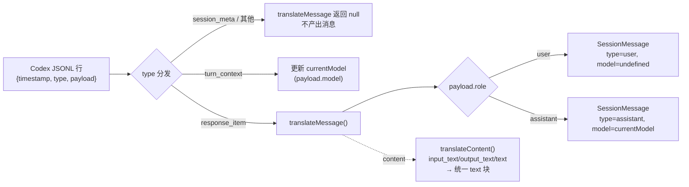
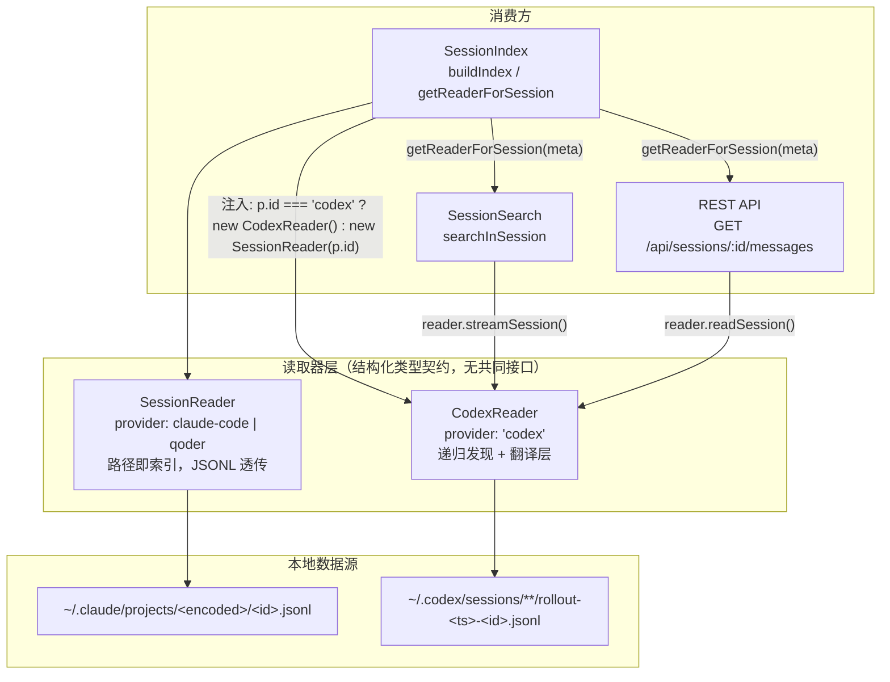

`CodexReader` 是 `src/core/codex-reader.ts` 中一个仅 282 行的类，却承担了整个 super-cli 数据层中最复杂的一类问题：**当 Claude Code 与 Codex 两个 CLI 工具以完全不同的方式持久化会话数据时，如何让上层索引、搜索与 API 消费同一种消息模型**。它的解法是典型的"适配器 + 翻译层"——对外暴露与 `SessionReader` 方法签名完全对齐的八个方法，对内将 Codex 独有的目录布局、信封式消息格式、事件流式的模型信息逐一翻译为统一的 `SessionMessage` / `SessionMetadata` 结构。本文从第一性原理出发，剖析这层适配的两个维度：**数据源形态的适配**（文件如何被发现与定位）与**消息格式的翻译**（一行原始 JSON 如何变成规范消息）。

## 为什么需要独立的读取器：两种截然相反的存储哲学

Claude Code 的存储模型是"**路径即索引**"：项目路径被编码为目录名（如 `/Users/alice/work` → `-Users-alice-work`），会话文件直接命名为 `<sessionId>.jsonl` 存放在该项目目录下。因此 `SessionReader` 发现项目只需 `readdir` 一层目录，定位会话文件只需确定性路径拼接 `projects/<encoded>/<id>.jsonl`，甚至无需打开文件本身。更关键的是，Claude Code 的 JSONL 每一行**本身就是** `SessionMessage`——读取器只是 `JSON.parse` 后原样透传，零翻译成本。

Codex 则采用"**扁平文件 + 内嵌元数据**"的相反哲学：所有会话文件统一存放在 `~/.codex/sessions/` 下（按日期递归分层），文件名形如 `rollout-<时间戳>-<sessionId>.jsonl`，**项目归属信息不在路径中，而在每个文件的第一行 `session_meta` 事件里**。每行数据是 `{timestamp, type, payload}` 的信封格式，真正对话内容藏在 `response_item` 类型事件的 `payload` 内，而模型名称则存在于独立的 `turn_context` 事件中。这意味着 Codex 没有任何"免费"的索引信息——想知道一个文件属于哪个项目，必须打开它读第一行。

Sources: [session-reader.ts](src/core/session-reader.ts#L15-L52), [codex-reader.ts](src/core/codex-reader.ts#L25-L52), [paths.ts](src/core/paths.ts#L42-L57)

下表从六个维度对比两种数据源的形态差异，这些差异共同定义了 `CodexReader` 必须解决的适配问题全集：

| 适配维度 | Claude Code / Qoder（SessionReader） | Codex（CodexReader） | 适配策略 |
|---|---|---|---|
| 目录布局 | `~/.claude/projects/<编码路径>/<id>.jsonl` 单层结构 | `~/.codex/sessions/` 递归分层，`rollout-<ts>-<id>.jsonl` 命名 | 递归 walk 收集所有 `.jsonl` |
| 项目发现 | 目录名即编码路径，`readdir` 即得 | 路径不含项目信息 | 读每个文件首行 `session_meta.cwd` |
| 会话定位 | 确定性路径拼接 | 无规则可循 | 全量遍历 + `includes` 子串匹配 |
| 消息格式 | 每行即 `SessionMessage`，直接透传 | 信封格式，需解包 `payload` | `translateMessage()` 翻译 |
| 模型信息 | 每条 assistant 消息自带 `message.model` | 集中在 `turn_context` 事件 | 流式状态机 `currentModel` 回填 |
| 补充数据源 | `sessions/*.json`（活跃）+ `history.jsonl` | 无对应物 | 返回空数组的能力降级 |

Sources: [session-reader.ts](src/core/session-reader.ts#L15-L52), [codex-reader.ts](src/core/codex-reader.ts#L25-L115)

## 数据源适配三件套：递归发现、首行探测、文件名解析

适配的第一步是让 Codex 的扁平文件森林看起来像 Claude Code 的"项目 → 会话"两级树。`CodexReader` 用三个私有方法构建这座桥。

**递归发现**由 `findAllSessionFiles()` 完成：从 `getCodexSessionsDir()`（即 `~/.codex/sessions`）出发，深度优先遍历所有子目录，收集全部 `.jsonl` 文件路径。注意其中 `entry.isDirectory()` 分支的递归与目录不可访问时的静默跳过（`catch {}`）——这保证了 Codex 未安装或目录权限异常时，上层只会看到"零会话"而非崩溃。所有后续操作（列项目、列会话、定位文件）都以这份文件清单为起点。

**首行探测**是 `readFirstLine()` 的职责，也是整个适配层最精巧的 IO 优化：它创建 `readline` 接口后只消费第一个非空行，解析成功立即执行 `rl.close()` 与 `stream.destroy()` **提前销毁流**，避免读完整个可能数 MB 的会话文件。由于 Codex 把项目路径、git 分支、CLI 版本全部编码在首行 `session_meta` 事件中，这个"只读一行"的探测成为 `listProjects()` 与 `listProjectSessions()` 的共同基石——前者用 `Map<encoded, cwd>` 去重提取全部项目，后者将目标项目路径解码后与每个文件首行的 `cwd` 逐一比对。

**文件名解析**则负责从 `rollout-<时间戳>-<sessionId>.jsonl` 中剥离出纯会话 ID：正则 `/rollout-[\dT-]+-(.+)\.jsonl$/` 中 `[\dT-]+` 匹配形如 `2025-01-15T10-30-00` 的时间戳段，捕获组取其后全部内容作为 ID；若文件名不符合 rollout 约定，则退化为去掉 `.jsonl` 后缀。而反向定位——从会话 ID 找回文件路径——由 `getSessionFilePath()` 通过全量清单的 `file.includes(sessionId)` 子串匹配实现，这是 O(N) 的线性查找，其中 N 为机器上的 Codex 会话文件总数。

Sources: [codex-reader.ts](src/core/codex-reader.ts#L25-L47), [codex-reader.ts](src/core/codex-reader.ts#L54-L73), [codex-reader.ts](src/core/codex-reader.ts#L49-L52), [codex-reader.ts](src/core/codex-reader.ts#L109-L115), [paths.ts](src/core/paths.ts#L55-L57)

值得指出的是这套方案的 IO 代价特征：`SessionIndex.buildIndex()` 的调用序是 `listProjects()` → 逐项目 `listProjectSessions()` → 逐会话 `readSessionMetadata()`，对 Codex 而言，同批文件会被 `findAllSessionFiles()` 重复 walk 多次、`readFirstLine()` 重复探测多轮——这是用实现简单性换取的 IO 放大，对千级会话文件的机器仍在秒级可接受范围内，但属于将来引入持久化索引时最明显的优化点（详见 [SessionIndex 全量内存索引与 TTL 缓存策略](8-sessionindex-quan-liang-nei-cun-suo-yin-yu-ttl-huan-cun-ce-lue)）。

Sources: [codex-reader.ts](src/core/codex-reader.ts#L75-L107), [session-index.ts](src/core/session-index.ts#L78-L96)

## 消息格式翻译层：从信封事件到统一 SessionMessage

数据源适配解决"找到文件"，翻译层解决"读懂内容"。`streamSession()` 是翻译管线的入口，它逐行解析 JSONL 并调用 `translateMessage()`，任何解析失败的行都被静默跳过——这与 `SessionReader.streamSession()` 的透传逻辑形成鲜明对照：后者每行 `JSON.parse` 后直接 `yield`，前者必须经过一次语义过滤与结构重组。

翻译的核心难点在于**Codex 把消息的元信息分散在多种事件类型中**。`translateMessage()` 只对 `type === 'response_item'` 且 `payload.role` 为 `user` 或 `assistant` 的行产出消息；其余所有事件类型（包括 `session_meta`、`turn_context`、工具调用等）均返回 `null` 被丢弃。对通过过滤的行，翻译器构造出与 Claude Code 同构的 `SessionMessage`：顶层 `type` 直接复用 role 值，`timestamp` 从信封透传，`message.role` 与 `message.content` 从 payload 解包。



上图揭示了两个关键机制。**其一，内容块类型归一化**：`translateContent()` 处理 Codex 的三种文本块 `input_text`（用户输入）、`output_text`（模型输出）、`text`（通用），全部过滤后映射为统一契约中的 `{ type: 'text', text }` 结构，使上层（如 `SessionSearch` 的 `extractText`）无需感知 provider 差异；字符串型 content 原样返回，空值与非数组安全降级为空串。**其二，模型回填的流式状态机**：`streamSession()` 维护一个 `currentModel` 变量，当遇到 `turn_context` 事件时更新它，而翻译 assistant 消息时将该值注入 `message.model`——这依赖 Codex 的事件顺序保证（`turn_context` 先于同轮的 `response_item` 出现），代码中翻译调用虽写在状态更新之前，但对 `response_item` 行执行时 `currentModel` 已是最新值。用户消息则显式传入 `undefined`，避免模型名错挂到用户头上。

Sources: [codex-reader.ts](src/core/codex-reader.ts#L117-L139), [codex-reader.ts](src/core/codex-reader.ts#L141-L171), [session-reader.ts](src/core/session-reader.ts#L39-L52), [types.ts](src/core/types.ts#L23-L53)

用一段前后对照具体化这层翻译。给定 Codex 原始事件流：

```json
{"timestamp":"2025-01-15T10:30:00Z","type":"turn_context","payload":{"model":"gpt-5-codex"}}
{"timestamp":"2025-01-15T10:30:01Z","type":"response_item","payload":{"role":"user","content":[{"type":"input_text","text":"帮我修复构建错误"}]}}
{"timestamp":"2025-01-15T10:30:20Z","type":"response_item","payload":{"role":"assistant","content":[{"type":"output_text","text":"已定位到 tsup 配置问题……"}]}}
```

翻译后上层消费到的是：

```ts
[
  { type: 'user', timestamp: '2025-01-15T10:30:01Z',
    message: { role: 'user', model: undefined,
               content: [{ type: 'text', text: '帮我修复构建错误' }] } },
  { type: 'assistant', timestamp: '2025-01-15T10:30:20Z',
    message: { role: 'assistant', model: 'gpt-5-codex',
               content: [{ type: 'text', text: '已定位到 tsup 配置问题……' }] } },
]
```

`turn_context` 行在输出中完全消失——它只作为状态机的输入存在。这正是翻译层的价值：**上游格式的事件多样性被吸收在适配器内，下游只见到规范的会话消息流**。

Sources: [codex-reader.ts](src/core/codex-reader.ts#L126-L139), [codex-reader.ts](src/core/codex-reader.ts#L141-L158)

## 元数据提取：单遍扫描与注入噪音过滤

`readSessionMetadata()` 与 `streamSession()` 是两条**独立的解析路径**：前者不复用翻译层，而是直接对原始行做类型分发，因为它需要收集的信息恰好是翻译层主动丢弃的 `session_meta` 与 `turn_context` 事件。单遍扫描中，首遇的 `session_meta` 提供会话的 `cwd`、`git.branch`、`cli_version`（分别映射到 `SessionMetadata` 的 `cwd`、`gitBranch`、`version` 字段），`entrypoint` 硬编码为 `'cli'`；每个 `turn_context` 事件的 model 进入 `Set` 去重后成为 `models` 数组；每个 `response_item` 事件累加消息计数、滚动更新 `lastTimestamp`，并对时间戳做 `number | string` 双形态归一化（数字按 Unix 时间戳转 ISO 字符串）。首条用户消息的提取被截断至 200 字符，用于列表页的会话预览。

其中 `extractFirstText()` 包含一处容易被忽视的领域知识：Codex 会在用户输入中注入以 `<environment_context>` 或 `<skills_instructions>` 开头的系统前缀文本。若不过滤，看板上每条 Codex 会话的"首条消息"预览都将显示这些噪音而非用户真实意图——该过滤逻辑按块遍历，跳过以此二前缀开头的文本块，取第一条"人类可读"的输入。

Sources: [codex-reader.ts](src/core/codex-reader.ts#L181-L246), [codex-reader.ts](src/core/codex-reader.ts#L248-L261), [types.ts](src/core/types.ts#L55-L76)

## 接口契约与消费方：结构化类型驱动的鸭子协议

一个值得注意的架构决策是：`CodexReader` 与 `SessionReader` **没有共同的接口定义**——既无共享 `interface`，也无继承关系。两者仅靠 TypeScript 的结构化类型系统（structural typing）对齐：八个方法（`listProjects` / `listProjectSessions` / `streamSession` / `readSession` / `readSessionMetadata` / `readActiveSessions` / `readHistory` / `getSessionFileStats`）签名一致，且都暴露 `readonly provider` 属性，于是可以在联合类型 `(SessionReader | CodexReader)[]` 上统一调用。这种"鸭子协议"省去了抽象基类的仪式感，代价是编译器只能在调用点校验两个类型的交集签名——新增方法时需同时维护两处。



注入点位于 `SessionIndex` 构造函数：遍历 `getAvailableProviders()`（即 homeDir 存在的 provider）返回的配置，`p.id === 'codex'` 时实例化 `CodexReader`，否则实例化 `SessionReader`——一个三元表达式完成了整个多态分发。此后所有消费方通过 `getReaderForProvider()` / `getReaderForSession()` 按 `provider` 属性路由：`SessionSearch.searchInSession()` 对任意 reader 统一调用 `streamSession()` 做正则全文匹配（Codex 会话因此天然进入跨 provider 搜索结果）；Fastify 的 `/api/sessions/:id/messages` 路由调用 `readSession()` 后按 `type === 'user' | 'assistant'` 过滤并投影为统一的对话消息结构——前端 SPA 无需知道某条消息源自哪个 CLI。另有一处接口对齐的细节：`streamSession(projectEncoded, sessionId)` 的第一个参数在 `CodexReader` 实现中实际未使用（定位只依赖 sessionId），保留它纯粹是为了满足与 `SessionReader` 一致的调用契约。

Sources: [codex-reader.ts](src/core/codex-reader.ts#L117-L179), [session-index.ts](src/core/session-index.ts#L41-L64), [session-index.ts](src/core/session-index.ts#L193-L199), [session-search.ts](src/core/session-search.ts#L51-L80), [sessions.ts](src/server/routes/sessions.ts#L45-L79)

## 能力降级矩阵：诚实的空实现优于虚假数据

Codex 的数据目录中没有 Claude Code 的两份补充数据源（活跃会话心跳文件与全局输入历史），`CodexReader` 对应方法返回空数组而非抛错或伪造数据。这份降级是**显式且诚实的**：活跃会话为空意味着 Codex 会话的状态推断完全落入基于 `lastTimestamp` 的时间规则（4 小时内 `in_progress`、72 小时内 `backlog`、更久且消息数 ≥ 5 判 `done`）；历史为空意味着 Codex 用户的输入历史不出现在全局 history 视图中。同样，`SessionMetadata` 的 token 统计字段（`totalInputTokens` / `totalOutputTokens`）在 Codex 路径上初始化为 0 且永不累加——因为 Codex 的事件流中不包含 usage 信息，翻译层选择缺失而非估算。

| 能力 | SessionReader 表现 | CodexReader 表现 | 对上层的影响 |
|---|---|---|---|
| 活跃会话 | 解析 `sessions/*.json` 心跳文件 | 恒返回 `[]` | Codex 会话状态仅由时间规则推断 |
| 输入历史 | 解析 `history.jsonl` | 恒返回 `[]` | history 视图无 Codex 条目 |
| Token 统计 | 从 `message.usage` 逐条累加 | 恒为 `0` | 统计页 Codex 列显示零消耗 |
| 文件状态 | `stat` 确定性路径 | `stat` 线性查找结果 | 两者语义一致 |

Sources: [codex-reader.ts](src/core/codex-reader.ts#L263-L280), [session-reader.ts](src/core/session-reader.ts#L122-L140), [session-reader.ts](src/core/session-reader.ts#L107-L115), [codex-reader.ts](src/core/codex-reader.ts#L189-L197)

## 小结

`CodexReader` 的设计示范了适配器模式在数据层的一种克制形态：不引入抽象基类，仅以结构化类型对齐方法签名；不复用翻译层于元数据路径，宁可维护两条解析逻辑以保证各自的信息完整性；不做数据补偿，缺失的能力以显式空值呈现。所有异构性——递归目录、首行元数据、信封格式、事件流模型注入、环境噪音前缀——都被封闭在这 282 行之内，使 `SessionIndex`、`SessionSearch` 与 REST API 得以用同一套代码服务三个 provider。若要继续深入，建议按此顺序阅读：先看 [多 Provider 架构：Claude Code、Qoder、Codex 的注册表设计](5-duo-provider-jia-gou-claude-code-qoder-codex-de-zhu-ce-biao-she-ji) 理解 provider 配置如何驱动读取器注入，再读 [JSONL 会话文件流式解析与元数据提取（readline + AsyncGenerator）](6-jsonl-hui-hua-wen-jian-liu-shi-jie-xi-yu-yuan-shu-ju-ti-qu-readline-asyncgenerator) 对比透传式解析，然后进入 [SessionIndex 全量内存索引与 TTL 缓存策略](8-sessionindex-quan-liang-nei-cun-suo-yin-yu-ttl-huan-cun-ce-lue) 观察这套鸭子协议在索引构建期的调用代价，最后以 [路径编码规则与各 CLI 数据目录布局（~/.claude、~/.qoder、~/.codex）](21-lu-jing-bian-ma-gui-ze-yu-ge-cli-shu-ju-mu-lu-bu-ju-claude-qoder-codex) 收束对两种存储布局的全局认知。