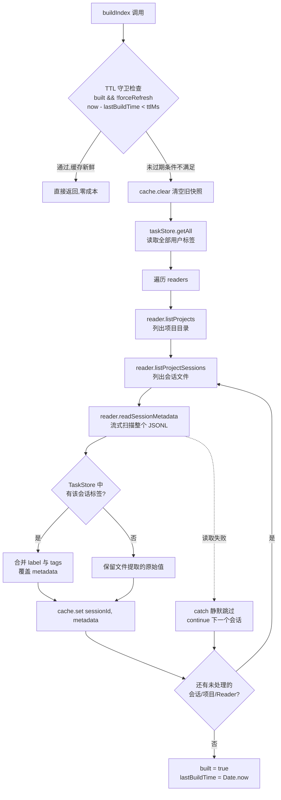

`SessionIndex`（位于 `src/core/session-index.ts`，全文件仅约 200 行）是 super-cli 数据层的中枢组件：它把 Claude Code、Qoder、Codex 三个 Provider 分散在 `~/.claude`、`~/.qoder`、`~/.codex` 下的所有会话 JSONL 文件，一次性聚合为一张以 `sessionId` 为键的**全量内存索引表**，并通过一个默认 30 秒的 TTL（Time-To-Live）缓存策略，在"数据新鲜度"与"磁盘扫描成本"之间取得平衡。CLI 的 `list`/`show`/`stats`/`tasks`/`name` 命令、Fastify 服务的全部 REST 路由、以及跨会话搜索引擎 `SessionSearch`，都通过这一个类读取会话元数据。本文解释它的缓存模型、构建流程、内存查询引擎与生命周期差异，不涉及 JSONL 解析细节、状态推断算法等属于其他章节的主题。

Sources: [session-index.ts](src/core/session-index.ts#L41-L64)

## 设计动机：为什么需要"全量内存 + TTL"

理解这个设计要先看清成本结构。`SessionIndex` 构建索引时，对每个会话文件调用 `readSessionMetadata`，而该方法的实现方式是：**通过 AsyncGenerator 流式遍历整份 JSONL 文件的每一行**——逐条计数消息、累加 token、收集首末时间戳。也就是说，提取一个会话的元数据是 O(该会话全部消息数) 的开销，一次全量构建等于"读取本机所有 Provider 的所有会话文件的全部内容"。

Sources: [session-reader.ts](src/core/session-reader.ts#L62-L115)

面对这种成本，super-cli 选择了最直接的方案：**与其反复扫盘，不如把所有会话元数据一次性装进一个 `Map`，之后的过滤、排序、分页、前缀匹配、项目聚合全部在内存中完成**。作为代价，磁盘上的会话文件可能在缓存有效期内发生变化（例如另一个终端里正在进行的 Claude Code 会话持续追加 JSONL），因此需要一个过期机制——超过 30 秒后，下一次任何查询触发惰性重建；用户也可以通过 `POST /api/refresh` 强制立即失效。对于"看板轮询 + 偶尔人工刷新"这类典型使用场景，30 秒的数据延迟是完全可接受的。

Sources: [session-index.ts](src/core/session-index.ts#L71-L100)

这个权衡可以用一张对比表概括：

| 维度 | 全量内存索引 + TTL（实际方案） | 每次查询实时扫盘 | 外部数据库（SQLite 等） |
|---|---|---|---|
| 查询延迟 | 内存操作，微秒级 | 全量文件 I/O，随会话数线性增长 | 毫秒级，但需维护 schema |
| 数据新鲜度 | TTL 窗口内为快照（最长 30s 陈旧） | 始终最新 | 取决于同步策略 |
| 额外依赖 | 无（纯内存 `Map`） | 无 | 需引入持久化组件 |
| 实现复杂度 | 单类约 200 行 | 低，但性能不可控 | 高（迁移、并发写） |
| 适用规模 | 本地单用户、会话数千级 | 极小规模 | 多用户/跨机器 |

## 数据模型：一张 Map 与两种元数据来源

缓存容器的定义极其朴素：`private cache: Map<string, SessionMetadata> = new Map()`，键是会话 ID 字符串，值是完整的 `SessionMetadata` 对象。这个类型承载了会话的身份（`sessionId`、`provider`、`filePath`）、归属（`project` 原始路径与 `projectEncoded` 编码路径）、时间线（`firstTimestamp`/`lastTimestamp`）、统计（三种消息计数、输入输出 token 总量、模型列表）、环境上下文（`gitBranch`、`cwd`、`entrypoint`、`version`），以及两条来自 TaskStore 的用户注记字段：`label` 与 `tags`。

Sources: [session-index.ts](src/core/session-index.ts#L44-L47)

值得注意的是，缓存值的字段来自**两个数据源的合并**。`SessionMetadata` 的主体（计数、时间戳、token 等）由各 Provider 的 Reader 从 JSONL 文件提取；而 `label` 和 `tags` 是用户在 TaskStore（`~/.super-cli/config.json`）里持久化的任务标注。构建索引时，`buildIndex` 先一次性读取 `taskStore.getAll()` 拿到 `Record<sessionId, TaskLabel>` 映射表，再在遍历会话时按 sessionId 反查合并——这样 TaskStore 的读写细节被完全隔离在本类之外，索引对外呈现的每条会话都是"文件事实 + 用户注记"的统一视图。

Sources: [session-index.ts](src/core/session-index.ts#L75-L96)

## 索引构建流程：三重循环 + 静默容错

在展示流程图之前，先说明图中各环节的分工：`SessionIndex` 自身不做任何文件 I/O，它只负责编排；真正的扫描由注入的 Reader 完成（Claude/Qoder 用 `SessionReader`，Codex 用结构异构的 `CodexReader`，由 `getAvailableProviders()` 检测哪些 Provider 的数据目录真实存在来决定实例化哪些）；TaskStore 提供标签数据；最终产物写入内存 `cache`。

Sources: [session-index.ts](src/core/session-index.ts#L71-L100)

流程中有两个值得注意的工程细节。**其一是容错策略**：`readSessionMetadata` 被包在 try/catch 中，任何单个会话文件损坏、格式异常或读取失败，都会被静默跳过而不是中断整次构建——这对"扫描的是外部工具随时在写的活跃文件"这一现实非常必要，一个半写的 JSONL 行不应让整个看板瘫痪。**其二是重建即全量替换**：每次构建都先 `cache.clear()` 再重新填充，缓存永远是某一时点的完整快照，而非增量修补，这避免了"旧会话已删除但索引残留"的一致性问题。

Sources: [session-index.ts](src/core/session-index.ts#L75-L94)

## TTL 缓存策略：三个控制面与两种进程生命周期

缓存状态由两个字段共同表达：布尔量 `built` 标记"是否已有可用快照"，`lastBuildTime` 记录快照的构建时刻。TTL 判定发生在每次 `buildIndex` 入口处——若已构建、非强制刷新、且距上次构建不足 `ttlMs`（默认 30 000ms，构造时可覆写），则直接返回，调用方随即读取内存缓存，整个路径没有任何磁盘 I/O。失效有两把"钥匙"：

| 控制入口 | 签名 | 语义 | 触发方 |
|---|---|---|---|
| TTL 自然过期 | —（隐式） | `built && now - lastBuildTime < ttlMs` 不成立，下次访问自动重建 | 时间驱动，无需人工干预 |
| 显式失效 | `invalidateCache(): void` | 置 `built = false`、`lastBuildTime = 0`，下次任何查询触发惰性重建 | `POST /api/refresh` 路由（Web 看板刷新按钮） |
| 强制重建 | `buildIndex({ forceRefresh: true })` | 跳过 TTL 守卫立即全量重扫 | 调用方显式传参（当前代码库内暂无内部调用方） |

Sources: [session-index.ts](src/core/session-index.ts#L63-L73)

这套策略的真实收益高度依赖于**宿主进程的生命周期**，代码库中存在两种截然不同的消费模式：

| | Fastify Server（长驻进程） | CLI 命令（一次性进程） |
|---|---|---|
| 实例化方式 | `startServer` 中 `new SessionIndex()` 创建一次，注入全部路由 | 每个命令（`list`/`show`/`stats`/`name`/`tasks`）各自 `new SessionIndex()` |
| 缓存命中路径 | 进程内多次 API 请求共享同一快照；30 秒窗口内 N 次请求只扫一次盘 | 进程启动即冷缓存，首次查询必定全量构建 |
| TTL 实际意义 | 显著——将高频看板轮询的 I/O 摊薄为每 30 秒一次 | 近乎为零——进程退出缓存即消亡 |
| 失效控制 | `POST /api/refresh` → `invalidateCache()` 立即生效 | 不适用（每次运行都是新鲜数据） |

Sources: [server/index.ts](src/server/index.ts#L18-L31) [refresh.ts](src/server/routes/refresh.ts#L4-L9) [list.ts](src/cli/commands/list.ts#L19-L20)

Server 场景还有一个关键设计：`SessionIndex` 实例不仅被 5 组路由共享，还被传递给 `new SessionSearch(undefined, index)`——搜索引擎复用同一个索引实例做会话枚举，再通过 `getReaderForSession` 取回对应 Reader 执行逐会话正文扫描，避免了两套独立的磁盘扫描路径。

Sources: [sessions.ts](src/server/routes/sessions.ts#L7-L8) [session-search.ts](src/core/session-search.ts#L6-L17)

## 内存查询引擎：过滤、排序、分页与前缀匹配

`getAllSessions(options)` 是整个类最常用的出口，它先 `await this.buildIndex()` 确保 TTL 语义生效，然后对缓存快照执行纯内存的管道式处理。全部参数语义如下：

| 参数 | 类型 | 过滤逻辑 |
|---|---|---|
| `provider` | `CliProvider` | 精确匹配 provider 字段 |
| `project` | `string` | **大小写不敏感的子串匹配**（双向 `toLowerCase` + `includes`），方便模糊找项目 |
| `branch` | `string` | 精确匹配 git 分支名 |
| `since` | `Date` | `lastTimestamp >= since.toISOString()`，即"最近活跃时间不早于" |
| `until` | `Date` | `firstTimestamp <= until.toISOString()`，即"首次创建时间不晚于"——注意与 `since` 对称的字段差异 |
| `model` | `string` | 模型列表任一元素包含该子串 |
| `sort` | `'date-asc' \| 'date-desc'` | 按 `lastTimestamp` 字符串 `localeCompare` 排序（ISO 8601 格式保证字典序即时间序），默认降序 |
| `offset` / `limit` | `number` | 切片式分页，先 offset 后 limit |

Sources: [session-index.ts](src/core/session-index.ts#L102-L139)

除列表查询外，类还提供三个定向查询方法，各有明确的语义边界。`getSession(sessionId)` 先精确查 `Map.get`，未命中则**线性扫描取第一个 `startsWith` 前缀匹配**——这为短 ID 省去了输入完整 UUID 的麻烦，但当多个会话共享前缀时结果取决于 Map 迭代顺序。对此更严格的场景提供了 `findSessionByPrefix(prefix)`：收集全部前缀匹配，恰好一个则返回；多于一个则**抛出携带匹配数量的歧义错误**（`Ambiguous session ID prefix "..."`），明确拒绝静默取错；零个返回 null。这两个方法的前缀行为差异是调用方需要留意的 API 约定。

Sources: [session-index.ts](src/core/session-index.ts#L141-L161)

`getProjects(provider?)` 则展示了一次典型的内存聚合：以 `projectEncoded` 为聚合键折叠全部会话，累计 `sessionCount`、用临时 `providerSet`（`Set<CliProvider>`）去重收集"该项目被哪些 CLI 使用过"、滚动比较取最大 `lastTimestamp`，最后剥掉临时的 `providerSet` 字段、把 Set 展开为 `providers` 数组、按会话数降序输出。`Map` 值对象里挂临时字段再在出口处解构剥离（`({ providerSet, ...rest })`）是一个轻量而实用的模式——避免为聚合过程单独定义中间类型。

Sources: [session-index.ts](src/core/session-index.ts#L163-L191)

## 职责边界：索引不推断状态

文件中还住着一个与索引无关的导出函数 `inferSessionStatus`——它根据标签、活跃进程和时间衰减推断会话状态。需要澄清架构边界：**状态推断并不发生在索引构建或查询阶段**，而是由 HTTP 路由层在拿到会话列表后逐条富化（`/api/sessions` 中 `enriched = sessions.map(s => ({ ...s, status: inferSessionStatus(s, activeSessions) }))`）。`SessionIndex` 只缓存"事实数据"，派生状态每次请求即时计算——这保证了 `inferSessionStatus` 中依赖 `Date.now()` 的时间衰减逻辑（如 4 小时/72 小时阈值）不会被 30 秒的缓存快照冻结。该算法的完整规则属于[会话状态推断与任务看板模型（backlog / in_progress / review / done / cancelled）](10-hui-hua-zhuang-tai-tui-duan-yu-ren-wu-kan-ban-mo-xing-backlog-in_progress-review-done-cancelled)一章。

Sources: [session-index.ts](src/core/session-index.ts#L21-L39) [sessions.ts](src/server/routes/sessions.ts#L27-L32)

## 性能特征与已知权衡

以 INTJ 的坦诚标准收尾，本设计有三处值得客观记录的边界。**第一，构建成本与会话总量线性相关**：由于 `readSessionMetadata` 全文件扫描，索引构建时间 ∝ 全机会话总消息数，会话积累到数万条后，TTL 过期后的那次"免费查询变全量重建"可能出现可感知的停顿——但 30 秒窗口 + Server 长驻摊薄，使这在实践中仍然成立。**第二，`buildIndex` 无并发去重**：TTL 守卫中没有共享的 in-flight Promise，若多个请求恰好在过期瞬间并发到达，每个请求都会各自执行一遍完整重建（cache 被交替 clear/fill），结果仍正确（各自 await 自己那次构建后读取），只是浪费了磁盘扫描——这是用简单性换来的可接受冗余。**第三，模块中的 `ISessionReader` 接口**（列出 `listProjects`/`listProjectSessions`/`readSessionMetadata` 等方法签名）目前是文档性质的结构契约：`readers` 字段实际声明为 `(SessionReader | CodexReader)[]` 联合类型而非该接口，它标示了 Reader 适配层需要满足的能力面，供后续扩展（如接入新 Provider）时对照。

Sources: [session-index.ts](src/core/session-index.ts#L9-L19) [session-index.ts](src/core/session-index.ts#L42-L42)

**核心要点回顾**：`SessionIndex` 用一个约 200 行的类完成了"多 Provider 会话的统一内存视图"——`Map<sessionId, SessionMetadata>` 全量快照提供 O(1) 键查找与零 I/O 内存查询，`built + lastBuildTime` 双字段实现 30 秒 TTL 惰性重建，`invalidateCache` 暴露主动失效入口，TaskStore 标签在构建期合并，容错策略保证外部文件异常不阻断索引。它是连接底层 Reader 适配与上层 CLI/HTTP/搜索消费方的唯一数据通道。

## 延伸阅读

- 想了解索引构建所依赖的底层解析：[JSONL 会话文件流式解析与元数据提取（readline + AsyncGenerator）](6-jsonl-hui-hua-wen-jian-liu-shi-jie-xi-yu-yuan-shu-ju-ti-qu-readline-asyncgenerator)
- Reader 如何按 Provider 差异化实现：[多 Provider 架构：Claude Code、Qoder、Codex 的注册表设计](5-duo-provider-jia-gou-claude-code-qoder-codex-de-zhu-ce-biao-she-ji) 与 [Codex 读取器：异构数据源适配与消息格式翻译层](7-codex-du-qu-qi-yi-gou-shu-ju-yuan-gua-pei-yu-xiao-xi-ge-shi-fan-yi-ceng)
- 复用本索引的搜索引擎：[跨会话全文搜索实现：正则匹配、命中统计与摘要生成](9-kua-hui-hua-quan-wen-sou-suo-shi-xian-zheng-ze-pi-pei-ming-zhong-tong-ji-yu-zhai-yao-sheng-cheng)
- 标签合并的另一端：[TaskStore 标签持久化与用户配置存储（~/.super-cli/config.json）](11-taskstore-biao-qian-chi-jiu-hua-yu-yong-hu-pei-zhi-cun-chu-super-cli-config-json)
- 消费本索引的全部 HTTP 端点（含 `/api/refresh`）：[Fastify 5 REST API 参考：sessions / tasks / stats / projects / config / refresh](14-fastify-5-rest-api-can-kao-sessions-tasks-stats-projects-config-refresh)