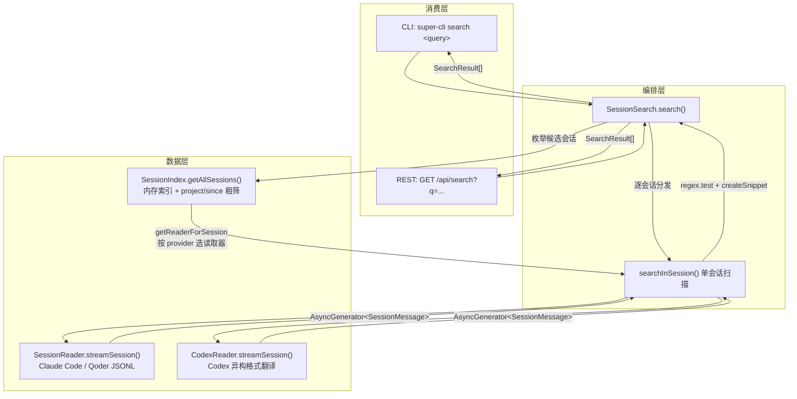
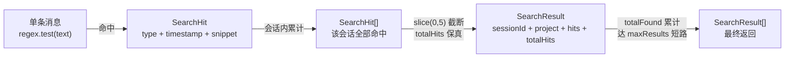

super-cli 的核心价值之一，是让散落在 `~/.claude`、`~/.qoder`、`~/.codex` 各处的会话记录变得**可检索**。本文深入解析 `SessionSearch` 引擎的完整实现：它如何借助 `SessionIndex` 枚举全部会话、如何将用户查询编译为正则表达式、如何以"整条消息"为粒度统计命中、又如何围绕首个命中位置生成上下文摘要（snippet）。理解这条链路，就掌握了 super-cli 数据层"索引 → 流式读取 → 逐条匹配"的典型范式，这与列表、统计等功能的实现结构一脉相承。

## 总体架构：三层协作的搜索管线

搜索并非独立模块，而是数据层既有设施的重新编排。整个管线自上而下分为**消费层**（CLI 命令与 REST 路由）、**编排层**（`SessionSearch`）与**数据层**（`SessionIndex` 元数据索引 + Provider 读取器流式解析）。在动手阅读代码前，先理解这条数据流：查询从入口进入后，先经过索引层的**会话级粗筛**（项目路径、时间范围），再对入围会话执行**逐消息的内容级精筛**（正则匹配），最后将命中结果聚合为摘要返回。



这张图的关键洞察在于：`SessionSearch` 自身**不触碰任何文件 I/O**，它只做两件事——向 `SessionIndex` 要会话清单，向读取器要消息流。文件解析细节（readline 流式读取、Codex 格式翻译）完全委托给数据层既有组件，这正是该引擎仅 111 行就能覆盖三个 Provider 的原因。

Sources: [session-search.ts](src/core/session-search.ts#L1-L11), [sessions.ts](src/server/routes/sessions.ts#L81-L92), [search.ts](src/cli/commands/search.ts#L15-L25)

## 入口编排：search() 的两级筛选与短路控制

`SessionSearch` 是一个极简的类——唯一的内部状态是一个 `SessionIndex` 实例，构造函数甚至保留了可选注入点（`index ?? new SessionIndex()`），REST 层正是利用这一点复用服务器已构建的索引缓存，避免每次搜索都重建全量元数据。

`search()` 方法的编排逻辑呈现清晰的**漏斗结构**。第一级是索引粗筛：`getAllSessions({ project, since })` 只返回项目路径匹配、且最后活跃时间晚于 `since` 的会话——这是零 I/O 的内存过滤，因为 `SessionIndex` 已将全部 `SessionMetadata` 缓存在 `Map` 中。第二级才是真正的全文扫描：对每个入围会话调用 `searchInSession()`，逐条消费消息流并匹配正则。

```typescript
// 编排主循环的核心骨架（节选）
const maxResults = options?.maxResults ?? 50;
let totalFound = 0;

for (const session of sessions) {
  if (totalFound >= maxResults) break;   // 命中总数达到上限即短路

  const reader = this.index.getReaderForSession(session);
  if (!reader) continue;

  const hits = await this.searchInSession(reader, /* ... */);
  if (hits.length > 0) {
    results.push({
      sessionId: session.sessionId,
      project: session.project,
      hits: hits.slice(0, 5),             // 每会话最多保留 5 条命中详情
      totalHits: hits.length,             // 但总数如实记录
    });
    totalFound += hits.length;
  }
}
```

这里有一个**值得注意的语义细节**：`maxResults` 约束的是**命中条数（hits）的总和**，而非"命中会话数"或"扫描的会话数"。一次查询若在第一个会话中就命中 50 条消息，循环将立即终止——后续会话完全不会被扫描。这保证了最坏情况下的执行成本可控（全表扫描至多产出 `maxResults + 命中数上溢` 条结果），但也意味着当某个会话命中密集时，时间上更早/更晚的其他会话可能被截断。配合 `hits.slice(0, 5)` 的"每会话摘要上限"设计，引擎在**信息完整性（totalHits 如实计数）与载荷轻量化（详情截断至 5 条）**之间做了明确取舍。

Sources: [session-search.ts](src/core/session-search.ts#L13-L49)

## 正则匹配策略：字面量转义 + 大小写开关

`searchInSession()` 是唯一执行内容匹配的地方，其正则构建仅有两行，却蕴含两个关键决策：

```typescript
const flags = options?.caseSensitive ? '' : 'i';
const regex = new RegExp(escapeRegex(query), flags);
```

**第一，查询词被强制转义为字面量**。`escapeRegex()` 将所有正则元字符（`.*+?^${}()|[]\`）前置反斜杠，因此用户输入 `super-cli*` 或 `foo(bar)` 时，星号与括号被当作普通字符匹配，而非正则语法。换言之，这里实现的是**以 RegExp 为引擎的子串精确匹配**，而非暴露完整正则语法给用户。这是一个务实的选择：会话内容的搜索场景以"找回说过的话"为主，字面量匹配可预期、无 ReDoS（正则拒绝服务）注入面，也无需处理非法模式导致的构造异常。

| 转义字符类 | 字符集 | 用户视角效果 |
|---|---|---|
| 任意元字符 `.*+?` | `.*+?` | 视为普通文本，`a.b` 只匹配字面 `a.b` |
| 分组与类 `()[]{}` | `()[]{}` | 不构成捕获组或字符类 |
| 定位与量词 `^$|` | `^$\|` | 不锚定行首行尾，不表示"或" |
| 反斜杠与转义符 `\` | `\\` | 反斜杠本身可被搜索 |

**第二，大小写不敏感是默认行为**。`flags` 依据 `caseSensitive` 选项在 `''` 与 `'i'` 之间切换——与 CLI `--case-sensitive` 开关、`SearchOptions` 类型定义一一对应。注意正则对象在**会话循环外只构建一次**（`searchInSession` 的每次调用内部构建一次），同一查询扫过数千条消息时复用同一个编译产物，避免了逐消息重复编译的开销。

Sources: [session-search.ts](src/core/session-search.ts#L51-L80), [session-search.ts](src/core/session-search.ts#L108-L110), [types.ts](src/core/types.ts#L128-L134)

## 消息过滤与文本提取：extractText 的双形态归一化

进入正则测试之前，每条消息要闯过三道关卡，对应三种截然不同的过滤维度：

```typescript
for await (const msg of reader.streamSession(projectEncoded, sessionId)) {
  if (!types.includes(msg.type as 'user' | 'assistant')) continue;  // ① 类型白名单
  if (msg.type !== 'user' && msg.type !== 'assistant') continue;    // ② 类型收窄（供 TS 推导）

  const text = extractText(msg);   // ③ 内容提取
  if (!text) continue;
  if (regex.test(text)) { /* 记录命中 */ }
}
```

第①道关卡依据 `options.messageTypes` 过滤（默认 `['user', 'assistant']`），系统类消息（`file-history-snapshot`、`queue-operation` 等）天然排除在搜索范围外；第②道是运行时冗余但类型层面必要的守卫，将 `msg.type` 从宽泛的字符串联合类型收窄为 `'user' | 'assistant'`，使后续 `hits.push({ type: msg.type, ... })` 满足 `SearchHit` 的类型约束。真正的复杂性集中在第③道——`extractText()` 必须归一化 Claude Code 会话格式的**两种 content 形态**：

| content 形态 | 数据结构 | 提取策略 |
|---|---|---|
| 纯字符串 | `message.content: string` | 直接返回 |
| 内容块数组 | `message.content: ContentBlock[]` | 过滤出 `type === 'text'` 且 `text` 非空的块，`join('\n')` 拼接 |
| 其他（缺失/异常） | `undefined` / 空数组 | 返回 `null`，跳过该消息 |

数组形态的过滤规则意味着 `tool_use`、`tool_result` 块**不参与搜索**——工具调用的参数、执行结果中的匹配不会被统计。这是"对话内容搜索"的边界设定：命中统计只覆盖人类输入与模型回复的自然语言文本。

匹配本身采用 `regex.test(text)`，即**整条消息文本的布尔判定**——一条消息只要包含至少一次查询词即记为 1 个 hit，消息内多次出现的密度信息不参与统计。配合流式读取（`streamSession` 返回 `AsyncGenerator<SessionMessage>`，内部以 readline 逐行解析 JSONL），内存占用始终为 O(单条消息)，与会话文件总大小无关。

Sources: [session-search.ts](src/core/session-search.ts#L63-L77), [session-search.ts](src/core/session-search.ts#L83-L93), [types.ts](src/core/types.ts#L23-L53), [session-reader.ts](src/core/session-reader.ts#L39-L52)

## 摘要生成：createSnippet 的中心窗口算法

命中只是第一步——返回完整消息文本会淹没用户，只返回开头又可能丢失命中上下文。`createSnippet()` 采用**首个命中位置居中的滑动窗口**策略，产出一段紧凑的上下文摘要：

```typescript
function createSnippet(text: string, query: string, caseSensitive?: boolean): string {
  const flags = caseSensitive ? '' : 'i';
  const idx = text.search(new RegExp(escapeRegex(query), flags));  // 定位首个命中
  if (idx === -1) return text.slice(0, 150);                       // 理论兜底：取前 150 字符

  const start = Math.max(0, idx - 50);              // 命中前最多 50 字符上下文
  const end = Math.min(text.length, idx + query.length + 100);  // 命中后最多 100 字符
  let snippet = text.slice(start, end);
  if (start > 0) snippet = '...' + snippet;         // 左截断标记
  if (end < text.length) snippet = snippet + '...'; // 右截断标记
  return snippet.replace(/\n/g, ' ');               // 换行压平为空格，保证单行展示
}
```

窗口的几何结构可以直观表示为：

```
消息文本: [.... 前文 ....][命中词][.... 后文 ....]
                        │  ←50→│命中│←100→│
窗口结果: ...前50字符 + 命中词本身 + 后100字符...
边界处理:  start=0 时不加前缀 '...'；end=text.length 时不加后缀 '...'
长消息兜底: 未命中时（理论不可达）截取前 150 字符
```

四个实现细节值得留意。其一，摘要算法复用了与匹配阶段**完全相同的转义 + flags 逻辑**（注意此处 `caseSensitive` 是正向判断，与 `searchInSession` 中反向判断互为镜像），确保 `search()` 定位到的命中与 `createSnippet()` 高亮的位置必然一致。其二，`String.prototype.search()` 只返回**首个**命中索引——若一条消息中查询词出现五次，摘要始终围绕第一次出现展开。其三，窗口按**字符偏移**计算，查询词的转义使其长度在正则与原文中一致，`idx + query.length` 恰好越过命中词右边界。其四，`\n` 压平保证 snippet 在 CLI 单行输出与 JSON 载荷中都保持紧凑。

| 场景 | 输入示例 | 窗口行为 |
|---|---|---|
| 命中位于消息中部 | 前 200 字符 + 命中 + 后 300 字符 | `...前50 命中 后100...` |
| 命中位于消息开头 | 命中 + 后续长文本 | `命中 后100...`（无左省略号） |
| 命中位于消息末尾 | 长文本 + 命中 | `...前50 命中`（无右省略号） |
| 超短消息 | `好的` | 全文返回，无省略号 |
| 多行消息 | 含换行 | 窗口内换行替换为空格 |

Sources: [session-search.ts](src/core/session-search.ts#L95-L106), [session-search.ts](src/core/session-search.ts#L59-L60)

## 命中统计模型：从 SearchHit 到 SearchResult

统计结果的数据形状由 `types.ts` 中的两个接口锚定：`SearchHit` 是最小单位的命中记录（消息类型、时间戳、摘要三字段），`SearchResult` 则是**按会话分组**的聚合容器。从流式匹配到最终返回，数据经历三次聚合变形：



这个模型中两个"数字"承担了不同职责：`totalHits` 是**精确的全量计数**（`hits.length` 在截断前读取），用于 CLI 展示 `- 3 hits` 这类汇总信息与结果排序参考；而 `hits` 数组是**截断后的详情载荷**（最多 5 条），服务于"快速浏览命中上下文"的交互目标。二者分离意味着消费端（CLI / API 调用方）既能知道"这个会话共命中多少"，又不必为一次搜索传输海量 snippet。

Sources: [session-search.ts](src/core/session-search.ts#L37-L45), [types.ts](src/core/types.ts#L136-L147)

## 消费层：CLI 命令与 REST 端点的双通道暴露

同一引擎通过两个入口暴露，参数语义完全对齐 `SearchOptions`：

| 参数 | CLI 形式 | REST 形式 | 默认值 | 说明 |
|---|---|---|---|---|
| 查询词 | `super-cli search <query>`（位置参数） | `?q=<query>` | 必填（REST 缺省返回空集） | 转义后按字面量子串匹配 |
| 项目过滤 | `-p, --project <path>` | `?project=` | 不过滤 | 子串匹配（不区分大小写） |
| 时间下限 | `-s, --since <date>` | `?since=` | 不过滤 | 按会话 `lastTimestamp` 过滤 |
| 结果上限 | `-m, --max <n>` | `?max=` | `50` | **命中条数**总和上限 |
| 大小写 | `--case-sensitive` | 暂未透传（REST 路由未映射该参数） | 不敏感 | 切换正则 `i` 标志 |
| 结构化输出 | `--json` | 天然 JSON | 终端彩色文本 | Agent 友好输出 |

CLI 侧的终端渲染由 `formatSearchResults()` 完成：每会话一行头部（`sessionId` 前 8 位加粗、项目路径取末两级、命中总数置灰），下挂最多 5 行命中详情——`user` 类型绿色、`assistant` 类型蓝色，时间戳与 snippet 置灰拼接。REST 侧则将 `SessionSearch` 与服务器生命周期共享的 `SessionIndex` 实例绑定（`new SessionSearch(undefined, index)`），使 API 搜索能命中 30 秒 TTL 内的索引缓存。

值得指出的一处**CLI 与 REST 的参数不对称**：CLI 支持 `--case-sensitive`，但 `/api/search` 路由的选项映射中未包含该字段——这是当前实现的边界现状，而非设计上的深层差异。

Sources: [search.ts](src/cli/commands/search.ts#L6-L26), [sessions.ts](src/server/routes/sessions.ts#L81-L92), [output.ts](src/cli/output.ts#L68-L84)

## 设计取舍分析

纵观这 111 行实现，几个关键决策构成了它的工程性格：

| 决策点 | 选择 | 收益 | 代价 / 边界 |
|---|---|---|---|
| 查询语义 | 字面量转义 + RegExp 引擎 | 可预期、无 ReDoS 面、无需异常处理 | 用户无法使用高级正则（通配、分组） |
| 匹配粒度 | 整条消息布尔判定 | 实现极简、流式友好 | 消息内命中密度丢失；命中只会统计为 1 |
| 扫描策略 | 无内容索引、逐会话流式重扫 | 零索引维护成本、始终反映最新内容 | 大规模会话下每次搜索都是全量 I/O |
| 截断策略 | 每会话 5 条详情 + 总命中数保真 | 载荷轻、聚合信息完整 | 命中密集会话的多数摘要不可见 |
| 短路控制 | 命中总数达 `maxResults` 即停 | 最坏成本有上界 | 早停可能跳过后续会话（会话按时间倒序枚举，即可能跳过更早的会话） |
| 索引复用 | SessionIndex TTL 缓存注入 | API 与 CLI 共享、避免重建 | 依赖索引页签描述的缓存语义（详见索引页） |

"无倒排索引、按需流式扫描"是理解本模块的**第一性原则**：会话数据规模（个人开发者本地数千会话以内）与使用频率（人工触发、非高频轮询）决定了建索引的复杂度并不划算——内存元数据索引负责快速圈定候选，readline 流式负责低内存精读，二者组合即可在交互级延迟内完成一次跨会话检索。若未来会话规模上探，引入内容级倒排索引将是自然的演进方向，而 `SessionSearch` 单一入口的编排结构为此预留了替换空间。

Sources: [session-search.ts](src/core/session-search.ts#L1-L111), [session-index.ts](src/core/session-index.ts#L41-L64)

## 延伸阅读

本文聚焦搜索引擎本体，其依赖的两块基础设施各自成篇：索引层的会话枚举与 TTL 缓存机制详见 [SessionIndex 全量内存索引与 TTL 缓存策略](8-sessionindex-quan-liang-nei-cun-suo-yin-yu-ttl-huan-cun-ce-lue)；底层 JSONL 流式解析范式详见 [JSONL 会话文件流式解析与元数据提取（readline + AsyncGenerator）](6-jsonl-hui-hua-wen-jian-liu-shi-jie-xi-yu-yuan-shu-ju-ti-qu-readline-asyncgenerator)，Codex 异构格式的消息翻译详见 [Codex 读取器：异构数据源适配与消息格式翻译层](7-codex-du-qu-qi-yi-gou-shu-ju-yuan-gua-pei-yu-xiao-xi-ge-shi-fan-yi-ceng)。若关注消费端形态，可继续阅读 [Commander.js 子命令注册模式与全局 --provider 过滤](12-commander-js-zi-ming-ling-zhu-ce-mo-shi-yu-quan-ju-provider-guo-lu)、[Agent 友好的 --json 结构化输出约定与终端格式化输出](13-agent-you-hao-de-json-jie-gou-hua-shu-chu-yue-ding-yu-zhong-duan-ge-shi-hua-shu-chu) 与 [Fastify 5 REST API 参考：sessions / tasks / stats / projects / config / refresh](14-fastify-5-rest-api-can-kao-sessions-tasks-stats-projects-config-refresh)。