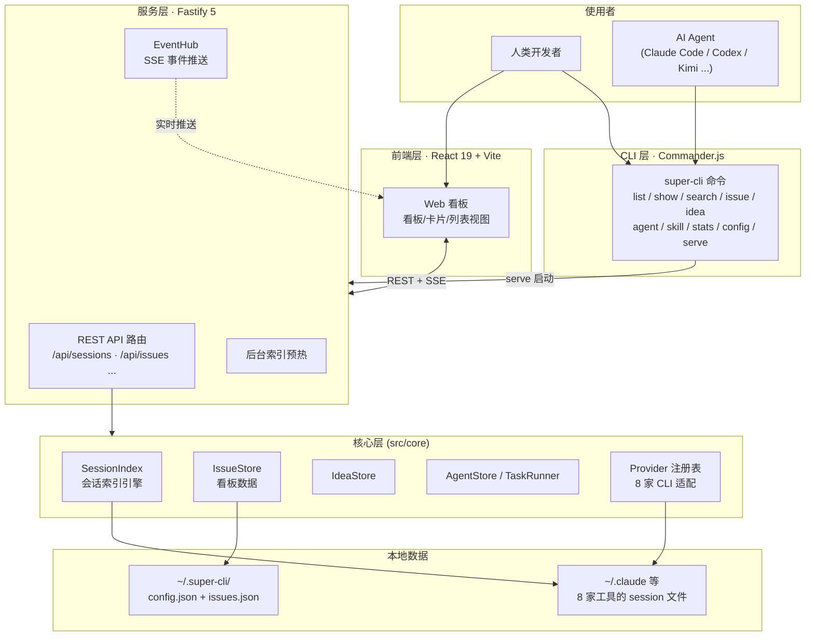

本页是 super-cli 文档的起点，帮助你在一篇文章内建立对项目的整体认知：它是什么、为什么存在、核心能力有哪些、由哪几层构成。读完本页，你应当能回答两个问题——"这个工具对我的 AI 编程工作流有什么用"以及"我接下来该读哪篇文档深入"。

## 一句话理解 super-cli

**super-cli 是一个 AI 编程助手 session 管理工具**：它把 Claude Code、Qoder、Codex、Kimi CLI、Pi、OpenCode、WorkBuddy 和 TraeCode 这 8 家 AI 编程 CLI 的历史对话统一起来管理，并提供命令行和 Web 看板两种交互方式。项目以 npm 包 `@bluesky8318/super-cli` 发布，要求 Node.js >= 22，采用 ESM 模块系统，开源协议为 Apache-2.0。它不是一个 AI 模型，也不是一个新的编程助手，而是站在所有编程助手"之上"的**管理层**——助手负责写代码，super-cli 负责管理这些助手留下的会话、任务与协作过程。

Sources: [README.md](README.md#L1-L3), [package.json](package.json#L1-L10)

## 它解决什么问题

要理解 super-cli 的价值，最好的方式是看它诞生前后的对比。它针对的是三个真实痛点，层层递进。

### 痛点一：8 家 CLI 工具，8 种数据格式，数据完全碎片化

AI 编程助手的会话记录（session）是宝贵的工作资产——里面有你和 AI 的完整对话、工具调用、代码修改过程。但每家 CLI 工具都把数据存在自己家目录下的不同位置，用不同的命名规则。以代码中实际的 Provider 配置为例：Claude Code 存在 `~/.claude/projects/` 下按项目分目录、文件名为 `<uuid>.jsonl`；Kimi CLI 存在 `~/.kimi/sessions/` 下、项目目录名用 **MD5 编码**、会话藏在 `context.jsonl` 子目录结构里；Pi CLI 的文件名则带时间戳前缀 `<timestamp>_<uuid>.jsonl`，恢复会话时还要先剥掉时间戳。这些差异在 `SessionLayout` 接口中被显式建模为 `encoding: 'dash' | 'dash-no-prefix' | 'double-dash' | 'md5'` 与三种文件命名模式——**碎片化不是假设，而是被代码逐条列举的事实**。super-cli 的 Provider 注册表将这 8 家工具的差异封装在一处，上层代码只需面对统一的抽象。

Sources: [providers.ts](src/core/providers.ts#L6-L18), [providers.ts](src/core/providers.ts#L29-L100)

### 痛点二：会话只能"躺在"磁盘里，无法检索和复用

即使知道了数据在哪，用户仍缺少统一的查询入口：想找"上周那个改认证模块的对话"需要挨家工具翻历史；想让脚本或 AI Agent 程序化地读取任务状态，没有结构化输出可用。super-cli 对此提供了三层能力：`list` / `show` / `search` 命令跨所有 Provider 列出、查看、全文搜索历史会话（支持按项目、时间、分支、模型过滤，搜索结果带高亮）；给 session 命名、打标签，把零散对话变成可管理的"任务"；**所有命令支持 `--json` 输出**，专门为 AI Agent 和脚本消费而设计。这一点是理解本项目的关键——super-cli 的人类用户和 Agent 用户是平等的一等公民。

Sources: [README.md](README.md#L7-L12), [README.md](README.md#L105-L108)

### 痛点三：多个 AI Agent 同时干活，没有协作纪律

这是 super-cli 最核心、也最具特色的问题域。当你同时开出 3 个 Claude Code、2 个 Codex 窗口并行开发时，谁在做什么、做到哪一步、有没有两个人抢同一个任务？项目用 **Issue 看板 + 乐观锁 + SSE 实时推送**的组合来回答：7 状态看板（需求池 / 待办 / 进行中 / 待复查 / 阻塞 / 已完成 / 已取消）承载任务流转；每个 Issue 携带 `version` 字段做乐观锁，写操作必须带 `--if-version`，多个 Agent 并发写冲突时会得到 `VERSION_CONFLICT` 信号而非静默覆盖；Issue 可绑定多个不同 Provider 的 session，让"任务"与"执行它的会话"建立可溯源的关联。项目还内置了一份 `super-cli-taskboard` Skill，通过 `super-cli skill install` 分发到各 Agent 的技能目录，把"先读后做、认领即移动、done 只能由用户移动"等协作纪律直接写进 Agent 的行为规范。

Sources: [README.md](README.md#L13-L19), [types.ts](src/core/types.ts#L104-L124), [issue-workflow.md](docs/issue-workflow.md#L1-L12), [issue-workflow.md](docs/issue-workflow.md#L17-L33)

## 核心能力一览

把上述问题的解法汇总成一张能力地图，每一项都对应 CLI 的一个命令族或 Web 界面的一个功能区：

| 能力域 | 提供什么 | 典型入口 |
|---|---|---|
| **Session 管理** | 跨 8 家 Provider 列出 / 查看 / 全文搜索历史会话，按项目、时间、分支、模型过滤 | `super-cli list` / `show` / `search` |
| **任务看板** | 7 状态 Issue 看板，支持拖拽、优先级、标签、Markdown 描述、评论、父子/阻塞/关联关系 | `super-cli issue <子命令>` 或 Web 界面 |
| **并发安全** | `version` 乐观锁 + `--if-version` 写保护，多 Agent 并发写不冲突 | 所有 issue 写操作 |
| **实时同步** | SSE 事件推送，看板变更实时广播到所有打开的浏览器 | `super-cli serve` 启动后自动生效 |
| **Agent 执行** | 无头启动 Agent 执行任务、交互式在终端拉起会话、会话自动绑定 Issue | `super-cli agent` 系列 |
| **Idea 流水线** | 一句话记录想法 → 分类孵化 → 成熟后转为 Issue | `super-cli idea` 系列 |
| **Harness 配置** | 查看各 Provider 的 Skills、MCP Servers、Rules、Hooks、Permissions，支持跨 Provider 复制 | Web 界面 Harness 模式 |
| **Skill 分发** | 把 taskboard 工作流 Skill 安装/卸载到各 Agent 目录 | `super-cli skill install` |
| **数据统计** | 总会话数、消息数、token 用量，按模型/项目/日期分布 | `super-cli stats` |
| **终端集成** | 一键在 Ghostty、iTerm2、Terminal.app、Kitty、Warp 中恢复会话 | 会话详情页 / `super-cli config set terminal` |

Sources: [README.md](README.md#L5-L48), [index.ts](src/cli/index.ts#L1-L37)

## 三层架构鸟瞰

super-cli 采用清晰的**三层架构**：CLI 层、服务层、前端层。理解这张图，你就理解了整个项目的代码组织方式。



上图对应的代码事实是：`src/cli/index.ts` 用 Commander.js 注册了 12 个命令族；`src/server/index.ts` 中的 `startServer` 创建 Fastify 实例，实例化 SessionIndex、TaskStore、IssueStore、IdeaStore、AgentStore、EventHub、TaskRunner 七个核心对象并挂载 10 组 REST 路由，同时在后台预热会话索引（避免首次访问等待全量冷扫描）；构建后的 React 前端由同一个 Fastify 进程以静态文件方式托管——**一个端口同时服务 API 和 Web UI**，这是 `super-cli serve` 一条命令即可用起来的原因。

Sources: [index.ts](src/cli/index.ts#L21-L37), [index.ts](src/server/index.ts#L25-L53), [index.ts](src/server/index.ts#L56-L70)

## 8 家 Provider 适配表

Provider 注册表是 super-cli "多工具统一"承诺的落点。下表汇总了 8 家 CLI 工具的关键差异，这些差异全部被封装在 `PROVIDER_CONFIGS` 数组中：

| Provider | 启动命令 | 数据目录 | 项目编码方式 | Session 文件命名 |
|---|---|---|---|---|
| Claude Code | `claude` | `~/.claude` | dash（连字符） | `uuid.jsonl` |
| Qoder | `qodercli` | `~/.qoder` | dash | `uuid.jsonl` |
| Codex | `codex` | `~/.codex` | —（暂未索引） | — |
| Kimi CLI | `kimi` | `~/.kimi` | **md5** | `context.jsonl` 子目录 |
| Pi | `pi` | `~/.pi` | double-dash | `timestamp_uuid.jsonl` |
| OpenCode | `opencode` | `~/.opencode` | —（暂未索引） | — |
| WorkBuddy | `workbuddy` | `~/.workbuddy` | dash-no-prefix | `uuid.jsonl` |
| TraeCode | `traecode` | `~/.traecode` | —（暂未索引） | — |

注册表还提供两个查询函数：`getAllProviders` 返回全部 8 家配置，`getAvailableProviders` 则用 `existsSync` 过滤出本机实际安装过的工具——这就是为什么 super-cli 在任何机器上都不会报"找不到某工具"的错，它只显示你真实拥有的数据。此外每个 Provider 都声明了 `newArgs`（新建会话参数）和 `resumeArgs`（恢复会话参数），这是"一键在终端恢复历史会话"功能的基础。

Sources: [providers.ts](src/core/providers.ts#L29-L100), [providers.ts](src/core/providers.ts#L105-L112)

## 数据存储哲学：不依赖数据库

super-cli 做出了一个对部署体验影响巨大的设计决策：**不引入任何数据库**。各 Provider 的 session 数据由 super-cli 直接只读扫描，项目自身产生的数据（用户命名、标签、Issue 看板）则以普通 JSON 文件存放在 `~/.super-cli/` 下：

| 数据 | 存储位置 | 读写方式 |
|---|---|---|
| 各工具的 session 对话记录 | `~/.claude/projects/`、`~/.qoder/projects/`、`~/.codex/sessions/` 等 | **只读**，super-cli 不改动任何工具的原生数据 |
| 用户配置、命名与标签 | `~/.super-cli/config.json` | 读写 |
| Issue 看板数据 | `~/.super-cli/issues.json` | 读写 |

这个决策带来三个直接好处：安装即用（无需初始化数据库）、零数据迁移（删掉 super-cli 不影响任何工具）、天然适配多机同步场景（`~/.super-cli` 目录可以直接放进同步盘）。

Sources: [README.md](README.md#L167-L182)

## Agent 工作流：人与 Agent 共享一块看板

最后用一个具体场景把所有概念串起来，这是理解 super-cli 定位的最好方式。假设你在看板上创建了一个 Issue"实现登录页"（状态 `todo`），然后对某个 Claude Code 会话说"去把看板上的登录页做了"：Agent 会通过已安装的 taskboard Skill 知道完整纪律——先 `issue show` 读完描述和评论（先读后做）；执行 `issue claim ISSUE-3 --session-id <自己的会话ID>`，一步完成 `todo → in_progress` 状态移动与会话绑定；完成任务后先评论记录改动与验证方式，再移入 `in_review`；**`done` 只能由你手动移动**，Agent 无权自封完成。整个过程你在 Web 看板上通过 SSE 实时看到卡片移动，多个 Agent 并发操作由 `--if-version` 乐观锁保证安全。

```
backlog → todo → in_progress → in_review → done
                    ↓    ↑
                 blocked（阻塞时移入，恢复后移回）
任意状态 → canceled
```

这套纪律的完整规则定义在 `docs/issue-workflow.md`，并以 Skill 形式分发到各 Agent。值得注意的是状态语义的精心设计：`backlog` 表示"未批准执行"（Agent 不得擅自认领），`todo` 表示"已批准"——看板不仅是任务清单，更是**人类授权与 Agent 行动之间的契约界面**。

Sources: [issue-workflow.md](docs/issue-workflow.md#L5-L33), [SKILL.md](skills/super-cli-taskboard/SKILL.md#L1-L33)

## 项目目录结构速览

对照三层架构，源码目录的职责划分一目了然：

```
super-cli/
├── src/
│   ├── cli/                  # ① CLI 层：Commander.js 命令入口
│   │   ├── index.ts          #    注册 12 个命令族
│   │   ├── commands/         #    各命令的具体实现
│   │   └── output.ts         #    终端表格/文本输出格式化
│   ├── core/                 # ② 核心层：业务逻辑与数据访问
│   │   ├── providers.ts      #    8 家 Provider 注册表
│   │   ├── session-index.ts  #    会话索引引擎（TTL 缓存）
│   │   ├── issue-store.ts    #    Issue 看板持久化
│   │   ├── task-runner.ts    #    Agent 无头执行管线
│   │   └── ...               #    约 25 个领域模块
│   ├── server/               # ③ 服务层：Fastify HTTP 服务
│   │   ├── index.ts          #    startServer 组装入口
│   │   ├── routes/           #    REST API 路由
│   │   └── events.ts         #    EventHub（SSE 推送）
│   └── web/                  # ④ 前端层：React 单页应用
│       └── src/              #    看板/卡片/列表视图组件
├── skills/
│   └── super-cli-taskboard/  #    分发给 Agent 的工作流 Skill
├── docs/                     #    issue-workflow 等设计文档
└── package.json              #    tsup + Vite 双构建流
```

Sources: [package.json](package.json#L28-L40)

## 阅读路线建议

建立整体认知后，推荐按下面的顺序继续深入。如果你只想先把工具用起来，走**上手线**；如果你想理解内部实现，走**原理线**。

**上手线（入门指南，约 30 分钟）**：
1. [快速开始：安装、构建与本地运行](2-kuai-su-kai-shi-an-zhuang-gou-jian-yu-ben-di-yun-xing) —— 装好它、跑起来
2. [CLI 命令全景：list、show、search、issue 与 --json 输出](3-cli-ming-ling-quan-jing-list-show-search-issue-yu-json-shu-chu) —— 掌握命令行交互
3. [Web 看板五分钟上手：serve 启动与界面导览](4-web-kan-ban-wu-fen-zhong-shang-shou-serve-qi-dong-yu-jie-mian-dao-lan) —— 可视化看板导览

**原理线（深入解析）**：
- 从 [三层架构：CLI、Fastify 服务与 React 前端如何协作](6-san-ceng-jia-gou-cli-fastify-fu-wu-yu-react-qian-duan-ru-he-xie-zuo) 开始理解整体数据流
- 关心多工具适配的读 [多 Provider 抽象：注册表设计与 8 家 CLI 工具适配](7-duo-provider-chou-xiang-zhu-ce-biao-she-ji-yu-8-jia-cli-gong-ju-gua-pei)
- 关心 Agent 协作的读 [Issue 数据模型：JSON 持久化、状态、优先级与标签](12-issue-shu-ju-mo-xing-json-chi-jiu-hua-zhuang-tai-you-xian-ji-yu-biao-qian) 与 [乐观锁机制：version 字段与多 Agent 并发写安全](13-le-guan-suo-ji-zhi-version-zi-duan-yu-duo-agent-bing-fa-xie-an-quan)
- 计划参与开发的最后读 [开发环境与调试技巧：dev 热重载、typecheck 与测试](5-kai-fa-huan-jing-yu-diao-shi-ji-qiao-dev-re-zhong-zai-typecheck-yu-ce-shi)