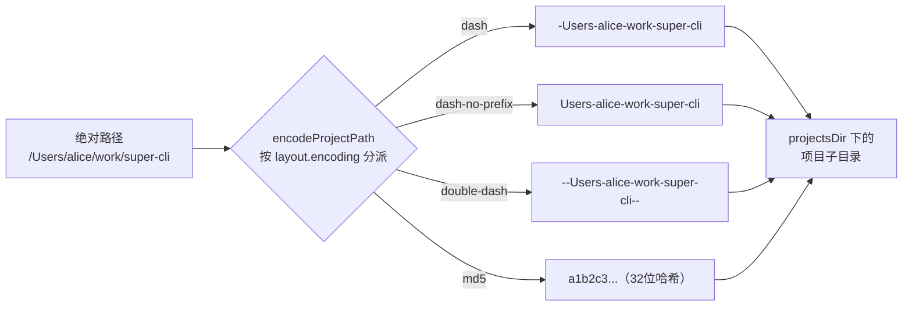
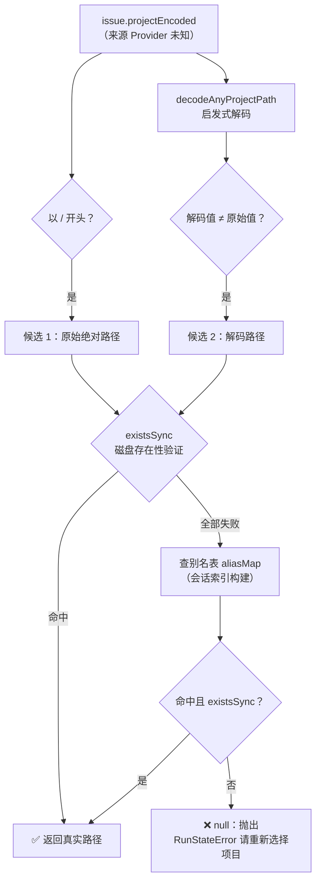

当你在 `/Users/alice/work/zeronote/scm/github/super-cli` 目录下启动一次 Claude Code 会话，磁盘上会出现一个名为 `-Users-alice-work-zeronote-scm-github-super-cli` 的目录；同样的路径在 Pi CLI 下变成 `--Users-alice-work-zeronote-scm-github-super-cli--`，在 Kimi CLI 下则是一串 32 位十六进制哈希。super-cli 作为一个聚合 8 家 CLI 工具会话的看板，必须回答一个根本问题：**如何把各 Provider 千差万别的目录名还原成统一的绝对路径，并让同一个项目在多 Provider 之下合并为一行？** 本文深入解析 `src/core/paths.ts` 中的编码/解码引擎、`SessionLayout` 注册表中的四种编码方言，以及围绕"编码有损"这一事实构建的磁盘验证与别名表纠错体系。

## 问题域：为什么路径编码是一个架构级议题

各家 CLI 工具都把会话转录文件按"项目"分目录存储在自家 home 目录下（如 `~/.claude/projects/`），但文件系统目录名不允许出现 `/`，于是每个 Provider 都自行发明了一套把绝对路径压平成目录名的规则。这带来三重挑战：**可逆性**——dash 类编码在路径段本身含有 `-` 时（如本仓库的 `super-cli`）会发生信息丢失，解码会得到错误路径；**多样性**——四种编码方言互不兼容，同一路径在不同 Provider 下产生完全不同的目录名；**单向性**——md5 哈希根本无法从目录名反推路径，必须借助外部映射文件。super-cli 的解法是把编码规则声明为 Provider 配置的一部分（`SessionLayout`），再在核心层提供一个多策略的解码与验证管线。

Sources: [providers.ts](src/core/providers.ts#L7-L14), [paths.ts](src/core/paths.ts#L61-L124)

## 四种编码方言：SessionLayout 的声明式定义

`SessionLayout` 接口将"项目目录如何命名"抽象为 `encoding` 字段，取值 `dash`、`dash-no-prefix`、`double-dash`、`md5` 四种方言。这是一个典型的声明式设计：编码逻辑不散落在各个 Reader 里，而是集中由 `paths.ts` 根据 Provider 配置分派执行。

| 方言 | 使用 Provider | 编码规则示例（`/a/b/super-cli`） | 解码策略 |
|---|---|---|---|
| `dash` | claude-code、qoder | `-a-b-super-cli` | 前导 `-` 触发全局 `-`→`/` 替换 |
| `dash-no-prefix` | workbuddy | `a-b-super-cli` | 无前导标记，统一补 `/` 前缀再替换 |
| `double-dash` | pi | `--a-b-super-cli--` | 剥离首尾 `--` 定界符后替换 |
| `md5` | kimi | `3f2a9c...`（32 位哈希） | **不可逆**，需经 `kimi.json` 映射表反查 |

值得注意的是 codex、opencode、traecode 三个 Provider 没有声明 `sessionLayout`（配置为 `undefined`），意味着它们的会话无法走标准 projects 目录索引——Codex 走的是完全独立的扫描路径（后文详述）。

Sources: [providers.ts](src/core/providers.ts#L7-L14), [providers.ts](src/core/providers.ts#L29-L103)

## 编码与解码的对称实现

`encodeProjectPath` 与 `decodeProjectPath` 是一对镜像函数，都以 Provider 的 `encoding` 配置为分派依据。编码侧：`dash` 直接把所有 `/` 替换为 `-`；`dash-no-prefix` 在此基础上额外剥掉前导 `-`；`double-dash` 先用 `split('/').filter(Boolean)` 丢弃空段，再以 `--` 包裹首尾；`md5` 则调用 `createHash('md5')` 输出十六进制摘要。解码侧与之对称，唯一的例外是 `md5` 分支——注释明确指出这是单向哈希，调用方必须通过 Provider 自己的映射文件来解析，函数本身只做原样透传。

配套的 `getSessionFilePath` 将编码后的目录名、会话 ID 与 Provider 的文件命名规则（`uuid.jsonl` 或 `context.jsonl-subdir`）拼合为转录文件的完整磁盘路径，这是所有 Reader 读取会话内容的物理入口。

Sources: [paths.ts](src/core/paths.ts#L112-L124), [paths.ts](src/core/provider.ts#L61-L77), [paths.ts](src/core/paths.ts#L126-L133)

## 未知 Provider 时的启发式解码：decodeAnyProjectPath

Issue 等持久化数据中存储的 `projectEncoded` 可能来自任何一家 Provider，读取时并不总是知道编码方是谁。`decodeAnyProjectPath` 通过**编码指纹**进行无上下文推断：以 `--` 开头的是 Pi 的 double-dash 方言；匹配 `^[0-9a-f]{32}$` 的是 Kimi 的 md5（无法解码，原样返回）；以 `-` 开头的是 Claude Code 风格的 dash；已经包含 `/` 的视为解码完毕的路径；其余情况兜底按 workbuddy 的 dash-no-prefix 处理。这个判定顺序是精心安排的——double-dash 必须先于 dash 检查，否则 `--a-b--` 会被误判为 dash 编码。

`issue-store.ts` 中的 `normalizeProjectIdentity` 正是消费这一函数的典型场景：Issue 的项目身份统一为**解码后的绝对路径**，历史遗留的 dash 编码值在比较前被归一化，保证新旧数据可以互相匹配。

Sources: [paths.ts](src/core/paths.ts#L79-L86), [issue-store.ts](src/core/issue-store.ts#L56-L60)

## 有损编码的纠错体系：验证与别名表

dash 类编码本质上不是双射——路径段内的 `-` 与路径分隔符 `/` 在编码后不可区分。以本仓库为例：`/Users/alice/work/zeronote/scm/github/super-cli` 编码后解码会得到 `/Users/alice/work/zeronote/scm/github/super/cli`，一个不存在的路径。super-cli 构建了双保险机制来对抗这种有损性。

`resolveIssueProjectPath` 实现了候选路径验证管线：先收集候选（原始值若以 `/` 开头直接入选，解码值若与原始值不同也入选），逐一用 `existsSync` 做磁盘存在性校验，全部失败后回退查询**别名表**——一个由会话索引构建的 `编码名/别名 → 已验证真实路径` 映射。函数顶部的注释直白地点明了设计意图："Dash encoding is lossy for dirs containing '-'"。

别名表的数据来源是一条巧妙的"无损旁路"：`SessionReader` 在流式读取会话时，会把消息行中携带的 `cwd` 字段（以及 Pi 在 `session` 元信息行中记录的 `cwd`）写入 `metadata.cwd`，并在读取结束时用它**覆盖** dash 解码出的 `metadata.project`——转录文件内部记录的真实 cwd 比目录名推断可靠得多。会话索引随后按这个无损的 `project` 值聚合，把各 Provider 的目录名收进 `aliasSet`。`TaskRunner.projectAliasMap` 将 `ProjectInfo` 的 `encoded` 与全部 `aliases` 展开为扁平映射并缓存，供 `startRun` 在无头执行前解析 Issue 的归属目录——解析失败时直接拒绝启动，避免 Agent 在错误目录下工作。

Sources: [paths.ts](src/core/paths.ts#L88-L110), [session-reader.ts](src/core/session-reader.ts#L84-L105), [session-reader.ts](src/core/session-reader.ts#L196-L225), [task-runner.ts](src/core/task-runner.ts#L130-L145), [task-runner.ts](src/core/task-runner.ts#L181-L188)

## md5 方言的破解：kimi.json 映射表反查

Kimi 的 md5 编码在四种方言中唯一不可逆，`SessionReader` 为其实现了专用解码通道：`getMd5PathMap` 读取 `~/.kimi/kimi.json` 中的 `work_dirs` 数组，对每个 `dir.path` 现场计算 `encodeProjectPath`（即 md5）建立 `哈希 → 真实路径` 的映射并缓存于实例字段 `md5PathMap`。因此 `listProjects` 对 md5 Provider 的处理逻辑完全反转——不是扫描目录再解码，而是**遍历映射表的键，检查对应的哈希目录是否真实存在**（存在才代表该项目有会话记录）；`decodeProject` 私有方法同样优先查表、查不到才退回目录名本身。这体现了设计上的务实取舍：把"目录名 → 路径"的难题转化为"已知路径 → 目录名"的正向验证，避开了哈希碰撞层面的无解问题。

Sources: [session-reader.ts](src/core/session-reader.ts#L16-L49), [session-reader.ts](src/core/session-reader.ts#L142-L167)

## Codex 的特殊路径：从 session_meta 行提取 cwd

Codex 没有声明 `sessionLayout`，其会话文件平铺在 `~/.codex/sessions/` 下而非按项目分目录，路径信息只存在于每个 JSONL 文件首行的 `session_meta.payload.cwd` 中。`CodexReader` 由此发展出一套"**编码是被推导出来的**"模式：`listProjects` 扫描全部会话文件的首行提取 cwd，再用 `encodeProjectPath`（dash 方言）**正向生成**编码目录名，使 Codex 的项目列表与其他 Provider 保持相同的 `{ encoded, decoded }` 形态；`listProjectSessions` 则反向解码目标目录名得到 cwd，再与每个文件首行的 cwd 精确比对来筛选会话。

Sources: [codex-reader.ts](src/core/codex-reader.ts#L75-L107)

## 会师点：ProjectInfo 跨 Provider 聚合

所有解码努力的终点是 `SessionIndex.getProjects`：以 `metadata.project`（无损解码路径）为分组键，将同一项目在不同 Provider 下的会话合并，每个项目的 `aliasSet` 收拢了所有 Provider 特有的目录名。最终产出的 `ProjectInfo` 中，`encoded` 字段被赋予"稳定的跨 Provider 身份"语义——它就是解码后的绝对路径本身，而 `aliases` 保留各 Provider 的磁盘目录名作为遗留身份标识。路由层的 `/api/projects` 会为每个项目追加紧凑短 ID（`p1`、`p2`…）用于可分享的 Web URL，归档与置顶状态的匹配也会同时检查 `encoded`、`decoded` 与全部 `aliases`（`allIdsOf`），确保任何历史身份写下的配置都不会失联。

| ProjectInfo 字段 | 语义 | 来源 |
|---|---|---|
| `encoded` / `decoded` | 跨 Provider 稳定身份（解码后的绝对路径） | 无损 cwd 覆盖或映射表 |
| `aliases` | 各 Provider 磁盘目录名集合（遗留身份） | 分组时收集的 `projectEncoded` |
| `providers` | 记录过此项目的 Provider 列表 | 分组时的 `providerSet` |
| `sessionCount` / `lastTimestamp` | 跨 Provider 汇总的活跃度指标 | 聚合计数与时间戳取最大 |

Sources: [session-index.ts](src/core/session-index.ts#L215-L252), [types.ts](src/core/types.ts#L300-L310), [projects.ts](src/server/routes/projects.ts#L53-L70), [projects.ts](src/server/routes/projects.ts#L91-L102)

## 解码之后的闭环：启动会话时路径重新交还 Provider

解码的完整闭环在启动新会话时显现：`/api/sessions/new` 接收的是**解码后的项目路径**，`TerminalLauncher` 校验 `existsSync` 后通过 `cd <cwd> && <provider命令>` 在真实目录中拉起交互式 Provider——随后 Provider 自己会按它的方言重新编码并写入自己的会话存储。前端也存在两处轻量的解码兜底实现：`SystemConfigView` 内联了一个仅处理 dash 方言的 `decodeProjectPath` 用于标签展示；`IssueDetail.startWork` 则直接 `replace(/-/g, '/')` 把 Issue 存储的项目身份还原为路径传给启动接口。这些前端简化版是可接受的妥协，因为精确解析的兜底责任始终在服务端的 `resolveIssueProjectPath` 管线上。

Sources: [sessions.ts](src/server/routes/sessions.ts#L114-L125), [SystemConfigView.tsx](src/web/src/components/SystemConfigView.tsx#L13-L17), [IssueDetail.tsx](src/web/src/components/IssueDetail.tsx#L203-L214)

## 小结

路径编码体系的设计精髓在于三点：**声明先于实现**——编码方言作为 `SessionLayout` 配置的一部分，编解码函数按配置分派，新增 Provider 零逻辑侵入；**承认有损并主动纠错**——dash 编码的有损性没有被掩盖，而是通过转录文件内的真实 `cwd` 覆盖、磁盘存在性验证、别名表三级机制层层兜底；**统一身份锚点**——无论目录名如何变化，"解码后的绝对路径"始终是跨 Provider 聚合、Issue 关联、会话启动的稳定锚点。理解了这套机制，你就掌握了 super-cli 多 Provider 数据模型的地基。

建议的后续阅读：想了解 SessionLayout 如何在索引构建中被消费，参见 [Session 索引引擎：TTL 缓存、mtime 失效与后台预热](8-session-suo-yin-yin-qing-ttl-huan-cun-mtime-shi-xiao-yu-hou-tai-yu-re)；Provider 注册表的整体设计参见 [多 Provider 抽象：注册表设计与 8 家 CLI 工具适配](7-duo-provider-chou-xiang-zhu-ce-biao-she-ji-yu-8-jia-cli-gong-ju-gua-pei)；别名表在无头执行中的具体消费路径参见 [无头执行管线：TaskRunner 从 spawn 到会话自动绑定](19-wu-tou-zhi-xing-guan-xian-taskrunner-cong-spawn-dao-hui-hua-zi-dong-bang-ding)。