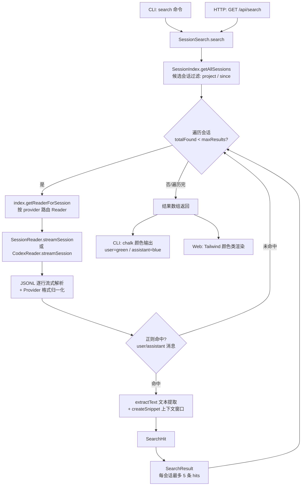

super-cli 的核心价值之一，是让用户能在**所有 AI 编程工具（Claude Code、Codex、Gemini、Kimi、Pi 等）产生的历史会话中执行全文检索**，而不必记住会话发生在哪个工具、哪个项目里。本文深入解析这条搜索链路的完整实现：从 CLI 命令与服务端路由，到 `SessionSearch` 引擎的核心扫描算法，再到 snippet 上下文窗口的生成策略与命中结果的颜色区分渲染。读者将理解一个刻意保持简单的设计——**不建倒排索引、逐会话流式正则扫描**——如何在多 Provider 异构数据源上实现低成本、够用的全文搜索。

## 整体架构：三层调用链与数据流

搜索功能横跨三层架构。**入口层**有两个：CLI 的 `super-cli search <query>` 命令，以及 Web 服务的 `GET /api/search` 路由；**引擎层**是统一的 `SessionSearch` 类，它不直接触碰磁盘，而是将候选会话发现委托给 `SessionIndex`（复用其 TTL 缓存与 mtime 失效机制，详见 [Session 索引引擎](8-session-suo-yin-yin-qing-ttl-huan-cun-mtime-shi-xiao-yu-hou-tai-yu-re)）；**读取层**则由 `SessionReader`（通用 Provider）与 `CodexReader`（Codex 专用翻译器）以 AsyncGenerator 流式吐出消息。

下面的流程图展示了从用户输入到命中结果返回的完整链路。阅读前需要理解一个前提：搜索**不读取任何预构建的文本索引**，每个候选会话都会在其执行时被实时打开并以逐行流式方式扫描，这个决策的权衡将在后文分析。



两个入口共享同一份引擎逻辑：CLI 命令通过 commander 注册 `-p`、`-s`、`-m`、`--case-sensitive`、`--json` 五个选项后直接实例化 `SessionSearch` 并调用其 `search` 方法；而 Fastify 路由 `GET /api/search` 在注册时注入了与路由模块共享的 `SessionIndex` 实例，避免每次请求重建索引缓存。

Sources: [search.ts](src/cli/commands/search.ts#L6-L26) · [sessions.ts](src/server/routes/sessions.ts#L84-L95)

## 数据契约：SearchOptions、SearchResult 与 SearchHit

搜索链路中的三个核心接口定义了各层之间的边界。`SearchOptions` 是调用方对引擎的约束输入；`SearchResult` 与 `SearchHit` 则是引擎输出的两级结构——**SearchResult 按"会话"分组，SearchHit 是会话内单条消息的命中记录**。这种两级结构直接决定了前端渲染形态：每个会话渲染为一张卡片，卡片内罗列该会话的命中条目。

| 接口 | 字段 | 类型 | 说明 |
|---|---|---|---|
| `SearchOptions` | `project` | `string?` | 按项目路径子串过滤候选会话 |
| | `since` | `Date?` | 只搜索该日期之后有活动的会话 |
| | `maxResults` | `number?` | 全局命中数上限，默认 50 |
| | `caseSensitive` | `boolean?` | 是否区分大小写，默认否 |
| | `messageTypes` | `('user'\|'assistant')[]?` | 参与搜索的消息角色，默认两者 |
| `SearchResult` | `sessionId` / `project` | `string` | 命中会话标识与项目路径 |
| | `hits` | `SearchHit[]` | 命中明细（引擎层最多保留 5 条） |
| | `totalHits` | `number` | 该会话的**完整**命中总数 |
| `SearchHit` | `type` | `'user'\|'assistant'` | 消息角色 |
| | `timestamp` | `string?` | 消息时间戳 |
| | `snippet` | `string` | 以命中点为中心的上下文片段 |

值得注意的是 `hits` 与 `totalHits` 的分离设计：当某个会话命中 20 次时，`hits` 只保留前 5 条用于展示，而 `totalHits` 如实反映全部命中数。这让 UI 层能在"信息密度"与"完整性提示"之间取得平衡——用户看到 `20 hits` 的标注，但页面不会被同一会话的重复命中淹没。

Sources: [types.ts](src/core/types.ts#L279-L298)

## 引擎核心：SessionSearch 的扫描算法

`SessionSearch` 类的设计体现了克制：整个类只有一个公开方法 `search`，构造函数接受可选的 `SessionIndex` 注入（服务端场景复用路由级索引实例；CLI 场景则新建默认实例）。`search` 方法的执行分为两个阶段。

**第一阶段是候选会话筛选**：调用 `index.getAllSessions({ project, since })` 获取按时间倒序排列的会话元数据列表。`project` 参数按解码后的项目路径做**不区分大小写的子串匹配**；`since` 参数则比较会话的 `lastTimestamp`——即只搜索"该时间点之后仍有活动"的会话。由于复用了 `SessionIndex` 的 TTL 缓存，这一步在大规模会话库上也只需一次（或零次）磁盘元数据扫描。

**第二阶段是逐会话扫描循环**，其控制流如下：

```typescript
for (const session of sessions) {
  if (totalFound >= maxResults) break;      // 全局预算耗尽，提前终止
  const reader = this.index.getReaderForSession(session);
  if (!reader) continue;                     // provider 无 reader，跳过
  const hits = await this.searchInSession(...);
  if (hits.length > 0) {
    results.push({ ..., hits: hits.slice(0, 5), totalHits: hits.length });
    totalFound += hits.length;               // 注意：累加的是完整命中数
  }
}
```

这里有一个容易忽略的细节：`totalFound` 累加的是 `hits.length`（该会话全部命中数），而非被保留的 `slice(0, 5)` 后的数量。这意味着一个命中 50 次的会话会**独自耗尽默认的 50 条预算**，后续会话将不再被扫描。这是"宁多搜一个会话、不少报命中总数"的取舍，也意味着结果集的会话数量分布与命中密度高度相关。

`getReaderForSession` 的路由逻辑非常直接：按会话元数据中的 `provider` 字段，在索引持有的 readers 数组中查找匹配的 reader。`SessionReader` 实例按 provider id 参数化（覆盖 Claude Code、Gemini、Kimi、Pi 等 JSONL 格式相近的工具），Codex 则由专用的 `CodexReader` 处理。

Sources: [session-search.ts](src/core/session-search.ts#L6-L49) · [session-index.ts](src/core/session-index.ts#L254-L260)

## 单会话扫描：流式读取、类型过滤与正则匹配

`searchInSession` 是实际的文本匹配单元。它首先将用户查询编译为正则表达式——查询串经过 `escapeRegex` 转义（`.*+?^${}()|[]\` 等元字符全部加反斜杠），确保用户输入的任意字符串都被当作**字面子串**而非正则模式处理。这是一处关键的安全与正确性设计：搜索"task.run()"不会因为括号被解释为分组而匹配失败。默认附加 `i` 标志实现不区分大小写，仅当 `caseSensitive` 为真时不加。

随后是对 `reader.streamSession()` 产出的消息流逐一处理。类型过滤实际执行了**两道检查**：先按 `options.messageTypes`（默认 `['user', 'assistant']`）过滤，再做一次硬性的类型收窄以满足 TypeScript 类型系统。通过过滤的消息经 `extractText` 提取纯文本后，用编译好的正则执行 `regex.test(text)` 判定命中。

`extractText` 处理了消息内容块的两种形态。当 `message.content` 是字符串时直接返回；当它是内容块数组时（Claude 风格的多块消息），只保留 `type === 'text'` 且有文本的块，用换行符拼接——**工具调用块、图片块等非文本内容天然不参与全文搜索**。若内容为空或其他类型，返回 `null` 并跳过该消息。

```typescript
function extractText(msg: SessionMessage): string | null {
  if (!msg.message?.content) return null;
  if (typeof msg.message.content === 'string') return msg.message.content;
  if (Array.isArray(msg.message.content)) {
    return msg.message.content
      .filter(b => b.type === 'text' && b.text)
      .map(b => b.text!)
      .join('\n');
  }
  return null;
}
```

Sources: [session-search.ts](src/core/session-search.ts#L51-L93) · [session-search.ts](src/core/session-search.ts#L108-L110)

## 流式读取层：两类 Reader 的 JSONL 逐行扫描

`streamSession` 在两个 Reader 中的共同骨架是：`createReadStream` 打开会话文件 → `readline.createInterface` 逐行读取 → 每行 `JSON.parse` → 归一化后 `yield`。**整个文件从不整体载入内存**，这对可能包含数千条消息的会话文件至关重要——搜索引擎在扫描时占用的是 O(最长单行) 而非 O(文件大小) 的内存。格式错误或空行被静默跳过（`try/catch` 包裹），保证单个损坏行不会中断整个扫描。

两者的差异在于**归一化策略**。`SessionReader` 针对格式相近的 Provider 做轻量转换：Pi 格式需要跳过前置的 `session` 元数据行（但会将其中的 `cwd` 附加到首条真实消息上，用于解决短横线目录命名无法无歧义解码的问题），并将 `message.role` 映射为 `type`；Kimi 格式则是扁平结构，直接读取 `raw.role` 与 `raw.content`；其余 Provider（如 Claude Code）的行结构已与目标形状一致，直接透传。

`CodexReader` 的翻译工作量更大：它需要将 Codex 的 `response_item` 事件行转换为统一消息形状，同时在流式过程中追踪 `turn_context` 行以捕获当前模型名——因为模型信息不在消息行本身，而在同回合的上下文行里。文本内容块也需从 Codex 的 `input_text` / `output_text` 类型翻译为统一的 `text` 类型。这些格式差异的完整解析属于[异构 Session 文件解析](9-yi-gou-session-wen-jian-jie-xi-jsonl-liu-shi-du-qu-yu-ge-shi-chai-yi)的范畴，此处只需理解：**搜索引擎看到的是归一化后的统一消息流，Provider 差异被 Reader 层完全屏蔽**。

| 维度 | SessionReader | CodexReader |
|---|---|---|
| 文件定位 | 按 `projectEncoded/sessionId` 直接拼路径 | 需扫描所有会话文件、按文件名包含 sessionId 匹配 |
| 特殊行处理 | Pi 的 `session` 元数据行（提取 cwd） | `turn_context` 行（追踪 currentModel） |
| 内容块翻译 | 过滤后直接使用 | `input_text`/`output_text` → `text` |
| 坏行容错 | `try/catch` 跳过 | `try/catch` 跳过 |

Sources: [session-reader.ts](src/core/session-reader.ts#L79-L132) · [codex-reader.ts](src/core/codex-reader.ts#L117-L171)

## 命中定位：createSnippet 的上下文窗口策略

搜索的价值不只在于"找到"，更在于"让用户一眼看到命中处说了什么"。`createSnippet` 实现了一个以**首个命中位置为中心**的上下文窗口：用 `text.search()` 定位第一个命中索引后，向前取 50 个字符、向后取命中词长度加 100 个字符，构成最大约 150+ 字符的片段。窗口越过文本边界时由 `Math.max/Math.min` 钳制；若窗口起止不在原文边界，分别前置与追加 `...` 省略号提示截断。最后一步将所有换行符替换为空格，**将多行消息压平为单行**——这保证了 snippet 在 CLI 表格与 Web 卡片中都不会破坏布局。

```typescript
const start = Math.max(0, idx - 50);
const end = Math.min(text.length, idx + query.length + 100);
let snippet = text.slice(start, end);
if (start > 0) snippet = '...' + snippet;
if (end < text.length) snippet = snippet + '...';
return snippet.replace(/\n/g, ' ');
```

一个边界情形：当 `text.search()` 返回 `-1`（理论上不会发生，因为调用前已通过 `regex.test` 确认命中，但两者使用了独立的正则实例），函数退化为返回原文前 150 字符。这种防御式兜底保证了 snippet 永远是合法字符串。需要指出的是，snippet 只覆盖**首个**命中——同一消息内的多处命中不会全部展示，这与每会话 5 条 hits 的截断共同构成了整条链路的"展示预算"控制。

Sources: [session-search.ts](src/core/session-search.ts#L95-L106)

## 命中呈现：CLI 与 Web 的颜色语义

"命中高亮"在这个代码库中的实现形态值得精确澄清：**当前不存在关键词级的文本高亮**（前端没有 `<mark>` 标签包裹命中词，snippet 中的命中词与上下文以同样样式渲染）。实际实现的"高亮"是**角色级的颜色语义编码**——通过颜色区分命中消息来自用户还是 AI 助手，让用户在扫描结果列表时快速识别命中的语境。

CLI 端由 `formatSearchResults` 渲染：每个结果块以加粗的会话 ID 前 8 位开头，附灰色显示的项目短路径与总命中数；其下每条 hit 以颜色标识角色——`user` 用绿色（`chalk.green`）、`assistant` 用蓝色（`chalk.blue`），后跟暗色时间戳与 snippet 单行文本。JSON 模式（`--json`）则输出完整的结构化数据，供脚本消费。

Web 端 `Search.tsx` 页面采用完全对应的视觉映射：`hit.type === 'user'` 应用 `text-green-400`，否则 `text-blue-400`；会话卡片头部展示 ID 前缀（`text-cyan-400` 等宽字体）、项目短路径与 `N hits` 计数；点击卡片通过 `onSelectSession` 回调跳转到会话详情。**但需如实记录一个架构现状：`Search.tsx` 组件目前未被 `App.tsx` 引用**——它是一个已实现但尚未接线到主导航的预留页面。Web 端当前实际生效的"搜索"是 `App.tsx` 顶部的搜索框，它在**前端内存中对已加载的会话元数据**做 `includes` 过滤，匹配范围仅限 `firstUserMessage`、`label`、`sessionId`、`gitBranch` 四个元数据字段，**不涉及全文检索**。

| 呈现场景 | 高亮机制 | 命中词标记 | 数据来源 |
|---|---|---|---|
| CLI 表格输出 | chalk 角色（green/blue） | 无 | 引擎实时全文扫描 |
| CLI `--json` | 无（结构化数据） | 无 | 同上 |
| Web `/api/search` 消费方 | Tailwind 角色（green-400/blue-400） | 无 | 引擎实时全文扫描 |
| Web 顶部搜索框 | 无 | 无 | 前端本地元数据过滤 |

Sources: [output.ts](src/cli/output.ts#L68-L84) · [Search.tsx](src/web/src/pages/Search.tsx#L50-L70) · [App.tsx](src/web/src/App.tsx#L701-L708)

## 设计权衡分析：为什么不做倒排索引

对照常见的全文搜索方案，可以清晰看到这个实现的取舍逻辑。**无索引、实时扫描**意味着每次搜索都要打开并流式读取所有候选会话文件，最坏情况下的 I/O 成本与库中会话总量成正比。但换来的是三重简化：其一，**零索引维护成本**——会话文件被外部工具（Claude Code、Codex 等）随时写入，维护增量倒排索引需要监听文件变更并处理一致性问题，而实时扫描天然读到最新状态；其二，**实现极简**——整个引擎不含 tokenization、分词、posting list 等概念，核心逻辑不足 110 行；其三，**子串匹配的完备性**——正则 `test` 配合转义后可以做任意子串匹配（如函数名 `createSnippet` 中的大小写变体），而分词式索引在处理代码标识符、中文等场景下边界情况繁多。

配套的预算控制机制则把最坏成本压到可接受范围：`maxResults` 全局预算触发提前 `break`，避免扫完全库才返回；`since` 时间过滤让"最近"这类高频查询只触碰近期文件；每会话 5 条 hits 的截断控制响应体大小。由于扫描顺序继承 `getAllSessions` 的**时间倒序**排列，预算耗尽时优先保留的是最新会话——这与用户"找最近的讨论"的典型意图吻合。

| 方案 | 构建成本 | 查询延迟 | 实时性 | 匹配能力 | 实现复杂度 |
|---|---|---|---|---|---|
| 实时流式扫描（当前） | 零 | 随库规模线性增长 | 永远最新 | 任意子串 | ~110 行 |
| 倒排索引 | 高（需增量维护） | 低（近似常数） | 依赖失效策略 | 受分词约束 | 高 |
| 外部引擎（ripgrep 等） | 零 | 低（进程级并行） | 永远最新 | 正则全集 | 依赖外部二进制 |

Sources: [session-search.ts](src/core/session-search.ts#L13-L49) · [session-index.ts](src/core/session-index.ts#L154-L191)

## 延伸阅读

理解本页的搜索链路后，有两个自然的深入方向：候选会话的发现与过滤依赖 `SessionIndex` 的缓存体系，其 TTL、mtime 失效与后台预热机制在 [Session 索引引擎](8-session-suo-yin-yin-qing-ttl-huan-cun-mtime-shi-xiao-yu-hou-tai-yu-re)中详解；两类 Reader 屏蔽的 Provider 格式差异（Pi 的元数据行、Kimi 的扁平结构、Codex 的事件翻译）在[异构 Session 文件解析](9-yi-gou-session-wen-jian-jie-xi-jsonl-liu-shi-du-qu-yu-ge-shi-chai-yi)中逐格式拆解。若想了解搜索结果所归属的会话如何在 CLI 与 Web 中被浏览与展示，可参考 [CLI 命令全景](3-cli-ming-ling-quan-jing-list-show-search-issue-yu-json-shu-chu)与[React 应用架构](22-react-ying-yong-jia-gou-dan-ye-lu-you-yu-shi-tu-zu-zhi)。