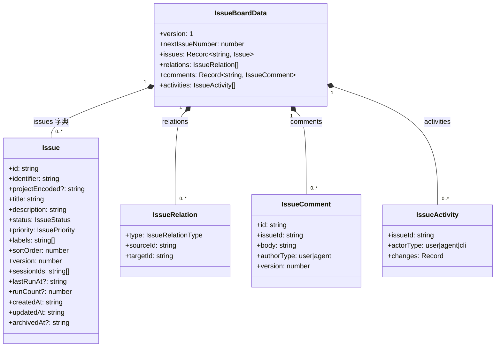
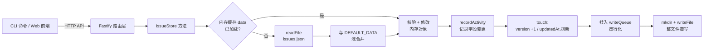

Issue 看板是 super-cli 的核心业务实体：它既是 Web 看板的渲染数据源，也是多个 Agent 通过 CLI 协作认领任务的工作单元。本页聚焦**存储层的数据模型**——一个 JSON 文件如何承载整个看板、`Issue` 实体各字段的设计意图、状态与优先级两套枚举的静态定义与运行时校验，以及标签和项目身份字段的处理方式。乐观锁机制、状态机流转纪律、评论与活动流的详细行为分别在后续页面展开。

## 单文件 JSON：IssueBoardData 的整体结构

与常见的"每条记录一个文件"不同，super-cli 把整个看板持久化为**单个 JSON 文件** `~/.super-cli/issues.json`。路径由 `getSuperCliIssuesPath()` 拼接：用户主目录下的 `.super-cli` 目录加固定文件名。这意味着看板数据天然跨项目全局共享，各 Issue 通过可选的 `projectEncoded` 字段归属于不同项目。

Sources: [paths.ts](src/core/paths.ts#L37-L47)

顶层结构是 `IssueBoardData` 接口，它由五部分组成：`issues` 字典（以 UUID 为键的全部 Issue）、`relations` 数组（Issue 间关系）、`comments` 字典（评论）、`activities` 数组（变更活动流），以及两个元数据字段——`version: 1` 为未来 schema 迁移预留的文件格式版本号，`nextIssueNumber` 是全看板共享的编号计数器。评论、活动、关系与 Issue 同文件共存的组合式设计，换来的是"一次读取即得完整看板"的简单性。

Sources: [types.ts](src/core/types.ts#L153-L160)

## 惰性加载与串行写队列：持久化的读写路径

`IssueStore` 采用**进程内缓存 + 全量覆写**的持久化策略。`load()` 首次调用时读取文件并做一层防御性合并——`{ ...DEFAULT_DATA, ...JSON.parse(content) }` 保证旧版本文件缺失的字段（如早期版本没有 `activities`）自动补齐默认值；文件不存在或 JSON 解析失败时，`catch` 分支静默回退到空看板。这个容错策略意味着损坏的数据文件不会让 CLI 崩溃，但也意味着下次写入会用全新数据覆盖它。

Sources: [issue-store.ts](src/core/issue-store.ts#L94-L104)

写入路径的关键是**写队列**：`save()` 把实际的 `writeFile` 操作链到 `writeQueue` Promise 上，确保同一进程内的并发修改按顺序落盘、不会交错写入过期快照（源码注释明确说明了这一意图）。写盘前先 `mkdir(recursive)` 确保目录存在，再以 `JSON.stringify(data, null, 2)` 的两空格缩进格式序列化——缩进让文件可以直接用编辑器查看和 diff，这是选择单文件 JSON 的附带收益。

Sources: [issue-store.ts](src/core/issue-store.ts#L85-L116)

需要注意的边界是：写队列只在**单个进程内**生效。服务端进程持有一个全局单例 store，而每次 CLI 命令执行都是独立进程、各自实例化新的 store——跨进程的并发写安全由 Issue 上的 `version` 字段保障，这正是乐观锁机制的职责（详见 [乐观锁机制：version 字段与多 Agent 并发写安全](13-le-guan-suo-ji-zhi-version-zi-duan-yu-duo-agent-bing-fa-xie-quan)）。

Sources: [issue-store.ts](src/core/issue-store.ts#L88-L92)

## Issue 实体：双标识与字段全景

`Issue` 接口共 15 个字段，最值得注意的是**双标识设计**：`id` 是 `randomUUID()` 生成的全局唯一主键，同时充当 `issues` 字典的键；`identifier` 则是人类可读编号 `ISSUE-N`，其序号来自看板级共享计数器 `nextIssueNumber`（创建时后缀自增）。

Sources: [types.ts](src/core/types.ts#L107-L124)

双标识直接服务于 `resolveIssue()` 的三种寻址方式：优先按完整 UUID 精确匹配；其次按 `identifier` 大小写不敏感匹配（`ISSUE-3` 与 `issue-3` 等价）；最后退化为 UUID 前缀匹配——但仅当恰好命中一个 Issue 时才返回，前缀歧义时返回 `null`。这让 Agent 在终端交互时可以用简短的 `ISSUE-3` 或 UUID 片段操作任务，CLI 和服务端的所有读写方法都走这一入口。

Sources: [issue-store.ts](src/core/issue-store.ts#L118-L126)

其余字段的职责如下表所示。其中 `sessionIds` 记录绑定到该 Issue 的会话（一个会话最多归属一个 Issue，绑定新 Issue 时会先从旧 Issue 解绑），`lastRunAt`/`runCount` 由无头执行管线写入运行痕迹，`archivedAt` 实现软删除——只有归档后的 Issue 才允许物理删除，删除时会级联清理其关系、评论和活动记录。

Sources: [issue-store.ts](src/core/issue-store.ts#L291-L304)

| 字段 | 类型 | 职责 |
|---|---|---|
| `id` | `string` | UUID 主键，`issues` 字典的键 |
| `identifier` | `string` | 人类可读编号 `ISSUE-N`，共享计数器分配 |
| `projectEncoded` | `string?` | 归属项目的路径身份（见下文归一化） |
| `title` / `description` | `string` | 标题（必填、创建时 trim）与 Markdown 描述 |
| `status` | `IssueStatus` | 七值状态枚举 |
| `priority` | `IssuePriority` | 五值优先级枚举，默认 `none` |
| `labels` | `string[]` | 自由格式标签数组，默认 `[]` |
| `sortOrder` | `number` | 列内排序键（见下文协议） |
| `version` | `number` | 乐观锁版本号，每次写入递增 |
| `sessionIds` | `string[]` | 绑定的 Agent 会话，全看板最多一个 Issue 持有某会话 |
| `lastRunAt` / `runCount` | `string?` / `number?` | 无头执行的最近时间与累计次数 |
| `createdAt` / `updatedAt` | `string` | ISO 时间戳 |
| `archivedAt` | `string?` | 软删除标记，非空即归档 |

Sources: [types.ts](src/core/types.ts#L107-L124)

## 状态：七值枚举的静态定义与运行时校验

状态字段采用 TypeScript 联合类型定义七种合法值：`'backlog' | 'todo' | 'in_progress' | 'in_review' | 'blocked' | 'done' | 'canceled'`。类型层约束之外，`issue-store.ts` 还维护了一个运行时数组 `ISSUE_STATUSES` 做二次校验——这是必要的纵深防御，因为所有外部输入（HTTP body、CLI 参数）在进入 store 前都只经过 `as never`/`as IssueStatus` 的类型断言而非真正的类型检查，恶意或拼错的值必须靠运行时校验拦截，失败即抛 `IssueStateError`。

Sources: [issue-store.ts](src/core/issue-store.ts#L53-L54)

创建 Issue 时状态可省略，默认落在 `todo`；而 `moveIssue` 等状态变更方法同样用该数组验证目标值的合法性。七种状态对应的看板列、中文标签与颜色由前端 `ISSUE_COLUMNS` 常量定义，数值语义约定如下表——其中 `backlog` 表示"未批准执行"（未经用户授权 Agent 不得认领）、`done` 只能由用户移入，这两条纪律属于工作流层约束，完整规则见 [Issue 状态机与 Agent 工作流纪律（claim / move / comment）](14-issue-zhuang-tai-ji-yu-agent-gong-zuo-liu-ji-lu-claim-move-comment)。

Sources: [issue-store.ts](src/core/issue-store.ts#L154-L155)

| 枚举值 | 看板列名 | 列颜色 | 语义要点 |
|---|---|---|---|
| `backlog` | 需求池 | `#6b7280` | 未批准执行，Agent 不得认领 |
| `todo` | 待办 | `#f59e0b` | 已批准，可被认领 |
| `in_progress` | 进行中 | `#3b82f6` | 认领后进入的工作态 |
| `in_review` | 待复查 | `#8b5cf6` | Agent 完成、等待用户验收 |
| `blocked` | 阻塞 | `#ef4444` | 做不动时移入，恢复后移回 |
| `done` | 已完成 | `#10b981` | 仅用户可移入 |
| `canceled` | 已取消 | `#9ca3af` | 任意状态可达的取消终态 |

Sources: [web/src/constants.ts](src/web/src/constants.ts#L25-L33)

## 优先级：五级枚举与静默默认值

优先级是独立的五值联合类型：`'none' | 'urgent' | 'high' | 'medium' | 'low'`，创建时缺省为 `none`，运行时同样有 `ISSUE_PRIORITIES` 数组把关——`createIssue` 与字段更新路径都会校验，非法值抛出与状态校验同型的 `IssueStateError`。与状态的关键差异在于**变更通道**：优先级通过 `updateIssue` 的字段补丁修改，不影响列位置；状态则必须走 `moveIssue` 通道，因为状态变更伴随 `sortOrder` 的重新分配。

Sources: [issue-store.ts](src/core/issue-store.ts#L187-L189)

前端的 `ISSUE_PRIORITY_META` 为四个非空优先级提供中文标签与颜色（`none` 不渲染徽标）：`urgent` 紧急（红）、`high` 高（橙）、`medium` 中（蓝）、`low` 低（灰）。CLI 侧 `--priority` 参数的帮助文本直接枚举了五个合法值，与服务端路由的透传形成一致的契约。

Sources: [web/src/constants.ts](src/web/src/constants.ts#L35-L40)

## sortOrder：列内排序的数值协议

看板列内的卡片顺序由 `sortOrder` 数值决定，它的分配协议很简洁：新建或移入某列时，`nextSortOrder()` 找到该列现有最小值再减 1000——即**新卡片永远插到列首**；空列则从 0 起步。数值间隔 1000 为列内插入留出充足空间，但拖拽重排（`moveIssue` 允许显式指定 `sortOrder`）仍可能让间隔变得任意小。

Sources: [issue-store.ts](src/core/issue-store.ts#L176-L180)

列表查询的最终排序是 `sortOrder` 升序，打平时以 `createdAt` 字符串升序做决胜——保证同 `sortOrder` 的卡片有确定的展示顺序。归档 Issue 在未显式请求时被过滤掉，且不参与列首计算（`nextSortOrder` 明确排除了 `archivedAt` 非空的记录）。

Sources: [issue-store.ts](src/core/issue-store.ts#L134-L145)

## 标签：无 schema 的自由字符串数组

标签的设计哲学是**极简**：`labels: string[]`，没有预定义词表、没有颜色映射、没有规范化（不去重、不改大小写）。CLI 通过 `--label "后端,紧急"` 传入，`parseLabels()` 按逗号分割、逐项 trim、过滤空串后得到数组。

Sources: [cli/commands/issue.ts](src/cli/commands/issue.ts#L73-L75)

更新语义是**整体替换**而非增量合并——CLI 帮助文本明确标注 "replaces existing"，传入新数组即完整覆盖旧数组。值得注意的实现细节是 `applyUpdate()` 用 `JSON.stringify` 深比较新旧值：只有真正发生变化才记录到 `changes` 并应用；但外层 `touch()` 无条件递增 `version` 并刷新 `updatedAt`，即使本次 PATCH 实际没有任何字段差异（此时活动流因空 `changes` 而跳过记录）。这意味着"空更新"也会消耗一次版本号，客户端必须同步最新版本才能继续写。

Sources: [issue-store.ts](src/core/issue-store.ts#L182-L196)

## projectEncoded：项目身份与 legacy 归一化

`projectEncoded` 是可空字段，但两条入口都强制要求它：服务端 `POST /api/issues` 缺失时直接返回 `PROJECT_REQUIRED` 400 错误，CLI 的 `create` 命令将其声明为 `requiredOption`。字段名里的 "Encoded" 是历史包袱——它可能存放**已解码的绝对路径**（`/` 开头），也可能存放各 Provider 风格的 dash 编码目录名，这在多 Provider 适配的背景下不可避免。

Sources: [server/routes/issues.ts](src/server/routes/issues.ts#L50-L55)

为此，store 在按项目过滤时不直接字符串比较，而是先经 `normalizeProjectIdentity()` 归一化：以 `/` 开头的值视为已解码原样返回，否则用 `decodeAnyProjectPath()` 做最优猜测解码（双横线前缀按 pi 编码、32 位十六进制按 kimi 的 md5 视为不可解码、单横线按 claude-code 编码）。`paths.ts` 还提供 `resolveIssueProjectPath()` 做磁盘验证兜底——因为 dash 编码对含 `-` 的目录名是有损的（`super-cli` 会解码成 `super/cli`），需要验证候选路径真实存在或查会话索引的别名映射。项目路径编码体系本身的完整讨论见 [项目路径编码：跨 Provider 的目录命名映射与解码](10-xiang-mu-lu-jing-bian-ma-kua-provider-de-mu-lu-ming-ming-ying-she-yu-jie-ma)。

Sources: [issue-store.ts](src/core/issue-store.ts#L56-L60)

## 错误契约：三种领域异常的 HTTP 映射

数据模型的行为边界由三个领域异常定义，服务端将它们确定性映射为 HTTP 状态码，Agent 和前端据此区分"重试可能成功"与"必须停止"两类失败。`VersionConflictError` 携带期望与实际版本号，是乐观锁冲突信号；`IssueNotFoundError` 覆盖三种寻址方式全部未命中的情况；`IssueStateError` 则承载所有业务规则违反（非法状态/优先级、空标题、认领冲突、父关系成环等）。

| 异常类 | `code` | HTTP 状态 | 典型触发场景 |
|---|---|---|---|
| `VersionConflictError` | `VERSION_CONFLICT` | 409 | 写入时 `expectedVersion` 与实际 `version` 不符 |
| `IssueNotFoundError` | `ISSUE_NOT_FOUND` | 404 | UUID、identifier、前缀均未命中 |
| `IssueStateError` | `ISSUE_STATE` | 400 | 非法枚举值、空标题、归档后操作、重复关系等 |

Sources: [issue-store.ts](src/core/issue-store.ts#L15-L40)

Sources: [server/routes/issues.ts](src/server/routes/issues.ts#L16-L30)

## 延伸阅读

数据模型是看板体系的地基，向上支撑三块能力：`version` 字段驱动的**乐观锁机制**如何让多个 Agent 进程安全并发写同一文件，见 [乐观锁机制：version 字段与多 Agent 并发写安全](13-le-guan-suo-ji-zhi-version-zi-duan-yu-duo-agent-bing-fa-xie-quan)；七种状态之上的**claim/move/comment 工作流纪律**（backlog 不可认领、done 仅用户可移），见 [Issue 状态机与 Agent 工作流纪律（claim / move / comment）](14-issue-zhuang-tai-ji-yu-agent-gong-zuo-liu-ji-lu-claim-move-comment)；`relations`、`comments`、`activities` 三个伴生结构的完整行为，见 [评论、活动流与 Issue 关系（父子、阻塞、关联）](15-ping-lun-huo-dong-liu-yu-issue-guan-xi-fu-zi-zu-sai-guan-lian)。若想了解 CLI 层如何消费这套模型（`--json` 输出、`--if-version` 参数），可回顾 [CLI 命令全景：list、show、search、issue 与 --json 输出](3-cli-ming-ling-quan-jing-list-show-search-issue-yu-json-shu-chu)。