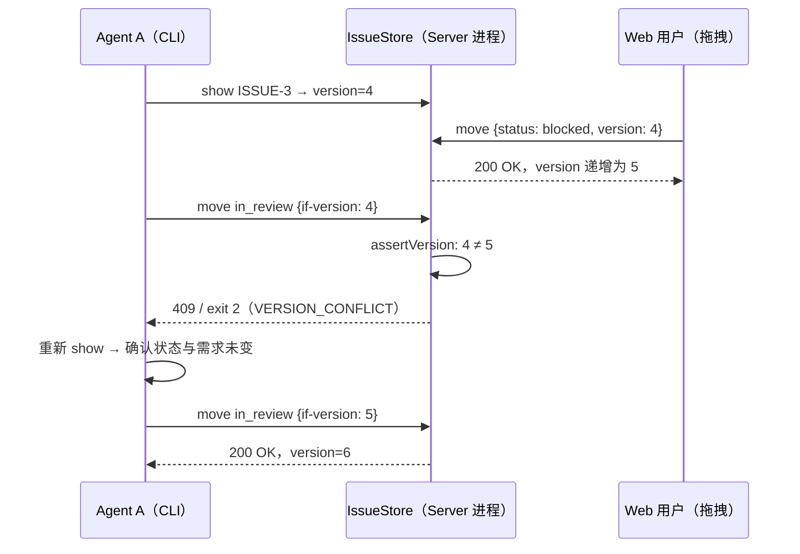
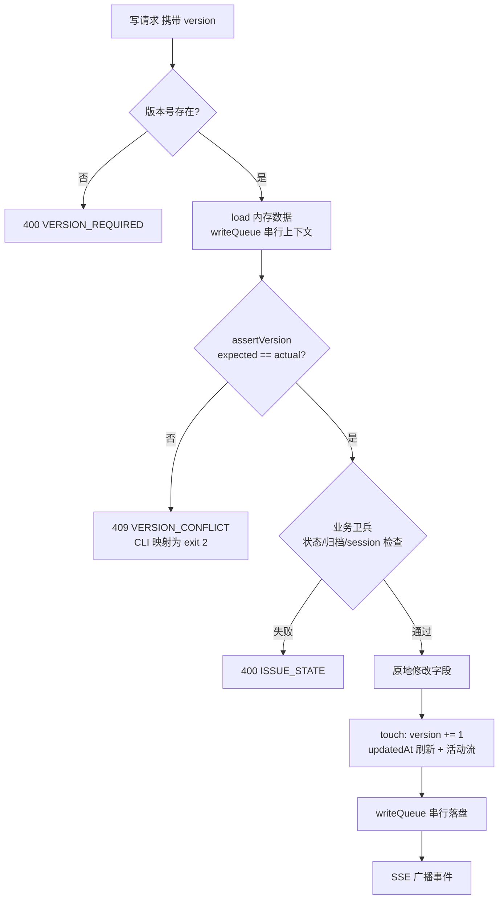

super-cli 的 Issue 看板是一个多写入端共享的单一 JSON 文件存储：多个 AI Agent（Claude Code、Codex、Kimi CLI 等）、Web 看板用户和 CLI 脚本可能同时读写同一批 Issue。为了让"读到旧数据后覆盖他人改动"这种经典的丢失更新（lost update）问题在无锁环境下变得可检测、可恢复，IssueStore 为每个 Issue（以及每条评论）引入了一个单调递增的 `version` 字段：所有改字段的写操作必须携带写入方最近一次读到的版本号，不匹配则拒绝写入并抛出冲突。本文拆解这套乐观锁的数据模型、写入协议、进程内串行化、协议层暴露（HTTP 409 与 CLI exit code 2）、前端与 Agent 侧的冲突处理纪律，以及刻意不走版本门的几条路径。

## 并发场景：为什么单一 JSON 文件需要乐观锁

super-cli 的看板数据持久化在 `getSuperCliIssuesPath()` 指向的一个 JSON 文件中，由 `IssueStore` 全权管理：读时整体加载进内存，写时整体序列化回盘。在这个存储之上并存三类写入方——长驻的 Fastify 服务（Web 看板的所有变更经由它）、一次性拉起的 CLI 进程（每个 `super-cli issue ...` 命令都新建一个 `IssueStore` 实例）、以及由 TaskRunner 驱动的无头 Agent 执行流。当两个 Agent 同时认领任务、或用户在看板拖拽卡片的同时 Agent 正在评论时，任何"读取—修改—写回"如果不加保护，都会出现后写者悄悄覆盖前写者的情况。

乐观锁的思路是：不加互斥锁，而是让每次写入声明"我基于哪个版本在改"。存储层对比声明值与当前值，不一致就拒绝。这样冲突不会被静默吞掉，而是被转化为一个显式信号（`VERSION_CONFLICT`），由调用方决定重读还是放弃。相比悲观锁（文件锁、读写锁），这避免了单用户工作站场景下的锁管理与死锁风险，代价只是冲突时的重读成本——在低竞争的本地开发场景中几乎为零。

Sources: [issue-store.ts](src/core/issue-store.ts#L85-L104), [issue.ts](src/cli/commands/issue.ts#L96)

## 数据模型：三个"version"的职责边界

`types.ts` 中出现了三个名字都叫 version 的字段，必须先厘清它们的职责边界，否则容易混淆：

| 字段 | 所属实体 | 类型约束 | 职责 |
|---|---|---|---|
| `Issue.version` | 每个 Issue | `number`，单调递增 | **并发控制令牌**：写操作的前置条件 |
| `IssueComment.version` | 每条评论 | 初始为 1，编辑时 +1 | 评论内容编辑的并发控制令牌 |
| `IssueBoardData.version` | 整个看板文件 | 字面量类型 `1` | **Schema 版本**：标识持久化格式，与并发无关 |

`IssueBoardData.version` 的类型被声明为字面量 `1`，默认数据中也固定写死为 1——它只用于未来数据格式迁移时识别旧文件，永远不参与版本比较。真正承担并发安全的是实体级的 `Issue.version` 与 `IssueComment.version`：前者在 Issue 创建时初始化为 1，此后每次成功变更由统一的 `touch()` 方法递增；后者在评论创建时置 1，仅在 `updateComment` 编辑正文时递增。评论本身是追加式数据结构（新增评论生成全新 UUID，不改旧行），所以新增评论不需要版本门，只有编辑需要。

Sources: [types.ts](src/core/types.ts#L107-L143), [types.ts](src/core/types.ts#L153-L160), [issue-store.ts](src/core/issue-store.ts#L42-L49)

## 写入协议：断言、变更、递增的三段式

`IssueStore` 的核心写入协议由三个私有/公有方法协作完成。`assertVersion(issue, expectedVersion)` 是唯一的版本比较点：`issue.version !== expectedVersion` 时抛出携带预期值与实际值的 `VersionConflictError`（错误码 `VERSION_CONFLICT`）。`touch(data, issue, actorType, changes)` 是所有成功变更的统一出口：`version += 1`、刷新 `updatedAt`、并把结构化的 from/to 变更记录写入活动流。两者把"校验—变更—递增"封装成固定次序，业务方法只需按序调用：

```typescript
async updateIssue(id, patch, expectedVersion, actorType) {
  const data = await this.load();
  const issue = await this.getIssue(id);
  this.assertVersion(issue, expectedVersion);   // 1. 断言版本
  const changes = this.applyUpdate(issue, patch); // 2. 应用变更
  this.touch(data, issue, actorType, changes);    // 3. 递增版本 + 记录活动
  await this.save();
  return issue;
}
```

这个模式贯穿了全部七个改 Issue 字段的变更方法，它们构成完整的"版本门"清单：

| 方法 | 版本门保护的内容 | 特殊语义 |
|---|---|---|
| `updateIssue` | title / description / priority / labels / projectEncoded | 字段无实质变化时仍会递增版本 |
| `moveIssue` | status / sortOrder | 跨列移动自动分配新列 sortOrder |
| `archiveIssue` | archivedAt | 已归档则幂等跳过 |
| `restoreIssue` | archivedAt | 未归档则幂等跳过 |
| `deleteIssue` | 整个 Issue 及其关系/评论/活动的级联删除 | 仅允许删除已归档 Issue |
| `bindSession` | sessionIds 绑定 | 同时把该 session 从其他 Issue 上摘除 |
| `unbindSession` | sessionIds 解绑 | 未绑定则幂等跳过 |

注意版本断言发生在内存数据上，而非磁盘文件上：`load()` 有实例级缓存（`this.data`），断言比较的是当前进程视角的最新状态。它的正确性由两根支柱共同保障——进程内的写入队列（下一节）保证内存状态不会在断言与落盘之间被并发变更穿透，而进程间则依赖"每次 CLI 调用都是短命进程、断言前刚从磁盘加载"这一事实把竞态窗口压缩到毫秒级。

Sources: [issue-store.ts](src/core/issue-store.ts#L198-L208), [issue-store.ts](src/core/issue-store.ts#L495-L503), [issue-store.ts](src/core/issue-store.ts#L15-L24)

## 进程内串行化：writeQueue 如何封死内存竞态

只有版本断言还不够：Node.js 的 `writeFile` 是异步的，若两个变更方法同时执行，A 的断言通过后、落盘完成前，B 可能基于同一份内存快照也通过断言，两个写入交错落盘。`IssueStore` 用一条 Promise 链 `writeQueue` 把所有落盘操作强制串行化——`save()` 把写入任务追加到队列尾部，前一个写完才轮到下一个，代码注释明确说明了意图："Serialize writes so concurrent mutations cannot interleave a stale snapshot"：

```typescript
private save(): Promise<void> {
  const data = this.data;
  const task = this.writeQueue.then(async () => {
    if (!data) return;
    await mkdir(getSuperCliHome(), { recursive: true });
    await writeFile(this.dataPath, JSON.stringify(data, null, 2), 'utf-8');
  });
  this.writeQueue = task.catch(() => {});
  return task;
}
```

这里有个值得注意的细节：闭包捕获的是调用 `save()` 那一刻的 `this.data` 引用，且 `this.data` 是被所有变更方法原地修改（mutate）的同一对象——所以串行化保证的是"写入顺序与变更顺序一致、不会用旧快照覆盖新快照"，而非快照隔离。队列通过 `task.catch(() => {})` 吞掉单次写入失败的拒绝，避免队列断裂导致后续所有写入永远挂起。

Sources: [issue-store.ts](src/core/issue-store.ts#L88), [issue-store.ts](src/core/issue-store.ts#L106-L116)

## 刻意不走版本门的路径：状态卫兵、追加写与内部通道

并非所有变更都强制要求版本号。IssueStore 中存在四类刻意豁免的路径，每一类都有替代性的不变量（invariant）来保障安全，这比"一刀切全部门控"更能说明乐观锁在这里的真实角色——它是**字段级读改写的保护伞**，而非所有写操作的前置条件：

| 路径 | 豁免原因 | 替代性安全机制 |
|---|---|---|
| `createIssue` | 新实体无历史版本可断言 | 版本从 1 起步，UUID 保证键唯一 |
| `claimIssue` | 认领是**状态卫兵**而非版本比较 | 检查归档/可认领状态/session 占用，幂等续做 |
| `addComment` | 追加式写入，不改既有数据 | 新评论 UUID 天然无冲突 |
| `recordRun` | 内部审计投影（lastRunAt/runCount） | 注释明确"no version gate; internal use" |

`claimIssue` 最值得展开。多 Agent 认领任务的本质竞争是"两个 Agent 同时抢同一个 todo 任务"，如果用版本门解决，两个 Agent 都要先 `show` 再带版本认领，时序上更容易撞车。实现改为守护命令（guarded command）风格：断言 issue 未归档、状态必须是 `todo` 或 `in_progress`、且 `sessionIds` 为空或已含当前 session——不满足即抛 `IssueStateError`。由于状态检查和状态变更在同一次内存修改中完成（并有 writeQueue 兜底），"先检查后认领"不会产生双主：第二个 Agent 必然看到 `sessionIds` 已被占用。同时它天然幂等——已绑定当前 session 的 `in_progress` Issue 再次 claim 时 `changes` 为空，直接返回不递增版本（代码注释 "idempotent re-claim"）。这实际上是用**业务状态**替代了**版本号**作为比较对象，是乐观锁思想在状态机维度上的变体。

Sources: [issue-store.ts](src/core/issue-store.ts#L232-L264), [issue-store.ts](src/core/issue-store.ts#L338-L354), [issue-store.ts](src/core/issue-store.ts#L438-L457)

## 协议层暴露：HTTP 409 与 CLI exit code 2

版本门的价值取决于冲突信号能否被每种客户端可靠识别。super-cli 在 HTTP 与 CLI 两个协议面上做了对称的错误映射：

**HTTP 面**：所有需要版本的端点先做参数校验，缺失版本号直接返回 400 与 `VERSION_REQUIRED` 错误码（让调用方尽早发现协议误用）；版本不匹配则由 `sendError` 把 `VersionConflictError` 映射为 HTTP 409 Conflict，错误码 `VERSION_CONFLICT`。此外每个写请求可通过 `x-super-cli-actor` 请求头声明操作者身份（user/agent/cli），它会进入活动流，让"这条变更是谁写的"可追溯。

| 端点 | 版本传递方式 | 缺失版本时 |
|---|---|---|
| `PATCH /api/issues/:id` | body `version` | 400 `VERSION_REQUIRED` |
| `DELETE /api/issues/:id` | query `?version=` | 400 `VERSION_REQUIRED` |
| `POST /api/issues/:id/move` | body `{ status, version }` | 400 `BAD_REQUEST` |
| `POST /api/issues/:id/archive` / `restore` | body `{ version }` | 400 `VERSION_REQUIRED` |
| `PATCH /api/comments/:id` | body `{ version }` | 400 `VERSION_REQUIRED` |
| `POST/DELETE /api/issues/:id/sessions/:sessionId` | body `version` / query `?version=` | 400 `VERSION_REQUIRED` |

**CLI 面**：`update`、`move`、`archive`、`restore`、`delete`、`bind`、`unbind` 七个命令都提供 `--if-version <n>` 选项。`requireVersion` 辅助函数实现了一个宽松回退：显式传了 `--if-version` 就用它，否则读取当前版本直接写入（适用于脚本不在乎竞争的场景）。冲突时 `fail()` 以 **exit code 2** 退出并输出结构化 JSON 错误，与其他失败的 exit code 1 区分开——这使得 Shell 脚本和 Agent 都能用退出码做分支判断，无需解析错误文本。

Sources: [issues.ts](src/server/routes/issues.ts#L16-L35), [issues.ts](src/server/routes/issues.ts#L85-L91), [issue.ts](src/cli/commands/issue.ts#L14-L24), [issue.ts](src/cli/commands/issue.ts#L77-L80)

## 客户端策略：冲突即刷新，而非自动重放

Web 前端与 Agent Skill 对 409/exit 2 的处理共享同一条哲学：**冲突不是要自动吞掉的错误，而是"你手里的数据已过期"的信号，正确反应是刷新视图、由人（或 Agent）基于最新状态重新决策**。

Web 端的 `ApiError` 类携带 HTTP status 与服务端错误码，`jsonOrThrow` 把非 2xx 响应统一转成该异常。看板拖拽落列时，`handleDropIssue` 把卡片当前快照中的 `issue.version` 随 move 请求发出；收到 409 时弹出"数据已被修改，正在刷新"并整体重拉 Issue 列表，而不是用本地状态盲目重试。Issue 详情面板的 `run()` 变更包装器同理：409 时重载详情，让用户看到带最新版本的界面再决定是否重做操作。注意这条策略的含义——前端不做合并、不做静默重放，两次编辑的语义冲突（比如两边改了不同的字段）交给用户在刷新后的最新视图上人工裁决。



Agent 侧的纪律被写进了随包分发的 `super-cli-taskboard` Skill 和 `docs/issue-workflow.md`，构成三层中的"社会性约定"层：写操作必须携带取自最近一次 `show` 的 `--if-version`；收到 exit 2 + `VERSION_CONFLICT` 时"不是错误而是信号"——重新 `show`，确认仍可认领且需求未变，**最多重试一次**；明确禁止循环重试、禁止接管其他 session 已绑定的 Issue。最多重试一次的约束防止了两个 Agent 陷入互相触发版本递增的死循环（重试本身又会推进版本，使对方再次冲突）。

Sources: [client.ts](src/web/src/api/client.ts#L249-L266), [App.tsx](src/web/src/App.tsx#L444-L461), [IssueDetail.tsx](src/web/src/components/IssueDetail.tsx#L179-L199), [SKILL.md](skills/super-cli-taskboard/SKILL.md#L47-L51), [issue-workflow.md](docs/issue-workflow.md#L39-L43)

## 内部通道：TaskRunner 的 best-effort 状态推进

无头执行管线（`issue run`）提供了另一组有意思的对照样本。`startRun` 在启动子进程前会把 `todo` 状态的 Issue 自动推进到 `in_progress`，对齐 claim 语义——但它传入的 `issue.version` 来自几行之前取出的内存快照，且整个调用被 try/catch 包裹、注释写明 "best-effort; never fail the run over it"：状态推进失败（例如用户恰好在这一瞬间手动移动了卡片）不应阻塞 Agent 执行本身。run 结束后的 `recordRun`（更新 lastRunAt/runCount 并绑定 session）和结果评论则是彻底的免版本内部通道。这三处共同体现了一个分层原则：**面向外部调用者的协议必须严格版本门控；面向内部子系统的协调操作可以降级为尽力而为，用业务容忍度换取执行链路的健壮性**。

Sources: [task-runner.ts](src/core/task-runner.ts#L248-L255), [task-runner.ts](src/core/task-runner.ts#L287-L297)

## 一次写请求的完整判定路径

把前述机制串起来，一次带版本的写请求在系统中的完整流转如下：参数层校验版本号是否存在（缺 → 400），存储层断言版本是否匹配（不符 → 409），业务卫兵校验状态合法性（如认领状态、归档删除前置 → 400 `ISSUE_STATE`），全部通过后原地修改、递增版本、记录活动，经 writeQueue 串行落盘，最后由 EventHub 广播 SSE 事件驱动其他客户端刷新。



Sources: [issues.ts](src/server/routes/issues.ts#L8-L30), [issue-store.ts](src/core/issue-store.ts#L198-L230), [issue-store.ts](src/core/issue-store.ts#L495-L503)

## 设计权衡：乐观锁在单机多 Agent 场景下的边界

最后诚实地标注这套机制的适用边界。乐观锁的全部保障建立在"断言所见的内存状态与落盘状态一致"之上；进程内由 writeQueue 保证，但跨进程（并行的两个 CLI 调用、CLI 与 Server 同时写）时，IssueStore 没有操作系统级的文件锁，两个短命 CLI 进程理论上仍可能在彼此的 load 与 save 之间交错，形成最后写入者覆盖。代码选择接受这一点，依据是场景特征：单用户工作站、写冲突天然稀疏、且最重要的——**冲突被设计为可见信号而非需要机器 Perfect 处理的故障**。权衡对比如下：

| 维度 | 乐观锁（本实现） | 悲观锁（文件锁/flock） |
|---|---|---|
| 无竞争时的成本 | 一次整数比较，近零 | 锁获取/释放的系统调用开销 |
| 冲突时的行为 | 显式 409/exit 2，调用方重读决策 | 阻塞等待或自旋 |
| 实现复杂度 | 一个字段 + 一个断言函数 | 跨进程锁、锁超时、崩溃恢复 |
| 失败模式 | 可检测的拒绝（安全失败） | 持锁进程崩溃导致死锁 |
| 适用前提 | 冲突稀疏、重试代价低 | 冲突频繁、临界区长 |

对于"几个 Agent 加一个人类在看板上协作"的负载，这个取舍是清晰合理的：它把并发正确性拆成了三层互补机制——进程内串行化保证内存一致性、版本断言把跨进程竞态转化为显式冲突、Skill 纪律把冲突处理上升为 Agent 行为规范。理解了这一分层，你在扩展 Issue 模型（新增字段或变更端点）时就知道该把新变更挂进哪个层次：改 Issue/评论字段就加版本门，新增守护型操作就仿照 `claimIssue` 用状态卫兵。

Sources: [issue-store.ts](src/core/issue-store.ts#L15-L24), [issue-store.ts](src/core/issue-store.ts#L106-L116), [SKILL.md](skills/super-cli-taskboard/SKILL.md#L8)

## 延伸阅读

- 想了解 `version` 字段所在的完整 Issue 数据模型（JSON 持久化结构、状态、优先级与标签），请阅读 [Issue 数据模型：JSON 持久化、状态、优先级与标签](12-issue-shu-ju-mo-xing-json-chi-jiu-hua-zhuang-tai-you-xian-ji-yu-biao-qian)
- 乐观锁之上的状态流转规则（claim / move / comment 纪律）在 [Issue 状态机与 Agent 工作流纪律（claim / move / comment）](14-issue-zhuang-tai-ji-yu-agent-gong-zuo-liu-ji-lu-claim-move-comment) 中展开
- 写入成功后的 SSE 事件广播如何驱动多端看板同步，见 [SSE 实时事件推送：EventHub 设计与事件类型](16-sse-shi-shi-shi-jian-tui-song-eventhub-she-ji-yu-shi-jian-lei-xing)
- 前端消费这些事件与 409 刷新策略的完整实现，见 [前端实时同步：消费 SSE 事件流更新看板](24-qian-duan-shi-shi-tong-bu-xiao-fei-sse-shi-jian-liu-geng-xin-kan-ban)