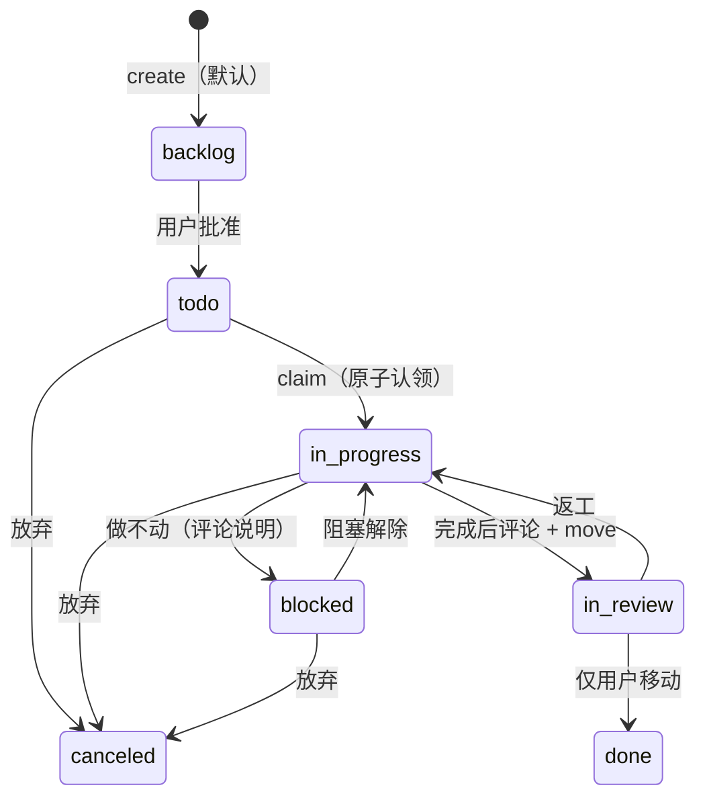
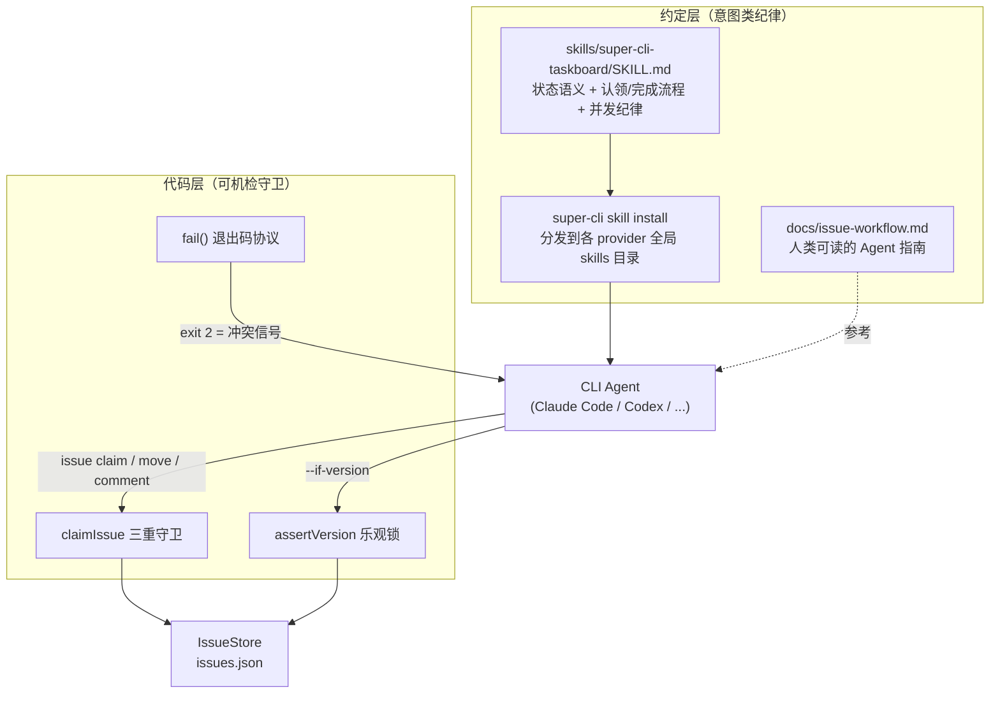
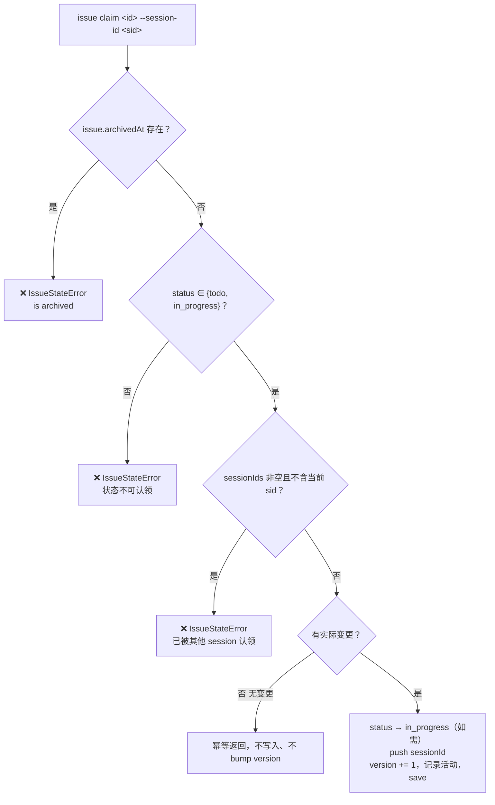
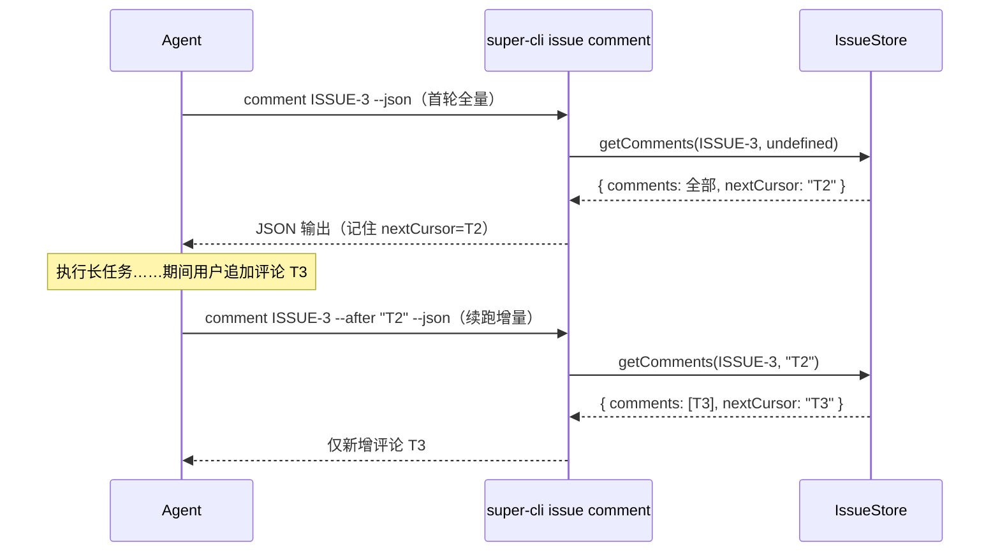

super-cli 的 issue 看板设计给两类使用者：人类用户在 Web 看板上操作，而 Claude Code、Codex 等 CLI Agent 通过 `super-cli issue` 子命令认领和推进任务。多 Agent 并发写同一个 JSON 文件时，仅靠乐观锁（详见 [乐观锁机制：version 字段与多 Agent 并发写安全](13-le-guan-suo-ji-zhi-version-zi-duan-yu-duo-agent-bing-fa-xie-an-quan)）只能保证数据不损坏，无法保证 Agent 行为有序——比如两个 Agent 同时抢一个任务、或者 Agent 自作主张把任务标记为完成。本文聚焦系统如何回答这个问题：状态机本身如何定义、哪些规则由代码强制、哪些纪律通过 Skill 约定传递给 Agent，以及 `claim` / `move` / `comment` 三个关键操作如何支撑这套工作流。

## 一、状态机全貌：七个状态与语义分工

状态集合由 TypeScript 联合类型和运行时常量双重定义，共七个状态：`backlog`（未批准）、`todo`（已批准待认领）、`in_progress`（进行中）、`in_review`（待验收）、`blocked`（阻塞）、`done`（完成）、`canceled`（取消）。每个状态不是单纯的看板列名，而是承载了"谁可以对这个 issue 做什么"的语义：`backlog` 意味着未经用户批准，Agent 不得认领；`todo` 意味着已批准、可认领；`done` 意味着只有用户有权移入。

值得注意的架构决策是：**代码层不校验状态转移的合法性**。`moveIssue` 只检查目标状态是否属于七个合法值之一，然后直接赋值，任意状态可以移到任意状态。

Sources: [types.ts](src/core/types.ts#L104)、[issue-store.ts](src/core/issue-store.ts#L53-L54)、[issue-store.ts](src/core/issue-store.ts#L210-L230)、[docs/issue-workflow.md](docs/issue-workflow.md#L7-L12)

## 二、双层执行模型：机器守卫 + 约定纪律

既然 `move` 不校验转移路径，"backlog 不可认领"、"done 只能用户移入"这些规则靠什么保证？答案是系统有意采用的**双层执行模型**：机器守卫只负责那些成本低、可确定性验证的条件（并发冲突、归档状态、认领归属），而涉及"意图"的纪律（这个 issue 是否已被批准、这次移动是否是用户授权的）通过 SKILL 文档教给 Agent，由 Agent 自觉遵守。

Skill 文档的传递机制是构建期内联的：`issue-skill.ts` 在打包时把 SKILL.md 文件内容内联进 CLI 二进制，`super-cli skill install` 再把它写入各 provider 的全局 skills 目录，使 Agent 在会话中自动加载这份工作流说明。这样约定纪律的"源代码"只有一个（仓库中的 SKILL.md），分发即安装。

| 维度 | 代码层守卫 | 约定层纪律 |
|------|-----------|-----------|
| 执行者 | `IssueStore` 方法内的 if 判断 | Agent 阅读 SKILL.md 后自觉遵守 |
| 典型规则 | 归档 issue 不可认领；已被其他 session 认领的不可抢；版本冲突拒绝写入 | `done` 只能用户移入；`backlog` 未经批准不动；冲突后最多重试一次 |
| 违反后果 | 抛 `IssueStateError` / `VersionConflictError`，exit 1 / 2 | 无运行时惩罚，但活动流（actorType）留下审计痕迹 |
| 可验证性 | 确定性、可单元测试 | 依赖 Agent 遵循能力 |

Sources: [issue-store.ts](src/core/issue-store.ts#L232-L236)、[issue-skill.ts](src/core/issue-skill.ts#L1-L8)、[skills/super-cli-taskboard/SKILL.md](skills/super-cli-taskboard/SKILL.md#L10-L51)、[docs/issue-workflow.md](docs/issue-workflow.md#L16-L37)

## 三、claim：一步完成的原子认领

`claim` 是整个工作流的枢纽操作，对应 `IssueStore.claimIssue`。它的语义是**在一次写入中同时完成状态转移和 session 绑定**——`todo → in_progress` 加上把当前 Agent 的 sessionId 追加到 `sessionIds` 数组。之所以必须原子，是因为如果拆成"先 move 再 bind"两步，中间窗口内另一个 Agent 可能看到 `in_progress` 却没有归属者的 issue，造成双重认领。

认领入口有三重守卫，任何一条不满足即抛 `IssueStateError` 终止：其一，已归档的 issue 不可认领；其二，状态必须处于 `todo` 或 `in_progress`（后者是幂等续做的前提）；其三，若 `sessionIds` 非空且不包含调用者的 sessionId，判定为"已被其他 session 认领"而拒绝。

幂等性是显式设计的：如果 issue 已处于 `in_progress` 且已绑定当前 session，`claimIssue` 检测到没有任何字段变化就直接返回，不触发写入也不递增 version（源码中的注释明确写着 `idempotent re-claim`）。这支撑了 SKILL.md 中的续做场景——Agent 恢复中断的任务时可以安全地重复 claim。另外，CLI 层根据是否提供 `--session-id` 决定活动流中的行为者类型：提供时记为 `agent`，否则记为 `cli`，这让看板的溯源数据能区分机器认领和人工操作。

Sources: [issue-store.ts](src/core/issue-store.ts#L237-L264)、[issue-store.ts](src/core/issue-store.ts#L240-L246)、[issue-store.ts](src/core/issue-store.ts#L260)、[issue.ts](src/cli/commands/issue.ts#L225-L238)

## 四、move：宽松转移与冲突即信号协议

`move` 命令与 `claim` 形成鲜明对比：`claimIssue` 严格守卫，而 `moveIssue` 对转移路径完全放行。这是有意的分工——`claim` 处理的是高竞争场景（多 Agent 抢任务），必须机器仲裁；`move` 处理的是流程推进，谁能移动、移到哪里的判断涉及用户意图，机器无法验证，只能交由约定层约束。

机器虽然不拦转移，但拦并发。`moveIssue` 入口处的 `assertVersion` 对比 issue 当前的 `version` 字段与调用方声明的 `expectedVersion`，不一致即抛 `VersionConflictError`。CLI 层把不同错误映射为不同的进程退出码：`VersionConflictError` 退出码为 **2**，其他 `IssueStateError` / `IssueNotFoundError` 退出码为 1，并以 JSON 格式输出错误对象。退出码 2 是专门为 Agent 设计的协议信号——SKILL.md 明确规定"冲突不是错误而是信号：重新 `show`、确认仍可认领且需求未变，最多重试一次；绝不循环重试，绝不接管其他会话的认领"。

一个容易被忽略的细节：所有写命令的 `--if-version` 是可选的。CLI 的 `requireVersion` 在未提供该参数时会直接读取当前 version 并放行，等于放弃锁保护。因此"所有写操作必须携带 `--if-version`"本身是约定层纪律，而不是机器强制——Agent 若偷懒省略，代码不会报错，但多 Agent 场景下的丢失更新风险由使用者自己承担。

| 操作 | 机器守卫强度 | 约定层要求 | 冲突退出码 |
|------|-------------|-----------|-----------|
| `claim` | 三重守卫 + 幂等 | 在动任何文件之前先 claim；失败即停 | 1（IssueStateError） |
| `move` | 仅版本校验（若提供 `--if-version`） | `done` 仅用户移入；做不动移 `blocked`；放弃移 `canceled` | 2（VERSION_CONFLICT） |
| `comment` | 无版本门槛（追加式写入） | 先评论记录结果再移 `in_review`；评论即当前需求 | — |

Sources: [issue-store.ts](src/core/issue-store.ts#L210-L230)、[issue-store.ts](src/core/issue-store.ts#L501-L503)、[issue.ts](src/cli/commands/issue.ts#L14-L24)、[issue.ts](src/cli/commands/issue.ts#L77-L80)、[skills/super-cli-taskboard/SKILL.md](skills/super-cli-taskboard/SKILL.md#L47-L51)

## 五、comment：需求载体与增量同步协议

在这个工作流里，评论不只是沟通记录，而是**活的需求文档**。SKILL.md 和 docs/issue-workflow.md 都把"评论视为当前需求（含返工）"列为第一纪律：Agent 接手 issue 前必须先 `issue show <id> --comments --json` 读完整描述和全部评论；如果评论里用户说"先别做"，Agent 必须停止。这解决了一个真实问题：任务的原始描述是静态的，而用户的追加要求、返工指令都发生在评论区，不读评论就动手的 Agent 一定会做错方向。

支撑这条纪律的是评论的**增量同步机制**。`getComments` 按 `createdAt` 升序排列某 issue 的全部评论，接受一个 `after` 游标参数，只返回时间戳严格晚于游标的评论；返回值中的 `nextCursor` 是最后一条评论的 `createdAt`。CLI 的 `comment` 命令在 `--json` 模式下输出 `{ comments, nextCursor }` 对象，Agent 在长任务中每次续跑时把上次拿到的 `nextCursor` 通过 `--after` 传回，即可只拉取新增评论，无需重复读取全量历史。

完成流程同样依赖 comment 与 move 的配合：Agent 验证改动可用后，先用 `comment <id> --add "..." --agent --session-id <sid>` 记录改动内容、验证方式和遗留风险，再执行 `move <id> in_review --if-version <N>`。先评论后移动的顺序保证验收者在 issue 进入 `in_review` 时一定能看到结果说明。追加评论（`addComment`）本身没有版本门槛——评论是追加式写入，不存在覆盖他人修改的问题，因此不需要乐观锁；只有编辑已有评论（`updateComment`）才检查评论自身的独立 version。

Sources: [issue-store.ts](src/core/issue-store.ts#L428-L436)、[issue-store.ts](src/core/issue-store.ts#L438-L457)、[issue-store.ts](src/core/issue-store.ts#L459-L470)、[issue.ts](src/cli/commands/issue.ts#L311-L340)、[docs/issue-workflow.md](docs/issue-workflow.md#L17-L32)

## 六、Agent 工作流纪律全景

把约定层的完整规则汇总成一张操作手册视图。这些规则同时写在两处：`docs/issue-workflow.md` 面向人类读者解释"为什么"，`skills/super-cli-taskboard/SKILL.md` 以 Agent 可执行的指令形式存在，二者内容一致、互为镜像。

| # | 纪律 | 覆盖的操作 | 违反后果 |
|---|------|-----------|---------|
| 1 | 先读后做：接手前 `show --comments` 读完整需求与评论 | show / comment | 方向错误、漏掉返工指令 |
| 2 | `backlog` = 未批准，未经授权不认领不移动 | claim / move | 做了用户没批准的工作 |
| 3 | 认领即移动：动任何文件之前先原子 claim | claim | 双重认领、他人白做 |
| 4 | 长任务续跑用 `nextCursor` 增量拉评论 | comment | 遗漏用户追加的指令 |
| 5 | 完成先评论（改动/验证/风险）再移 `in_review` | comment + move | 验收者看不到结果说明 |
| 6 | `done` 只能用户移入；做不动移 `blocked` 并评论原因；放弃移 `canceled` | move | 越权宣判完成、阻塞被掩盖 |
| 7 | 处理 issue 时绑定当前 session（bind / claim 自带） | bind | 看板无法溯源到会话 |
| 8 | 所有写操作携带 `--if-version`；冲突（exit 2）重读重判、最多重试一次 | 全部写操作 | 丢失更新、死循环重试 |
| 9 | 已被其他 session 绑定的 issue 不接管 | claim | 抢占他人正在进行的任务 |

其中第 3、6、7 条有对应的机器侧支撑：`bindSession` 实现了"一个 session 同一时刻至多绑定一个 issue"的不变式——绑定新 issue 前会自动把该 sessionId 从其他所有 issue 上解绑，保证看板上每个活跃会话有唯一的任务归属。而 `issue run` 的无头执行路径（详见 [无头执行管线：TaskRunner 从 spawn 到会话自动绑定](19-wu-tou-zhi-xing-guan-xian-taskrunner-cong-spawn-dao-hui-hua-zi-dong-bang-ding)）则完全绕过 claim：TaskRunner 完成任务时通过内部的 `recordRun` 把 `todo` 状态的 issue 自动移入 `in_progress` 并绑定 run 的 session，且此路径不经过版本门槛（源码注释标注为 internal use），SKILL.md 据此告知 Agent"run 模式下无需再 claim"。

Sources: [skills/super-cli-taskboard/SKILL.md](skills/super-cli-taskboard/SKILL.md#L19-L45)、[issue-store.ts](src/core/issue-store.ts#L306-L324)、[issue-store.ts](src/core/issue-store.ts#L338-L354)、[skills/super-cli-taskboard/SKILL.md](skills/super-cli-taskboard/SKILL.md#L68-L75)

## 七、活动流：纪律的审计闭环

约定层纪律没有运行时强制，但系统保留了完整的审计痕迹，使违规行为至少是**可追溯的**。`IssueStore` 中每个变更方法都通过私有方法 `touch` 收尾：递增 issue 的 `version`、刷新 `updatedAt`，并调用 `recordActivity` 把本次变更以 `{ 字段: { from, to } }` 的差量结构追加到全局活动数组，同时记录行为者类型（`user` / `agent` / `cli`）和 ISO 时间戳。活动数组有 5000 条的容量上限，超出后保留最近的记录，防止无限增长的 JSON 文件。

这意味着即便某个 Agent 违反纪律自行 `move` 到 `done`，看板的活动流也会清楚显示这是一次 `agent` 行为者发起的状态变更——用户在 Web 端审阅时可以立即发现（前端如何消费这些事件详见 [SSE 实时事件推送：EventHub 设计与事件类型](16-sse-shi-shi-shi-jian-tui-song-eventhub-she-ji-yu-shi-jian-lei-xing)）。评论的活动记录则指向评论 ID，形成"谁在何时对哪个 issue 说了什么"的完整链条。审计闭环与 `sessionIds` 绑定配合，让每一次状态变更都能定位到具体的 AI 会话。

Sources: [issue-store.ts](src/core/issue-store.ts#L487-L499)、[issue-store.ts](src/core/issue-store.ts#L51)

## 小结与延伸阅读

回看整体设计，super-cli 对"多 Agent 看板纪律"的回答是一个精确的分层：**能机器验证的交给守卫**（claim 三重检查、乐观锁、exit 2 信号协议、bind 的唯一归属不变式），**需要意图判断的交给约定**（backlog 语义、done 的移动权限、先读后做），并用**增量游标**和**审计活动流**把约定从"口头要求"变成可执行的协议和可追溯的记录。状态机的"宽松转移 + 严格认领"组合，正是"机器管并发、约定管流程"这一原则的具体体现。

- 想了解乐观锁 `version` 字段的底层写入序列化机制，请阅读 [乐观锁机制：version 字段与多 Agent 并发写安全](13-le-guan-suo-ji-zhi-version-zi-duan-yu-duo-agent-bing-fa-xie-an-quan)
- 想了解 issue 数据结构与评论/关系的完整模型，请阅读 [Issue 数据模型：JSON 持久化、状态、优先级与标签](12-issue-shu-ju-mo-xing-json-chi-jiu-hua-zhuang-tai-you-xian-ji-yu-biao-qian) 与 [评论、活动流与 Issue 关系（父子、阻塞、关联）](15-ping-lun-huo-dong-liu-yu-issue-guan-xi-fu-zi-zu-sai-guan-lian)
- 想了解 Skill 如何分发到各 provider 以及 `issue run` 无头执行的完整管线，请阅读 [super-cli-taskboard Skill 的分发与跨 Provider 安装](17-super-cli-taskboard-skill-de-fen-fa-yu-kua-provider-an-zhuang)