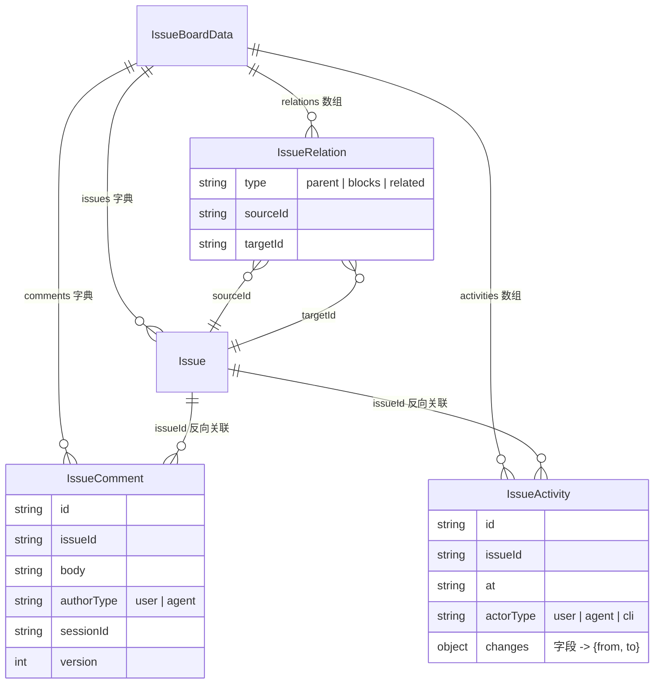
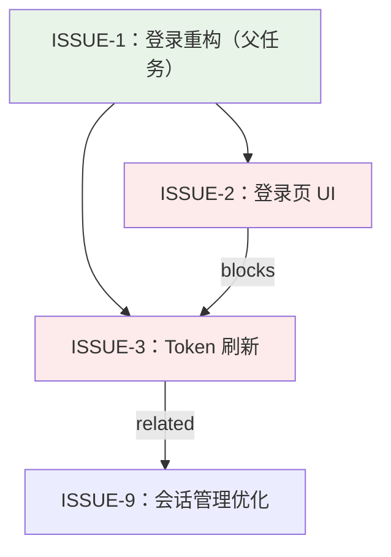

一个 Issue 若只有标题和状态，看板就退化成了一张静态表格。super-cli 为此引入了三个正交的协作维度：**评论**承载人与人、人与 Agent 之间的需求对话，**活动流**以审计日志形式自动记录每一次字段变更，而 **Issue 关系**则用三种有向边（parent / blocks / related）把孤立的任务卡片组织成一张任务图。本文聚焦这三者的数据结构、存储行为、约束规则，以及它们在 CLI、HTTP API 与 Web 前端三个出口上的一致性暴露。三者全部内嵌在单个 `issues.json` 文件的 `IssueBoardData` 容器中，与 Issue 本体共享同一套乐观锁与原子写入基础设施。

Sources: [types.ts](src/core/types.ts#L153-L160)、[issue-store.ts](src/core/issue-store.ts#L42-L51)

## 一张图看懂数据模型

`IssueBoardData` 是看板的唯一持久化根对象，包含四个容器：`issues`（Issue 本体字典）、`relations`（关系边数组）、`comments`（评论字典）、`activities`（活动流数组）。Issue 与评论、活动之间通过 `issueId` 关联，关系边则直接持有双方的内部 UUID。

注意 `IssueRelation` 上没有 `version` 和 `createdAt`——它是最纯粹的结构性数据；而 `IssueComment` 自带独立的 `version` 字段用于自身的乐观锁，与所属 Issue 的 `version` 完全解耦。

Sources: [types.ts](src/core/types.ts#L126-L160)、[paths.ts](src/core/paths.ts#L45-L46)

## 评论系统：跨主体对话的持久化载体

评论是三类数据中唯一同时面向"用户"和"Agent"两类作者的实体。`IssueComment` 通过 `authorType`（`user` | `agent`）区分来源，Agent 评论还可携带 `sessionId` 将发言归属到具体某个 CLI 会话——这让看板能回答"这条返工要求是哪个会话提出的"。创建评论走 `addComment`：校验正文非空、生成 UUID、默认作者为 `user`，并同步向活动流写入一条 `{ comment: { from: null, to: comment.id } }` 的投递记录。关键设计在于 `addComment` **不调用** `touch()`，即评论的新增不会递增所属 Issue 的 `version`——评论是对话附属品，不应触发其他会话的乐观锁冲突。

Sources: [issue-store.ts](src/core/issue-store.ts#L438-L457)、[types.ts](src/core/types.ts#L134-L143)

评论的读取支持**游标增量拉取**，这是为 Agent 续跑场景量身定制的：`getComments(issueId, after?)` 按 `createdAt` 排序返回指定时间戳之后的评论，并把最后一条评论的 `createdAt` 作为 `nextCursor` 返回。Agent 下次续跑时把上次的 `nextCursor` 传入 `--after` 参数，即可只拉取新增内容，避免重复消费完整历史。

Sources: [issue-store.ts](src/core/issue-store.ts#L428-L436)、[cli/commands/issue.ts](src/cli/commands/issue.ts#L311-L343)

评论自身的修改与删除同样有纪律：`updateComment` 要求调用方携带评论当前的 `version`，不匹配则抛出 `VersionConflictError`（映射为 HTTP 409）；`removeComment` 按 UUID 直接删除。修改评论只递增评论自己的 `version` 与 `updatedAt`，同样不触碰 Issue 本体。

Sources: [issue-store.ts](src/core/issue-store.ts#L459-L477)、[routes/issues.ts](src/server/routes/issues.ts#L228-L242)

## 活动流：不可绕过的自动审计日志

活动流与评论有本质区别：评论是**主动写入**的对话，活动是**写操作自动产生**的副产物。核心是 `recordActivity` 私有方法——每次 Issue 字段变更（状态迁移、优先级调整、会话绑定、归档等）都会通过 `touch()` 汇聚到这里，`touch()` 一并完成三件事：递增 `issue.version`、刷新 `updatedAt`、把 `{ 字段: { from, to } }` 形式的差异快照写入活动流。

Sources: [issue-store.ts](src/core/issue-store.ts#L487-L499)

每条 `IssueActivity` 记录四个维度：`at` 时间戳、`actorType`（`user` / `agent` / `cli` 三类操作者）、以及核心的 `changes` 字典。`changes` 是"字段名 → { from, to }"的映射，一条活动可以同时包含多个字段变更——例如 `claimIssue` 的一次原子认领会把 `status` 和 `sessionIds` 的变化合并在同一条记录里。`actorType` 在 HTTP 层通过 `x-super-cli-actor` 请求头判定，仅接受 `agent` 与 `cli` 两个值，其余一律归为 `user`。

Sources: [types.ts](src/core/types.ts#L145-L151)、[issue-store.ts](src/core/issue-store.ts#L248-L259)、[routes/issues.ts](src/server/routes/issues.ts#L32-L35)

活动流有一个明确的容量上限：`MAX_ACTIVITIES = 5000`。`recordActivity` 在追加后检查总长度，超限则 `slice(-MAX_ACTIVITIES)` 只保留最新的 5000 条。这是一个实用的防膨胀策略——单文件 JSON 存储下，无界的审计日志最终会拖垮每次全量读写的性能。另外，`changes` 为空的操作（如幂等的重复认领）不会产生任何活动记录。

Sources: [issue-store.ts](src/core/issue-store.ts#L51)、[issue-store.ts](src/core/issue-store.ts#L487-L493)、[issue-store.ts](src/core/issue-store.ts#L260)

## Issue 关系：三种有向边构成的任务图

关系系统定义了三种类型，语义和约束各不相同：

| 关系类型 | 方向性 | 语义 | 核心约束 |
|---------|--------|------|---------|
| `parent` | 有向（子 → 父） | 子任务指向父任务 | 每个 Issue **至多一个**父任务；添加时做**环检测** |
| `blocks` | 有向（阻塞方 → 被阻塞方） | A 完成前 B 不能开始 | 允许 A blocks B 与 B blocks A 并存 |
| `related` | 逻辑双向 | 一般性关联 | **双向去重**：A→B 或 B→A 任一存在即拒绝重复 |

Sources: [types.ts](src/core/types.ts#L126-L132)、[issue-store.ts](src/core/issue-store.ts#L363-L391)

`addRelation` 是约束的实施者。它先解析双方的 id 或 identifier（如 `ISSUE-12`），拒绝自关联；对 `parent` 类型检查"已有父任务"并调用 `wouldCreateCycle` 做**环检测**——算法从目标父节点出发，沿 `parent` 边不断向上走祖先链，若途中回到子节点自身则判定成环并抛出 `IssueStateError`。对 `related` 类型则做双向去重检查，避免同一对 Issue 被重复关联两次。所有成功的关系变更同样进入活动流，键名为 `relation:${type}`，`from`/`to` 存的是对方的 **identifier**（而非 UUID），保证审计日志人类可读。

Sources: [issue-store.ts](src/core/issue-store.ts#L363-L391)、[issue-store.ts](src/core/issue-store.ts#L404-L415)

查询侧的 `getRelations` 是**双向展开**的：无论 Issue 处于边的 source 端还是 target 端都会命中，前端据此渲染出"父任务： ISSUE-3"与"子任务： ISSUE-7"这类方向感知的文案。删除 Issue 时（仅限已归档），`deleteIssue` 做**级联清理**：一次性移除该 Issue 参与的所有关系边、其名下全部评论与活动记录，维持 `issues.json` 无悬挂引用。

Sources: [issue-store.ts](src/core/issue-store.ts#L358-L361)、[issue-store.ts](src/core/issue-store.ts#L291-L304)、[IssueDetail.tsx](src/web/src/components/IssueDetail.tsx#L257-L264)

三种关系在图上的典型形态如下：

## 多端暴露：同一套语义，三个出口

三类数据的读写能力在 CLI、HTTP API、SSE 事件三个出口保持语义一致。CLI 通过 `issue show --comments --activity` 一次拉取详情，`issue comment --add` 与 `issue relate` / `unrelate` 负责写入（CLI 写入的 `actorType` 固定为 `cli`）；HTTP 层则提供了完整的 CRUD 面面：

| 能力 | CLI 命令 | HTTP 端点 | SSE 事件 |
|------|---------|-----------|---------|
| 读评论（含增量） | `issue comment <id> [--after]` | `GET /api/issues/:id/comments?after=` | — |
| 加评论 | `issue comment <id> --add "..." [--agent] [--session-id]` | `POST /api/issues/:id/comments` | `comment.created` |
| 改评论 | — | `PATCH /api/comments/:id`（需 version） | `comment.updated` |
| 删评论 | — | `DELETE /api/comments/:id` | `comment.deleted` |
| 读活动流 | `issue show <id> --activity` | `GET /api/issues/:id/activities` | — |
| 读关系 | `issue show <id>`（自动附带） | `GET /api/issues/:id`（含 relations） | — |
| 加/删关系 | `issue relate` / `issue unrelate` | `POST/DELETE /api/issues/:id/relations/...` | `issue.relation.updated` |

Sources: [cli/commands/issue.ts](src/cli/commands/issue.ts#L105-L153)、[cli/commands/issue.ts](src/cli/commands/issue.ts#L440-L465)、[routes/issues.ts](src/server/routes/issues.ts#L173-L253)、[routes/issues.ts](src/server/routes/issues.ts#L288-L296)、[events.ts](src/server/events.ts#L10-L13)

值得留意的是评论的 `commentCount` 聚合：列表页为了展示"每张卡片有几条评论"，通过 `getCommentCounts()` 一次遍历所有评论按 `issueId` 计数，随 `GET /api/issues` 批量返回；详情页则直接附带 relations 与 commentCount，前端打开抽屉时无需二次请求就能渲染关系区。

Sources: [issue-store.ts](src/core/issue-store.ts#L419-L426)、[routes/issues.ts](src/server/routes/issues.ts#L39-L48)、[routes/issues.ts](src/server/routes/issues.ts#L73-L83)

前端 `IssueDetail` 组件把这三个维度组织成清晰的界面结构：详情 Tab 内嵌**关系编辑区**（类型下拉框 + 目标 identifier 输入框，支持输入 `ISSUE-12` 这类人类可读标识）和**最近活动区**（仅取 `slice(-20).reverse()` 的最新 20 条，用中文 `FIELD_LABELS` 把 `sessionIds` 翻译成"关联会话"）；评论则是独立 Tab，每条评论显示作者徽章（Agent 评论带 sessionId 前 8 位，用户评论标"用户"）、时间与正文，底部输入框以 `authorType: 'user'` 发送。

Sources: [IssueDetail.tsx](src/web/src/components/IssueDetail.tsx#L45-L60)、[IssueDetail.tsx](src/web/src/components/IssueDetail.tsx#L336)、[IssueDetail.tsx](src/web/src/components/IssueDetail.tsx#L482-L561)

## 评论作为 Agent 协作的需求通道

评论系统在多 Agent 看板中扮演的不只是"留言板"——super-cli-taskboard Skill 把它升格为**需求的事实来源**。Skill 明确规定 Agent 认领任务前必须"先读后做"：执行 `issue show <id> --comments --json` 并把评论视为当前需求（含返工指令），用户评论说"先别做"就必须停止。完成时则用 `--add "已完成 X，验证 Y，风险 Z" --agent --session-id <sid>` 把执行结果回写到评论流；做不动时移入 `blocked` 并**评论说明阻塞原因**——这里评论与 `blocked` 状态形成了配对语义，而 `blocks` 关系则从任务图的角度声明了硬依赖，两者互补而非替代。

Sources: [skills/super-cli-taskboard/SKILL.md](skills/super-cli-taskboard/SKILL.md#L24-L45)、[skills/super-cli-taskboard/SKILL.md](skills/super-cli-taskboard/SKILL.md#L85)

`nextCursor` 增量机制正是为这套纪律服务的闭环：Agent 续跑时用上次返回的 cursor 调用 `issue comment <id> --after "<cursor>" --json`，只拉取新增评论，既不遗漏返工指令，也不重复消费历史。配合活动流中 `[agent]` / `[cli]` 的操作者标注，人类可以在详情页完整回放"谁在什么时候、以什么身份、改变了什么"。

Sources: [skills/super-cli-taskboard/SKILL.md](skills/super-cli-taskboard/SKILL.md#L32-L35)、[docs/issue-workflow.md](docs/issue-workflow.md#L49-L52)

## 小结

评论、活动流、关系三者共同把 Issue 从"带状态的任务卡片"升级为可审计、可协作、可组织的工单实体。设计上有三条贯穿性的原则值得记住：其一，**评论与活动分离**——主动对话（带 `version` 乐观锁）与被动审计（自动 diff 快照）走不同的容器，互不污染；其二，**约束在存储层集中实施**——parent 唯一性、环检测、related 双向去重都内聚在 `IssueStore`，三个出口自动继承；其三，**Activity 是一切的旁路记录**——包括评论投递和关系变更本身，形成单一审计事实源，并以 5000 条上限防止单文件膨胀。

若想继续深入，建议按以下路径阅读：评论与活动如何驱动看板实时刷新，见 [SSE 实时事件推送：EventHub 设计与事件类型](16-sse-shi-shi-shi-jian-tui-song-eventhub-she-ji-yu-shi-jian-lei-xing) 与 [前端实时同步：消费 SSE 事件流更新看板](24-qian-duan-shi-shi-tong-bu-xiao-fei-sse-shi-jian-liu-geng-xin-kan-ban)；状态流转与认领纪律的完整规则，见 [Issue 状态机与 Agent 工作流纪律（claim / move / comment）](14-issue-zhuang-tai-ji-yu-agent-gong-zuo-liu-ji-lu-claim-move-comment)；`version` 字段在并发写中的核心作用，见 [乐观锁机制：version 字段与多 Agent 并发写安全](13-le-guan-suo-ji-zhi-version-zi-duan-yu-duo-agent-bing-fa-xie-an-quan)；Skill 文件本身如何分发到各家 CLI 工具，见 [super-cli-taskboard Skill 的分发与跨 Provider 安装](17-super-cli-taskboard-skill-de-fen-fa-yu-kua-provider-an-zhuang)。