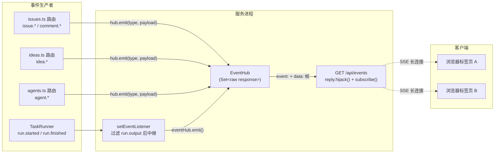
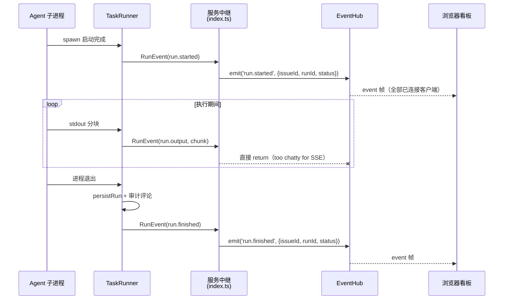

super-cli 的 Web 看板之所以能在多个浏览器标签页之间"活"起来——一个标签页拖动了卡片，另一个标签页立刻同步——靠的是一条基于 Server-Sent Events（SSE）的实时事件推送链路。这条链路的服务端核心只有两个文件：约 67 行的 `EventHub` 广播器，以及注册在 Issue 路由组中的唯一订阅端点 `GET /api/events`。本文聚焦服务端：EventHub 的设计取舍、事件从产生到推送给浏览器的完整流转，以及 21 种事件类型的全量清单。前端如何消费这些事件流，见 [前端实时同步：消费 SSE 事件流更新看板](24-qian-duan-shi-shi-tong-bu-xiao-fei-sse-shi-jian-liu-geng-xin-kan-ban)。

Sources: [events.ts](src/server/events.ts#L28-L67), [issues.ts](src/server/routes/issues.ts#L339-L342)

## 架构定位：事件从哪里来，到哪里去

EventHub 本质上是一个**进程内广播总线**：任何持有它引用的模块都可以向所有已连接的 SSE 客户端推送一条事件帧。事件源只有两类——HTTP 路由处理器（用户在看板上做了写操作）和 TaskRunner（无头 Agent 执行的生命周期事件）。事件消费者则只有一个：所有通过 `GET /api/events` 长连接挂上来的浏览器 `EventSource`。

在 `startServer` 的组装代码中，这条依赖链清晰可见：`EventHub` 在服务启动时实例化一次，随后以参数形式注入 `registerIssueRoutes`、`registerIdeaRoutes`、`registerAgentRoutes` 三个路由工厂；TaskRunner 则通过 `setEventListener` 回调把执行事件"中继"进总线。这体现了典型的**依赖注入**风格——EventHub 自己不知道也不关心谁在发射事件。

Sources: [index.ts](src/server/index.ts#L37-L48)

## EventHub 实现解析：一个 Set、三种帧、一个心跳

整个 EventHub 类的实现可以拆成四个部分，每一部分都体现了 SSE 协议的最小化使用。

**客户端集合与连接生命周期**。核心状态只有一个 `Set<FastifyReply['raw']>`——直接持有 Node 原始 HTTP 响应对象而非 Fastify 封装。`subscribe` 方法先把 SSE 必需的三个响应头写回去（`text/event-stream`、`no-cache`、`keep-alive`），发送一条 `: connected` 注释帧确认握手，然后把响应对象加入 Set，并注册 `close` 监听器：客户端断开时自动从集合中移除。值得注意的设计前提是，这个方法要求调用方先执行 Fastify 的 `reply.hijack()`——订阅端点确实这么做了——从而把响应套接字从 Fastify 的请求/响应生命周期中接管出来，让 EventHub 可以在任意未来时刻向该套接字写入数据而不受路由处理器已返回的限制。

Sources: [events.ts](src/server/events.ts#L29-L51), [issues.ts](src/server/routes/issues.ts#L339-L342)

**事件帧编码**。`emit` 把每次广播编码为标准 SSE 帧：`event:` 行携带事件类型（浏览器端 `EventSource` 的 `addEventListener(type)` 据此分发），`data:` 行携带 JSON 负载，服务端在负载里统一注入 `at` ISO 时间戳后再广播给全部客户端。这意味着**时间戳是推送侧可信的**——客户端无需信任本地时钟来排序事件。

Sources: [events.ts](src/server/events.ts#L53-L58)

**20 秒心跳与进程退出**。构造器里创建的 `setInterval` 每 20 秒向所有客户端写一条 `: keep-alive` 注释帧。注释帧不会触发浏览器端的任何事件回调，它的作用是防止中间层（反向代理、NAT、负载均衡器）因连接空闲而掐断长连接。两个细节体现了对进程生命周期的自觉：一是 `keepAlive.unref()`，让这个定时器不阻止 Node 进程自然退出；二是 `close()` 方法负责清掉定时器并逐个 `end()` 所有连接，属于完整的优雅停机接口。

Sources: [events.ts](src/server/events.ts#L32-L39), [events.ts](src/server/events.ts#L60-L66)

三种帧的格式汇总如下：

| 帧类型 | 格式 | 触发时机 | 客户端效果 |
|---|---|---|---|
| 握手注释 | `: connected\n\n` | 订阅建立时 | 无（确认连接可用） |
| 心跳注释 | `: keep-alive\n\n` | 每 20 秒 | 无（保活防掐断） |
| 事件帧 | `event: <type>\ndata: <JSON>\n\n` | 任意 emit 调用 | 触发对应类型的事件监听器 |

Sources: [events.ts](src/server/events.ts#L33-L37), [events.ts](src/server/events.ts#L43-L48), [events.ts](src/server/events.ts#L54)

## 事件类型全景：21 个类型，三域分工

`IssueEventType` 联合类型声明了 21 种事件，可按业务域分为四组：Issue 本体操作、Comment 评论操作、Idea 想法操作、Agent 与 Run 执行操作。类型别名 `AppEventType = IssueEventType` 为将来扩展非 Issue 域事件预留了命名空间。

| 事件类型 | 负载字段 | 发射位置 |
|---|---|---|
| `issue.created` | `issueId, identifier` | [issues.ts](src/server/routes/issues.ts#L65) |
| `issue.updated` | `issueId, identifier` | [issues.ts](src/server/routes/issues.ts#L100), [issues.ts](src/server/routes/issues.ts#L264), [issues.ts](src/server/routes/issues.ts#L281) |
| `issue.moved` | `issueId, identifier, status` | [issues.ts](src/server/routes/issues.ts#L134) |
| `issue.archived` / `issue.restored` / `issue.deleted` | `issueId, identifier` | [issues.ts](src/server/routes/issues.ts#L150), [issues.ts](src/server/routes/issues.ts#L166), [issues.ts](src/server/routes/issues.ts#L118) |
| `issue.relation.updated` | `issueId` | [issues.ts](src/server/routes/issues.ts#L182), [issues.ts](src/server/routes/issues.ts#L194) |
| `comment.created` / `comment.updated` | `issueId, commentId` | [issues.ts](src/server/routes/issues.ts#L220), [issues.ts](src/server/routes/issues.ts#L237) |
| `comment.deleted` | `commentId` | [issues.ts](src/server/routes/issues.ts#L248) |
| `idea.created` / `idea.updated` | `ideaId, identifier` | [ideas.ts](src/server/routes/ideas.ts#L45), [ideas.ts](src/server/routes/ideas.ts#L67-L115) |
| `idea.promoted` | `ideaId, issueId, issueIdentifier` | [ideas.ts](src/server/routes/ideas.ts#L131-L135) |
| `idea.archived` / `idea.restored` / `idea.deleted` | （已声明，无调用点） | 仅类型定义 [events.ts](src/server/events.ts#L16-L18) |
| `agent.created` / `agent.updated` / `agent.removed` | `agentId` | [agents.ts](src/server/routes/agents.ts#L44-L75) |
| `run.started` / `run.finished` | `issueId, runId, status`（经中继转换） | [index.ts](src/server/index.ts#L39-L42) |

路由层的 23 个 emit 调用点（issues 13 处、ideas 7 处、agents 3 处）遵循一个一致的约定：**在存储写入成功之后、HTTP 响应返回之前发射事件**。也就是说，SSE 订阅者收到的事件一定对应已持久化的状态变更，不会出现"事件先到、数据后落盘"的窗口。这一约定与 Issue 存储层的乐观锁写入顺序共同保证了多客户端视图的最终一致，乐观锁细节见 [乐观锁机制：version 字段与多 Agent 并发写安全](13-le-guan-suo-ji-version-zi-duan-yu-duo-agent-bing-fa-xie-an-quan)。

有三个值得注意的类型学事实。其一，`idea.archived`、`idea.restored`、`idea.deleted` 只在类型联合中声明，`src` 下没有任何 emit 调用点——它们是为 Idea 生命周期完整性预留的"契约事件"，路由层当前通过 `idea.updated` 覆盖这些场景。其二，`run.*` 事件的负载字段不是 TaskRunner 原始的完整 `IssueRun` 对象，而是被服务端中继显式投影为 `{ issueId, runId, status }` 三字段——推送的是看板 UI 需要的最小信息。其三，`issue.moved` 是唯一携带 `status` 字段的 Issue 事件，因为状态变更正是看板拖拽同步最关心的增量。

Sources: [events.ts](src/server/events.ts#L3-L26), [task-runner.ts](src/core/task-runner.ts#L20-L24)

## 事件流转：两条生产路径的汇合

事件到达浏览器前有两条汇入路径，理解它们的差异是理解这个设计的关键。

**路径一：HTTP 写操作的同步发射**。路由处理器在完成存储写入后直接调用 `hub.emit`，事件帧在同一个事件循环 tick 内写往所有客户端。这是"用户操作 → 广播"的最短路径，无队列、无缓冲。

**路径二：TaskRunner 事件的过滤中继**。TaskRunner 产生的执行事件先经过 `setEventListener` 注册的回调，其中最关键的一行是 `if (event.type === 'run.output') return;`——注释直言其因："too chatty for SSE"。Agent 执行期间每个 stdout 分块都会产生一条 `run.output` 事件，若不过滤，一次数分钟的 Agent 运行会向所有看板客户端广播成千上万条帧。过滤后，`run.started` 与 `run.finished` 以三字段投影进入总线。

`run.finished` 的发射时机有一个容易被忽略的细节：它发生在 `persistRun` 与 `issueStore.recordRun` 审计投影**之后**。`finishRun` 会先把运行记录持久化到磁盘、在 Issue 上追加一条 Agent 评论（评论本身也会经路由层或存储层落入 Issue 活动流），然后才发出 `run.finished`。因此订阅者收到 finished 事件时，Issue 上与之关联的审计数据已经就绪。

Sources: [task-runner.ts](src/core/task-runner.ts#L217-L225), [task-runner.ts](src/core/task-runner.ts#L287-L299), [index.ts](src/server/index.ts#L39-L42)

## 设计取舍：有意为之的简单性

把 EventHub 的每个"缺失"单独审视，会发现它们大多是针对单用户本地工具场景的合理裁剪。

| 设计维度 | 当前实现 | 潜在替代方案 | 裁剪理由 |
|---|---|---|---|
| 分发模式 | 无差别广播给所有客户端 | 按项目/Issue 订阅过滤 | 本地单用户场景，客户端数量极少 |
| 断线补偿 | 无重放、无积压（backlog） | 事件日志 + `Last-Event-ID` 重放 | 客户端可全量刷新补偿，详见下文 |
| 持久化 | 事件即发即弃，不落盘 | 事件溯源存储 | 持久化职责已由 Issue/Run 存储承担 |
| 消息队列 | 同步写入响应流 | 异步队列削峰 | 事件频率低（run.output 已过滤） |
| 多实例 | 单进程内存 Set | Redis 等共享总线 | 单机 CLI 工具无多实例需求 |

Sources: [events.ts](src/server/events.ts#L28-L67)

其中最值得注意的是**断线不补偿**：连接断开期间发生的事件，重连后不会补发（实现中未使用 SSE 的 `id:` 行与 `Last-Event-ID` 机制）。系统的正确性不依赖事件流——看板客户端在初始化和错误恢复时通过 REST API 全量拉取，SSE 只负责推送增量提示。这也是为什么每个事件的负载刻意做得很小（只有 id 与少量增量字段）：客户端收到事件后通常需要再回查 REST 接口获取完整状态，SSE 在这里的角色是**变更信号**而非**变更内容本身**。

另外，`serve` 命令启动服务器后并未注册调用 `eventHub.close()` 的停机钩子，`close()` 目前是完备但未被生产线程调用的生命周期接口。这在 Ctrl+C 直接杀进程的场景下无害（20 秒定时器已 `unref()`，不会挂住进程退出），但若未来接入优雅停机流程，`close()` 就是现成的挂载点。

Sources: [serve.ts](src/cli/commands/serve.ts#L16-L17), [events.ts](src/server/events.ts#L38)

## 小结与延伸阅读

EventHub 用不足 70 行代码实现了"变更信号总线"的全部需求：`reply.hijack()` 接管套接字解决长连接与 Fastify 生命周期的冲突，20 秒注释帧心跳解决中间层掐断，服务端注入时间戳解决事件排序可信度，`run.output` 过滤解决 Agent 执行期的事件洪泛。事件类型体系则覆盖了看板的全部可感知变更——18 种实际在用，3 种预留契约。

如果你想继续深入这条链路的两端，建议按以下路径阅读：

- 看浏览器端如何用 `EventSource` 消费这些事件并驱动看板刷新：[前端实时同步：消费 SSE 事件流更新看板](24-qian-duan-shi-shi-tong-bu-xiao-fei-sse-shi-jian-liu-geng-xin-kan-ban)
- 理解 `run.started` / `run.finished` 背后的 spawn 到会话绑定全流程：[无头执行管线：TaskRunner 从 spawn 到会话自动绑定](19-wu-tou-zhi-xing-guan-xian-taskrunner-cong-spawn-dao-hui-hua-zi-dong-bang-ding)
- 了解 `idea.promoted` 事件的上下游转化管线：[Idea 到 Task 的转化管线：捕获、分类与 promote](21-idea-dao-task-de-zhuan-hua-guan-xian-bu-huo-fen-lei-yu-promote)
- 回顾 EventHub 在整体三层架构中的位置：[三层架构：CLI、Fastify 服务与 React 前端如何协作](6-san-ceng-jia-gou-cli-fastify-fu-wu-yu-react-qian-duan-ru-he-xie-zuo)