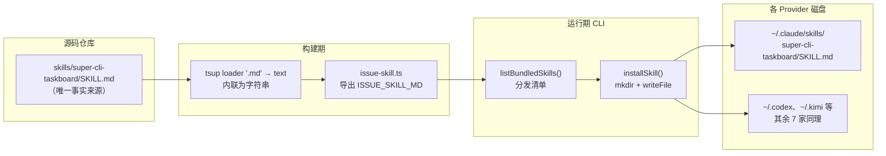
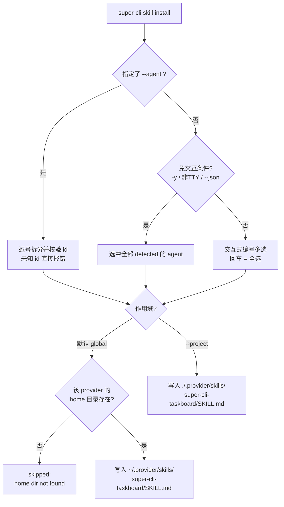

Agent Skill（智能体技能）是各家 AI CLI 工具用来给模型注入领域知识的机制：把一份带 frontmatter 的 `SKILL.md` 放进约定目录，agent 就会在相关场景下自动参考其中的工作流。本页讲解 super-cli 内置的 `super-cli-taskboard` skill 如何从仓库里的一份 Markdown 文件出发，经过构建期内联、npm 打包，最终通过一条 `super-cli skill install` 命令分发到 8 家 provider 各自的 skills 目录——包括目标路径的推导规则、安装状态的检测方式、交互式与免交互的目标选择策略，以及安装/卸载的具体落盘行为。

## Skill 本体：一份随包分发的 Agent 操作手册

`skills/super-cli-taskboard/SKILL.md` 是这个 skill 的完整内容，也是整条分发链路的唯一事实来源。文件开头是一段 YAML frontmatter：`name` 声明技能名，`description` 用一段密集的关键词描述告诉 agent"什么场景该加载我"——认领任务、更新看板、记录评论、处理阻塞、捕获想法等触发词都写在其中。对初学者来说，可以把它理解为"给 AI 看的 README"：frontmatter 负责让 AI 找到它，正文负责教会它。

Sources: [SKILL.md](skills/super-cli-taskboard/SKILL.md#L1-L4)

正文部分是一套完整的 Issue 看板操作纪律。核心是状态机规则：`backlog → todo → in_progress → in_review → done`，外加 `blocked` 和 `canceled` 两个旁路。其中埋了几条对多 Agent 协作至关重要的红线——`backlog` 未经用户授权不得认领、`done` 只能由用户移动、agent 不得接管他人已认领的 issue。这些约束与 Issue 状态机的设计一一对应，正是这份 skill 存在的意义：它把 super-cli 的看板约定"翻译"成每个 agent 都能遵守的行为准则。

Sources: [SKILL.md](skills/super-cli-taskboard/SKILL.md#L10-L22), [SKILL.md](skills/super-cli-taskboard/SKILL.md#L24-L35)

正文还覆盖了并发纪律（写操作带 `--if-version` 乐观锁，冲突最多重试一次）、Idea 流水线的完整命令（`add → categorize → promote`），以及无头执行模式（`issue run` 自动移入 `in_progress` 无需再 claim）。末尾附一张常用命令速查表，方便 agent 快速检索。这些内容分别对应看板工作流与 Idea 转化管线的详细设计，本页不再展开。

Sources: [SKILL.md](skills/super-cli-taskboard/SKILL.md#L47-L51), [SKILL.md](skills/super-cli-taskboard/SKILL.md#L53-L66), [SKILL.md](skills/super-cli-taskboard/SKILL.md#L68-L87)

## 分发管线：构建期内联，运行期落盘

理解分发机制的关键在于分清两个阶段：**构建期**把 SKILL.md 变成代码里的字符串常量，**运行期**把这个常量写到各 provider 的磁盘目录。源码层面，`issue-skill.ts` 直接 `import skillMd from '../../skills/super-cli-taskboard/SKILL.md'`——TypeScript 本不认识 `.md` 模块，这依赖两处配合：`assets.d.ts` 里的 `declare module '*.md'` 让类型检查通过，而 tsup 配置里的 `loader: { '.md': 'text' }` 让打包器在构建时把文件内容当纯文本内联进产物。因此运行时读 skill 不需要任何文件 IO 去找 `skills/` 目录，字符串已经长在代码里了。

Sources: [issue-skill.ts](src/core/issue-skill.ts#L1-L9), [assets.d.ts](src/core/assets.d.ts#L1-L5), [tsup.config.ts](tsup.config.ts#L19)

运行期的分发清单由 `listBundledSkills()` 给出：目前只有一项，name 为 `super-cli-taskboard`，files 是一张 `文件名 → 内容` 的映射表（即 `{ 'SKILL.md': ISSUE_SKILL_MD }`）。这个"清单"结构是为多文件 skill 预留的扩展点——将来一个 skill 若要附带脚本或参考文档，只需往 files 里加条目。值得注意的是，`package.json` 的 `files` 字段同时把 `skills/` 源目录和 `dist/` 产物都发布进了 npm 包：前者是给人类读者看的参考源码，后者才是运行时实际使用的内联版本，两者在构建时保持同步。

Sources: [skill-installer.ts](src/core/skill-installer.ts#L26-L28), [package.json](package.json#L9-L19)

整条管线可以用下面的图概括（Mermaid 的 `graph LR` 表示从左到右的流转，子图框表示不同阶段）：

Sources: [issue-skill.ts](src/core/issue-skill.ts#L1-L9), [skill-installer.ts](src/core/skill-installer.ts#L26-L28)

## 目标路径推导：一条镜像规则覆盖 8 家 Provider

"跨 Provider 安装"之所以只用一份代码就能完成，是因为 8 家 CLI 工具恰好共享同一个目录约定：`<home>/skills/<skill-name>/SKILL.md`。super-cli 的 `skillTargetPath()` 据此定义了两种作用域——**全局**装到 `getProviderHome(provider)` 下的 `skills/<skillName>`，**项目**装到当前工作目录下 `.<provider>/skills/<skillName>`。项目路径的推导只用了一行巧思：取全局 home 目录的 `basename`（即 `~/.claude` 变成 `.claude`），拼接进 `cwd`——代码注释称之为"项目本地 skills 目录镜像 provider 的 home 目录名"。

Sources: [skill-installer.ts](src/core/skill-installer.ts#L30-L40)

结合 provider 注册表中的 homeDir 配置，可以列出完整的安装路径对照表（项目路径相对于你执行命令时所在的目录）：

| Provider id | 名称 | homeDir | 全局安装路径 | 项目安装路径 |
|---|---|---|---|---|
| `claude-code` | Claude Code | `~/.claude` | `~/.claude/skills/super-cli-taskboard/` | `./.claude/skills/super-cli-taskboard/` |
| `qoder` | Qoder CLI | `~/.qoder` | `~/.qoder/skills/super-cli-taskboard/` | `./.qoder/skills/super-cli-taskboard/` |
| `codex` | Codex CLI | `~/.codex` | `~/.codex/skills/super-cli-taskboard/` | `./.codex/skills/super-cli-taskboard/` |
| `kimi` | Kimi CLI | `~/.kimi` | `~/.kimi/skills/super-cli-taskboard/` | `./.kimi/skills/super-cli-taskboard/` |
| `pi` | Pi CLI | `~/.pi` | `~/.pi/skills/super-cli-taskboard/` | `./.pi/skills/super-cli-taskboard/` |
| `opencode` | OpenCode | `~/.opencode` | `~/.opencode/skills/super-cli-taskboard/` | `./.opencode/skills/super-cli-taskboard/` |
| `workbuddy` | WorkBuddy | `~/.workbuddy` | `~/.workbuddy/skills/super-cli-taskboard/` | `./.workbuddy/skills/super-cli-taskboard/` |
| `traecode` | TraeCode | `~/.traecode` | `~/.traecode/skills/super-cli-taskboard/` | `./.traecode/skills/super-cli-taskboard/` |

Sources: [providers.ts](src/core/providers.ts#L29-L103), [providers.ts](src/core/providers.ts#L119-L121)

这套路径之所以有效，是因为"目录名 + `SKILL.md` + frontmatter"本身就是各家 agent 通用的 skill 识别约定——super-cli 自己的读取器 `scanSkillsDir()` 就按同样的规则发现 skill：跳过隐藏目录、检查子目录里是否存在 `SKILL.md`、再解析 frontmatter 里的 `name`/`description`。写入端和读取端遵循同一约定，装好的 skill 既能被 provider 识别，也能被 super-cli 的配置页面扫描到。

Sources: [skill-reader.ts](src/core/skill-reader.ts#L31-L46)

## 安装状态检测：`skill list` 与 `skill path`

安装前往往需要先摸底。`skillStatus()` 会对全部 8 个 provider 逐一生成状态快照，包含四个字段：`detected`（home 目录是否存在，用 `existsSync` 判断）、`globalPath` / `projectPath`（两个作用域的目标路径）、`globalInstalled` / `projectInstalled`（对应路径下是否已有 `SKILL.md`）。注意检测的粒度是 `SKILL.md` 文件本身而非目录——这意味着哪怕目录被意外清空，状态也会如实显示未安装。

Sources: [skill-installer.ts](src/core/skill-installer.ts#L42-L57)

`super-cli skill list` 把这份快照渲染成紧凑的状态表：`●` 表示检测到 home 目录（`○` 为未检测到），`global` / `project` 绿色字样表示该作用域已安装。`super-cli skill path` 则只打印路径不判断状态，适合在脚本里预览"如果安装会写到哪"。两者都支持 `--json` 输出机器可读结果。

Sources: [skill.ts](src/cli/commands/skill.ts#L76-L99), [skill.ts](src/cli/commands/skill.ts#L131-L150)

## `skill install` 的目标解析：三条路径与两个作用域

`skill install` 的第一个决策是"装给谁"，代码里有三条互斥的解析路径。**路径一：显式指定**——传了 `--agent claude-code,kimi` 就按逗号拆分，且每个 id 都会经过 `getProvider()` 校验，写错名字会直接抛出 `Unknown provider` 异常中止，而不是静默跳过。**路径二：免交互自动**——满足 `-y`、stdin 不是 TTY（比如被管道或其他 agent 调用）、或带 `--json` 三个条件之一时，自动选中所有 `detected=true` 的 agent。**路径三：交互多选**——在终端里列出检测到的 agent 编号清单，输入逗号分隔的序号，直接回车等于全选。

Sources: [skill.ts](src/cli/commands/skill.ts#L25-L28), [skill.ts](src/cli/commands/skill.ts#L34-L56)

这个交互设计的注释里写明了参照对象：模仿 `npx skills add` 的编号多选体验。第二条路径尤其值得留意——它保证了"被另一个 AI agent 调用时不会卡在等待输入"的场景：非 TTY 环境下自动降级为"装到所有检测到的工具"，这是 CLI 工具对自动化调用方的典型礼貌。完整的决策流程如下（`flowchart TD` 表示自上而下的判定流）：

Sources: [skill.ts](src/cli/commands/skill.ts#L34-L56)

第二个决策是"装到哪一层"。`resolveScope()` 的逻辑只有一行：带 `--project` 就是项目作用域，否则默认全局。结合上面的流程图可以看到一个重要的不对称设计：**全局安装有 home 目录守卫**——从未用过 OpenCode 的机器上不会凭空冒出 `~/.opencode` 目录，该 provider 会被标记 skipped；而**项目安装没有这道检查**，它会在当前项目里按需创建 `./.<provider>/skills/` 目录结构。

Sources: [skill.ts](src/cli/commands/skill.ts#L30-L32), [skill-installer.ts](src/core/skill-installer.ts#L72-L75)

## 落盘动作与幂等性：安装、升级、卸载

`installSkill()` 的写入动作朴素而可靠：对每个目标 provider，`mkdir(dir, { recursive: true })` 创建整条目录链，然后遍历 skill 的 files 映射逐个 `writeFile`。由于 `writeFile` 天然覆盖旧内容，**重复执行 install 就是升级**——当你更新了 super-cli 版本、SKILL.md 内容随之变化时，重新跑一次安装即可让所有 provider 拿到新版工作流，无需先卸载。整个过程对每个 provider 独立执行，一家失败不影响其他家。

Sources: [skill-installer.ts](src/core/skill-installer.ts#L66-L84)

`uninstallSkill()` 则是对称的逆操作：目录不存在就返回 skipped，存在就 `rm(dir, { recursive: true, force: true })` 整个删掉 skill 目录。每次操作的返回值都是 `InstallResult` 结构，明确记录 provider、实际路径、结果状态：

| status | 含义 | 触发条件 |
|---|---|---|
| `installed` | 已写入 | `mkdir` + `writeFile` 成功完成 |
| `uninstalled` | 已删除 | 目录存在且被 `rm -rf` 成功移除 |
| `skipped` | 跳过未动 | 全局安装时 home 目录不存在；或卸载时目标目录不存在 |

Sources: [skill-installer.ts](src/core/skill-installer.ts#L59-L64), [skill-installer.ts](src/core/skill-installer.ts#L86-L98)

CLI 层的输出同样对人和机器双友好：终端里用 `✓` 标记成功、`-` 加灰色原因标注跳过项；带 `--json` 时输出 `{ skill, results }` 结构，方便集成到 agent 工作流里做结果校验。

Sources: [skill.ts](src/cli/commands/skill.ts#L58-L68)

## 安装之后：已装 Skill 的发现与再分发

skill 装进各 provider 的目录后并没有脱离 super-cli 的管理视野。`skill-reader.ts` 提供的 `getSkills()` 会按"目录下有 `SKILL.md` 才算 skill"的约定扫描所有可用 provider 的全局与项目 skills 目录，解析 frontmatter 得到名称、版本、描述；Web 配置页面通过 `/api/config/skills` 接口消费这些数据，还支持查看内容、删除、以及 `copySkill()` 把某个 skill 从一家 provider 的全局目录递归复制到另一家——这是内置 skill 安装之外的第二条"跨 Provider"通路，面向用户自装的各种 skill。

Sources: [skill-reader.ts](src/core/skill-reader.ts#L73-L93), [skill-reader.ts](src/core/skill-reader.ts#L115-L122)

## 命令速查

最后把 README 中给出的完整命令面汇总成表，便于上手对照练习：

| 命令 | 作用 | 说明 |
|---|---|---|
| `super-cli skill list` | 查看各 agent 的安装状态 | 别名 `ls`，`●` = 检测到 home 目录 |
| `super-cli skill install` | 交互式选择 agent 安装 | 编号多选，回车 = 全部 |
| `super-cli skill install -y` | 免交互装到全部检测到的 agent | 适合脚本与 agent 调用 |
| `super-cli skill install --agent claude-code,kimi --project` | 指定 agent 装到当前项目 | 写入 `./.claude/skills/` 等 |
| `super-cli skill uninstall -y` | 免交互卸载 | 默认全局作用域，`--project` 卸项目级 |
| `super-cli skill path` | 打印各 agent 的目标路径 | 安装前预览 |

Sources: [README.md](README.md#L100-L106)

## 小结与下一步

回顾整条链路：一份 `SKILL.md` 作为唯一事实来源，构建期经 tsup 的 text loader 内联为字符串常量，运行期由 `listBundledSkills()` 提供清单、`installSkill()` 按"`<home>/skills/<name>/SKILL.md`"这一 8 家共享的目录约定批量落盘；全局作用域有 home 目录守卫，项目作用域靠 home 目录名的镜像规则推导路径；重复安装即升级，结果结构化可校验。

想继续深入的话，推荐三条路线：理解这份 skill 约束的看板行为本身，请读 [Issue 状态机与 Agent 工作流纪律（claim / move / comment）](14-issue-zhuang-tai-ji-yu-agent-gong-zuo-liu-ji-lu-claim-move-comment)；理解"为什么一条命令能适配 8 家工具"背后的注册表抽象，请读 [多 Provider 抽象：注册表设计与 8 家 CLI 工具适配](7-duo-provider-chou-xiang-zhu-ce-biao-she-ji-yu-8-jia-cli-gong-ju-gua-pei)；想了解 skill、MCP、Rules 等配置在 Web 端如何被统一读取和跨 provider 复制，请读 [Harness 配置读取：MCP、Rules、Hooks 与 Permissions](27-harness-pei-zhi-du-qu-mcp-rules-hooks-yu-permissions)。此外，skill 中提到的 Idea 流水线与无头执行分别对应 [Idea 到 Task 的转化管线：捕获、分类与 promote](21-idea-dao-task-de-zhuan-hua-guan-xian-bu-huo-fen-lei-yu-promote) 和 [无头执行管线：TaskRunner 从 spawn 到会话自动绑定](19-wu-tou-zhi-xing-guan-xian-taskrunner-cong-spawn-dao-hui-hua-zi-dong-bang-ding)。