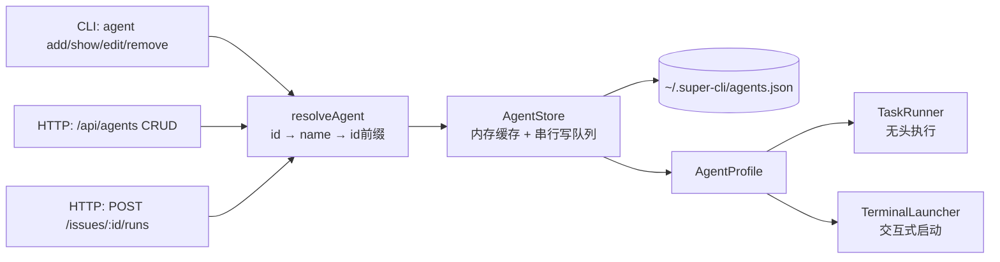
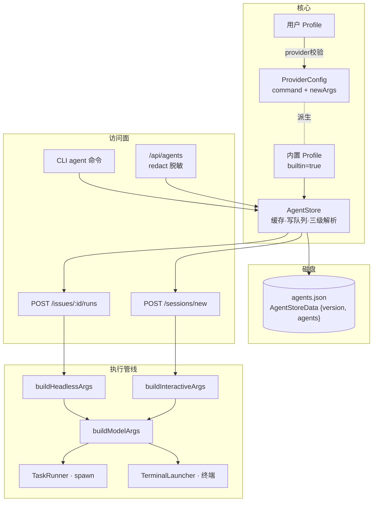

在 super-cli 中，"Agent" 不是运行中的进程，而是一份**可持久化的启动配置**。`AgentProfile` 就是这份配置的统一实体：它把"用哪家 CLI 工具、加载哪个模型、在哪个目录、附带哪些参数与环境变量"封装为一个带身份的记录，同时服务于交互式启动（打开终端）与无头执行（看板任务自动运行）两条完全不同的执行管线。本页聚焦该实体本身——字段语义、存储模型、内置 Profile 的生命周期，以及它如何被"编译"成真正的进程启动参数；管线内部的执行细节（spawn 之后发生什么）属于后续页面的范畴。

## 实体定位：一份配置，两种执行形态

理解 AgentProfile 的关键在于认识到它解耦了两个维度：**"启动什么"**（配置）与**"怎么启动"**（执行形态）。无头执行需要非交互式参数（如 `-p`、`--output-format json`），交互式启动则需要保留 TTY 的常规参数，但两者共享同一份 profile 数据。`src/core/types.ts` 中对 AgentProfile 的定义明确标注了它的角色——"agent 启动配置"，并且用 `builtin` 标记区分"注册表生成的默认配置"与"用户手工创建的配置"。

从类型设计看，除 `id`、`name`、`provider`、时间戳外的所有字段都是可选的：一个 profile 的最小有效形态只需绑定一个 provider，其余能力（模型覆盖、工作目录、额外参数、环境变量）均为增量叠加。`provider` 字段的类型 `CliProvider` 是一个八值字符串字面量联合，与 Provider 注册表（见 [多 Provider 抽象：注册表设计与 8 家 CLI 工具适配](7-duo-provider-chou-xiang-zhu-ce-biao-she-ji-yu-8-jia-cli-gong-ju-gua-pei)）共享同一套标识符，这保证了 profile 永远指向一个注册表中真实存在的 CLI 工具。

Sources: [types.ts](src/core/types.ts#L211-L225)

### 字段语义一览

| 字段 | 类型 | 必填 | 语义 | 消费位置 |
|------|------|------|------|----------|
| `id` | `string` | ✓ | UUID，主键，支持前缀匹配解析 | 存储索引、`IssueRun.agentId` |
| `name` | `string` | ✓ | 显示名，全库唯一 | 解析备选、审计快照 `agentName` |
| `provider` | `CliProvider` | ✓ | 绑定的 CLI 工具标识 | 决定 `command` 与参数格式 |
| `model` | `string?` | — | 模型覆盖（如 `--model` 参数值） | `buildModelArgs` |
| `workingDir` | `string?` | — | 默认工作目录 | 无头执行的 `spawn.cwd` |
| `extraArgs` | `string[]?` | — | 额外 CLI 参数，非空时**整体替换**注册表默认参数 | 参数编译的 base 段 |
| `env` | `Record<string,string>?` | — | 追加环境变量 | 无头合并 / 交互式前缀 |
| `builtin` | `boolean?` | — | 内置标记：生成的而非用户数据，不可删除 | 生命周期守卫 |

Sources: [types.ts](src/core/types.ts#L213-L225)

## 存储模型与解析策略：AgentStore

`AgentStore` 是 AgentProfile 的唯一持久化关卡。所有 profile 存放在单一 JSON 文件 `~/.super-cli/agents.json` 中，结构为 `{ version: 1, agents: Record<id, AgentProfile> }`——以 UUID 为键的扁平映射，而非数组，这使得按 id 查找是 O(1) 的字典访问。

存储实现有三个值得注意的工程决策。**其一**是惰性加载与内存缓存：`load()` 首次读取文件后将数据驻留内存，后续操作零 IO，文件损坏或不存在时静默回退到默认空库。**其二**是串行化写队列：`save()` 将写操作挂到 `writeQueue` Promise 链上，保证并发创建/更新不会交错写坏 JSON 文件——这是单文件持久化在异步 Node 环境下的经典防御手段。**其三**是宽容的三级解析策略：`resolveAgent(idOrName)` 依次尝试**精确 id → 全库唯一 name → id 前缀匹配**，前两种失败时仅在前缀恰好命中一个 profile 时才返回，避免歧义；这让 CLI 用户可以用 `super-cli agent show my-agent` 或 id 的前 8 位来引用 profile。

Sources: [agent-store.ts](src/core/agent-store.ts#L52-L59), [agent-store.ts](src/core/agent-store.ts#L61-L71), [agent-store.ts](src/core/agent-store.ts#L116-L134), [paths.ts](src/core/paths.ts#L37-L39), [paths.ts](src/core/paths.ts#L53-L55)

### 写入路径的校验与更新语义

`createAgent` 在写入前执行三重校验：名称非空、provider 必须存在于注册表（而非仅是合法字面量）、名称全库唯一，违规时抛出带结构化错误码（`AGENT_STATE`）的异常。`updateAgent` 则采用一套 **null 与 undefined 分离**的语义：`undefined` 表示"不修改该字段"，`null` 表示"清除该字段"（落盘时还原为 `undefined`）。CLI 层将这一语义映射为用户友好的形式——`--model ""`（空字符串）会被翻译为 `null` 从而清除模型覆盖，这与 Web 端 PATCH 请求直接传递 `null` 形成两种入口、一套语义的对齐。删除操作 `removeAgent` 额外携带生命周期守卫：`builtin` 为真的 profile 直接拒绝删除，理由我们下一节展开。

Sources: [agent-store.ts](src/core/agent-store.ts#L149-L197), [agent.ts](src/cli/commands/agent.ts#L121-L143)

## 内置 Profile：随 Provider 注册表自动演化的生成数据

AgentProfile 体系最精妙的设计在于 `builtin` profile 的生命周期管理。`ensureBuiltinProfiles` 在每次 `load()` 后运行，它把内置 profile 当作**从 Provider 注册表派生的缓存**而非用户数据来维护，包含三个动作：**补建**（为每个已安装的 provider 生成一个内置 profile）、**修剪**（CLI 被卸载后删除对应内置 profile）、**迁移**（把早期版本的 `"X 默认"` 命名规范为 provider 名称）。三者任一发生变更都会立即写回磁盘。

补建逻辑中藏着一条关键注释性决策：内置 profile 的 `extraArgs` 刻意留空为 `[]`，而非复制注册表的默认参数（例如 Claude Code 的 `--dangerously-skip-permissions`）。这样内置 profile 在参数编译时会**实时回退**到注册表的 `newArgs`，注册表更新（新增默认参数、调整行为）无需迁移任何存量数据即可生效。这也解释了为什么内置 profile 不可删除——它们是生成的，删除后下次加载又会被补建；正确的"移除"方式是卸载对应的 CLI 工具，让修剪逻辑接管。同理，`listAgents` 的排序把内置 profile 置顶、其余按创建时间排列，让"开箱即用的默认项"始终占据视觉首位。

Sources: [agent-store.ts](src/core/agent-store.ts#L73-L114), [agent-store.ts](src/core/agent-store.ts#L99-L109)

## 参数编译：从 Profile 到 argv 的三条路径

Profile 本身不会运行任何东西——它需要被"编译"成具体的命令行参数。这个编译层由三个纯函数承担，全部位于 `task-runner.ts`，它们共同实现了"**用户显式配置优先，注册表默认兜底**"的合并策略：

| 函数 | 输入 | base 段来源 | 用途 |
|------|------|------------|------|
| `buildHeadlessArgs` | profile + prompt | `extraArgs` 非空则用之，否则 `provider.newArgs` | 看板任务无头执行 |
| `buildInteractiveArgs` | profile | 同上 | 打开终端交互会话 |
| `buildModelArgs` | `provider` + `model` | 仅模型参数 | 被前两者复用 |

无头路径的**调用形态因 provider 而异**，这一点通过 switch 硬编码在 `buildHeadlessArgs` 中：Claude Code 需要 `-p <prompt> --output-format json` 以输出可解析的 JSON 结果；Codex 需要 `exec` 子命令加 `--json`；pi 则需要 `--mode json` 并前置一个预生成的 `--session-id`（会话绑定靠显式传入而非事后提取）。任何不在无头白名单内的 provider 走到这一步都会抛出 `RunStateError`——而白名单本身定义为常量 `HEADLESS_PROVIDERS = ['claude-code', 'codex', 'pi']`，由 `agent-store.ts` 导出并在 CLI 与 API 层复用于标记哪些 profile "支持无头"。

模型参数的格式同样按 provider 分流：Codex 的模型覆盖走其 TOML 配置机制（`-c model="..."`），其余 provider 用统一的 `--model` 标志。而 `extraArgs` 的"非空即整体替换"语义值得特别注意——一旦用户为 profile 设置了任何自定义参数，注册表默认值将**完全失效**而非追加，这是有意为之的"显式胜出"设计，代价是用户需要自行把必要的默认参数（如跳过权限确认）抄进自己的配置。

Sources: [task-runner.ts](src/core/task-runner.ts#L31-L66), [agent-store.ts](src/core/agent-store.ts#L23-L28), [providers.ts](src/core/providers.ts#L16-L27)

### 环境变量的两种注入形态

同一个 `env` 字段在两条执行路径中的注入方式截然不同，根源是两者的进程模型差异。**无头执行**通过 `spawn` 直接创建子进程，env 以 `{ ...process.env, ...profile.env }` 的方式在进程层面合并，profile 变量覆盖同名系统变量。**交互式启动**则要穿越一层 shell——终端启动器把命令拼成字符串交给目标终端应用执行，因此 env 被编译为 `KEY=VALUE` 前缀形式（逐个 shell 转义后拼接在命令前），依赖 shell 的环境变量继承语义达到同等效果。这一对比是理解 AgentProfile 消费抽象的良好样本：实体层保持字段中立，注入形态由各消费方根据自己的进程模型决定。

Sources: [task-runner.ts](src/core/task-runner.ts#L209-L213), [terminal-launcher.ts](src/core/terminal-launcher.ts#L59-L86)

## 访问面全景：CLI、HTTP API 与前端镜像

AgentProfile 的管理面有三条入口，读取面有一条消费链路。CLI 提供 `agent list / add / show / edit / remove` 五个子命令，其中 `add` 的 provider 参数刻意从**全局 `--provider` 选项**继承而非子命令局部选项——代码注释说明了原因：同名子命令选项会遮蔽全局选项。HTTP API 提供对称的 CRUD 端点，并在每次变更后通过 EventHub 广播 `agent.created / updated / removed` SSE 事件驱动前端刷新。

API 层有一个独立于功能的安全设计值得强调：`redact` 函数在**所有**响应中剥离 `env` 的值，只保留键名列表（`envKeys`）。这意味着 profile 中配置的 API Key、Token 之类敏感值可以在服务端存储并被执行管线使用，但永远不会通过网络回传给浏览器——读取面与写入面对 `env` 的不对称暴露，是该实体安全模型的落点。前端镜像类型也印证了这一点：`src/web/src/types.ts` 中的 `AgentProfile` 没有 `env` 字段，取而代之的是 `envKeys` 与运行时计算的 `headless` 布尔标志。

| 入口 | 操作 | 位置 | 特殊行为 |
|------|------|------|----------|
| CLI | `agent list` | `src/cli/commands/agent.ts` | 表格含 Headless 列（✓/✗） |
| CLI | `agent add` | 同上 | provider 取自全局 `--provider` |
| CLI | `agent edit` | 同上 | 空字符串 → `null` → 清除字段 |
| HTTP | `GET/POST /api/agents` | `src/server/routes/agents.ts` | 响应经 `redact` 脱敏 |
| HTTP | `PATCH/DELETE /api/agents/:id` | 同上 | 变更后广播 SSE 事件 |
| Web | 新会话下拉 / 任务运行 | `App.tsx` | agents 作为辅助列表，接口缺失不阻塞页面 |

Sources: [agents.ts](src/server/routes/agents.ts#L18-L81), [agent.ts](src/cli/commands/agent.ts#L63-L105), [types.ts](src/web/src/types.ts#L115-L127), [App.tsx](src/web/src/App.tsx#L353-L357)

## 执行审计：IssueRun 中的 Profile 快照

当一份 profile 被真正用于执行时（Web 端对某个 Issue 触发运行），HTTP 路由通过 `agentStore.getAgent(agentId)` 解析出 profile 实体后交给 TaskRunner。此时 profile 的三个标识字段——`id`、`name`、`provider`——会被**快照**进新生成的 `IssueRun` 记录。这一快照设计服务于审计场景的稳定性：即便 profile 事后被改名或删除，历史运行记录依然能回答"这次执行当时用的是哪个 Agent"。工作目录的确定也体现了 profile 与业务上下文的协商：优先使用 profile 的 `workingDir`，未配置时回退到 Issue 归属项目的解码路径（见 [项目路径编码：跨 Provider 的目录命名映射与解码](10-xiang-mu-lu-jing-bian-ma-kua-provider-de-mu-lu-ming-ming-ying-she-yu-jie-ma)），再兜底到进程当前目录，且最终目录必须真实存在才允许 spawn。

Sources: [issues.ts](src/server/routes/issues.ts#L309-L322), [task-runner.ts](src/core/task-runner.ts#L173-L206), [types.ts](src/core/types.ts#L237-L250)

## 概念关系总览

下图汇总了 AgentProfile 作为"配置中枢"的完整关系网。前置说明：图中 `ProviderConfig` 来自注册表（提供 `command` 与默认 `newArgs`），`IssueRun` 是执行审计投影，`AgentStoreData` 是磁盘上的容器结构。内置 profile 与注册表之间是**派生关系**（虚线），用户 profile 与注册表之间是**引用关系**（实线校验）：

从这张图可以读出 AgentProfile 体系的分层哲学：**实体（types.ts）、存储（agent-store.ts）、编译（task-runner.ts 的纯函数）、消费（CLI / API / 管线）四层各自独立**，新增一种执行形态只需新增一个编译函数，而无需触碰实体与存储。

Sources: [agent-store.ts](src/core/agent-store.ts#L52-L58), [task-runner.ts](src/core/task-runner.ts#L6-L11)

## 延伸阅读

- 无头执行编译完成之后发生什么——spawn、输出捕获与会话自动绑定，详见 [无头执行管线：TaskRunner 从 spawn 到会话自动绑定](19-wu-tou-zhi-xing-guan-xian-taskrunner-cong-spawn-dao-hui-hua-zi-dong-bang-ding)
- 交互式启动如何穿透各终端应用的差异，详见 [交互式启动与 macOS 终端集成](20-jiao-hu-shi-qi-dong-yu-macos-zhong-duan-ji-cheng-ghostty-iterm2-warp-deng)
- `CliProvider` 字面量与 `ProviderConfig` 注册表的完整设计，详见 [多 Provider 抽象：注册表设计与 8 家 CLI 工具适配](7-duo-provider-chou-xiang-zhu-ce-biao-she-ji-yu-8-jia-cli-gong-ju-gua-pei)
- 执行产物如何回到看板协作流，详见 [Issue 状态机与 Agent 工作流纪律](14-issue-zhuang-tai-ji-yu-agent-gong-zuo-liu-ji-lu-claim-move-comment)