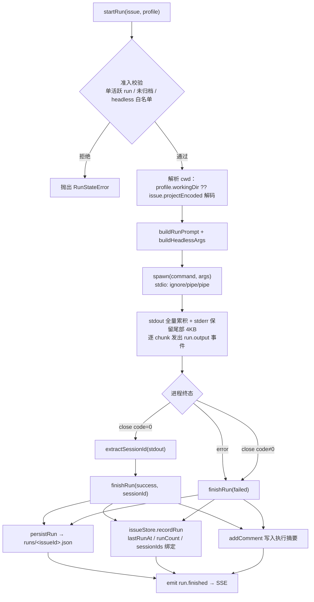
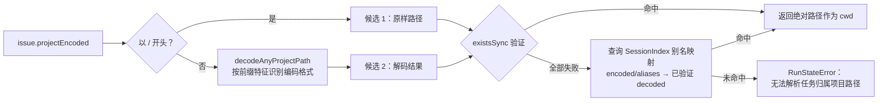
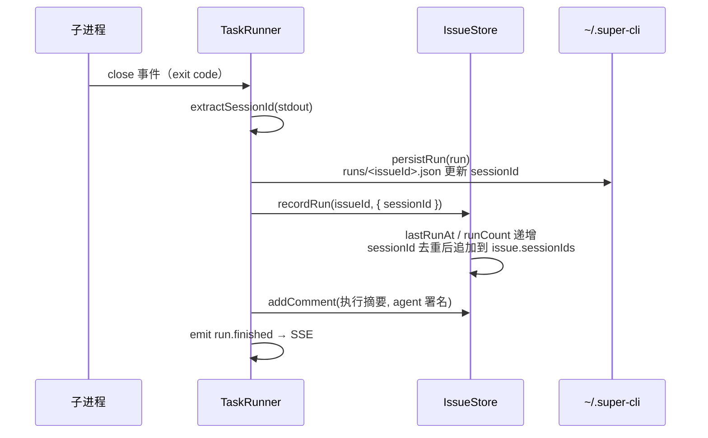

在 super-cli 的 Agent 执行体系中，`TaskRunner` 承担着"把看板上的 Issue 真正交给 AI 执行"的核心职责：它将 Issue 内容编译为无头（headless）CLI 调用，用 `child_process.spawn` 启动 Agent 进程，流式捕获输出，并在进程结束后从 stdout 中提取会话 ID，自动绑定回 Issue 的审计记录。本文面向高级读者，完整拆解这条从 spawn 到会话自动绑定的管线——前置知识请先阅读 [AgentProfile：统一的 Agent 启动配置实体](18-agentprofile-tong-de-agent-qi-dong-pei-zhi-shi-ti)。

## 管线全景：一次无头运行的完整生命周期

`TaskRunner` 的全部执行逻辑围绕一个内存态的 `active` Map（issueId → 活跃运行）与磁盘态的运行记录文件展开。一次 `startRun` 调用会依次通过准入校验、工作目录解析、argv 构造、进程启动四个阶段，然后转入异步的输出捕获与终态收敛阶段。下图概括了这条管线（阅读前提：`IssueStore` 负责 issues.json 持久化，`EventHub` 是 SSE 事件广播器，两者在第 12、16 页有专述）：

这条管线有两个设计要点贯穿始终：一是**每 Issue 同时只允许一个活跃运行**——`active` Map 的存在使第二次 `startRun` 直接抛出 `RunStateError`，从进程内杜绝了同一任务被并发交给两个 Agent 的混乱；二是**执行记录与会话绑定是分离的两层投影**——`IssueRun` 数组记录"发生了什么"，而 Issue 上的 `sessionIds` 数组记录"留下了什么痕迹"，二者在 `finishRun` 中汇合。

Sources: [task-runner.ts](src/core/task-runner.ts#L106-L113), [task-runner.ts](src/core/task-runner.ts#L173-L177), [types.ts](src/core/types.ts#L237-L250)

## Provider 白名单与三种无头调用形态

在 8 家注册的 CLI Provider 中，只有 3 家支持非交互执行：`claude-code`、`codex`、`pi`。这个白名单由 `HEADLESS_PROVIDERS` 常量定义，`startRun` 在准入阶段强制检查，其余 Provider 只能走交互式终端启动路径（见 [交互式启动与 macOS 终端集成](20-jiao-hu-shi-qi-dong-yu-macos-zhong-duan-ji-cheng-ghostty-iterm2-warp-deng)）。`buildHeadlessArgs` 针对 Pr 那三家各自的 CLI 约定生成了截然不同的 argv 结构：

| Provider | 命令 | argv 结构 | 模型参数 | 会话 ID 来源 |
|---|---|---|---|---|
| claude-code | `claude` | `[--dangerously-skip-permissions, --model X, -p, prompt, --output-format, json]` | `--model X` | 最终 JSON 行的 `session_id` 字段 |
| codex | `codex` | `[exec, --json, prompt]` | `-c model="X"` | `thread.started` 事件的 `thread_id`，兜底 `session_id` |
| pi | `pi` | `[--mode, json, --session-id <uuid>, prompt]` | `--model X` | 调用方在 spawn 前自行生成的 `randomUUID()` |

三个细节值得高级读者注意。其一，`--dangerously-skip-permissions` 这类"无人值守必需"的参数并非硬编码在管线里，而是来自 Provider 注册表的 `newArgs` 默认值；若 AgentProfile 显式配置了 `extraArgs`，则完全覆盖注册表默认值，这给用户保留了收紧权限的出口。其二，`--output-format json` / `--json` 的存在不是可有可无的——它们是后续会话 ID 提取的**数据契约**，没有结构化输出就没有自动绑定。其三，pi 是唯一一个由调用方预生成会话 ID 的 Provider：`startRun` 在构造 argv 时就生成 UUID 并写入 `IssueRun.sessionId`，这意味着即使 pi 进程在打印任何 JSON 之前就崩溃，运行记录里也已经有了可用于追溯的会话标识——这是三种 Provider 中唯一"先绑定、后执行"的路径。

Sources: [agent-store.ts](src/core/agent-store.ts#L24-L28), [task-runner.ts](src/core/task-runner.ts#L32-L49), [task-runner.ts](src/core/task-runner.ts#L51-L59), [providers.ts](src/core/providers.ts#L33-L34), [task-runner.ts](src/core/task-runner.ts#L192-L206)

## 提示词编译：把 Issue 变成一份带工作流纪律的任务书

`buildRunPrompt` 将 Issue 编译为 Agent 的第一轮提示词，其结构远不止标题加描述的拼接。提示词开篇即声明任务身份（"你正在执行 super-cli 看板任务 {identifier}"），结尾则植入了一段**工作流纪律**：要求 Agent 完成后用 `super-cli issue comment {identifier} --add "<进展>" --agent` 汇报结果，需要推进状态时用 `super-cli issue move {identifier} <status>`，并明确 "done 只能由用户移动"。

这段纪律提示词是整条管线中最具系统设计意味的部分：它让被无头启动的 Agent 反过来成为 super-cli 的客户端，通过 CLI 回写看板，形成"看板派发任务 → Agent 执行 → Agent 回写看板"的闭环。也就是说，TaskRunner 不只是进程的启动器，它还是 Agent 与看板之间协作契约的**发起方**——Agent 侧只需安装配套 Skill（见 [super-cli-taskboard Skill 的分发与跨 Provider 安装](17-super-cli-taskboard-skill-de-fen-fa-yu-kua-provider-an-zhuang)）即可履行契约。状态机与 claim 语义的完整规则在 [Issue 状态机与 Agent 工作流纪律](14-issue-zhuang-tai-ji-yu-agent-gong-zuo-liu-ji-claim-move-comment) 中专述。

Sources: [task-runner.ts](src/core/task-runner.ts#L89-L102)

## 工作目录解析：有损编码的回退链

无头运行的 cwd 决定 Agent 在哪个代码库中工作，其解析遵循一条清晰的优先级链：`AgentProfile.workingDir` 若存在则直接使用；否则依据 `issue.projectEncoded` 解码。难点在于后者的编码是**有损的**——dash 编码会把路径分隔符与目录名中的连字符混为一谈（`super-cli` 可能被解码成 `super/cli`），所以 `resolveIssueProjectPath` 采取了"候选验证 + 索引回退"的两级策略：先尝试所有确定性解码候选并在磁盘上验证 `existsSync`，全部失败后查询 Session 索引构建的别名映射表。

别名映射由 `projectAliasMap` 从 `SessionIndex.getProjects()` 构建：Session 索引在扫描各 Provider 会话目录时，将同一解码路径下的所有编码变体（`projectEncoded`）归并为 `aliases` 数组，TaskRunner 将其展平为 `encoded/alias → decoded` 的 Map 并缓存在实例上。这个设计复用了第 8 页所述的索引引擎（[Session 索引引擎：TTL 缓存、mtime 失效与后台预热](8-session-suo-yin-yin-qing-ttl-huan-cun-mtime-shi-xiao-yu-hou-tai-yu-re)），让"哪些编码对应哪个真实目录"这一知识由真实会话数据背书，而非依赖启发式猜测。索引不可用时静默降级为仅靠直接候选解析，解析彻底失败则拒绝启动并提示用户重新选择项目。

Sources: [task-runner.ts](src/core/task-runner.ts#L127-L145), [task-runner.ts](src/core/task-runner.ts#L181-L189), [paths.ts](src/core/paths.ts#L80-L110), [session-index.ts](src/core/session-index.ts#L215-L252)

## spawn 的 stdio 契约与双通道输出分发

`spawn` 调用中的 `stdio: ['ignore', 'pipe', 'pipe']` 是一个明确的无头契约：stdin 被直接关闭，杜绝任何 CLI 工具在无人值守时等待交互输入而永久挂起的可能；stdout 与 stderr 则双双接管为管道。两者的累积策略刻意分化——stdout **全量累积**到内存，因为它承载着结束后的会话 ID 提取；stderr 只保留**最后 4000 字节**的滑动尾部窗口，因为失败诊断通常只需要堆栈末尾，全量保留会随长任务无界增长。

输出分发的核心是 `RunEvent` 事件与 `onOutput` 回调构成的**双通道**：每个 stdout/stderr chunk 既触发 `emit({ type: 'run.output', ... })`，也调用 `opts.onOutput(chunk)`。这两个出口服务两种宿主，且语义不同——CLI 宿主用 `onOutput` 把字节流直写 `process.stdout` 实现实时回显；Server 宿主虽然在监听器里收到 `run.output` 事件，却**有意将其过滤丢弃**（"too chatty for SSE"），只让 `run.started` / `run.finished` 进入 SSE 广播。这意味着 Web 端不会通过 SSE 接收原始输出流，输出级实时性仅属于 CLI 终端场景。

Sources: [task-runner.ts](src/core/task-runner.ts#L20-L24), [task-runner.ts](src/core/task-runner.ts#L209-L232), [server/index.ts](src/server/index.ts#L38-L42), [cli/commands/issue.ts](src/cli/commands/issue.ts#L357-L360)

## 会话自动绑定：三种提取策略与审计投影

管线的高潮在进程 `close` 事件处：`extractSessionId` 逐行扫描累积的 stdout，只对以 `{` 开头的行尝试 JSON 解析（非 JSON 行静默跳过），然后按 Provider 提取会话标识。提取成功后进入 `finishRun`，完成三层落盘——这是"从 spawn 到会话自动绑定"标题的最终落点：

`recordRun` 是绑定动作的实质：它把会话 ID 追加进 `issue.sessionIds` 数组（已存在则去重跳过），同时更新 `lastRunAt` 时间戳与 `runCount` 计数器，构成 Issue 上的**审计投影**。随后 `finishRun` 还会以 Agent 署名自动写入一条中文摘要评论——成功时报告 Agent 名称、耗时与 session ID 前 8 位，失败时附上 stderr 尾部的前 200 字符。至此，一次无头运行在看板上留下三重痕迹：独立的运行历史文件、Issue 元数据投影、人类可读的评论流。

这层绑定与用户手动执行的 `bindSession` 有一个关键差异：`recordRun` 是 Agent 身份（`'agent'`）的追加式投影，不做跨 Issue 的会话归属仲裁；而手动绑定的 `bindSession` 会把同一会话从其他 Issue 上强制摘除，保证一个会话同一时刻只归属一个任务。两条路径共同维护 `sessionIds` 的不变量，其乐观锁与并发语义在 [乐观锁机制：version 字段与多 Agent 并发写安全](13-le-guan-suo-ji-zhi-version-zi-duan-yu-duo-agent-bing-fa-xie-an-quan) 中专述。

Sources: [task-runner.ts](src/core/task-runner.ts#L69-L86), [task-runner.ts](src/core/task-runner.ts#L237-L246), [task-runner.ts](src/core/task-runner.ts#L271-L301), [issue-store.ts](src/core/issue-store.ts#L339-L354), [issue-store.ts](src/core/issue-store.ts#L306-L320)

## 终态收敛：幂等保护与停止语义

`finishRun` 是唯一允许改写运行终态的地方，其幂等性由两道防线保证：`active` Map 的删除使第二次调用直接抛错；而 `close` 回调开头的 `if (run.status !== 'running') return` 检查，确保 `stopRun` 或 `error` 事件先行收敛后，迟到的 `close` 不会二次覆盖终态。`stopRun` 本身实现了经典的温和终止序列：先置 `status = 'stopped'` 并发送 SIGTERM，5 秒后若进程仍存活则升级为 SIGKILL——兜底定时器调用 `.unref()` 释放事件循环引用，避免它阻止 Node 进程正常退出。

还有一个容易被忽略的状态机联动：`startRun` 在成功 spawn 后，若 Issue 处于 `todo` 状态，会以 Agent 身份 best-effort 地执行 `moveIssue(issue.id, 'in_progress', ...)`，与 Agent 主动 claim 的语义对齐——任务一旦被真正执行，就不该停留在待办列。这次状态迁移被包裹在 try/catch 中且注释明确"never fail the run over it"：执行管线的可用性优先于看板状态的整齐。同样地，若 Issue 在运行期间被删除，`finishRun` 中的审计投影会整体失败并被吞掉，但 `persistRun` 先行执行，运行记录仍然完整落盘——磁盘上的运行历史是比看板投影更基础的真相层。

Sources: [task-runner.ts](src/core/task-runner.ts#L234-L246), [task-runner.ts](src/core/task-runner.ts#L248-L255), [task-runner.ts](src/core/task-runner.ts#L260-L269), [task-runner.ts](src/core/task-runner.ts#L287-L297)

## 运行历史的持久化模型

每次运行的记录形态由 `IssueRun` 接口定义，以 JSON 数组形式按 Issue 分文件存储在 `~/.super-cli/runs/<issueId>.json`，单文件上限 500 条，超出后从头部裁剪（`slice(-MAX_RUNS_PER_ISSUE)`）。`persistRun` 采用读-改-写策略：按 `run.id` 定位已有记录做原位更新，找不到则追加——这使得 `running` 状态的记录在 spawn 前就先落盘，即使进程崩溃也能留下"曾有一次运行未完成"的痕迹。

| 字段 | 类型 | 填充时机 | 说明 |
|---|---|---|---|
| `id` / `issueId` | UUID | 创建时 | 运行实例与所属 Issue |
| `agentId` / `agentName` / `provider` | string | 创建时 | 冗余快照，Agent 被删后历史仍可读 |
| `trigger` | `'manual'` | 创建时 | 目前唯一触发方式，为自动触发预留 |
| `startedAt` / `finishedAt` | ISO 时间 | 创建 / 终态 | 供 CLI 计算耗时展示 |
| `status` | `running → success / failed / stopped` | 终态 | 三种终态互斥，由 finishRun 唯一写入 |
| `sessionId` | string | pi 创建时即有；其余 close 时提取 | 会话自动绑定的载体 |
| `exitCode` / `error` | number / string | 终态 | error 仅保留 stderr 尾部窗口内容 |

Sources: [types.ts](src/core/types.ts#L232-L250), [task-runner.ts](src/core/task-runner.ts#L104), [task-runner.ts](src/core/task-runner.ts#L147-L167), [paths.ts](src/core/paths.ts#L37-L59)

## 双宿主集成：同一管线，两种消费方式

`TaskRunner` 被两个宿主共享，各自以不同方式消费同一条管线。Server 侧在启动时创建单例并通过 `setEventListener` 桥接到 `EventHub`，暴露 `POST /api/issues/:id/runs`（启动，必须携带 `agentId`）、`POST /api/issues/:id/runs/stop`、`GET /api/issues/:id/runs`（历史 + `active` 标志）三个端点；CLI 侧则每次命令即时实例化，`issue run` 用 `onOutput` 直出流，并通过注册一次性事件监听器等待 `run.finished` 才退出，最终以运行成功与否作为进程退出码——这使得 `super-cli issue run` 可以无缝嵌入脚本与 CI。

| 维度 | Fastify Server 宿主 | CLI 宿主 |
|---|---|---|
| 实例生命周期 | 进程级单例，跨请求复用 | 每命令新建 |
| 输出消费 | 过滤 `run.output`，SSE 只广播 started/finished | `onOutput` 直写 stdout 实时回显 |
| 停止能力 | `stop` 端点可停止本进程内启动的运行 | `issue stop` 仅限同进程运行（active Map 是进程内存态） |
| 退出语义 | 常驻服务 | 等待 `run.finished` 后 `process.exit(成功 ? 0 : 1)` |

需要明确的一个边界是：单活跃 run 的互斥与停止能力都以 `active` Map 的进程内存态为实现基础，跨进程（例如 Server 启动的运行与另开的 CLI `stop` 命令）互不可见——CLI `stop` 命令的帮助文本"only runs started in this process"正是对这一边界的诚实声明。

Sources: [server/index.ts](src/server/index.ts#L38-L48), [server/routes/issues.ts](src/server/routes/issues.ts#L298-L337), [server/events.ts](src/server/events.ts#L23-L24), [cli/commands/issue.ts](src/cli/commands/issue.ts#L345-L382), [cli/commands/issue.ts](src/cli/commands/issue.ts#L425-L438)

## 小结与延伸阅读

`TaskRunner` 的设计精髓在于把一次不可控的 AI 进程执行，收敛为一条可审计、可绑定、可回溯的确定性管线：准入层用白名单与单活跃互斥圈定边界，构造层用提示词植入协作契约，执行层用 stdio 管道与滑动窗口控制资源，收敛层用三重投影（运行文件、Issue 审计、自动评论）固化结果，而 pi 预生成会话 ID 的特例则展示了当外部工具不配合时会话绑定如何反向设计。理解这条管线后，建议按以下路径继续深入：

- 上游配置实体：[AgentProfile：统一的 Agent 启动配置实体](18-agentprofile-tong-de-agent-qi-dong-pei-zhi-shi-ti)
- 对照路径：[交互式启动与 macOS 终端集成（Ghostty / iTerm2 / Warp 等）](20-jiao-hu-shi-qi-dong-yu-macos-zhong-duan-ji-cheng-ghostty-iterm2-warp-deng)
- 绑定后的会话如何被读取回放：[异构 Session 文件解析：JSONL 流式读取与格式差异](9-yi-gou-session-wen-jian-jie-xi-jsonl-liu-shi-du-qu-yu-ge-shi-chai-yi)
- 任务来源：[Idea 到 Task 的转化管线：捕获、分类与 promote](21-idea-dao-task-de-zhuan-hua-guan-xian-bu-huo-fen-lei-yu-promote)