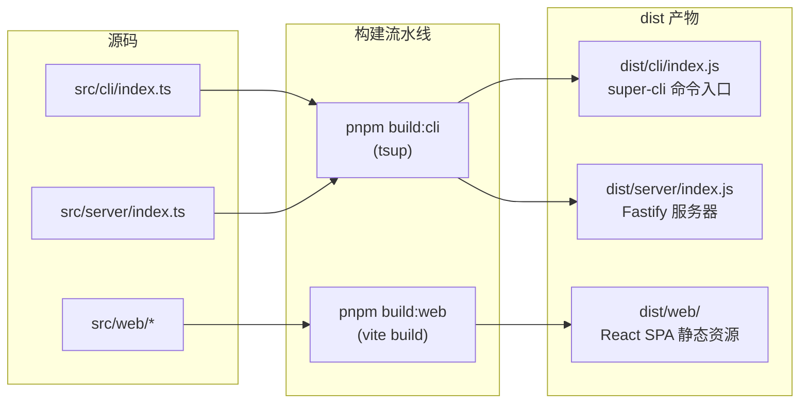

本页是 super-cli 的上手入口：从环境准备、安装、构建，到在本地跑起 CLI 与 Web 看板，全程约 10 分钟。super-cli 是一个 AI 编程助手 session 管理工具，统一管理 Claude Code、Qoder、Codex 等 8 家 CLI 工具的历史对话，提供命令行与 Web 看板两种交互方式。完成本页后，你将获得一条可用的 `super-cli` 命令和一个可访问的本地看板。

Sources: [README.md](README.md#L1-L3)

## 环境要求

上手前只需确认两项硬性条件。**Node.js ≥ 22.0.0** 是唯一的运行时约束，由 `package.json` 的 `engines` 字段强制声明——低于此版本无法正常执行构建产物；**pnpm** 则是源码开发路径的包管理器（仓库带有 `pnpm-lock.yaml` 锁定文件，所有官方脚本均以 `pnpm` 调用）。如果你只是想使用这个工具而非参与开发，pnpm 不是必需的，npm 即可完成全局安装。

| 依赖 | 最低版本 | 何时需要 | 说明 |
|---|---|---|---|
| Node.js | ≥ 22.0.0 | 始终需要 | 运行时硬约束，ESM 模块系统 |
| pnpm | 任意近期版本 | 源码开发/构建时 | 仓库锁定文件与脚本均基于 pnpm |
| CLI 工具（Claude Code 等） | 无版本要求 | 可选 | 无任何工具时功能可用，但列表为空 |

值得强调的一个架构事实：super-cli **不依赖任何数据库**，它直接读取各 CLI 工具写在本地家目录下的数据文件（如 `~/.claude/projects/`、`~/.qoder/projects/`），自身的标签、Issue 看板等状态则落在 `~/.super-cli/` 目录。这意味着安装后无需任何初始化数据库的步骤，首次运行即自动创建数据目录。

Sources: [package.json](package.json#L47-L49), [README.md](README.md#L167-L178), [src/core/paths.ts](src/core/paths.ts#L37-L59)

## 两条安装路径

根据你的目的不同，存在两条互斥的安装路径：**使用者路径**通过 npm 直接安装已发布的构建产物，一分钟内可用；**开发者路径**从源码构建并通过 `pnpm link --global` 将本地构建链接为全局命令，便于后续改代码立即生效。

| 维度 | 使用者路径（npm） | 开发者路径（源码 + link） |
|---|---|---|
| 安装命令 | `npm install -g @bluesky8318/super-cli` | `pnpm install && pnpm build && pnpm link --global` |
| 获取内容 | npm 上预构建的 `dist/` 产物 | 本仓库最新源码的构建产物 |
| 代码修改 | 不可 | 修改后重新 `pnpm build` 即生效 |
| 适用人群 | 日常使用看板管理 session | 参与开发或需要未发布功能 |

两条路径最终都指向同一个入口：npm 包的 `bin` 字段将 `super-cli` 命令映射到 `./dist/cli/index.js`，该文件带 `#!/usr/bin/env node` shebang，由 Commander.js 注册全部 12 个子命令（list、show、search、name、tasks、issue、idea、agent、skill、stats、config、serve），并提供全局 `--provider` 过滤参数。

Sources: [README.md](README.md#L48-L60), [package.json](package.json#L6-L8), [src/cli/index.ts](src/cli/index.ts#L1-L37)

### 路径一：npm 全局安装（使用者）

```bash
# 1. 安装
npm install -g @bluesky8318/super-cli

# 2. 验证 —— 输出帮助信息即成功
super-cli --help

# 3. 列出最近 session（首次运行会在 ~/.super-cli/ 下落配置）
super-cli list

# 4. 启动 Web 看板并自动打开浏览器
super-cli serve --port 3000 --open
```

验证成功的标志有两个层面：命令层面，`super-cli --help` 能打印出所有子命令；数据层面，首次执行写操作后 `~/.super-cli/` 目录下会出现 `config.json`（用户配置）等文件——这是 super-cli 自身状态的唯一家目录，与它读取的各 CLI 工具数据完全隔离。

Sources: [README.md](README.md#L50-L60), [src/core/paths.ts](src/core/paths.ts#L37-L59)

### 路径二：源码构建（开发者）

```bash
# 1. 克隆并安装依赖
git clone https://github.com/bluesky8318/super-cli.git
cd super-cli
pnpm install

# 2. 完整构建（CLI/Server + Web 前端）
pnpm build

# 3. 将本地构建链接为全局命令
pnpm link --global

# 4. 验证 —— 此后 shell 中的 super-cli 即指向你的本地构建
super-cli --help

# 5. 不经 link 也可以直接运行构建产物
pnpm start        # 等价于 node dist/cli/index.js
```

`pnpm link --global` 的价值在于：每当你修改源码并重新 `pnpm build` 后，全局的 `super-cli` 命令立即指向新产物，无需重新安装。如果不介意多敲几个字，`pnpm start`（内部执行 `node dist/cli/index.js`）是更轻量的验证方式。

Sources: [README.md](README.md#L54-L60), [package.json](package.json#L29-L37)

## 构建：双构建流如何汇入 dist/

super-cli 的构建由**两条独立流水线**组成，`pnpm build` 串行执行二者。理解这个结构是排查构建问题的关键：CLI 与 Server 由 **tsup** 打包（TypeScript → Node 可执行的 ESM bundle），Web 前端由 **Vite** 打包（React SPA → 静态资源）。两条流的产物最终汇入同一个 `dist/` 目录，形成 npm 包发布的完整内容。



tsup 的配置中有两个对新手最有价值的细节。第一，**clean 的排除模式**：tsup 默认清空输出目录，但配置了 `clean: ['!web', '!web/**']` 负向排除，确保重新构建 CLI/Server 时绝不清掉 Vite 产出的 `dist/web`——这就是为什么两条构建流可以安全共存于一个 `dist/`。第二，**`.md` 文件以纯文本内联**（`loader: { '.md': 'text' }`），使得 `skills/super-cli-taskboard/SKILL.md` 能被打进产物供运行时读取。

| 构建脚本 | 执行内容 | 产物 | 关键配置 |
|---|---|---|---|
| `pnpm build:cli` | tsup 打包两个入口 | `dist/cli/index.js`、`dist/server/index.js` + 共享 chunk | ESM、target node22、code splitting、保留 `dist/web` |
| `pnpm build:web` | Vite 生产构建 | `dist/web/`（SPA 静态资源） | root 指向 `src/web`、`emptyOutDir: true` |
| `pnpm build` | 顺序执行上面两条 | 完整 `dist/` | `prepublishOnly` 钩子保证发包前必构建 |

Vite 侧同样有一个新手必知的设计：`vite.config.ts` 中 `root` 显式指向 `src/web`（而非仓库根），输出到 `dist/web`，且开发服务器配置了 `'/api': 'http://localhost:3000'` 代理——这个代理是下一节「开发模式运行」的核心前提。另外注意仓库根的 `tsconfig.json` 明确 `exclude: ["src/web"]`，前端有自己的 `src/web/tsconfig.json`，两套类型检查互不干扰。

Sources: [package.json](package.json#L28-L38), [tsup.config.ts](tsup.config.ts#L3-L20), [src/web/vite.config.ts](src/web/vite.config.ts#L5-L17), [tsconfig.json](tsconfig.json#L23-L24)

## 本地运行：两种模式

构建完成后有两种运行姿势。**产物模式**运行完整构建的 `dist/`，最接近真实发布形态；**开发模式**组合 tsup watch 与 Vite dev server，通过代理协作实现前后端热更新。新手建议先用产物模式确认一切正常，再切换开发模式。

### 模式一：运行构建产物（推荐首次使用）

```bash
pnpm build                        # 确保产物最新
super-cli serve --port 3000 --open   # 或 pnpm start serve --port 3000
```

`serve` 命令启动 Fastify 服务器，默认绑定 `0.0.0.0:3000`，`--open` 会在启动后自动唤起浏览器。服务器启动时做了三件事，每件都值得了解：注册全部 API 路由（sessions、tasks、issues、ideas、agents、stats 等）；**在后台预热 session 索引**，让首次页面加载不必等待冷扫描全部 provider 的 session 文件；最后检测 `dist/web` 是否存在——存在则通过 `@fastify/static` 托管 SPA 并将未知路径回退到 `index.html`，不存在则打印警告提示执行 `pnpm build:web`。

`serve` 还内置了端口占用的友好处理：当遇到 `EADDRINUSE` 错误时，不抛出原始堆栈，而是直接给出中文提示与修复命令 `lsof -ti :3000 | xargs kill`，这是新手最常撞上的问题之一。

Sources: [src/cli/commands/serve.ts](src/cli/commands/serve.ts#L4-L34), [src/server/index.ts](src/server/index.ts#L27-L80)

### 模式二：开发模式（热重载）

```bash
# 终端 1：CLI/Server 热重载（tsup --watch，改后端代码自动重打包）
pnpm dev

# 终端 2：前端开发服务器（Vite，默认 http://localhost:5173，改 React 代码即时热更新）
pnpm dev:web
```

两个进程的协作机制如下流程图所示：Vite dev server 在 5173 端口服务前端页面，浏览器发起的所有 `/api/*` 请求被代理转发到 3000 端口的 Fastify——而 Fastify 本身（通过 `tsup --watch` 产物运行）完全不感知前端的开发状态。这意味着**你必须使用 Vite 的 5173 地址访问页面**，直接访问 3000 端口看到的将是构建产物版前端（且若未构建过 `dist/web` 则只有 API 无界面）。


开发模式下的改动生效方式：**前端改动**由 Vite HMR 即时反映；**后端（CLI/Server）改动**由 tsup watch 自动重新打包，但需要重启 `serve` 进程（或重跑命令）才能加载新产物——tsup watch 只负责编译，不负责进程重启。dev 热重载的进阶技巧、typecheck 与测试流程，见专门的调试页面。

Sources: [README.md](README.md#L156-L165), [src/web/vite.config.ts](src/web/vite.config.ts#L12-L16), [package.json](package.json#L32-L33)

## 命令速查表

以下是 `package.json` 中全部脚本的速查，覆盖从安装到运行的完整生命周期：

| 脚本 | 实际执行 | 用途 |
|---|---|---|
| `pnpm install` | — | 安装依赖（首次必做） |
| `pnpm build` | `build:cli` + `build:web` | 完整构建，产出可发布的 `dist/` |
| `pnpm build:cli` | `tsup` | 仅构建 CLI 与 Server |
| `pnpm build:web` | `vite build --config src/web/vite.config.ts` | 仅构建 Web 前端 |
| `pnpm dev` | `tsup --watch` | 后端热重载（watch 重打包） |
| `pnpm dev:web` | `vite dev --config src/web/vite.config.ts` | 前端开发服务器（代理 /api → :3000） |
| `pnpm start` | `node dist/cli/index.js` | 直接运行构建产物 |
| `pnpm typecheck` | `tsc --noEmit` | TypeScript 类型检查（只查不产出） |
| `pnpm test` | `vitest` | 运行测试 |
| `pnpm link --global` | — | 将本地构建注册为全局 `super-cli` 命令 |

Sources: [package.json](package.json#L28-L38)

## 故障排查

新手最常遇到的问题集中在构建产物缺失与端口冲突两类，下表给出现象、根因与修复方案：

| 现象 | 根因 | 修复 |
|---|---|---|
| `serve` 启动后提示 `dist/web not found — the web UI is unavailable` | 只跑了 `pnpm build:cli`，前端产物缺失 | 执行 `pnpm build:web`（或完整 `pnpm build`）后重启 serve |
| `端口 3000 已被占用` 红色报错 | 旧的 serve 进程仍在运行 | `lsof -ti :3000 \| xargs kill` 后重试（serve 已内置此提示） |
| 访问 `localhost:3000` 只有 API 没有 Web 界面 | 开发模式下前端在 5173 端口 | 开发模式请访问 `localhost:5173`；产物模式需先 `pnpm build:web` |
| 命令 `super-cli` 不存在 | npm 安装路径不在 PATH，或未执行 link | 检查 `npm bin -g` 是否在 PATH；开发者路径确认已执行 `pnpm link --global` |
| Node 版本报错 | 运行时低于 22.0.0 | 升级 Node（`engines` 字段硬约束），建议用 nvm/fnm 管理 |
| 首次打开看板 session 列表为空 | 本机未安装任何受支持的 CLI 工具，或无历史会话 | 安装并使用 Claude Code 等工具产生会话后刷新 |

其中「列表为空」并非故障：super-cli 是纯读取型聚合器，数据完全来自各 CLI 工具自身的本地文件，没有任何演示或种子数据。

Sources: [src/server/index.ts](src/server/index.ts#L59-L69), [src/cli/commands/serve.ts](src/cli/commands/serve.ts#L18-L25), [package.json](package.json#L47-L49), [README.md](README.md#L167-L178)

## 技术栈速览

若你想在深入前对全局有个认知，这是本工具的分层技术选型，全部与前述构建流一一对应：

| 层 | 技术 |
|---|---|
| CLI | Commander.js |
| HTTP 服务器 | Fastify 5 |
| 前端 | React 19 + Vite + TailwindCSS 4 |
| 构建 | tsup（CLI/Server）+ Vite（Web） |
| 测试 | Vitest |
| 运行时 | Node.js ≥ 22，ESM 模块系统 |

Sources: [README.md](README.md#L142-L154)

## 下一步

本页完成后，按你的目标选择继续阅读的方向。**想用好工具**：先读 [CLI 命令全景：list、show、search、issue 与 --json 输出](3-cli-ming-ling-quan-jing-list-show-search-issue-yu-json-shu-chu)掌握命令行查询能力，再读 [Web 看板五分钟上手：serve 启动与界面导览](4-web-kan-ban-wu-fen-zhong-shang-shou-serve-qi-dong-yu-jie-mian-dao-lan)驾驭看板界面。**想参与开发**：直接进入 [开发环境与调试技巧：dev 热重载、typecheck 与测试](5-kai-fa-huan-jing-yu-diao-shi-ji-qiao-dev-re-zhong-zai-typecheck-yu-ce-shi)深化本页介绍过的开发模式。**想理解架构**：从 [三层架构：CLI、Fastify 服务与 React 前端如何协作](6-san-ceng-jia-gou-cli-fastify-fu-wu-yu-react-qian-duan-ru-he-xie-zuo)和[双构建流：tsup 打包 CLI/Server 与 Vite 构建 Web](30-shuang-gou-jian-liu-tsup-da-bao-cli-server-yu-vite-gou-jian-web)开始，后者是本页构建一节的完整版。如果你刚接触这个项目，也欢迎先回看 [项目总览：super-cli 是什么、解决什么问题](1-xiang-mu-zong-lan-super-cli-shi-shi-ao-jie-jue-shi-yao-wen-ti)。