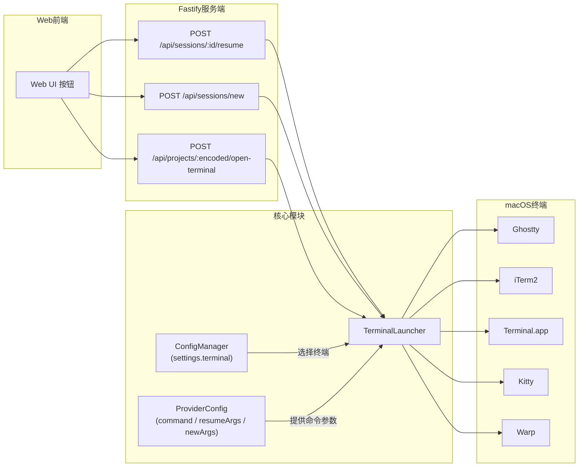
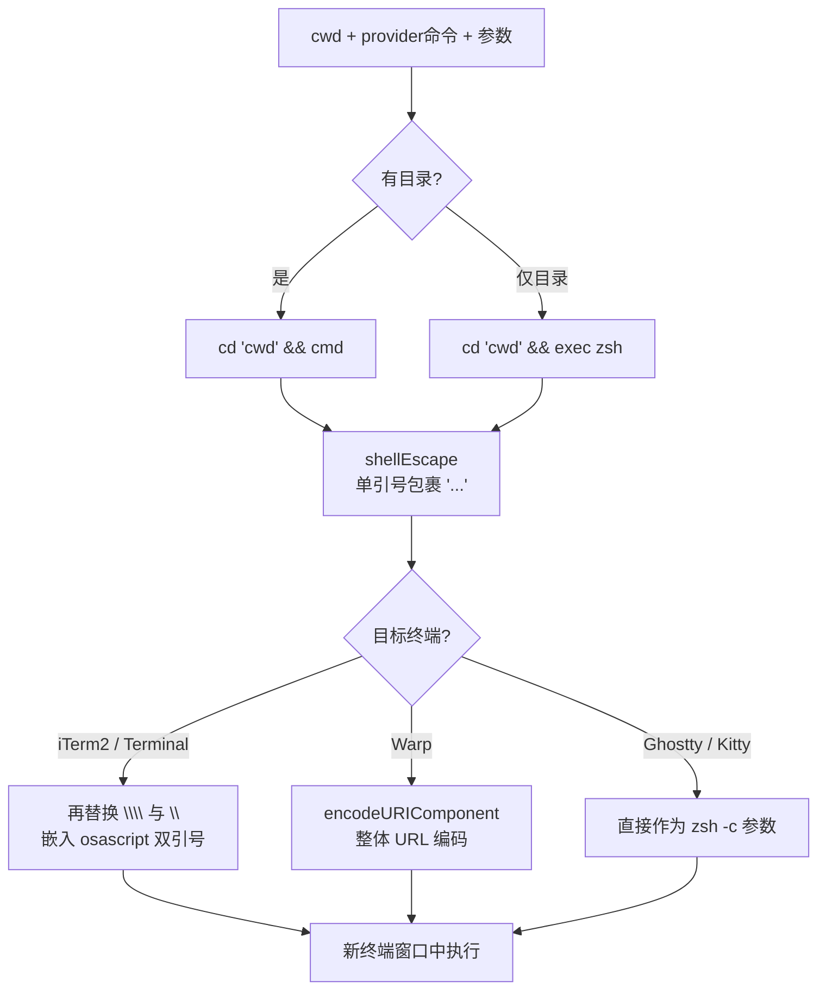

当你在 Web 看板上点击某个历史 Session 的"恢复"按钮，或者想在新终端窗口里直接打开某个项目时，super-cli 会在你的 macOS 桌面上弹出一个真实的终端窗口，并自动执行对应的 CLI Agent 命令。这一切由 `TerminalLauncher` 模块完成。本页聚焦**交互式启动**这条链路：它和[无头执行管线](19-wu-tou-zhi-xing-guan-xian-taskrunner-cong-spawn-dao-hui-hua-zi-dong-bang-ding)（后台静默运行、捕获输出）是互补的两条路径——交互式启动不捕获任何输出，只是"打开一扇窗"，把控制权交还给你本人。我们将会看到：这个模块如何被 Web API 调用、命令字符串如何拼装与转义、以及五种终端（Ghostty、iTerm2、Terminal.app、Kitty、Warp）各自的集成技巧。

## 整体架构：从 Web 按钮到终端窗口

先建立一个整体认知。交互式启动的入口全部位于 **HTTP 服务端路由**中（CLI 命令本身并不直接调用启动器），前端的"恢复会话""新建会话""在终端打开"按钮都通过 fetch 调用这些 API。`TerminalLauncher` 收到请求后，先从用户配置读取目标终端类型，再从 [Provider 注册表](7-duo-provider-chou-xiang-zhu-ce-biao-she-ji-yu-8-jia-cli-gong-ju-gua-pei)取出对应的命令与参数，最后按终端类型选择不同的启动机制。整个过程不追踪子进程的输出，也不等待 Agent 退出。



三个 API 路由分别对应三种使用场景：恢复历史 Session（`POST /api/sessions/:id/resume`）、以指定 Provider 或 Agent Profile 新开会话（`POST /api/sessions/new`）、以及纯粹在终端里打开项目目录（`POST /api/projects/:encoded/open-terminal`）。前端封装了对应的三个函数：`resumeSession`、`createNewSession` 与 `openProjectInTerminal`。

Sources: [terminal-launcher.ts](src/core/terminal-launcher.ts#L15-L35), [sessions.ts](src/server/routes/sessions.ts#L97-L131), [projects.ts](src/server/routes/projects.ts#L173-L188), [client.ts](src/web/src/api/client.ts#L68-L115)

## TerminalLauncher 的四个公开入口

`TerminalLauncher` 类对外暴露四个方法，覆盖"恢复、新建、按 Profile 新建、仅打开目录"四种场景。理解它们的差异，关键在于**命令字符串是怎么拼出来的**——其余逻辑（路径校验、错误包装）四个方法完全一致。

| 方法 | 作用 | 命令拼装来源 |
|---|---|---|
| `resume(sessionId, cwd, provider)` | 恢复已有 Session | `provider.command + resumeArgs(sessionId)` |
| `launchNew(cwd, provider, prompt?)` | 新开一个会话 | `provider.command + newArgs`，可选追加初始 prompt |
| `launchNewWithProfile(cwd, profile, prompt?)` | 按 AgentProfile 新开 | `command + buildInteractiveArgs(profile)`，可前置环境变量 |
| `openDirectory(cwd)` | 只打开终端到指定目录 | 空命令，只做 `cd` |

四个方法都返回统一的 `LaunchResult` 结构：`action` 取值为 `'launched'`（已在新窗口启动）或 `'error'`（失败并附 `message`），同时带上实际使用的终端名。值得注意的是，类型定义中还预留了 `'focused'` 状态，但当前代码路径只会产生 `'launched'` 和 `'error'` 两种——这是一个为未来"聚焦已有窗口"功能保留的设计占位。另外，所有方法在启动前都会用 `existsSync` 校验目录是否存在，不存在则直接返回错误而不发起任何系统调用。

Sources: [terminal-launcher.ts](src/core/terminal-launcher.ts#L8-L13), [terminal-launcher.ts](src/core/terminal-launcher.ts#L22-L101)

其中 `launchNewWithProfile` 最值得展开：它接收一个 [AgentProfile](18-agentprofile-tong-de-agent-qi-dong-pei-zhi-shi-ti)（用户自定义的 Agent 启动配置），调用 `buildInteractiveArgs` 把 Profile 的 `extraArgs`（或回退到 Provider 默认参数）与模型覆盖参数合并成命令行参数；若 Profile 还定义了环境变量，则把它们以 `KEY='value'` 的形式**前缀**在整条命令之前——例如 `ANTHROPIC_MODEL='x' claude --model x`。这与无头管线的参数构建逻辑共享同一套模型参数规则（Codex 用 `-c model="..."`，其余用 `--model <m>`）。

Sources: [terminal-launcher.ts](src/core/terminal-launcher.ts#L60-L86), [task-runner.ts](src/core/task-runner.ts#L51-L66)

## 命令拼装与转义：一条字符串的三层防护

交互式启动的本质是把一条 shell 命令字符串"注入"到一个新终端窗口里执行。这条字符串要经过三层不同上下文的转义，任何一层处理不当都会导致命令失效甚至注入风险：

1. **工作目录拼装**：如果同时有目录和命令，先拼成 `cd '<cwd>' && <cmd>`；只有目录没有命令时（`openDirectory` 场景），拼成 `cd '<cwd>' && exec zsh`——用 `exec` 替换当前 shell，让窗口直接停留在目标目录的交互式 zsh 中。
2. **shell 单引号转义**（`shellEscape`）：对命令中的参数（如 prompt、环境变量值）采用 POSIX 标准做法——用单引号包裹，并把内容中的 `'` 替换为 `'\''`，保证含空格或特殊字符的参数原样传递。
3. **osascript 双引号转义**：AppleScript 脚本本身用双引号包住命令文本，所以还要把反斜杠和双引号各替换一次（`\` → `\\`、`"` → `\"`）。



这套分层转义在初学者视角容易看漏：同一条命令字符串，发给 iTerm2 时经历的是"单引号 → AppleScript 双引号"两段式转义，发给 Warp 时却是整体 URL 编码塞进 `warp://` 协议链接，而 Ghostty 和 Kitty 则把字符串直接交给 `zsh -c`。理解这一点，你就能读懂为什么 `launchInTerminal` 里每个分支的引号样式都不一样。

Sources: [terminal-launcher.ts](src/core/terminal-launcher.ts#L119-L128), [terminal-launcher.ts](src/core/terminal-launcher.ts#L176-L178)

## 五种终端后端逐一拆解

`launchInTerminal` 用一个 `switch` 把五种终端分派到不同的 macOS 机制上。它们分属三类技术路线：**AppleScript 自动化**（iTerm2、Terminal.app、Warp 的激活部分）、**`open` 命令带参数启动 App**（Ghostty）、以及**直接 spawn 终端自身 CLI**（Kitty）。

| 终端 | 启动机制 | 同步/异步 | 关键细节 |
|---|---|---|---|
| Ghostty | `open -na Ghostty.app --args -e /bin/zsh -c <cmd>` | 异步（`detached` + `unref`） | `-n` 强制新实例，命令经 zsh -c 执行 |
| iTerm2 | osascript：激活 → `create window with default profile` → `write text` | 同步（`execSync`） | 新窗口走默认 Profile |
| Terminal.app | osascript：激活 → `do script` | 同步（`execSync`） | 最简单的 AppleScript 路径 |
| Kitty | `kitty --single-instance /bin/zsh -c '<cmd>'` | 异步（`detached` + `unref`） | 单实例模式复用已有进程 |
| Warp | osascript 激活 + `open "warp://action/new-window?command=<编码>"` | 激活同步、开窗异步 | 需 `sleep 0.5` 等待激活完成 |

Sources: [terminal-launcher.ts](src/core/terminal-launcher.ts#L130-L173)

有几个针对具体终端的"补丁"体现了真实世界的适配智慧。**Ghostty** 用 macOS 的 `open -na`（`-a` 指定应用、`-n` 开新实例）把 `-e /bin/zsh -c <命令>` 作为应用参数传入，并用 `detached: true` + `unref()` 让 Node 进程完全脱离对新窗口的生命周期管理。**Warp** 没有 AppleScript 的 `do script` 等价物，它依赖自家的 URL Scheme：先通过 osascript 和 System Events 把 Warp 置为前台，再 `sleep 0.5` 等窗口系统就绪，最后打开 `warp://action/new-window?command=...` 链接，整条命令用 `encodeURIComponent` 编码后塞进 URL。**Kitty** 则利用其 `--single-instance` 特性，让重复启动复用已有进程开新窗口。

Sources: [terminal-launcher.ts](src/core/terminal-launcher.ts#L131-L172)

对初学者来说还有个实用结论：**Terminal.app 是开箱默认值**。`getTerminal()` 从配置读取 `terminal` 键，若未配置或值非法（不在 `isValidTerminal` 的白名单内），就回退到 `'terminal'`。也就是说，不装任何第三方终端，super-cli 的交互式启动也能工作；装了 Ghostty 后只需一行配置即可切换。

Sources: [terminal-launcher.ts](src/core/terminal-launcher.ts#L103-L107), [terminal-launcher.ts](src/core/terminal-launcher.ts#L181-L183)

## Provider 层：恢复与新建的参数从哪来

`TerminalLauncher` 自己不认识任何一家 CLI Agent，它只向 [Provider 注册表](7-duo-provider-chou-xiang-zhu-ce-biao-she-ji-yu-8-jia-cli-gong-ju-gua-pei)索要三样东西：可执行命令 `command`、新建会话参数 `newArgs`、以及一个把 Session ID 翻译成恢复参数的函数 `resumeArgs(sessionId)`。可选的 `supportsPrompt` 标志表示该 CLI 是否接受把初始 prompt 作为位置参数直接传入。

| Provider | 恢复命令示例 | 支持 prompt |
|---|---|---|
| claude-code | `claude --dangerously-skip-permissions --resume <id>` | ✓ |
| codex | `codex resume <id>` | ✓ |
| kimi | `kimi --resume <id>` | ✓ |
| pi | `pi --resume <uuid>`（自动剥掉文件名的时间戳前缀） | — |
| opencode | `opencode --resume <id>` | — |

`resume()` 里有一个不起眼但很关键的适配：Pi 的 Session 文件名形如 `<timestamp>_<uuid>.jsonl`，索引里存的 ID 带时间戳前缀，而 `pi --resume` 只认纯 UUID——所以 `resumeArgs` 里专门做了 `id.slice(id.indexOf('_') + 1)` 的切片。这类"每个 Provider 一点小怪癖"正是注册表模式把差异封装在一处（ProviderConfig 定义内）的价值所在，`TerminalLauncher` 对此完全无感。

Sources: [providers.ts](src/core/providers.ts#L16-L27), [providers.ts](src/core/providers.ts#L29-L103), [terminal-launcher.ts](src/core/terminal-launcher.ts#L22-L35)

## 如何配置与触发：从 config 命令到 API 调用

切换默认终端只需要一行命令。终端选择持久化在 `~/.super-cli/config.json` 的 `settings.terminal` 字段中，`ConfigManager.get('terminal')` 与 `set` 方法负责读写这个扁平的 settings 对象：

```bash
super-cli config set terminal ghostty   # 可选: terminal / iterm2 / ghostty / kitty / warp
super-cli config get terminal           # 查看当前值
```

配置写入后会立即生效——`TerminalLauncher` 每次启动前都现查现用，没有缓存。若你把值设成了白名单之外的字符串，`getTerminal()` 会静默回退到 Terminal.app，不会报错，这是刻意的容错设计。

Sources: [cli/commands/config.ts](src/cli/commands/config.ts#L29-L38), [config.ts](src/core/config.ts#L21-L29), [types.ts](src/core/types.ts#L252-L265), [paths.ts](src/core/paths.ts#L37-L43)

触发侧的三个路由各自的语义如下。`POST /api/sessions/:id/resume` 接受 Session ID **前缀**匹配（`findSessionByPrefix`，方便从短 ID 恢复），工作目录优先取 Session 记录的 `cwd`，回退到项目解码路径。`POST /api/sessions/new` 的请求体可携带 `project`、`provider`、`prompt`、`agentId` 四个字段：传了 `agentId` 就走 `launchNewWithProfile`（Profile 优先），否则走 `launchNew` 并默认 `claude-code`。`POST /api/projects/:encoded/open-terminal` 最简单，只做"在终端打开这个项目目录"。任何一条路由失败都会把 HTTP 状态码置为 500 并透传 `LaunchResult.message`。

Sources: [sessions.ts](src/server/routes/sessions.ts#L99-L131), [projects.ts](src/server/routes/projects.ts#L173-L188)

## 边界行为与注意事项

把行为边界讲清楚，能帮你避开最常见的困惑。首先，**本模块是 macOS 专属**：`open`、`osascript`、`warp://` URL Scheme 全部是 macOS 机制（对比之下，项目路由里的"打开 Finder"功能专门写了 darwin/win32/linux 三分支，而终端启动器没有）。其次，`execSync` 意味着 iTerm2 和 Terminal.app 的 osascript 调用会**阻塞**服务端事件循环直至 AppleScript 返回，而 Ghostty/Kitty/Warp 的开窗部分是异步 spawn——这是现有实现的同步性差异，调用方（路由层）以 `await` 统一处理两种情况。最后，所有 spawn 都带 `detached: true` + `stdio: 'ignore'` + `unref()`，即 super-cli 完全不关心终端窗口之后的生死，也不会因为窗口存活而阻塞自身退出。

Sources: [terminal-launcher.ts](src/core/terminal-launcher.ts#L119-L135), [terminal-launcher.ts](src/core/terminal-launcher.ts#L149-L172), [projects.ts](src/server/routes/projects.ts#L148-L171)

## 小结与延伸阅读

本页我们拆解了 super-cli 的交互式启动链路：三个 HTTP 路由作为入口，`TerminalLauncher` 作为唯一的终端抽象层，向下通过单引号/双引号/URL 编码三层转义把命令安全地注入五种 macOS 终端，向上依赖 Provider 注册表抹平各家 CLI 的参数差异。它的设计哲学是"**只负责开门，不负责看护**"——进程分离、输出不捕获，与无头管线的"完全托管"形成互补。

建议按以下顺序继续深入：

- 想对比"交互式 vs 无头"两条执行路径的完整设计（含会话自动绑定），请读 [无头执行管线：TaskRunner 从 spawn 到会话自动绑定](19-wu-tou-zhi-xing-guan-xian-taskrunner-cong-spawn-dao-hui-hua-zi-dong-bang-ding)
- 想理解 `launchNewWithProfile` 所依赖的 Profile 实体（extraArgs / model / env 如何存储），请读 [AgentProfile：统一的 Agent 启动配置实体](18-agentprofile-tong-de-agent-qi-dong-pei-zhi-shi-ti)
- 想弄清 `resume()` 里的 Session ID 和项目路径是怎么被索引出来的，请读 [Session 索引引擎：TTL 缓存、mtime 失效与后台预热](8-session-suo-yin-yin-qing-ttl-huan-cun-mtime-shi-xiao-yu-hou-tai-yu-re) 与 [项目路径编码：跨 Provider 的目录命名映射与解码](10-xiang-mu-lu-jing-bian-ma-kua-provider-de-mu-lu-ming-ming-ying-she-yu-jie-ma)
- 想了解注册表模式的整体设计与 8 家 Provider 的完整清单，请读 [多 Provider 抽象：注册表设计与 8 家 CLI 工具适配](7-duo-provider-chou-xiang-zhu-ce-biao-she-ji-yu-8-jia-cli-gong-ju-gua-pei)