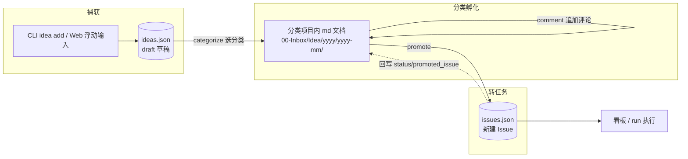
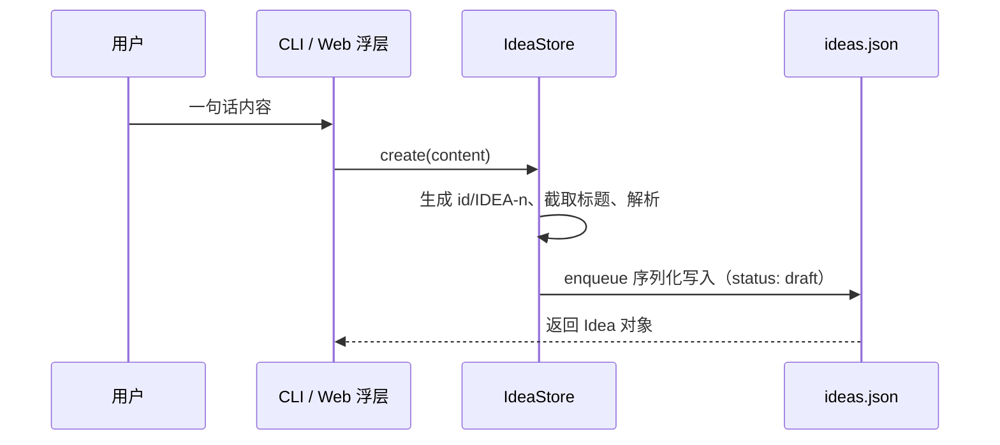
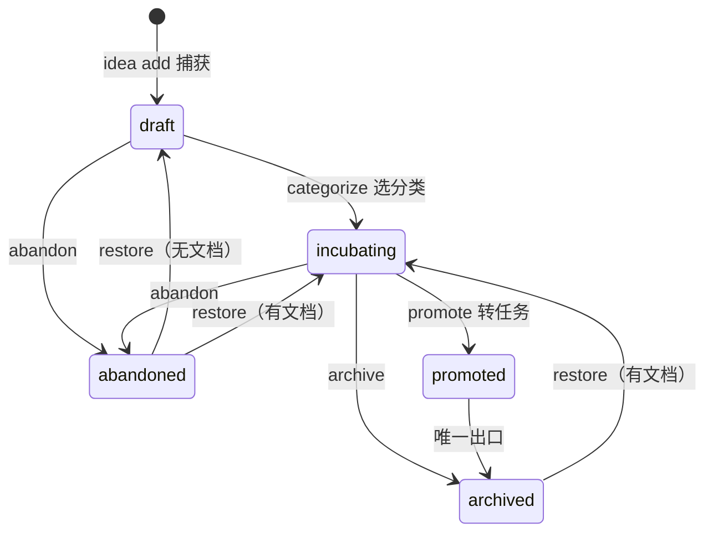
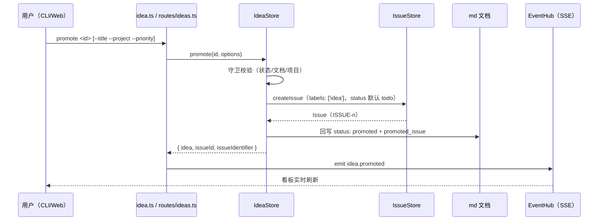

任何一个产品化的想法，最初都只是一句随手记下的话。super-cli 为这条"从灵感到任务"的路径设计了一条显式的三阶段管线：**捕获（capture）→ 分类孵化（categorize / incubating）→ 转任务（promote）**。本页聚焦这条管线的完整实现——两种存储载体（JSON 草稿与项目内 Markdown 文档）如何交接、状态机如何约束流转、promote 如何把想法"物化"为看板上的 Issue。Idea 的存储模型与状态枚举、Web 界面的整体组织分别在 [Issue 数据模型：JSON 持久化、状态、优先级与标签](12-issue-shu-ju-mo-xing-json-chi-jiu-hua-zhuang-tai-you-xian-ji-yu-biao-qian) 与 [React 应用架构：单页路由与视图组织](22-react-ying-yong-jia-gou-dan-ye-lu-you-yu-shi-tu-zu-zhi) 中有专门展开，本页只在管线交汇处引用它们。

Sources: [idea-store.ts](src/core/idea-store.ts#L210-L232) [prd-idea-task-agent.md](docs/prd-idea-task-agent.md#L10-L30)

## 一、管线全景：三个阶段、两种载体

设计文档把三个核心概念的边界讲得很清楚：**Idea 是未成形的工作线索**（不执行、无看板地位），**Task 承载实体就是现有 Issue**（有状态机、可绑定 Session），而 `Idea ──promote──▶ Task ──run──▶ Session` 是一条**单向转化链**——promote 后源 Idea 保留并回写任务引用，删除 Idea 不会级联删除 Task。Idea → Task 的转化管线正是这条链的前半段。



三个阶段的入口、存储载体与允许操作对比如下：

| 阶段 | 状态 | 存储载体 | 允许的操作 |
|---|---|---|---|
| 捕获 | `draft`（待分类） | 仅 `~/.super-cli/ideas.json` | 只能记录；不能评论、不能转任务 |
| 孵化 | `incubating` | 分类项目内 md 文档 | 可追加评论/修正；可 promote / 放弃 / 归档 |
| 转任务 | `promoted`（已转任务） | md 文档 + 关联 Issue | 只能归档；任务本身按 Issue 工作流流转 |

状态枚举与注释明确写道："draft: json-only, no category yet, nothing else allowed"、"incubating: categorized, backed by an md doc"、"promoted: turned into an Issue; the md doc is the task's requirement doc"——这三行注释就是管线的权威定义。

Sources: [prd-idea-task-agent.md](docs/prd-idea-task-agent.md#L14-L33) [types.ts](src/core/types.ts#L162-L176) [idea-store.ts](src/core/idea-store.ts#L211-L232)

## 二、阶段一：捕获——一句话落入 ideas.json

捕获的设计原则是**把摩擦降到最低，把决策推迟**：`IdeaStore.create()` 只接收一段自由文本，永远创建 `draft` 状态的草稿，"categorization is a separate step"（分类是独立的下一步）。标题不要求填写，由 `titleFromContent` 自动截取正文第一行前 60 个字符生成；正文中的 `#标签` 由 `parseHashTags` 用正则 `/#([^\s#]+)/g` 提取并去重后存入 `tags` 字段。



存储路径固定为 `~/.super-cli/ideas.json`（`getSuperCliIdeasPath()`），文件结构是 `{ version, nextIdeaNumber, ideas: Record<id, Idea> }`，编号 `IDEA-n` 由 `nextIdeaNumber` 递增分配。所有写操作都经过 `enqueue` 方法串入一条 Promise 链——这保证了单个进程内写操作的串行性，是比 Issue 的乐观锁（见 [乐观锁机制：version 字段与多 Agent 并发写安全](13-le-guan-suo-ji-zhi-version-zi-duan-yu-duo-agent-bing-fa-xie-an-quan)）更简单的单写者模型。入口有两个：CLI 的 `super-cli idea add "<content>"`，以及 Web 端全局悬浮的快速捕获按钮。

Sources: [idea-store.ts](src/core/idea-store.ts#L56-L98) [paths.ts](src/core/paths.ts#L49-L51) [idea.ts](src/cli/commands/idea.ts#L67-L79)

Web 端的捕获入口是一个挂载在应用根部的浮动按钮 `IdeaQuickCapture`："Global floating idea capture — one sentence, from anywhere"。它渲染一个三行文本框，支持 `⌘/Ctrl + Enter` 快捷保存，保存成功后调用 `createIdea({ content })` 打到 `POST /api/ideas`，并通过 `window.dispatchEvent(new CustomEvent('super-cli:idea-captured'))` 通知 Ideas 视图立即刷新列表——捕获完成后用户甚至不需要离开当前页面。

Sources: [App.tsx](src/web/src/App.tsx#L71-L85) [App.tsx](src/web/src/App.tsx#L1507) [client.ts](src/web/src/api/client.ts#L409)

## 三、阶段二：分类孵化——从 JSON 草稿到 Markdown 文档

分类是整条管线中最关键的**载体迁移**：`categorize(id, categoryKey)` 会为草稿生成一份 Markdown 文档，落盘到分类所属项目的目录里，然后**删除 JSON 草稿**。此后这份 md 文件就是想法的唯一权威载体（source of truth）。守卫条件很严格：只有 `draft` 状态（或遗留无状态条目）可以分类，其余一律抛出 `IdeaStateError('只有待分类的想法可以选择分类')`。

分类清单来自用户配置 `settings.ideaCategories`，每项要求包含 `key`、`label` 和一个以 `/` 开头的**绝对项目路径** `project`。值得注意的设计决策是：内置默认分类 `DEFAULT_IDEA_CATEGORIES` 是**空数组**——"category project paths are user-specific absolute paths, so ship none and require configuration first"，系统不会猜测你的项目路径。分类校验在 `categories()` 中逐字段进行，不合法的条目会被整体过滤。配置方式见 [用户配置系统与使用统计输出](28-yong-hu-pei-zhi-xi-tong-yu-shi-yong-tong-ji-shu-chu)。

Sources: [idea-store.ts](src/core/idea-store.ts#L41-L46) [idea-store.ts](src/core/idea-store.ts#L100-L116) [idea-store.ts](src/core/idea-store.ts#L234-L265)

md 文档有一套固定的版式约定，文件头注释完整定义了它：目录为 `<project>/00-Inbox/Idea/<year>/<year>-mm/`，文件名为 `<yyyymmdd>-<hhmm>-<id>.md`；内容依次是 YAML frontmatter（id / title / category / project / status / created / promoted_issue）、`# 标题`、`## 原始记录`（带时间戳引用块的原始内容，**永不修改**）、`## 评论与修正`（每个 `### <时间戳>` 小节一条评论）。"The file is the source of truth; super-cli and agents both edit it as long as the frontmatter + section layout below is preserved"——正因为版式是约定而非私有格式，人和 Agent 都可以直接编辑这些文件，super-cli 用 `parseIdeaDoc` 正则解析回去。

```markdown
---
id: a1b2c3d4
title: "想法标题"
category: web
project: /Users/alice/work/myproj
status: incubating
created: 2026-06-09T10:00:00.000Z
promoted_issue: ""
---
# 想法标题

## 原始记录

> 2026-06-09 10:00

原始一句话内容

## 评论与修正

### 2026-06-10 09:30

补充评论/修正内容
```

Sources: [idea-doc.ts](src/core/idea-doc.ts#L1-L19) [idea-doc.ts](src/core/idea-doc.ts#L56-L98) [idea-doc.ts](src/core/idea-doc.ts#L108-L159)

载体迁移带来几个值得注意的细节。其一，**标识符换血**：草稿阶段标识符是流水号 `IDEA-<n>`，分类时 `newIdeaId()` 生成 8 位随机 UUID 前缀作为新 id，文档型想法的标识符变为 `IDEA-<8位id>`——旧编号随之作废，编号计数器不回退。其二，**查询容错**：`get()` 支持精确 id、大小写不敏感的完整标识符、以及 id 前缀匹配三种方式。其三，**读取是扫描式的**：`scanIdeaDocs` 对每个分类项目的 `00-Inbox/Idea/` 目录做深度不超过 4 层的递归扫描，逐个 `readIdeaDoc` 解析后再 `docToIdea` 投影成统一的 `Idea` 对象——这意味着外部直接新建或修改 md 文件也会被纳入列表。

Sources: [idea-doc.ts](src/core/idea-doc.ts#L52-L54) [idea-doc.ts](src/core/idea-doc.ts#L166-L186) [idea-store.ts](src/core/idea-store.ts#L135-L151) [idea-store.ts](src/core/idea-store.ts#L197-L205)

孵化期的核心动作是**追加评论与修正**：`addComment` 把 `{ at: 精确到分钟的时间戳, body }` 追加到 md 文档的"评论与修正"区，原始记录区永远不动——这保留了"想法如何演进"的完整轨迹。守卫上，代码排除了 `draft`、`abandoned`、`archived` 三种状态（即孵化中与已转任务的想法技术上均可评论），错误文案"只有孵化中的想法可以评论（先分类；已放弃/归档的需先恢复）"针对的是最常见的场景。Web 详情面板对应提供了评论输入框，placeholder 同样强调"原始记录不变"。

Sources: [idea-store.ts](src/core/idea-store.ts#L267-L283) [IdeasView.tsx](src/web/src/components/IdeasView.tsx#L294-L306)

## 四、状态机：五种状态与守卫规则

Idea 的生命周期比 Issue 简单得多，但边界一样严格。`types.ts` 的注释明确了终态语义：`abandoned` 是"想做但外部条件不满足，可恢复"，`archived` 是"结束归档，不再流转"。完整的状态机如下：



状态流转的守卫集中在大约 30 行代码里，规则非常清晰：

| 当前状态 | 允许的转移 | 守卫来源 |
|---|---|---|
| `draft` | → incubating（categorize）/ abandoned | categorize 校验"只有待分类的想法可以选择分类" |
| `incubating` | → promoted / abandoned / archived | promote 要求非 draft 且非 promoted、文档存在、有归属项目 |
| `promoted` | → archived（唯一出口） | "已转任务的想法只能归档" |
| `abandoned` / `archived` | → 恢复 | restore 时按是否有 docPath 决定回到 incubating 或 draft |

CLI 的 `restore` 命令实现体现了"载体决定去向"：先 `get(id)` 查看想法是否文档化，`setStatus(id, i.docPath ? 'incubating' : 'draft')`——有 md 文档的回孵化中，纯 JSON 的回待分类。Web 端按钮文案"恢复到孵化中 / 到待分类"直接复刻了这一判断。另外 `list()` 中还有一段**遗留数据迁移**逻辑：旧版 JSON 条目没有 status 字段，读取时按 `promotedIssueId`/`archivedAt` 是否存在回推出 promoted/abandoned/draft，保证升级平滑。

Sources: [types.ts](src/core/types.ts#L162-L169) [idea-store.ts](src/core/idea-store.ts#L285-L306) [idea-store.ts](src/core/idea-store.ts#L170-L195) [idea.ts](src/cli/commands/idea.ts#L176-L187) [IdeasView.tsx](src/web/src/components/IdeasView.tsx#L358-L362)

## 五、阶段三：promote——想法成熟为正式任务

promote 是管线的终点，也是与 Issue 体系的交汇点。一次 promote 调用做四件事：**校验守卫**（draft 必须先分类、已 promoted 拒绝重复转化、归属项目必须存在——默认回落到分类项目）；**组装描述**（把想法的溯源信息、原始记录与全部评论拼成 Issue 的 description）；**创建 Issue**；**回写 md 文档**（status 置为 promoted，promoted_issue 字段写入任务 id）。



描述组装的溯源设计尤其值得注意：description 的开头是两行引用块——`> 来源：想法 IDEA-xxx（日期）` 和 `> 原始需求文档：<md 绝对路径>`，随后是原始内容，若有评论则以"## 评论与修正"小节逐条列出。也就是说，**md 文档从转化那一刻起就正式成为任务的"原始需求文档"**，任务描述里保留了双向可达的引用。创建出的 Issue 默认状态为 `todo`（`createIssue` 中 `input.status ?? 'todo'`），带 `idea` 标签，优先级可由 `--priority` 指定。

Sources: [idea-store.ts](src/core/idea-store.ts#L308-L344) [issue-store.ts](src/core/issue-store.ts#L147-L175)

promote 之后的关联是**读取时联表**而非写时冗余：`joinIssueStatus` 在每次 `list()` 时遍历有 `promotedIssueId` 的想法，从 IssueStore 实时拉取任务的 status / identifier / title / project 挂到 Idea 对象上，任务被删除或不可读时静默跳过。这保证了 Idea 列表上展示的任务状态永远与看板同步（Web 卡片上那个 `ISSUE-12·进行中` 徽标就是它渲染的）。而 serve 模式下有一个关键的装配细节：`server/index.ts` 中 `new IdeaStore(undefined, issueStore)` 复用了**同一个 IssueStore 实例**，promote 产出的任务与看板 API 读到的是同一份数据。

Sources: [idea-store.ts](src/core/idea-store.ts#L153-L168) [server/index.ts](src/server/index.ts#L33-L47)

转化完成的信号通过 SSE 广播：promote 路由在成功后 `hub.emit('idea.promoted', { ideaId, issueId, issueIdentifier })`，事件类型联合中还预留了 `idea.created / idea.updated / idea.archived / idea.restored / idea.deleted` 等类型。事件机制的底层设计（EventHub、客户端集合、keep-alive）在 [SSE 实时事件推送：EventHub 设计与事件类型](16-sse-shi-shi-shi-jian-tui-song-eventhub-she-ji-yu-shi-jian-lei-xing) 中专门分析，此处只需知道：**promote 的完成是全端可感知的**——CLI 用户转完任务，正开着看板的浏览器会立刻看到新卡片出现。

Sources: [ideas.ts](src/server/routes/ideas.ts#L122-L141) [events.ts](src/server/events.ts#L14-L19)

## 六、双入口对照：CLI 命令与 REST API

管线的每个动作都有 CLI 与 REST 两套等价入口，Web 端完全消费 REST API。命令注册在 `registerIdeaCommands` 中，与 idea 子命令一一对应：

| CLI 命令 | REST 端点 | 管线动作 |
|---|---|---|
| `idea add <content>` | `POST /api/ideas` | 捕获，创建 draft |
| `idea categories` | `GET /api/ideas/categories` | 列出可用分类 |
| `idea categorize <id> <category>` | `POST /api/ideas/:id/categorize` | 分类，草稿 → md 文档 |
| `idea comment <id> <body>` | `POST /api/ideas/:id/comments` | 追加评论/修正 |
| `idea promote <id> [--title --project --priority]` | `POST /api/ideas/:id/promote` | 转任务 |
| `idea abandon / archive / restore <id>` | `POST /api/ideas/:id/abandon` 等 | 终态流转与恢复 |
| `idea list [--status --category --project]` | `GET /api/ideas`（另支持 since/until） | 过滤查询 |
| `idea show <id>` | `GET /api/ideas/:id` | 详情（含评论与任务链接） |

两套入口共享同一个 `IdeaStore`，错误语义也统一映射：`IdeaNotFoundError` 在 CLI 输出 `{ error: { code: 'IDEA_NOT_FOUND', ... } }` 并退出码 1，在 REST 中映射为 HTTP 404；`IdeaStateError` 对应 400。CLI 的列表输出是一张 `ID / Status / Category / Title / Comments / Task / Created` 表格，其中 Task 列直接渲染联表得到的 `promotedIssueIdentifier`，Status 列使用中文标签（待分类 / 孵化中 / 已转任务 / 已放弃 / 已归档）。

Sources: [idea.ts](src/cli/commands/idea.ts#L46-L105) [idea.ts](src/cli/commands/idea.ts#L143-L199) [ideas.ts](src/server/routes/ideas.ts#L25-L120) [idea.ts](src/cli/commands/idea.ts#L8-L22)

Web 端的 Ideas 视图则是按状态组织的**五列看板**：`STATUS_ORDER` 定义列为待分类 / 孵化中 / 已转任务 / 已放弃 / 已归档，前端把拉取到的想法按 `status` 分桶渲染。详情面板是管线的交互化演绎：draft 状态显示"选择分类后才能评论、完善或转为任务"加一排分类按钮；incubating 状态显示评论输入框与"转为任务 →"按钮；promote 表单支持改标题、用项目检索选择器重选归属项目（并保证分类项目始终在候选中）；promoted 状态则渲染一个可点击跳转看板任务的横幅。整个视图**不跟随侧边栏的项目选择**，用页内自己的分类/项目/时间筛选器——想法是跨项目的全局流。

Sources: [IdeasView.tsx](src/web/src/components/IdeasView.tsx#L73-L101) [IdeasView.tsx](src/web/src/components/IdeasView.tsx#L276-L365) [IdeasView.tsx](src/web/src/components/IdeasView.tsx#L124-L145)

## 七、实现与 PRD 的演进差异

对照设计文档可以发现，实现相对 PRD 草案发生了几处有意味的演进，理解它们有助于避免按旧文档使用 API：

| 维度 | PRD 草案（§3） | 实际实现 |
|---|---|---|
| 存储模型 | 仅 `~/.super-cli/ideas.json` 单文件 | 双载体：JSON 草稿 + 分类项目内 md 文档（文件即真相） |
| 命令集 | `edit` / `delete` / `promote --agent` | 以 `comment`（修正进评论）+ `abandon` / `restore` / `archive` 替代；promote 不含 `--agent` |
| promote 默认任务状态 | backlog | `todo`（IssueStore 默认值） |
| 想法身份 | `IDEA-n` 递增编号 | 分类前 `IDEA-<n>`，分类后 `IDEA-<8位id>`（前缀匹配兼容） |

其中最核心的演进是引入 md 文档作为孵化期载体——这让想法在转任务之前就可以被人和 Agent 以纯文本方式协作完善，而"原始记录不可变 + 评论追加"的版式约定保证了这条演化轨迹可审计。PRD 同时明确划出了本期边界："Idea 的 AI 讨论式转化"被列入"明确不做"，自动调度同样不在范围内——promote 之后任务如何被执行（`issue run` 无头执行、AgentProfile 选型）属于 [无头执行管线：TaskRunner 从 spawn 到会话自动绑定](19-wu-tou-zhi-xing-guan-xian-taskrunner-cong-spawn-dao-hui-hua-zi-dong-bang-ding) 与 [AgentProfile：统一的 Agent 启动配置实体](18-agentprofile-tong-de-agent-qi-dong-pei-zhi-shi-ti) 的领域。

Sources: [prd-idea-task-agent.md](docs/prd-idea-task-agent.md#L130-L165) [prd-idea-task-agent.md](docs/prd-idea-task-agent.md#L232-L241) [idea.ts](src/cli/commands/idea.ts#L143-L162)

## 小结与阅读路径

回到全景：super-cli 用"**捕获时零决策、分类时定归属、promote 时建任务**"的三段式，把想法管理中最容易失衡的两件事——记录的摩擦与任务化前的混沌——分别关进了最小阶段。JSON 草稿负责快，md 文档负责沉淀与协作，promote 则以一次原子化的四步操作完成载体交接，并用读取时联表和 SSE 事件保证后续一切状态同步。如果你想继续深入，建议按以下顺序：先看 [Issue 数据模型：JSON 持久化、状态、优先级与标签](12-issue-shu-ju-mo-xing-json-chi-jiu-hua-zhuang-tai-you-xian-ji-yu-biao-qian) 理解 promote 产出的任务实体，再看 [Issue 状态机与 Agent 工作流纪律（claim / move / comment）](14-issue-zhuang-tai-ji-yu-agent-gong-zuo-liu-ji-lu-claim-move-comment) 了解任务被创建后的流转纪律，最后进入 [无头执行管线：TaskRunner 从 spawn 到会话自动绑定](19-wu-tou-zhi-xing-guan-xian-taskrunner-cong-spawn-dao-hui-hua-zi-dong-bang-ding) 看任务如何真正跑起来；Web 侧的五列看板与交互细节可延伸阅读 [看板 / 卡片 / 列表三视图实现与拖拽交互](23-kan-ban-qia-pian-lie-biao-san-shi-tu-shi-xian-yu-tuo-zhuai-jiao-hu)。