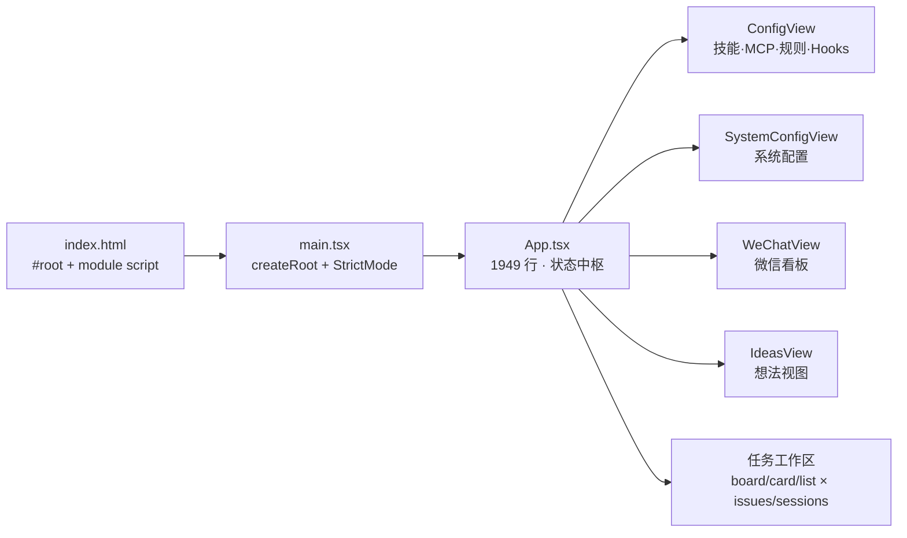
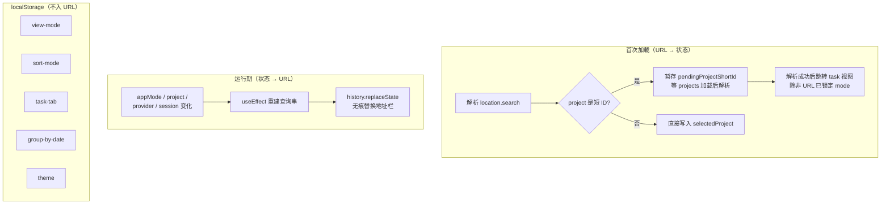
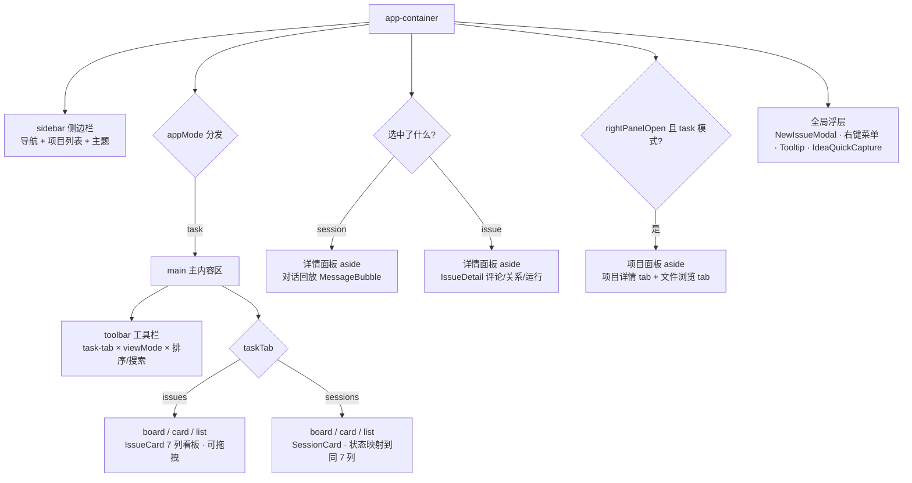

super-cli 的 Web 看板是一个不依赖任何路由库的 React 19 单页应用。本文剖析它的真实"路由"实现——基于 URL 查询参数的上下文同步机制，以及在这个机制之上组织的五大视图模式、任务工作区和多层详情面板。阅读本文后，你将理解为什么整个前端的"页面切换"只是几行 `useState` 初始化与一个 `useEffect`，以及 7000 余行前端代码是如何分层的。

## 应用骨架：从 index.html 到 App 的启动链

前端的入口链非常短。Vite 以 `src/web/index.html` 为根，页面只包含一个 `#root` 挂载点和一个指向 `src/main.tsx` 的 module script。`main.tsx` 全文仅 11 行：用 `ReactDOM.createRoot` 挂载 `<App />`，并包一层 `React.StrictMode`——没有 Provider、没有 Router、没有全局 Store，所有后续架构决策都在 `App.tsx` 内部完成。

查看根目录 `package.json` 的依赖清单可以确认一个关键事实：依赖里只有 `fastify`、`prismjs`、`marked` 等后端/工具库，`react` 与 `react-dom`（^19.1.0）位于 devDependencies，**不存在 react-router 或任何路由库**。这个看板完全运行在本地 Fastify 服务之上，属于"工具型单页应用"——它的导航复杂度不足以支撑引入路由库的成本。

Sources: [index.html](src/web/index.html#L12-L14), [main.tsx](src/web/src/main.tsx#L1-L11), [package.json](package.json#L71-L76)

## 手工路由：URL 查询参数承载可分享上下文

没有路由库，那么"路由"由什么实现？答案是 `App` 组件里的一组惰性初始化 `useState` 和一个反向同步的 `useEffect`。`App.tsx` 的源码注释明确写出了设计原则：**"URL 只保存可分享的上下文（mode / project / provider / session）；视图偏好（view / sort / tab / group）保存在 localStorage 里。"** 这是一条清晰的职责分界线。

应用启动时，四个状态直接从 `window.location.search` 解析：`appMode` 从 `?mode=` 读取并做白名单校验（非法值回落到 `'ideas'`）；`selectedProviders` 从 `?provider=` 按逗号拆分成数组；`selectedProject` 从 `?project=` 读取，但会先用正则 `/^p\d+$/` 判断是否为短 ID——短 ID 不能直接使用，要暂存进 `pendingProjectShortId` 这个 ref，等项目列表异步加载完成后（`useEffect` 监听 `projects`）再解析成真实路径；`initialSessionId` 则暂存 `?session=`，等会话列表就绪后自动选中并打开详情。

| URL 参数 | 对应状态 | 解析时机 | 特殊处理 |
| --- | --- | --- | --- |
| `?mode=` | `appMode`（五选一） | 组件初始化 | 白名单校验，非法值回落 `ideas` |
| `?project=` | `selectedProject` | 组件初始化 + 列表加载后 | 短 ID（`p3`）延迟解析，避免泄露完整文件路径 |
| `?provider=` | `selectedProviders` | 组件初始化 | 逗号分隔多值 |
| `?session=` | `selectedSession` | 会话列表加载后 | 深链恢复，用 `useRef` 防止重复消费 |

反过来，任何状态变化都会触发一个同步 `useEffect`：把 `mode`、`project`（优先写回短 ID）、`provider`、`session` 重新拼成查询串，调用 `window.history.replaceState` 原地替换 URL——不产生历史记录，也不触发 popstate，因为应用的导航本质上是单向的"状态 → URL"投影，而非"URL → 状态"的路由解析。`initialModeInUrl` 这个 ref 记录了首屏是否带 `?mode=`，用于防止短 ID 项目解析时覆盖用户显式指定的视图。

值得注意的是，与 URL 同期的还有一组 `localStorage` 持久化 `useEffect`：`view-mode`、`sort-mode`、`task-tab`、`group-by-date` 以及主题。用户下次打开看板时，工具栏偏好原样恢复，而分享出去的链接只会还原"在看哪个项目、哪个会话"这类协作上下文。

Sources: [App.tsx](src/web/src/App.tsx#L228-L244), [App.tsx](src/web/src/App.tsx#L247-L252), [App.tsx](src/web/src/App.tsx#L125-L149), [App.tsx](src/web/src/App.tsx#L254-L265)

## 五大视图模式与侧边栏导航组织

`appMode` 是一个五值联合类型：`'ideas' | 'task' | 'inspiration' | 'config' | 'system'`，它是整个应用的顶级"路由状态"。`App` 的 JSX 返回值最外层是 `app-container`，内部由两大部分组成：常驻的左侧 `sidebar`，以及一个根据 `appMode` 做三元链式分发的主体区域。

侧边栏分三段。顶部的 `sidebar-nav` 是应用导航：两个平级入口"想法"和"任务"，以及两个可折叠分组——"灵感"分组下挂"个人微信看板"，"管理库"分组下挂"技能·权限·连接器"与"系统配置"两个子项。分组折叠状态由 `collapsedNav`（一个 `Set<string>`）管理，默认全部折叠，但源码注释指出了交互规则：**当前激活模式所在分组始终强制展开**，这是通过渲染条件 `!(collapsedNav.has(...) && appMode !== ...)` 实现的。中段是项目列表，支持模糊搜索、按时间/数量排序切换、置顶/全部/归档三段分区和增量展开（`allLimit` / `archivedLimit` 每次 +10）；底部的 `sidebar-footer` 则是三态主题切换器（亮色/暗色/深色）。

| `appMode` | 渲染内容 | 承载组件 |
| --- | --- | --- |
| `ideas` | `main` 工具栏 + 想法流 | `IdeasView`（可跳转任务） |
| `task` | 工具栏 + issues/sessions 双标签 + 详情面板 | App 内联 + `IssueDetail` 等 |
| `inspiration` | 全宽视图（自带工具栏） | `WeChatView` |
| `config` | 全宽视图（自带工具栏） | `ConfigView` |
| `system` | 全宽视图（自带工具栏） | `SystemConfigView` |

一个显著的结构性差异是：`task` 与 `ideas` 模式共享 App 渲染的侧边栏和项目列表，而 `config`、`system`、`inspiration` 三个模式直接替换主体区域为全宽组件——这些组件接收 `onToggleSidebar` 回调，内部自行渲染工具栏。也就是说，**"项目上下文"只属于想法与任务两个模式**，配置类视图是独立的全屏页面。

Sources: [App.tsx](src/web/src/App.tsx#L710-L778), [App.tsx](src/web/src/App.tsx#L930-L941), [App.tsx](src/web/src/App.tsx#L124-L128)

## 任务工作区：双标签、三视图与右侧面板的三层堆叠

任务模式是整个应用信息密度最高的区域，其结构可以概括为"一个工具栏 + 两组内容切换 + 最多三个水平面板"。工具栏中，`task-tab` 首先区分**任务**与**会话**两个数据域（各自带实时计数）；随后是一排与两个标签共享的控件——Provider 多选下拉（多 Provider 时才显示，选中项以彩色 chip 呈现）、强制刷新按钮、客户端搜索框、排序下拉、按日期分组开关，以及 board/card/list 三视图切换按钮组。

内容区的切换逻辑是一个三层嵌套三元表达式：先按 `taskTab` 分流，再按 `viewMode` 分流。`issues` 标签下，board 视图遍历 `ISSUE_COLUMNS` 的 7 个状态列（需求池/待办/进行中/待复查/阻塞/已完成/已取消），列内卡片挂接原生 HTML5 拖拽事件；`sessions` 标签下复用同一组列布局，但通过 `sessionColumn` 把会话的 5 态状态映射到 7 列看板上（`sessionStatusToColumn` 定义在 constants.ts）。卡片视图与列表视图则分别使用 `SessionCard`/`IssueCard` 与 `SessionListItem`/`IssueListItem` 这两组成对组件，保证两个数据域在三视图中呈现一致的视觉语言。

详情层最精巧的设计是**面板复用与互斥**：右侧详情面板（`detail-panel`）由 `selectedSession` 与 `selectedIssueId` 两个状态驱动，二者互斥——`selectSession` 会清空 `selectedIssueId`，`selectIssue` 会清空 `selectedSession`。两个状态共享同一个可拖拽宽度 `detailWidth`（通过 `detail-resize-handle` 调整），会话详情负责对话回放（`fetchSessionMessages` 单次拉取 200 条，`MessageBubble` 渲染并提供最早/最新跳转），任务详情则整体委托给独立的 `IssueDetail` 组件，并通过 `refreshKey` 计数器接收 SSE 触发的强制刷新。最右侧还有第三层：`project-panel` 仅在任务模式且手动开启时出现，提供"项目详情 + 文件浏览"两个 tab（文件浏览由内联的 `FileBrowser` 组件承担），宽度同样独立可拖拽。

Sources: [App.tsx](src/web/src/App.tsx#L964-L1105), [App.tsx](src/web/src/App.tsx#L1111-L1262), [App.tsx](src/web/src/App.tsx#L1265-L1359), [App.tsx](src/web/src/App.tsx#L1361-L1443), [constants.ts](src/web/src/constants.ts#L25-L52)

## 状态中枢：App 单体与组件的职责切分

`App.tsx` 共 1948 行，是典型有意的"状态中枢单体"：全应用约 30 个 `useState` 集中在 `App` 函数体内，没有任何 Context 或状态库。数据流方向非常单一——`App` 持有共享上下文（projects、sessions、issues、providers、当前选中项），通过 props 下发给子视图；而五个模式级组件（`ConfigView` 1128 行、`WeChatView` 637 行、`SystemConfigView` 368 行、`IdeasView` 371 行、`IssueDetail` 668 行）各自直接调用 `api/client.ts` 获取自己领域的数据，只把"会影响全局的动作"通过回调上抛。例如 `IdeasView` 的 `onOpenIssue` 回调会借助 `pendingIssueRef` 跨模式跳转：切换到任务标签、切换项目，等任务列表加载完成后精准选中目标 issue。

`App.tsx` 内部还藏着一批不导出的展示组件与工具函数：`SessionCard` / `SessionListItem` / `IssueListItem` / `MetaItem` / `MessageBubble` / `DateGroupSection` 这些卡片与列表原子组件，`groupIssuesByDate` / `groupSessionsByDate` 的"今天/昨天/周X/更早"日期分组，以及完整的 `FileBrowser` 文件树（含 Prism 语法高亮与 Markdown 渲染管线）和十余个内联 SVG 图标。整个文件只有 `export default App` 一个出口，未使用的工具函数（如 `fuzzyMatch` 项目搜索）也内聚其中。

| 文件 | 行数 | 职责 |
| --- | --- | --- |
| `src/App.tsx` | 1948 | 状态中枢 + 任务工作区 + 手工路由 + 内联卡片组件 |
| `src/ConfigView.tsx` | 1128 | 技能 / MCP / 规则 / Hooks / 权限 / Agents 六个配置 tab |
| `src/components/IssueDetail.tsx` | 668 | 任务详情：评论、关系、Agent 运行记录 |
| `src/components/WeChatView.tsx` | 637 | 微信时间线看板与日报 |
| `src/components/IdeasView.tsx` | 371 | 想法流：分类、评论、promote 转任务 |
| `src/components/SystemConfigView.tsx` | 368 | 终端选择、数据文件管理、项目置顶归档 |
| `src/api/client.ts` | 689 | 约 70 个 `fetch` 薄封装 + `ApiError` |
| `src/index.css` | 4564 | 全部样式，`data-theme` 三主题 CSS 变量 |

Sources: [App.tsx](src/web/src/App.tsx#L120-L160), [App.tsx](src/web/src/App.tsx#L1512-L1701), [ConfigView.tsx](src/web/src/ConfigView.tsx#L1-L15), [IdeasView.tsx](src/web/src/components/IdeasView.tsx#L2-L11)

## 数据层契约：API 客户端与镜像类型

前端与 Fastify 服务之间的契约由两个文件锚定。`api/client.ts` 按 Session / Issue / Idea / Agent / 系统 / 微信六个领域导出约 70 个函数，全部是 `fetch` 的薄封装，统一挂到 `/api` 前缀下。早期函数直接 `return res.json()`，而 Issue 域引入了更严格的错误协议：`jsonOrThrow` 在响应非 2xx 时抛出携带 HTTP 状态码与服务端错误码的 `ApiError`（例如 409 对应 `VERSION_CONFLICT`）。这个设计直接支撑了看板的并发安全——`handleDropIssue` 拖拽移动任务时携带 `version` 字段发起请求，捕获到 `status === 409` 的 `ApiError` 就提示用户并全量刷新看板，与后端的乐观锁机制形成闭环。

类型契约则由 `types.ts` 承担，首行注释说明了它的存在理由：**"Issue 类型镜像 src/core/types.ts（web 无法直接 import core）"**。由于 Web 产物由 Vite 独立构建、无法复用 tsup 打包的后端模块，前端手工维护了一份镜像类型：8 个 `CliProvider` 字面量、`SessionItem`、`Issue`/`IssueSummary`、`Idea`、`AgentProfile`、`IssueRun`/`IssueActivity` 等。`constants.ts` 在这些类型之上定义了 UI 语义：8 家 Provider 的专属色值与两字母徽标、7 个看板列的标签与颜色、4 级优先级元信息，以及会话状态到看板列的映射函数。这些常量是视图层唯一的"魔法数字来源"，保证所有视图中同一 Provider、同一状态永远呈现同一颜色。

Sources: [client.ts](src/web/src/api/client.ts#L247-L272), [types.ts](src/web/src/types.ts#L1-L3), [constants.ts](src/web/src/constants.ts#L3-L24), [App.tsx](src/web/src/App.tsx#L444-L461)

## 遗留脚手架：pages/ 目录为何不存在于运行时

`src/web/src/pages/` 下有五个文件——`Dashboard.tsx`、`Sessions.tsx`、`SessionDetail.tsx`、`Search.tsx`、`Tasks.tsx`，从命名看像是一套经典的多页路由结构。但对全目录做引用检索可以发现：**没有任何文件 import 它们**，`src/web/src/hooks/` 目录也是空的。这些文件是早期脚手架的遗迹——`Dashboard.tsx` 接收 `onNavigate` 回调并调用 `fetchStats` 接口，类名是 Tailwind 风格（`text-gray-400`、`grid-cols-4`），与现存应用的手写语义化 CSS（`app-container`、`session-card`）风格迥异。

这段死代码对运行时是无害的：Vite 只打包从入口可达的模块图，`pages/` 不可达，因此不会进入 `dist/web` 产物。但它有认知成本——初读目录结构时容易误以为存在多页路由。真实情况是：本文所述的查询参数路由就是全部导航机制，且它已在实际演化中吸收了脚手架原本规划的"会话详情页"（右侧面板）与"任务页"（任务标签）职责。若要清理，直接删除 `pages/` 与空的 `hooks/` 目录即可，无需任何代码改动。

Sources: [Dashboard.tsx](src/web/src/pages/Dashboard.tsx#L1-L10)

## 与下一章的衔接

本文覆盖了"骨架层"：启动链、查询参数路由、模式分发与面板堆叠。在此之上还有四个专题值得深入：三视图的拖拽与排序细节见[看板 / 卡片 / 列表三视图实现与拖拽交互](23-kan-ban-qia-pian-lie-biao-san-shi-tu-shi-xian-yu-tuo-zhuai-jiao-hu)；`App.tsx` 中订阅 13 种事件、300ms 防抖刷新看板的 `EventSource` 管线在[前端实时同步：消费 SSE 事件流更新看板](24-qian-duan-shi-shi-tong-bu-xiao-fei-sse-shi-jian-liu-geng-xin-kan-ban)展开；`FileBrowser` 的按需加载与高亮实现在[项目文件浏览器：按需加载、语法高亮与 Markdown 渲染](25-xiang-mu-wen-jian-liu-lan-qi-an-xu-jia-zai-yu-fa-gao-liang-yu-markdown-xuan-ran)；`data-theme` 三主题的变量体系与全局 UI 规范见[多主题系统与全局 UI 体系](26-duo-zhu-ti-xi-tong-yu-quan-ju-ui-ti-xi)。若想回顾前端在整个系统中的位置（静态资源由 Fastify `@fastify/static` 托管、`/api` 反代），可回到[三层架构：CLI、Fastify 服务与 React 前端如何协作](6-san-ceng-jia-gou-cli-fastify-fu-wu-yu-react-qian-duan-ru-he-xie-zuo)。