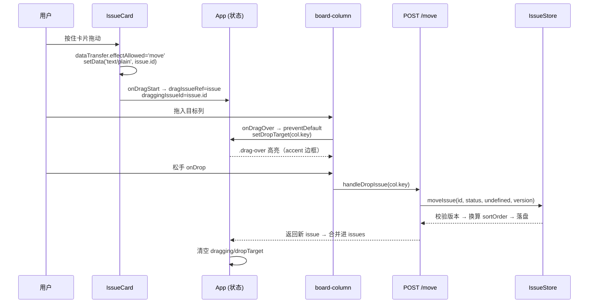

super-cli 的任务视图在同一个数据集（Issue 列表）之上提供了三种渲染形态：**看板**（board，按状态分列）、**卡片**（card，网格平铺）、**列表**（list，单行紧凑）。本文聚焦前端 `src/web` 中三视图的切换机制、看板列的渲染设计、基于原生 HTML5 Drag & Drop 的跨列拖拽全链路（从前端事件流到服务端乐观锁落库），以及视图偏好与过滤排序的实现细节。React 应用整体架构与路由组织见 [React 应用架构：单页路由与视图组织](22-react-ying-yong-jia-gou-dan-ye-lu-you-yu-shi-tu-zu-zhi)，数据模型与并发机制分别见 [Issue 数据模型：JSON 持久化、状态、优先级与标签](12-issue-shu-ju-mo-xing-json-chi-jiu-hua-zhuang-tai-you-xian-ji-yu-biao-qian) 与 [乐观锁机制：version 字段与多 Agent 并发写安全](13-le-guan-suo-ji-zhi-version-zi-duan-yu-duo-agent-bing-fa-xie-an-quan)。

## 三视图的状态模型与切换机制

视图切换由一个三值联合类型 `ViewMode = 'board' | 'card' | 'list'` 驱动，状态初始化时从 `localStorage` 的 `view-mode` 键恢复，缺省落到 `'board'`。顶部工具栏中渲染了一组 `view-toggle` 按钮组，每个按钮以 SVG 图标 + `title` 提示对应一种视图，激活项通过 `active` class 高亮；与 `sortMode`、`taskTab`、`groupByDate` 一起，四项视图偏好统一在一个 `useEffect` 中写回 `localStorage`，实现刷新后偏好留存。

Sources: [App.tsx](src/web/src/App.tsx#L34)、[App.tsx](src/web/src/App.tsx#L164)、[App.tsx](src/web/src/App.tsx#L1086-L1096)、[App.tsx](src/web/src/App.tsx#L246-L252)

值得注意的架构决策是：**视图与数据域是两个正交维度**。`taskTab` 决定渲染 Issue（任务）还是 Session（会话），`viewMode` 决定渲染形态，二者组合出六种呈现。三视图在两个数据域下复用同一套 CSS 容器类（`board` / `card-grid` / `list-view`），但组件选择不同——Issue 域用 `IssueCard`/`IssueListItem`，Session 域用 `SessionCard`/`SessionListItem`：

| 组合 | 看板 | 卡片 | 列表 |
|---|---|---|---|
| Issue 任务 | 七列看板 + 胶囊列头，**支持拖拽** | 网格 + 可选日期分组，无拖拽 | 单行紧凑列表 |
| Session 会话 | 七列看板 + 简版列头，无拖拽 | 网格平铺 | 单行列表 |

Sources: [App.tsx](src/web/src/App.tsx#L1110-L1193)、[App.tsx](src/web/src/App.tsx#L1194-L1261)

## 看板视图：七列渲染与列头设计

看板的列集合由 `ISSUE_COLUMNS` 常量静态定义：需求池、待办、进行中、待复查、阻塞、已完成、已取消，每列携带语义化颜色。渲染时对每个列 key 过滤 `filteredIssues`，并按 `sortOrder` 升序排定列内顺序——列内排序的权威来源是数据字段而非 DOM 顺序。布局上，`.board` 是横向可滚动的 flex 容器，每列 `.board-column` 最小宽度 240px、纵向 flex 且卡片区独立滚动；窄屏媒体查询将列改为纵向堆叠占满宽度。

Sources: [constants.ts](src/web/src/constants.ts#L25-L33)、[App.tsx](src/web/src/App.tsx#L1112-L1116)、[index.css](src/web/src/index.css#L1233-L1251)、[index.css](src/web/src/index.css#L2721-L2728)

列头组件 `BoardColumnHeader` 采用"胶囊"设计：以 CSS 自定义属性 `--col` 注入列色，背景用 `color-mix(in srgb, var(--col) 12%, transparent)` 派生淡色底，内含每状态专属的 feather 风格线性图标、列名、计数徽标和一个"+"按钮——点击后将 `newIssueInitialStatus` 设为该列状态并弹出 `NewIssueModal`，即"在指定列新建 Issue"的入口。

Sources: [BoardColumnHeader.tsx](src/web/src/components/BoardColumnHeader.tsx#L53-L78)、[App.tsx](src/web/src/App.tsx#L1132-L1138)、[index.css](src/web/src/index.css#L1253-L1311)

## 拖拽交互全链路：从 dragstart 到 move 接口

拖拽采用**原生 HTML5 Drag & Drop API**，未引入任何第三方 DnD 库。实现围绕三个前端状态展开：`dragIssueRef`（`useRef` 持有被拖 Issue 的完整引用，跨事件回调可变且不触发重渲）、`draggingIssueId`（驱动被拖卡片的半透明样式）、`dropTarget`（驱动目标列的高亮）。完整链路如下：

Sources: [IssueCard.tsx](src/web/src/components/IssueCard.tsx#L36-L45)、[App.tsx](src/web/src/App.tsx#L156-L159)、[App.tsx](src/web/src/App.tsx#L1118-L1130)

两个细节保证了交互的健壮性。其一，`onDragOver` 中先检查 `dragIssueRef.current` 存在才调用 `preventDefault`，这意味着只有"自家卡片"发起的拖拽才会让列成为合法 drop 目标，外部拖入的文件或文本不会误触发。其二，`handleDropIssue` 在发起请求前就同步清空全部拖拽状态，若目标状态与当前相同则直接短路返回（不发请求）；请求成功后将服务端返回的最新 issue 对象（含新 `version` 与 `sortOrder`）合并回本地 `issues` 数组，避免二次拉取。

Sources: [App.tsx](src/web/src/App.tsx#L1121-L1126)、[App.tsx](src/web/src/App.tsx#L444-L461)

样式反馈通过三个 CSS 类闭环：拖拽中的 `.issue-card.dragging` 以 `opacity: 0.5` + `cursor: grabbing` + 大阴影表达"离位"；悬停目标列 `.board-column.drag-over` 以 accent 色内描边高亮；卡片本身常态即 `cursor: grab`，暗示可拖性。而**卡片视图与列表视图中拖拽被显式禁用**——`IssueCard` 复用于 card 视图时传入空的 `onDragStart`/`onDragEnd` 回调且 `isDragging` 恒为 `false`，列表项 `IssueListItem` 则根本不设置 `draggable`，拖拽是看板视图的专属能力。

Sources: [index.css](src/web/src/index.css#L2801-L2831)、[App.tsx](src/web/src/App.tsx#L1166-L1176)

## 服务端 move：乐观锁与排序分配

拖放的落库走 `POST /api/issues/:id/move`，请求体必须包含 `{ status, version }`（`sortOrder` 可选）。API 客户端 `moveIssue` 将本地卡片上读取的 `issue.version` 一并提交；服务端路由校验字段后委托 `issueStore.moveIssue`，后者先 `assertVersion` 做乐观锁校验——若其他 Agent 已在此期间写过该 Issue，将抛出 409，前端捕获 `ApiError` 后提示"数据已被修改"并全量刷新 `loadIssues()` 拉取权威状态。这正是 [乐观锁机制：version 字段与多 Agent 并发写安全](13-le-guan-suo-ji-zhi-version-zi-duan-yu-duo-agent-bing-fa-xie-an-quan) 在拖拽场景下的具体体现。

Sources: [client.ts](src/web/src/api/client.ts#L308-L314)、[routes/issues.ts](src/server/routes/issues.ts#L125-L139)、[App.tsx](src/web/src/App.tsx#L453-L460)

排序分配的策略体现了"拖到哪列就排在列顶"的语义：跨列移动时若未显式传 `sortOrder`，存储层调用 `nextSortOrder` 取目标列最小 `sortOrder` 减 1000，新卡片天然置顶且为后续插入留出数值空间；同列内若传入了不同的 `sortOrder` 则仅更新排序。所有变更（status 与 sortOrder 的 from/to）写入活动流，随后路由向 EventHub 发出 `issue.moved` SSE 事件，其他打开看板的客户端经 300ms 防抖合并刷新后同步这一移动——实时推送的设计详见 [SSE 实时事件推送：EventHub 设计与事件类型](16-sse-shi-shi-shi-jian-tui-song-eventhub-she-ji-yu-shi-jian-lei-xing)。

Sources: [issue-store.ts](src/core/issue-store.ts#L210-L230)、[issue-store.ts](src/core/issue-store.ts#L179)、[routes/issues.ts](src/server/routes/issues.ts#L134)

## 卡片视图：日期分组与 display: contents 技巧

卡片视图用 CSS Grid 布局：`grid-template-columns: repeat(auto-fill, minmax(280px, 1fr))` 自动按容器宽度决定列数。当排序为时间序（升/降）且用户开启"按日期分组"时，`groupIssuesByDate` 将 Issue 按更新时间归入"今天 / 昨天 / 周X（近五天）/ 更早"的有序桶；分组标签只在组内首行渲染，占据整行。

Sources: [index.css](src/web/src/index.css#L1322-L1331)、[App.tsx](src/web/src/App.tsx#L1158-L1165)、[App.tsx](src/web/src/App.tsx#L1634-L1649)

实现分组时有一个精巧的 CSS 细节：每组外层 `card-grid-group` 设置 `display: contents`，使该容器自身从盒模型中"消失"，子项直接参与外层 Grid 的轨道分配——日期标签通过 `grid-column: 1 / -1` 横跨所有列，卡片则继续无缝流入网格，避免了"分组容器破坏网格列宽"这一常见问题。`getDateGroup` 的日期差计算以自然日为界（零点截断），周内展示具体星期而非天数。

Sources: [index.css](src/web/src/index.css#L4518-L4519)、[App.tsx](src/web/src/App.tsx#L1620-L1632)

## 列表视图：单行信息密度设计

列表视图将每个 Issue 压缩为一行 `IssueListItem`：左侧依次是等宽字体的编号、标题与着色的状态文字（颜色复用 `ISSUE_COLUMNS` 的列色，保持跨视图的视觉语言一致），右侧元数据行展示优先级、评论数、绑定会话数与相对时间。行的结构是"主信息 + 元信息"的两段 flex 布局，标题超长时以省略号截断，保证数百条任务下的一屏信息密度。

Sources: [App.tsx](src/web/src/App.tsx#L1651-L1671)、[index.css](src/web/src/index.css#L1397-L1432)

## 视图间共享的过滤与排序管线

三视图消费同一个 `filteredIssues` 派生数据，过滤管线分三段依次执行：**关键词过滤**（对 title、identifier、description 的小写包含匹配）→ **工具过滤**（若选定了 Provider，则借助 sessionProvider 映射检查 Issue 绑定会话的归属，无绑定会话的任务始终保留）→ **排序**（`time-desc` / `time-asc` 按更新时间字典序比较，`messages` 按评论数降序）。整个管线用 `useMemo` 缓存，依赖 issues、搜索词、Provider 选择、sessions 与排序模式五个输入。排序模式下拉框中第三选项的文案会随 `taskTab` 在"评论最多/消息最多"间切换，同一控件服务两个数据域。

Sources: [App.tsx](src/web/src/App.tsx#L658-L683)、[App.tsx](src/web/src/App.tsx#L1072-L1076)

## 边界：Session 看板的"只读"列头

会话看板与 Issue 看板共用 `.board` / `.board-column` 骨架，但有两处刻意简化：列头使用不带图标与新建按钮的 `board-column-header-simple`（仅列名 + 计数，顶部 3px 色条示意列色）；卡片不设置任何拖拽属性——会话的列归属由其绑定 Issue 的状态推导（未绑定则回退到 `sessionStatusToColumn` 的旧状态映射），因此列位置是派生数据而非用户可直接操作的字段。若要改变会话所在列，正确路径是移动其绑定的 Issue。

Sources: [App.tsx](src/web/src/App.tsx#L1194-L1236)、[App.tsx](src/web/src/App.tsx#L650-L656)、[constants.ts](src/web/src/constants.ts#L42-L51)

## 三视图实现要点速查

| 维度 | 看板 | 卡片 | 列表 |
|---|---|---|---|
| 布局容器 | `.board`（flex 横向滚动） | `.card-grid`（auto-fill Grid） | `.list-view`（纵向流） |
| 核心组件 | `IssueCard` + `BoardColumnHeader` | `IssueCard` | `IssueListItem` |
| 拖拽支持 | ✅ HTML5 DnD → move 接口 | ❌ 空回调禁用 | ❌ 不可拖 |
| 日期分组 | ❌（列即分组） | ✅ `groupIssuesByDate` | ❌ |
| 列内排序 | `sortOrder` 升序 | 继承 `filteredIssues` | 继承 `filteredIssues` |
| 附加能力 | 列头"+"指定状态新建 | 分组标签可折叠（Session 域） | 状态着色文字 |

Sources: [App.tsx](src/web/src/App.tsx#L1110-L1193)、[index.css](src/web/src/index.css#L1233-L1331)

## 延伸阅读

拖拽落库后看板如何在不手动刷新的情况下与其他客户端保持一致，是三视图之外的关键一环，建议继续阅读 [前端实时同步：消费 SSE 事件流更新看板](24-qian-duan-shi-shi-tong-bu-xiao-fei-sse-shi-jian-liu-geng-xin-kan-ban)；卡片上出现的"agent 处理中"动效条与 Provider 头像的取数逻辑，可结合 [AgentProfile：统一的 Agent 启动配置实体](18-agentprofile-tong-de-agent-qi-dong-pei-zhi-shi-ti) 理解；而三视图所依赖的配色、胶囊与多主题变量体系，则在 [多主题系统与全局 UI 体系](26-duo-zhu-ti-xi-tong-yu-quan-ju-ui-ti-xi) 中展开。