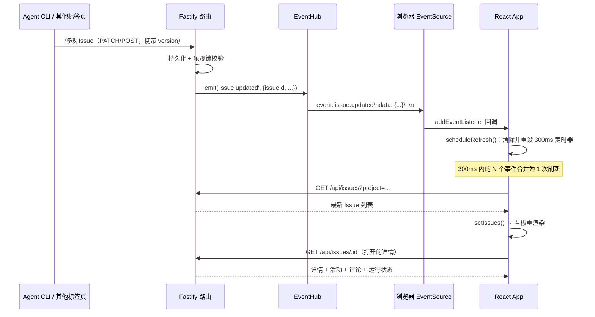
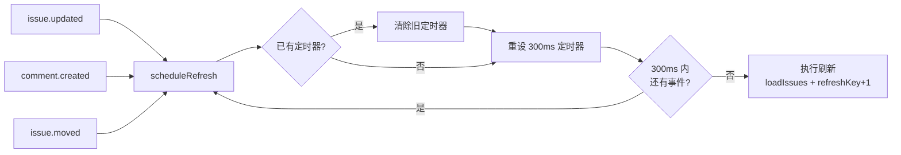

多 Agent 并行工作的看板必须回答一个问题：**当别人（另一个浏览器标签页、另一个 Agent CLI）修改了 Issue 时，我怎么知道？** 本页剖析 super-cli 前端的答案——一条基于原生 `EventSource` 的极简实时同步管线：客户端订阅 `/api/events` 事件流，将 13 类事件**防抖合并**后触发全量重取，而不是在本地应用增量补丁。我们将逐层拆解这条链路：连接生命周期、防抖设计、React 闭包陷阱的规避、两级刷新机制、断线自愈，以及它与乐观锁冲突恢复的协同。

## 实时同步链路总览：通知而非补丁

理解这套机制的关键前提是一个架构决策：**SSE 事件只是"脏标记"，不是数据**。服务端 `EventHub.emit` 广播的帧携带 `issueId`、`identifier` 等标识字段，但客户端完全忽略 payload 内容，收到事件后统一走"重取看板列表"这条最朴素的路径。这牺牲了一点带宽（每次变更重取整个 Issue 列表），换来了零状态合并逻辑——不需要处理"乱序事件""补丁冲突""遗漏事件"这类增量同步的经典难题。

整条链路如下：



服务端侧的产出方非常薄：每个 Issue 路由在写操作成功后调用一次 `hub.emit`，例如创建 Issue 时广播 `issue.created`，移动列时广播 `issue.moved`（携带新 `status`）[issues.ts](src/server/routes/issues.ts#L65)、[issues.ts](src/server/routes/issues.ts#L134)。唯一的订阅入口是 `GET /api/events`，它通过 `reply.hijack()` 绕过 Fastify 的常规响应生命周期，把原始 socket 交给 `EventHub.subscribe` 写入 SSE 头并挂起长连接 [issues.ts](src/server/routes/issues.ts#L339-L342)。事件类型全集与 EventHub 的广播/心跳实现属于服务端专题，详见 [SSE 实时事件推送：EventHub 设计与事件类型](16-sse-shi-shi-shi-jian-tui-song-eventhub-she-ji-yu-shi-jian-lei-xing)；本页聚焦消费端。

Sources: [events.ts](src/server/events.ts#L3-L58), [issues.ts](src/server/routes/issues.ts#L339-L342)

## 连接建立：单例 EventSource 与 13 类订阅事件

前端在 `App` 组件根级用一个**空依赖数组的 `useEffect`** 建立唯一的 SSE 连接——整个应用生命周期内只 `new` 一次 `EventSource('/api/events')`，卸载时 `close()`。连接不区分当前视图：即使你停留在 Session 列表页，事件流也在后台持续到达，切换到看板时数据已是新的 [App.tsx](src/web/src/App.tsx#L325-L351)。

订阅采用显式的事件名列表，通过循环 `addEventListener` 逐一注册：

```typescript
const eventNames = [
  'issue.created', 'issue.updated', 'issue.moved', 'issue.archived', 'issue.restored',
  'issue.deleted', 'issue.relation.updated', 'comment.created', 'comment.updated', 'comment.deleted',
  'run.started', 'run.finished', 'idea.promoted',
];
eventNames.forEach(name => es.addEventListener(name, scheduleRefresh));
```

值得注意的取舍是：服务端定义了 21 种事件类型（还包括 `idea.created`、`agent.created` 等），但前端只订阅与看板渲染相关的 13 种 [events.ts](src/server/events.ts#L3-L24)。Ideas 视图列表与 Agent 配置页不在 SSE 刷新范围内——它们的变更靠自身操作的回写或手动刷新。所有被订阅的事件对 `scheduleRefresh` 一视同仁，不做分型处理。

| 事件类别 | 订阅的事件 | 服务端触发动作 |
|---|---|---|
| Issue 生命周期 | `issue.created` / `issue.updated` / `issue.moved` / `issue.archived` / `issue.restored` / `issue.deleted` | 创建、PATCH 更新、拖拽移列、归档/恢复/删除 [issues.ts](src/server/routes/issues.ts#L65-L166) |
| Issue 关系 | `issue.relation.updated` | 添加/删除父子、阻塞、关联关系（双向广播源与目标）[issues.ts](src/server/routes/issues.ts#L182-L194) |
| 评论 | `comment.created` / `comment.updated` / `comment.deleted` | 评论增改删（卡片上的评论计数徽章依赖它）[issues.ts](src/server/routes/issues.ts#L220-L248) |
| 执行运行 | `run.started` / `run.finished` | TaskRunner 的启动/结束事件透传（`run.output` 因过于高频被服务端过滤）[index.ts](src/server/index.ts#L39-L42) |
| Idea | `idea.promoted` | Idea 升格为 Issue 时额外通知 |

Sources: [App.tsx](src/web/src/App.tsx#L324-L351)

## 防抖合并：300ms 窗口内的 N 个事件一次刷新

`scheduleRefresh` 是整条管线的节流阀，实现只有一个 `setTimeout` 技巧：每次事件到达都**清除**上一个定时器并**重设**一个新的 300ms 定时器。只有当 300ms 内没有新事件时，刷新才真正执行 [App.tsx](src/web/src/App.tsx#L329-L335)：

```typescript
const scheduleRefresh = () => {
  if (timer) clearTimeout(timer);
  timer = setTimeout(() => {
    loadIssuesRef.current();
    setIssueRefreshKey(k => k + 1);
  }, 300);
};
```

这个设计针对的是真实的高频场景：一个 Agent 完成 `super-cli issue claim` 到 `issue move` 的完整工作流，会在几秒内连续产生 `issue.updated`、`comment.created`、`issue.moved` 多个事件；批量导入或恢复归档时更是事件风暴。防抖把 N 次潜在的网络请求与 React 重渲染压缩成最后一次，且因为刷新是全量重取，**丢弃中间事件不丢数据**——最新的列表快照天然包含所有变更的累积效果。



Sources: [App.tsx](src/web/src/App.tsx#L329-L335)

## 闭包陷阱：loadIssuesRef 如何保证过滤条件不失效

SSE 副作用的依赖数组是空的 `[]`，这意味着闭包里的 `scheduleRefresh` 在首次挂载时就固化了。但 `loadIssues` 每次渲染都是新函数——它内部读取的 `selectedProject` 决定了重取哪个项目的 Issue。如果直接在 effect 里引用 `loadIssues`，用户切换项目后，SSE 触发的刷新仍会请求**旧项目**的数据，把错误的列表覆盖进状态。

代码用了两件武器解决这个问题。其一是 `loadIssuesRef`：一个每轮渲染都同步更新为最新 `loadIssues` 闭包的 ref [App.tsx](src/web/src/App.tsx#L319-L322)：

```typescript
const loadIssuesRef = useRef<() => Promise<void>>(async () => {});
useEffect(() => {
  loadIssuesRef.current = loadIssues;
});
```

SSE 回调通过 `loadIssuesRef.current()` 调用，永远拿到当次渲染的最新闭包。其二是初始挂载时的刻意绕行——加载 Issue 的 effect 直接调用 `void loadIssues()` 而非走 ref，源码注释点明了原因："going through loadIssuesRef here would execute the PREVIOUS render's closure (stale project filter)"，因为该 effect 只依赖 `selectedProject`，首次执行时 ref 尚未更新 [App.tsx](src/web/src/App.tsx#L288-L293)。

`loadIssues` 本身很薄：按当前项目过滤参数重取 `GET /api/issues`，替换整个 `issues` 状态，并处理一个细节——若存在"待跳转"的 Issue 短编号（如从 Idea 卡片跳转过来），在列表就绪后完成选中 [App.tsx](src/web/src/App.tsx#L295-L317)。

Sources: [App.tsx](src/web/src/App.tsx#L288-L322)

## 两级刷新：看板列表 + 打开的详情面板

防抖定时器触发时执行的是**两个**动作，分别服务于两级 UI：

1. **`loadIssuesRef.current()`** —— 重取看板列表。看板渲染是一条纯派生链：`filteredIssues`（`useMemo` 过滤 + 排序）→ 按 `ISSUE_COLUMNS` 定义的 7 列分组 → 每列内按 `sortOrder` 排序铺出卡片 [App.tsx](src/web/src/App.tsx#L1112-L1156)。`issues` 状态一换，看板、卡片视图、列表视图三个视图自动同步，无需视图层感知 SSE 的存在。

2. **`setIssueRefreshKey(k => k + 1)`** —— 一个递增计数器，作为 `refreshKey` prop 传给右侧打开的 `IssueDetail` 面板 [App.tsx](src/web/src/App.tsx#L1345-L1357)。IssueDetail 内部有两个 effect 把它列为依赖：一个重取执行运行状态（`loadRuns`，驱动"运行中/已结束"时间线），一个重取完整详情（Issue 本体、关系、评论）[IssueDetail.tsx](src/web/src/components/IssueDetail.tsx#L134-L146)、[IssueDetail.tsx](src/web/src/components/IssueDetail.tsx#L173-L177)。没有这个机制，正在查看某 Issue 详情的用户会眼睁睁看着它"过期"——别人改了优先级、加了评论，详情面板却纹丝不动。

值得注意的是刷新的**边界**：SSE 刷新不触碰 `sessions` 状态。看板卡片上的"agent 处理中…"动态指示灯来自 `issue.sessionIds` 与会话列表的交叉计算——只有绑定的会话进程处于活跃状态才亮起 [IssueCard.tsx](src/web/src/components/IssueCard.tsx#L31-L33)，而会话的 `active` 标志依赖 `loadSessions` 的执行周期（项目切换、Provider 过滤变化时），不随 SSE 事件刷新。这是刻意的职责切分：SSE 管的是 Issue 域数据，会话域数据由会话索引的独立刷新节奏负责。

Sources: [App.tsx](src/web/src/App.tsx#L658), [App.tsx](src/web/src/App.tsx#L1345-L1357)

## 断线自愈：原生重连 + 首开后的全量兜底

SSE 的容错几乎全部由浏览器 `EventSource` 原生机制承担：连接中断后浏览器会自动按内置退避策略重连，前端没有写任何重试循环。前端补的只有一处**数据补偿**：`onopen` 回调配合 `openedOnce` 标志，区分"首次连接"与"重连"——首次打开不做任何事（挂载时的 `loadData` 已负责初始加载）；而任何一次重连成功后，立即触发一次 `scheduleRefresh` 全量刷新 [App.tsx](src/web/src/App.tsx#L342-L346)：

```typescript
es.onopen = () => {
  // Auto-reconnect: do a full refresh on every reconnect after the first open.
  if (openedOnce) scheduleRefresh();
  openedOnce = true;
};
```

这个兜底是必要的：断线窗口期内发生的事件对客户端永久丢失（SSE 不补发历史），如果只靠后续事件驱动刷新，看板会停留在旧快照上。重连即重取，用一次全量同步抹平整个断线区间的不确定性。服务端配合了两层保活：`EventHub` 每 20 秒向所有客户端写一行 `: keep-alive` 注释帧防止中间代理断开空闲连接 [events.ts](src/server/events.ts#L32-L39)，订阅时同样先发 `: connected` 注释帧。

Sources: [App.tsx](src/web/src/App.tsx#L342-L351), [events.ts](src/server/events.ts#L41-L51)

## 与乐观锁冲突恢复的协同：409 即刷新

SSE 全量重取在代码中被明确标注了双重身份："Refetch issues for the current project filter (**used by SSE events and conflict recovery**)" [App.tsx](src/web/src/App.tsx#L295)。第二条身份来自乐观锁：所有 Issue 写操作都必须携带本地持有的 `version` 字段，服务端发现版本不匹配时返回 HTTP 409（VERSION_CONFLICT），前端捕获后以"刷新"作为恢复手段 [client.ts](src/web/src/api/client.ts#L293-L314)。这套机制的服务端原理详见 [乐观锁机制：version 字段与多 Agent 并发写安全](13-le-guan-suo-ji-zi-duan-yu-duo-agent-bing-fa-xie-an-quan)。

两条冲突恢复路径的实现完全同构，都遵循"提示 → 重取 → 以服务端状态覆盖本地"：

| 位置 | 冲突检测 | 恢复动作 | 源码 |
|---|---|---|---|
| 看板拖拽移列 | `moveIssue` 抛出 `ApiError` 且 `status === 409` | `alert('数据已被修改，正在刷新')` 后调用 `loadIssues()` 重取看板 | [App.tsx](src/web/src/App.tsx#L444-L461) |
| 详情面板任意变更（改标题/优先级/标签/描述、绑定会话、移动状态） | `run()` 辅助函数统一捕获 409 | alert 提示后调用 `load()` 重取整个详情 | [IssueDetail.tsx](src/web/src/components/IssueDetail.tsx#L179-L199) |

错误载体是自定义的 `ApiError`，它把 HTTP 状态码与服务端错误码（如 `VERSION_CONFLICT`）从裸 `fetch` 的 Response 中解析出来随异常抛出，让业务代码能用 `e.status === 409` 做精准分支 [client.ts](src/web/src/api/client.ts#L249-L266)。

这里能看到与 SSE 的精妙互补：**自己发起的变更**走"响应回写"路径——`handleIssueChanged` 把 mutation 返回的最新 Issue 直接合并进看板列表 [App.tsx](src/web/src/App.tsx#L434-L442)，不等待 SSE 往返；**别人的变更**走"SSE 触发重取"路径；**并发冲突**走"409 触发重取"路径。三条路径殊途同归于 `loadIssues` 的全量快照，这正是通知式同步架构的红利：不存在本地增量状态需要修补，任何"我不确定数据新不新鲜"的时刻，答案都是重取一次。

另一个细节是**删除场景**的兜底：当别人删除了你正在查看的 Issue，SSE 重取会让它从看板上消失，而详情面板的重取会命中 404，`IssueDetail` 捕获后置 `notFound` 状态展示占位视图 [IssueDetail.tsx](src/web/src/components/IssueDetail.tsx#L120-L124)——无需专门的事件处理逻辑。

Sources: [App.tsx](src/web/src/App.tsx#L444-L461), [client.ts](src/web/src/api/client.ts#L249-L266)

## 设计取舍与边界

把这条同步管线的特征收敛为一张对照表，便于评估它在其他项目中的可迁移性：

| 维度 | 本项目的选择 | 代价与收益 |
|---|---|---|
| 同步模型 | 通知式（重取快照），非增量补丁 | 收益：无合并逻辑、天然抗乱序；代价：每次变更全列表重取 |
| 事件 payload | 客户端完全忽略，仅凭事件名触发 | 收益：前后端解耦，服务端可自由演进 payload；代价：无法做细粒度局部更新 |
| 事件订阅 | 13 种事件统一映射到同一刷新函数 | 收益：新增事件类型只需加一个名字；代价：无法按事件定制视图行为 |
| 连接管理 | 单例 EventSource 全局共享，不区分视图 | 收益：一个连接服务所有视图，切换视图零成本；代价：后台持续接收无关事件 |
| 会话域数据 | 不纳入 SSE 刷新范围 | 收益：避免会话索引的高频重建；代价："处理中"指示灯有延迟 |
| 冲突处理 | 409 → 提示 → 全量重取（无自动合并） | 收益：实现极简、行为可预期；代价：用户未保存的编辑被服务端状态覆盖 |

两个开发环境相关的细节值得留意。其一，Vite 开发服务器把 `/api` 代理到 `http://localhost:3000`，`EventSource('/api/events')` 的相对路径在 dev 与生产（Fastify 静态托管同源）下都成立 [vite.config.ts](src/web/vite.config.ts#L13-L14)。其二，SSE 连接不受 React 18 严格模式双挂载影响——effect 清理函数会 `close()` 第一次挂载的连接，第二次挂载建立新连接，最终只保留一条。

Sources: [vite.config.ts](src/web/vite.config.ts#L13-L14)

## 延伸阅读

- 服务端这半条链路——`EventHub` 的连接管理、事件类型全集、keep-alive 设计——见 [SSE 实时事件推送：EventHub 设计与事件类型](16-sse-shi-shi-shi-jian-tui-song-eventhub-she-ji-yu-shi-jian-lei-xing)
- 为什么 409 冲突需要"重取"而不是"重试"——`version` 字段的并发控制原理见 [乐观锁机制：version 字段与多 Agent 并发写安全](13-le-guan-suo-ji-zi-duan-yu-duo-agent-bing-fa-xie-an-quan)
- 本文涉及的 `issues` 状态如何渲染为看板、拖拽移列的完整交互见 [看板 / 卡片 / 列表三视图实现与拖拽交互](23-kan-ban-qia-pian-lie-bao-san-shi-tu-shi-xian-yu-tuo-zhuai-jiao-hu)
- `App.tsx` 中看板、详情面板、会话列表的整体组织方式见 [React 应用架构：单页路由与视图组织](22-react-ying-yong-jia-gou-dan-ye-lu-you-yu-shi-tu-zu-zhi)