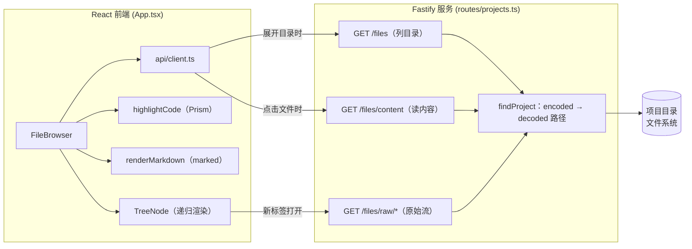
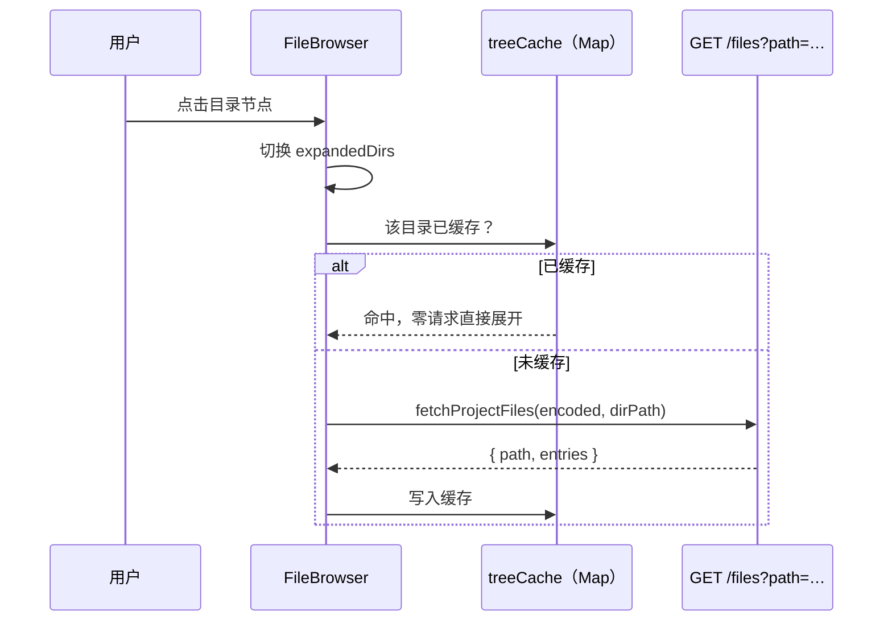
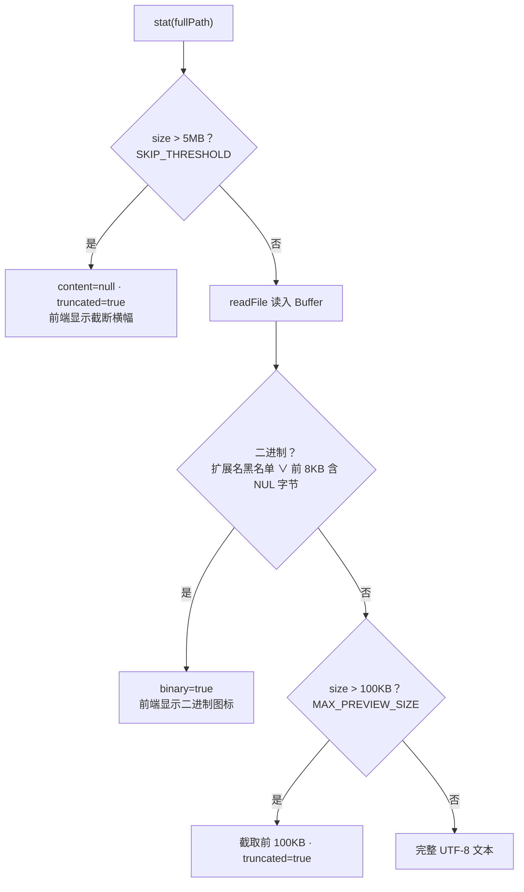

super-cli 的 Web 看板不仅在浏览器里展示 Issue 与会话，还内置了一个轻量的项目文件浏览器：开发者可以在不离开看板的情况下展开项目目录、预览任意源码文件，并直接阅读 Markdown 文档（如 PRD、README）。本文拆解它的三个核心能力——**按需加载的目录树**、**基于 Prism 的语法高亮**与**基于 marked 的 Markdown 渲染**——以及支撑它们的服务端文件端点设计。所有实现集中在前端 `App.tsx` 的 `FileBrowser` 组件、API 封装 `client.ts`，和服务端 `routes/projects.ts` 的三个只读端点中。

## 组件定位：任务模式右侧面板中的"文件"标签页

文件浏览器并非独立页面，而是任务模式下右侧项目面板的一个标签页。面板本身是 `position: fixed` 的悬浮层（默认宽度 360px，可拖拽调整，初始取视口三分之一），内部通过 `overlayTab` 状态在"详情"与"文件"两个标签间切换；当 `overlayTab === 'files'` 时，才挂载 `FileBrowser` 组件并传入项目的 `encoded` 标识。面板数据的加载由一个 `useEffect` 驱动：只要右侧面板打开且选中项目变化，就调用 `fetchProjectDetail` 拉取项目详情，组件再从中取出 `encoded` 使用。

Sources: [App.tsx](src/web/src/App.tsx#L212-L216) [App.tsx](src/web/src/App.tsx#L538-L547) [App.tsx](src/web/src/App.tsx#L1387-L1390) [App.tsx](src/web/src/App.tsx#L1436-L1438) [index.css](src/web/src/index.css#L3604-L3624)

布局上，`FileBrowser` 渲染为一个左右分栏的 `.file-browser` 容器（高度约 80vh 减去头部，最小 300px）：左侧 `.file-tree` 固定 240px 宽、独立纵向滚动；右侧 `.file-preview` 占据剩余空间，负责文件内容预览。这种"窄树 + 宽预览"的结构与 VS Code 等编辑器的资源管理器一致，在悬浮面板的有限宽度内最大化了预览区域。

Sources: [App.tsx](src/web/src/App.tsx#L1828-L1871) [index.css](src/web/src/index.css#L699-L768)

## 端到端架构：三层协作与数据流

整个文件浏览器的数据流横跨三层：React 组件层只维护两个核心缓存状态（目录树缓存与选中文件），通过 `api/client.ts` 的两个封装函数访问服务端；Fastify 路由层提供三个只读端点，每个端点都先经过 `findProject` 把 `encoded` 解析为磁盘上的真实项目路径（`decoded`），再做路径安全校验后访问文件系统。语法高亮与 Markdown 渲染则完全发生在浏览器端——服务端只返回原始文本，不参与任何富文本转换。

值得注意的分工边界：`FileBrowser` 自身不持有文件系统知识，扩展名到语言的映射、高亮与 Markdown 转换都是前端的纯函数（`getLang` / `highlightCode` / `renderMarkdown`）；服务端的职责则收窄为"安全地读"，即项目解析、路径越界校验、二进制判定与截断。

Sources: [App.tsx](src/web/src/App.tsx#L13-L31) [client.ts](src/web/src/api/client.ts#L233-L245) [projects.ts](src/server/routes/projects.ts#L49-L64)

## 按需加载：treeCache 与递归 TreeNode

`FileBrowser` 的按需加载策略围绕两个状态展开：`treeCache` 是一个 `Map<string, DirEntry[]>`，键为目录相对路径（根目录用空字符串 `''`），值为该目录的直接子项列表；`expandedDirs` 是一个 `Set<string>`，记录已展开的目录。组件挂载（或切换项目，依赖 `encoded` 变化）时只请求根目录一层；此后每次用户点击目录节点，`toggleDir` 先切换展开状态，再检查 `treeCache` 中是否已有该目录的缓存——**已缓存则零请求直接展开，未缓存才发起 `fetchProjectFiles` 请求**，并把结果并入缓存。这意味着折叠再展开同一目录不会产生重复网络开销。

Sources: [App.tsx](src/web/src/App.tsx#L1791-L1815) [client.ts](src/web/src/api/client.ts#L233-L238)

渲染侧采用**递归组件**模式：`TreeNode` 接收当前层级的 `entries` 数组，对每个条目计算 `fullPath`（父路径 + `/` + 名称），目录条目在展开且缓存命中时递归渲染下一层 `TreeNode`，缩进通过 `paddingLeft: level * 16 + 8` 内联样式实现。目录与文件的视觉区分依赖两个内联 SVG 图标，展开状态则由一个旋转 90 度的 chevron 符号表达。每个文件条目还附带一个"新标签打开"的外链按钮（详见后文 raw 端点一节），并通过 `e.stopPropagation()` 避免触发文件选中。

Sources: [App.tsx](src/web/src/App.tsx#L1875-L1940)

服务端的列目录端点 `GET /api/projects/:encoded/files` 与之配合：先用 `resolve(rootDir, relativePath)` 拼出绝对路径，并校验结果必须以项目根目录为前缀（防止 `../` 路径穿越），然后 `readdir` 读取一层目录。它维护了一个 `IGNORED_ENTRIES` 集合，静默过滤 `.git`、`node_modules`、`dist`、`__pycache__` 等依赖与构建产物目录；对每个文件条目额外 `stat` 取大小、`extname` 取扩展名，最后按"目录优先、名称字典序"排序返回。配合前端的按需拉取，即使项目有数千个文件，初始加载也只涉及根目录的一次 `readdir`。

Sources: [projects.ts](src/server/routes/projects.ts#L190-L234) [projects.ts](src/server/routes/projects.ts#L15-L18)

## 文件内容端点：路径越界防护、二进制检测与 100KB 截断

点击文件后，前端调用 `GET /api/projects/:encoded/files/content?path=…`，服务端在返回内容前执行了一条多级判定管线，其决策逻辑如下：

Sources: [projects.ts](src/server/routes/projects.ts#L236-L286)

这条管线里有三个值得关注的细节。**第一是双重二进制检测**：扩展名黑名单（`BINARY_EXTENSIONS`，涵盖图片、音视频、压缩包、字体、Office 文档等）是快速通道，而"前 8192 字节中是否含 `0x00`"是对无扩展名或未知扩展名二进制文件的内容级兜底——这是 Unix 生态判定文本文件的经典启发式。**第二是双层截断**：5MB 以上的文件直接放弃读取（返回 `content: null`），只回传大小；100KB 以内的正常文件若超出预览上限，则读全文但只下发前 100KB，`truncated` 标记让前端渲染"文件过大，仅显示前 100KB"的横幅。**第三是统一的路径校验**：与列目录端点一致，`resolve` 后必须以 `rootDir` 开头，否则返回 403。

Sources: [projects.ts](src/server/routes/projects.ts#L20-L27) [projects.ts](src/server/routes/projects.ts#L263-L281)

前端收到响应后按 `binary` / `truncated` / 内容语言三类分支渲染：加载中显示占位文案，二进制文件显示专门的图标与格式化后的大小（`formatSize` 支持 B / KB / MB 三档），文本文件则在头部条展示相对路径与大小，截断时叠加横幅提示。

Sources: [App.tsx](src/web/src/App.tsx#L1843-L1862) [App.tsx](src/web/src/App.tsx#L1748-L1752)

## 语法高亮：Prism 按需注册语言与降级策略

高亮方案选择的是 **Prism.js 的客户端渲染**：`App.tsx` 顶部以静态 import 的方式注册了 15 个语言包（TypeScript、JSX/TSX、JSON、CSS、Bash、Python、YAML、TOML、Markdown、SQL、Rust、Go、Java、Docker），并引入 `prism-tomorrow` 主题样式。由于这些语言包在构建期就随主包打包，运行时无需任何按需加载或 Web Worker，代价是主 bundle 略有膨胀——对一个本地工具而言是合理的取舍。

Sources: [App.tsx](src/web/src/App.tsx#L13-L29) [package.json](package.json#L59-L65)

扩展名到 Prism 语言的映射由 `EXT_TO_LANG` 表驱动，配合 `getLang` 函数处理三类特例：文件名恰为 `dockerfile` / `makefile` 的无扩展名文件、`.d.ts` 声明文件，以及 GraphQL 文件复用 TypeScript 语法（`.graphql` / `.gql`）。`highlightCode` 的降级策略非常克制——**任何一步失败都退回 `escapeHtml` 纯文本转义**，而非报错：找不到语言映射、Prism 未注册对应语法，均输出转义后的纯文本，保证任何文件都能安全展示。

| 扩展名 | Prism 语言 | 扩展名 | Prism 语言 |
| --- | --- | --- | --- |
| `ts` / `.d.ts` | typescript | `md` / `mdx` | markdown |
| `tsx` / `jsx` / `js` / `mjs` | tsx / jsx | `sql` | sql |
| `json` | json | `rs` | rust |
| `css` / `scss` / `less` | css | `go` | go |
| `sh` / `bash` / `zsh` | bash | `java` | java |
| `py` | python | `html` / `xml` / `svg` | markup |
| `yml` / `yaml` / `toml` | yaml / toml | `graphql` / `gql` | typescript |

Sources: [App.tsx](src/web/src/App.tsx#L1754-L1781)

高亮结果通过 `dangerouslySetInnerHTML` 注入 `<pre><code>` 元素，配合 `prism-tomorrow` 主题与 `index.css` 中的字号、行高、等宽字体覆盖。对无扩展名映射的文件，`escapeHtml` 仅转义 `&`、`<`、`>` 三个字符——对纯文本展示而言足够，因为 Prism 输出的 HTML 本身就只包含这几类需要转义的原始字符。

Sources: [App.tsx](src/web/src/App.tsx#L1775-L1785) [App.tsx](src/web/src/App.tsx#L1866) [index.css](src/web/src/index.css#L805-L816) [index.css](src/web/src/index.css#L925-L929)

## Markdown 渲染：marked 同步解析与主题化样式

Markdown 文件走的是与代码高亮不同的分支：`getLang(path)` 返回 `'markdown'` 时，内容交给 `renderMarkdown`，即 `marked.parse(md, { async: false })` 的同步解析，产物 HTML 直接注入 `.file-md-body` 容器。这个分支的存在让仓库中的 README、`docs/` 下的 PRD 与 issue 工作流文档可以在看板内直接以排版后的形态阅读，而无需切换到编辑器或 GitHub。

Sources: [App.tsx](src/web/src/App.tsx#L1863-L1867) [App.tsx](src/web/src/App.tsx#L1787-L1789)

渲染后的排版质量完全由约 80 行 `file-md-body` 专用 CSS 支撑：六级标题统一收紧外边距、一二级标题带底部分隔线；行内代码与代码块分别使用主题输入色背景；引用块以强调色左边线标识；表格采用全宽合并边框、表头加深背景；图片限制 `max-width: 100%` 防止溢出。所有颜色均取自 CSS 变量（`var(--border-color)`、`var(--accent)` 等），因此 Markdown 阅读体验会自动跟随应用的多主题切换——这部分主题体系在[多主题系统与全局 UI 体系](26-duo-zhu-ti-xi-tong-yu-quan-ju-ui-ti-xi)中有系统阐述。

Sources: [index.css](src/web/src/index.css#L844-L923)

一个如实的事实描述：前端未引入 DOMPurify 之类的净化库，`marked` 的输出未经消毒即注入 DOM。这与该工具的定位一致——`serve` 默认监听本地回环地址、渲染的是开发者自己机器上的文件，攻击面与直接用编辑器打开文件相当；但若未来需要预览不可信来源的 Markdown，这里是需要补上净化层的位置。

Sources: [App.tsx](src/web/src/App.tsx#L1864-L1866)

## 原始文件流：raw 端点与浏览器原生渲染

除了面板内预览，目录树中每个文件还有一个"在新页面打开"的外链，指向 `GET /api/projects/:encoded/files/raw/<相对路径>`。这个端点用 `createReadStream` 流式返回原始文件，并根据扩展名精心选择 `Content-Type`：HTML、SVG、PDF、图片、音视频、JSON 等浏览器可内联渲染的类型映射到对应 MIME；黑名单中的二进制类型回落到 `application/octet-stream`（触发下载）；其余一律按 `text/plain` 内联展示文本。

Sources: [projects.ts](src/server/routes/projects.ts#L288-L334) [App.tsx](src/web/src/App.tsx#L1909-L1920)

端点同时注册了 `?path=` 查询参数与 `/raw/*` 通配路径两种 URL 形式，代码注释明确说明后者存在的理由：**path 风格的 URL 能把真实文件名保留在 `location.pathname` 中**，使浏览器扩展（注释中举例 docu.md Markdown Viewer）能凭 `.md` 扩展名识别文件并提供它们自己的渲染。这是"服务端按浏览器原生能力分工"的典型设计——面板内渲染交给 Prism/marked，面板外渲染交给浏览器与其扩展生态，两者互不重复造轮子。原始流的路径校验逻辑与前两个端点完全一致（`resolve` + 前缀校验 + 目录请求返回 400），三个端点共同构成一套统一的安全边界。

Sources: [projects.ts](src/server/routes/projects.ts#L292-L313) [projects.ts](src/server/routes/projects.ts#L333-L334)

## 三个文件端点对比与设计权衡

| 端点 | 消费方 | 返回形式 | 关键行为 |
| --- | --- | --- | --- |
| `GET /files` | `fetchProjectFiles` | JSON 目录条目数组 | 过滤忽略目录、附带 size/extension、目录优先排序 |
| `GET /files/content` | `fetchProjectFileContent` | JSON（content/binary/truncated/size） | 5MB 拒读、双重二进制检测、100KB 截断 |
| `GET /files/raw/*` | 浏览器新标签 | 原始字节流 | Content-Type 协商、流式发送、支持 path 风格 URL |

Sources: [projects.ts](src/server/routes/projects.ts#L190-L334)

回看整体，这套实现体现了几个贯穿一致的设计决策：**按需加载**（目录逐层拉取、缓存于前端 Map）让大仓库的首屏成本恒定；**渲染职责前置到客户端**（服务端只返回安全裁剪过的原始文本）让高亮与 Markdown 能力随前端包分发、无服务端依赖；**降级而非报错**（未知语言退纯文本、二进制退图标、超大文件退横幅）保证了任意文件都有可预期的展示结果。安全边界则统一收敛在 `resolve` + 根目录前缀校验这一个模式上，三个端点无一例外。

## 延伸阅读

- 理解 `encoded` / `decoded` 双标识与 `findProject` 的别名匹配机制，见[项目路径编码：跨 Provider 的目录命名映射与解码](10-xiang-mu-lu-jing-bian-ma-kua-provider-de-mu-lu-ming-ming-ying-she-yu-jie-ma)
- 文件浏览器在整个前端应用中的挂载位置与路由组织，见[React 应用架构：单页路由与视图组织](22-react-ying-yong-jia-gou-dan-ye-lu-you-yu-shi-tu-zu-zhi)
- 主题变量（`--accent`、`--border-color` 等）如何驱动 Markdown 样式随主题切换，见[多主题系统与全局 UI 体系](26-duo-zhu-ti-xi-tong-yu-quan-ju-ui-ti-xi)